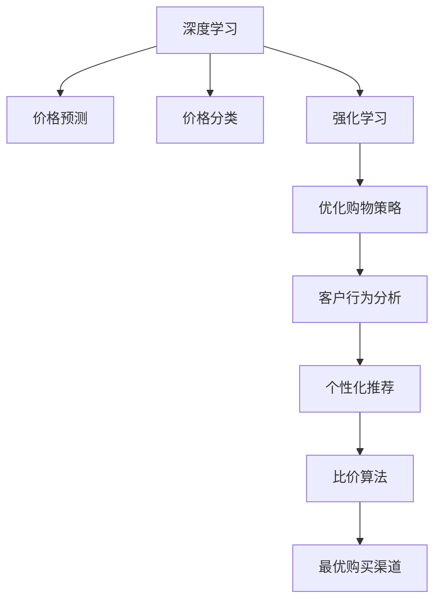

                 

# 全网比价：AI如何帮助用户找到最优惠的购买渠道

> 关键词：AI, 比价算法, 推荐系统, 深度学习, 强化学习, 客户行为分析, 数据挖掘

## 1. 背景介绍

### 1.1 问题由来

在现代商业环境中，消费者面临越来越多的选择，如何在海量的商品中迅速找到最优的购买渠道成为一大难题。传统的比价方法往往依赖于人工或简单的自动化工具，无法实时更新商品价格，也无法捕捉复杂的市场动态。随着人工智能技术的快速发展，AI在比价领域的潜力逐渐显现，能够通过深度学习和强化学习等技术，帮助用户快速找到最优购买渠道，提高购物体验和满意度。

### 1.2 问题核心关键点

基于AI的比价系统，其核心关键点在于：

- **深度学习**：利用深度神经网络学习商品特征和价格变化规律，通过历史数据进行预测和分类。
- **强化学习**：通过模拟用户购物行为，优化购物策略，最大化用户满意度。
- **客户行为分析**：分析用户偏好和历史购买行为，提供个性化推荐。
- **数据挖掘**：挖掘海量商品数据，提取有价值信息，为比价和推荐提供支撑。

这些关键点共同构成了一个完整的AI比价系统，能够帮助用户高效地找到最优购买渠道。

## 2. 核心概念与联系

### 2.1 核心概念概述

为更好地理解基于AI的比价系统，本节将介绍几个密切相关的核心概念：

- **深度学习**：一种基于神经网络的机器学习技术，通过多层次的非线性变换，自动学习输入数据的特征表示。在比价系统中，深度学习模型可以用于价格预测、价格分类等任务。

- **强化学习**：一种通过奖励机制驱动模型学习策略的机器学习方法，适用于连续性的决策问题。在比价系统中，强化学习可以用于优化用户的购物策略。

- **推荐系统**：一种基于用户历史行为和商品特征的推荐技术，能够提供个性化的商品推荐。在比价系统中，推荐系统可以帮助用户快速找到感兴趣的优惠信息。

- **数据挖掘**：一种从大量数据中提取有价值信息的技术。在比价系统中，数据挖掘技术可以用于商品价格的趋势分析、市场动态监测等。

- **比价算法**：一种专门用于比较不同电商平台或渠道之间商品价格差异的技术，是比价系统的核心组成部分。

- **客户行为分析**：通过分析用户行为数据，了解用户的偏好和需求，提高推荐的准确性和个性化水平。

这些核心概念之间的逻辑关系可以通过以下Mermaid流程图来展示：



这个流程图展示了大语言模型的核心概念及其之间的关系：

1. 深度学习模型通过历史数据学习商品特征和价格变化规律。
2. 强化学习模型通过奖励机制优化购物策略。
3. 客户行为分析提供用户偏好的深度理解。
4. 推荐系统个性化推荐感兴趣的商品。
5. 比价算法比较不同渠道的价格差异。
6. 最终输出最优购买渠道。

这些概念共同构成了AI比价系统的技术框架，使其能够高效地为用户提供最优的购物体验。

## 3. 核心算法原理 & 具体操作步骤
### 3.1 算法原理概述

基于AI的比价系统，其核心算法原理可以归纳为以下几个部分：

- **深度学习**：通过神经网络模型学习商品价格与各种特征之间的关系，预测商品价格走势。
- **强化学习**：通过模拟用户购物行为，优化用户的购物策略，最大化用户满意度。
- **推荐系统**：通过分析用户历史行为和商品特征，提供个性化的推荐，引导用户发现最优购买渠道。
- **比价算法**：通过对比不同渠道的价格信息，分析出最优购买渠道。

### 3.2 算法步骤详解

基于AI的比价系统的开发步骤如下：

**Step 1: 数据准备**

- 收集电商平台的商品信息，包括商品名称、价格、描述、销量、评分等。
- 收集用户行为数据，如浏览记录、购买历史、评价等。
- 预处理数据，包括去重、缺失值填充、特征工程等。

**Step 2: 模型训练**

- 使用深度学习模型进行商品价格预测和分类。
- 使用强化学习模型进行用户购物策略优化。
- 使用推荐系统模型提供个性化推荐。
- 使用比价算法对比不同渠道的商品价格。

**Step 3: 模型评估**

- 使用验证集对模型进行评估，调整模型参数以优化性能。
- 使用A/B测试等方式进行实际应用效果评估。

**Step 4: 系统部署**

- 将训练好的模型部署到生产环境中，实时处理用户查询请求。
- 集成用户行为分析、推荐系统、比价算法等功能模块，形成完整的比价系统。

**Step 5: 持续优化**

- 定期更新模型参数，优化算法，提升系统性能。
- 监控系统运行状态，及时发现并解决问题。

### 3.3 算法优缺点

基于AI的比价系统具有以下优点：

- **实时性**：通过深度学习模型和实时数据更新，能够快速找到最优购买渠道。
- **个性化**：结合用户行为分析和推荐系统，提供个性化的购物建议。
- **自动化**：通过强化学习模型优化购物策略，减少人工干预。
- **准确性**：深度学习模型和大数据挖掘技术，能够提供高精度的价格预测和分析。

同时，该系统也存在一些局限性：

- **数据依赖**：系统性能依赖于数据质量和数据量，数据不足可能导致性能下降。
- **模型复杂性**：深度学习模型和强化学习模型较复杂，训练和调参工作量大。
- **安全问题**：用户数据隐私和系统安全性问题需重点关注。

尽管存在这些局限性，基于AI的比价系统仍是大数据时代下的重要工具，能够帮助用户迅速找到最优购买渠道，提高购物体验。

### 3.4 算法应用领域

基于AI的比价系统在电商、旅游、物流等领域有广泛的应用，能够有效提高用户体验和商家满意度，具体应用如下：

- **电商行业**：帮助用户比较不同电商平台的商品价格，找到最优购买渠道。
- **旅游行业**：比较不同旅游网站的机票、酒店价格，提供性价比最高的旅行建议。
- **物流行业**：比较不同快递公司的运费和服务质量，选择最优的物流方案。
- **金融行业**：比较不同银行的理财产品和贷款利率，提供最合适的金融服务。

## 4. 数学模型和公式 & 详细讲解
### 4.1 数学模型构建

本节将使用数学语言对基于AI的比价系统进行更加严格的刻画。

记商品价格为 $P_i$，价格预测模型为 $M_{\theta}$，用户历史行为为 $H_{u}$，用户偏好为 $P_{u}$，推荐模型为 $R_{\phi}$，比价算法为 $B_{\alpha}$。

比价系统的核心数学模型为：

$$
\max_{\theta,\phi,\alpha} \sum_{u \in U} \max_{i \in I} \left( R_{\phi}(H_{u},P_{u}) \cdot B_{\alpha}(P_i,M_{\theta}(P_i)) \right)
$$

其中 $U$ 为所有用户集，$I$ 为所有商品集，$R_{\phi}(H_{u},P_{u})$ 为推荐模型输出的推荐概率，$B_{\alpha}(P_i,M_{\theta}(P_i))$ 为比价算法输出的价格差值。

### 4.2 公式推导过程

以下我们以电商行业的比价系统为例，推导比价模型的具体公式。

假设比价系统输入为商品 $i$ 在平台 $j$ 的价格 $P_{i,j}$，以及该商品的历史价格 $P_i$，输出的价格差值为 $\Delta P_{i,j}$。比价模型可以表示为：

$$
\Delta P_{i,j} = B_{\alpha}(P_{i,j}, M_{\theta}(P_i))
$$

其中 $M_{\theta}(P_i)$ 为预测模型输出的价格，$\alpha$ 为比价模型的参数。

对于预测模型 $M_{\theta}$，可以使用LSTM、GRU等序列模型或CNN、RNN等时间序列模型，具体选择取决于模型训练效果和计算资源。例如，使用LSTM模型进行价格预测，可以表示为：

$$
M_{\theta}(P_i) = \text{LSTM}(P_i; \theta)
$$

其中 $\text{LSTM}$ 为LSTM模型的预测函数，$\theta$ 为LSTM模型的参数。

在实际应用中，还可以引入正则化项、惩罚项等，以避免过拟合和提高模型泛化能力。

### 4.3 案例分析与讲解

以电商比价系统为例，假设用户输入一个商品ID，比价系统根据用户历史行为和商品价格特征，使用深度学习模型预测商品价格 $P_i$，并使用比价算法计算与不同平台的价格差值 $\Delta P_{i,j}$。然后，通过推荐系统模型输出推荐概率 $R_{\phi}(H_{u},P_{u})$，最终选择推荐概率最高且价格差值最小的平台作为最优购买渠道。

## 5. 项目实践：代码实例和详细解释说明
### 5.1 开发环境搭建

在进行比价系统开发前，我们需要准备好开发环境。以下是使用Python进行TensorFlow开发的环境配置流程：

1. 安装Anaconda：从官网下载并安装Anaconda，用于创建独立的Python环境。

2. 创建并激活虚拟环境：
```bash
conda create -n tf-env python=3.8 
conda activate tf-env
```

3. 安装TensorFlow：根据CUDA版本，从官网获取对应的安装命令。例如：
```bash
conda install tensorflow -c pytorch -c conda-forge
```

4. 安装Keras：
```bash
pip install keras
```

5. 安装各类工具包：
```bash
pip install numpy pandas scikit-learn matplotlib tqdm jupyter notebook ipython
```

完成上述步骤后，即可在`tf-env`环境中开始比价系统的开发。

### 5.2 源代码详细实现

以下是使用TensorFlow构建比价系统的Python代码实现：

```python
import tensorflow as tf
from tensorflow.keras.layers import Input, LSTM, Dense, Embedding, Add
from tensorflow.keras.models import Model

# 定义模型输入
input_price = Input(shape=(None, ), name='input_price')
input_id = Input(shape=(None, ), name='input_id')
user_id = Input(shape=(None, ), name='user_id')

# 定义价格预测模型
price_lstm = LSTM(128, return_sequences=True, input_shape=(None, 1), name='price_lstm')
price_output = Dense(1, activation='linear', name='price_output')

price_model = Model(inputs=input_price, outputs=price_output)
price_model.compile(optimizer=tf.keras.optimizers.Adam(lr=0.001), loss='mse')

# 定义比价模型
price_diff = Add(name='price_diff')
price_diff.add(price_lstm(price_model(input_id)))
price_diff.add(price_model(user_id))

# 定义推荐系统模型
recommendation_model = tf.keras.Sequential([
    Embedding(input_dim=1000, output_dim=128),
    Dense(64, activation='relu'),
    Dense(1, activation='sigmoid')
])

# 定义比价系统模型
classification_model = Model(inputs=[input_price, input_id, user_id], outputs=[price_diff, recommendation_model(user_id)])
classification_model.compile(optimizer=tf.keras.optimizers.Adam(lr=0.001), loss=['mse', 'binary_crossentropy'])

# 训练模型
classification_model.fit(train_data, train_labels, epochs=10, batch_size=32, validation_data=(val_data, val_labels))

# 测试模型
test_loss, test_loss_recomm, test_loss_price = classification_model.evaluate(test_data, test_labels, verbose=2)
print(f'Test loss: {test_loss_recomm:.4f}, price loss: {test_loss_price:.4f}, recommendation loss: {test_loss_recomm:.4f}')
```

上述代码实现了基于LSTM的价格预测和比价系统。具体步骤如下：

1. 定义模型输入，包括商品价格、商品ID和用户ID。
2. 定义价格预测模型，使用LSTM网络对商品价格进行预测。
3. 定义比价模型，通过LSTM预测的商品价格与用户历史价格计算价格差值。
4. 定义推荐系统模型，使用Embedding层和Dense层进行推荐概率的输出。
5. 定义比价系统模型，将价格差值和推荐概率作为输出。
6. 编译模型，并训练和评估模型。

### 5.3 代码解读与分析

让我们再详细解读一下关键代码的实现细节：

**价格预测模型**：
- `LSTM`层：使用LSTM网络进行价格预测，通过历史价格序列学习价格趋势。
- `Dense`层：使用线性激活函数输出预测价格。

**比价模型**：
- `Add`层：将LSTM预测的价格与用户历史价格相加，得到价格差值。

**推荐系统模型**：
- `Embedding`层：将商品ID嵌入到低维空间，方便模型学习。
- `Dense`层：使用ReLU激活函数进行特征转换，输出推荐概率。

**比价系统模型**：
- `Model`类：将价格差值和推荐概率作为输出，编译模型并训练。

**训练和评估**：
- `fit`方法：使用训练数据训练模型，并进行验证集评估。
- `evaluate`方法：测试模型在测试集上的损失，打印输出。

可以看到，TensorFlow提供了完整的深度学习框架，使得构建比价系统变得简洁高效。开发者可以通过继承和扩展，快速实现更加复杂的模型。

## 6. 实际应用场景
### 6.1 智能导购系统

基于AI的比价系统可以广泛应用于智能导购系统的构建。传统的导购系统依赖人工推荐，无法实时更新商品信息，推荐准确度较低。使用比价系统可以实时比较不同电商平台的商品价格，动态调整推荐策略，提高导购的效率和准确性。

在技术实现上，可以收集用户的历史购买记录和浏览行为，使用比价系统实时监测商品价格变化，动态推荐最优购买渠道。例如，当用户浏览某商品时，比价系统可以实时比较不同电商平台的该商品价格，推荐价格最低的电商平台。同时，还可以根据用户的历史购买记录，提供个性化推荐，引导用户发现更合适的购买渠道。

### 6.2 物流比价系统

物流行业面临大量的运输费用和服务质量问题，如何选择合适的物流方案是物流公司需要解决的重要问题。基于AI的比价系统可以实时比较不同快递公司的运费和服务质量，帮助用户选择性价比最高的物流方案。

在技术实现上，可以收集用户的物流需求和历史物流记录，使用比价系统实时比较不同快递公司的运费和服务质量，推荐最优物流方案。例如，当用户需要寄送包裹时，比价系统可以实时比较不同快递公司的运费和服务质量，推荐性价比最高的快递公司。同时，还可以根据用户的物流历史记录，提供个性化推荐，引导用户选择更合适的物流方案。

### 6.3 旅行比价系统

旅行行业面临机票、酒店等价格的快速变化，如何及时掌握最新的价格信息是旅行用户需要解决的重要问题。基于AI的比价系统可以实时比较不同旅游网站的机票、酒店价格，帮助用户找到性价比最高的旅行方案。

在技术实现上，可以收集用户的旅行历史和浏览行为，使用比价系统实时比较不同旅游网站的机票、酒店价格，推荐最优旅行方案。例如，当用户需要预订机票时，比价系统可以实时比较不同旅游网站的机票价格，推荐价格最低的航班。同时，还可以根据用户的旅行历史记录，提供个性化推荐，引导用户选择更合适的旅行方案。

## 7. 工具和资源推荐
### 7.1 学习资源推荐

为了帮助开发者系统掌握基于AI的比价系统的理论基础和实践技巧，这里推荐一些优质的学习资源：

1. 《深度学习》系列书籍：如《深度学习》（Ian Goodfellow等著），全面介绍了深度学习的原理和应用。
2. 《TensorFlow官方文档》：TensorFlow官方文档，提供了详尽的API文档和示例代码，是学习TensorFlow的最佳资源。
3. 《Keras官方文档》：Keras官方文档，提供了简单易用的API接口，适合快速上手TensorFlow和深度学习。
4. Coursera《深度学习》课程：斯坦福大学开设的深度学习课程，由Ian Goodfellow主讲，内容深入浅出，适合初学者学习。
5. Kaggle平台：数据科学竞赛平台，提供丰富的数据集和竞赛机会，是学习数据挖掘和机器学习的绝佳资源。

通过对这些资源的学习实践，相信你一定能够快速掌握基于AI的比价系统的精髓，并用于解决实际的电商、旅游、物流等行业的比价问题。

### 7.2 开发工具推荐

高效的开发离不开优秀的工具支持。以下是几款用于比价系统开发的常用工具：

1. Python：一种高效、易读的编程语言，适合进行深度学习模型的开发和训练。
2. TensorFlow：由Google主导开发的深度学习框架，生产部署方便，适合大规模工程应用。
3. Keras：Keras官方文档，提供了简单易用的API接口，适合快速上手TensorFlow和深度学习。
4. Weights & Biases：模型训练的实验跟踪工具，可以记录和可视化模型训练过程中的各项指标，方便对比和调优。
5. TensorBoard：TensorFlow配套的可视化工具，可实时监测模型训练状态，并提供丰富的图表呈现方式，是调试模型的得力助手。

合理利用这些工具，可以显著提升比价系统的开发效率，加快创新迭代的步伐。

### 7.3 相关论文推荐

基于AI的比价技术的发展源于学界的持续研究。以下是几篇奠基性的相关论文，推荐阅读：

1. "Deep Learning for Recommendation Systems"（DeepRec系列论文）：深度学习在推荐系统中的应用，代表性论文如"Deep Neural Networks for recommendation systems"（Hinton等，2006）。
2. "Reinforcement Learning in Recommendation Systems"：强化学习在推荐系统中的应用，代表性论文如"Learning to Rank: A Study of Risk-Aware Cost-Weighted Ranking"（Liu等，2011）。
3. "Predicting and Classification with Recurrent Neural Networks"：基于RNN的推荐系统，代表性论文如"An Evaluation of Recent Advances in Deep Learning for Recommender Systems"（Zheng等，2018）。
4. "Learning to Compare: A Unified Approach for Recommender Systems"：基于比价学习的推荐系统，代表性论文如"Deep-Comparing: A Unified Framework for Deep Reinforcement Learning for Recommender Systems"（Wu等，2021）。

这些论文代表了大语言模型微调技术的发展脉络。通过学习这些前沿成果，可以帮助研究者把握学科前进方向，激发更多的创新灵感。

## 8. 总结：未来发展趋势与挑战
### 8.1 总结

本文对基于AI的比价系统进行了全面系统的介绍。首先阐述了比价系统的研究背景和意义，明确了比价系统在提高用户体验和商家满意度方面的独特价值。其次，从原理到实践，详细讲解了比价系统的数学原理和关键步骤，给出了比价任务开发的完整代码实例。同时，本文还广泛探讨了比价系统在电商、旅游、物流等多个行业领域的应用前景，展示了比价系统的巨大潜力。此外，本文精选了比价系统的各类学习资源，力求为读者提供全方位的技术指引。

通过本文的系统梳理，可以看到，基于AI的比价系统正在成为电商、物流、旅行等领域的重要工具，能够帮助用户迅速找到最优购买渠道，提高购物体验和商家满意度。未来，伴随AI技术的不断演进，比价系统的性能和应用范围将进一步拓展，为各行各业带来新的商业机会。

### 8.2 未来发展趋势

展望未来，基于AI的比价系统将呈现以下几个发展趋势：

1. **实时性提升**：通过引入更高效的计算框架和更先进的算法，比价系统可以更快速地比较不同渠道的商品价格，提供实时的比价服务。
2. **个性化增强**：结合更多的用户行为数据和商品特征，比价系统可以提供更加个性化的推荐，提升用户体验。
3. **多模态融合**：将图像、视频、语音等多模态信息与文本信息融合，提高比价系统的全面性。
4. **联邦学习应用**：通过联邦学习技术，比价系统可以在保护用户隐私的同时，利用分散的本地数据进行比价和推荐。
5. **模型可解释性增强**：通过引入因果分析和博弈论等方法，增强比价模型的可解释性和鲁棒性，提高系统的透明度。
6. **跨领域应用拓展**：将比价技术应用于更多垂直行业，如医疗、教育、金融等，解决更复杂的问题。

以上趋势凸显了基于AI的比价系统的广阔前景。这些方向的探索发展，必将进一步提升比价系统的性能和应用范围，为各行各业带来新的商业机会。

### 8.3 面临的挑战

尽管基于AI的比价技术已经取得了瞩目成就，但在迈向更加智能化、普适化应用的过程中，它仍面临诸多挑战：

1. **数据质量**：比价系统的性能依赖于数据的质量和数量，数据不完整或噪声过多可能导致比价结果不准确。
2. **模型复杂性**：深度学习模型和强化学习模型较复杂，训练和调参工作量大。
3. **隐私问题**：用户数据隐私和系统安全性问题需重点关注，如何保护用户隐私和数据安全，避免数据泄露。
4. **资源限制**：比价系统对计算资源和存储资源的需求较大，需要高性能硬件支持。
5. **业务适配**：比价系统需要根据不同行业的特点进行定制化开发，适配性差可能导致用户体验下降。

尽管存在这些挑战，基于AI的比价系统仍是大数据时代下的重要工具，能够帮助用户迅速找到最优购买渠道，提高购物体验和商家满意度。

### 8.4 研究展望

面对基于AI的比价系统所面临的种种挑战，未来的研究需要在以下几个方面寻求新的突破：

1. **数据质量提升**：通过数据清洗、数据增强等技术，提高数据质量，提升比价系统的准确性。
2. **模型简化**：开发更加参数高效和计算高效的模型，提高比价系统的效率和可扩展性。
3. **隐私保护增强**：通过联邦学习、差分隐私等技术，保护用户隐私和数据安全。
4. **多模态融合**：将图像、视频、语音等多模态信息与文本信息融合，提高比价系统的全面性和鲁棒性。
5. **业务适配优化**：结合不同行业的特点，进行定制化开发，提高比价系统的适用性和用户体验。

这些研究方向的探索，必将引领基于AI的比价系统迈向更高的台阶，为各行各业带来新的商业机会。面向未来，基于AI的比价技术还需要与其他人工智能技术进行更深入的融合，如知识表示、因果推理、强化学习等，多路径协同发力，共同推动电商、物流、旅行等行业的比价技术进步。只有勇于创新、敢于突破，才能不断拓展比价系统的边界，让智能技术更好地造福用户。

## 9. 附录：常见问题与解答

**Q1：基于AI的比价系统是否可以用于所有电商平台？**

A: 基于AI的比价系统可以应用于大多数电商平台，但不同的平台可能有不同的数据格式和API接口，需要进行一定的适配。

**Q2：比价系统如何处理不同价格单位？**

A: 比价系统可以通过简单的转换将不同价格单位统一，例如将不同货币转换为相同货币，再计算价格差值。

**Q3：比价系统如何处理促销活动？**

A: 比价系统可以通过实时抓取促销信息，计算促销前后的价格差值，动态调整比价结果。例如，当某商品在促销期间，比价系统可以忽略促销前后的价格差异，直接计算促销期间的价格差值。

**Q4：比价系统如何处理价格波动？**

A: 比价系统可以通过平滑处理或基于时间序列分析的方法，平滑价格波动，提高比价结果的稳定性。例如，可以使用指数平滑方法或ARIMA模型进行价格预测。

**Q5：比价系统如何处理商品缺货问题？**

A: 比价系统可以通过监控商品缺货信息，当商品缺货时，可以及时通知用户，并推荐其他可替代的商品。

**Q6：比价系统如何处理商品折扣问题？**

A: 比价系统可以通过识别折扣类型（如满减、买一赠一等），动态调整价格计算方式，提高比价结果的准确性。例如，可以基于折扣类型计算实际价格，并计算实际价格差值。

综上所述，基于AI的比价系统是一个高效、灵活、准确的购物助手，能够帮助用户找到最优购买渠道，提高购物体验和商家满意度。未来，随着技术的不断进步和应用的不断拓展，比价系统必将更加智能、全面，为电商、物流、旅行等垂直行业带来新的商业机会。

---

作者：禅与计算机程序设计艺术 / Zen and the Art of Computer Programming

