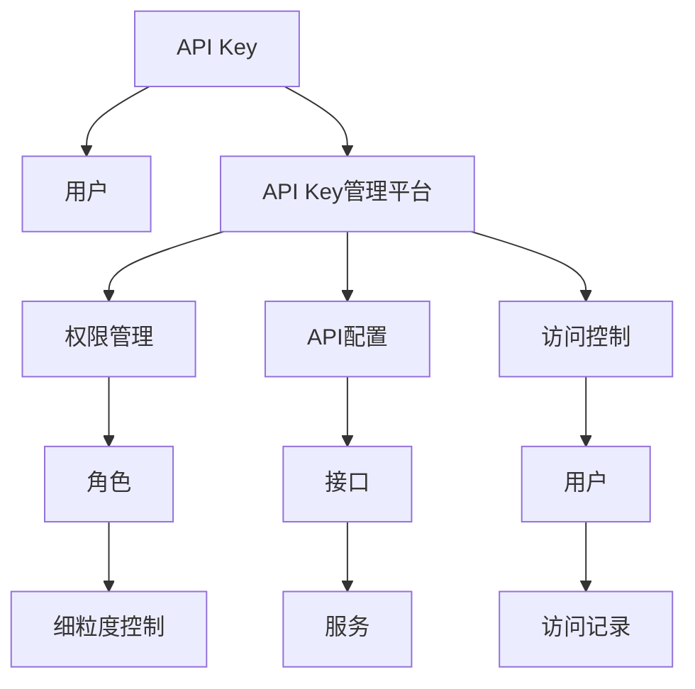

                 

# 分级 API Key 的使用案例

> 关键词：API Key管理,分级访问控制,RESTful API,身份认证,安全策略,项目实践

## 1. 背景介绍

### 1.1 问题由来
随着API的广泛应用，企业级系统间的互联互通变得尤为重要。API Key作为认证方式之一，能够有效验证API访问者的身份，确保API访问的安全性。然而，随着API服务的规模化和复杂化，简单统一的API Key管理方式已无法满足当前需求。

传统的API Key管理方式存在以下问题：
- **权限不足**：无论是管理员还是普通用户，都使用同一套API Key，难以细粒度控制访问权限。
- **安全性差**：所有API Key的权限一致，存在API被滥用的风险。
- **管理复杂**：所有API Key集中管理，权限变更效率低，维护困难。

### 1.2 问题核心关键点
分级API Key管理旨在通过细粒度的访问控制，对API用户进行多级分类，并为每个用户分配相应的API Key，以实现对API的细粒度访问控制，从而提升API服务的整体安全性、便利性和管理效率。

分级API Key的核心关键点包括：
- **分级管理**：根据用户角色或权限级别，为每个用户分配不同的API Key。
- **访问控制**：每个API Key拥有特定的访问权限，如读取、写入、删除等。
- **动态配置**：API Key的权限可以动态变更，适应企业业务变化。
- **统一接口**：通过统一的API Key管理平台，实现对所有API Key的集中管理。

## 2. 核心概念与联系

### 2.1 核心概念概述

为了更好地理解分级API Key管理的原理和架构，本节将介绍几个核心概念：

- **API Key**：用于标识API访问者的唯一字符串，与API用户相关联。
- **分级管理**：按照用户角色或权限级别，对API Key进行分类和分配，实现细粒度访问控制。
- **访问控制**：通过API Key管理平台，设定API Key的访问权限，限制API访问范围。
- **统一接口**：集中管理API Key的平台，提供API Key的创建、配置、权限变更等操作。

这些核心概念之间存在紧密联系，共同构成分级API Key管理的体系架构。通过了解这些概念，我们可以更好地掌握分级API Key的实施方法和应用场景。

### 2.2 核心概念原理和架构的 Mermaid 流程图



这个流程图展示了分级API Key管理的关键流程和架构关系：

1. **API Key与用户关联**：每个API Key对应一个API用户。
2. **权限管理**：API Key的管理平台根据用户角色或权限，分配不同的API Key。
3. **API配置**：API Key管理平台设置API Key的访问权限。
4. **访问控制**：API Key在API配置权限范围内对API接口进行访问。
5. **细粒度控制**：通过角色和权限管理，实现对API访问的细粒度控制。
6. **统一接口**：所有API Key的创建、配置、权限变更等操作在统一的API Key管理平台上进行。

这些流程和架构关系共同构成分级API Key管理的完整体系。

## 3. 核心算法原理 & 具体操作步骤
### 3.1 算法原理概述

分级API Key管理的基本原理是：通过细粒度的角色和权限管理，对API用户进行分类，并为每个用户分配不同的API Key，每个API Key拥有特定的访问权限。系统通过统一的API Key管理平台，集中管理和动态配置API Key的权限。

### 3.2 算法步骤详解

分级API Key管理的实施流程主要包括以下步骤：

**Step 1: 准备用户信息**
- 收集并整理API用户的身份信息和权限需求，确定用户的基本角色和权限级别。

**Step 2: 创建API Key**
- 根据用户的基本角色和权限级别，使用API Key管理平台创建相应的API Key。

**Step 3: 配置API权限**
- 使用API Key管理平台，为每个API Key设置特定的访问权限，如读取、写入、删除等。

**Step 4: 细粒度控制**
- 对API接口进行细粒度配置，设置API Key的访问权限范围，如特定的接口、特定的数据等。

**Step 5: 动态管理**
- 根据业务变化，动态调整API Key的权限配置，适应企业业务需求的变化。

**Step 6: 安全审计**
- 定期对API访问记录进行审计，检查API Key的使用情况，确保API的安全性。

### 3.3 算法优缺点

分级API Key管理具有以下优点：
- **细粒度控制**：每个API Key拥有特定的权限，能够实现细粒度访问控制。
- **安全性高**：不同权限的API Key拥有不同的访问权限，能够有效防止API滥用。
- **管理高效**：通过统一的API Key管理平台，实现集中管理和动态配置，提高权限管理的效率。

同时，该方法也存在一定的局限性：
- **复杂性高**：细粒度的权限管理增加了系统的复杂度，特别是权限配置和变更。
- **操作繁琐**：每个API Key的权限配置需要手工操作，且需定期审计，增加了管理员的负担。
- **成本高**：API Key管理平台的建设和维护成本较高，特别是对于大型企业。

尽管存在这些局限性，但分级API Key管理仍是目前主流的API Key管理方式之一。未来相关研究的重点在于如何进一步简化权限管理，提升系统易用性，降低管理成本，并保持系统的安全性。

### 3.4 算法应用领域

分级API Key管理在多个领域得到了广泛应用，包括但不限于：

- **企业级系统**：在企业内部系统中，对不同角色和权限的用户进行API Key管理，提高系统安全性。
- **第三方API服务**：对第三方API服务的调用者进行API Key管理，限制API调用次数和访问范围。
- **物联网设备**：对物联网设备进行API Key管理，限制设备的访问权限和调用频率。
- **电商平台**：对电商平台中的商家和消费者进行API Key管理，提高交易的安全性和监管能力。
- **金融系统**：对金融系统的客户和内部人员进行API Key管理，保护金融数据的安全。

这些领域的应用，展示了分级API Key管理的广泛适用性和重要性。随着API服务的普及和复杂化，分级API Key管理必将在更多场景中发挥作用。

## 4. 数学模型和公式 & 详细讲解 & 举例说明

### 4.1 数学模型构建

为了更好地理解分级API Key管理的数学模型，本节将使用数学语言对算法进行严格的刻画。

记用户集为 $U=\{u_1,u_2,\cdots,u_n\}$，每个用户 $u_i$ 对应的API Key为 $K_i$，权限集为 $P=\{p_1,p_2,\cdots,p_m\}$，每个权限 $p_j$ 对应的访问范围为 $A_j$。则分级API Key管理的基本数学模型可以表示为：

$$
\begin{aligned}
&\min_{K_i,P} \quad \sum_{i=1}^n \max_{j=1}^m \mathcal{L}(K_i,p_j,A_j) \\
&\text{s.t.} \quad K_i \in U, P \in P, K_i \rightarrow p_j
\end{aligned}
$$

其中 $\mathcal{L}(K_i,p_j,A_j)$ 为API Key $K_i$ 对权限 $p_j$ 的损失函数，用于衡量API Key和权限的匹配程度。目标函数 $\min_{K_i,P}$ 表示最小化所有用户和权限的匹配损失。

### 4.2 公式推导过程

以下对上述数学模型进行详细的公式推导。

记 $K_i$ 对 $p_j$ 的匹配度为 $\mathcal{L}(K_i,p_j)$，则有：

$$
\mathcal{L}(K_i,p_j) = \left\{
\begin{aligned}
&0, &\text{如果 } K_i \in A_j \\
&1, &\text{如果 } K_i \notin A_j
\end{aligned}
\right.
$$

因此，总损失函数 $\mathcal{L}(K_i,p_j,A_j)$ 可以表示为：

$$
\mathcal{L}(K_i,p_j,A_j) = 
\begin{cases}
1, & K_i \notin A_j \\
0, & K_i \in A_j
\end{cases}
$$

将上述公式代入目标函数，得：

$$
\begin{aligned}
\min_{K_i,P} \quad \sum_{i=1}^n \max_{j=1}^m \mathcal{L}(K_i,p_j,A_j) &= \min_{K_i,P} \quad \sum_{i=1}^n \max_{j=1}^m (1 - \mathbf{1}_{K_i \in A_j}) \\
&= \min_{K_i,P} \quad \sum_{i=1}^n \max_{j=1}^m \mathbb{I}(K_i \notin A_j)
\end{aligned}
$$

其中 $\mathbb{I}$ 表示示性函数，当条件满足时取值为1，否则为0。

### 4.3 案例分析与讲解

以下通过一个具体的案例，分析分级API Key管理的实际应用：

假设企业内部有10个用户，每个用户对应的API Key和权限如下：

| 用户  | API Key         | 权限          | 访问范围     |
| ---   | ---             | ---           | ---          |
| 用户1 | key1             | 读取         | 接口A、接口B |
| 用户2 | key2             | 写入         | 接口C、接口D |
| 用户3 | key3             | 读取、写入   | 接口E、接口F |
| 用户4 | key4             | 读取         | 接口G、接口H |
| 用户5 | key5             | 读取         | 接口I、接口J |
| 用户6 | key6             | 写入         | 接口K、接口L |
| 用户7 | key7             | 读取         | 接口M、接口N |
| 用户8 | key8             | 写入         | 接口O、接口P |
| 用户9 | key9             | 读取、写入   | 接口Q、接口R |
| 用户10 | key10           | 写入         | 接口S、接口T |

通过上述数据，可以构建分级API Key管理的数学模型。假设 $\mathcal{L}(K_i,p_j,A_j)$ 的损失函数为：

$$
\mathcal{L}(K_i,p_j,A_j) = \left\{
\begin{aligned}
&0, &\text{如果 } K_i \in A_j \\
&1, &\text{如果 } K_i \notin A_j
\end{aligned}
\right.
$$

则总损失函数为：

$$
\begin{aligned}
\min_{K_i,P} \quad \sum_{i=1}^n \max_{j=1}^m \mathcal{L}(K_i,p_j,A_j) &= \min_{K_i,P} \quad \sum_{i=1}^n \max_{j=1}^m (1 - \mathbb{I}(K_i \in A_j)) \\
&= \min_{K_i,P} \quad \sum_{i=1}^n \max_{j=1}^m \mathbb{I}(K_i \notin A_j)
\end{aligned}
$$

通过优化上述目标函数，可以找出最优的API Key和权限配置方案，使得每个用户仅访问其对应的接口，从而提升系统的安全性和管理效率。

## 5. 项目实践：代码实例和详细解释说明
### 5.1 开发环境搭建

在进行API Key管理实践前，我们需要准备好开发环境。以下是使用Python进行Flask开发的环境配置流程：

1. 安装Anaconda：从官网下载并安装Anaconda，用于创建独立的Python环境。

2. 创建并激活虚拟环境：
```bash
conda create -n api-key-env python=3.8 
conda activate api-key-env
```

3. 安装Flask：
```bash
pip install Flask
```

4. 安装Flask-Security：
```bash
pip install Flask-Security
```

5. 安装SQLAlchemy：
```bash
pip install SQLAlchemy
```

6. 安装Flask-WTF：
```bash
pip install Flask-WTF
```

完成上述步骤后，即可在`api-key-env`环境中开始API Key管理的开发。

### 5.2 源代码详细实现

以下是一个基本的API Key管理系统的源代码实现，包括用户信息管理、API Key创建、权限配置、细粒度控制等功能。

首先，定义数据库模型：

```python
from flask_sqlalchemy import SQLAlchemy

db = SQLAlchemy()

class User(db.Model):
    id = db.Column(db.Integer, primary_key=True)
    name = db.Column(db.String(80), unique=True)
    password = db.Column(db.String(120))
    roles = db.relationship('Role', secondary=roles_users)

class Role(db.Model):
    id = db.Column(db.Integer(), primary_key=True)
    name = db.Column(db.String(16))

roles_users = db.Table('roles_users',
    db.Column('user_id', db.Integer(), db.ForeignKey('user.id')),
    db.Column('role_id', db.Integer(), db.ForeignKey('role.id'))
)

class Role(db.Model):
    id = db.Column(db.Integer(), primary_key=True)
    name = db.Column(db.String(16))
```

然后，定义API Key管理逻辑：

```python
from flask import Flask, render_template, redirect, url_for, request
from flask_security import Security, SQLAlchemyUserDatastore, UserMixin, RoleMixin

app = Flask(__name__)
app.config['SQLALCHEMY_DATABASE_URI'] = 'sqlite:////tmp/test.db'
app.config['SECURITY_PASSWORD_SALT'] = 'some-salt'
app.config['SECURITY_PASSWORD_HASH'] = 'sha512_crypt'

db.init_app(app)
app.secret_key = 'some-secret-key'

user_datastore = SQLAlchemyUserDatastore(db, User, Role)
security = Security(app, user_datastore)

# 创建API Key
@app.route('/create-api-key', methods=['POST'])
def create_api_key():
    name = request.form.get('name')
    api_key = generate_api_key()
    user_datastore.create_user(name=name, password=api_key)
    return redirect(url_for('index'))

# 配置API权限
@app.route('/configure-api-key', methods=['POST'])
def configure_api_key():
    api_key = request.form.get('api_key')
    role_id = request.form.get('role_id')
    user_datastore.get_user(api_key).add_role(role_id)
    return redirect(url_for('index'))

# 细粒度控制
@app.route('/fine-grained-control', methods=['POST'])
def fine_grained_control():
    api_key = request.form.get('api_key')
    interface_id = request.form.get('interface_id')
    user_datastore.get_user(api_key).add_role(interface_id)
    return redirect(url_for('index'))

# 显示用户信息
@app.route('/')
def index():
    return render_template('index.html', users=user_datastore.get_all_users())

# 显示API Key信息
@app.route('/api-keys')
def api_keys():
    return render_template('api-keys.html', api_keys=user_datastore.get_all_users())
```

### 5.3 代码解读与分析

让我们再详细解读一下关键代码的实现细节：

**User模型和Role模型**：
- `User`模型存储用户信息，包括用户ID、用户名、密码、角色信息。
- `Role`模型存储角色信息，用于实现细粒度权限控制。

**用户信息管理**：
- `create_api_key`函数：创建API Key，并将其与用户信息关联。
- `configure_api_key`函数：配置API Key的权限，将其分配给特定的角色。
- `fine_grained_control`函数：细粒度控制API Key的访问权限，将其与特定的接口关联。

**用户界面**：
- `index`函数：显示用户信息，供管理员查看和维护。
- `api_keys`函数：显示API Key信息，供管理员查看和管理。

**开发流程**：
1. 首先定义数据库模型，使用SQLAlchemy对用户和角色进行管理。
2. 创建Flask应用，并配置安全性。
3. 实现API Key的创建、配置和细粒度控制功能。
4. 通过路由实现前后端交互，显示用户和API Key信息。

通过上述代码，可以看出API Key管理系统的基本实现逻辑。开发者可以根据实际需求，进一步扩展和优化API Key管理的功能。

### 5.4 运行结果展示

运行上述代码后，可以在浏览器中访问`localhost:5000`，查看用户和API Key信息。管理员可以通过创建API Key、配置权限、细粒度控制等功能，实现对API用户的细粒度访问控制。

## 6. 实际应用场景
### 6.1 智能客服系统

分级API Key管理在智能客服系统中得到了广泛应用。智能客服系统通过API接口与多个内部系统和第三方平台进行交互，因此对API访问的安全性和管理效率有很高的要求。

通过分级API Key管理，智能客服系统可以实现对不同角色的用户进行细粒度访问控制，限制客服人员的API访问权限，防止非法操作。例如，只允许客服人员访问读取用户数据，禁止其写入和删除数据，从而提高系统的安全性。

### 6.2 金融系统

金融系统需要对内部员工和外部客户的API访问进行严格控制，以保护敏感数据的安全。分级API Key管理可以针对不同用户角色，分配相应的API访问权限，确保数据访问的合法性和安全性。

例如，只允许内部员工访问交易数据，禁止客户访问交易数据，防止信息泄露。同时，定期对API访问记录进行审计，确保API访问的合法性。

### 6.3 电商系统

电商系统需要处理大量的订单信息，因此对API访问的安全性和管理效率也有很高的要求。分级API Key管理可以帮助电商系统实现对不同角色的用户进行细粒度访问控制，限制API调用次数和访问范围，防止滥用API资源。

例如，只允许管理员访问订单数据，防止普通用户访问订单数据。同时，对每个API Key的调用次数进行限制，防止滥用API资源。

## 7. 工具和资源推荐
### 7.1 学习资源推荐

为了帮助开发者系统掌握分级API Key管理的理论基础和实践技巧，这里推荐一些优质的学习资源：

1. **《API Security: Strategies and Implementation》**：这是一本关于API安全的经典书籍，详细介绍了API密钥管理、身份认证、访问控制等基础知识和实际应用案例。

2. **《RESTful API Design》**：这是一本关于RESTful API设计的权威书籍，介绍了RESTful API的基本概念和最佳实践，包括API密钥管理、身份认证、权限控制等。

3. **《Flask Security》**：这是一本关于Flask框架的API密钥管理模块的书籍，详细介绍了如何使用Flask-Security模块进行API密钥管理，包括用户认证、角色管理、权限控制等。

4. **《API Security Best Practices》**：这是一篇关于API密钥管理的最佳实践文章，介绍了如何设计API密钥管理方案，确保API访问的安全性和合法性。

5. **《OAuth 2.0》**：这是一本关于OAuth 2.0认证机制的书籍，详细介绍了OAuth 2.0的认证流程和最佳实践，包括API密钥管理、身份认证、权限控制等。

通过对这些资源的学习实践，相信你一定能够快速掌握分级API Key管理的精髓，并用于解决实际的API管理问题。

### 7.2 开发工具推荐

高效的开发离不开优秀的工具支持。以下是几款用于API Key管理开发的常用工具：

1. **Flask**：基于Python的轻量级Web框架，易于上手，适合快速开发API密钥管理应用。

2. **SQLAlchemy**：Python的ORM框架，支持多种数据库，方便进行数据管理和权限控制。

3. **Flask-Security**：Flask框架的API密钥管理模块，提供了用户认证、角色管理、权限控制等功能。

4. **OAuth 2.0**：OAuth 2.0认证机制，支持API密钥管理的多种认证方式，如JWT、OAuth等。

5. **JWT（JSON Web Token）**：一种基于JSON的认证方式，可以在API密钥管理中用于用户认证和权限控制。

6. **Swagger UI**：基于OpenAPI的API文档生成工具，方便开发和测试API密钥管理应用。

合理利用这些工具，可以显著提升API密钥管理的开发效率，加快创新迭代的步伐。

### 7.3 相关论文推荐

分级API Key管理的发展离不开学界的持续研究。以下是几篇奠基性的相关论文，推荐阅读：

1. **《Access Control in Web Applications》**：介绍Web应用程序的访问控制机制，包括身份认证、角色管理、权限控制等基础知识。

2. **《OAuth 2.0: The Designer's Guide》**：介绍OAuth 2.0认证机制的设计和实现，包括API密钥管理、身份认证、权限控制等。

3. **《API Security》**：介绍API安全的基本概念和实践，包括API密钥管理、身份认证、访问控制等。

4. **《Fine-Grained Access Control in Web Applications》**：介绍细粒度访问控制在Web应用程序中的应用，包括用户认证、角色管理、权限控制等。

5. **《OAuth 2.0: The Complete Guide》**：介绍OAuth 2.0认证机制的详细设计，包括API密钥管理、身份认证、权限控制等。

这些论文代表了大规模API密钥管理的研究进展，通过学习这些前沿成果，可以帮助研究者把握学科前进方向，激发更多的创新灵感。

## 8. 总结：未来发展趋势与挑战
### 8.1 总结

本文对分级API Key管理进行了全面系统的介绍。首先阐述了分级API Key管理的研究背景和意义，明确了分级API Key管理在API访问控制中的重要作用。其次，从原理到实践，详细讲解了分级API Key管理的数学原理和关键步骤，给出了API Key管理的完整代码实例。同时，本文还广泛探讨了分级API Key管理在多个行业领域的应用场景，展示了分级API Key管理的广泛适用性和重要性。

通过本文的系统梳理，可以看到，分级API Key管理作为一种细粒度访问控制方式，已经在多个领域得到了广泛应用。随着API服务的普及和复杂化，分级API Key管理必将在更多场景中发挥作用。

### 8.2 未来发展趋势

展望未来，分级API Key管理技术将呈现以下几个发展趋势：

1. **自动化管理**：引入自动化管理技术，如机器学习、自动配置等，减少人工操作，提高管理效率。
2. **区块链技术**：利用区块链技术实现API密钥的分布式管理和审计，提高系统的透明性和安全性。
3. **微服务架构**：将API密钥管理融入微服务架构，实现服务的细粒度管理和动态配置。
4. **多身份认证**：引入多种身份认证方式，如多因素认证、生物识别等，提高系统的安全性。
5. **API审计**：引入API审计机制，对API访问进行实时监控和分析，及时发现和应对异常情况。
6. **云原生架构**：将API密钥管理融入云原生架构，实现API密钥的分布式管理和动态配置。

以上趋势凸显了分级API Key管理技术的广阔前景。这些方向的探索发展，必将进一步提升API管理的效率和安全性，为API服务的普及和应用带来更多保障。

### 8.3 面临的挑战

尽管分级API Key管理技术已经取得了一定的进展，但在迈向更加智能化、普适化应用的过程中，它仍面临着诸多挑战：

1. **复杂性高**：细粒度的权限管理增加了系统的复杂度，特别是在权限配置和变更时。
2. **操作繁琐**：每个API Key的权限配置需要手工操作，且需定期审计，增加了管理员的负担。
3. **管理成本高**：API Key管理平台的建设和维护成本较高，特别是对于大型企业。
4. **安全性差**：不同权限的API Key拥有不同的访问权限，但API密钥本身仍存在被滥用的风险。
5. **灵活性不足**：当前的分级API Key管理方式较为静态，难以适应业务变化。

尽管存在这些挑战，但分级API Key管理仍是目前主流的API Key管理方式之一。未来相关研究的重点在于如何进一步简化权限管理，提升系统易用性，降低管理成本，并保持系统的安全性。

### 8.4 研究展望

面对分级API Key管理所面临的挑战，未来的研究需要在以下几个方面寻求新的突破：

1. **引入自动化管理技术**：通过引入自动化管理技术，减少人工操作，提高管理效率。
2. **利用区块链技术**：利用区块链技术实现API密钥的分布式管理和审计，提高系统的透明性和安全性。
3. **融入微服务架构**：将API密钥管理融入微服务架构，实现服务的细粒度管理和动态配置。
4. **引入多身份认证**：引入多种身份认证方式，如多因素认证、生物识别等，提高系统的安全性。
5. **引入API审计机制**：引入API审计机制，对API访问进行实时监控和分析，及时发现和应对异常情况。
6. **融入云原生架构**：将API密钥管理融入云原生架构，实现API密钥的分布式管理和动态配置。

这些研究方向的探索，必将引领分级API Key管理技术迈向更高的台阶，为构建安全、可靠、可解释、可控的智能系统铺平道路。面向未来，分级API Key管理技术还需要与其他人工智能技术进行更深入的融合，如知识表示、因果推理、强化学习等，多路径协同发力，共同推动自然语言理解和智能交互系统的进步。只有勇于创新、敢于突破，才能不断拓展API密钥管理的边界，让智能技术更好地造福人类社会。

## 9. 附录：常见问题与解答

**Q1：分级API Key管理是否适用于所有API服务？**

A: 分级API Key管理在大多数API服务上都能取得不错的效果，特别是对于数据量较小的服务。但对于一些需要高性能、低延迟的API服务，可能需要考虑其他认证方式，如令牌认证、基于OAuth的认证等。

**Q2：如何选择合适的API密钥管理平台？**

A: 选择合适的API密钥管理平台需要考虑以下因素：
- **易用性**：平台的用户界面和操作流程是否直观易用。
- **可扩展性**：平台是否支持多租户和多用户管理，是否能灵活扩展。
- **安全性**：平台是否支持多种身份认证方式和访问控制策略，是否能保障API访问的安全性。
- **支持性**：平台是否支持主流API服务框架和认证方式，如Flask、Django、JWT等。
- **性能**：平台的性能是否满足实际需求，是否能处理大规模API密钥管理。

选择合适的API密钥管理平台需要综合考虑以上因素，选择最适合自身需求的平台。

**Q3：分级API Key管理是否需要定期审计？**

A: 是的，分级API Key管理需要定期对API访问进行审计，以确保API访问的合法性和安全性。审计的内容包括API Key的使用情况、权限变更记录、异常访问行为等。通过定期审计，可以及时发现和应对异常情况，保证系统的安全性。

**Q4：分级API Key管理是否适用于多租户应用？**

A: 是的，分级API Key管理可以适用于多租户应用。多租户应用中，每个租户都可以独立管理API密钥，进行细粒度访问控制。同时，可以通过统一的管理平台，对多个租户的API密钥进行统一管理和审计。

**Q5：分级API Key管理是否适用于跨地域应用？**

A: 是的，分级API Key管理可以适用于跨地域应用。跨地域应用中，需要考虑不同地域的法律法规和网络环境，分级API Key管理可以根据不同地域的要求，灵活配置API密钥的权限和管理策略。

通过这些常见问题的解答，希望能进一步加深你对分级API Key管理的理解和应用。

