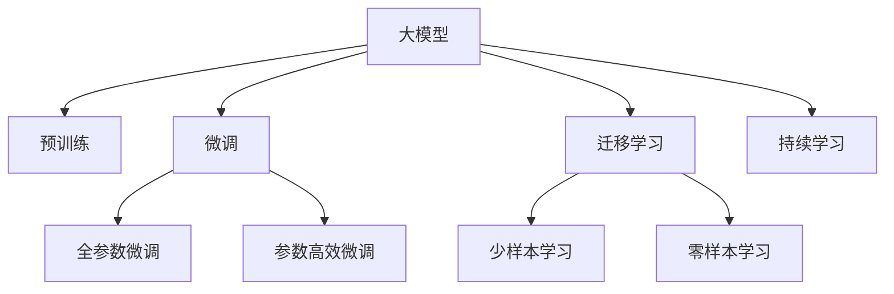

                 

# 创业者布局大模型，抢占AI产业变革风口

大模型（Large Models）技术的崛起，正在掀起一场人工智能（AI）产业的革命。作为创业者，如何布局大模型，抢占AI产业变革的风口，已经成为当前行业的热点话题。本文将系统地介绍大模型技术的核心概念、核心算法原理、操作步骤，并结合实际应用场景，提供具体的项目实践指导和工具资源推荐，帮助创业者在大模型时代乘风破浪。

## 1. 背景介绍

### 1.1 问题由来

随着深度学习技术的不断突破，大模型在自然语言处理（NLP）、计算机视觉（CV）、语音识别等领域展现出了强大的表现力。以BERT、GPT-3为代表的大模型，通过对大规模无标签数据进行预训练，学习到了丰富的知识表示，能够通过微调（Fine-tuning）进行任务适配，取得优于传统机器学习模型的效果。

然而，大模型的开发、训练和部署门槛较高，对算力和数据的需求巨大，对于创业者而言，需要考虑如何将这一强大工具应用于自身业务，并实现商业化落地。本文将从大模型技术的核心概念入手，深入探讨如何布局大模型，抢占AI产业变革的风口。

### 1.2 问题核心关键点

大模型技术的核心在于其大规模预训练和微调能力。预训练是指在大规模无标签数据上训练模型，学习通用的知识表示。微调则是指在预训练模型的基础上，使用少量标注数据，对模型进行特定任务的适配。大模型技术的核心优势包括：

- **通用性**：通过预训练和微调，大模型可以适应多种任务，降低任务开发成本。
- **效率**：大模型在预训练时学习到了丰富的知识，微调时只需更新少量参数，加速模型训练和部署。
- **性能**：大模型的表现力优于传统机器学习模型，尤其是在少样本学习、跨领域迁移等任务上。

创业者布局大模型技术，需要掌握预训练、微调、迁移学习等核心技术，并结合自身业务需求，进行模型适配和优化。

## 2. 核心概念与联系

### 2.1 核心概念概述

- **大模型（Large Models）**：以BERT、GPT-3为代表的深度神经网络模型，参数量通常在十亿级别，通过对大规模无标签数据进行预训练，学习到丰富的知识表示。
- **预训练（Pre-training）**：在无标签数据上训练模型，学习通用的知识表示。
- **微调（Fine-tuning）**：在预训练模型的基础上，使用少量标注数据，对模型进行特定任务的适配。
- **迁移学习（Transfer Learning）**：将预训练模型在新任务上进行微调，实现知识迁移。
- **少样本学习（Few-shot Learning）**：在大模型上进行少样本学习，在少量标注数据的情况下进行任务适配。
- **零样本学习（Zero-shot Learning）**：在大模型上进行零样本学习，不使用任何标注数据进行任务适配。

这些概念构成了大模型技术的基础框架，帮助我们理解大模型在预训练、微调和迁移学习等方面的核心工作原理。

### 2.2 核心概念原理和架构的 Mermaid 流程图



## 3. 核心算法原理 & 具体操作步骤

### 3.1 算法原理概述

大模型的核心算法原理主要分为预训练和微调两个步骤。预训练通过大规模无标签数据训练模型，学习通用的知识表示。微调则在大模型的基础上，使用少量标注数据进行任务适配。

在预训练阶段，大模型通过自监督学习任务（如掩码语言模型、下标预测等），学习到语言、图像、语音等领域的通用知识表示。在微调阶段，通过少样本学习、零样本学习、对抗训练等技术，将预训练模型进一步适配特定任务，提升模型性能。

### 3.2 算法步骤详解

1. **数据准备**：收集预训练数据和微调数据。预训练数据通常来自大规模无标签数据集，如维基百科、CommonCrawl等。微调数据则根据具体任务需求，收集标注数据集。
2. **模型初始化**：选择预训练模型（如BERT、GPT-3等），并初始化模型参数。
3. **预训练**：在预训练数据上，使用自监督学习任务（如掩码语言模型、下标预测等），训练模型。
4. **微调**：在微调数据上，使用少样本学习、零样本学习等技术，进一步适配模型。
5. **测试和评估**：在测试数据集上评估微调后模型的性能，对比微调前后的效果提升。

### 3.3 算法优缺点

**优点**：

- **通用性**：大模型通过预训练学习到丰富的知识表示，能够适应多种任务。
- **效率**：预训练时只需使用无标签数据，微调时使用少量标注数据，加速模型训练和部署。
- **性能**：大模型在少样本学习、跨领域迁移等任务上表现优异。

**缺点**：

- **数据需求**：预训练和微调需要大量数据，数据获取成本较高。
- **资源消耗**：大模型的开发、训练和部署需要大量算力、内存和存储资源。
- **复杂性**：大模型需要复杂的训练和优化算法，需要专业知识和经验。

### 3.4 算法应用领域

大模型技术在NLP、CV、语音识别等领域得到了广泛应用，具体包括：

- **NLP**：文本分类、问答系统、情感分析、机器翻译等。
- **CV**：图像分类、目标检测、图像生成、视频分析等。
- **语音识别**：语音转文字、语音合成、语音情感识别等。

创业者可以根据自身业务需求，选择合适的任务和模型，进行预训练和微调，实现商业化落地。

## 4. 数学模型和公式 & 详细讲解 & 举例说明

### 4.1 数学模型构建

假设大模型为 $M_{\theta}$，其中 $\theta$ 为模型参数。预训练和微调的数学模型如下：

- **预训练模型**：在无标签数据上，使用自监督学习任务，最小化损失函数 $\mathcal{L}_{pre}$。
- **微调模型**：在标注数据上，使用监督学习任务，最小化损失函数 $\mathcal{L}_{fine}$。

数学表达式如下：

$$
\mathcal{L}_{pre} = \frac{1}{N} \sum_{i=1}^N \ell_{pre}(x_i, M_{\theta}(x_i))
$$

$$
\mathcal{L}_{fine} = \frac{1}{N} \sum_{i=1}^N \ell_{fine}(x_i, y_i, M_{\theta}(x_i))
$$

其中 $\ell_{pre}$ 和 $\ell_{fine}$ 分别为预训练和微调的损失函数，$x_i$ 和 $y_i$ 分别为输入和标签。

### 4.2 公式推导过程

以BERT为例，其预训练任务为掩码语言模型，即在输入文本中随机掩码部分单词，模型需要预测这些单词的原始位置。微调任务可以是二分类任务、文本生成等。

### 4.3 案例分析与讲解

假设需要进行情感分析任务的微调，数据集包含电影评论和对应的情感标签。可以首先使用IMDb数据集进行预训练，然后对特定电影评论数据集进行微调。

## 5. 项目实践：代码实例和详细解释说明

### 5.1 开发环境搭建

- **Python**：安装Python 3.8及以上版本，确保足够的计算资源。
- **深度学习框架**：选择TensorFlow或PyTorch进行模型开发。
- **预训练模型**：选择BERT、GPT-3等预训练模型。
- **微调框架**：选择HuggingFace等微调框架。

### 5.2 源代码详细实现

以下是一个简单的情感分析任务微调代码实现：

```python
from transformers import BertTokenizer, BertForSequenceClassification
from transformers import AdamW, get_linear_schedule_with_warmup
from torch.utils.data import DataLoader
import torch

# 数据准备
tokenizer = BertTokenizer.from_pretrained('bert-base-uncased')
train_dataset = ...
val_dataset = ...

# 模型初始化
model = BertForSequenceClassification.from_pretrained('bert-base-uncased', num_labels=2)
optimizer = AdamW(model.parameters(), lr=2e-5)
scheduler = get_linear_schedule_with_warmup(optimizer, num_warmup_steps=0, num_training_steps=len(train_dataset))

# 模型训练
device = torch.device('cuda') if torch.cuda.is_available() else torch.device('cpu')
model.to(device)
for epoch in range(epochs):
    for batch in DataLoader(train_dataset, batch_size=16):
        input_ids = batch['input_ids'].to(device)
        attention_mask = batch['attention_mask'].to(device)
        labels = batch['labels'].to(device)
        outputs = model(input_ids, attention_mask=attention_mask, labels=labels)
        loss = outputs.loss
        loss.backward()
        optimizer.step()
        scheduler.step()

# 模型评估
val_dataset = ...
val_dataloader = DataLoader(val_dataset, batch_size=16)
val_loss = 0
for batch in val_dataloader:
    input_ids = batch['input_ids'].to(device)
    attention_mask = batch['attention_mask'].to(device)
    labels = batch['labels'].to(device)
    outputs = model(input_ids, attention_mask=attention_mask)
    val_loss += outputs.loss.item()
print(f'Validation loss: {val_loss / len(val_dataloader):.4f}')
```

### 5.3 代码解读与分析

- **数据预处理**：使用BERT Tokenizer对输入文本进行分词和编码，生成模型需要的输入张量。
- **模型初始化**：选择预训练的BERT模型，并设置优化器和学习率调度器。
- **模型训练**：在GPU或CPU上，使用DataLoader对训练数据进行批次化加载，进行模型训练。
- **模型评估**：在验证集上评估模型性能，输出验证损失。

## 6. 实际应用场景

### 6.1 智能客服系统

智能客服系统可以利用大模型进行对话生成和情感分析。收集历史客服数据，使用BERT等模型进行预训练，然后在实际客服对话中进行微调，提升系统的自然语言理解能力，快速响应客户咨询。

### 6.2 金融舆情监测

金融领域需要实时监测市场舆情，预测股票走势。使用BERT等模型进行预训练，然后在舆情数据上进行微调，实时分析市场舆情，预测股票走势。

### 6.3 个性化推荐系统

个性化推荐系统可以通过大模型进行用户兴趣建模。收集用户行为数据，使用BERT等模型进行预训练，然后在推荐任务上进行微调，提升推荐系统的效果。

### 6.4 未来应用展望

大模型技术将深刻改变各行业的应用场景，推动智能系统的进一步发展。未来将涌现更多基于大模型的创新应用，如智能家居、智能交通、智慧城市等。

## 7. 工具和资源推荐

### 7.1 学习资源推荐

- **Transformers官方文档**：HuggingFace提供的官方文档，包含大模型微调等核心技术。
- **NLP with Transformers**：由大模型专家撰写，涵盖大模型微调、任务适配等核心技术。
- **Coursera《NLP with Transformers》课程**：斯坦福大学提供的深度学习课程，介绍大模型技术的应用。

### 7.2 开发工具推荐

- **TensorFlow**：谷歌开源的深度学习框架，适用于大规模模型的开发和训练。
- **PyTorch**：Facebook开源的深度学习框架，支持动态图和静态图，适用于模型训练和推理。
- **HuggingFace**：提供大模型和微调框架，简化模型开发和部署。

### 7.3 相关论文推荐

- **BERT: Pre-training of Deep Bidirectional Transformers for Language Understanding**：提出BERT模型，引入掩码语言模型任务进行预训练。
- **GPT-3: Language Models are Unsupervised Multitask Learners**：展示GPT-3模型的零样本学习能力，刷新多项NLP任务SOTA。
- **AdaLoRA: Adaptive Low-Rank Adaptation for Parameter-Efficient Fine-Tuning**：提出AdaLoRA方法，实现参数高效微调，节省计算资源。

## 8. 总结：未来发展趋势与挑战

### 8.1 研究成果总结

大模型技术的崛起，为NLP、CV、语音识别等领域带来了革命性的变化。通过预训练和微调，大模型可以适应多种任务，提升模型性能，降低任务开发成本。

### 8.2 未来发展趋势

未来大模型技术将呈现以下发展趋势：

- **模型规模扩大**：随着算力成本的下降和数据规模的扩张，预训练模型的参数量将进一步增加。
- **模型迁移能力提升**：通过预训练和微调，大模型将具备更强的跨领域迁移能力，解决更多实际问题。
- **少样本学习能力增强**：利用大模型的知识表示能力，进行少样本学习，提升模型性能。
- **模型解释性增强**：通过解释性技术，提升模型的可解释性，增强用户的信任感。
- **模型安全性和伦理保障**：确保模型的安全性，避免有偏见、有害的输出，保障用户的利益。

### 8.3 面临的挑战

- **数据获取和标注**：大模型的开发需要大量数据，数据获取和标注成本较高。
- **计算资源消耗**：大模型需要大量的计算资源，包括GPU、TPU等高性能设备。
- **模型复杂性**：大模型的训练和优化需要复杂的算法和工具，需要专业知识和经验。
- **模型解释性和安全性**：大模型往往难以解释其内部工作机制，存在安全隐患。

### 8.4 研究展望

未来大模型技术需要在以下几个方面进行进一步研究：

- **无监督和半监督学习**：通过无监督和半监督学习，减少对标注数据的依赖。
- **参数高效微调**：开发参数高效的微调方法，提升模型训练和部署的效率。
- **模型解释性**：引入解释性技术，提升模型的可解释性，增强用户的信任感。
- **模型安全性和伦理保障**：确保模型的安全性，避免有偏见、有害的输出，保障用户的利益。

## 9. 附录：常见问题与解答

**Q1: 大模型微调是否适用于所有NLP任务？**

A: 大模型微调在大多数NLP任务上都能取得不错的效果，特别是对于数据量较小的任务。但对于一些特定领域的任务，如医学、法律等，仅依靠通用语料预训练的模型可能难以很好地适应。此时需要在特定领域语料上进一步预训练，再进行微调，才能获得理想效果。

**Q2: 如何选择合适的学习率？**

A: 大模型微调的学习率一般要比预训练时小1-2个数量级，如果使用过大的学习率，容易破坏预训练权重，导致过拟合。一般建议从1e-5开始调参，逐步减小学习率，直至收敛。也可以使用warmup策略，在开始阶段使用较小的学习率，再逐渐过渡到预设值。

**Q3: 微调过程中如何避免过拟合？**

A: 微调过程中可以采取以下措施避免过拟合：

- **数据增强**：通过回译、近义替换等方式扩充训练集。
- **正则化**：使用L2正则、Dropout、Early Stopping等避免过拟合。
- **对抗训练**：引入对抗样本，提高模型鲁棒性。
- **参数高效微调**：只调整少量参数(如Adapter、Prefix等)，减小过拟合风险。

**Q4: 微调模型在落地部署时需要注意哪些问题？**

A: 将微调模型转化为实际应用，还需要考虑以下因素：

- **模型裁剪**：去除不必要的层和参数，减小模型尺寸，加快推理速度。
- **量化加速**：将浮点模型转为定点模型，压缩存储空间，提高计算效率。
- **服务化封装**：将模型封装为标准化服务接口，便于集成调用。
- **弹性伸缩**：根据请求流量动态调整资源配置，平衡服务质量和成本。
- **监控告警**：实时采集系统指标，设置异常告警阈值，确保服务稳定性。
- **安全防护**：采用访问鉴权、数据脱敏等措施，保障数据和模型安全。

大模型技术为NLP应用带来了广阔的想象空间，但如何将强大的性能转化为稳定、高效、安全的业务价值，还需要工程实践的不断打磨。唯有从数据、算法、工程、业务等多个维度协同发力，才能真正实现人工智能技术在垂直行业的规模化落地。

---

作者：禅与计算机程序设计艺术 / Zen and the Art of Computer Programming

