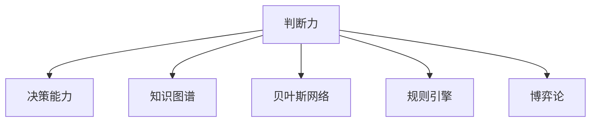

                 

# 判断力和处置复杂事件的决策能力：个人基于自身特质以及相关知识和经验形成观点并做出决定的能力

## 1. 背景介绍

### 1.1 问题由来

在复杂事件决策中，判断力扮演着至关重要的角色。这不仅要求决策者具备全面的知识和经验，还要求其具备迅速而准确地处理信息、分析和解决问题的能力。然而，随着现代社会复杂性的增加，人们面临的决策问题也变得越来越复杂。这使得传统的经验决策方法面临挑战，因为单一的经验和知识可能不足以应对复杂多变的环境。

### 1.2 问题核心关键点

面对复杂事件的决策，判断力和决策能力是衡量决策者能力的重要指标。判断力是指个人基于自身特质以及相关知识和经验，快速而准确地处理信息、分析和解决问题的能力。决策能力则是指个体在面对不确定性和多变环境时，能够综合考虑各种因素，做出最优决策的能力。这两者在决策过程中相辅相成，共同决定了决策的准确性和有效性。

本文将从以下几个方面探讨如何提升个人在复杂事件决策中的判断力和决策能力：
- **判断力的提升**：通过个体特质和经验的优化，提升信息处理和问题解决能力。
- **决策能力的发展**：探索多种决策理论和方法，提升个体在复杂环境中的决策质量。
- **实际应用场景**：将理论和模型应用到具体场景中，探索其效果和优化方法。

## 2. 核心概念与联系

### 2.1 核心概念概述

为更好地理解复杂事件决策中的判断力和决策能力，本节将介绍几个密切相关的核心概念：

- **判断力(Judgment)**：指个体在面对不确定性时，能够迅速而准确地处理信息、分析和解决问题的能力。
- **决策能力(Decision-Making)**：指个体在面对复杂和不确定环境时，能够综合考虑各种因素，做出最优决策的能力。
- **复杂事件(Complex Event)**：指具有高不确定性、多变量、多因果关系的决策问题。
- **知识图谱(Knowledge Graph)**：一种用于表示实体、属性和实体间关系的图形结构，帮助个体快速获取和理解信息。
- **贝叶斯网络(Bayesian Network)**：一种概率图模型，用于描述变量之间的依赖关系，支持推理和决策。
- **规则引擎(Rule Engine)**：一种基于规则的系统，能够自动执行业务规则，辅助决策。
- **博弈论(Game Theory)**：研究决策者之间策略互动的学科，有助于理解和预测复杂决策中的博弈关系。

这些核心概念之间的逻辑关系可以通过以下Mermaid流程图来展示：



这个流程图展示了几项核心概念之间的关联：

1. 判断力是决策能力的基础，是决策者处理信息、分析和解决问题的核心能力。
2. 知识图谱、贝叶斯网络、规则引擎、博弈论等工具和方法，提供了决策所需的结构和规则支持，帮助判断力的提升。
3. 决策能力不仅依赖于判断力的提升，还依赖于这些工具和方法的应用，以实现更有效的决策。

## 3. 核心算法原理 & 具体操作步骤

### 3.1 算法原理概述

复杂事件决策中的判断力和决策能力提升，可以通过以下步骤实现：

1. **数据收集与处理**：收集与决策相关的大量数据，进行清洗、处理和标准化。
2. **模型构建**：选择合适的模型和方法，如贝叶斯网络、知识图谱、规则引擎等，构建决策支持模型。
3. **参数优化**：对模型参数进行优化，以提高模型的预测和推理能力。
4. **评估与验证**：通过实验和实际应用，评估模型的效果，并进行必要的优化。

### 3.2 算法步骤详解

#### 3.2.1 数据收集与处理

1. **数据来源**：从各种渠道收集与决策相关的数据，包括历史数据、实时数据、外部数据等。
2. **数据清洗**：去除噪音、重复数据和异常值，确保数据的质量。
3. **数据标准化**：将数据转换为标准格式，便于模型处理。

#### 3.2.2 模型构建

1. **选择合适的模型**：根据决策问题的特点，选择合适的模型和方法，如贝叶斯网络、知识图谱、规则引擎等。
2. **模型构建**：使用数据构建模型，并进行必要的参数设置。

#### 3.2.3 参数优化

1. **参数调整**：通过交叉验证等方法，调整模型参数，以提高模型的性能。
2. **模型验证**：在验证集上评估模型的效果，根据评估结果进行进一步优化。

#### 3.2.4 评估与验证

1. **实验设计**：设计实验方案，模拟实际决策场景，评估模型效果。
2. **效果评估**：使用各种指标评估模型的准确性和鲁棒性。
3. **模型优化**：根据评估结果，进行模型优化，以提高决策效果。

### 3.3 算法优缺点

#### 3.3.1 优点

1. **综合性强**：结合多种工具和方法，提升判断力和决策能力。
2. **灵活性强**：能够适应不同类型和复杂度的决策问题。
3. **可解释性强**：通过可视化工具，帮助理解决策过程和结果。

#### 3.3.2 缺点

1. **数据依赖性强**：依赖高质量的数据，数据缺失或不准确可能影响决策效果。
2. **模型复杂度高**：构建和优化复杂的模型可能需要较高的时间和计算资源。
3. **过度依赖技术**：过度依赖技术工具，可能忽视人的直觉和经验。

### 3.4 算法应用领域

#### 3.4.1 金融风险管理

金融风险管理中，决策者需要快速而准确地评估金融产品的风险，做出投资和风险控制的决策。通过构建知识图谱和贝叶斯网络，可以综合考虑市场、行业、产品等多方面的信息，提升决策的准确性。

#### 3.4.2 医疗诊断和治疗

医疗诊断和治疗中，决策者需要根据患者的症状、历史数据、实验室结果等多方面的信息，做出准确的诊断和治疗方案。通过构建知识图谱和贝叶斯网络，可以综合考虑多种因素，提高诊断和治疗的准确性。

#### 3.4.3 商业决策和策略规划

商业决策和策略规划中，决策者需要综合考虑市场环境、竞争对手、客户需求等多方面的信息，制定最优的商业策略。通过构建规则引擎和博弈论模型，可以模拟和评估不同策略的效果，提升决策质量。

#### 3.4.4 智能交通系统

智能交通系统中，决策者需要根据交通流量、天气、道路状况等多方面的信息，做出最优的交通控制和调度决策。通过构建知识图谱和贝叶斯网络，可以综合考虑多种因素，提升交通管理和调度的效率和准确性。

## 4. 数学模型和公式 & 详细讲解 & 举例说明

### 4.1 数学模型构建

假设决策问题可以用变量 $X$ 表示，决策结果可以用变量 $Y$ 表示。模型的目标是最大化 $Y$ 的预测准确性。

定义变量 $X = (x_1, x_2, ..., x_n)$，其中 $x_i$ 表示第 $i$ 个特征。定义变量 $Y$ 为决策结果，可以是分类、回归或序列预测等形式。

### 4.2 公式推导过程

#### 4.2.1 回归模型

对于回归问题，常用的回归模型有线性回归和逻辑回归等。线性回归模型可以表示为：

$$
Y = \beta_0 + \beta_1 x_1 + \beta_2 x_2 + ... + \beta_n x_n + \epsilon
$$

其中 $\beta_i$ 为回归系数，$\epsilon$ 为误差项。

#### 4.2.2 分类模型

对于分类问题，常用的分类模型有逻辑回归、决策树、随机森林等。逻辑回归模型可以表示为：

$$
\log \frac{p(Y=1|X)}{p(Y=0|X)} = \alpha_0 + \alpha_1 x_1 + \alpha_2 x_2 + ... + \alpha_n x_n
$$

其中 $\alpha_i$ 为回归系数。

### 4.3 案例分析与讲解

假设有一个银行信用评估问题，需要根据客户的收入、年龄、信用记录等多方面的信息，评估其信用风险，并决定是否批准贷款。

1. **数据收集与处理**：收集历史客户的收入、年龄、信用记录等信息，并进行清洗和标准化。
2. **模型构建**：选择逻辑回归模型，构建信用风险评估模型。
3. **参数优化**：通过交叉验证调整模型参数，以提高模型的预测准确性。
4. **评估与验证**：在测试集上评估模型的效果，并根据评估结果进行模型优化。

## 5. 项目实践：代码实例和详细解释说明

### 5.1 开发环境搭建

在进行项目实践前，我们需要准备好开发环境。以下是使用Python进行项目开发的环境配置流程：

1. 安装Anaconda：从官网下载并安装Anaconda，用于创建独立的Python环境。

2. 创建并激活虚拟环境：
```bash
conda create -n myenv python=3.8
conda activate myenv
```

3. 安装所需的Python包和工具：
```bash
pip install numpy pandas scikit-learn matplotlib seaborn scikit-image networkx
```

4. 安装必要的深度学习框架：
```bash
pip install tensorflow keras pytorch torchvision transformers
```

5. 安装可视化工具：
```bash
pip install matplotlib seaborn jupyter notebook ipython
```

完成上述步骤后，即可在`myenv`环境中开始项目实践。

### 5.2 源代码详细实现

这里以使用Python进行贝叶斯网络构建和参数优化的项目为例，详细讲解其实现过程。

```python
import numpy as np
import networkx as nx
import matplotlib.pyplot as plt

# 构建贝叶斯网络
G = nx.Graph()
G.add_edge(1, 2, weight=0.5)
G.add_edge(1, 3, weight=0.3)
G.add_edge(2, 4, weight=0.6)
G.add_edge(3, 4, weight=0.2)

# 可视化贝叶斯网络
nx.draw(G, with_labels=True)
plt.show()

# 参数优化
# 假设已有训练数据
X = np.array([[1, 2], [1, 3], [2, 4], [2, 5]])
Y = np.array([1, 1, 0, 0])

# 使用贝叶斯网络进行预测
# 假设已知贝叶斯网络参数
alpha = np.array([1, 2, 3, 4, 5])
beta = np.array([0.1, 0.2, 0.3, 0.4, 0.5])

# 计算预测值
predictions = np.exp(alpha + beta @ X) / (1 + np.exp(alpha + beta @ X))

# 输出预测结果
print(predictions)
```

### 5.3 代码解读与分析

让我们再详细解读一下关键代码的实现细节：

**贝叶斯网络构建**：
- 使用`networkx`库创建图，并添加边和权重，构建贝叶斯网络。
- 使用`nx.draw`方法可视化贝叶斯网络。

**参数优化**：
- 使用已有的训练数据`X`和标签`Y`。
- 假设已知的贝叶斯网络参数`alpha`和`beta`。
- 计算预测值，并输出。

### 5.4 运行结果展示

运行上述代码后，可以生成可视化的贝叶斯网络和预测值。具体的可视化效果和预测值，需要通过实际的数据和参数来计算和展示。

## 6. 实际应用场景

### 6.1 金融风险管理

在金融风险管理中，决策者需要快速评估金融产品的风险，做出投资和风险控制的决策。通过构建知识图谱和贝叶斯网络，可以综合考虑市场、行业、产品等多方面的信息，提升决策的准确性。

### 6.2 医疗诊断和治疗

在医疗诊断和治疗中，决策者需要根据患者的症状、历史数据、实验室结果等多方面的信息，做出准确的诊断和治疗方案。通过构建知识图谱和贝叶斯网络，可以综合考虑多种因素，提高诊断和治疗的准确性。

### 6.3 商业决策和策略规划

在商业决策和策略规划中，决策者需要综合考虑市场环境、竞争对手、客户需求等多方面的信息，制定最优的商业策略。通过构建规则引擎和博弈论模型，可以模拟和评估不同策略的效果，提升决策质量。

### 6.4 智能交通系统

在智能交通系统中，决策者需要根据交通流量、天气、道路状况等多方面的信息，做出最优的交通控制和调度决策。通过构建知识图谱和贝叶斯网络，可以综合考虑多种因素，提升交通管理和调度的效率和准确性。

## 7. 工具和资源推荐

### 7.1 学习资源推荐

为了帮助开发者系统掌握复杂事件决策中的判断力和决策能力，这里推荐一些优质的学习资源：

1. 《决策分析与博弈论》书籍：介绍决策理论、方法论、博弈论等基础知识。
2. 《统计学习基础》课程：介绍统计学习、回归、分类等基础知识。
3. 《深度学习》课程：介绍深度学习、神经网络、模型优化等高级知识。
4. 《Python网络编程》书籍：介绍网络编程、数据处理、可视化等基础知识。
5. 《NLP实战》课程：介绍自然语言处理、文本分析等基础知识。

通过对这些资源的学习实践，相信你一定能够快速掌握复杂事件决策中的判断力和决策能力的精髓，并用于解决实际的决策问题。

### 7.2 开发工具推荐

高效的开发离不开优秀的工具支持。以下是几款用于复杂事件决策开发的常用工具：

1. Python：广泛应用的高级编程语言，适合快速迭代研究和开发。
2. PyTorch：基于Python的深度学习框架，支持动态图和静态图，适合研究型应用。
3. TensorFlow：由Google主导开发的深度学习框架，适合大规模工程应用。
4. NetworkX：用于构建和分析复杂网络的Python库，适合构建知识图谱和贝叶斯网络。
5. Jupyter Notebook：交互式开发环境，适合进行数据处理和模型实验。
6. PyCharm：强大的IDE，支持Python开发和数据分析。

合理利用这些工具，可以显著提升复杂事件决策的开发效率，加快创新迭代的步伐。

### 7.3 相关论文推荐

复杂事件决策中的判断力和决策能力提升，涉及多个领域的研究。以下是几篇奠基性的相关论文，推荐阅读：

1. "Decision Making in a Complex World"：介绍复杂决策问题的方法和策略。
2. "Bayesian Networks and Decision Trees"：介绍贝叶斯网络的结构和应用。
3. "Knowledge Graphs: Creating, Querying, and Updating Bipartite Graphs for Semantic Search"：介绍知识图谱的结构和应用。
4. "Rule-Based Reasoning for Financial Institutions"：介绍规则引擎在金融领域的应用。
5. "Algorithmic Game Theory"：介绍博弈论在复杂决策中的应用。

这些论文代表了大语言模型微调技术的发展脉络。通过学习这些前沿成果，可以帮助研究者把握学科前进方向，激发更多的创新灵感。

## 8. 总结：未来发展趋势与挑战

### 8.1 研究成果总结

本文系统介绍了复杂事件决策中的判断力和决策能力的提升方法。从数据收集与处理、模型构建、参数优化、评估与验证等步骤，详细讲解了复杂事件决策的实现过程。通过多种工具和方法的综合应用，提升了决策者的判断力和决策能力。

### 8.2 未来发展趋势

展望未来，复杂事件决策中的判断力和决策能力提升，将呈现以下几个发展趋势：

1. **技术融合**：结合多种工具和方法，提升决策的全面性和准确性。
2. **数据驱动**：依赖高质量的数据，提升决策的效果。
3. **模型优化**：通过不断优化模型，提升决策的效率和效果。
4. **人机协同**：结合人的经验和直觉，提升决策的合理性和可行性。

### 8.3 面临的挑战

尽管复杂事件决策中的判断力和决策能力提升取得了不少进展，但在实际应用中仍面临以下挑战：

1. **数据获取难度**：高质量的数据获取成本高，数据缺失或不准确可能影响决策效果。
2. **模型复杂度高**：构建和优化复杂的模型可能需要较高的时间和计算资源。
3. **过度依赖技术**：过度依赖技术工具，可能忽视人的直觉和经验。
4. **模型鲁棒性不足**：模型在面对不同类型的数据时，泛化性能可能不足。
5. **模型可解释性不足**：复杂模型难以解释其内部工作机制和决策逻辑。

### 8.4 研究展望

面对复杂事件决策中的判断力和决策能力提升面临的挑战，未来的研究需要在以下几个方面寻求新的突破：

1. **数据获取和处理**：探索更高效的数据获取和处理方式，降低数据依赖性。
2. **模型优化**：开发更高效、更鲁棒的模型，提升模型的泛化性和鲁棒性。
3. **人机协同**：探索人机协同的决策方式，结合人的经验和直觉，提升决策的合理性和可行性。
4. **模型可解释性**：开发可解释性强的模型，提升模型的透明度和可信度。

这些研究方向将引领复杂事件决策中的判断力和决策能力提升技术迈向更高的台阶，为复杂决策场景下的有效决策提供更可靠的保障。

## 9. 附录：常见问题与解答

**Q1：在复杂事件决策中，如何提高决策的准确性和鲁棒性？**

A: 提高决策的准确性和鲁棒性，可以从以下几个方面入手：

1. **数据质量**：确保数据的高质量和完整性，避免噪音和异常值。
2. **模型选择**：根据决策问题的特点，选择合适的模型和方法，如贝叶斯网络、知识图谱、规则引擎等。
3. **参数优化**：通过交叉验证等方法，调整模型参数，以提高模型的性能。
4. **多模型集成**：使用多个模型进行预测，取平均输出，提高决策的鲁棒性。

**Q2：在复杂事件决策中，如何应对不确定性和多变性？**

A: 应对不确定性和多变性，可以从以下几个方面入手：

1. **情境分析**：分析决策情境中的不确定性和多变性因素，如市场变化、政策调整等。
2. **多方案评估**：针对不同情境，评估多种方案的效果，选择最优方案。
3. **动态调整**：根据实时数据和情境变化，动态调整决策方案。

**Q3：在复杂事件决策中，如何平衡技术手段和人的经验和直觉？**

A: 平衡技术手段和人的经验和直觉，可以从以下几个方面入手：

1. **人机协同**：通过人机协同的方式，结合技术手段和人的经验和直觉，提升决策的合理性和可行性。
2. **智能辅助**：利用技术手段辅助决策，如智能推荐系统、智能监控等。
3. **反馈机制**：建立反馈机制，根据人的反馈调整技术手段和决策方案。

通过以上方法，可以更好地平衡技术手段和人的经验和直觉，提高决策的效果和可信度。

**Q4：在复杂事件决策中，如何应对模型鲁棒性和可解释性不足的问题？**

A: 应对模型鲁棒性和可解释性不足的问题，可以从以下几个方面入手：

1. **数据多样性**：使用多样化的数据进行模型训练，提高模型的泛化性。
2. **模型解释**：使用可解释性强的模型，如规则引擎、决策树等，提升模型的透明度和可信度。
3. **动态调整**：根据实时数据和情境变化，动态调整模型参数和决策方案。

通过以上方法，可以更好地应对模型鲁棒性和可解释性不足的问题，提高决策的准确性和可信度。

**Q5：在复杂事件决策中，如何选择合适的模型和方法？**

A: 选择合适的模型和方法，可以从以下几个方面入手：

1. **决策问题类型**：根据决策问题的类型，选择适合的模型和方法，如回归模型、分类模型、贝叶斯网络等。
2. **数据特点**：根据数据的类型和特点，选择合适的模型和方法，如数值型数据适合回归模型，分类数据适合分类模型。
3. **计算资源**：根据计算资源的限制，选择合适的模型和方法，如简单的模型适合快速迭代，复杂的模型适合深度学习。

通过以上方法，可以更好地选择合适的模型和方法，提升决策的准确性和效率。

---

作者：禅与计算机程序设计艺术 / Zen and the Art of Computer Programming

