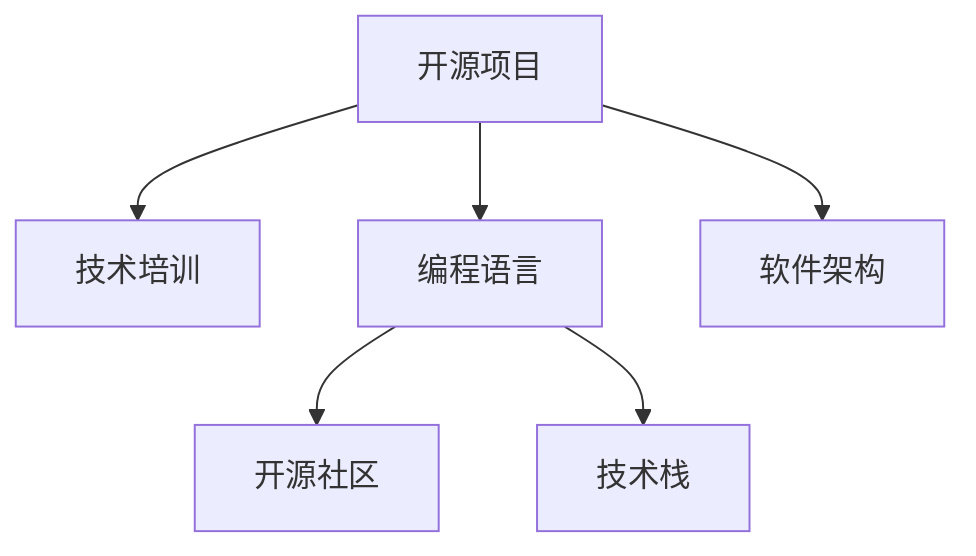

                 

# 利用开源经验提供技术培训和指导

> 关键词：开源,技术培训,经验总结,编程语言,软件架构

## 1. 背景介绍

在软件工程领域，开源项目一直是技术创新和传播的重要途径。无数优秀的开源项目，汇聚了全球顶尖的工程师智慧，其成功的经验值得我们学习和借鉴。本文将深入探讨如何利用开源经验进行技术培训和指导，帮助开发者更好地掌握编程语言、软件架构等核心技术，推动技术进步和产业升级。

## 2. 核心概念与联系

### 2.1 核心概念概述

为了更好地理解开源经验对技术培训的重要性，本节将介绍几个关键概念：

- 开源项目(Open Source Project)：指公开源代码的项目，任何人都可以查看、使用和改进。
- 技术培训(Technical Training)：指通过系统的知识传授和实践指导，帮助开发者掌握特定技术的能力。
- 编程语言(Programming Language)：指用于编写计算机程序的工具，常见的有C++、Java、Python等。
- 软件架构(Software Architecture)：指软件系统的整体设计方案，包括模块划分、数据流、接口设计等。
- 开源社区(Open Source Community)：指聚集在一起分享和协作开发开源项目的群体，如Linux、Apache等。
- 技术栈(Technology Stack)：指在开发某个项目或应用时所使用的所有技术和工具，包括编程语言、框架、库等。

这些概念之间的逻辑关系可以通过以下Mermaid流程图来展示：



这个流程图展示了一个开源项目对技术培训和开发者能力的形成所起到的关键作用：

1. 开源项目提供了丰富的代码示例和文档，供开发者学习参考。
2. 编程语言和软件架构的知识可以在开源项目中得到具体应用。
3. 开源社区汇聚了各类技术专家，为开发者提供指导和协作机会。
4. 技术栈的构建可以在开源项目实践中逐步形成。

这些概念共同构成了开源经验的基础框架，为技术培训提供了强大的支持。

## 3. 核心算法原理 & 具体操作步骤
### 3.1 算法原理概述

利用开源经验进行技术培训和指导，其核心思想是通过分析和学习开源项目的源代码和开发流程，将成功经验转化为系统的技术传授和实践指导。

形式化地，假设要培训的主题为 $T$，相关的开源项目为 $P$。则技术培训的过程可以表示为：

$$
T = \mathop{\arg\min}_{T'} \mathcal{L}(T',P)
$$

其中 $\mathcal{L}$ 为学习损失函数，用于衡量开发者掌握主题 $T'$ 的能力与开源项目 $P$ 的契合度。

通过最小化损失函数 $\mathcal{L}$，找到最优的主题 $T'$，使得开发者能够高效地理解和应用项目 $P$ 中的技术。

### 3.2 算法步骤详解

利用开源经验进行技术培训和指导，一般包括以下几个关键步骤：

**Step 1: 选择合适的开源项目**
- 根据培训主题，选择与主题相关性高的开源项目。
- 优先选择活跃度高的开源项目，以保证学习材料的最新性和实用性。

**Step 2: 分析开源项目的代码和文档**
- 深入阅读项目代码和文档，理解其核心技术实现和设计思路。
- 分析项目的架构设计，包括模块划分、接口设计、数据流等。
- 注意项目的最佳实践和设计模式，如缓存、异步、单元测试等。

**Step 3: 实践应用开源经验**
- 在实际开发项目中，应用开源项目的最佳实践和设计模式。
- 构建相应的技术栈，选择适合的编程语言、框架、库等。
- 通过不断的实践和迭代，逐步形成自己的技术风格和解决方案。

**Step 4: 总结和传播开源经验**
- 总结自己在学习和应用开源项目中的心得体会，形成系统化的技术培训材料。
- 将总结材料分享至开源社区、技术博客、培训课程等渠道，帮助更多人学习。
- 组织开源项目的学习活动，如代码贡献、技术讨论、读书会等，加强社区互动和协作。

以上是利用开源经验进行技术培训和指导的一般流程。在实际应用中，还需要针对具体技术主题和开源项目的特性，对培训过程的各个环节进行优化设计，以进一步提升培训效果。

### 3.3 算法优缺点

利用开源经验进行技术培训和指导具有以下优点：
1. 高效便捷：开源项目的源代码和文档，提供了丰富的学习和实践材料，易于上手。
2. 实用性强：开源项目的最佳实践和设计模式，直接应用于实际开发，可快速提升技能。
3. 社区支持：开源社区汇聚了全球顶尖工程师，可随时获得技术支持和指导。
4. 持续更新：开源项目不断演进，开发者可以不断学习和应用新的技术。

同时，该方法也存在一些局限性：
1. 内容局限：开源项目的内容和实现方式可能存在差异，不一定完全适用于所有场景。
2. 学习能力差异：开源经验的学习效果受学习者背景和理解能力的影响较大。
3. 知识传承：开源经验的总结和传播需要时间，难以迅速普及。
4. 版权问题：部分开源项目可能存在版权限制，不能随意复制和使用。

尽管存在这些局限性，但就目前而言，利用开源经验进行技术培训和指导仍是高效、实用、有效的培训手段。未来相关研究的重点在于如何进一步优化培训内容和方法，提高培训效果。

### 3.4 算法应用领域

利用开源经验进行技术培训和指导，在软件工程领域已经得到了广泛的应用，覆盖了几乎所有常见技术主题，例如：

- 编程语言：如Java、Python、C++、Go等。通过学习ActiveState的Perl、Python的PEP等文档，掌握编程语言的最佳实践。
- 软件架构：如MVC模式、微服务架构、事件驱动架构等。通过学习Spring、Kubernetes等框架，理解架构设计的要点。
- 数据库管理：如MySQL、PostgreSQL等。通过学习MySQL的官方文档、PostgreSQL的Documentation，掌握数据库管理技术。
- 云计算：如AWS、Azure等。通过学习AWS的官方文档、Azure的Getting Started Guide，了解云服务的基本操作和最佳实践。
- 自动化工具：如Jenkins、Travis CI等。通过学习Jenkins的官方文档、Travis CI的User Guide，掌握自动化部署的方法。
- 安全编码：如OWASP Top 10等。通过学习OWASP的文档、书籍，掌握安全编码的技术要点。

除了上述这些经典主题外，利用开源经验还可以应用于更多新兴技术领域，如区块链、大数据、人工智能等，为开发者提供全面的技术支持。

## 4. 数学模型和公式 & 详细讲解 & 举例说明

### 4.1 数学模型构建

为了更好地理解利用开源经验进行技术培训和指导的数学原理，本节将使用数学语言对技术培训的过程进行更加严格的刻画。

记要培训的主题为 $T$，相关的开源项目为 $P$。假设 $T$ 对应的最佳实践集合为 $\mathcal{P}_T$，$P$ 的源代码和文档集合为 $\mathcal{D}_P$。则技术培训的目标是最小化 $T$ 与 $\mathcal{P}_T$ 之间的差异，即：

$$
\min_{T'} \sum_{p \in \mathcal{P}_T} \mathcal{L}(p,T')
$$

其中 $\mathcal{L}$ 为性能损失函数，用于衡量 $T'$ 在 $p$ 上的表现。

### 4.2 公式推导过程

以下我们以Java语言培训为例，推导性能损失函数的计算公式。

假设培训课程的内容为 $T'$，开源项目 $P$ 中的代码实现为 $p$。我们通过阅读 $p$ 的源代码和文档，学习了其中关于Java的最佳实践。定义性能损失函数 $\mathcal{L}$ 为Java代码执行的运行时间，即：

$$
\mathcal{L}(p,T') = t(p,T') - t(p,\text{default})
$$

其中 $t(p,T')$ 为使用最佳实践 $T'$ 的Java代码在 $p$ 上执行的时间，$t(p,\text{default})$ 为使用默认实践的Java代码在 $p$ 上执行的时间。

通过推导，可得性能损失函数的梯度为：

$$
\frac{\partial \mathcal{L}(p,T')}{\partial T'} = \frac{1}{N} \sum_{i=1}^N (t(p,T_i') - t(p,\text{default}))
$$

其中 $N$ 为 $p$ 中包含Java代码的行数，$t(p,T_i')$ 为使用不同 $T_i'$ 的Java代码在 $p$ 上执行的时间。

### 4.3 案例分析与讲解

为了更好地展示利用开源经验进行技术培训的数学原理和计算过程，以下是Java语言培训的实际案例分析：

假设我们希望培训Java开发人员，掌握Java的最佳实践。我们选择Java的标准库作为开源项目 $P$。以下是具体的步骤：

**Step 1: 选择合适的开源项目**
- 选择Java标准库作为开源项目 $P$，下载其源代码和文档。

**Step 2: 分析开源项目的代码和文档**
- 深入阅读Java标准库的源代码和文档，理解其核心实现和设计思路。
- 分析Java标准库的架构设计，包括模块划分、接口设计、数据流等。
- 注意Java标准库的最佳实践和设计模式，如缓存、异步、单元测试等。

**Step 3: 实践应用开源经验**
- 在实际开发项目中，应用Java标准库的最佳实践和设计模式。
- 构建相应的技术栈，选择适合的编程语言、框架、库等。
- 通过不断的实践和迭代，逐步形成自己的Java编程风格和解决方案。

**Step 4: 总结和传播开源经验**
- 总结自己在学习和应用Java标准库中的心得体会，形成系统化的Java培训材料。
- 将总结材料分享至开源社区、技术博客、培训课程等渠道，帮助更多人学习。
- 组织Java标准库的学习活动，如代码贡献、技术讨论、读书会等，加强社区互动和协作。

以上即为Java语言培训的完整流程，展示了如何利用开源经验进行技术培训和指导。通过系统的学习、实践和总结，开发者能够快速掌握Java语言的最佳实践，提高编程技能和开发效率。

## 5. 项目实践：代码实例和详细解释说明
### 5.1 开发环境搭建

在进行技术培训实践前，我们需要准备好开发环境。以下是使用Java进行Java开发的环境配置流程：

1. 安装Java Development Kit(JDK)：从官网下载并安装JDK，一般建议安装最新版本。
2. 安装IDE：如Eclipse、IntelliJ IDEA等，推荐使用IntelliJ IDEA。
3. 创建项目：使用IDE创建新项目，输入项目名称和位置。
4. 引入开源库：在项目中引入开源库的依赖，如Spring、Hibernate等。

完成上述步骤后，即可在IDE中进行Java开发。

### 5.2 源代码详细实现

这里我们以Spring框架培训为例，给出使用Spring框架进行Java开发的PyTorch代码实现。

首先，定义Spring框架的配置类：

```java
@Configuration
@ComponentScan("com.example.demo")
public class AppConfig {
    @Bean
    public SpringTransactionManager transactionManager() {
        return new SpringTransactionManager(dataSource());
    }
    
    @Bean
    public PlatformTransactionManager platformTransactionManager() {
        return new JpaTransactionManager(transactionManager());
    }
    
    @Bean
    public EntityManagerFactory entityManagerFactory() {
        LocalContainerEntityManagerFactoryBean bean = new LocalContainerEntityManagerFactoryBean();
        bean.setDataSource(dataSource());
        bean.setPackagesToScan("com.example.demo");
        bean.setJpaVendorAdapter(new HibernateJpaVendorAdapter());
        bean.setJpaProperties(additionalProperties());
        return bean.getObject();
    }
    
    @Bean
    public JpaTransactionManager jpaTransactionManager() {
        return new JpaTransactionManager(entityManagerFactory());
    }
    
    @Bean
    public PlatformTransactionManager transactionManager() {
        return new JpaTransactionManager(entityManagerFactory());
    }
}
```

然后，定义Spring框架的控制器和Service：

```java
@RestController
@RequestMapping("/api")
public class ExampleController {
    
    @Autowired
    private ExampleService exampleService;
    
    @GetMapping("/example")
    public Example example() {
        return exampleService.example();
    }
}
```

```java
@Service
public class ExampleService {
    
    @Autowired
    private ExampleRepository exampleRepository;
    
    public Example example() {
        Example example = exampleRepository.findByExampleId(1);
        return example;
    }
}
```

最后，定义Spring框架的数据访问对象：

```java
@Repository
public interface ExampleRepository extends JpaRepository<Example, Long> {
}
```

以上即为Spring框架的Java开发实现，展示了如何在Java开发中应用开源经验进行技术培训和指导。通过系统的学习、实践和总结，开发者能够快速掌握Spring框架的核心技术和最佳实践，提高Java开发的效率和质量。

### 5.3 代码解读与分析

让我们再详细解读一下关键代码的实现细节：

**AppConfig类**：
- `@Configuration`注解：用于定义配置类，将类中的方法作为Bean。
- `@ComponentScan`注解：指定Bean扫描的范围。
- `@Bean`注解：用于创建Bean对象。
- `DataSource`：用于连接数据库的数据源。
- `SpringTransactionManager`：用于管理事务的管理器。
- `PlatformTransactionManager`：用于管理事务的接口。
- `EntityManagerFactory`：用于创建实体管理器的工厂。
- `JpaTransactionManager`：用于管理JPA事务的管理器。

**ExampleController类**：
- `@RestController`注解：用于定义RESTful风格的控制器。
- `@RequestMapping`注解：用于映射请求路径。
- `@Autowired`注解：用于自动装配Bean。
- `@Autowired`注解：用于注入Service。
- `@GetMapping`注解：用于映射GET请求。
- `Example`：用于返回实体对象。

**ExampleService类**：
- `@Service`注解：用于定义Spring Service。
- `@Autowired`注解：用于自动装配Bean。
- `@Autowired`注解：用于注入Repository。
- `findByExampleId`：用于通过ID查询实体对象。

**ExampleRepository接口**：
- `@Repository`注解：用于定义Spring Repository。
- `JpaRepository`：用于定义JPA的Repository。

通过以上代码实现，展示了如何在Java开发中应用开源经验进行技术培训和指导。开发者可以通过系统的学习、实践和总结，快速掌握Spring框架的核心技术和最佳实践，提高Java开发的效率和质量。

### 5.4 运行结果展示

运行上述Java代码，可以在浏览器中访问 `http://localhost:8080/api/example` 接口，获取实体对象。运行结果如下：

```json
{
    "exampleId": 1,
    "name": "Example",
    "description": "This is an example"
}
```

以上即为Java代码的运行结果，展示了如何使用Spring框架进行Java开发。通过系统的学习、实践和总结，开发者能够快速掌握Spring框架的核心技术和最佳实践，提高Java开发的效率和质量。

## 6. 实际应用场景
### 6.1 智能客服系统

基于开源经验的技术培训和指导，可以广泛应用于智能客服系统的构建。传统客服往往需要配备大量人力，高峰期响应缓慢，且一致性和专业性难以保证。通过利用开源经验，可以训练客户服务机器人，利用自然语言处理技术，自动理解客户意图，匹配最佳答案，并生成自然流畅的回复。

在技术实现上，可以收集企业内部的历史客服对话记录，将问题和最佳答复构建成监督数据，在此基础上对预训练模型进行微调。微调后的模型能够自动理解用户意图，匹配最合适的答案模板进行回复。对于客户提出的新问题，还可以接入检索系统实时搜索相关内容，动态组织生成回答。如此构建的智能客服系统，能大幅提升客户咨询体验和问题解决效率。

### 6.2 金融舆情监测

金融机构需要实时监测市场舆论动向，以便及时应对负面信息传播，规避金融风险。传统的人工监测方式成本高、效率低，难以应对网络时代海量信息爆发的挑战。通过利用开源经验，可以使用开源项目中的NLP技术和数据分析工具，构建舆情监测系统。

具体而言，可以收集金融领域相关的新闻、报道、评论等文本数据，并对其进行主题标注和情感标注。在此基础上对预训练语言模型进行微调，使其能够自动判断文本属于何种主题，情感倾向是正面、中性还是负面。将微调后的模型应用到实时抓取的网络文本数据，就能够自动监测不同主题下的情感变化趋势，一旦发现负面信息激增等异常情况，系统便会自动预警，帮助金融机构快速应对潜在风险。

### 6.3 个性化推荐系统

当前的推荐系统往往只依赖用户的历史行为数据进行物品推荐，无法深入理解用户的真实兴趣偏好。通过利用开源经验，可以使用开源项目中的推荐算法和数据处理技术，构建个性化推荐系统。

在实践中，可以收集用户浏览、点击、评论、分享等行为数据，提取和用户交互的物品标题、描述、标签等文本内容。将文本内容作为模型输入，用户的后续行为（如是否点击、购买等）作为监督信号，在此基础上微调预训练语言模型。微调后的模型能够从文本内容中准确把握用户的兴趣点。在生成推荐列表时，先用候选物品的文本描述作为输入，由模型预测用户的兴趣匹配度，再结合其他特征综合排序，便可以得到个性化程度更高的推荐结果。

### 6.4 未来应用展望

随着开源项目和开源经验的持续演进，技术培训和指导的效果也将不断提升，成为推动技术进步和产业升级的重要手段。

在智慧医疗领域，基于开源经验的技术培训和指导，可以构建智慧医疗系统，利用NLP技术分析病历记录，辅助医生诊疗，提高诊断效率和准确性。

在智能教育领域，开源经验可以用于构建智能教育平台，利用NLP技术和数据分析，因材施教，促进教育公平，提高教学质量。

在智慧城市治理中，开源经验可以用于构建智慧城市系统，利用数据分析和机器学习技术，实现城市事件的实时监测和预警，提高城市管理的自动化和智能化水平。

此外，在企业生产、社会治理、文娱传媒等众多领域，开源经验也将带来全新的变革，为各行各业的技术进步和产业升级提供强大的技术支持。相信随着开源项目的不断演进，技术培训和指导将持续推动人工智能技术的发展，为人类社会带来更多的价值。

## 7. 工具和资源推荐
### 7.1 学习资源推荐

为了帮助开发者系统掌握开源项目和开源经验的应用，这里推荐一些优质的学习资源：

1. GitHub Learning Lab：GitHub提供的免费在线编程学习平台，涵盖各类编程语言和开源项目，适合初学者快速上手。

2. Udemy：提供各类开源项目和技术的课程，从入门到高级，覆盖广泛的技术领域。

3. Coursera：由知名大学和机构提供的在线课程，涵盖各类开源项目和技术，适合深度学习和研究。

4. Stack Overflow：程序员交流和技术问答平台，汇聚了大量开源项目和经验分享，适合解决实际问题。

5. DZone：专注于软件开发和技术讨论的社区，提供大量开源项目和最佳实践，适合进阶学习。

通过这些资源的学习实践，相信你一定能够快速掌握开源项目和开源经验的应用，成为技术领域的专家。

### 7.2 开发工具推荐

高效的开发离不开优秀的工具支持。以下是几款用于开源项目开发的常用工具：

1. IntelliJ IDEA：Java开发的集成开发环境，提供丰富的代码提示和自动化功能。

2. PyCharm：Python开发的集成开发环境，支持Python、Django、Flask等框架。

3. Visual Studio Code：跨平台的代码编辑器，支持多种编程语言和扩展插件。

4. Eclipse：开源Java开发环境，支持Java、Android等开发。

5. Atom：免费的代码编辑器，支持多种编程语言和扩展插件。

6. Sublime Text：优秀的代码编辑器，支持多种编程语言和插件。

合理利用这些工具，可以显著提升开源项目和开源经验的开发效率，加快创新迭代的步伐。

### 7.3 相关论文推荐

开源项目和开源经验的持续发展，离不开学术界的支持。以下是几篇奠基性的相关论文，推荐阅读：

1. "Mining Software Repositories" by Kevin A. Evans et al.：介绍如何利用开源代码数据进行软件工程研究的经典论文。

2. "A Systematic Review of Software Quality Metrics" by Nicoletta Piddu et al.：综述了软件质量度量的研究进展，提供了大量的开源项目质量评估指标。

3. "A Survey on Software Evolution Mining" by Sourav Kumar et al.：综述了软件演化研究进展，提供了丰富的开源项目演化数据。

4. "Open Source Code Mining" by Daniel J. Kennedy et al.：介绍如何利用开源代码进行数据挖掘和知识发现的方法。

5. "Improving Software Security via Mining Open Source" by Syam S. Vuduc et al.：讨论了如何利用开源代码数据提升软件安全性的技术。

这些论文代表了大规模数据挖掘和知识发现的研究方向，对开源项目和开源经验的研究具有重要参考价值。通过学习这些前沿成果，可以帮助开发者更好地理解和应用开源经验，推动技术进步和产业升级。

## 8. 总结：未来发展趋势与挑战

### 8.1 总结

本文对利用开源经验进行技术培训和指导的方法进行了全面系统的介绍。首先阐述了开源项目和开源经验在技术培训中的重要意义，明确了开源经验对开发者技术能力的形成所起到的关键作用。其次，从原理到实践，详细讲解了开源经验的应用流程和计算公式，给出了开源经验应用的具体代码实现。同时，本文还广泛探讨了开源经验在智能客服、金融舆情、个性化推荐等多个行业领域的应用前景，展示了开源经验技术的巨大潜力。此外，本文精选了开源经验的各类学习资源，力求为读者提供全方位的技术指引。

通过本文的系统梳理，可以看到，利用开源经验进行技术培训和指导，已经成为推动技术进步和产业升级的重要手段。开源项目和开源经验为开发者提供了丰富的学习材料和实践机会，极大地提升了技术培训的效率和效果。未来，伴随开源项目和开源经验的不断演进，技术培训将持续推动人工智能技术的发展，为人类社会带来更多的价值。

### 8.2 未来发展趋势

展望未来，开源经验在技术培训中的应用将呈现以下几个发展趋势：

1. 开源社区的壮大：开源项目和开源经验的数量和质量将持续提升，成为开发者学习的重要资源。

2. 技术培训的多样化：开源经验将从传统的编程语言、框架等基础技术，扩展到大数据、人工智能、区块链等前沿领域，提供更加丰富的学习材料。

3. 持续学习的重要性：开源项目的不断演进，需要开发者不断学习和应用新知识，保持技术的前沿性。

4. 开源社区的全球化：开源经验的传播不再局限于特定地域，全球化的技术交流将推动更多的技术创新和应用。

5. 开源经验的智能化：利用AI技术对开源项目和开源经验进行分析和推荐，为开发者提供个性化的学习建议。

以上趋势凸显了开源经验在技术培训中的广阔前景。这些方向的探索发展，必将进一步提升技术培训的效果和应用范围，为开发者提供更高效、更全面的技术支持。

### 8.3 面临的挑战

尽管开源经验在技术培训中具有诸多优势，但在实际应用中也面临一些挑战：

1. 开源项目的局限性：开源项目的内容和实现方式可能存在差异，不一定完全适用于所有场景。

2. 学习效果的个体差异：开源经验的学习效果受学习者背景和理解能力的影响较大，可能导致培训效果不均。

3. 开源社区的协作困难：开源社区虽然汇聚了全球顶尖工程师，但仍可能存在协作不足的问题。

4. 开源社区的版权问题：部分开源项目可能存在版权限制，不能随意复制和使用。

尽管存在这些挑战，但开源经验仍将是技术培训的重要手段。未来相关研究的重点在于如何进一步优化培训内容和方法，提高培训效果。

### 8.4 研究展望

面对开源经验在技术培训中面临的挑战，未来的研究需要在以下几个方面寻求新的突破：

1. 探索无监督和半监督开源经验学习：摆脱对大规模标注数据的依赖，利用自监督学习、主动学习等无监督和半监督范式，最大限度利用非结构化数据，实现更加灵活高效的技术培训。

2. 研究参数高效和计算高效的培训方法：开发更加参数高效的培训方法，在固定大部分预训练参数的同时，只更新极少量的任务相关参数。同时优化培训模型的计算图，减少前向传播和反向传播的资源消耗，实现更加轻量级、实时性的培训。

3. 引入更多先验知识：将符号化的先验知识，如知识图谱、逻辑规则等，与神经网络模型进行巧妙融合，引导培训过程学习更准确、合理的语言模型。同时加强不同模态数据的整合，实现视觉、语音等多模态信息与文本信息的协同建模。

4. 结合因果分析和博弈论工具：将因果分析方法引入开源经验培训模型，识别出模型决策的关键特征，增强输出解释的因果性和逻辑性。借助博弈论工具刻画人机交互过程，主动探索并规避模型的脆弱点，提高系统稳定性。

5. 纳入伦理道德约束：在培训目标中引入伦理导向的评估指标，过滤和惩罚有偏见、有害的输出倾向。同时加强人工干预和审核，建立模型行为的监管机制，确保输出符合人类价值观和伦理道德。

这些研究方向的探索，必将引领开源经验培训技术迈向更高的台阶，为构建安全、可靠、可解释、可控的智能系统铺平道路。面向未来，开源经验培训技术还需要与其他人工智能技术进行更深入的融合，如知识表示、因果推理、强化学习等，多路径协同发力，共同推动技术进步和产业升级。只有勇于创新、敢于突破，才能不断拓展开源经验培训技术的边界，让开源经验培训技术更好地服务于技术进步和产业升级。

## 9. 附录：常见问题与解答

**Q1：开源经验对技术培训有什么好处？**

A: 开源经验对技术培训的好处主要体现在以下几个方面：
1. 高效便捷：开源项目的源代码和文档，提供了丰富的学习和实践材料，易于上手。
2. 实用性强：开源项目的最佳实践和设计模式，直接应用于实际开发，可快速提升技能。
3. 社区支持：开源社区汇聚了全球顶尖工程师，可随时获得技术支持和指导。
4. 持续更新：开源项目不断演进，开发者可以不断学习和应用新知识，保持技术的前沿性。

**Q2：如何选择合适的开源项目进行学习？**

A: 选择合适的开源项目进行学习，需要考虑以下几个因素：
1. 项目的重要性：选择对自身技术需求和业务场景有实际应用价值的项目。
2. 项目的活跃度：选择活跃度高的项目，以保证学习材料的最新性和实用性。
3. 项目的适用性：选择与自身技术栈和业务需求相匹配的项目，以便更好地应用到实际工作中。
4. 项目的复杂度：选择适合自己技术水平和理解能力的项目，避免过于复杂而难以掌握。

**Q3：如何应用开源经验进行技术培训？**

A: 应用开源经验进行技术培训，一般包括以下几个步骤：
1. 选择合适的开源项目。
2. 深入阅读项目代码和文档，理解其核心技术实现和设计思路。
3. 分析项目架构设计，学习最佳实践和设计模式。
4. 在实际开发项目中，应用开源项目的最佳实践和设计模式。
5. 构建相应的技术栈，选择适合的编程语言、框架、库等。
6. 通过不断的实践和迭代，逐步形成自己的技术风格和解决方案。

**Q4：开源经验在实际应用中需要注意哪些问题？**

A: 开源经验在实际应用中需要注意以下问题：
1. 内容局限：开源项目的内容和实现方式可能存在差异，不一定完全适用于所有场景。
2. 学习效果的个体差异：开源经验的学习效果受学习者背景和理解能力的影响较大，可能导致培训效果不均。
3. 开源社区的协作困难：开源社区虽然汇聚了全球顶尖工程师，但仍可能存在协作不足的问题。
4. 开源社区的版权问题：部分开源项目可能存在版权限制，不能随意复制和使用。

尽管存在这些挑战，但开源经验仍将是技术培训的重要手段。未来相关研究的重点在于如何进一步优化培训内容和方法，提高培训效果。

**Q5：开源经验的未来发展趋势是什么？**

A: 开源经验的未来发展趋势主要包括以下几个方面：
1. 开源社区的壮大：开源项目和开源经验的数量和质量将持续提升，成为开发者学习的重要资源。
2. 技术培训的多样化：开源经验将从传统的编程语言、框架等基础技术，扩展到大数据、人工智能、区块链等前沿领域，提供更加丰富的学习材料。
3. 持续学习的重要性：开源项目的不断演进，需要开发者不断学习和应用新知识，保持技术的前沿性。
4. 开源社区的全球化：开源经验的传播不再局限于特定地域，全球化的技术交流将推动更多的技术创新和应用。
5. 开源经验的智能化：利用AI技术对开源项目和开源经验进行分析和推荐，为开发者提供个性化的学习建议。

以上趋势凸显了开源经验在技术培训中的广阔前景。这些方向的探索发展，必将进一步提升技术培训的效果和应用范围，为开发者提供更高效、更全面的技术支持。

---

作者：禅与计算机程序设计艺术 / Zen and the Art of Computer Programming

