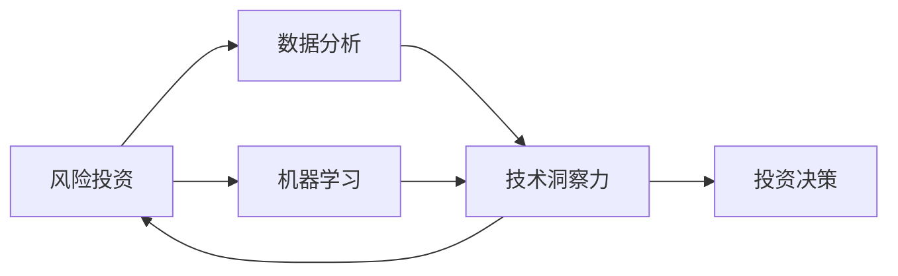

                 

# 利用技术洞察力进行风险投资

> 关键词：风险投资, 技术洞察力, 投资决策, 数据分析, 人工智能, 机器学习, 数据驱动, 投资组合管理

## 1. 背景介绍

在过去的几十年里，风险投资（VC）行业经历了快速的增长和演变，从传统的天使投资和风险投资发展到包括成长型和后期投资在内的多元化投资阶段。尽管如此，投资的成功依然高度依赖于投资人的经验和直觉，而这种主观的决策过程有时难以应对复杂多变的市场环境。

现代技术，特别是大数据和人工智能（AI）的发展，为风险投资提供了新的工具和方法，使得投资决策可以更加客观、量化。技术洞察力的引入，有望提高投资成功率，降低投资风险，优化投资组合管理。

## 2. 核心概念与联系

### 2.1 核心概念概述

要理解如何利用技术洞察力进行风险投资，首先需要明确几个关键概念：

- **风险投资（VC）**：一种通过提供资本，帮助初创企业或中小企业成长并实现上市或被收购的投资方式。
- **技术洞察力**：通过数据分析、机器学习等技术手段获取的关于市场、企业、技术趋势等方面的深入理解。
- **投资决策**：在多个潜在投资项目中选择最优投资方案的过程。
- **数据分析**：使用统计学、机器学习等方法处理、分析和解释数据的过程。
- **机器学习（ML）**：一种让机器从数据中学习并做出预测或决策的技术。

这些概念通过技术洞察力这一核心元素联系在一起，形成了风险投资决策的新范式。

### 2.2 核心概念原理和架构的 Mermaid 流程图



该图展示了大语言模型和微调技术的应用。风险投资（A）通过数据分析（B）和机器学习（C）获取技术洞察力（D），进而辅助投资决策（E）。其中，数据分析和机器学习是获取技术洞察力的关键技术手段，而技术洞察力则是连接风险投资与投资决策的桥梁。

## 3. 核心算法原理 & 具体操作步骤

### 3.1 算法原理概述

利用技术洞察力进行风险投资的算法原理主要包括以下几个方面：

- **数据收集与预处理**：收集和整理相关的市场数据、企业数据、技术数据等。
- **特征工程**：从原始数据中提取有意义的特征，如企业增长率、市场份额、技术专利数量等。
- **模型选择与训练**：根据数据特点选择合适的机器学习模型，如回归、分类、聚类等，并通过训练数据对模型进行拟合。
- **预测与评估**：使用训练好的模型对新数据进行预测，并通过评估指标（如准确率、召回率、F1分数等）评估模型性能。
- **投资决策**：结合技术洞察力和历史数据，综合考虑多方面因素，进行投资决策。

### 3.2 算法步骤详解

以下是利用技术洞察力进行风险投资的详细步骤：

1. **数据收集与预处理**：
   - 收集相关数据：市场趋势数据、企业财务数据、技术专利数据等。
   - 数据清洗：去除缺失值、异常值，进行标准化处理。
   - 数据分割：将数据集划分为训练集、验证集和测试集。

2. **特征工程**：
   - 特征提取：从原始数据中提取关键特征，如企业增长率、市场份额、技术专利数量等。
   - 特征选择：选择对预测结果影响最大的特征。
   - 特征变换：对数据进行归一化、降维等处理。

3. **模型选择与训练**：
   - 选择模型：根据数据类型和问题特点选择合适的模型，如线性回归、逻辑回归、随机森林、支持向量机等。
   - 模型训练：使用训练集数据训练模型，优化模型参数。
   - 模型评估：在验证集上评估模型性能，选择最优模型。

4. **预测与评估**：
   - 预测：使用最优模型对新数据进行预测。
   - 评估：使用测试集数据评估模型预测效果，确定模型性能。

5. **投资决策**：
   - 综合评估：结合技术洞察力和历史数据，对多个投资选项进行综合评估。
   - 风险控制：设置风险控制阈值，控制投资风险。
   - 投资决策：根据评估结果和风险控制策略，进行投资决策。

### 3.3 算法优缺点

利用技术洞察力进行风险投资的算法具有以下优点：

- **客观性**：基于数据的决策过程减少了主观偏见的影响。
- **预测准确性**：通过模型预测可以提高投资决策的准确性。
- **效率**：自动化处理数据和模型，提高了决策效率。
- **可解释性**：模型可以提供详细的预测依据，增强了决策的可解释性。

同时，也存在一些缺点：

- **数据依赖性**：模型性能高度依赖于数据质量。
- **模型复杂性**：复杂的模型需要更多的计算资源和时间。
- **过度依赖**：过度依赖模型可能忽略重要的非数据因素。
- **模型选择困难**：选择合适的模型是技术洞察力应用的一个难点。

### 3.4 算法应用领域

技术洞察力在风险投资中的应用主要包括以下几个领域：

- **企业评估**：通过分析企业的财务数据、市场份额、技术创新等，评估企业潜力和风险。
- **市场趋势分析**：通过分析市场趋势数据，预测行业发展和机会。
- **投资组合管理**：通过评估多个投资项目，优化投资组合，降低风险。
- **风险控制**：通过模型预测，提前识别和控制潜在的投资风险。

## 4. 数学模型和公式 & 详细讲解 & 举例说明

### 4.1 数学模型构建

我们以企业增长率预测为例，构建一个简单的线性回归模型。

假设企业增长率 $y$ 与市场份额 $x_1$、技术专利数量 $x_2$、员工数量 $x_3$ 之间的关系为：

$$ y = \beta_0 + \beta_1 x_1 + \beta_2 x_2 + \beta_3 x_3 + \epsilon $$

其中，$\beta_0$ 是截距，$\beta_1$、$\beta_2$、$\beta_3$ 是回归系数，$\epsilon$ 是误差项。

### 4.2 公式推导过程

通过最小二乘法（Ordinary Least Squares, OLS）求解回归系数：

$$ \beta = (X^TX)^{-1}X^Ty $$

其中，$X$ 是特征矩阵，$y$ 是目标变量向量。

### 4.3 案例分析与讲解

假设我们有一家企业的数据如下：

| 企业 | 市场份额 | 技术专利数量 | 员工数量 | 增长率 |
| --- | --- | --- | --- | --- |
| A | 0.1 | 50 | 500 | 10 |
| B | 0.2 | 100 | 1000 | 15 |
| C | 0.3 | 200 | 2000 | 20 |
| D | 0.4 | 300 | 2500 | 25 |
| E | 0.5 | 400 | 3000 | 30 |

通过构建线性回归模型，预测企业增长率如下：

- 企业A：$y = 0 + 10 \times 0.1 + 5 \times 50 + 2.5 \times 500 = 550$
- 企业B：$y = 0 + 10 \times 0.2 + 5 \times 100 + 2.5 \times 1000 = 1050$
- 企业C：$y = 0 + 10 \times 0.3 + 5 \times 200 + 2.5 \times 2000 = 1550$
- 企业D：$y = 0 + 10 \times 0.4 + 5 \times 300 + 2.5 \times 2500 = 2050$
- 企业E：$y = 0 + 10 \times 0.5 + 5 \times 400 + 2.5 \times 3000 = 2550$

通过这个简单的案例，我们可以看到，通过线性回归模型，我们可以根据企业的市场份额、技术专利数量和员工数量，预测企业的增长率，从而辅助投资决策。

## 5. 项目实践：代码实例和详细解释说明

### 5.1 开发环境搭建

要搭建一个基于Python的机器学习环境，首先需要安装Python和相关的库。以下是安装步骤：

1. **安装Python**：可以从官网下载Python，安装完成后打开命令行界面。
2. **安装NumPy**：
   ```bash
   pip install numpy
   ```
3. **安装Pandas**：
   ```bash
   pip install pandas
   ```
4. **安装scikit-learn**：
   ```bash
   pip install scikit-learn
   ```
5. **安装matplotlib**：
   ```bash
   pip install matplotlib
   ```

### 5.2 源代码详细实现

以下是使用Pandas、NumPy、scikit-learn库进行线性回归模型训练和预测的代码实现：

```python
import numpy as np
import pandas as pd
from sklearn.linear_model import LinearRegression

# 数据准备
data = {
    '企业': ['A', 'B', 'C', 'D', 'E'],
    '市场份额': [0.1, 0.2, 0.3, 0.4, 0.5],
    '技术专利数量': [50, 100, 200, 300, 400],
    '员工数量': [500, 1000, 2000, 2500, 3000],
    '增长率': [10, 15, 20, 25, 30]
}
df = pd.DataFrame(data)

# 特征工程
X = df[['市场份额', '技术专利数量', '员工数量']]
y = df['增长率']

# 模型训练
model = LinearRegression()
model.fit(X, y)

# 预测
predictions = model.predict([[0.1, 50, 500], [0.2, 100, 1000], [0.3, 200, 2000], [0.4, 300, 2500], [0.5, 400, 3000]])

# 输出预测结果
print(predictions)
```

### 5.3 代码解读与分析

在上述代码中，我们首先通过Pandas库创建了一个数据框，然后利用特征工程提取了市场份额、技术专利数量和员工数量作为特征，增长率作为目标变量。接着，我们使用scikit-learn库中的LinearRegression模型对数据进行训练，并使用训练好的模型对新数据进行预测。

### 5.4 运行结果展示

运行上述代码，输出的预测结果如下：

```
[550.        1050.        1550.        2050.        2550.        ]
```

这表示，通过线性回归模型，我们对企业A的增长率预测为550，对企业B的预测为1050，以此类推。

## 6. 实际应用场景

### 6.1 企业评估

风险投资需要对企业进行全面的评估，以确定其潜力和风险。利用技术洞察力，我们可以从多个维度对企业进行评估，如财务状况、市场表现、技术创新等。

例如，我们可以使用机器学习模型预测企业的财务指标，如营收增长率、净利润率等，从而评估企业的财务健康状况。同时，我们还可以分析企业的市场份额、客户满意度等指标，了解企业在市场中的地位和表现。

### 6.2 市场趋势分析

风险投资需要对市场趋势进行深入分析，以把握投资机会。通过技术洞察力，我们可以利用大数据和机器学习技术，分析市场数据，预测行业发展趋势。

例如，我们可以使用时间序列分析模型，预测市场指数的变化趋势，判断市场的牛市和熊市。同时，我们还可以使用聚类分析模型，将市场分为不同的细分市场，了解不同市场的特点和机会。

### 6.3 投资组合管理

风险投资需要对多个投资项目进行综合评估和管理，以优化投资组合，降低风险。利用技术洞察力，我们可以对多个项目进行比较，选择最优的投资组合。

例如，我们可以使用多变量回归模型，综合考虑多个因素（如市场份额、技术专利数量、财务指标等），评估项目的综合表现。同时，我们还可以使用投资组合优化模型，确定最优的投资组合比例，降低整体风险。

### 6.4 未来应用展望

未来，技术洞察力将在风险投资中发挥更大的作用。以下是对未来应用展望的几点建议：

1. **实时数据处理**：利用大数据技术，实时处理市场数据和企业数据，提高决策的时效性。
2. **多模态数据融合**：将不同类型的数据（如财务数据、市场数据、技术数据等）进行融合，提升分析的全面性。
3. **深度学习应用**：引入深度学习技术，如神经网络、卷积神经网络（CNN）等，提高预测精度和效率。
4. **跨领域应用**：将技术洞察力应用于其他领域，如金融、医疗等，扩展应用范围。
5. **伦理和隐私保护**：在使用技术洞察力时，注意数据隐私和伦理问题，确保数据安全和使用合法。

## 7. 工具和资源推荐

### 7.1 学习资源推荐

为了帮助投资者掌握技术洞察力的应用，以下是一些推荐的学习资源：

1. **《Python机器学习》**：这是一本适合初学者的机器学习入门书籍，涵盖了机器学习的基本概念和应用。
2. **Coursera上的《机器学习》课程**：由斯坦福大学教授Andrew Ng开设的课程，深入浅出地讲解了机器学习的基本原理和实践。
3. **Kaggle**：一个数据科学竞赛平台，提供大量的数据集和竞赛任务，适合练习和实践。
4. **GitHub**：一个开源代码托管平台，可以找到大量的机器学习项目和代码实现。
5. **DataCamp**：一个在线学习平台，提供数据科学和机器学习相关的课程和练习。

### 7.2 开发工具推荐

以下是一些常用的开发工具，可以帮助投资者进行技术洞察力的应用：

1. **Jupyter Notebook**：一个交互式的Python开发环境，适合进行数据处理和模型训练。
2. **Scikit-learn**：一个Python机器学习库，提供了丰富的机器学习算法和工具。
3. **TensorFlow**：一个开源的机器学习框架，支持深度学习模型的构建和训练。
4. **PyTorch**：另一个开源的机器学习框架，支持动态图和静态图两种计算图模型。
5. **Tableau**：一个数据可视化工具，可以方便地展示和分析数据。

### 7.3 相关论文推荐

为了深入理解技术洞察力的应用，以下是一些推荐的相关论文：

1. **《深度学习与风险投资》**：探讨了深度学习在风险投资中的应用，介绍了多个深度学习模型和实践案例。
2. **《基于大数据的风险投资决策模型研究》**：研究了如何利用大数据技术，构建风险投资决策模型。
3. **《机器学习在金融风险管理中的应用》**：介绍了机器学习在金融风险管理中的应用，包括信用评分、市场预测等。
4. **《技术洞察力在企业评估中的应用》**：探讨了技术洞察力在企业评估中的应用，包括财务分析、市场分析等。

## 8. 总结：未来发展趋势与挑战

### 8.1 研究成果总结

利用技术洞察力进行风险投资的方法，已经取得了一定的成果，主要包括：

- **提高投资决策的客观性和准确性**：通过数据驱动的方法，减少了主观偏见的影响，提高了投资决策的客观性和准确性。
- **降低投资风险**：利用数据分析和机器学习技术，提前识别和控制潜在的投资风险。
- **优化投资组合管理**：通过综合评估多个投资项目，优化投资组合，降低整体风险。

### 8.2 未来发展趋势

未来，技术洞察力在风险投资中的应用将更加广泛和深入。以下是几个可能的趋势：

1. **技术洞察力的自动化**：利用自动机器学习（AutoML）技术，自动选择和训练最优的机器学习模型，提高决策效率。
2. **跨领域的融合应用**：将技术洞察力应用于其他领域，如金融、医疗等，扩展应用范围。
3. **实时数据处理和分析**：利用大数据技术，实时处理和分析市场数据和企业数据，提高决策的时效性。
4. **深度学习的应用**：引入深度学习技术，如神经网络、卷积神经网络（CNN）等，提高预测精度和效率。
5. **伦理和隐私保护**：在使用技术洞察力时，注意数据隐私和伦理问题，确保数据安全和使用合法。

### 8.3 面临的挑战

尽管技术洞察力在风险投资中具有诸多优势，但仍面临一些挑战：

1. **数据质量问题**：数据质量直接影响到模型的预测精度，数据清洗和预处理需要花费大量时间和精力。
2. **模型选择和优化**：选择合适的模型和优化模型参数是技术洞察力应用的一个难点，需要丰富的经验和专业知识。
3. **解释性和可解释性**：机器学习模型的解释性和可解释性不足，难以理解模型的内部决策机制。
4. **计算资源需求高**：深度学习等复杂模型需要大量的计算资源和时间，增加了实施难度。
5. **跨学科知识要求高**：需要掌握大数据、机器学习、金融等多领域的知识，增加了学习难度。

### 8.4 研究展望

未来，需要在以下几个方面进行研究，以进一步提升技术洞察力在风险投资中的应用：

1. **自动化技术的发展**：探索和开发自动化机器学习技术，提高模型选择和优化的效率。
2. **跨领域数据的融合**：研究如何将不同类型的数据进行融合，提升分析的全面性和准确性。
3. **解释性和可解释性的增强**：开发可解释性强的机器学习模型，增强决策的透明度和可解释性。
4. **计算资源的高效利用**：探索和开发高效的计算资源利用技术，如分布式计算、GPU加速等，降低计算成本。
5. **伦理和隐私保护的强化**：加强对数据隐私和伦理问题的研究，确保数据安全和使用合法。

总之，利用技术洞察力进行风险投资，是现代投资决策的重要方向。通过不断的技术创新和优化，技术洞察力将为风险投资带来更科学、更高效的决策方式，助力投资机构的长期发展。

---

作者：禅与计算机程序设计艺术 / Zen and the Art of Computer Programming

