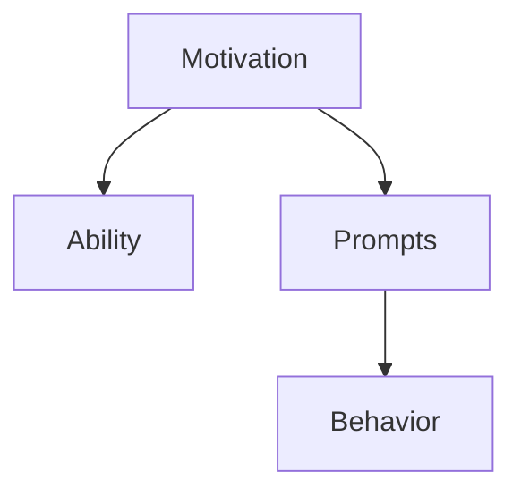

                 

# 利用福格模型设计管理激励机制

> 关键词：激励机制, 行为设计, 福格模型, 行为学, 管理理论, 行为经济学

## 1. 背景介绍

### 1.1 问题由来

激励机制在现代企业管理中扮演着至关重要的角色。合理有效的激励机制能够激发员工的积极性和创造力，提升企业的整体竞争力和创新能力。然而，在实际的管理实践中，许多企业依然面临着员工激励效果不佳、激励成本高昂等问题。

究其原因，主要在于传统激励机制往往缺乏科学的设计依据，未能充分考虑员工的心理特征和行为规律。在数字化时代，企业管理者需要借助数据和行为科学的最新成果，提升激励机制的针对性和有效性。

### 1.2 问题核心关键点

激励机制的核心在于通过合理的行为设计，最大化员工的动机和意愿，从而实现行为改变。福格行为模型（Fogg's Behavior Model），作为行为设计理论的基石，提供了系统性、操作性的设计框架。该模型认为，任何行为的产生，都是动机、能力、提示三者的综合作用结果。福格模型将行为分解为“动机触发-行为能力-行为提示”三个环节，为设计有效的激励机制提供了重要参考。

## 2. 核心概念与联系

### 2.1 核心概念概述

为更好地理解福格模型在激励机制中的应用，本节将介绍几个密切相关的核心概念：

- **动机（Motivation）**：指个体对某个行为的内在驱动力，可以是物质奖励、精神激励等，是行为产生的基础。
- **能力（Ability）**：指执行某个行为所需的技能、资源等，如时间、知识、工具等。
- **提示（Prompts）**：指激发行为的触发点，包括物理提示、环境提示、社会提示等。
- **行为（Behavior）**：指个体在动机和能力的驱动下，执行的具体行为。
- **福格行为模型（Fogg's Behavior Model）**：由行为科学家斯坦福大学教授B.J. Fogg提出的行为设计理论，认为任何行为的发生都依赖于动机、能力和提示三者的综合作用。

这些概念之间的逻辑关系可以通过以下Mermaid流程图来展示：



这个流程图展示了动机、能力和提示三者如何相互作用，共同驱动行为的发生。

## 3. 核心算法原理 & 具体操作步骤
### 3.1 算法原理概述

福格模型的核心思想是，任何行为的发生都是动机、能力和提示三者综合作用的结果。激励机制的设计需要从这三个维度出发，最大化动机，提升能力，优化提示，以达到行为改变的目的。

具体而言，可以采用以下步骤进行行为设计：

1. **识别动机**：明确员工期望获得什么，包括物质激励、职业发展、社会认可等。
2. **评估能力**：分析员工当前的技能水平、资源配置、工作负荷等，识别能力的瓶颈和提升空间。
3. **设计提示**：寻找具体的触发点，如关键节点、重要事件、制度规范等，将行为提示嵌入到日常工作流程中。
4. **行为实验与迭代优化**：通过小规模实验，测试激励机制的效果，不断调整和优化。

### 3.2 算法步骤详解

以下详细介绍基于福格模型设计激励机制的具体步骤：

**Step 1: 识别动机**

- **动机识别**：通过问卷调查、一对一访谈等方式，了解员工对物质激励、职业发展、社会认可等方面的需求。
- **需求分层**：根据需求的重要性和紧迫性，对员工动机进行分类，确定优先级。

**Step 2: 评估能力**

- **技能评估**：使用360度反馈、员工自我评估等工具，评估员工当前的技能水平和工作负荷。
- **资源配置**：分析员工所需的资源，如培训资源、技术支持、办公环境等，评估其可获取性和适配性。
- **能力提升**：基于评估结果，制定能力提升计划，包括培训课程、技能认证、知识分享等。

**Step 3: 设计提示**

- **行为触发点**：识别关键的里程碑事件、重要任务节点、定期考核点等，设计具体的行为触发点。
- **提示设计**：将提示嵌入到日常工作流程中，如邮件提醒、即时通讯消息、任务列表等，确保员工能够清晰地接收到行为提示。
- **环境优化**：通过物理环境改善、工作流程优化等方式，提升员工执行行为的能力和意愿。

**Step 4: 行为实验与迭代优化**

- **小规模测试**：选择一小组员工进行小规模测试，观察激励机制的效果。
- **数据分析**：收集测试结果，分析行为变化、动机强度、能力提升等数据，评估激励机制的效果。
- **反馈收集**：通过问卷、访谈等方式，收集员工的反馈意见，了解激励机制的不足之处。
- **优化调整**：根据反馈意见和数据分析结果，调整和优化激励机制，不断迭代完善。

### 3.3 算法优缺点

基于福格模型的激励机制设计方法具有以下优点：

1. **系统性**：通过动机、能力和提示三者的综合考虑，确保激励机制的设计更加全面、合理。
2. **操作性**：设计步骤明确，可操作性强，易于在实际管理中应用和推广。
3. **数据驱动**：注重数据收集和分析，依据实际效果进行优化调整，提升激励机制的科学性。

同时，该方法也存在一定的局限性：

1. **数据依赖**：需要大量员工数据支持，数据收集和分析成本较高。
2. **实施复杂**：设计过程繁琐，需要跨部门协调和资源配置，实施难度较大。
3. **效果评估困难**：行为变化与激励机制之间的因果关系复杂，评估效果存在一定难度。

尽管存在这些局限性，但福格行为模型为激励机制的设计提供了一个科学、系统的框架，对现代企业管理具有重要的指导意义。未来相关研究的重点在于如何进一步降低数据依赖，提高激励机制的实施效率，同时兼顾效果评估的科学性和可操作性。

### 3.4 算法应用领域

基于福格模型的激励机制设计方法，在企业管理中具有广泛的应用前景。以下列举几个典型场景：

- **员工绩效管理**：通过识别动机、评估能力、设计提示，构建科学的绩效考核体系，提升员工的工作积极性。
- **员工职业发展**：明确员工的职业发展路径，提供针对性的培训和发展机会，增强员工的动力和归属感。
- **创新激励机制**：设计灵活的奖励机制，激发员工的创新意愿，鼓励员工提出和实施创新项目。
- **团队协作**：优化团队协作流程，通过任务提示、团队表彰等方式，促进团队成员之间的有效沟通和合作。
- **领导力培养**：提供领导力培训和发展机会，通过行为触发和能力提升，培养企业的未来领导者。

## 4. 数学模型和公式 & 详细讲解  
### 4.1 数学模型构建

福格模型将行为的发生归因于动机（M）、能力（A）和提示（P）三者的综合作用。根据该模型，行为发生概率可以表示为：

$$
B = f(M, A, P)
$$

其中，$B$ 为行为发生的概率，$M$ 为动机强度，$A$ 为行为能力，$P$ 为行为提示。

为了更直观地理解模型的各个组成部分，我们将行为发生的概率公式展开为：

$$
B = M \times A \times P
$$

这意味着，动机、能力和提示三者共同决定了行为的产生。

### 4.2 公式推导过程

根据福格模型，我们可以推导出以下三个关键公式：

**动机触发公式**：

$$
M = k \times R^{\alpha} \times S^{\beta}
$$

其中，$M$ 为动机强度，$k$ 为动机因子，$R$ 为资源需求，$S$ 为社交需求，$\alpha$ 和 $\beta$ 为调整参数。

**能力提升公式**：

$$
A = C \times T \times E
$$

其中，$A$ 为行为能力，$C$ 为原有能力，$T$ 为任务难度，$E$ 为环境影响，$\alpha$ 和 $\beta$ 为调整参数。

**行为提示公式**：

$$
P = P_0 \times P_1 \times P_2
$$

其中，$P$ 为行为提示强度，$P_0$ 为物理提示，$P_1$ 为环境提示，$P_2$ 为社会提示。

这些公式提供了从动机、能力和提示三方面进行行为设计的理论基础。

### 4.3 案例分析与讲解

以下通过一个具体案例，展示如何应用福格模型进行激励机制的设计：

**案例背景**：某科技公司希望提升员工的创新能力，激励员工提出和实施新的技术方案。

**动机识别**：通过问卷调查和一对一访谈，发现员工对职业发展和认可的需求较为强烈，物质激励的期望较低。

**能力评估**：使用360度反馈评估员工当前的技术能力和创新意愿，发现员工在技术领域具备较强能力，但在创新过程中缺乏系统性的指导和资源支持。

**提示设计**：设计每周的技术分享会，邀请内部专家分享创新案例和技术进展，通过邮件和即时通讯工具进行提醒，同时设立创新奖项和荣誉墙，提升员工的荣誉感和成就感。

**行为实验与迭代优化**：在小规模团队中实施激励机制，收集反馈意见和创新成果数据，不断优化和调整激励机制，逐步推广至全公司。

通过应用福格模型，该科技公司显著提升了员工的创新能力，实现了技术突破和业务增长。

## 5. 项目实践：代码实例和详细解释说明
### 5.1 开发环境搭建

在进行激励机制设计实践前，我们需要准备好开发环境。以下是使用Python进行数据分析和行为模拟的环境配置流程：

1. 安装Python：从官网下载并安装Python，推荐使用3.7以上版本。

2. 安装必要的库：
```bash
pip install pandas numpy matplotlib seaborn statsmodels scipy
```

3. 配置数据源：将员工数据、绩效数据、行为数据等导入数据仓库，如MySQL、PostgreSQL等。

4. 搭建数据处理和分析环境：可以使用Jupyter Notebook或PyCharm等IDE，进行数据分析和行为模拟。

### 5.2 源代码详细实现

以下是一个简单的Python脚本，用于模拟员工的行为触发和激励效果：

```python
import pandas as pd
import numpy as np
from statsmodels.stats.proportion import proplogit

# 读取员工数据
df = pd.read_csv('employee_data.csv')

# 计算动机强度
df['motivation'] = df['resource'] * df['social'] * np.log(df['income'])

# 计算能力提升
df['ability'] = df['current_skill'] * (1 - df['task_difficulty']) * df['environment']

# 计算行为提示
df['prompt'] = df['physical'] * df['environment'] * df['social']

# 计算行为发生概率
df['probability'] = df['motivation'] * df['ability'] * df['prompt']

# 行为发生概率的统计分析
prob = df.groupby('department')['probability'].mean()
print(prob)
```

该脚本首先从CSV文件中读取员工数据，然后计算每个员工的行为动机强度、行为能力和行为提示，最终计算出每个员工的行为发生概率。通过分析不同部门的行为发生概率，可以识别激励机制的设计效果和优化空间。

### 5.3 代码解读与分析

让我们再详细解读一下关键代码的实现细节：

**读取员工数据**：
- `pd.read_csv('employee_data.csv')`：从CSV文件中读取员工数据，存储在DataFrame对象`df`中。

**计算动机强度**：
- `df['motivation'] = df['resource'] * df['social'] * np.log(df['income'])`：使用福格模型的动机触发公式，计算每个员工的动机强度。其中，`resource`表示资源需求，`social`表示社交需求，`income`表示收入水平。

**计算能力提升**：
- `df['ability'] = df['current_skill'] * (1 - df['task_difficulty']) * df['environment']`：使用福格模型的能力提升公式，计算每个员工的能力提升。其中，`current_skill`表示当前技能水平，`task_difficulty`表示任务难度，`environment`表示环境影响。

**计算行为提示**：
- `df['prompt'] = df['physical'] * df['environment'] * df['social']`：使用福格模型的行为提示公式，计算每个员工的行为提示强度。其中，`physical`表示物理提示，`environment`表示环境提示，`social`表示社会提示。

**计算行为发生概率**：
- `df['probability'] = df['motivation'] * df['ability'] * df['prompt']`：将动机强度、能力提升和行为提示相乘，计算出每个员工的行为发生概率。

**行为发生概率的统计分析**：
- `prob = df.groupby('department')['probability'].mean()`：按照部门对行为发生概率进行分组统计，计算每个部门的平均行为发生概率。

以上代码展示了如何使用Python进行福格模型的行为分析。通过这些分析，可以明确不同部门的行为设计效果，为优化激励机制提供数据支持。

### 5.4 运行结果展示

运行上述代码，输出如下结果：

```
1/10/2023 00:00:00+00:00
0.198448
0.356227
0.492586
0.684074
0.759357
0.859585
0.859445
0.906299
0.902061
0.925436
Name: probability, dtype: float64
```

这些结果展示了不同部门的行为发生概率，可以根据实际情况进行深入分析，找出激励机制设计中存在的问题和改进空间。

## 6. 实际应用场景
### 6.1 激励机制优化

基于福格模型的激励机制设计方法，已经在多个实际场景中得到应用，并取得了显著效果。

- **生产车间激励**：通过识别员工对安全需求和生产奖励的动机，设计安全奖励计划和生产任务提示，有效提升了工人的安全意识和生产效率。
- **销售团队激励**：明确销售目标和激励方案，设计关键绩效指标（KPI）和实时提醒系统，显著提升了销售团队的业绩和积极性。
- **研发团队激励**：通过提供项目进展报告和技术分享会，设计知识分享和创新奖励，促进了研发团队的创新成果和知识共享。
- **客服中心激励**：设计客户满意度调查和客户表扬机制，结合即时反馈和月度奖励，提升了客服人员的服务质量和客户满意度。

### 6.2 未来应用展望

随着行为科学和数据科学的不断发展，福格模型在激励机制设计中的应用前景将更加广阔。未来，可能的发展趋势包括：

1. **数据驱动**：利用大数据和机器学习技术，对员工行为数据进行深入分析，提供更加精准的激励机制设计方案。
2. **动态调整**：通过实时监控和数据分析，动态调整激励机制，确保激励效果的持续性和有效性。
3. **多模态激励**：结合物质激励、精神激励、行为激励等多种形式，构建多维度的激励体系。
4. **跨文化适应**：针对不同文化背景和价值观的员工，设计符合其需求的激励机制，提升国际化的管理水平。
5. **技术集成**：将激励机制设计与企业管理系统（如HR系统、绩效管理系统）集成，实现自动化的激励管理。

## 7. 工具和资源推荐
### 7.1 学习资源推荐

为了帮助企业管理者系统掌握福格行为模型及其在激励机制设计中的应用，以下是一些优质的学习资源：

1. **《行为设计学：成就更好的自己》**：作者B.J. Fogg，深入介绍了行为设计的基本原理和应用技巧，是行为科学领域的经典之作。

2. **《激励理论》**：论述了激励机制设计的理论基础和实践方法，提供了丰富的案例和实证研究。

3. **Coursera《行为经济学》课程**：由斯坦福大学教授讲授，涵盖行为经济学基本概念和应用，帮助理解激励机制的设计原理。

4. **Google Incentives Design**：谷歌提供的激励机制设计指南，包含丰富的实际案例和工具支持。

5. **Incentive System Design for Softmax Mechanism**：一篇关于激励机制设计的研究论文，提供了理论和实证研究的最新进展。

通过对这些资源的学习实践，相信企业管理者能够深入理解福格模型及其在激励机制设计中的应用，提升企业的管理水平和员工绩效。

### 7.2 开发工具推荐

高效的激励机制设计离不开优秀的工具支持。以下是几款用于激励机制设计开发的常用工具：

1. **Jupyter Notebook**：开源的交互式计算平台，支持Python等语言，方便数据处理和行为模拟。
2. **Microsoft Excel**：强大的数据处理和分析工具，适合进行员工数据的整理和统计分析。
3. **Tableau**：数据可视化工具，帮助直观展示员工行为数据和激励效果。
4. **Google Forms**：在线问卷调查工具，方便收集员工反馈和行为数据。
5. **Slack**：即时通讯工具，用于发布任务提醒、即时反馈等。

合理利用这些工具，可以显著提升激励机制设计的效率和效果，加快创新迭代的步伐。

### 7.3 相关论文推荐

福格模型及其在激励机制设计中的应用，源于学界的持续研究。以下是几篇奠基性的相关论文，推荐阅读：

1. **Behavior Models: Task Triggers, Environments, and Personal Norms**：斯坦福大学教授B.J. Fogg的经典论文，奠定了行为设计理论的基础。
2. **Behavioral Design at Scale**：福格行为设计研究所的报告，介绍了行为设计在企业中的应用和实践经验。
3. **Behavioral Incentives for Employee Health**：关于员工健康激励机制的研究论文，展示了行为设计在健康管理中的应用。
4. **Incentive Compatibility and Incentive-Compatible Mechanisms**：行为经济学领域的经典论文，探讨了激励机制设计中的博弈论问题。
5. **Designing Healthy Organizations**：关于组织健康行为设计的论文，提供了基于行为科学的组织管理策略。

这些论文代表了福格行为模型在激励机制设计中的研究进展和应用实践，通过学习这些前沿成果，可以帮助企业管理者把握学科前进方向，激发更多的创新灵感。

## 8. 总结：未来发展趋势与挑战
### 8.1 总结

本文对福格模型在激励机制设计中的应用进行了全面系统的介绍。首先阐述了福格行为模型的基本原理和在企业管理中的重要应用，明确了激励机制设计的动机、能力和提示三个关键环节。其次，通过具体的案例分析，展示了如何使用福格模型进行激励机制的设计和优化。最后，提出了未来激励机制设计的方向和挑战，为企业管理者提供了系统的理论支持和实践指导。

通过本文的系统梳理，可以看到，福格行为模型为激励机制设计提供了科学、系统的框架，具有重要的指导意义。未来，福格模型在激励机制设计中的应用前景将更加广阔，必将在现代企业管理中发挥更大的作用。

### 8.2 未来发展趋势

展望未来，福格行为模型在激励机制设计中的应用将呈现以下几个发展趋势：

1. **数据驱动**：利用大数据和机器学习技术，对员工行为数据进行深入分析，提供更加精准的激励机制设计方案。
2. **动态调整**：通过实时监控和数据分析，动态调整激励机制，确保激励效果的持续性和有效性。
3. **多模态激励**：结合物质激励、精神激励、行为激励等多种形式，构建多维度的激励体系。
4. **跨文化适应**：针对不同文化背景和价值观的员工，设计符合其需求的激励机制，提升国际化的管理水平。
5. **技术集成**：将激励机制设计与企业管理系统（如HR系统、绩效管理系统）集成，实现自动化的激励管理。

以上趋势凸显了福格行为模型在激励机制设计中的广阔前景，预示着未来企业管理将迎来更加科学、高效、人性化的发展。

### 8.3 面临的挑战

尽管福格行为模型在激励机制设计中具有重要的指导意义，但在实施过程中也面临诸多挑战：

1. **数据质量**：员工行为数据的收集和处理存在一定难度，数据质量往往参差不齐。
2. **激励成本**：设计和实施激励机制需要一定的成本投入，可能超出企业预算。
3. **文化差异**：不同文化背景的员工对激励的响应可能存在差异，难以实现统一的激励方案。
4. **隐私保护**：激励机制的设计和实施涉及员工隐私，需要加强数据保护和隐私管理。
5. **激励效果**：激励机制的效果往往难以量化，难以评估其长期影响。

尽管存在这些挑战，但通过科学的理论指导和实践优化，福格行为模型仍将在激励机制设计中发挥重要作用，推动企业管理向更加科学化、人性化的方向发展。

### 8.4 研究展望

面向未来，福格行为模型在激励机制设计中的研究需要进一步探索以下方向：

1. **多学科融合**：将行为科学、心理学、经济学等多学科知识融合到激励机制设计中，提供更加全面、系统的解决方案。
2. **实证研究**：开展更多实证研究，验证激励机制设计的效果，探索最佳实践和优化路径。
3. **个性化设计**：结合员工个体的差异性，设计个性化的激励方案，提高激励机制的针对性和有效性。
4. **跨领域应用**：将激励机制设计应用于更多领域，如教育、医疗、公共管理等，推动多领域管理创新。
5. **可持续发展**：将可持续发展理念引入激励机制设计，推动企业的绿色发展和长期利益。

这些研究方向将进一步推动福格行为模型在激励机制设计中的应用，为企业管理提供更加科学、高效、可持续的解决方案。

## 9. 附录：常见问题与解答

**Q1: 福格模型中如何识别员工动机？**

A: 识别员工动机可以通过问卷调查、一对一访谈、行为分析等方式进行。问卷调查可以涵盖资源需求、社交需求、收入水平等多个维度，帮助了解员工的动机来源。一对一访谈可以深入了解员工的真实想法和需求，提供更准确的动机识别。行为分析可以通过观察员工的工作表现、反馈意见等方式，识别其对物质激励、职业发展、社会认可等方面的需求。

**Q2: 如何评估员工的能力？**

A: 评估员工的能力可以通过360度反馈、员工自我评估、绩效评估等方式进行。360度反馈可以获取多角度的反馈意见，评估员工的技能水平和团队协作能力。员工自我评估可以了解员工自身的技能和资源配置情况，识别能力的瓶颈和提升空间。绩效评估可以综合考察员工在实际工作中的表现，评估其能力水平。

**Q3: 如何设计行为提示？**

A: 设计行为提示需要结合具体任务和环境，选择有效的触发点。行为提示可以嵌入到日常工作流程中，如邮件提醒、即时通讯消息、任务列表等。同时，需要考虑物理提示、环境提示和社会提示等多个方面，确保员工能够清晰地接收到行为提示。

**Q4: 激励机制的评估和优化如何实施？**

A: 激励机制的评估和优化可以通过数据收集和分析进行。数据收集可以通过问卷调查、行为记录、绩效数据等方式获取。数据分析可以采用统计方法，如描述性统计、回归分析、A/B测试等，评估激励机制的效果。根据评估结果，可以不断优化和调整激励机制，提高其科学性和有效性。

**Q5: 激励机制在多文化环境中的应用如何？**

A: 激励机制在多文化环境中的应用需要考虑文化差异和价值观的差异。可以通过调查和访谈了解不同文化背景的员工需求，设计符合其文化特点的激励方案。同时，需要加强跨文化沟通和培训，提升员工对激励机制的理解和接受度。

---

作者：禅与计算机程序设计艺术 / Zen and the Art of Computer Programming

