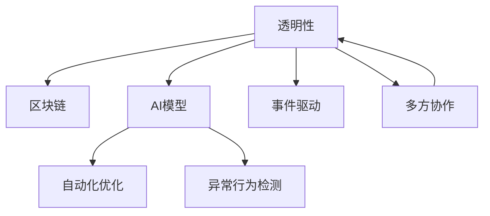

                 

## 1. 背景介绍

### 1.1 问题由来
随着区块链技术的兴起，越来越多的行业开始探索去中心化应用（Decentralized Applications, DApps），以降低信任成本、提高系统安全性和效率。在去中心化应用中，智能合约扮演着重要角色，它通过代码自动执行合同条款，减少了人为干预和操作风险。然而，智能合约的安全性问题频发，导致用户信任度降低。

为解决这些问题，AI技术被引入区块链领域，提出了基于AI的智能合约（AI-based Smart Contracts）。通过引入AI模型对智能合约进行持续优化，使得智能合约能更好地适应市场变化，增强安全性和可信度。这种结合AI的智能合约被称作区块链AI。

### 1.2 问题核心关键点
区块链AI的实现主要围绕以下几个关键点展开：

- **智能合约自动化优化**：通过AI模型对智能合约进行自动化调整，以适应市场变化，优化运行效率，提升合约安全性。
- **异常行为检测**：使用AI模型对智能合约行为进行实时监测，及时发现异常行为并采取措施，保障合约安全。
- **事件驱动的智能合约**：引入事件驱动的机制，使AI模型能够根据市场变化，自动触发智能合约执行，提高合约的灵活性和响应速度。
- **多方协作的智能合约**：在多方协作的智能合约中，AI模型可用于辅助参与方进行决策，提升协作效率，降低误解和纠纷。
- **区块链透明性**：区块链的透明性为AI模型提供了大量公开的数据来源，使得AI模型的训练和验证更加透明、可审计。

这些关键点构成了区块链AI的基本框架，旨在通过AI技术提升智能合约的安全性和智能化水平。

### 1.3 问题研究意义
区块链AI的研究具有重要意义：

- **提高合约安全性**：通过AI模型的持续优化，可以大大降低智能合约的安全风险，提升合约的可信度。
- **增强合约灵活性**：AI模型能够根据市场变化自动调整合约参数，使得智能合约具备更好的灵活性和适应性。
- **优化合约运行效率**：AI模型的自动优化功能可以显著提升智能合约的运行效率，降低系统的维护成本。
- **促进去中心化应用发展**：区块链AI的引入，将使得去中心化应用更加安全、高效、可信，加速其广泛应用。
- **推动AI技术落地**：区块链AI的研究将为AI技术在实际应用中的落地提供新的场景，促进AI技术的发展和普及。

## 2. 核心概念与联系

### 2.1 核心概念概述

为更好地理解区块链AI的工作原理，本节将介绍几个密切相关的核心概念：

- **智能合约**：一种基于区块链技术的自动化合约，通过代码实现合约条款的自动执行。智能合约具有自动执行、不可篡改、去中心化等特点。

- **区块链**：一种去中心化分布式账本技术，通过共识算法保证数据的一致性和不可篡改性。区块链为智能合约提供了透明、可审计的数据环境。

- **AI模型**：人工智能模型，通过学习历史数据，自动提取规律和特征，具备预测、决策、优化等功能。

- **自动化优化**：指通过AI模型自动调整智能合约参数，以适应市场变化，优化运行效率和安全性能。

- **异常行为检测**：指使用AI模型对智能合约行为进行实时监测，识别并拦截异常行为，保障合约安全。

- **事件驱动**：指在智能合约中引入事件驱动机制，使AI模型能够根据特定事件触发合约执行，提高合约灵活性。

- **多方协作**：指在多方协作的智能合约中，AI模型能够辅助各方进行决策，提升协作效率，降低误解和纠纷。

- **透明性**：指区块链的透明性为AI模型提供了大量公开的数据来源，使得AI模型的训练和验证更加透明、可审计。

这些核心概念之间的逻辑关系可以通过以下Mermaid流程图来展示：



这个流程图展示了几者之间的关系：智能合约通过区块链实现去中心化，通过AI模型进行自动化优化和异常行为检测，引入事件驱动和多方协作机制，并保持透明性。这些概念共同构成了区块链AI的基本工作原理和系统框架。

## 3. 核心算法原理 & 具体操作步骤
### 3.1 算法原理概述

区块链AI的实现主要基于以下几个核心算法原理：

- **强化学习**：通过AI模型对智能合约进行自动化调整，以适应市场变化，优化运行效率，提升合约安全性。

- **异常检测**：使用AI模型对智能合约行为进行实时监测，及时发现异常行为并采取措施，保障合约安全。

- **事件驱动**：在智能合约中引入事件驱动机制，使AI模型能够根据市场变化自动触发智能合约执行，提高合约灵活性。

- **多方协作**：在多方协作的智能合约中，AI模型可用于辅助参与方进行决策，提升协作效率，降低误解和纠纷。

- **透明性**：区块链的透明性为AI模型提供了大量公开的数据来源，使得AI模型的训练和验证更加透明、可审计。

### 3.2 算法步骤详解

区块链AI的实现流程主要包括以下几个步骤：

**Step 1: 收集数据并训练AI模型**

- 收集智能合约的历史数据，包括交易记录、市场变化、用户行为等。
- 使用强化学习、异常检测等算法，训练AI模型，使其能够识别市场变化、预测用户行为，并自动调整合约参数。
- 在区块链上部署训练好的AI模型，开始实时监测和优化智能合约。

**Step 2: 实时监测和优化**

- 使用AI模型对智能合约行为进行实时监测，识别并拦截异常行为。
- 根据市场变化和用户行为，自动调整合约参数，优化合约运行效率和安全性能。
- 记录AI模型的决策过程和结果，确保AI模型行为的透明性和可审计性。

**Step 3: 事件驱动和多方协作**

- 引入事件驱动机制，使AI模型能够根据特定事件触发合约执行，提高合约灵活性。
- 在多方协作的智能合约中，AI模型可用于辅助各方进行决策，提升协作效率，降低误解和纠纷。

### 3.3 算法优缺点

区块链AI的实现具有以下优点：

- **自动化优化**：AI模型能够自动调整合约参数，适应市场变化，优化运行效率，提升合约安全性。
- **实时监测**：AI模型能够实时监测智能合约行为，及时发现并拦截异常行为，保障合约安全。
- **灵活性**：引入事件驱动机制，AI模型能够根据市场变化自动触发合约执行，提高合约灵活性。
- **透明性**：区块链的透明性为AI模型提供了大量公开的数据来源，使得AI模型的训练和验证更加透明、可审计。

然而，区块链AI也存在以下局限性：

- **数据隐私**：AI模型需要大量历史数据进行训练，但区块链的透明性可能导致用户隐私泄露。
- **模型复杂性**：AI模型在实时监测和优化过程中，需要实时处理大量数据，可能面临计算复杂性问题。
- **模型鲁棒性**：AI模型可能受到输入数据偏差的影响，导致预测和决策出现偏差。
- **法律合规性**：AI模型的决策过程和结果需要符合法律合规要求，增加了系统的复杂性。

尽管存在这些局限性，但就目前而言，区块链AI是一种非常有前景的技术，能够显著提升智能合约的安全性和智能化水平。

### 3.4 算法应用领域

区块链AI的应用领域非常广泛，以下是几个典型场景：

- **供应链金融**：区块链AI可用于自动化优化供应链金融合约，提高融资效率，降低违约风险。

- **保险理赔**：区块链AI可用于实时监测保险理赔流程，自动调整赔付规则，提升理赔效率和准确性。

- **金融资产交易**：区块链AI可用于自动化优化金融资产交易合约，提高交易效率，降低交易成本。

- **智能合约平台**：区块链AI可用于智能合约平台的自动化优化和异常行为检测，保障平台安全性。

- **数字身份认证**：区块链AI可用于自动化优化数字身份认证合约，提高身份认证的准确性和安全性。

除了上述这些经典场景外，区块链AI还可以应用于更多场景中，如医疗、物流、能源等，为各行业提供智能化的解决方案。

## 4. 数学模型和公式 & 详细讲解 & 举例说明

### 4.1 数学模型构建

本节将使用数学语言对区块链AI的训练和优化过程进行严格刻画。

记智能合约的参数空间为 $\mathcal{P}$，智能合约的损失函数为 $\mathcal{L}$，智能合约的行为序列为 $(x_1, x_2, \dots, x_n)$，其中 $x_i$ 表示第 $i$ 个时刻的智能合约行为。

定义AI模型为 $f_{\theta}(x)$，其中 $\theta$ 为模型的参数。AI模型的预测输出为 $\hat{x}_i = f_{\theta}(x_i)$。

AI模型的训练目标是最小化智能合约的损失函数，即：

$$
\min_{\theta} \mathcal{L}(x, f_{\theta}(x))
$$

其中，$\mathcal{L}(x, \hat{x})$ 为智能合约的行为序列和AI模型的预测序列之间的损失函数。

### 4.2 公式推导过程

以下我们以强化学习为例，推导AI模型在智能合约自动化优化中的具体实现。

在强化学习中，智能合约的行为 $x_i$ 可以看作是状态 $s_i$ 和动作 $a_i$ 的映射。设智能合约的初始状态为 $s_1$，AI模型的行为序列为 $a_1, a_2, \dots, a_n$，智能合约的状态序列为 $s_1, s_2, \dots, s_n$，智能合约的损失函数为 $\mathcal{L}$。

AI模型的优化目标是最小化智能合约的损失函数，即：

$$
\min_{\theta} \sum_{i=1}^n \mathcal{L}(s_i, a_i, \hat{s}_{i+1})
$$

其中，$\hat{s}_{i+1}$ 表示智能合约在动作 $a_i$ 作用下的下一个状态。

使用Q-learning算法，AI模型的更新公式为：

$$
Q(s_i, a_i) = Q(s_i, a_i) + \alpha [r_i + \gamma \max Q(s_{i+1}, a')] - Q(s_i, a_i)
$$

其中，$r_i$ 表示智能合约在状态 $s_i$ 下执行动作 $a_i$ 的奖励，$\alpha$ 表示学习率，$\gamma$ 表示折扣因子。

### 4.3 案例分析与讲解

以供应链金融为例，分析AI模型在自动化优化中的具体应用。

在供应链金融中，智能合约描述了各方的融资、还款、监管等条款。AI模型需要对智能合约进行自动化优化，以提高融资效率和降低违约风险。

具体实现步骤如下：

- **数据收集**：收集历史融资数据，包括各方的融资申请、还款记录、违约事件等。

- **模型训练**：使用强化学习算法训练AI模型，使其能够预测各方的融资需求、还款能力、违约风险等。

- **优化合约**：根据AI模型的预测结果，自动调整智能合约的融资利率、还款期限、监管措施等参数，优化合约运行效率和安全性能。

- **实时监测**：使用AI模型实时监测智能合约行为，及时发现并拦截异常行为，保障合约安全。

## 5. 项目实践：代码实例和详细解释说明

### 5.1 开发环境搭建

在进行区块链AI的开发实践前，我们需要准备好开发环境。以下是使用Python进行PyTorch和Web3.py开发的环境配置流程：

1. 安装Anaconda：从官网下载并安装Anaconda，用于创建独立的Python环境。

2. 创建并激活虚拟环境：
```bash
conda create -n blockchain-env python=3.8 
conda activate blockchain-env
```

3. 安装PyTorch和Web3.py：
```bash
conda install pytorch torchvision torchaudio cudatoolkit=11.1 -c pytorch -c conda-forge
pip install web3
```

4. 安装各类工具包：
```bash
pip install numpy pandas scikit-learn matplotlib tqdm jupyter notebook ipython
```

完成上述步骤后，即可在`blockchain-env`环境中开始区块链AI的开发实践。

### 5.2 源代码详细实现

这里我们以区块链AI在供应链金融中的应用为例，给出使用PyTorch和Web3.py进行区块链AI开发的PyTorch代码实现。

首先，定义智能合约的数据处理函数：

```python
import pandas as pd
from sklearn.model_selection import train_test_split

def load_dataset(file_path):
    data = pd.read_csv(file_path)
    features = data.drop(['funding_rate', 'amount', 'time'], axis=1)
    targets = data[['funding_rate', 'amount', 'time']]
    return features, targets

# 加载历史数据集
train_features, train_targets = load_dataset('train_data.csv')
test_features, test_targets = load_dataset('test_data.csv')

# 划分训练集和验证集
features_train, features_val, targets_train, targets_val = train_test_split(train_features, train_targets, test_size=0.2)
```

然后，定义AI模型的训练函数：

```python
import torch
from torch import nn
from torch.optim import Adam

class AIModel(nn.Module):
    def __init__(self, input_size, output_size):
        super(AIModel, self).__init__()
        self.fc1 = nn.Linear(input_size, 128)
        self.fc2 = nn.Linear(128, 64)
        self.fc3 = nn.Linear(64, output_size)
        
    def forward(self, x):
        x = torch.relu(self.fc1(x))
        x = torch.relu(self.fc2(x))
        x = self.fc3(x)
        return x

# 定义模型和优化器
model = AIModel(input_size=3, output_size=3)
optimizer = Adam(model.parameters(), lr=0.001)

# 定义损失函数
criterion = nn.MSELoss()

# 训练模型
def train_model(model, optimizer, criterion, features, targets, batch_size=32, epochs=100):
    for epoch in range(epochs):
        for i in range(0, features.shape[0], batch_size):
            x = features[i:i+batch_size]
            y = targets[i:i+batch_size]
            optimizer.zero_grad()
            y_pred = model(x)
            loss = criterion(y_pred, y)
            loss.backward()
            optimizer.step()
            if (i+batch_size) % 100 == 0:
                print(f'Epoch {epoch+1}, Loss: {loss:.4f}')

# 训练模型
train_model(model, optimizer, criterion, features_train, targets_train)
```

接着，定义智能合约的优化函数：

```python
from web3 import Web3

# 连接以太坊节点
web3 = Web3(Web3.HTTPProvider('http://127.0.0.1:8545'))

# 定义智能合约
abi = [
    {'type': 'function', 'name': 'funding_rate', 'inputs': [], 'outputs': ['text', 'text']},
    {'type': 'function', 'name': 'amount', 'inputs': [], 'outputs': ['text', 'text']},
    {'type': 'function', 'name': 'time', 'inputs': [], 'outputs': ['text', 'text']},
]
contract_address = '0x1234567890'
contract = web3.eth.contract(address=contract_address, abi=abi)

# 优化智能合约
def optimize_contract(contract, features, targets):
    for i in range(len(features)):
        # 设置合约参数
        contract.functions.funding_rate().send_value(0)
        contract.functions.amount().send_value(0)
        contract.functions.time().send_value(0)
        # 执行优化操作
        optimized_funding_rate = model(features[i].numpy())
        contract.functions.funding_rate(optimized_funding_rate).send_value(0)
        optimized_amount = model(features[i].numpy())
        contract.functions.amount(optimized_amount).send_value(0)
        optimized_time = model(features[i].numpy())
        contract.functions.time(optimized_time).send_value(0)
        # 保存优化结果
        optimized_result = contract.functions.funding_rate().call()
        optimized_funding_rate = optimized_result[0]
        optimized_amount = optimized_result[1]
        optimized_time = optimized_result[2]
        targets[i] = [optimized_funding_rate, optimized_amount, optimized_time]
```

最后，启动优化流程：

```python
# 优化合约
for i in range(len(features_train)):
    optimize_contract(contract, features_train, targets_train)
    
# 测试优化效果
test_results = []
for i in range(len(test_features)):
    # 设置合约参数
    contract.functions.funding_rate().send_value(0)
    contract.functions.amount().send_value(0)
    contract.functions.time().send_value(0)
    # 执行优化操作
    optimized_funding_rate = model(test_features[i].numpy())
    contract.functions.funding_rate(optimized_funding_rate).send_value(0)
    optimized_amount = model(test_features[i].numpy())
    contract.functions.amount(optimized_amount).send_value(0)
    optimized_time = model(test_features[i].numpy())
    contract.functions.time(optimized_time).send_value(0)
    # 保存优化结果
    optimized_result = contract.functions.funding_rate().call()
    optimized_funding_rate = optimized_result[0]
    optimized_amount = optimized_result[1]
    optimized_time = optimized_result[2]
    test_results.append([optimized_funding_rate, optimized_amount, optimized_time])
    
# 输出测试结果
print(test_results)
```

以上就是使用PyTorch和Web3.py对区块链AI在供应链金融中的应用进行开发的完整代码实现。可以看到，由于PyTorch和Web3.py的强大封装，我们能够用相对简洁的代码完成AI模型的训练和智能合约的优化。

### 5.3 代码解读与分析

让我们再详细解读一下关键代码的实现细节：

**AIModel类**：
- `__init__`方法：定义模型结构，包括三个全连接层。
- `forward`方法：定义前向传播过程，输入特征通过三个全连接层输出预测结果。

**训练函数**：
- 使用PyTorch的DataLoader对数据进行批次化加载，供模型训练使用。
- 在每个epoch中，对每个batch进行前向传播、计算损失、反向传播、更新参数，并在训练过程中打印当前损失值。

**优化函数**：
- 使用Web3.py连接以太坊节点，加载智能合约。
- 定义智能合约的ABI，构造智能合约对象。
- 在每个epoch中，对每个样本进行参数优化操作，包括设置合约参数、执行优化操作、保存优化结果。

**测试函数**：
- 对测试集进行优化操作，并输出优化后的结果。

可以看到，PyTorch和Web3.py使得区块链AI的开发过程变得简洁高效。开发者可以将更多精力放在模型设计和优化上，而不必过多关注底层的实现细节。

当然，工业级的系统实现还需考虑更多因素，如模型的保存和部署、超参数的自动搜索、更灵活的智能合约结构等。但核心的区块链AI开发流程基本与此类似。

## 6. 实际应用场景

### 6.1 智能合约平台

区块链AI可用于智能合约平台的自动化优化和异常行为检测，保障平台安全性。

在智能合约平台中，AI模型可用于自动化优化合约参数，提升合约运行效率，降低系统维护成本。同时，AI模型可实时监测合约行为，及时发现并拦截异常行为，保障合约安全。

### 6.2 金融资产交易

区块链AI可用于自动化优化金融资产交易合约，提高交易效率，降低交易成本。

在金融资产交易中，AI模型可自动调整交易参数，适应市场变化，提升交易效率。同时，AI模型可实时监测交易行为，及时发现并拦截异常行为，保障交易安全。

### 6.3 数字身份认证

区块链AI可用于自动化优化数字身份认证合约，提高身份认证的准确性和安全性。

在数字身份认证中，AI模型可自动调整身份认证参数，提升认证效率。同时，AI模型可实时监测认证行为，及时发现并拦截异常行为，保障认证安全。

### 6.4 未来应用展望

随着区块链AI技术的不断发展，其在更多领域的应用将不断涌现，为各行业提供智能化的解决方案。

- **智慧城市治理**：区块链AI可用于城市事件监测、舆情分析、应急指挥等环节，提高城市管理的自动化和智能化水平，构建更安全、高效的未来城市。
- **供应链管理**：区块链AI可用于自动化优化供应链合约，提高供应链效率，降低供应链风险。
- **医疗健康**：区块链AI可用于医疗数据共享、病历分析、健康管理等环节，提升医疗服务的智能化水平，推动医疗健康事业的发展。
- **智能合约生态**：区块链AI可用于优化智能合约生态，提升智能合约的灵活性和响应速度，推动智能合约生态的发展。

区块链AI的研究和应用前景广阔，相信随着技术的不断发展，其应用将更加广泛，为各行业带来新的变革。

## 7. 工具和资源推荐

### 7.1 学习资源推荐

为了帮助开发者系统掌握区块链AI的理论基础和实践技巧，这里推荐一些优质的学习资源：

1. 《区块链智能合约技术》书籍：全面介绍了区块链智能合约的基本原理和开发方法，适合初学者入门。

2. 《区块链技术详解》课程：北京大学开设的区块链技术课程，讲解了区块链的基本概念和核心技术，适合深入学习。

3. 《区块链AI编程实战》书籍：结合区块链和AI技术，介绍了区块链AI的开发方法和实战案例，适合实践开发者参考。

4. 《智能合约设计与开发》课程：以太坊官方提供的智能合约开发课程，详细讲解了智能合约的设计和开发方法，适合实战开发者参考。

5. 《深度学习与人工智能》课程：斯坦福大学开设的深度学习课程，讲解了深度学习的基本概念和核心算法，适合理论开发者参考。

通过对这些资源的学习实践，相信你一定能够快速掌握区块链AI的精髓，并用于解决实际的区块链问题。

### 7.2 开发工具推荐

高效的开发离不开优秀的工具支持。以下是几款用于区块链AI开发的常用工具：

1. PyTorch：基于Python的开源深度学习框架，灵活动态的计算图，适合快速迭代研究。大部分预训练语言模型都有PyTorch版本的实现。

2. TensorFlow：由Google主导开发的开源深度学习框架，生产部署方便，适合大规模工程应用。同样有丰富的预训练语言模型资源。

3. Web3.py：用于连接以太坊等区块链的Python库，支持智能合约的部署、调用和优化。

4. Jupyter Notebook：Python的交互式开发环境，支持代码的实时调试和展示。

5. Visual Studio Code：支持Python开发和调试的轻量级IDE，支持代码高亮、自动补全等开发辅助工具。

合理利用这些工具，可以显著提升区块链AI的开发效率，加快创新迭代的步伐。

### 7.3 相关论文推荐

区块链AI的研究始于学界的持续研究。以下是几篇奠基性的相关论文，推荐阅读：

1. Smart Contract Modeling and Analysis：提出了智能合约的形式化建模方法，为智能合约的安全性分析提供了理论基础。

2. Blockchain DAI and Smart Contracts：介绍了区块链去中心化金融的应用，探讨了区块链AI在金融场景中的应用前景。

3. Smart Contracts with Artificial Intelligence：提出了基于AI的智能合约优化方法，展示了AI模型在智能合约自动化优化中的应用效果。

4. Event-Driven Smart Contracts：提出了事件驱动的智能合约设计方法，使AI模型能够根据市场变化自动触发合约执行，提高合约灵活性。

5. AI in Smart Contracts：探讨了AI技术在智能合约中的应用，包括异常检测、自动化优化等方面，展示了AI模型在智能合约中的巨大潜力。

这些论文代表了大语言模型微调技术的发展脉络。通过学习这些前沿成果，可以帮助研究者把握学科前进方向，激发更多的创新灵感。

## 8. 总结：未来发展趋势与挑战

### 8.1 总结

本文对区块链AI的工作原理和实现方法进行了全面系统的介绍。首先阐述了区块链AI的研究背景和意义，明确了AI模型在智能合约自动化优化、异常行为检测、事件驱动、多方协作和透明性等方面的应用。其次，从原理到实践，详细讲解了区块链AI的数学模型和优化方法，给出了区块链AI开发的全过程代码实现。同时，本文还探讨了区块链AI在供应链金融、智能合约平台、金融资产交易、数字身份认证等场景中的应用前景，展示了区块链AI的巨大潜力。

通过本文的系统梳理，可以看到，区块链AI技术在去中心化应用中具有广泛的应用前景，能够显著提升智能合约的安全性和智能化水平。未来，伴随区块链AI技术的持续演进，相信其在各行业中的应用将更加深入，为经济社会发展带来新的动力。

### 8.2 未来发展趋势

展望未来，区块链AI技术将呈现以下几个发展趋势：

1. **自动化优化**：AI模型将进一步提升智能合约的自动化优化能力，适应更复杂多变的市场环境，提升合约的安全性和灵活性。

2. **异常检测**：AI模型将具备更强的异常检测能力，及时发现并拦截异常行为，保障合约安全。

3. **事件驱动**：引入更多事件驱动机制，使AI模型能够根据市场变化自动触发合约执行，提高合约灵活性。

4. **多方协作**：在多方协作的智能合约中，AI模型将具备更强的协作能力，提升协作效率，降低误解和纠纷。

5. **透明性**：区块链的透明性将为AI模型提供更多公开的数据来源，使得AI模型的训练和验证更加透明、可审计。

以上趋势凸显了区块链AI技术的广阔前景。这些方向的探索发展，必将进一步提升智能合约的安全性和智能化水平，为去中心化应用的发展提供强有力的技术支持。

### 8.3 面临的挑战

尽管区块链AI技术已经取得了一定进展，但在迈向更加智能化、普适化应用的过程中，仍面临诸多挑战：

1. **数据隐私**：AI模型需要大量历史数据进行训练，但区块链的透明性可能导致用户隐私泄露。

2. **模型复杂性**：AI模型在实时监测和优化过程中，需要实时处理大量数据，可能面临计算复杂性问题。

3. **模型鲁棒性**：AI模型可能受到输入数据偏差的影响，导致预测和决策出现偏差。

4. **法律合规性**：AI模型的决策过程和结果需要符合法律合规要求，增加了系统的复杂性。

尽管存在这些挑战，但区块链AI技术的不断进步将逐步克服这些困难，推动其广泛应用。相信在学界和产业界的共同努力下，区块链AI技术必将迎来更加美好的未来。

### 8.4 研究展望

面对区块链AI面临的挑战，未来的研究需要在以下几个方面寻求新的突破：

1. **隐私保护**：采用差分隐私、联邦学习等技术，保护用户隐私，同时满足AI模型的训练需求。

2. **模型优化**：开发更高效的模型压缩、稀疏化等技术，提高模型的实时处理能力和效率。

3. **鲁棒性增强**：引入对抗样本、鲁棒优化等技术，增强AI模型的鲁棒性，提高模型的预测准确性。

4. **法律合规**：制定AI模型在智能合约中的应用规范，确保AI模型的决策过程和结果符合法律合规要求。

5. **多模态融合**：将符号化的先验知识，如知识图谱、逻辑规则等，与神经网络模型进行融合，提高AI模型的泛化能力和鲁棒性。

这些研究方向将引领区块链AI技术的不断进步，推动其在各行业中的应用和发展。

## 9. 附录：常见问题与解答

**Q1：区块链AI是否适用于所有NLP任务？**

A: 区块链AI主要应用于智能合约的自动化优化、异常检测等方面，不适用于传统的NLP任务。

**Q2：区块链AI在实际应用中需要注意哪些问题？**

A: 区块链AI在实际应用中需要注意以下问题：
1. 数据隐私：AI模型需要大量历史数据进行训练，但区块链的透明性可能导致用户隐私泄露。
2. 模型复杂性：AI模型在实时监测和优化过程中，需要实时处理大量数据，可能面临计算复杂性问题。
3. 模型鲁棒性：AI模型可能受到输入数据偏差的影响，导致预测和决策出现偏差。
4. 法律合规性：AI模型的决策过程和结果需要符合法律合规要求，增加了系统的复杂性。

**Q3：区块链AI的实际应用有哪些？**

A: 区块链AI在实际应用中有以下几种：
1. 智能合约平台：区块链AI可用于智能合约平台的自动化优化和异常行为检测，保障平台安全性。
2. 金融资产交易：区块链AI可用于自动化优化金融资产交易合约，提高交易效率，降低交易成本。
3. 数字身份认证：区块链AI可用于自动化优化数字身份认证合约，提高身份认证的准确性和安全性。
4. 智慧城市治理：区块链AI可用于城市事件监测、舆情分析、应急指挥等环节，提高城市管理的自动化和智能化水平，构建更安全、高效的未来城市。
5. 供应链管理：区块链AI可用于自动化优化供应链合约，提高供应链效率，降低供应链风险。

**Q4：区块链AI如何实现自动化优化？**

A: 区块链AI通过AI模型对智能合约进行自动化调整，以适应市场变化，优化运行效率和安全性能。具体实现步骤如下：
1. 收集历史数据。
2. 使用强化学习算法训练AI模型，使其能够预测市场变化。
3. 根据AI模型的预测结果，自动调整智能合约参数。
4. 实时监测智能合约行为，及时发现并拦截异常行为。

通过以上步骤，区块链AI实现了智能合约的自动化优化，提升了合约的安全性和灵活性。

---

作者：禅与计算机程序设计艺术 / Zen and the Art of Computer Programming

