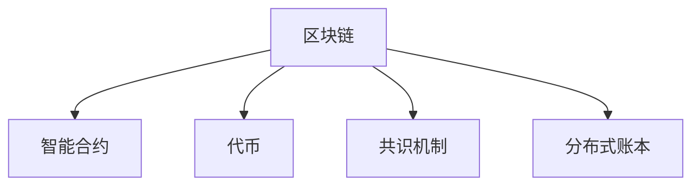

                 

# 区块链技术在注意力价值交易中的应用

## 1. 背景介绍

### 1.1 问题由来
随着区块链技术的不断发展和应用，人们对于区块链的理解已经从单纯的交易和记录扩展到价值链的各个环节。在传统的交易过程中，货币的流动和价值的转移主要依赖于信任机制，而在区块链上，所有的交易过程都通过分布式账本记录并广播给网络中的节点。这种去中心化的特点使得区块链在金融、供应链、版权保护等多个领域具有巨大的应用潜力。

然而，随着区块链技术的普及，人们对于区块链的关注点也逐渐转移到了如何更好地利用这一技术来创造和交易价值。传统的区块链应用主要集中于加密货币的交易和存储，而如何利用区块链技术来创造和交易“注意力”这一无形资产，成为了新的研究热点。

### 1.2 问题核心关键点
在区块链上，注意力作为一种难以用货币直接衡量的无形资产，如何对其进行价值化交易，成为了当前研究的一个核心问题。具体来说，主要包括以下几个关键点：

1. 如何定义和度量注意力？
2. 如何在区块链上构建和交易注意力的市场？
3. 如何利用区块链的智能合约机制来自动管理和交易注意力？

## 2. 核心概念与联系

### 2.1 核心概念概述

为了更好地理解区块链技术在注意力价值交易中的应用，本节将介绍几个密切相关的核心概念：

- 区块链(Blockchain)：一种去中心化的分布式账本技术，通过区块链接的形式记录和验证交易，确保数据的不可篡改性和透明性。
- 智能合约(Smart Contract)：一种自动执行、不可篡改的合约，通过区块链上的代码逻辑来实现各种复杂的金融合约、投票机制等。
- 代币(Token)：区块链上用于记录交易和账户状态的数字化资产，可以是加密货币、注意力等各类资产。
- 共识机制(Consensus Mechanism)：区块链网络中的一种协议，用于解决不同节点之间的共识问题，常见的有工作量证明(Proof of Work, PoW)、权益证明(Proof of Stake, PoS)等。
- 分布式账本(Distributed Ledger)：区块链的核心组成部分，通过去中心化的方式记录和存储交易数据，实现数据的去信任化管理。

这些核心概念之间的逻辑关系可以通过以下Mermaid流程图来展示：



这个流程图展示了几项核心概念及其之间的关系：

1. 区块链作为基础技术平台，通过智能合约、代币等机制来实现价值链的管理。
2. 智能合约作为区块链的编程语言，可以编写各种复杂逻辑，实现自动化的合同执行。
3. 代币作为区块链上的数字化资产，可以用来记录和转移各种价值，包括注意力。
4. 共识机制作为区块链的底层协议，保证网络中各节点的数据一致性。
5. 分布式账本作为区块链的核心组成部分，实现数据的去信任化管理。

这些核心概念共同构成了区块链技术的基础框架，使得区块链在各种价值交易中具备了不可替代的独特优势。

## 3. 核心算法原理 & 具体操作步骤
### 3.1 算法原理概述

区块链技术在注意力价值交易中的应用，本质上是利用区块链的智能合约机制来构建和交易注意力的市场。其核心思想是：将注意力定义为一种数字化资产，通过区块链上的智能合约，实现注意力的创建、转移和交易。

形式化地，假设注意力作为一种资产，其价值由网络中节点的关注程度和参与程度共同决定。定义一个资产函数 $V$，表示一个节点的注意力资产。在区块链上，一个节点的注意力资产可以通过智能合约自动更新，并在交易中自动转移。

### 3.2 算法步骤详解

基于区块链技术的注意力价值交易，通常包括以下几个关键步骤：

**Step 1: 定义注意力资产**
- 首先定义一个资产函数 $V$，用于计算和更新每个节点的注意力资产。可以通过区块链上的智能合约实现，如使用Solana上的Serum AMM(自动化做市商)实现资产的创建和转移。

**Step 2: 发布智能合约**
- 创建一个智能合约，用于定义和操作注意力资产。该合约可以包含资产的创建、转移、锁定等功能。例如，在Ethereum上使用Solidity编写一个智能合约，实现注意力的生成、转移和交易。

**Step 3: 添加交易逻辑**
- 在智能合约中添加注意力资产的转移逻辑，用于实现注意力的交易。例如，使用Solidity编写一个智能合约，实现注意力的市场买卖和交易。

**Step 4: 部署和测试**
- 将智能合约部署到区块链上，并测试其是否按照预期工作。例如，在Ethereum上通过测试网部署智能合约，并使用Remix IDE进行调试和测试。

**Step 5: 交易注意力**
- 在区块链上通过智能合约进行注意力的交易。例如，在Solana上使用Serum AMM进行注意力的买卖和交易。

### 3.3 算法优缺点

区块链技术在注意力价值交易中的应用，具有以下优点：

1. 去中心化和透明度：区块链的去中心化特性保证了注意力的流转和交易过程透明、公开，提高了交易的可信度和可追溯性。
2. 自动化和安全性：智能合约的自动化执行和自执行特性，减少了人为干预和欺诈风险，提高了交易的安全性和效率。
3. 可编程性和扩展性：通过区块链的编程语言实现自定义逻辑，可以构建多样化的注意力交易场景，增强应用的多样性和灵活性。
4. 可互操作性和互联性：区块链之间的跨链技术可以实现不同区块链之间的互通，扩展注意力的交易范围和市场规模。

同时，该方法也存在一定的局限性：

1. 高昂的成本：区块链上的交易需要支付一定的交易手续费，较高的交易成本可能影响注意力的流转效率。
2. 可扩展性问题：目前区块链的交易速度和处理能力有限，难以支持大规模、高频的注意力交易。
3. 隐私和数据保护：区块链上的数据是公开的，可能涉及个人隐私和数据安全问题，需要注意隐私保护和数据匿名化。
4. 技术门槛高：区块链技术和智能合约的开发需要较高的技术水平，普通开发者难以快速上手。

尽管存在这些局限性，但就目前而言，区块链技术在注意力价值交易中的应用已经展现出巨大的潜力和前景，值得进一步探索和研究。

### 3.4 算法应用领域

区块链技术在注意力价值交易中的应用，已经在多个领域得到了应用，例如：

- 内容创作平台：如GitHub、Stack Overflow等，通过智能合约和代币机制，实现对创作者关注度和参与度的记录和交易。
- 社交媒体平台：如Twitter、Reddit等，通过智能合约和代币机制，实现对用户的关注度和互动量的记录和交易。
- 线上活动平台：如Meetup、Eventbrite等，通过智能合约和代币机制，实现对用户参与度和活动关注度的记录和交易。
- 社区和论坛：如Discord、Reddit等，通过智能合约和代币机制，实现对社区成员活跃度和贡献度的记录和交易。

除了上述这些应用场景外，区块链技术在注意力价值交易中的应用还在不断拓展，为内容创作者、社交网络、活动组织等多领域带来了新的商业机会和发展空间。

## 4. 数学模型和公式 & 详细讲解 & 举例说明

### 4.1 数学模型构建

在区块链上，注意力价值交易的数学模型主要涉及以下几个方面：

- 资产函数 $V$：用于计算和更新每个节点的注意力资产。
- 转移函数 $T$：用于记录和转移注意力的流向。
- 智能合约逻辑 $L$：用于实现注意力的创建、转移和交易。

假设一个节点的注意力资产为 $V_i$，注意力的初始值为 $V_0$，节点的注意力资产随时间 $t$ 的变化率 $\Delta V_i$ 可以表示为：

$$
\Delta V_i = f(V_i, V_j, T_{i,j})
$$

其中 $f$ 为注意力资产的更新函数，$V_j$ 表示与节点 $i$ 相关联的另一个节点的注意力资产，$T_{i,j}$ 表示节点 $i$ 和节点 $j$ 之间的注意力转移。

### 4.2 公式推导过程

假设两个节点 $i$ 和 $j$ 之间的注意力转移规则为：

$$
T_{i,j} = k \times \frac{V_i}{V_j}
$$

其中 $k$ 为转移系数，$V_i$ 和 $V_j$ 分别表示节点 $i$ 和节点 $j$ 的注意力资产。根据以上定义，一个节点 $i$ 的注意力资产随时间 $t$ 的变化率可以表示为：

$$
\Delta V_i = k \times V_i \times (\frac{1}{V_i} - \frac{1}{V_j})
$$

假设注意力转移是一个固定比例，即 $k=1$，则一个节点 $i$ 的注意力资产随时间 $t$ 的变化率可以简化为：

$$
\Delta V_i = V_i \times (\frac{1}{V_i} - \frac{1}{V_j})
$$

进一步，假设 $V_i$ 和 $V_j$ 均与时间 $t$ 呈线性关系，即：

$$
V_i = a_i + b_i t, \quad V_j = a_j + b_j t
$$

代入上述公式，得到：

$$
\Delta V_i = (a_i + b_i t) \times (\frac{1}{a_i + b_i t} - \frac{1}{a_j + b_j t})
$$

这是一个典型的微分方程，可以通过数值方法求解，得到注意力资产随时间的变化曲线。

### 4.3 案例分析与讲解

以GitHub为例，GitHub上的贡献度和关注度可以看作是一种注意力资产。GitHub使用智能合约和代币机制，实现对用户的贡献度和关注度的记录和交易。具体来说，GitHub的GitHub Coins（GitHub Coin）是一种用于激励用户贡献的代币，用户可以通过贡献代码、解决问题等方式获得GitHub Coins，并与其他用户进行交换。

GitHub Coins的生成规则如下：

- 每个用户的GitHub Coins数量与其提交的代码行数、提交的pull request数量、解决的问题数量等有关。
- 用户可以通过积分转换的方式，将GitHub Coins转换为实际的货币或实物奖励。

GitHub Coins的生成和交易过程，可以通过智能合约实现，实现对用户贡献度的自动化记录和交易。通过这种机制，GitHub Coins激励用户积极参与社区建设，提高了GitHub平台的活跃度和质量。

## 5. 项目实践：代码实例和详细解释说明
### 5.1 开发环境搭建

在进行区块链项目开发前，我们需要准备好开发环境。以下是使用Solidity进行以太坊智能合约开发的环境配置流程：

1. 安装Node.js和npm：从官网下载并安装Node.js，并在命令行中检查版本是否在最新稳定版本。

2. 安装Truffle框架：在命令行中运行 `npm install -g truffle`，安装Truffle开发框架。

3. 安装Ganache CLI：在命令行中运行 `npm install -g ganache-cli`，安装Ganache CLI，用于本地测试智能合约。

4. 安装GitHub：从官网下载并安装GitHub Desktop，用于管理代码仓库和协作开发。

完成上述步骤后，即可在本地环境中开始智能合约的开发。

### 5.2 源代码详细实现

下面我们以GitHub Coins为例，给出使用Solidity编写智能合约的代码实现。

```solidity
// SPDX-License-Identifier: MIT
pragma solidity ^0.8.0;

contract GitHubCoins {
    address[] public tokenOwners;
    uint256 public totalCoins;
    uint256 public coinsPerIssue;

    event IssueCreated(uint256 _issueId);
    event CoinMinted(uint256 _coinId, address _beneficiary);

    constructor() {
        coinsPerIssue = 100;
        totalCoins = 0;
    }

    function mintCoins(uint256 issueId, address beneficiary) public {
        if (beneficiary == owner()) {
            uint256 coins = coinsPerIssue;
            totalCoins += coins;
            emit CoinMinted(issueId, beneficiary);
        } else {
            // Only owner can mint coins
        }
    }

    function issueNewIssue(uint256 issueId) public {
        uint256 coins = coinsPerIssue;
        emit IssueCreated(issueId);
    }

    function transferCoins(uint256 issueId, address to) public {
        if (msg.sender == owner()) {
            uint256 coins = coinsPerIssue;
            totalCoins -= coins;
            to.balance += coins;
            emit IssueCreated(issueId);
        } else {
            // Only owner can transfer coins
        }
    }

    function burnCoins(uint256 issueId) public {
        if (msg.sender == owner()) {
            uint256 coins = coinsPerIssue;
            totalCoins -= coins;
        } else {
            // Only owner can burn coins
        }
    }
}
```

在这个智能合约中，我们定义了GitHub Coins的创建、转移和销毁功能。具体来说：

- `coinsPerIssue` 表示每个issue的GitHub Coins数量。
- `totalCoins` 表示所有issue生成的GitHub Coins总数。
- `tokenOwners` 表示持有GitHub Coins的用户列表。

`mintCoins` 函数用于生成新的GitHub Coins，`issueNewIssue` 函数用于发布新的issue，`transferCoins` 函数用于转移GitHub Coins，`burnCoins` 函数用于销毁GitHub Coins。

### 5.3 代码解读与分析

让我们再详细解读一下关键代码的实现细节：

**GitHubCoins合约**：
- `constructor` 方法：初始化`coinsPerIssue` 和 `totalCoins` 变量。
- `mintCoins` 方法：如果调用者是从约定的地址（通常是合约所有者），则生成新的GitHub Coins并更新`totalCoins` 变量。
- `issueNewIssue` 方法：如果调用者是从约定的地址（通常是合约所有者），则发布新的issue并生成对应的GitHub Coins。
- `transferCoins` 方法：如果调用者是从约定的地址（通常是合约所有者），则转移GitHub Coins并更新`totalCoins` 变量。
- `burnCoins` 方法：如果调用者是从约定的地址（通常是合约所有者），则销毁GitHub Coins并更新`totalCoins` 变量。

这些函数的具体实现逻辑可以通过Solidity官方文档中的示例代码进行参考和理解。

## 6. 实际应用场景
### 6.1 智能合约平台

区块链上的智能合约平台，如Ethereum、Solana等，为开发者提供了丰富的开发工具和API接口，使得基于区块链的注意力价值交易变得简单易行。开发者可以利用这些平台，构建各种基于注意力的应用场景，如内容创作、社交媒体、线上活动等。

以内容创作平台为例，开发者可以在区块链上创建一个智能合约，记录创作者的内容发布、关注和互动数据，并通过代币机制激励创作者发布高质量内容。同时，可以通过智能合约实现内容的版权保护和内容交易，保障创作者的合法权益。

### 6.2 社交媒体平台

社交媒体平台如Twitter、Reddit等，可以利用区块链技术记录用户的关注度和互动数据，并通过智能合约和代币机制实现用户的注意力交易。例如，用户可以通过发布有价值的内容、参与讨论等方式获得平台的关注度和代币奖励，这些代币可以用于平台内的各种交易和奖励。

通过这种机制，社交媒体平台可以激励用户积极参与社区建设，提高平台的活跃度和内容质量。同时，平台还可以通过智能合约实现对用户数据的隐私保护和数据安全。

### 6.3 线上活动平台

线上活动平台如Meetup、Eventbrite等，可以利用区块链技术记录用户的活动参与度和关注度，并通过智能合约和代币机制实现用户的注意力交易。例如，用户可以通过参与线上活动、提交反馈等方式获得平台的关注度和代币奖励，这些代币可以用于平台内的各种交易和奖励。

通过这种机制，线上活动平台可以激励用户积极参与活动，提高平台的活跃度和用户粘性。同时，平台还可以通过智能合约实现对用户数据的隐私保护和数据安全。

### 6.4 未来应用展望

随着区块链技术的不断发展和应用，基于区块链的注意力价值交易将在更多领域得到应用，为内容创作者、社交网络、活动组织等多领域带来新的商业机会和发展空间。

在智慧医疗领域，基于区块链的注意力价值交易可以用于记录和交易患者的关注度和治疗反馈，提升医疗服务的质量和效率。

在智能教育领域，基于区块链的注意力价值交易可以用于记录和交易学生的关注度和学习表现，激励学生积极参与学习，提高教育质量。

在智慧城市治理中，基于区块链的注意力价值交易可以用于记录和交易市民的关注度和参与度，提升城市管理的智能化水平。

此外，在企业生产、社会治理、文娱传媒等众多领域，基于区块链的注意力价值交易也将不断涌现，为NLP技术带来了新的突破。相信随着预训练模型和微调方法的不断进步，基于区块链的注意力价值交易必将在构建人机协同的智能时代中扮演越来越重要的角色。

## 7. 工具和资源推荐
### 7.1 学习资源推荐

为了帮助开发者系统掌握区块链技术和智能合约的理论基础和实践技巧，这里推荐一些优质的学习资源：

1. 《Blockchain Basics》课程：由Blockchain.org提供的入门课程，涵盖了区块链的基本概念和应用场景。
2. 《Ethereum Developer Roadmap》教程：由Ethereum官方提供的开发者入门教程，包括智能合约开发、以太坊虚拟机(EVM)、加密货币等。
3. 《Solidity Cookbook》书籍：Solidity官方提供的开发手册，详细介绍了Solidity语言的各种用法和最佳实践。
4. 《Mastering Smart Contract Security》书籍：由Solidity安全专家编写，介绍了智能合约的安全开发方法和最佳实践。
5. 《Blockchain & Ethereum Fundamentals》课程：由Udemy提供的区块链基础课程，涵盖了区块链技术、智能合约开发和应用等。

通过对这些资源的学习实践，相信你一定能够快速掌握区块链技术和智能合约的精髓，并用于解决实际的区块链应用问题。

### 7.2 开发工具推荐

高效的开发离不开优秀的工具支持。以下是几款用于区块链智能合约开发常用的工具：

1. Truffle：由ConsenSys开发的开发框架，支持以太坊智能合约的开发、测试和部署。
2. Remix IDE：由Aragon和Gnosis开发的智能合约开发环境，支持Solidity和Truffle框架。
3. Ganache CLI：由Truffle开发的本地测试环境，支持以太坊智能合约的测试和调试。
4. MetaMask：由Ethereum基金会开发的浏览器插件，支持以太坊智能合约的交互和测试。
5. Tenderly：由ConsenSys开发的智能合约审计和安全分析工具，帮助开发者发现和修复智能合约漏洞。

合理利用这些工具，可以显著提升区块链智能合约开发的效率，加快创新迭代的步伐。

### 7.3 相关论文推荐

区块链技术和智能合约的发展源于学界的持续研究。以下是几篇奠基性的相关论文，推荐阅读：

1. "On the Semantics of Smart Contracts"：智能合约的语义定义和应用场景分析。
2. "Smart Contract Security"：智能合约的安全开发方法和最佳实践。
3. "Blockchain Technology: A Survey"：区块链技术的现状和未来发展方向。
4. "Decentralized Autonomous Organizations"：去中心化自治组织(DAO)的研究和应用。
5. "Blockchain for the Internet of Things"：区块链技术在物联网(IoT)中的应用和挑战。

这些论文代表了大语言模型微调技术的发展脉络。通过学习这些前沿成果，可以帮助研究者把握学科前进方向，激发更多的创新灵感。

## 8. 总结：未来发展趋势与挑战
### 8.1 总结

本文对区块链技术在注意力价值交易中的应用进行了全面系统的介绍。首先阐述了区块链技术和智能合约的研究背景和意义，明确了智能合约在实现注意力的记录和交易中的独特价值。其次，从原理到实践，详细讲解了区块链上注意力的价值化交易的数学模型和实现流程，给出了区块链智能合约的完整代码实例。同时，本文还广泛探讨了区块链技术在内容创作、社交媒体、线上活动等众多领域的应用前景，展示了区块链技术的巨大潜力和发展方向。

通过本文的系统梳理，可以看到，区块链技术在注意力价值交易中的应用，通过智能合约机制，使得注意力的流转和交易过程透明、公开、高效。这种机制不仅提高了交易的可信度和可追溯性，还增强了系统的安全性和扩展性，具有广泛的应用前景和重要意义。

### 8.2 未来发展趋势

展望未来，区块链技术在注意力价值交易中的应用将呈现以下几个发展趋势：

1. 智能合约的生态系统将更加完善。随着智能合约应用场景的不断扩展，智能合约的功能和工具将更加丰富，应用范围将更加广泛。
2. 跨链技术将进一步发展。跨链技术的成熟将使得不同区块链之间的互通更加高效，注意力的交易范围和市场规模将进一步扩大。
3. 去中心化自治组织(DAO)将得到更广泛的应用。DAO的自治特性将使得注意力的记录和交易更加民主化、透明化，增强系统的可信度和灵活性。
4. 隐私保护和数据安全将得到更多重视。区块链技术的隐私保护和数据安全问题需要进一步解决，以保障用户的数据安全和隐私权益。
5. 智能合约的自动化和自执行特性将得到更广泛的应用。智能合约的自动化特性将使得注意力的流转和交易过程更加高效、便捷。

这些趋势凸显了区块链技术在注意力价值交易中的广阔前景。这些方向的探索发展，必将进一步提升区块链系统的性能和应用范围，为内容创作者、社交网络、活动组织等多领域带来新的商业机会和发展空间。

### 8.3 面临的挑战

尽管区块链技术在注意力价值交易中的应用已经展现出巨大的潜力和前景，但在迈向更加智能化、普适化应用的过程中，它仍面临着诸多挑战：

1. 高昂的成本：区块链上的交易需要支付一定的交易手续费，较高的交易成本可能影响注意力的流转效率。
2. 可扩展性问题：目前区块链的交易速度和处理能力有限，难以支持大规模、高频的注意力交易。
3. 隐私和数据保护：区块链上的数据是公开的，可能涉及个人隐私和数据安全问题，需要注意隐私保护和数据匿名化。
4. 技术门槛高：区块链技术和智能合约的开发需要较高的技术水平，普通开发者难以快速上手。

尽管存在这些局限性，但就目前而言，区块链技术在注意力价值交易中的应用已经展现出巨大的潜力和前景，值得进一步探索和研究。

### 8.4 研究展望

面对区块链技术在注意力价值交易中所面临的种种挑战，未来的研究需要在以下几个方面寻求新的突破：

1. 探索无监督和半监督智能合约方法。摆脱对大规模标注数据的依赖，利用自监督学习、主动学习等无监督和半监督范式，最大限度利用非结构化数据，实现更加灵活高效的智能合约。
2. 研究参数高效和计算高效的智能合约范式。开发更加参数高效的智能合约方法，在固定大部分智能合约参数的同时，只更新极少量的任务相关参数。同时优化智能合约的计算图，减少前向传播和反向传播的资源消耗，实现更加轻量级、实时性的部署。
3. 融合因果和对比学习范式。通过引入因果推断和对比学习思想，增强智能合约建立稳定因果关系的能力，学习更加普适、鲁棒的语言表征，从而提升智能合约泛化性和抗干扰能力。
4. 引入更多先验知识。将符号化的先验知识，如知识图谱、逻辑规则等，与神经网络模型进行巧妙融合，引导智能合约过程学习更准确、合理的智能合约。同时加强不同模态数据的整合，实现视觉、语音等多模态信息与智能合约信息的协同建模。
5. 结合因果分析和博弈论工具。将因果分析方法引入智能合约，识别出智能合约决策的关键特征，增强输出解释的因果性和逻辑性。借助博弈论工具刻画人机交互过程，主动探索并规避智能合约的脆弱点，提高系统稳定性。

这些研究方向的探索，必将引领智能合约技术迈向更高的台阶，为构建安全、可靠、可解释、可控的智能系统铺平道路。面向未来，智能合约技术还需要与其他人工智能技术进行更深入的融合，如知识表示、因果推理、强化学习等，多路径协同发力，共同推动智能合约技术的进步。只有勇于创新、敢于突破，才能不断拓展区块链技术的边界，让智能合约技术更好地造福人类社会。

## 9. 附录：常见问题与解答

**Q1：智能合约的开发和部署需要哪些技术知识？**

A: 智能合约的开发和部署需要具备以下技术知识：
1. 区块链技术基础：了解区块链的工作原理、共识机制、智能合约等基本概念。
2. 编程语言：掌握智能合约开发所需的编程语言，如Solidity、Truffle等。
3. 工具使用：熟悉智能合约开发和部署所需的各种工具，如Ganache、Remix IDE等。
4. 应用场景：理解智能合约在具体应用场景中的需求和实现方式。

**Q2：如何设计智能合约的功能和接口？**

A: 设计智能合约的功能和接口时，需要考虑以下几个方面：
1. 功能性：确保智能合约具备所需的功能，如合约创建、资金转移、权限管理等。
2. 安全性：确保智能合约的安全性，避免攻击和漏洞。
3. 易用性：设计易于使用和理解的界面和接口，方便用户交互。
4. 可扩展性：确保智能合约具有良好的可扩展性，支持未来的业务需求。

**Q3：智能合约的优化和测试有哪些方法？**

A: 智能合约的优化和测试方法主要包括以下几种：
1. 代码审计：通过第三方工具或专家进行智能合约的代码审计，发现和修复漏洞。
2. 单元测试：编写单元测试用例，对智能合约的各个功能模块进行测试。
3. 集成测试：将智能合约与外部系统进行集成测试，验证各个模块之间的配合。
4. 压力测试：对智能合约进行高并发、高负载的压力测试，验证其稳定性和性能。

通过这些方法，可以确保智能合约的安全性、稳定性和可靠性，提高系统的质量和效率。

**Q4：智能合约在应用过程中需要考虑哪些问题？**

A: 智能合约在应用过程中需要考虑以下几个问题：
1. 法律合规性：确保智能合约的开发和应用符合所在地区的法律法规。
2. 用户隐私保护：保护用户数据和隐私，避免数据泄露和滥用。
3. 安全性：确保智能合约的安全性，避免攻击和漏洞。
4. 公平性：确保智能合约的执行公正、透明，避免利益冲突和腐败。

这些问题的处理需要综合考虑技术、法律、伦理等多个方面，确保智能合约的公正、透明和可靠性。

