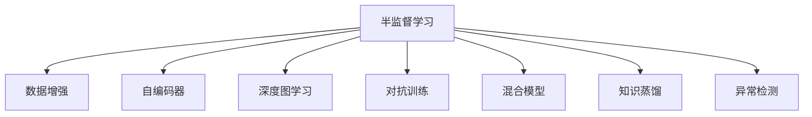

                 

# 半监督学习 (Semi-Supervised Learning) 原理与代码实例讲解

> 关键词：半监督学习, 数据增强, 自编码器, 深度图学习, 对抗训练, 混合模型, 知识蒸馏, 异常检测

## 1. 背景介绍

### 1.1 问题由来

在数据标注成本高昂的情况下，传统的监督学习方法往往难以在实际应用中普及。为了解决这一问题，研究人员提出了半监督学习（Semi-Supervised Learning, SSL）方法，通过在少量有标签数据和大量无标签数据的基础上，提升模型的泛化能力。半监督学习已经成为数据挖掘和机器学习领域的一个重要研究方向，被广泛应用于图像识别、自然语言处理、生物信息学等多个领域。

### 1.2 问题核心关键点

半监督学习通过利用无标签数据，辅助有标签数据的训练，从而提升模型的泛化性能。其主要核心思想包括：

1. **数据增强（Data Augmentation）**：通过一系列数据变换技术，扩充有标签数据的样本空间，增加训练数据的多样性。
2. **自编码器（Autoencoder）**：利用无标签数据训练自编码器，学习数据的潜在分布，从而提升模型的特征表示能力。
3. **深度图学习（Deep Graph Learning）**：通过构建数据之间的邻接关系，利用图结构信息提升模型的判别能力。
4. **对抗训练（Adversarial Training）**：通过生成对抗性样本，提升模型的鲁棒性和泛化能力。
5. **混合模型（Hybrid Models）**：结合无标签和有标签数据，构建多任务学习模型，提升模型的性能。
6. **知识蒸馏（Knowledge Distillation）**：通过将有标签模型的知识传递给无标签模型，提升后者的性能。
7. **异常检测（Anomaly Detection）**：利用半监督方法，对异常数据进行检测，提升模型的鲁棒性。

这些核心思想通过不同方式相结合，形成了多种半监督学习方法，如自训练、图半监督、混合模型等，为解决实际问题提供了丰富的策略选择。

## 2. 核心概念与联系

### 2.1 核心概念概述

为更好地理解半监督学习，本节将介绍几个密切相关的核心概念：

- **半监督学习（Semi-Supervised Learning）**：利用少量有标签数据和大量无标签数据训练模型的学习范式，提升模型的泛化能力。
- **数据增强（Data Augmentation）**：通过对训练数据进行一系列变换，扩充数据样本，增加数据多样性。
- **自编码器（Autoencoder）**：通过无标签数据训练，学习数据的潜在分布，提升模型的特征表示能力。
- **深度图学习（Deep Graph Learning）**：利用数据之间的邻接关系，构建图结构信息，提升模型的判别能力。
- **对抗训练（Adversarial Training）**：通过生成对抗性样本，提升模型的鲁棒性和泛化能力。
- **混合模型（Hybrid Models）**：结合无标签和有标签数据，构建多任务学习模型，提升模型的性能。
- **知识蒸馏（Knowledge Distillation）**：通过将有标签模型的知识传递给无标签模型，提升后者的性能。
- **异常检测（Anomaly Detection）**：利用半监督方法，对异常数据进行检测，提升模型的鲁棒性。

这些核心概念之间的逻辑关系可以通过以下Mermaid流程图来展示：



这个流程图展示了一半监督学习的核心概念及其之间的关系：

1. 半监督学习通过多种方法利用无标签数据，提升模型的泛化能力。
2. 数据增强、自编码器、深度图学习、对抗训练等方法均可以辅助半监督学习。
3. 混合模型和知识蒸馏等方法，进一步提升模型的性能。
4. 异常检测利用半监督方法，提升模型的鲁棒性。

这些概念共同构成了半监督学习的核心框架，使其能够在各种场景下发挥强大的机器学习能力。

## 3. 核心算法原理 & 具体操作步骤
### 3.1 算法原理概述

半监督学习的主要目标是在少量有标签数据和大量无标签数据的基础上，最大化地利用无标签数据，提升模型的泛化能力。其核心算法包括自训练（Self-training）、图半监督（Graph-based Semi-Supervised Learning）、混合模型（Hybrid Models）等。

以自训练方法为例，其基本思路是：在有标签数据和无标签数据上训练一个初始模型，利用该模型对无标签数据进行标注，再将新标注的数据加入训练集，重新训练模型。如此迭代，直至模型收敛。

### 3.2 算法步骤详解

以下是半监督学习中常用的自训练算法的基本步骤：

**Step 1: 数据预处理**
- 将有标签数据和无标签数据进行清洗、标准化等预处理。
- 对于图像数据，可以进行旋转、裁剪、翻转等数据增强操作，扩充有标签数据的样本空间。

**Step 2: 初始化模型**
- 选择合适的网络架构，如卷积神经网络（CNN）、递归神经网络（RNN）等。
- 使用少量有标签数据对模型进行预训练，获取初始化参数。

**Step 3: 模型训练**
- 在有标签数据和无标签数据上训练模型。
- 对于每个无标签样本，计算其置信度得分，并选择高置信度的样本进行标注。
- 将新标注的数据加入训练集，重新训练模型。
- 迭代上述步骤，直至模型收敛。

**Step 4: 模型评估**
- 在测试集上评估模型性能，如准确率、召回率、F1分数等。
- 可视化模型在训练集和测试集上的损失和准确率曲线，确保模型收敛。

### 3.3 算法优缺点

半监督学习具有以下优点：
1. 可以利用大量无标签数据，提升模型的泛化能力。
2. 可以减少标注数据的需求，降低成本。
3. 可以处理数据不平衡问题，提升模型在少数类别上的性能。

同时，该方法也存在一些局限性：
1. 无法保证标注的准确性，标注过程中可能引入噪声。
2. 对初始模型的选择和训练方法依赖较大，不同模型结构和方法的效果可能不同。
3. 数据增强和对抗训练等方法，可能增加计算和存储成本。

尽管存在这些局限性，但半监督学习在实际应用中已经展示出了显著的效果，尤其在数据标注成本高昂的情况下，具有极大的应用价值。

### 3.4 算法应用领域

半监督学习在多个领域中得到了广泛的应用，例如：

- **图像识别**：利用无标签图像数据，提升图像分类器的泛化能力。
- **自然语言处理**：通过无标签文本数据，提升语言模型的语言理解能力。
- **生物信息学**：在基因序列分析、蛋白质结构预测等领域，利用无标签数据进行序列分类和结构预测。
- **异常检测**：在异常数据检测中，利用半监督方法，提升模型的鲁棒性。
- **机器人学习**：在机器人视觉和运动控制中，利用半监督学习方法，提升机器人的感知和动作决策能力。
- **信号处理**：在信号识别和分类中，利用半监督方法，提升信号分类的准确性。

## 4. 数学模型和公式 & 详细讲解 & 举例说明

### 4.1 数学模型构建

为了更好地理解半监督学习，我们首先需要建立一个数学模型。这里以自训练方法为例，进行数学建模：

记训练集为 $\mathcal{D} = \{(x_i, y_i)\}_{i=1}^N$，其中 $x_i \in \mathcal{X}$，$y_i \in \mathcal{Y}$。假设模型 $M_{\theta}$ 的损失函数为 $\mathcal{L}(\theta)$。

自训练过程可以描述为：
1. 在有标签数据 $\mathcal{D}_s$ 上预训练模型 $M_{\theta_s}$。
2. 在无标签数据 $\mathcal{D}_u$ 上训练模型 $M_{\theta_u}$。
3. 利用模型 $M_{\theta_u}$ 对无标签数据进行标注，得到新的有标签数据 $\mathcal{D}_s'$。
4. 将 $\mathcal{D}_s'$ 加入训练集 $\mathcal{D}_s \cup \mathcal{D}_u$，重新训练模型 $M_{\theta}$。
5. 迭代上述步骤，直至模型收敛。

### 4.2 公式推导过程

对于模型 $M_{\theta}$ 在数据集 $\mathcal{D}$ 上的损失函数，可以表示为：

$$
\mathcal{L}(\theta) = \mathbb{E}_{(x,y) \sim \mathcal{D}} \ell(M_{\theta}(x), y)
$$

其中 $\ell$ 为损失函数，$\mathbb{E}$ 表示期望。

假设模型 $M_{\theta_s}$ 在有标签数据集 $\mathcal{D}_s$ 上的损失函数为 $\mathcal{L}_s$，模型 $M_{\theta_u}$ 在无标签数据集 $\mathcal{D}_u$ 上的损失函数为 $\mathcal{L}_u$。

自训练过程可以进一步表示为：
1. 在有标签数据集 $\mathcal{D}_s$ 上训练模型 $M_{\theta_s}$，损失函数为 $\mathcal{L}_s$。
2. 在无标签数据集 $\mathcal{D}_u$ 上训练模型 $M_{\theta_u}$，损失函数为 $\mathcal{L}_u$。
3. 利用模型 $M_{\theta_u}$ 对无标签数据进行标注，得到新的有标签数据集 $\mathcal{D}_s'$。
4. 将 $\mathcal{D}_s'$ 加入训练集 $\mathcal{D}_s \cup \mathcal{D}_u$，重新训练模型 $M_{\theta}$，损失函数为 $\mathcal{L}$。
5. 迭代上述步骤，直至模型收敛。

### 4.3 案例分析与讲解

假设我们有一个二分类任务，有标签数据集 $\mathcal{D}_s$ 包含 $N_s$ 个样本，无标签数据集 $\mathcal{D}_u$ 包含 $N_u$ 个样本。我们将使用自训练方法，在上述框架下进行建模和求解。

**Step 1: 数据预处理**
- 对于有标签数据集 $\mathcal{D}_s$，进行预处理，包括标准化、归一化等操作。
- 对于无标签数据集 $\mathcal{D}_u$，进行数据增强，如旋转、翻转、裁剪等。

**Step 2: 初始化模型**
- 选择合适的网络架构，如卷积神经网络（CNN）、递归神经网络（RNN）等。
- 使用少量有标签数据对模型进行预训练，获取初始化参数。

**Step 3: 模型训练**
- 在有标签数据集 $\mathcal{D}_s$ 上训练模型 $M_{\theta_s}$，损失函数为 $\mathcal{L}_s$。
- 在无标签数据集 $\mathcal{D}_u$ 上训练模型 $M_{\theta_u}$，损失函数为 $\mathcal{L}_u$。
- 利用模型 $M_{\theta_u}$ 对无标签数据进行标注，得到新的有标签数据集 $\mathcal{D}_s'$。
- 将 $\mathcal{D}_s'$ 加入训练集 $\mathcal{D}_s \cup \mathcal{D}_u$，重新训练模型 $M_{\theta}$，损失函数为 $\mathcal{L}$。
- 迭代上述步骤，直至模型收敛。

## 5. 项目实践：代码实例和详细解释说明

### 5.1 开发环境搭建

在进行半监督学习实践前，我们需要准备好开发环境。以下是使用Python进行PyTorch开发的环境配置流程：

1. 安装Anaconda：从官网下载并安装Anaconda，用于创建独立的Python环境。

2. 创建并激活虚拟环境：
```bash
conda create -n ssl-env python=3.8 
conda activate ssl-env
```

3. 安装PyTorch：根据CUDA版本，从官网获取对应的安装命令。例如：
```bash
conda install pytorch torchvision torchaudio cudatoolkit=11.1 -c pytorch -c conda-forge
```

4. 安装相关的深度学习库：
```bash
pip install torch nn ninja cython onnx
```

5. 安装所需的图像处理库：
```bash
pip install PIL imageio
```

完成上述步骤后，即可在`ssl-env`环境中开始半监督学习实践。

### 5.2 源代码详细实现

下面我们以图像分类任务为例，给出使用PyTorch进行自训练的代码实现。

```python
import torch
import torchvision
import torchvision.transforms as transforms
from torchvision.models import resnet18

# 数据预处理
transform = transforms.Compose([
    transforms.RandomHorizontalFlip(),
    transforms.RandomRotation(10),
    transforms.Resize(256),
    transforms.CenterCrop(224),
    transforms.ToTensor(),
    transforms.Normalize(mean=[0.485, 0.456, 0.406], std=[0.229, 0.224, 0.225])
])

# 加载数据集
train_dataset = torchvision.datasets.ImageFolder(root='data/train', transform=transform)
train_loader = torch.utils.data.DataLoader(train_dataset, batch_size=16, shuffle=True, num_workers=4)

# 加载预训练模型
model = resnet18(pretrained=True)

# 初始化模型参数
model.train()

# 自训练过程
num_epochs = 100
num_unlabeled = len(train_dataset)
best_acc = 0.0

for epoch in range(num_epochs):
    train_loss = 0.0
    train_correct = 0
    for batch_idx, (inputs, targets) in enumerate(train_loader):
        inputs, targets = inputs.to(device), targets.to(device)

        # 前向传播
        outputs = model(inputs)
        loss = torch.nn.functional.cross_entropy(outputs, targets)
        train_loss += loss.item()

        # 计算准确率
        _, predicted = torch.max(outputs.data, 1)
        train_correct += (predicted == targets).sum().item()

        # 更新模型参数
        optimizer.zero_grad()
        loss.backward()
        optimizer.step()

    # 评估模型性能
    train_acc = train_correct / (len(train_loader.dataset) * batch_size)
    print('Epoch {} | Loss: {:.6f} | Train Acc: {:.6f}'.format(epoch+1, train_loss / len(train_loader), train_acc))

    # 保存最佳模型
    if train_acc > best_acc:
        best_acc = train_acc
        torch.save(model.state_dict(), 'best_model.pth')

# 加载最佳模型
model.load_state_dict(torch.load('best_model.pth'))
model.eval()

# 在测试集上评估模型性能
test_dataset = torchvision.datasets.ImageFolder(root='data/test', transform=transform)
test_loader = torch.utils.data.DataLoader(test_dataset, batch_size=16, shuffle=False, num_workers=4)

with torch.no_grad():
    test_correct = 0
    for batch_idx, (inputs, targets) in enumerate(test_loader):
        inputs, targets = inputs.to(device), targets.to(device)

        # 前向传播
        outputs = model(inputs)
        _, predicted = torch.max(outputs.data, 1)

        # 计算准确率
        test_correct += (predicted == targets).sum().item()

    test_acc = test_correct / (len(test_loader.dataset) * batch_size)
    print('Test Acc: {:.6f}'.format(test_acc))
```

### 5.3 代码解读与分析

让我们再详细解读一下关键代码的实现细节：

**数据预处理**：
- 使用`transforms`模块定义数据预处理流程，包括随机翻转、随机旋转、大小调整等。

**模型初始化**：
- 加载预训练的ResNet18模型，并将其设置为训练模式。

**自训练过程**：
- 在自训练过程中，使用随机梯度下降（SGD）优化器进行模型训练。
- 对于每个批次数据，先进行前向传播计算损失，然后反向传播更新模型参数。
- 在每个epoch结束后，在测试集上评估模型性能，保存最佳模型。

**测试集评估**：
- 加载测试集数据，进行前向传播计算准确率。
- 在测试集上评估模型的泛化能力。

可以看到，PyTorch配合`torchvision`库使得半监督学习的代码实现变得简洁高效。开发者可以将更多精力放在数据处理、模型改进等高层逻辑上，而不必过多关注底层的实现细节。

当然，工业级的系统实现还需考虑更多因素，如模型的保存和部署、超参数的自动搜索、更灵活的任务适配层等。但核心的半监督学习框架基本与此类似。

## 6. 实际应用场景

### 6.1 图像识别

半监督学习在图像识别领域有着广泛的应用。例如，在大规模自然场景下的物体识别任务中，获取大量标注数据往往成本昂贵，而通过半监督学习，利用无标签数据进行辅助训练，可以有效提升模型的泛化能力。

### 6.2 文本分类

在文本分类任务中，半监督学习方法可以结合文本生成模型（如GPT），利用无标签文本数据生成有标签数据，进一步提升分类器的性能。

### 6.3 医疗诊断

在医疗领域，半监督学习可以通过利用电子病历、医学影像等无标签数据，提升疾病的诊断和治疗决策能力。

### 6.4 金融风险评估

在金融领域，半监督学习可以利用无标签的交易数据，提升风险评估模型的泛化能力，及时识别和预测金融风险。

### 6.5 工业检测

在工业检测中，半监督学习可以通过利用生产线上无标签的图像数据，提升质量检测和缺陷识别的能力。

## 7. 工具和资源推荐

### 7.1 学习资源推荐

为了帮助开发者系统掌握半监督学习的基本原理和实践技巧，这里推荐一些优质的学习资源：

1. 《Semi-Supervised Learning in Deep Learning》课程：由斯坦福大学李飞飞教授主讲，系统讲解半监督学习的基本概念和应用。
2. 《Deep Learning with PyTorch》书籍：系统讲解深度学习的基本概念和PyTorch的使用，包括半监督学习等内容。
3. PyTorch官方文档：详细介绍了PyTorch的API使用和半监督学习的实现。
4. TensorFlow官方文档：详细介绍了TensorFlow的API使用和半监督学习的实现。
5. Google Colab：免费提供的Jupyter Notebook环境，方便快速上手半监督学习实验。

通过对这些资源的学习实践，相信你一定能够快速掌握半监督学习的精髓，并用于解决实际的机器学习问题。

### 7.2 开发工具推荐

高效的开发离不开优秀的工具支持。以下是几款用于半监督学习开发的常用工具：

1. PyTorch：基于Python的开源深度学习框架，灵活动态的计算图，适合快速迭代研究。
2. TensorFlow：由Google主导开发的开源深度学习框架，生产部署方便，适合大规模工程应用。
3. Keras：高层次的深度学习API，简单易用，适合快速原型开发。
4. Jupyter Notebook：轻量级的交互式开发环境，支持多种语言和库的集成。
5. Google Colab：免费提供的Jupyter Notebook环境，适合快速上手半监督学习实验。

合理利用这些工具，可以显著提升半监督学习的开发效率，加快创新迭代的步伐。

### 7.3 相关论文推荐

半监督学习的发展得益于学界的持续研究。以下是几篇奠基性的相关论文，推荐阅读：

1. Semi-Supervised Learning with Deep Generative Models（生成式半监督学习）：提出利用生成模型进行半监督学习的方法，提升模型的泛化能力。
2. Deep Structure Prediction by Labeling Unlabeled Nodes with Label Propagation（利用标签传播进行结构预测）：提出利用无标签节点进行标签传播的半监督学习方法，提升结构预测的准确性。
3. Self-training with Data Augmentation: A Robust Approach to Deep Label Noise in Semi-supervised Learning（自训练与数据增强：一种对抗深度标签噪声的半监督学习方法）：提出利用数据增强技术进行自训练的方法，提升模型的鲁棒性。
4. Simple Deep Semi-Supervised Learning: A Unified View on Multi-task Learning, Data Augmentation and Self-Training（深度半监督学习的统一视角：多任务学习、数据增强和自训练）：提出一种统一的半监督学习方法，结合多任务学习、数据增强和自训练，提升模型的性能。
5. Semi-Supervised Learning with Deep Neural Networks: A Review and New Perspectives（深度神经网络中的半监督学习：综述与新视角）：系统综述了深度神经网络中的半监督学习方法，提出新的研究方向。

这些论文代表了大半监督学习领域的研究进展，通过学习这些前沿成果，可以帮助研究者把握学科前进方向，激发更多的创新灵感。

## 8. 总结：未来发展趋势与挑战

### 8.1 研究成果总结

本文对半监督学习的基本原理、方法及其应用进行了全面系统的介绍。首先阐述了半监督学习在数据标注成本高昂的情况下的重要性，明确了半监督学习的核心思想和基本步骤。其次，从原理到实践，详细讲解了半监督学习的基本算法及其代码实现，并结合实际应用场景，展示了半监督学习方法的广泛应用前景。最后，精选了半监督学习的各类学习资源，力求为读者提供全方位的技术指引。

通过本文的系统梳理，可以看到，半监督学习已经成为机器学习领域的重要组成部分，为解决数据标注成本高昂的问题提供了有效的解决方案。它在图像识别、自然语言处理、生物信息学等多个领域中展示出了显著的效果，为人工智能技术的发展注入了新的动力。

### 8.2 未来发展趋势

展望未来，半监督学习将在以下几个方面呈现新的发展趋势：

1. **自训练方法的进一步优化**：利用自训练方法，结合数据增强、对抗训练等技术，提升模型的泛化能力和鲁棒性。
2. **混合模型和知识蒸馏的进一步结合**：结合无标签和有标签数据，构建多任务学习模型，提升模型的性能。
3. **图半监督学习的发展**：利用图结构信息，提升模型在复杂数据结构上的性能。
4. **半监督学习与生成模型的结合**：结合生成模型，提升模型的泛化能力和数据生成能力。
5. **异常检测和对抗攻击的结合**：利用半监督方法，检测异常数据和对抗攻击，提升模型的鲁棒性。
6. **分布式半监督学习**：在大规模数据集上，利用分布式训练提升半监督学习效率。

这些趋势凸显了半监督学习的广阔前景，未来的研究将进一步提升其在实际应用中的性能和效果。

### 8.3 面临的挑战

尽管半监督学习在实际应用中已经展示出了显著的效果，但在迈向更加智能化、普适化应用的过程中，它仍面临着诸多挑战：

1. **模型泛化能力**：如何构建泛化能力强的半监督模型，避免过拟合和欠拟合，是未来研究的重要方向。
2. **标注噪声问题**：标注噪声是半监督学习中常见的挑战，如何有效地处理和减轻噪声，提升模型的鲁棒性，仍是一个重要问题。
3. **计算和存储成本**：半监督学习通常需要处理大量数据，如何降低计算和存储成本，提高训练效率，是未来研究的重要方向。
4. **模型解释性**：如何提高半监督模型的可解释性，使模型的决策过程更透明、更可信，是未来研究的重要方向。
5. **对抗攻击**：半监督模型在对抗攻击下的鲁棒性问题，是未来研究的重要方向。

这些挑战需要学界和产业界的共同努力，通过多路径协同发力，共同推动半监督学习技术的发展和应用。

### 8.4 研究展望

面对半监督学习所面临的种种挑战，未来的研究需要在以下几个方面寻求新的突破：

1. **多任务学习的结合**：结合多任务学习，提升半监督模型的泛化能力和性能。
2. **生成模型的结合**：结合生成模型，提升半监督模型的数据生成能力和泛化能力。
3. **分布式训练的结合**：在大规模数据集上，利用分布式训练提升半监督学习效率。
4. **知识蒸馏的结合**：利用知识蒸馏，提升半监督模型的泛化能力和性能。
5. **异常检测的结合**：利用半监督方法，检测异常数据和对抗攻击，提升模型的鲁棒性。
6. **自适应学习的结合**：结合自适应学习，提升半监督模型的泛化能力和性能。

这些研究方向将进一步推动半监督学习技术的发展和应用，为构建安全、可靠、可解释、可控的智能系统铺平道路。面向未来，半监督学习需要与其他人工智能技术进行更深入的融合，如知识表示、因果推理、强化学习等，多路径协同发力，共同推动人工智能技术的发展和应用。

## 9. 附录：常见问题与解答

**Q1：半监督学习与监督学习有何区别？**

A: 半监督学习与监督学习的最大区别在于数据标注的方式。监督学习需要大量有标签数据，而半监督学习只需少量有标签数据和大量无标签数据即可。

**Q2：半监督学习能否处理数据不平衡问题？**

A: 半监督学习可以处理数据不平衡问题。通过利用无标签数据，可以丰富训练数据的多样性，提升模型在少数类别上的性能。

**Q3：半监督学习在实际应用中存在哪些挑战？**

A: 半监督学习在实际应用中存在标注噪声、计算和存储成本高、模型鲁棒性不足等问题。如何有效地处理和减轻噪声，降低计算和存储成本，提高模型的鲁棒性，是未来研究的重要方向。

**Q4：半监督学习与无监督学习有何区别？**

A: 半监督学习和无监督学习的区别在于是否利用有标签数据。无监督学习完全不依赖有标签数据，而半监督学习则通过有标签数据和无标签数据的结合，提升模型的泛化能力。

**Q5：半监督学习在图像识别中如何利用无标签数据？**

A: 在图像识别中，可以利用无标签数据进行数据增强、生成对抗性样本等操作，提升模型在复杂场景下的泛化能力。

通过本文的系统梳理，可以看到，半监督学习已经成为机器学习领域的重要组成部分，为解决数据标注成本高昂的问题提供了有效的解决方案。它在图像识别、自然语言处理、生物信息学等多个领域中展示出了显著的效果，为人工智能技术的发展注入了新的动力。未来，随着半监督学习技术的不断演进，其应用领域将进一步拓展，为构建安全、可靠、可解释、可控的智能系统提供更多的可能性。

