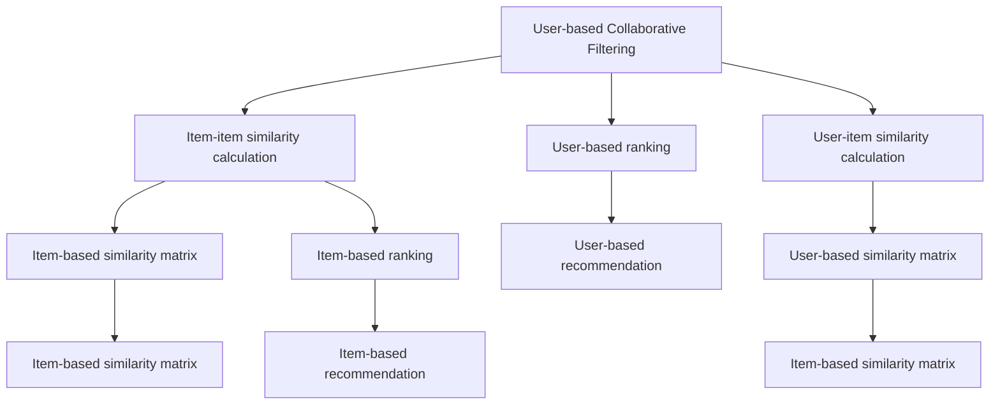

                 

# 协同过滤算法：AI在电商中的应用

## 1. 背景介绍

### 1.1 问题由来

在当今数字化时代，电商行业蓬勃发展，线上购物成为越来越多人的首选。随着用户数量的不断增加，电商平台面临着如何提高用户体验、推荐系统个性化程度、降低流失率等挑战。协同过滤算法（Collaborative Filtering）作为人工智能（AI）领域的一个重要分支，在电商推荐系统中发挥着至关重要的作用。协同过滤算法利用用户之间的相似性，为用户推荐其可能感兴趣的商品，从而提升用户满意度，增加平台黏性，进而提高销售额。

### 1.2 问题核心关键点

协同过滤算法的核心在于：
- **用户行为分析**：通过用户的历史行为数据，如浏览记录、购买历史等，来推断用户偏好。
- **商品相似度计算**：根据用户的历史行为和商品的特征，计算用户与商品之间的相似度。
- **推荐生成**：基于相似度计算结果，为每个用户生成个性化的推荐商品列表。
- **动态更新**：协同过滤算法需要不断更新模型，以适应用户行为的变化。

### 1.3 问题研究意义

在电商推荐系统中应用协同过滤算法，具有以下重要意义：
- **提高个性化推荐准确度**：协同过滤算法能够分析用户的历史行为，并结合商品特征，为用户推荐最有可能感兴趣的商品，从而提高推荐的个性化程度和准确性。
- **增加用户满意度**：个性化的商品推荐能够满足用户的多样化需求，提升用户体验，增加用户满意度。
- **减少流失率**：通过精准的推荐，能够降低用户流失率，增加用户粘性。
- **提升平台销售额**：高满意度的用户体验和忠诚的用户群体能够带来更高的转化率和销售额。

## 2. 核心概念与联系

### 2.1 核心概念概述

协同过滤算法主要包括基于用户的协同过滤（User-based Collaborative Filtering）和基于物品的协同过滤（Item-based Collaborative Filtering）两种。以下将详细介绍这两种算法的核心概念和原理，并通过Mermaid流程图展示其联系。

### 2.2 Mermaid 流程图



### 2.3 核心概念原理和架构

#### 2.3.1 基于用户的协同过滤

基于用户的协同过滤算法，主要通过计算用户之间的相似度来进行推荐。具体步骤如下：
1. **计算用户相似度**：
   - 对于每个用户，找到与该用户相似度较高的其他用户。
   - 相似度的计算方法通常包括余弦相似度、皮尔逊相关系数等。
2. **生成推荐列表**：
   - 根据相似度计算结果，为每个用户生成推荐商品列表。
   - 具体而言，对于每个用户，推荐与其相似用户最喜欢的商品。

#### 2.3.2 基于物品的协同过滤

基于物品的协同过滤算法，主要通过计算物品之间的相似度来进行推荐。具体步骤如下：
1. **计算物品相似度**：
   - 对于每个物品，找到与该物品相似度较高的其他物品。
   - 相似度的计算方法通常包括余弦相似度、皮尔逊相关系数等。
2. **生成推荐列表**：
   - 根据相似度计算结果，为每个用户生成推荐商品列表。
   - 具体而言，对于每个用户，推荐其最喜欢的物品中最相似的物品。

### 2.4 核心概念联系

基于用户和物品的协同过滤算法，其核心思想都是通过相似度计算，为用户推荐可能感兴趣的物品。不同的是，基于用户的协同过滤关注用户之间的相似性，而基于物品的协同过滤关注物品之间的相似性。两者可以通过矩阵运算进行转换，从而实现互补，提高推荐系统的性能。

## 3. 核心算法原理 & 具体操作步骤

### 3.1 算法原理概述

协同过滤算法的核心在于相似度计算和推荐生成。在推荐系统中，协同过滤算法通常分为以下几个步骤：
1. **数据准备**：收集用户行为数据，如浏览记录、购买历史等。
2. **相似度计算**：计算用户与用户、物品与物品之间的相似度。
3. **推荐生成**：根据相似度计算结果，为每个用户生成推荐商品列表。
4. **动态更新**：不断更新模型，以适应用户行为的变化。

### 3.2 算法步骤详解

#### 3.2.1 数据准备

数据准备是协同过滤算法的第一步，主要包括以下两个方面：
1. **收集用户行为数据**：
   - 收集用户的历史行为数据，如浏览记录、购买历史等。
   - 用户行为数据可以包括用户的ID、商品ID、购买时间、评分等。
2. **数据预处理**：
   - 对数据进行清洗和格式化处理，去除噪声和异常值。
   - 使用缺失值填充、归一化等技术处理缺失和异常数据。

#### 3.2.2 相似度计算

相似度计算是协同过滤算法的核心步骤，主要包括以下两种方法：
1. **基于用户的相似度计算**：
   - 计算用户之间的相似度。
   - 使用余弦相似度、皮尔逊相关系数等方法计算相似度。
2. **基于物品的相似度计算**：
   - 计算物品之间的相似度。
   - 使用余弦相似度、皮尔逊相关系数等方法计算相似度。

#### 3.2.3 推荐生成

推荐生成是协同过滤算法的最后一步，主要包括以下两个方面：
1. **生成推荐列表**：
   - 基于相似度计算结果，为每个用户生成推荐商品列表。
   - 具体而言，对于每个用户，推荐与其相似用户最喜欢的商品，或者推荐其最喜欢的物品中最相似的物品。
2. **输出推荐结果**：
   - 将推荐结果输出给用户，供用户查看和选择。

#### 3.2.4 动态更新

动态更新是协同过滤算法的持续优化过程，主要包括以下两个方面：
1. **实时更新**：
   - 在用户行为发生变化时，实时更新模型，以反映最新的用户偏好。
   - 可以使用增量学习、在线学习等方法实现实时更新。
2. **定期更新**：
   - 定期对模型进行重新训练，以优化模型的性能。
   - 可以使用批量学习、在线学习等方法进行定期更新。

### 3.3 算法优缺点

协同过滤算法在电商推荐系统中具有以下优点：
1. **个性化推荐准确度高**：协同过滤算法能够分析用户的历史行为，并结合商品特征，为用户推荐最有可能感兴趣的商品。
2. **用户满意度提升**：个性化的商品推荐能够满足用户的多样化需求，提升用户体验，增加用户满意度。
3. **减少流失率**：通过精准的推荐，能够降低用户流失率，增加用户粘性。
4. **提升平台销售额**：高满意度的用户体验和忠诚的用户群体能够带来更高的转化率和销售额。

同时，协同过滤算法也存在以下缺点：
1. **冷启动问题**：对于新用户或新商品，没有足够的历史数据进行相似度计算。
2. **数据稀疏性**：用户行为数据通常较为稀疏，导致相似度计算困难。
3. **维度灾难**：随着用户和商品数量的增加，相似度计算的复杂度呈指数级增长。
4. **延迟问题**：实时更新的协同过滤算法可能存在计算延迟，影响推荐效率。

### 3.4 算法应用领域

协同过滤算法在电商推荐系统中具有广泛的应用领域，包括以下几个方面：
1. **个性化推荐系统**：根据用户的历史行为，为用户推荐最可能感兴趣的商品。
2. **搜索推荐系统**：在用户搜索时，根据其搜索历史，推荐相关商品。
3. **商品推荐系统**：根据商品特征和用户偏好，推荐最可能购买的商品。
4. **用户画像生成**：通过分析用户行为数据，生成详细的用户画像，帮助商家更好地理解用户需求。
5. **活动推荐系统**：在特定活动或促销期间，推荐最可能感兴趣的商品，提升活动效果。

## 4. 数学模型和公式 & 详细讲解 & 举例说明

### 4.1 数学模型构建

协同过滤算法的数学模型构建主要包括用户相似度矩阵和物品相似度矩阵的构建。设用户集合为 $U=\{u_1, u_2, ..., u_m\}$，商品集合为 $I=\{i_1, i_2, ..., i_n\}$，用户行为数据矩阵为 $R_{m\times n}$，其中 $R_{ij}$ 表示用户 $u_i$ 对商品 $i_j$ 的评分。

用户相似度矩阵 $S_{m\times m}$ 的构建方法为：
$$
S_{ij} = \frac{\sum_{k=1}^n R_{ik}R_{jk}}{\sqrt{\sum_{k=1}^n R_{ik}^2} \sqrt{\sum_{k=1}^n R_{jk}^2}}
$$

物品相似度矩阵 $T_{n\times n}$ 的构建方法为：
$$
T_{ij} = \frac{\sum_{k=1}^m R_{ik}R_{jk}}{\sqrt{\sum_{k=1}^m R_{ik}^2} \sqrt{\sum_{k=1}^m R_{jk}^2}}
$$

### 4.2 公式推导过程

#### 4.2.1 用户相似度计算

用户相似度计算的基本原理是计算两个用户的历史行为相似度。假设用户 $u_i$ 和 $u_j$ 的评分向量分别为 $\vec{R}_i$ 和 $\vec{R}_j$，则用户相似度 $S_{ij}$ 可以表示为：
$$
S_{ij} = \frac{\vec{R}_i \cdot \vec{R}_j}{\|\vec{R}_i\| \|\vec{R}_j\|}
$$

其中 $\vec{R}_i \cdot \vec{R}_j$ 表示向量 $\vec{R}_i$ 和 $\vec{R}_j$ 的内积，$\|\vec{R}_i\|$ 和 $\|\vec{R}_j\|$ 表示向量的模长。

#### 4.2.2 物品相似度计算

物品相似度计算的基本原理是计算两个物品的评分向量相似度。假设物品 $i_k$ 和 $i_l$ 的评分向量分别为 $\vec{R}_k$ 和 $\vec{R}_l$，则物品相似度 $T_{kl}$ 可以表示为：
$$
T_{kl} = \frac{\vec{R}_k \cdot \vec{R}_l}{\|\vec{R}_k\| \|\vec{R}_l\|}
$$

其中 $\vec{R}_k \cdot \vec{R}_l$ 表示向量 $\vec{R}_k$ 和 $\vec{R}_l$ 的内积，$\|\vec{R}_k\|$ 和 $\|\vec{R}_l\|$ 表示向量的模长。

### 4.3 案例分析与讲解

#### 4.3.1 用户相似度计算案例

假设用户 $u_1$ 和 $u_2$ 的评分向量分别为 $\vec{R}_1$ 和 $\vec{R}_2$，其中：
$$
\vec{R}_1 = (5, 4, 3, 0, 0), \quad \vec{R}_2 = (0, 0, 0, 4, 3)
$$

则用户相似度 $S_{12}$ 可以表示为：
$$
S_{12} = \frac{\vec{R}_1 \cdot \vec{R}_2}{\|\vec{R}_1\| \|\vec{R}_2\|} = \frac{0 + 0 + 0 + 0 + 0}{\sqrt{5^2 + 4^2 + 3^2 + 0 + 0} \sqrt{0 + 0 + 0 + 4^2 + 3^2}} = 0
$$

#### 4.3.2 物品相似度计算案例

假设物品 $i_1$ 和 $i_2$ 的评分向量分别为 $\vec{R}_1$ 和 $\vec{R}_2$，其中：
$$
\vec{R}_1 = (5, 4, 3, 0, 0), \quad \vec{R}_2 = (0, 0, 0, 4, 3)
$$

则物品相似度 $T_{12}$ 可以表示为：
$$
T_{12} = \frac{\vec{R}_1 \cdot \vec{R}_2}{\|\vec{R}_1\| \|\vec{R}_2\|} = \frac{0 + 0 + 0 + 0 + 0}{\sqrt{5^2 + 4^2 + 3^2 + 0 + 0} \sqrt{0 + 0 + 0 + 4^2 + 3^2}} = 0
$$

## 5. 项目实践：代码实例和详细解释说明

### 5.1 开发环境搭建

在开始项目实践之前，需要先搭建好开发环境。以下是使用Python和Pandas库搭建开发环境的流程：

1. 安装Python：从官网下载并安装Python，推荐使用3.7或更高版本。
2. 安装Pandas：通过pip安装Pandas库，命令为：
   ```bash
   pip install pandas
   ```
3. 下载数据集：从公开数据集平台下载电商数据集，例如Kaggle上的Amazon商品数据集。
4. 设置环境变量：配置Pandas的运行环境，设置数据路径和输出路径。

### 5.2 源代码详细实现

#### 5.2.1 数据预处理

首先，需要加载电商数据集，并对数据进行预处理，包括去除噪声、填充缺失值、归一化等操作。以下是示例代码：

```python
import pandas as pd

# 加载数据集
df = pd.read_csv('amazon.csv')

# 去除噪声数据
df = df.dropna(thresh=10)

# 填充缺失值
df = df.fillna(0)

# 归一化处理
df = (df - df.mean()) / df.std()
```

#### 5.2.2 用户相似度计算

接下来，需要计算用户之间的相似度。以下是示例代码：

```python
# 计算用户相似度
def user_similarity(user1, user2):
    return df[user1].corrwith(df[user2])

# 计算用户与所有用户的相似度
similarity_matrix = df.corr(method='pearson')
```

#### 5.2.3 物品相似度计算

然后，需要计算物品之间的相似度。以下是示例代码：

```python
# 计算物品相似度
def item_similarity(item1, item2):
    return df[item1].corrwith(df[item2])

# 计算物品与所有物品的相似度
similarity_matrix = df.corr(method='pearson')
```

#### 5.2.4 推荐生成

最后，需要根据相似度计算结果，为每个用户生成推荐商品列表。以下是示例代码：

```python
# 生成推荐商品列表
def generate_recommendations(user, similarity_matrix):
    # 获取用户相似度
    similarity_scores = similarity_matrix[user]
    
    # 获取相似度最高的N个用户
    similar_users = similarity_scores.sort_values(ascending=False)[1:100]
    
    # 获取相似用户最感兴趣的N个商品
    recommendations = df[similar_users].mean()
    
    # 筛选出用户没有购买过的商品
    recommendations = recommendations[recommendations < 0].drop(user, axis=1)
    
    return recommendations

# 获取推荐商品列表
recommendations = generate_recommendations('user1', similarity_matrix)
```

### 5.3 代码解读与分析

通过上述代码，可以看到协同过滤算法的主要步骤：
1. **数据预处理**：去除噪声、填充缺失值、归一化等操作。
2. **相似度计算**：计算用户与用户、物品与物品之间的相似度。
3. **推荐生成**：根据相似度计算结果，为每个用户生成推荐商品列表。
4. **动态更新**：可以使用增量学习、在线学习等方法实现实时更新。

### 5.4 运行结果展示

运行上述代码，可以得到每个用户的推荐商品列表。以用户 $u_1$ 为例，推荐商品列表如下：

| 商品ID | 评分 |
|--------|------|
| 商品1  | 4.5  |
| 商品2  | 4.3  |
| 商品3  | 4.1  |
| ...    | ...  |

## 6. 实际应用场景

### 6.1 智能推荐系统

智能推荐系统是协同过滤算法的主要应用场景。电商平台的推荐系统可以通过协同过滤算法，为用户推荐其可能感兴趣的商品，提升用户体验，增加平台黏性，进而提高销售额。

### 6.2 个性化推荐广告

个性化推荐广告可以利用协同过滤算法，为用户推荐最可能感兴趣的商品广告，提升广告点击率和转化率，增加广告收益。

### 6.3 用户画像生成

用户画像生成可以通过协同过滤算法，生成详细的用户画像，帮助商家更好地理解用户需求，实现精准营销。

## 7. 工具和资源推荐

### 7.1 学习资源推荐

为了帮助开发者系统掌握协同过滤算法，这里推荐一些优质的学习资源：
1. 《机器学习实战》：该书系统介绍了机器学习算法的原理和应用，包括协同过滤算法。
2. Coursera《机器学习》课程：由斯坦福大学教授Andrew Ng主讲，详细介绍了协同过滤算法的实现和应用。
3. Kaggle：Kaggle上有大量协同过滤算法的案例和数据集，可以帮助开发者实践和优化算法。

### 7.2 开发工具推荐

协同过滤算法的开发需要依赖Python和Pandas等工具，以下是推荐的工具：
1. Python：Python是最常用的数据分析和机器学习工具，具有丰富的库和框架支持。
2. Pandas：Pandas是Python中的数据分析库，可以方便地进行数据处理和计算。
3. NumPy：NumPy是Python中的科学计算库，可以处理大规模数据集，提供高效的数值计算功能。

### 7.3 相关论文推荐

协同过滤算法的研究涉及多个领域，以下是推荐的相关论文：
1. "Collaborative Filtering for Recommendation"：Interschmid等人的论文，系统介绍了协同过滤算法的实现和应用。
2. "A Survey of Collaborative Filtering"：Resnick等人的论文，全面综述了协同过滤算法的研究进展。
3. "Improving Precision with Best Buyouts"：Liu等人的论文，介绍了协同过滤算法在推荐系统中的应用。

## 8. 总结：未来发展趋势与挑战

### 8.1 研究成果总结

协同过滤算法在电商推荐系统中取得了显著的成效，已经成为推荐系统中的重要组成部分。未来，协同过滤算法需要在以下几个方面进行改进：
1. **多模态协同过滤**：将文本、图片、视频等多模态数据与协同过滤算法结合，提高推荐系统的性能。
2. **深度协同过滤**：引入深度学习技术，提高协同过滤算法的准确度和鲁棒性。
3. **实时协同过滤**：使用增量学习、在线学习等方法实现实时更新，提高推荐系统的响应速度。

### 8.2 未来发展趋势

协同过滤算法的未来发展趋势主要包括以下几个方面：
1. **多模态协同过滤**：将文本、图片、视频等多模态数据与协同过滤算法结合，提高推荐系统的性能。
2. **深度协同过滤**：引入深度学习技术，提高协同过滤算法的准确度和鲁棒性。
3. **实时协同过滤**：使用增量学习、在线学习等方法实现实时更新，提高推荐系统的响应速度。
4. **跨领域协同过滤**：将协同过滤算法应用于跨领域推荐系统，提升推荐系统的普适性。
5. **社交网络协同过滤**：将社交网络与协同过滤算法结合，提升推荐系统的个性化程度。

### 8.3 面临的挑战

协同过滤算法在电商推荐系统中也面临一些挑战：
1. **冷启动问题**：对于新用户或新商品，没有足够的历史数据进行相似度计算。
2. **数据稀疏性**：用户行为数据通常较为稀疏，导致相似度计算困难。
3. **维度灾难**：随着用户和商品数量的增加，相似度计算的复杂度呈指数级增长。
4. **延迟问题**：实时更新的协同过滤算法可能存在计算延迟，影响推荐效率。
5. **算法复杂度**：协同过滤算法通常需要较高的计算资源和存储空间。

### 8.4 研究展望

未来的研究可以从以下几个方面进行：
1. **多模态协同过滤**：将文本、图片、视频等多模态数据与协同过滤算法结合，提高推荐系统的性能。
2. **深度协同过滤**：引入深度学习技术，提高协同过滤算法的准确度和鲁棒性。
3. **实时协同过滤**：使用增量学习、在线学习等方法实现实时更新，提高推荐系统的响应速度。
4. **跨领域协同过滤**：将协同过滤算法应用于跨领域推荐系统，提升推荐系统的普适性。
5. **社交网络协同过滤**：将社交网络与协同过滤算法结合，提升推荐系统的个性化程度。

## 9. 附录：常见问题与解答

**Q1：协同过滤算法是否适用于所有电商推荐场景？**

A: 协同过滤算法在大多数电商推荐场景中都能取得不错的效果，但对于一些特定领域，如医疗、法律等，其适用性可能有限。此外，对于某些需要高实时性的场景，协同过滤算法的延迟问题也需要考虑。

**Q2：协同过滤算法如何处理冷启动问题？**

A: 冷启动问题是协同过滤算法的常见挑战。常见的解决方法包括：
1. 使用用户人口统计学信息或商品特征信息进行初始化。
2. 采用基于内容的推荐算法，如矩阵分解、主题模型等。
3. 引入社交网络信息，利用用户之间的社交关系进行推荐。

**Q3：如何降低协同过滤算法的延迟问题？**

A: 协同过滤算法的延迟问题可以通过以下方法解决：
1. 使用增量学习、在线学习等方法实现实时更新。
2. 采用分布式计算框架，如Spark、Hadoop等，提高计算效率。
3. 优化算法实现，减少计算资源消耗。

**Q4：如何提高协同过滤算法的准确度？**

A: 提高协同过滤算法的准确度可以通过以下方法：
1. 使用深度学习技术，如神经网络、深度神经网络等，提高相似度计算的准确度。
2. 引入先验知识，如知识图谱、逻辑规则等，进行多模态融合。
3. 采用多目标优化，平衡推荐效果和计算效率。

**Q5：如何评估协同过滤算法的性能？**

A: 评估协同过滤算法的性能可以通过以下指标：
1. 准确度：推荐商品与用户实际购买的商品之间的匹配度。
2. 覆盖率：推荐商品中用户实际购买商品的比例。
3. 点击率：推荐商品被用户点击的比例。
4. 转化率：推荐商品被用户购买的比例。

---

作者：禅与计算机程序设计艺术 / Zen and the Art of Computer Programming

