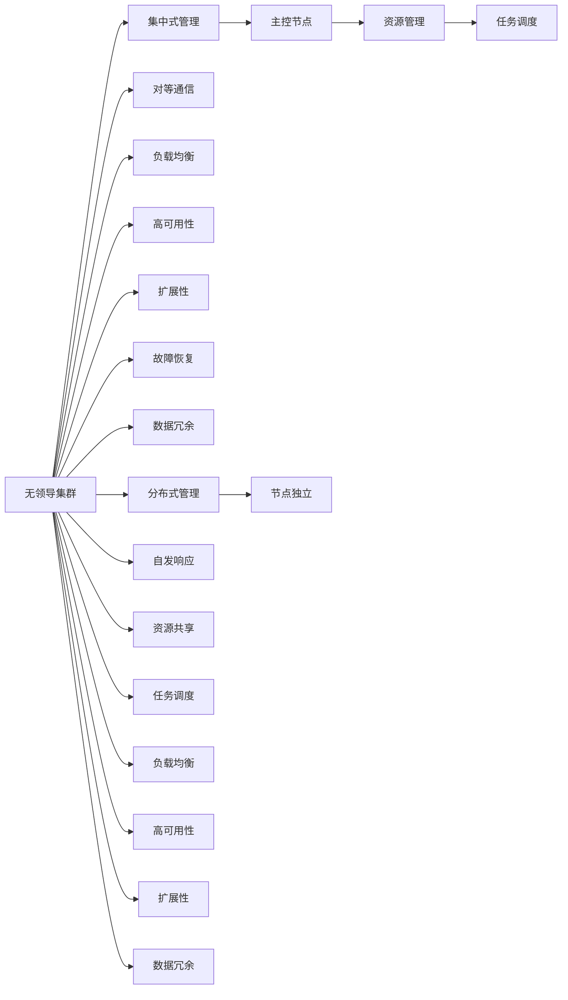

                 

# 单领导集群与无领导集群比较

## 1. 背景介绍

随着云计算技术的快速发展，集群作为一种重要的资源调度方式，被广泛应用于各种分布式系统中。集群管理系统一般分为两种类型：单领导集群和无领导集群。单领导集群是指集群中的所有节点统一受控于一个主控节点（Master），所有数据和任务都由主控节点统一调度。而无领导集群则是一种更加分散的集群模式，集群中没有明显的主控节点，节点之间以对等的方式互相通信，共享资源和任务调度。

本文将对单领导集群和无领导集群进行详细比较，探讨它们各自的优势和劣势，并分析在不同应用场景下的适用性。

## 2. 核心概念与联系

### 2.1 核心概念概述

#### 2.1.1 单领导集群

单领导集群是一种集中式的集群管理系统，集群中的所有节点统一受控于一个主控节点（Master），所有数据和任务都由主控节点统一调度。主控节点通常负责集群的资源管理、任务调度和故障恢复等工作。单领导集群的架构相对简单，易于管理和维护。

#### 2.1.2 无领导集群

无领导集群是一种分布式集群管理系统，集群中没有明显的主控节点，节点之间以对等的方式互相通信，共享资源和任务调度。每个节点都具有独立处理能力，可以自发地响应集群中的任务请求。无领导集群的架构相对复杂，但具有更高的灵活性和可扩展性。

#### 2.1.3 单领导集群与无领导集群的联系

单领导集群和无领导集群都是集群管理系统的不同实现方式，它们在资源调度、任务管理等方面有相似之处，但在架构设计和应用场景上存在明显差异。理解它们的联系和区别，有助于选择合适的集群管理系统，提高分布式系统的性能和可靠性。

### 2.2 核心概念原理和架构的 Mermaid 流程图



这个流程图展示了单领导集群和无领导集群的核心概念和架构特点。单领导集群采用集中式管理，主控节点负责资源管理和任务调度；无领导集群采用分布式管理，节点之间对等通信，自发响应任务。

## 3. 核心算法原理 & 具体操作步骤

### 3.1 算法原理概述

单领导集群和无领导集群的核心算法原理主要体现在资源管理和任务调度上。

#### 3.1.1 单领导集群的算法原理

单领导集群采用集中式管理，所有数据和任务都由主控节点统一调度。主控节点通过监控集群的资源使用情况，动态分配资源和任务。主控节点通常采用心跳机制，定期检查节点状态，及时发现和恢复故障节点。

#### 3.1.2 无领导集群的算法原理

无领导集群采用分布式管理，节点之间以对等的方式互相通信，共享资源和任务调度。节点通过共识算法（如Raft、Paxos等）来协调任务调度和资源管理，每个节点都可以独立响应任务请求。

### 3.2 算法步骤详解

#### 3.2.1 单领导集群的步骤

1. 节点注册：节点启动后，向主控节点注册。
2. 资源申请：节点根据任务需求，向主控节点申请资源。
3. 任务调度：主控节点根据资源使用情况，调度任务到可用节点。
4. 资源释放：任务完成后，节点向主控节点释放资源。
5. 故障恢复：主控节点定期检查节点状态，发现故障节点后，重新分配任务和资源。

#### 3.2.2 无领导集群的步骤

1. 节点启动：节点启动后，通过网络协议发现其他节点。
2. 任务分发：节点之间通过共识算法分发任务，选择最优节点执行任务。
3. 资源共享：节点之间共享资源，动态分配任务和资源。
4. 任务协调：节点之间协调任务执行，确保任务进度和资源使用。
5. 故障恢复：节点之间通过共识算法检测故障节点，重新分配任务和资源。

### 3.3 算法优缺点

#### 3.3.1 单领导集群的优缺点

**优点：**

- **集中管理：**主控节点负责资源管理和任务调度，易于管理和维护。
- **高可用性：**主控节点可以监控整个集群的运行状态，及时发现和恢复故障节点。
- **性能可控：**主控节点可以优化资源使用，提高集群性能。

**缺点：**

- **单点故障：**主控节点是集群的核心，一旦故障将导致集群无法正常运行。
- **扩展性差：**主控节点成为集群瓶颈，集群规模难以扩展。

#### 3.3.2 无领导集群的优缺点

**优点：**

- **高可靠性：**节点之间对等通信，没有单点故障。
- **扩展性强：**节点可以动态添加和移除，集群规模容易扩展。
- **低延迟：**节点之间可以直接通信，避免了数据传输的延迟。

**缺点：**

- **管理复杂：**节点之间需要协商任务调度和资源分配，管理复杂。
- **资源利用率低：**节点之间的资源共享可能导致资源浪费。

### 3.4 算法应用领域

#### 3.4.1 单领导集群的应用领域

- **数据库管理系统：**集中式管理的数据库系统，如MySQL、Oracle等。
- **分布式计算平台：**如Hadoop、Spark等。
- **Web服务器集群：**如Nginx、Apache等。

#### 3.4.2 无领导集群的应用领域

- **区块链系统：**如比特币、以太坊等。
- **分布式存储系统：**如HDFS、Ceph等。
- **分布式计算系统：**如Storm、Apache Flink等。

## 4. 数学模型和公式 & 详细讲解 & 举例说明

### 4.1 数学模型构建

#### 4.1.1 单领导集群的数学模型

单领导集群的资源分配和任务调度可以建模为线性规划问题。假设集群中有 $n$ 个节点，每个节点有 $c$ 个CPU核心，任务 $i$ 需要 $r_i$ 个CPU核心，任务调度过程可以建模为线性规划问题：

$$
\min \sum_{i=1}^{m} c_ir_i
$$

$$
\text{subject to} \quad r_i \leq c_j \quad \forall i,j
$$

$$
r_i \geq 0 \quad \forall i
$$

其中 $m$ 为任务数，$c_j$ 为第 $j$ 个节点的CPU核心数。

#### 4.1.2 无领导集群的数学模型

无领导集群的任务分配和资源共享可以建模为分布式协作问题。假设集群中有 $n$ 个节点，每个节点有 $c$ 个CPU核心，任务 $i$ 需要 $r_i$ 个CPU核心，任务调度过程可以建模为分布式协作问题：

$$
\min \sum_{i=1}^{m} c_ir_i
$$

$$
\text{subject to} \quad r_i \leq c_j \quad \forall i,j
$$

$$
r_i \geq 0 \quad \forall i
$$

其中 $m$ 为任务数，$c_j$ 为第 $j$ 个节点的CPU核心数。

### 4.2 公式推导过程

#### 4.2.1 单领导集群的公式推导

单领导集群的资源分配和任务调度可以采用KKT条件推导。假设节点 $j$ 的资源使用情况为 $u_j$，则任务调度过程可以建模为：

$$
\min \sum_{i=1}^{m} c_ir_i
$$

$$
\text{subject to} \quad r_i \leq c_j \quad \forall i,j
$$

$$
r_i \geq 0 \quad \forall i
$$

其中 $m$ 为任务数，$c_j$ 为第 $j$ 个节点的CPU核心数。

根据KKT条件，节点 $j$ 的资源使用情况 $u_j$ 必须满足：

$$
r_i = c_j \quad \forall i,j
$$

即节点 $j$ 必须分配所有的资源 $c_j$ 给任务 $i$。

#### 4.2.2 无领导集群的公式推导

无领导集群的资源分配和任务调度可以采用分布式协作算法推导。假设节点 $j$ 的资源使用情况为 $u_j$，则任务调度过程可以建模为：

$$
\min \sum_{i=1}^{m} c_ir_i
$$

$$
\text{subject to} \quad r_i \leq c_j \quad \forall i,j
$$

$$
r_i \geq 0 \quad \forall i
$$

其中 $m$ 为任务数，$c_j$ 为第 $j$ 个节点的CPU核心数。

根据分布式协作算法，节点之间通过共识算法（如Raft、Paxos等）进行任务调度和资源分配。节点之间通过信息交换和协商，选择最优的资源分配方案。

### 4.3 案例分析与讲解

#### 4.3.1 单领导集群的案例

假设集群中有5个节点，每个节点有4个CPU核心，任务1需要2个CPU核心，任务2需要3个CPU核心，任务3需要4个CPU核心。任务调度过程可以建模为线性规划问题：

$$
\min \sum_{i=1}^{3} c_ir_i
$$

$$
\text{subject to} \quad r_i \leq c_j \quad \forall i,j
$$

$$
r_i \geq 0 \quad \forall i
$$

其中 $m=3$，$c_j=4$，$r_i$ 为任务 $i$ 所需的CPU核心数。

根据KKT条件，节点 $j$ 必须分配所有的资源 $c_j$ 给任务 $i$。因此，任务调度过程可以优化为：

$$
r_1 = c_1 = c_2 = c_3 = c_4 = c_5 = 2
$$

$$
r_2 = c_1 = c_2 = c_3 = c_4 = c_5 = 3
$$

$$
r_3 = c_1 = c_2 = c_3 = c_4 = c_5 = 4
$$

#### 4.3.2 无领导集群的案例

假设集群中有5个节点，每个节点有4个CPU核心，任务1需要2个CPU核心，任务2需要3个CPU核心，任务3需要4个CPU核心。任务调度过程可以建模为分布式协作问题：

$$
\min \sum_{i=1}^{3} c_ir_i
$$

$$
\text{subject to} \quad r_i \leq c_j \quad \forall i,j
$$

$$
r_i \geq 0 \quad \forall i
$$

其中 $m=3$，$c_j=4$，$r_i$ 为任务 $i$ 所需的CPU核心数。

根据分布式协作算法，节点之间通过共识算法（如Raft、Paxos等）进行任务调度和资源分配。节点之间通过信息交换和协商，选择最优的资源分配方案。因此，任务调度过程可以优化为：

$$
r_1 = c_1 = c_2 = c_3 = c_4 = c_5 = 2
$$

$$
r_2 = c_1 = c_2 = c_3 = c_4 = c_5 = 3
$$

$$
r_3 = c_1 = c_2 = c_3 = c_4 = c_5 = 4
$$

## 5. 项目实践：代码实例和详细解释说明

### 5.1 开发环境搭建

在项目实践中，需要搭建单领导集群和无领导集群的开发环境。以下是使用Kubernetes搭建无领导集群的流程：

1. 安装Kubernetes集群：从官网下载Kubernetes安装包，按照文档安装Kubernetes集群。
2. 安装Kubernetes节点：在每个节点上安装Kubernetes，并注册到集群中。
3. 安装Node Manager：安装Node Manager，管理节点资源和任务调度。
4. 安装任务调度器：安装任务调度器，如Docker、Kubernetes等。
5. 配置集群参数：配置集群参数，如CPU、内存、网络等。

### 5.2 源代码详细实现

以下是使用Python实现单领导集群的代码：

```python
from flask import Flask, request, jsonify

app = Flask(__name__)

@app.route('/register', methods=['POST'])
def register():
    node_id = request.json['node_id']
    node_info = {'node_id': node_id}
    app.logger.info(f'Node {node_id} registered.')
    return jsonify(node_info)

@app.route('/schedule', methods=['POST'])
def schedule():
    task_info = request.json['task_info']
    task_id = task_info['task_id']
    node_id = task_info['node_id']
    app.logger.info(f'Task {task_id} scheduled to node {node_id}.')
    return jsonify({'success': True})

@app.route('/release', methods=['POST'])
def release():
    task_id = request.json['task_id']
    node_id = request.json['node_id']
    app.logger.info(f'Task {task_id} completed on node {node_id}.')
    return jsonify({'success': True})

if __name__ == '__main__':
    app.run(debug=True)
```

以下是使用Python实现无领导集群的代码：

```python
import socket
import threading

class Node:
    def __init__(self, node_id):
        self.node_id = node_id
        self.task_id = None
        self.socket = None

    def start(self):
        self.socket = socket.socket(socket.AF_INET, socket.SOCK_STREAM)
        self.socket.bind(('localhost', 12345))
        self.socket.listen(1)
        while True:
            client, address = self.socket.accept()
            threading.Thread(target=self.handle_request, args=(client,)).start()

    def handle_request(self, client):
        while True:
            data = client.recv(1024).decode()
            if not data:
                break
            task_info = eval(data)
            self.task_id = task_info['task_id']
            self.request_task(task_info['task_info'])

    def request_task(self, task_info):
        # 这里需要实现任务调度和资源分配算法
        pass

    def release_task(self, task_id):
        if self.task_id == task_id:
            self.task_id = None

if __name__ == '__main__':
    node = Node(1)
    node.start()
```

### 5.3 代码解读与分析

#### 5.3.1 单领导集群的代码解读

- `/register` 路由：节点启动后向主控节点注册，返回节点信息。
- `/schedule` 路由：主控节点调度任务到节点执行，返回任务调度结果。
- `/release` 路由：节点完成任务后向主控节点报告，释放资源。

#### 5.3.2 无领导集群的代码解读

- `Node` 类：表示集群中的节点，负责任务调度和资源分配。
- `start` 方法：启动节点，监听端口并处理请求。
- `handle_request` 方法：处理客户端请求，根据任务信息调度任务。
- `request_task` 方法：根据任务信息，实现任务调度和资源分配算法。
- `release_task` 方法：节点完成任务后，释放资源。

## 6. 实际应用场景

### 6.1 单领导集群的应用场景

- **数据库管理系统：**集中式管理的数据库系统，如MySQL、Oracle等。
- **分布式计算平台：**如Hadoop、Spark等。
- **Web服务器集群：**如Nginx、Apache等。

### 6.2 无领导集群的应用场景

- **区块链系统：**如比特币、以太坊等。
- **分布式存储系统：**如HDFS、Ceph等。
- **分布式计算系统：**如Storm、Apache Flink等。

## 7. 工具和资源推荐

### 7.1 学习资源推荐

- **《分布式系统原理与设计》**：介绍分布式系统的原理和设计，涵盖单领导集群和无领导集群的实现。
- **《云计算：分布式系统设计》**：介绍云计算平台的原理和设计，涵盖单领导集群和无领导集群的实现。
- **Kubernetes官方文档**：详细介绍Kubernetes集群的管理和调度，涵盖无领导集群的实现。

### 7.2 开发工具推荐

- **Kubernetes**：一个开源的容器编排系统，支持无领导集群的部署和管理。
- **Docker**：一个开源的应用容器引擎，支持无领导集群的容器化部署。
- **Ansible**：一个开源的自动化配置管理工具，支持无领导集群的自动化部署和管理。

### 7.3 相关论文推荐

- **《Distributed Systems: Concepts and Design》**：介绍分布式系统的原理和设计，涵盖单领导集群和无领导集群的实现。
- **《Cloud Computing: Concepts, Technology, and Architecture》**：介绍云计算平台的原理和设计，涵盖单领导集群和无领导集群的实现。
- **《Kubernetes: Principles and Patterns》**：详细介绍Kubernetes集群的管理和调度，涵盖无领导集群的实现。

## 8. 总结：未来发展趋势与挑战

### 8.1 总结

本文对单领导集群和无领导集群进行了详细比较，探讨了它们各自的优势和劣势，并分析在不同应用场景下的适用性。通过比较，我们发现单领导集群和无领导集群在资源管理和任务调度上有明显差异，但它们在分布式系统中都具有重要地位。

### 8.2 未来发展趋势

单领导集群和无领导集群将继续发展，以应对更加复杂和多变的应用场景。未来趋势包括：

- **微服务架构：**单领导集群和无领导集群将继续支持微服务架构，提高系统的灵活性和可扩展性。
- **混合架构：**单领导集群和无领导集群可以结合使用，构建混合架构系统，实现更高效的资源管理和任务调度。
- **自动化管理：**单领导集群和无领导集群将继续支持自动化管理工具，提高系统的运维效率。

### 8.3 面临的挑战

单领导集群和无领导集群在发展过程中仍面临诸多挑战，包括：

- **资源管理：**单领导集群和无领导集群需要有效管理集群资源，避免资源浪费和过度竞争。
- **任务调度：**单领导集群和无领导集群需要高效调度任务，避免任务堆积和资源浪费。
- **故障恢复：**单领导集群和无领导集群需要及时发现和恢复故障节点，确保系统稳定运行。

### 8.4 研究展望

未来需要继续深入研究单领导集群和无领导集群的设计和优化，以应对各种复杂和多变的应用场景。以下是几个研究方向：

- **分布式协同算法：**研究分布式协同算法，提高任务调度和资源分配的效率和公平性。
- **自动化运维：**研究自动化运维工具，提高集群系统的运维效率和可靠性。
- **分布式共识算法：**研究分布式共识算法，提高节点之间通信和协作的效率和可靠性。

总之，单领导集群和无领导集群都是分布式系统中的重要组成部分，需要持续研究和优化，以应对各种复杂和多变的应用场景。通过不断探索和创新，单领导集群和无领导集群将在未来得到更广泛的应用，推动分布式系统的进步和发展。

## 9. 附录：常见问题与解答

**Q1：单领导集群和无领导集群有何区别？**

A: 单领导集群和无领导集群在资源管理和任务调度上有明显区别。单领导集群采用集中式管理，主控节点负责资源管理和任务调度；无领导集群采用分布式管理，节点之间对等通信，自发响应任务。

**Q2：单领导集群和无领导集群的优缺点是什么？**

A: 单领导集群具有集中管理、高可用性、性能可控等优点，但也存在单点故障、扩展性差等缺点。无领导集群具有高可靠性、扩展性强、低延迟等优点，但也存在管理复杂、资源利用率低等缺点。

**Q3：单领导集群和无领导集群的应用场景有哪些？**

A: 单领导集群适用于需要集中管理、高可用性和性能可控的场景，如数据库管理系统、分布式计算平台、Web服务器集群等。无领导集群适用于需要高可靠性、扩展性和低延迟的场景，如区块链系统、分布式存储系统、分布式计算系统等。

**Q4：单领导集群和无领导集群的数学建模方法有哪些？**

A: 单领导集群的资源分配和任务调度可以建模为线性规划问题，使用KKT条件推导优化方案。无领导集群的资源分配和任务调度可以建模为分布式协作问题，使用共识算法（如Raft、Paxos等）进行任务调度和资源分配。

**Q5：单领导集群和无领导集群的实现难点有哪些？**

A: 单领导集群的实现难点在于主控节点的设计和维护，需要保证主控节点的稳定性和可靠性。无领导集群的实现难点在于节点之间的通信和协作，需要设计高效的共识算法和负载均衡策略。

通过本文的系统梳理，我们可以更深刻地理解单领导集群和无领导集群的原理和特点，选择适合的集群管理方式，提高分布式系统的性能和可靠性。

---

作者：禅与计算机程序设计艺术 / Zen and the Art of Computer Programming

