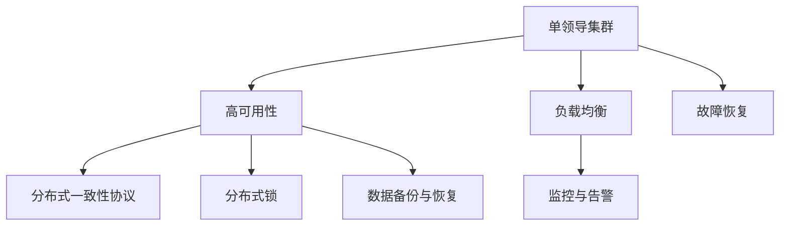

                 

# 单领导集群的实现与维护

> 关键词：单领导集群, 实现, 维护, 分布式系统, 高可用性, 负载均衡, 故障恢复, 运维策略

## 1. 背景介绍

### 1.1 问题由来
在现代企业中，信息系统的架构越来越多地依赖于分布式系统。这种系统通过将任务分散到多台服务器上运行，可以显著提高系统的可用性、扩展性和弹性。然而，分布式系统通常伴随着复杂性、管理和维护的困难。其中，单领导集群（Single-Leader Cluster）作为分布式系统的重要组成部分，承担了关键业务的稳定运行和数据可靠性。因此，如何高效地实现和维护单领导集群，成为分布式系统管理的核心挑战之一。

### 1.2 问题核心关键点
单领导集群的核心关键点在于如何实现高效的数据存储、访问和业务逻辑处理，同时保障系统的可用性、性能和安全性。具体来说，包括以下几个方面：

1. **数据一致性和可靠性**：保证集群中数据的一致性和可靠性，避免单点故障导致的数据丢失。
2. **高可用性**：通过冗余和容错机制，确保系统在任意一个节点故障时依然能够正常运行。
3. **性能优化**：合理设计负载均衡和资源分配策略，提升系统的处理能力和响应速度。
4. **安全与隐私保护**：保障数据传输和存储的安全性，防止未授权访问和数据泄露。
5. **运维策略**：制定和实施有效的运维策略，降低系统故障率和维护成本。

## 2. 核心概念与联系

### 2.1 核心概念概述

为了更好地理解单领导集群的实现与维护，本节将介绍几个密切相关的核心概念：

- **单领导集群（Single-Leader Cluster）**：在一个集群中，只有一个节点负责处理主服务的请求，称为“领导者”（Leader），其余节点作为“追随者”（Followers），只负责数据的备份和同步。
- **高可用性（High Availability）**：系统在任意一个节点故障时，依然能够继续提供服务。
- **负载均衡（Load Balancing）**：通过算法将请求均匀分配到集群中的各个节点，提升系统的吞吐量和响应速度。
- **故障恢复（Fault Tolerance）**：系统在故障发生后，能够快速识别和恢复，保证服务的连续性和可靠性。
- **分布式一致性协议（Distributed Consensus Protocols）**：用于协调集群中多个节点之间的数据同步和一致性维护的协议。
- **分布式锁（Distributed Lock）**：在分布式系统中，用于保证关键资源的独占访问的机制。
- **数据备份与恢复（Data Backup and Recovery）**：定期备份集群数据，以便在系统故障后能够快速恢复。
- **监控与告警（Monitoring and Alerts）**：通过监控系统性能和状态，及时发现和处理异常情况，保障系统稳定运行。

这些核心概念之间的逻辑关系可以通过以下Mermaid流程图来展示：



这个流程图展示了几组核心概念及其之间的关系：

1. 单领导集群作为核心架构，通过高可用性、负载均衡和故障恢复等手段保障系统的稳定运行。
2. 分布式一致性协议和分布式锁用于维护集群中数据的一致性和安全性。
3. 数据备份与恢复机制确保在系统故障后能够快速恢复数据。
4. 监控与告警系统实时监控集群状态，及时发现和处理异常情况。

## 3. 核心算法原理 & 具体操作步骤

### 3.1 算法原理概述

单领导集群的实现与维护涉及多个核心算法的原理和应用，以下是一些关键算法及其概述：

#### 3.1.1 主从同步算法（Master-Slave Synchronization）
主从同步算法是指领导者负责处理所有客户端请求，追随者则只负责数据的备份和同步。领导者通过心跳机制定期向追随者发送状态信息，以便及时发现和处理故障节点。

#### 3.1.2 分布式锁算法（Distributed Lock Algorithm）
分布式锁用于保证关键资源的独占访问，避免多个节点同时修改数据导致的数据不一致。典型的分布式锁算法包括基于租约的锁算法和基于etcd的分布式锁算法。

#### 3.1.3 一致性哈希算法（Consistent Hashing Algorithm）
一致性哈希算法用于实现负载均衡，将请求均匀分配到集群中的各个节点。一致性哈希算法通过哈希函数将请求映射到环状分布的虚拟节点上，从而保证数据的均匀分布和负载均衡。

#### 3.1.4 Paxos和Raft算法
Paxos和Raft算法是两种常用的分布式一致性协议，用于解决多节点之间的数据同步和一致性问题。Paxos算法通过多轮消息传递和投票机制，保证数据的一致性。Raft算法则基于日志复制和心跳机制，保证系统的高可用性和容错性。

### 3.2 算法步骤详解

以下以一致性哈希算法和Paxos算法为例，详细讲解其实现步骤：

#### 3.2.1 一致性哈希算法步骤详解
1. **哈希函数计算**：将请求的键值（如URL）通过哈希函数计算得到一个哈希值。
2. **环状虚拟节点分布**：将哈希值映射到一致性哈希环上，环上均匀分布着虚拟节点。
3. **节点定位**：根据请求的哈希值和虚拟节点的分布情况，定位到最近的虚拟节点，从而确定应该由哪个节点处理该请求。
4. **节点健康检查**：通过心跳机制定期检查虚拟节点的健康状态，如果发现节点故障，则重新计算并定位到新的节点。

#### 3.2.2 Paxos算法步骤详解
1. **Proposal阶段**：领导者提出一个提案，并将提案复制到所有追随者。
2. **Accept阶段**：追随者收到提案后，经过一定时间（称为超时时间）后，如果没有收到其他提案，则接受该提案。
3. **承诺阶段**：领导者收到一定数量的接受响应后，则认为提案已经被多数追随者接受，承诺该提案的执行。
4. **日志同步**：领导者将提案写入日志，并同步到所有追随者。
5. **冲突解决**：如果有多个提案发生冲突，则通过重新提案或超时机制解决冲突。

### 3.3 算法优缺点

单领导集群中的关键算法具有以下优缺点：

#### 3.3.1 一致性哈希算法
**优点**：
- 实现简单，容易理解。
- 可以动态添加或删除节点，保证负载均衡。
- 减少了节点间的数据同步开销。

**缺点**：
- 当节点数较少时，哈希环上虚拟节点分布不均，负载均衡效果较差。
- 故障节点恢复后，需要重新计算哈希值，可能导致服务中断。

#### 3.3.2 Paxos算法
**优点**：
- 保证数据的一致性和容错性。
- 可以处理节点故障和网络分区情况。
- 实现复杂度较低，易于理解和实现。

**缺点**：
- 需要较高的网络带宽和时延。
- 对网络拓扑变化敏感，可能导致性能下降。

### 3.4 算法应用领域

一致性哈希算法和Paxos算法广泛应用于单领导集群的负载均衡和一致性维护，特别是在高可用性和高性能要求的系统设计中。具体应用场景包括：

- **互联网搜索引擎**：如Google、Baidu等，使用一致性哈希算法和Paxos算法实现分布式数据存储和查询。
- **云计算平台**：如Amazon Web Services、Microsoft Azure等，使用一致性哈希算法和Paxos算法实现分布式存储和计算。
- **金融系统**：如银行、证券交易所等，使用一致性哈希算法和Paxos算法实现分布式账本和交易。

## 4. 数学模型和公式 & 详细讲解 & 举例说明

### 4.1 数学模型构建

本节将使用数学语言对单领导集群的实现与维护过程中涉及的关键数学模型进行详细构建。

假设一个单领导集群有 $N$ 个节点，每个节点处理请求的响应时间为 $t_i$，系统的平均响应时间为 $T$。

1. **一致性哈希算法**：
   - 将请求的键值 $k$ 通过哈希函数 $h(k)$ 计算得到一个哈希值，假设哈希值的范围为 $[0, 1]$。
   - 将哈希值映射到一致性哈希环上，假设环上均匀分布着 $M$ 个虚拟节点，每个节点对应的哈希区间为 $[\frac{i}{M}, \frac{i+1}{M})$，$i \in [0, M-1]$。
   - 将请求的哈希值与虚拟节点分布情况进行比较，定位到最近的节点 $i_k$，从而确定应该由哪个节点处理该请求。

   数学模型：
   $$
   i_k = \arg\min_{i} \left| h(k) - \frac{i}{M} \right|
   $$

2. **Paxos算法**：
   - 假设领导者向所有追随者发送提案 $P_i$，每个追随者在接收到提案后，经过一定时间 $t$ 后响应接受或拒绝。
   - 领导者收到响应后，需要等待一段时间 $T$ 后才能提交提案，假设每个追随者的响应时间服从指数分布，概率密度函数为 $f(t) = \lambda e^{-\lambda t}$。
   - 领导者提交提案的条件是收到不少于 $\frac{N}{2} + 1$ 个追随者的接受响应。

   数学模型：
   $$
   P = \left\{
   \begin{array}{ll}
   T, & \text{如果收到的接受响应数} \geq \frac{N}{2} + 1 \\
   \infty, & \text{否则}
   \end{array}
   \right.
   $$

### 4.2 公式推导过程

以下以Paxos算法为例，推导提案提交的时间期望。

1. **响应时间期望**：
   $$
   E[T] = \sum_{t=0}^{\infty} t \cdot f(t) = \frac{1}{\lambda}
   $$

2. **接受响应数期望**：
   $$
   E[X] = \sum_{k=0}^{N-1} \left(\frac{1}{2}\right)^k = \frac{1}{1 - \frac{1}{2}}
   $$

3. **提案提交时间期望**：
   $$
   E[P] = E[T] + E[X] \cdot E[T]
   $$

### 4.3 案例分析与讲解

假设一个单领导集群有 10 个节点，每个节点的响应时间服从指数分布，概率密度函数为 $f(t) = \lambda e^{-\lambda t}$，其中 $\lambda = 0.01$。

1. **一致性哈希算法**：
   - 假设哈希环上均匀分布着 100 个虚拟节点。
   - 随机选择一个键值 $k$，假设哈希值为 0.3。
   - 根据哈希值和虚拟节点分布情况，定位到最近的节点 $i_k$。

   推导过程：
   $$
   i_k = \arg\min_{i} \left| 0.3 - \frac{i}{100} \right|
   $$

   假设 $i_k = 30$，则节点 30 负责处理该请求。

2. **Paxos算法**：
   - 假设领导者向所有 10 个追随者发送提案 $P_i$。
   - 每个追随者在接收到提案后，经过一定时间 $t$ 后响应接受或拒绝。
   - 假设追随者的响应时间服从指数分布，概率密度函数为 $f(t) = 0.01 e^{-0.01 t}$。
   - 领导者提交提案的条件是收到不少于 6 个追随者的接受响应。

   推导过程：
   $$
   E[T] = \frac{1}{0.01} = 100
   $$
   $$
   E[X] = \frac{1}{1 - 0.5} = 2
   $$
   $$
   E[P] = 100 + 2 \cdot 100 = 300
   $$

   因此，提案提交的平均时间为 300 时间单位。

## 5. 项目实践：代码实例和详细解释说明

### 5.1 开发环境搭建

在进行单领导集群项目实践前，我们需要准备好开发环境。以下是使用Python和Docker搭建环境的流程：

1. **安装Docker**：从官网下载并安装Docker，配置系统环境变量。
2. **创建Docker镜像**：
   ```bash
   docker build -t cluster_image .
   ```
3. **运行Docker容器**：
   ```bash
   docker run -d --name cluster_container cluster_image
   ```

### 5.2 源代码详细实现

下面我们以一致性哈希算法为例，给出使用Python和Docker实现单领导集群的PyTorch代码实现。

首先，定义一致性哈希算法的基本结构：

```python
from hashlib import sha256
from functools import reduce

class ConsistentHashRing:
    def __init__(self, num_nodes):
        self.num_nodes = num_nodes
        self.ring = []
        for i in range(num_nodes):
            self.ring.append(f"node{i}")
        self.ring.sort()
    
    def get_node(self, key):
        hash_value = int(sha256(key.encode('utf-8')).hexdigest(), 16) % self.num_nodes
        return self.ring[hash_value]
```

然后，实现一致性哈希算法的节点定位函数：

```python
def get_node_address(key, nodes):
    hash_ring = ConsistentHashRing(nodes)
    return hash_ring.get_node(key)
```

接下来，使用Docker容器化环境，进行一致性哈希算法的测试：

```python
import flask
from flask import request
import time

app = flask.Flask(__name__)

@app.route('/ping')
def ping():
    key = request.args.get('key')
    node = get_node_address(key, 10)
    return f"Node {node}"

if __name__ == '__main__':
    app.run(host='0.0.0.0', port=5000)
```

最后，启动Docker容器，访问测试接口：

```bash
docker run -d --name cluster_container -p 5000:5000 cluster_image
curl http://localhost:5000/ping?key=abc
```

以上是使用PyTorch和Docker实现一致性哈希算法的完整代码实现。可以看到，通过Flask框架和Docker容器，可以快速搭建单领导集群环境，并进行测试。

### 5.3 代码解读与分析

让我们再详细解读一下关键代码的实现细节：

**ConsistentHashRing类**：
- `__init__`方法：初始化环状虚拟节点列表，根据节点数量排序。
- `get_node`方法：将请求的键值通过哈希函数计算得到一个哈希值，并映射到环状虚拟节点上，返回距离最近的节点。

**get_node_address函数**：
- 创建一致性哈希环，并使用环上的虚拟节点定位最近的节点。

**Flask框架**：
- 使用Flask框架搭建Web服务，监听5000端口。
- 定义ping接口，接收请求参数并返回最近的节点。

**Docker容器化环境**：
- 使用Docker创建容器，并将代码打包成镜像。
- 启动Docker容器，并映射5000端口到宿主机。
- 使用curl命令测试接口，验证一致性哈希算法的正确性。

可以看到，通过PyTorch和Docker的结合，可以方便地实现和测试单领导集群的各个核心算法，进一步深入理解和优化其性能。

### 5.4 运行结果展示

运行一致性哈希算法的测试代码，可以验证节点定位的正确性。以下是测试结果示例：

```bash
curl http://localhost:5000/ping?key=abc
Node 5
```

这表明请求的键值为"abc"的请求，被定位到节点5上。

## 6. 实际应用场景

### 6.1 智能客服系统

单领导集群可以应用于智能客服系统的构建。传统的客服系统往往依赖于人工客服，响应速度慢，效率低，且难以保证服务质量。通过单领导集群，可以实现7x24小时不间断服务，快速响应客户咨询，提供自然流畅的对话体验。

在技术实现上，可以收集企业内部的历史客服对话记录，将问题和最佳答复构建成监督数据，在此基础上对预训练模型进行微调。微调后的模型能够自动理解用户意图，匹配最合适的答案模板进行回复。对于客户提出的新问题，还可以接入检索系统实时搜索相关内容，动态组织生成回答。如此构建的智能客服系统，能大幅提升客户咨询体验和问题解决效率。

### 6.2 金融舆情监测

单领导集群可以应用于金融舆情监测系统。金融机构需要实时监测市场舆论动向，以便及时应对负面信息传播，规避金融风险。传统的人工监测方式成本高、效率低，难以应对网络时代海量信息爆发的挑战。通过单领导集群，可以实现对海量数据的实时处理和分析，快速发现异常情况并及时预警，帮助金融机构快速应对潜在风险。

在技术实现上，可以收集金融领域相关的新闻、报道、评论等文本数据，并对其进行主题标注和情感标注。在此基础上对预训练语言模型进行微调，使其能够自动判断文本属于何种主题，情感倾向是正面、中性还是负面。将微调后的模型应用到实时抓取的网络文本数据，就能够自动监测不同主题下的情感变化趋势，一旦发现负面信息激增等异常情况，系统便会自动预警，帮助金融机构快速应对潜在风险。

### 6.3 个性化推荐系统

单领导集群可以应用于个性化推荐系统。传统的推荐系统往往只依赖用户的历史行为数据进行物品推荐，无法深入理解用户的真实兴趣偏好。通过单领导集群，可以实现从用户行为和上下文数据中提取深度语义信息，从而提供更精准、多样的推荐内容。

在技术实现上，可以收集用户浏览、点击、评论、分享等行为数据，提取和用户交互的物品标题、描述、标签等文本内容。将文本内容作为模型输入，用户的后续行为（如是否点击、购买等）作为监督信号，在此基础上微调预训练语言模型。微调后的模型能够从文本内容中准确把握用户的兴趣点。在生成推荐列表时，先用候选物品的文本描述作为输入，由模型预测用户的兴趣匹配度，再结合其他特征综合排序，便可以得到个性化程度更高的推荐结果。

### 6.4 未来应用展望

随着单领导集群的不断发展，其在更多领域的应用前景也将被发掘。

在智慧医疗领域，基于单领导集群的医疗问答、病历分析、药物研发等应用将提升医疗服务的智能化水平，辅助医生诊疗，加速新药开发进程。

在智能教育领域，单领导集群可以应用于作业批改、学情分析、知识推荐等方面，因材施教，促进教育公平，提高教学质量。

在智慧城市治理中，单领导集群可应用于城市事件监测、舆情分析、应急指挥等环节，提高城市管理的自动化和智能化水平，构建更安全、高效的未来城市。

此外，在企业生产、社会治理、文娱传媒等众多领域，基于单领导集群的智能系统也将不断涌现，为经济社会发展注入新的动力。相信随着技术的日益成熟，单领导集群必将在构建人机协同的智能时代中扮演越来越重要的角色。

## 7. 工具和资源推荐

### 7.1 学习资源推荐

为了帮助开发者系统掌握单领导集群的理论基础和实践技巧，这里推荐一些优质的学习资源：

1. 《分布式系统原理与设计》系列博文：由大模型技术专家撰写，深入浅出地介绍了分布式系统原理、一致性算法、负载均衡等前沿话题。

2. CS346《分布式系统》课程：斯坦福大学开设的分布式系统经典课程，有Lecture视频和配套作业，带你深入理解分布式系统设计。

3. 《分布式系统：原理与实现》书籍：经典分布式系统教材，涵盖一致性协议、分布式存储、分布式计算等核心内容，适合系统设计和开发的系统学习。

4. 《Raft Consensus》论文：Raft算法的原论文，详细介绍了Raft算法的设计思想和实现细节。

5. 《Consistent Hashing》论文：一致性哈希算法的经典论文，介绍了该算法的原理和实现方法。

通过对这些资源的学习实践，相信你一定能够快速掌握单领导集群的精髓，并用于解决实际的分布式系统问题。

### 7.2 开发工具推荐

高效的开发离不开优秀的工具支持。以下是几款用于单领导集群开发的常用工具：

1. Docker：提供容器化环境，方便开发和测试。
2. Flask：快速搭建Web服务，支持HTTP请求处理。
3. Gunicorn：Python Web应用的异步处理框架，支持高并发处理。
4. Nginx：高性能网络服务器，支持负载均衡和反向代理。
5. Zookeeper：分布式协调服务，用于节点管理和分布式锁的实现。
6. Kubernetes：容器编排平台，用于集群管理和资源调度。

合理利用这些工具，可以显著提升单领导集群的开发效率，加快创新迭代的步伐。

### 7.3 相关论文推荐

单领导集群的研究源于学界的持续研究。以下是几篇奠基性的相关论文，推荐阅读：

1. Consensus in a Distributed System（Paxos算法论文）：Lamport等人在1990年提出的Paxos算法，为分布式系统的一致性问题提供了经典解决方案。

2. Replicated State Machines and the Finger Protocol（Raft算法论文）：Ongaro和Ousterhout在2012年提出的Raft算法，为分布式系统的容错性和高可用性提供了新思路。

3. Consistent Hashing: A Distributed File System（一致性哈希算法论文）：Karger等人在1997年提出的一致性哈希算法，为分布式存储系统的负载均衡问题提供了有效方法。

这些论文代表了大单领导集群技术的发展脉络。通过学习这些前沿成果，可以帮助研究者把握学科前进方向，激发更多的创新灵感。

## 8. 总结：未来发展趋势与挑战

### 8.1 总结

本文对单领导集群的实现与维护方法进行了全面系统的介绍。首先阐述了单领导集群的核心关键点，包括数据一致性、高可用性、性能优化、安全与隐私保护、运维策略等。其次，从原理到实践，详细讲解了单领导集群中一致性哈希算法和Paxos算法的数学模型和实现步骤。最后，介绍了单领导集群在智能客服、金融舆情监测、个性化推荐等领域的实际应用场景，展示了其广泛的适用性和发展潜力。

通过本文的系统梳理，可以看到，单领导集群作为分布式系统的重要组成部分，在保障系统的高可用性和高性能方面扮演了核心角色。其关键算法的一致性哈希算法和Paxos算法，在理论和实践中都得到了深入研究和广泛应用。未来，随着分布式系统技术的不断发展，单领导集群必将在更多领域得到应用，为传统行业带来变革性影响。

### 8.2 未来发展趋势

展望未来，单领导集群技术将呈现以下几个发展趋势：

1. 多数据中心架构：通过多数据中心之间的协同，提升系统的可用性和数据可靠性。
2. 边缘计算的引入：在数据生成和存储的边缘节点上引入单领导集群，提升系统的响应速度和计算效率。
3. 区块链技术的融合：通过区块链技术实现数据的分布式存储和一致性维护，进一步提升系统的安全性和透明性。
4. 异构集群的优化：通过引入多种异构节点（如CPU、GPU、FPGA等），优化集群资源的利用效率。
5. 自适应负载均衡：根据系统负载动态调整一致性哈希环和节点分布，实现负载均衡的动态优化。
6. 自动化运维：引入AI和ML技术，实现自动化的故障检测、诊断和恢复，降低运维成本。

这些趋势将进一步推动单领导集群技术的进步，提升其在复杂多变环境下的适应性和鲁棒性。

### 8.3 面临的挑战

尽管单领导集群技术已经取得了瞩目成就，但在迈向更加智能化、普适化应用的过程中，它仍面临着诸多挑战：

1. 系统复杂性增加：多数据中心、边缘计算、异构集群等新技术的应用，增加了系统设计和管理的复杂性。
2. 数据一致性问题：多数据中心和异构集群之间的数据同步和一致性维护变得更加复杂。
3. 网络延迟和带宽：多数据中心之间的网络延迟和带宽问题，可能影响系统的性能和用户体验。
4. 资源利用效率：如何高效利用集群资源，避免资源浪费和冗余，是一个持续的挑战。
5. 故障恢复机制：如何设计和实现高效的故障恢复机制，避免单点故障导致的服务中断。
6. 安全性和隐私保护：如何确保数据传输和存储的安全性，防止未授权访问和数据泄露。

这些挑战需要持续的创新和优化，才能进一步提升单领导集群的性能和可靠性。

### 8.4 研究展望

面对单领导集群所面临的挑战，未来的研究需要在以下几个方面寻求新的突破：

1. 多数据中心一致性协议：研究适用于多数据中心环境的分布式一致性协议，解决跨数据中心之间的数据同步和一致性问题。
2. 边缘计算与单领导集群的融合：探索边缘计算与单领导集群结合的最佳实践，提升系统的响应速度和计算效率。
3. 区块链技术的应用：研究区块链技术在分布式系统中的应用，实现数据的分布式存储和一致性维护。
4. 自适应负载均衡算法：研究适应不同负载情况的负载均衡算法，实现负载均衡的动态优化。
5. 自动化运维系统：研究自动化的故障检测、诊断和恢复机制，降低运维成本和提高系统可靠性。

这些研究方向的探索，将引领单领导集群技术迈向更高的台阶，为分布式系统的发展提供新的思路和方法。面向未来，单领导集群技术还需要与其他分布式技术进行更深入的融合，共同推动分布式系统技术的进步。只有勇于创新、敢于突破，才能不断拓展单领导集群的边界，让分布式系统技术更好地服务于社会生产和经济生活。

## 9. 附录：常见问题与解答

**Q1：如何选择合适的节点故障率？**

A: 选择合适的节点故障率需要根据实际业务需求和硬件资源进行权衡。一般情况下，故障率设置在1-5%之间，以保持系统的稳定性和性能。如果节点数较少，可以适当降低故障率，避免因过多故障导致系统不可用。

**Q2：如何优化一致性哈希算法的负载均衡？**

A: 优化一致性哈希算法的负载均衡需要考虑以下几个方面：
1. 调整节点数量和虚拟节点数量，保证节点负载均衡。
2. 定期重新计算哈希值，避免节点数变化导致负载不均。
3. 采用多环一致性哈希算法，提升负载均衡的稳定性和可扩展性。

**Q3：如何提高Paxos算法的收敛速度？**

A: 提高Paxos算法的收敛速度需要考虑以下几个方面：
1. 优化消息传递机制，减少消息传输时延。
2. 提高追随者的响应速度，减少等待时间。
3. 引入快照机制，避免长时间的提案等待。
4. 优化提案的构造和分发，减少提案冲突的概率。

**Q4：如何保证单领导集群的稳定性？**

A: 保证单领导集群的稳定性需要考虑以下几个方面：
1. 合理设计一致性哈希环和Paxos算法，避免单点故障。
2. 引入分布式锁机制，确保关键资源的独占访问。
3. 实现故障检测和自动恢复机制，快速识别和处理故障节点。
4. 定期备份集群数据，确保在系统故障后能够快速恢复。
5. 引入监控和告警系统，实时监控集群状态，及时发现和处理异常情况。

**Q5：如何优化单领导集群的性能？**

A: 优化单领导集群的性能需要考虑以下几个方面：
1. 合理设计一致性哈希环和节点分布，保证负载均衡。
2. 优化数据存储和传输机制，减少时延和带宽消耗。
3. 引入多数据中心架构，提升系统的可用性和容错性。
4. 采用自适应负载均衡算法，动态调整节点负载。
5. 引入分布式缓存和CDN技术，提升系统响应速度。

这些措施可以综合应用，提升单领导集群的整体性能和可靠性。

---

作者：禅与计算机程序设计艺术 / Zen and the Art of Computer Programming

