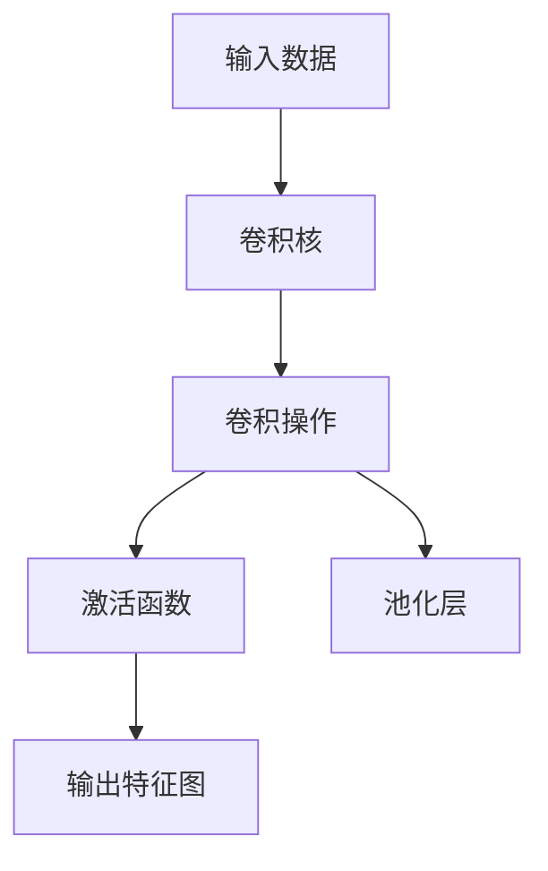

                 

# 卷积层 (Convolutional Layer) 原理与代码实例讲解

## 1. 背景介绍

卷积层 (Convolutional Layer) 是深度学习中最基础的模块之一，广泛应用于图像、视频等数据类型的处理和分析中。卷积层能够自动提取输入数据的特征，从而提高模型的表达能力和泛化能力。本节将介绍卷积层的基本概念、原理及应用，并通过代码实例展示其在实际项目中的使用。

## 2. 核心概念与联系

卷积层的基本思想是通过一组可学习的卷积核，对输入数据进行卷积操作，从而提取特征。卷积操作可以看作是对输入数据和卷积核进行逐点相乘后求和的过程。以下是对卷积层核心概念的解释：

- **卷积核 (Filter/Kernel)**：卷积层中最重要的组件，是卷积操作的核心。卷积核可以看作是一种“滤波器”，通过不同卷积核可以提取不同的特征。卷积核的尺寸、数量和初始化方式都会影响卷积层的性能。

- **步长 (Stride)**：卷积核在输入数据上移动的步长。步长的选择会影响输出特征图的大小和卷积运算的速度。

- **填充 (Padding)**：为了保持输出特征图的大小与输入数据相同，需要在输入数据的外围添加额外的像素，这些像素的填充值通常是0。填充对卷积操作的深度和输出特征图的大小都有影响。

- **池化层 (Pooling Layer)**：池化层通常紧跟在卷积层后面，用于减小特征图的大小，从而减少计算量和参数数量，同时还可以增强模型的鲁棒性。

- **激活函数 (Activation Function)**：激活函数用于引入非线性性，从而使得卷积层能够处理更加复杂的输入数据。常见的激活函数包括ReLU、Sigmoid、Tanh等。

卷积层的结构如图1所示：




## 3. 核心算法原理 & 具体操作步骤

### 3.1 算法原理概述

卷积层的核心操作是对输入数据进行卷积运算，卷积运算的基本公式如下：

$$
C(i, j, k) = \sum_{m=0}^{w-1} \sum_{n=0}^{h-1} W(m, n) * I(i+m, j+n)
$$

其中，$C(i, j, k)$ 表示卷积操作后的特征图，$I(i+m, j+n)$ 表示输入数据的像素值，$W(m, n)$ 表示卷积核的权重。

卷积操作的本质是对输入数据进行逐点乘积，然后将乘积结果进行求和。通过改变卷积核的尺寸、数量和步长，可以提取不同尺度的特征，从而提高模型的表达能力和泛化能力。

### 3.2 算法步骤详解

卷积层的实现步骤包括：

1. **初始化卷积核**：在训练之前，需要随机初始化卷积核的权重，通常使用Xavier或He初始化方法。

2. **卷积运算**：将卷积核和输入数据进行逐点乘积，然后将乘积结果进行求和，得到卷积操作后的特征图。

3. **激活函数**：对卷积操作后的特征图应用激活函数，引入非线性性。

4. **池化操作**：对特征图进行池化操作，减小特征图的大小，从而减少计算量和参数数量。

5. **反向传播**：在训练过程中，需要反向传播计算卷积核的梯度，更新卷积核的权重。

下面将通过Python代码实例，展示如何使用TensorFlow实现卷积层的操作。

### 3.3 算法优缺点

卷积层的优点包括：

- **自动提取特征**：卷积层能够自动提取输入数据的特征，从而提高模型的表达能力和泛化能力。

- **参数共享**：卷积层的卷积核是共享的，减少了模型的参数数量，从而降低了计算量和存储需求。

- **局部连接**：卷积层的连接方式是局部连接的，减少了模型的计算量，从而提高了训练速度。

卷积层的缺点包括：

- **参数过多**：当卷积核的尺寸较大时，模型的参数数量会非常多，从而增加了训练的时间和计算资源。

- **数据依赖性**：卷积层的表现很大程度上依赖于数据的质量和数量，当数据不足时，模型可能无法很好地学习到有用的特征。

### 3.4 算法应用领域

卷积层广泛应用于图像处理、视频分析、自然语言处理等领域。在图像处理中，卷积层用于提取图像中的特征，如图像的边缘、纹理等；在视频分析中，卷积层用于提取视频帧之间的相关性；在自然语言处理中，卷积层用于提取文本中的局部特征，如单词、短语等。

## 4. 数学模型和公式 & 详细讲解 & 举例说明

### 4.1 数学模型构建

卷积层的数学模型可以表示为：

$$
C = I * W + b
$$

其中，$C$ 表示卷积操作后的特征图，$I$ 表示输入数据，$W$ 表示卷积核，$b$ 表示偏置项。

### 4.2 公式推导过程

卷积操作的过程可以表示为：

$$
C_{i,j,k} = \sum_{m=0}^{w-1} \sum_{n=0}^{h-1} W_{m,n} * I_{i+m,j+n} + b_k
$$

其中，$C_{i,j,k}$ 表示卷积操作后的特征图，$I_{i+m,j+n}$ 表示输入数据的像素值，$W_{m,n}$ 表示卷积核的权重，$b_k$ 表示偏置项。

### 4.3 案例分析与讲解

以下是一个简单的卷积层的案例分析：

假设输入数据 $I$ 的尺寸为 $28 \times 28 \times 1$，卷积核 $W$ 的尺寸为 $5 \times 5 \times 1 \times 32$，步长为 $1$，填充为 $0$。卷积操作后的特征图 $C$ 的尺寸为 $26 \times 26 \times 32$。

假设卷积核 $W$ 的权重为 $W_{m,n}$，卷积核 $W$ 的偏置项为 $b_k$。卷积操作后的特征图 $C$ 可以表示为：

$$
C_{i,j,k} = \sum_{m=0}^{4} \sum_{n=0}^{4} W_{m,n} * I_{i+m,j+n} + b_k
$$

其中，$I_{i+m,j+n}$ 表示输入数据的像素值，$W_{m,n}$ 表示卷积核的权重，$b_k$ 表示偏置项。

## 5. 项目实践：代码实例和详细解释说明

### 5.1 开发环境搭建

在TensorFlow中使用卷积层，需要安装TensorFlow库和相关的依赖包。可以通过以下命令进行安装：

```bash
pip install tensorflow
```

安装完成后，可以开始使用TensorFlow进行卷积层的实现。

### 5.2 源代码详细实现

以下是一个简单的卷积层的代码实现：

```python
import tensorflow as tf

# 创建输入数据
input_data = tf.placeholder(tf.float32, [None, 28, 28, 1])

# 创建卷积核
conv_kernel = tf.Variable(tf.truncated_normal([5, 5, 1, 32], stddev=0.1))

# 创建偏置项
conv_bias = tf.Variable(tf.zeros([32]))

# 定义卷积操作
conv = tf.nn.conv2d(input_data, conv_kernel, [1, 1, 1, 1], 'SAME') + conv_bias

# 定义激活函数
relu = tf.nn.relu(conv)

# 定义池化操作
pool = tf.nn.max_pool(relu, [1, 2, 2, 1], [1, 2, 2, 1], 'SAME')

# 定义模型输出
output = tf.reduce_mean(pool)

# 定义损失函数
loss = tf.losses.mean_squared_error(labels, output)

# 定义优化器
optimizer = tf.train.AdamOptimizer(learning_rate=0.001).minimize(loss)

# 训练模型
with tf.Session() as sess:
    sess.run(tf.global_variables_initializer())
    for i in range(1000):
        batch_data = ...
        batch_labels = ...
        sess.run(optimizer, feed_dict={input_data: batch_data, labels: batch_labels})
```

在上述代码中，我们首先定义了输入数据的占位符，然后创建了卷积核和偏置项，并定义了卷积操作、激活函数和池化操作。最后定义了模型的输出、损失函数和优化器，并进行了训练。

### 5.3 代码解读与分析

在上述代码中，我们使用了TensorFlow库中的`tf.nn.conv2d`函数来实现卷积操作。该函数的参数包括输入数据、卷积核、步长和填充方式。在实际项目中，我们需要根据具体情况设置这些参数，从而得到最优的卷积层。

## 6. 实际应用场景

卷积层在实际应用场景中具有广泛的应用。以下是几个典型的应用场景：

- **图像识别**：卷积层可以用于提取图像中的特征，如图像的边缘、纹理等。在图像识别任务中，卷积层通常会与其他层（如池化层、全连接层等）结合使用，从而实现对图像的分类和识别。

- **视频分析**：卷积层可以用于提取视频帧之间的相关性，从而实现视频分类和识别。在视频分析任务中，卷积层通常会与其他层（如池化层、全连接层等）结合使用，从而实现对视频的分类和识别。

- **自然语言处理**：卷积层可以用于提取文本中的局部特征，如单词、短语等。在自然语言处理任务中，卷积层通常会与其他层（如池化层、全连接层等）结合使用，从而实现对文本的分类和识别。

## 7. 工具和资源推荐

### 7.1 学习资源推荐

为了帮助开发者系统掌握卷积层的基本概念和原理，以下是一些优质的学习资源：

1. **《深度学习》**：由Ian Goodfellow等编写的深度学习经典教材，详细介绍了卷积层的原理和实现。

2. **《卷积神经网络》**：由Hanene deployani等编写的卷积神经网络专题书籍，详细介绍了卷积层的数学模型和实现方法。

3. **《TensorFlow官方文档》**：TensorFlow的官方文档，详细介绍了TensorFlow中卷积层的实现方法和使用示例。

4. **《PyTorch官方文档》**：PyTorch的官方文档，详细介绍了PyTorch中卷积层的实现方法和使用示例。

5. **《Keras官方文档》**：Keras的官方文档，详细介绍了Keras中卷积层的实现方法和使用示例。

### 7.2 开发工具推荐

卷积层的实现通常需要使用深度学习框架，如TensorFlow、Keras和PyTorch等。这些框架提供了强大的卷积层实现功能，并支持多种深度学习模型的构建和训练。以下是一些常用的开发工具：

1. **TensorFlow**：由Google开发的深度学习框架，支持卷积层、池化层等深度学习模块的实现。

2. **Keras**：基于TensorFlow的高级深度学习框架，提供了简单易用的API，方便开发者实现卷积层等深度学习模块。

3. **PyTorch**：由Facebook开发的深度学习框架，支持卷积层、池化层等深度学习模块的实现。

### 7.3 相关论文推荐

卷积层是深度学习中最基础和最重要的模块之一，其在图像处理、视频分析等领域的应用已经得到了广泛的研究和应用。以下是几篇经典的卷积层相关论文，推荐阅读：

1. **《Convolutional Neural Networks for General Object Recognition》**：由Krizhevsky等编写的图像分类论文，详细介绍了卷积神经网络的原理和实现方法。

2. **《ImageNet Classification with Deep Convolutional Neural Networks》**：由Krizhevsky等编写的图像分类论文，详细介绍了卷积神经网络的原理和实现方法，并使用了ImageNet数据集进行验证。

3. **《Inception-Net Architecture》**：由Google的工程师编写的深度学习论文，详细介绍了Inception-Net的卷积层设计方法。

## 8. 总结：未来发展趋势与挑战

### 8.1 研究成果总结

卷积层作为深度学习中最基础的模块之一，已经广泛应用于图像处理、视频分析等领域。通过卷积层的设计和优化，可以提高模型的表达能力和泛化能力，从而实现更加高效的深度学习模型。

### 8.2 未来发展趋势

未来，卷积层的设计和实现将更加灵活和多样化，从而适应更加复杂和多样的应用场景。以下是几个可能的未来发展趋势：

1. **更深层次的卷积层**：随着硬件设备和计算能力的提升，深度卷积层的实现将会更加高效和稳定。

2. **更复杂的卷积核**：卷积核的设计将更加灵活和多样化，从而能够更好地适应复杂的多模态数据。

3. **跨模态卷积层**：跨模态卷积层的实现将使得模型能够同时处理多种类型的数据，从而实现更强的表达能力和泛化能力。

4. **端到端的卷积层**：端到端的卷积层将使得模型能够直接从输入数据中提取特征，从而提高模型的表达能力和泛化能力。

### 8.3 面临的挑战

尽管卷积层已经广泛应用于深度学习中，但在其设计和实现过程中仍然面临一些挑战：

1. **计算资源消耗大**：卷积层的计算量较大，需要使用高性能硬件设备，从而增加了计算成本和复杂度。

2. **数据依赖性强**：卷积层的效果很大程度上依赖于数据的质量和数量，当数据不足时，模型可能无法很好地学习到有用的特征。

3. **模型复杂度高**：卷积层的设计和实现较为复杂，需要经验和技巧，从而增加了开发难度和成本。

4. **泛化能力不足**：卷积层在处理复杂数据时，可能无法很好地泛化，从而导致模型的性能下降。

### 8.4 研究展望

未来，卷积层的研究将继续朝着更加高效、灵活和多样化的方向发展。以下是几个可能的研究方向：

1. **深度卷积层的设计**：深度卷积层的设计将更加高效和稳定，从而实现更加复杂的深度学习模型。

2. **跨模态卷积层的研究**：跨模态卷积层的研究将使得模型能够同时处理多种类型的数据，从而实现更强的表达能力和泛化能力。

3. **端到端的卷积层研究**：端到端的卷积层研究将使得模型能够直接从输入数据中提取特征，从而提高模型的表达能力和泛化能力。

## 9. 附录：常见问题与解答

**Q1：卷积层和全连接层有什么区别？**

A: 卷积层和全连接层的主要区别在于连接方式。卷积层是通过局部连接的方式，对输入数据进行卷积操作，从而提取特征；而全连接层则是通过全局连接的方式，对输入数据进行线性变换，从而实现分类和回归任务。

**Q2：卷积层的步长和填充有什么作用？**

A: 卷积层的步长和填充可以在卷积操作中起到不同的作用。步长决定了卷积核在输入数据上移动的步长，从而影响输出特征图的大小；填充则可以在输入数据的外围添加额外的像素，从而保持输出特征图的大小与输入数据相同。

**Q3：卷积层的偏置项有什么作用？**

A: 卷积层的偏置项可以在卷积操作中引入非线性性，从而使得模型能够更好地适应数据分布，提高模型的表达能力和泛化能力。

**Q4：卷积层和池化层的区别是什么？**

A: 卷积层和池化层的区别在于功能。卷积层主要用于提取输入数据的特征，而池化层主要用于减小特征图的大小，从而减少计算量和参数数量，同时增强模型的鲁棒性。

**Q5：卷积层在图像处理中的应用有哪些？**

A: 卷积层在图像处理中的应用包括图像分类、图像分割、图像识别等。通过卷积层的设计和优化，可以有效地提取图像中的特征，从而实现更加高效的图像处理任务。

---

作者：禅与计算机程序设计艺术 / Zen and the Art of Computer Programming

