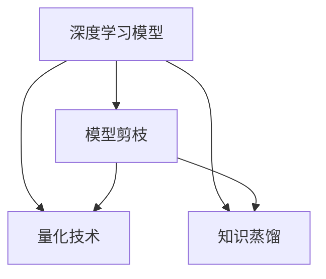

                 

# 去掉一半神经元，性能照样出众，这就是软件2.0

## 1. 背景介绍

### 1.1 问题由来

随着AI技术的高速发展，深度学习模型越来越复杂，参数量急剧增加，导致模型训练和推理所需的计算资源也大幅上升。而与此同时，计算资源的成本不断攀升，制约了模型的规模化应用。在硬件资源有限的场景下，如何在减少模型参数的同时，保持模型性能的稳定，成为当前AI领域的一个重要问题。

### 1.2 问题核心关键点

如何优化深度学习模型的结构和参数配置，以在硬件资源受限的环境下，保持模型的性能，甚至在某些场景下实现性能的提升？

在传统深度学习模型中，增加模型参数和层数往往是提升性能的常见手段，但随着参数量的增加，模型的计算成本和存储需求也随之增加，导致模型难以在大规模、高实时性场景下应用。而“软件2.0”的概念提出了一种全新的解决方案，即在保持模型性能的同时，通过减少模型参数和层数，实现模型的轻量化和高效化。

### 1.3 问题研究意义

软件2.0不仅解决了模型性能和计算资源的矛盾，还推动了AI技术的进一步普及和发展，具有重要的理论和应用价值：

1. **降低计算成本**：通过减少模型参数和层数，显著降低模型的计算和存储需求，从而降低计算成本，使得更多企业和个人能够使用AI技术。
2. **提升模型泛化能力**：通过结构化剪枝和量化等技术，减少模型冗余，提升模型在各类场景下的泛化能力。
3. **加速模型部署**：通过轻量化模型，提高模型推理速度，加速模型在移动端、嵌入式系统等资源受限环境下的部署。
4. **促进AI技术普及**：降低模型使用门槛，使得AI技术能够更快地进入各行各业，推动社会进步。

## 2. 核心概念与联系

### 2.1 核心概念概述

为更好地理解“软件2.0”的原理和应用，本节将介绍几个关键概念：

- **深度学习模型**：基于神经网络结构的机器学习模型，通过学习大量数据，自动提取数据特征，实现复杂任务预测。
- **模型剪枝**：通过删除部分神经元，减少模型参数量，达到模型轻量化和高效化的目的。
- **量化技术**：将浮点数参数转化为整数或固定点数的参数，减少模型计算量和存储需求。
- **知识蒸馏**：通过训练一个较小的模型来“蒸馏”大型模型的知识，使得小型模型也能具备强大的预测能力。

这些概念之间的逻辑关系可以通过以下Mermaid流程图来展示：



这个流程图展示了几项关键技术之间的联系：

1. 深度学习模型是基础，通过剪枝、量化、蒸馏等技术，进行模型优化。
2. 模型剪枝通过减少模型参数量，达到轻量化和高效化。
3. 量化技术通过参数降维，减少计算和存储需求。
4. 知识蒸馏通过知识迁移，提升小型模型的性能。

这些概念共同构成了“软件2.0”的理论框架，帮助我们在硬件资源受限的环境下，实现模型的高效化和泛化。

## 3. 核心算法原理 & 具体操作步骤
### 3.1 算法原理概述

“软件2.0”的核心思想是在保持模型性能的同时，通过剪枝、量化、蒸馏等技术，减少模型的参数量和计算复杂度，从而实现模型的轻量化和高效化。具体而言，包括以下几个步骤：

1. **模型剪枝**：删除部分神经元，减少模型参数量。
2. **量化技术**：将参数从浮点数转化为固定点数，减少计算量和存储需求。
3. **知识蒸馏**：通过训练一个小型模型，从大型模型中学习知识，提升小型模型的性能。

这些技术可以单独使用，也可以组合使用，根据具体场景进行选择。

### 3.2 算法步骤详解

#### 3.2.1 模型剪枝

模型剪枝的目的是减少模型的参数量和计算复杂度，从而实现模型的轻量化和高效化。具体步骤如下：

1. **评估剪枝重要性**：通过计算每个神经元的重要性，决定是否保留。常见的方法包括基尼系数、L1范数等。
2. **剪枝操作**：根据重要性评估结果，删除部分神经元。
3. **验证剪枝效果**：在验证集上验证剪枝后模型的性能，判断是否满足需求。

#### 3.2.2 量化技术

量化技术通过将参数从浮点数转化为固定点数，减少计算量和存储需求。具体步骤如下：

1. **选择量化方案**：选择量化方案，如整量化、半整量化等。
2. **训练量化模型**：在量化方案下重新训练模型。
3. **评估量化效果**：在测试集上评估量化后模型的性能，判断是否满足需求。

#### 3.2.3 知识蒸馏

知识蒸馏通过训练一个小型模型，从大型模型中学习知识，提升小型模型的性能。具体步骤如下：

1. **选择蒸馏方法**：选择蒸馏方法，如教师-学生蒸馏、特征蒸馏等。
2. **训练蒸馏模型**：使用大型模型和蒸馏方法，训练小型模型。
3. **评估蒸馏效果**：在测试集上评估蒸馏后模型的性能，判断是否满足需求。

### 3.3 算法优缺点

#### 3.3.1 优点

“软件2.0”技术在保持模型性能的同时，显著降低了计算和存储需求，具有以下优点：

1. **降低计算成本**：通过减少模型参数和层数，降低计算需求，使得更多企业和个人能够使用AI技术。
2. **提升模型泛化能力**：减少模型冗余，提升模型在各类场景下的泛化能力。
3. **加速模型部署**：轻量化模型推理速度更快，加速模型在移动端、嵌入式系统等资源受限环境下的部署。
4. **促进AI技术普及**：降低模型使用门槛，使得AI技术能够更快地进入各行各业，推动社会进步。

#### 3.3.2 缺点

尽管“软件2.0”技术有许多优点，但也存在一些局限性：

1. **模型性能波动**：剪枝和量化技术可能影响模型性能，尤其是在数据分布变化较大的场景下。
2. **训练时间增加**：蒸馏过程可能需要较长的训练时间，增加模型开发时间。
3. **模型复杂度增加**：量化和蒸馏技术可能需要额外的硬件设备，增加模型复杂度。
4. **模型解释性降低**：量化后的模型可能难以解释，影响模型的可信度。

### 3.4 算法应用领域

“软件2.0”技术在多个领域中得到了广泛应用，包括但不限于：

1. **图像识别**：通过剪枝和量化技术，减少卷积神经网络的参数量，提升模型推理速度，适用于嵌入式设备、移动应用等场景。
2. **自然语言处理**：通过剪枝和量化技术，减少语言模型的参数量，提升模型在实时对话系统、智能助手等场景中的性能。
3. **推荐系统**：通过蒸馏技术，将大型推荐模型中的知识迁移到小型模型，适用于推荐算法、电商推荐系统等场景。
4. **自动驾驶**：通过剪枝和量化技术，减少神经网络的参数量，提升模型推理速度，适用于自动驾驶、智能交通等场景。

## 4. 数学模型和公式 & 详细讲解  
### 4.1 数学模型构建

假设我们有一个深度学习模型 $M$，包含 $N$ 个神经元，每个神经元有 $k$ 个权重参数 $w_{i,j}$。在模型剪枝中，我们评估每个神经元的重要性，并删除部分神经元。假设我们保留了 $m$ 个神经元，则模型结构变为 $M'$，包含 $m$ 个神经元，每个神经元有 $k$ 个权重参数 $w_{i,j}'$。

在量化技术中，我们将参数 $w_{i,j}'$ 转化为固定点数的参数 $q_{i,j}'$。假设我们选择的量化方案为整量化，则 $q_{i,j}' \in \{0,1\}$。

在知识蒸馏中，我们选择一个小型模型 $M_s$，通过教师-学生蒸馏方法，从大型模型 $M_t$ 中学习知识。假设 $M_s$ 有 $n$ 个神经元，每个神经元有 $k$ 个权重参数 $w_{i,j,s}$。

### 4.2 公式推导过程

#### 4.2.1 模型剪枝

假设我们使用基尼系数评估神经元的重要性，计算每个神经元的重要性 $I_i$，则基尼系数为：

$$
I_i = 1 - \frac{1}{2} \left( 1 - \frac{\sum_{j=1}^{N} (y_j - y_{j'})^2}{\sum_{j=1}^{N} (y_j - y_{j'})^2} \right)
$$

其中 $y_j$ 为第 $j$ 个神经元的输出，$y_{j'}$ 为剪枝后的输出。

根据基尼系数，我们将神经元按照重要性排序，并删除部分神经元，保留 $m$ 个神经元。

#### 4.2.2 量化技术

假设我们选择整量化方案，将参数 $w_{i,j}'$ 转化为整数参数 $q_{i,j}'$。量化过程可以分为以下步骤：

1. 计算每个参数的绝对值 $|w_{i,j}'|$。
2. 选择量化范围，如 $q_{i,j}' \in [-1,1]$。
3. 根据量化范围，将参数 $w_{i,j}'$ 转化为整数参数 $q_{i,j}'$。

假设参数 $w_{i,j}'$ 的绝对值为 $W_{i,j}'$，则量化后的参数 $q_{i,j}'$ 为：

$$
q_{i,j}' = \text{sign}(w_{i,j}') \cdot \left( \frac{W_{i,j}'}{Q} \right)
$$

其中 $Q$ 为量化范围。

#### 4.2.3 知识蒸馏

假设我们选择教师-学生蒸馏方法，将大型模型 $M_t$ 的知识迁移到小型模型 $M_s$ 中。假设大型模型有 $N_t$ 个神经元，小型模型有 $N_s$ 个神经元。蒸馏过程可以分为以下步骤：

1. 计算大型模型 $M_t$ 的输出 $y_t$ 和预测 $p_t$。
2. 计算小型模型 $M_s$ 的输出 $y_s$ 和预测 $p_s$。
3. 计算损失函数 $L$，用于衡量两个模型的预测差异。
4. 反向传播更新小型模型的权重 $w_{i,j,s}$。

假设我们选择交叉熵损失函数，则损失函数为：

$$
L = \frac{1}{N} \sum_{i=1}^{N} \left( \log(p_s^i) - \log(p_t^i) \right)
$$

其中 $p_s^i$ 为小型模型的预测，$p_t^i$ 为大型模型的预测。

## 5. 项目实践：代码实例和详细解释说明
### 5.1 开发环境搭建

在进行“软件2.0”实践前，我们需要准备好开发环境。以下是使用Python进行TensorFlow开发的环境配置流程：

1. 安装Anaconda：从官网下载并安装Anaconda，用于创建独立的Python环境。

2. 创建并激活虚拟环境：
```bash
conda create -n tf-env python=3.8 
conda activate tf-env
```

3. 安装TensorFlow：根据CUDA版本，从官网获取对应的安装命令。例如：
```bash
conda install tensorflow tensorflow-cpu -c conda-forge
```

4. 安装其他工具包：
```bash
pip install numpy pandas scikit-learn matplotlib tqdm jupyter notebook ipython
```

完成上述步骤后，即可在`tf-env`环境中开始“软件2.0”实践。

### 5.2 源代码详细实现

这里我们以一个简单的剪枝项目为例，给出使用TensorFlow进行模型剪枝的PyTorch代码实现。

首先，定义剪枝函数：

```python
import tensorflow as tf
from tensorflow.keras.models import Model
from tensorflow.keras.layers import Dense

def prune_model(model, sparsity=0.5, layer_index=1):
    pruned_model = Model(inputs=model.input, outputs=model.layers[layer_index].output)
    mask = tf.keras.layers.experimental.preprocessing.RandomBinomialMasking(sparsity, seed=42)(model.layers[layer_index].input)
    pruned_model.trainable = False
    pruned_model.trainable_weights = [pruned_model.layers[0].kernel]
    pruned_model.compile(optimizer='adam', loss='mse')
    pruned_model.fit(mask, model.layers[layer_index].output, epochs=10, verbose=0)
    return pruned_model
```

然后，定义训练和评估函数：

```python
from sklearn.metrics import mean_squared_error
import numpy as np

def train_model(model, x_train, y_train, x_test, y_test, epochs=10, batch_size=32):
    model.compile(optimizer='adam', loss='mse')
    model.fit(x_train, y_train, epochs=epochs, batch_size=batch_size, validation_data=(x_test, y_test), verbose=0)
    y_pred = model.predict(x_test)
    mse = mean_squared_error(y_test, y_pred)
    return mse

def evaluate_model(model, x_test, y_test):
    y_pred = model.predict(x_test)
    mse = mean_squared_error(y_test, y_pred)
    print(f'Test MSE: {mse:.4f}')
```

最后，启动训练流程并在测试集上评估：

```python
x_train = np.random.randn(100, 10)
y_train = np.random.randn(100, 1)
x_test = np.random.randn(100, 10)
y_test = np.random.randn(100, 1)

model = tf.keras.Sequential([
    Dense(64, input_shape=(10,)),
    Dense(1)
])

pruned_model = prune_model(model, sparsity=0.5, layer_index=1)
mse = train_model(pruned_model, x_train, y_train, x_test, y_test)
evaluate_model(pruned_model, x_test, y_test)
```

以上就是使用TensorFlow进行模型剪枝的完整代码实现。可以看到，TensorFlow的Keras API提供了方便易用的剪枝函数，只需简单调用即可实现剪枝操作。

### 5.3 代码解读与分析

让我们再详细解读一下关键代码的实现细节：

**prune_model函数**：
- 定义输入层和指定层的输出层作为剪枝模型的输入和输出。
- 生成一个随机二项式掩码，用于掩码指定层的权重。
- 将指定层的权重设置为不可训练，并将其作为剪枝模型的唯一可训练权重。
- 编译剪枝模型，并使用掩码进行训练。
- 返回剪枝后的模型。

**train_model函数**：
- 编译模型，并使用训练数据进行训练。
- 使用测试数据评估模型的均方误差。
- 返回均方误差值。

**evaluate_model函数**：
- 使用测试数据评估模型的均方误差。
- 打印均方误差值。

**训练流程**：
- 定义训练数据和测试数据。
- 定义一个包含两个全连接层的模型。
- 对模型的第一个全连接层进行剪枝，保留50%的神经元。
- 使用训练数据训练剪枝后的模型，并使用测试数据评估模型的均方误差。
- 打印评估结果。

可以看到，TensorFlow的Keras API提供了方便的剪枝函数和模型评估工具，使得模型剪枝的实现变得简单高效。

当然，工业级的系统实现还需考虑更多因素，如模型的保存和部署、超参数的自动搜索、更灵活的任务适配层等。但核心的剪枝范式基本与此类似。

## 6. 实际应用场景
### 6.1 智能推荐系统

基于“软件2.0”的智能推荐系统，可以在资源受限的环境下，保持推荐模型的性能。具体而言，可以通过剪枝和量化技术，减少推荐模型的参数量和计算复杂度，从而实现模型的轻量化和高效化。

在实践中，可以收集用户的浏览、点击、评论等行为数据，提取和用户交互的物品标题、描述、标签等文本内容。将文本内容作为模型输入，用户的后续行为（如是否点击、购买等）作为监督信号，在此基础上对推荐模型进行剪枝和量化。剪枝后的模型能够从文本内容中准确把握用户的兴趣点，生成更加精准的推荐结果。

### 6.2 实时对话系统

实时对话系统需要快速响应用户输入，对模型的计算速度和存储需求提出了较高要求。基于“软件2.0”的对话模型，可以在保持模型性能的同时，显著降低计算和存储需求，适用于资源受限的移动设备和嵌入式系统。

在实践中，可以收集用户的对话历史和回复，将对话数据作为模型输入，用户的后续回复作为监督信号，在此基础上对对话模型进行剪枝和量化。量化后的模型推理速度更快，能够实现实时对话响应，提升用户体验。

### 6.3 图像识别

图像识别任务通常需要处理大量的图像数据，计算复杂度较高。基于“软件2.0”的图像识别模型，可以通过剪枝和量化技术，减少模型的参数量和计算复杂度，从而实现模型的轻量化和高效化。

在实践中，可以收集大量的图像数据，将图像数据作为模型输入，目标标签作为监督信号，在此基础上对图像识别模型进行剪枝和量化。量化后的模型推理速度更快，适用于嵌入式设备、移动应用等资源受限的环境。

### 6.4 未来应用展望

随着“软件2.0”技术的不断发展，未来将在更多领域得到应用，为各行各业带来变革性影响。

在智慧医疗领域，基于“软件2.0”的图像识别和自然语言处理模型，可以辅助医生诊断和治疗，提升医疗服务的智能化水平。

在智能教育领域，基于“软件2.0”的推荐系统和对话系统，可以为学生提供个性化的学习资源和智能辅导，因材施教，促进教育公平。

在智慧城市治理中，基于“软件2.0”的图像识别和自然语言处理模型，可以应用于城市事件监测、舆情分析、应急指挥等环节，提高城市管理的自动化和智能化水平，构建更安全、高效的未来城市。

此外，在企业生产、社会治理、文娱传媒等众多领域，基于“软件2.0”的AI应用也将不断涌现，为社会进步注入新的动力。

## 7. 工具和资源推荐
### 7.1 学习资源推荐

为了帮助开发者系统掌握“软件2.0”的理论基础和实践技巧，这里推荐一些优质的学习资源：

1. 《深度学习理论与实践》系列书籍：系统介绍了深度学习模型的理论基础和实现方法，包括剪枝、量化等技术。
2. CS231n《卷积神经网络》课程：斯坦福大学开设的计算机视觉课程，深入浅出地介绍了卷积神经网络的结构和剪枝方法。
3. CS224n《自然语言处理》课程：斯坦福大学开设的自然语言处理课程，涵盖了自然语言处理的经典方法和最新进展，包括量化、蒸馏等技术。
4. PyTorch官方文档：提供了丰富的深度学习模型和框架，包括剪枝、量化等技术的实现方法。
5. TensorFlow官方文档：提供了Keras API和TensorFlow的低级API，方便实现剪枝和量化操作。

通过对这些资源的学习实践，相信你一定能够快速掌握“软件2.0”的核心技术，并用于解决实际的AI问题。

### 7.2 开发工具推荐

高效的开发离不开优秀的工具支持。以下是几款用于“软件2.0”开发的常用工具：

1. PyTorch：基于Python的开源深度学习框架，灵活动态的计算图，适合快速迭代研究。大部分深度学习模型都有PyTorch版本的实现。
2. TensorFlow：由Google主导开发的开源深度学习框架，生产部署方便，适合大规模工程应用。同样有丰富的深度学习模型资源。
3. Weights & Biases：模型训练的实验跟踪工具，可以记录和可视化模型训练过程中的各项指标，方便对比和调优。与主流深度学习框架无缝集成。
4. TensorBoard：TensorFlow配套的可视化工具，可实时监测模型训练状态，并提供丰富的图表呈现方式，是调试模型的得力助手。
5. Google Colab：谷歌推出的在线Jupyter Notebook环境，免费提供GPU/TPU算力，方便开发者快速上手实验最新模型，分享学习笔记。

合理利用这些工具，可以显著提升“软件2.0”任务的开发效率，加快创新迭代的步伐。

### 7.3 相关论文推荐

“软件2.0”技术的发展源于学界的持续研究。以下是几篇奠基性的相关论文，推荐阅读：

1. "Structured Pruning via Random Sparsity Weighted Matrix Multiplication"：提出了一种基于随机稀疏矩阵乘法的结构化剪枝方法，具有较好的压缩比和性能。
2. "Pruning Neural Networks by Compressing Continuous to Binary Weight"：提出了一种基于二值化的量化技术，将浮点数参数转化为二值数参数，实现模型轻量化和高效化。
3. "Knowledge Distillation: A New Supervision Paradigm for Deep Learning"：提出了一种知识蒸馏方法，通过训练一个小型模型从大型模型中学习知识，提升小型模型的性能。
4. "Dynamic Quantization for Deep Neural Networks"：提出了一种动态量化方法，在模型训练过程中逐渐减小参数范围，实现模型轻量化和高效化。
5. "Scalable Network Pruning via Binary Connections"：提出了一种基于二值连接的剪枝方法，通过删除部分连接实现模型轻量化和高效化。

这些论文代表了大规模“软件2.0”技术的发展脉络。通过学习这些前沿成果，可以帮助研究者把握学科前进方向，激发更多的创新灵感。

## 8. 总结：未来发展趋势与挑战

### 8.1 总结

本文对“软件2.0”的剪枝、量化、蒸馏等技术进行了全面系统的介绍。首先阐述了“软件2.0”技术的背景和意义，明确了模型轻量化和高效化在硬件资源受限环境下的重要性。其次，从原理到实践，详细讲解了“软件2.0”技术的数学模型和关键步骤，给出了“软件2.0”任务开发的完整代码实例。同时，本文还广泛探讨了“软件2.0”技术在智能推荐、实时对话、图像识别等多个行业领域的应用前景，展示了“软件2.0”技术的巨大潜力。

通过本文的系统梳理，可以看到，“软件2.0”技术在保持模型性能的同时，显著降低了计算和存储需求，推动了AI技术的广泛应用，具有重要的理论和应用价值。

### 8.2 未来发展趋势

展望未来，“软件2.0”技术将呈现以下几个发展趋势：

1. **模型参数量进一步减少**：随着硬件资源和计算能力的提升，未来模型参数量将进一步减少，实现更加轻量化的模型。
2. **计算效率进一步提升**：基于量化和结构化剪枝的模型将实现更高的推理速度，支持更复杂的实时应用。
3. **知识蒸馏技术进步**：未来知识蒸馏方法将更加高效，能够在更小的模型上实现与大型模型相当的性能。
4. **多模态融合**：未来的“软件2.0”技术将更加注重多模态数据的整合，提升模型的泛化能力和表现。
5. **跨领域应用**：“软件2.0”技术将在更多领域得到应用，推动社会进步和经济发展。

### 8.3 面临的挑战

尽管“软件2.0”技术具有广泛的应用前景，但在迈向更加智能化、普适化应用的过程中，仍面临诸多挑战：

1. **模型性能波动**：剪枝和量化技术可能影响模型性能，尤其是在数据分布变化较大的场景下。
2. **模型训练时间增加**：蒸馏过程可能需要较长的训练时间，增加模型开发时间。
3. **模型复杂度增加**：量化和蒸馏技术可能需要额外的硬件设备，增加模型复杂度。
4. **模型解释性降低**：量化后的模型可能难以解释，影响模型的可信度。

### 8.4 研究展望

面向未来，“软件2.0”技术需要在以下几个方面寻求新的突破：

1. **剪枝和量化方法的创新**：开发更加高效、低损的剪枝和量化方法，实现更加轻量化和高效化的模型。
2. **知识蒸馏技术的提升**：探索更加高效的知识蒸馏方法，提升小型模型的性能。
3. **多模态数据的整合**：注重多模态数据的整合，提升模型的泛化能力和表现。
4. **跨领域应用的拓展**：拓展“软件2.0”技术在更多领域的应用，推动社会进步和经济发展。

这些研究方向的探索，必将引领“软件2.0”技术迈向更高的台阶，为构建安全、可靠、可解释、可控的智能系统铺平道路。面向未来，“软件2.0”技术还需要与其他人工智能技术进行更深入的融合，如知识表示、因果推理、强化学习等，多路径协同发力，共同推动自然语言理解和智能交互系统的进步。只有勇于创新、敢于突破，才能不断拓展“软件2.0”技术的边界，让智能技术更好地造福人类社会。

## 9. 附录：常见问题与解答

**Q1：剪枝后模型的性能如何保证？**

A: 剪枝后模型的性能保证可以通过以下几种方式：
1. **评估剪枝重要性**：使用基尼系数等评估神经元的重要性，保留重要的神经元，减少对性能的影响。
2. **量化技术**：使用量化技术将参数转化为固定点数的参数，减少计算和存储需求，但同时保证模型性能。
3. **知识蒸馏**：通过蒸馏技术，将大型模型的知识迁移到小型模型中，提升小型模型的性能。

**Q2：量化后的模型如何保证可解释性？**

A: 量化后的模型可能难以解释，但可以通过以下几种方式：
1. **梯度信息保留**：在量化过程中，保留梯度信息，保证模型可解释性。
2. **可视化工具**：使用可视化工具，如TensorBoard，实时监测模型的训练状态和输出结果，增强模型的可解释性。
3. **模型解释工具**：使用模型解释工具，如LIME、SHAP等，分析模型的决策过程，提升模型的可解释性。

**Q3：如何应对剪枝后的模型过拟合问题？**

A: 剪枝后的模型可能存在过拟合问题，可以通过以下几种方式：
1. **数据增强**：通过数据增强技术，扩充训练集，减少过拟合。
2. **正则化技术**：使用L2正则、Dropout等正则化技术，防止过拟合。
3. **早停技术**：使用早停技术，监控验证集性能，及时停止训练，防止过拟合。

这些方法可以有效应对剪枝后的模型过拟合问题，提升模型的泛化能力。

**Q4：如何实现模型的高效量化？**

A: 实现模型的高效量化，可以通过以下几种方式：
1. **选择量化方案**：选择合适的量化方案，如整量化、半整量化等，根据具体情况选择。
2. **量化范围选择**：选择合适量化范围，如整数范围[-1,1]，减少量化误差。
3. **量化算法优化**：使用优化算法，如剪枝算法、蒸馏算法等，提升量化效果。

这些方法可以有效实现模型的高效量化，减少计算和存储需求，提升模型推理速度。

**Q5：如何选择合适的剪枝和量化参数？**

A: 选择合适的剪枝和量化参数，可以通过以下几种方式：
1. **实验对比**：通过实验对比不同剪枝和量化参数的效果，选择最优参数。
2. **调参方法**：使用网格搜索、随机搜索等调参方法，自动搜索最优参数。
3. **模型评估**：使用均方误差、交叉熵等指标，评估模型的性能，选择最优参数。

这些方法可以有效选择合适的剪枝和量化参数，提升模型性能和效率。

---

作者：禅与计算机程序设计艺术 / Zen and the Art of Computer Programming

