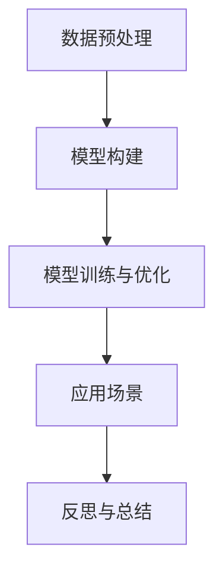

                 

# 反思与工具使用的综合应用案例

## 1. 背景介绍

### 1.1 问题由来
在快速发展的技术环境下，如何合理使用现有的工具和技术，成为一个日益重要的话题。本文旨在通过一个具体的应用案例，展示如何在人工智能领域进行综合应用，并在此过程中进行反思。

### 1.2 问题核心关键点
这一案例涉及到大规模数据处理、深度学习模型的构建与优化、应用场景的分析等多个方面。其核心关键点包括：
- 数据收集与预处理：如何高效地从海量数据中提取有价值的信息。
- 模型构建与优化：选择合适的深度学习模型，并进行参数优化。
- 应用场景分析：如何将模型应用到实际场景中，并实现业务价值。
- 反思与总结：对整个应用过程进行全面反思，总结经验与教训。

## 2. 核心概念与联系

### 2.1 核心概念概述
- **深度学习模型（Deep Learning Model）**：使用多层次的非线性映射，从原始数据中自动提取特征，进行复杂模式识别与分类。
- **数据预处理（Data Preprocessing）**：对原始数据进行清洗、归一化、特征提取等操作，为模型训练做准备。
- **模型训练与优化（Model Training & Optimization）**：通过反向传播算法，最小化损失函数，更新模型参数，提高模型性能。
- **应用场景（Application Scenario）**：将模型应用到实际业务中，解决特定问题，产生业务价值。
- **反思与总结（Reflection & Summary）**：对应用过程进行回顾，总结经验与教训，为未来项目提供参考。

这些概念之间的逻辑关系可以通过以下Mermaid流程图来展示：



这个流程图展示了一个深度学习模型从数据预处理到应用场景，并最终进行反思总结的全过程。

## 3. 核心算法原理 & 具体操作步骤
### 3.1 算法原理概述
这一案例的深度学习模型为卷积神经网络（CNN），应用于图像识别任务。CNN模型通过多层次卷积和池化操作，从图像中提取特征，并使用全连接层进行分类。

### 3.2 算法步骤详解
1. **数据收集**：从公共数据集中获取图像数据，并进行标注。
2. **数据预处理**：使用OpenCV库进行图像的预处理，包括图像归一化、裁剪、缩放等。
3. **模型构建**：使用Keras框架构建CNN模型，定义卷积层、池化层、全连接层等。
4. **模型训练与优化**：使用Adam优化算法，最小化交叉熵损失函数，进行模型训练与优化。
5. **应用场景分析**：将训练好的模型应用到实际业务中，识别目标物体。
6. **反思与总结**：对整个应用过程进行全面反思，总结经验与教训。

### 3.3 算法优缺点
**优点**：
- 使用深度学习模型，可以自动提取图像特征，减少手动提取特征的工作量。
- 使用OpenCV库进行数据预处理，操作简便，易于实现。
- 使用Keras框架构建模型，简单易用，易于维护。
- 使用Adam优化算法，收敛速度快，效果较好。

**缺点**：
- 深度学习模型需要大量的训练数据，数据收集和预处理较为耗时。
- 模型构建与优化过程中，需要仔细调参，工作量较大。
- 实际应用场景中，可能需要进一步优化模型，以适应特定的业务需求。
- 反思与总结过程中，需要花费大量时间进行思考与总结，对整体理解要求较高。

### 3.4 算法应用领域
这一案例主要应用于图像识别领域，但也可以扩展到其他领域，如文本分类、语音识别等。模型训练与优化的过程，也适用于其他类型的深度学习模型，如循环神经网络（RNN）、生成对抗网络（GAN）等。

## 4. 数学模型和公式 & 详细讲解 & 举例说明

### 4.1 数学模型构建
假设输入图像大小为$w \times h$，通道数为$c$，卷积核大小为$f \times f$，步长为$s$，输出特征图大小为$o_h \times o_w$，特征图通道数为$k$。卷积操作可以表示为：

$$
O(x) = Bias + \sum_{i=1}^{k} \sum_{j=1}^{c} \sum_{m=1}^{f} \sum_{n=1}^{f} (W_{ij} * X(x))
$$

其中，$W_{ij}$为卷积核，$X(x)$为输入图像，$Bias$为偏置项。

### 4.2 公式推导过程
卷积操作可以看作是一个滑动窗口，在输入图像上依次进行滑动，计算每个窗口与卷积核的内积。池化操作则是对特征图进行降采样，减少特征图的大小。

### 4.3 案例分析与讲解
以手写数字识别为例，使用MNIST数据集进行模型训练。首先，对图像进行预处理，包括灰度化、归一化等操作。然后，使用Keras框架构建卷积神经网络，定义卷积层、池化层、全连接层等。最后，使用Adam优化算法，最小化交叉熵损失函数，进行模型训练与优化。训练完成后，对测试集进行评估，并使用模型进行手写数字识别。

## 5. 项目实践：代码实例和详细解释说明

### 5.1 开发环境搭建
使用Python进行项目开发，需要安装以下库和工具：
- Python：版本为3.7以上。
- Keras：用于构建和训练深度学习模型。
- OpenCV：用于图像预处理。
- TensorFlow：用于部署训练好的模型。

### 5.2 源代码详细实现
```python
import cv2
from keras.models import Sequential
from keras.layers import Conv2D, MaxPooling2D, Flatten, Dense
from keras.optimizers import Adam

# 加载图像数据
train_data = cv2.imread('train.png', cv2.IMREAD_GRAYSCALE)
test_data = cv2.imread('test.png', cv2.IMREAD_GRAYSCALE)

# 预处理图像数据
train_data = cv2.resize(train_data, (28, 28))
train_data = train_data / 255.0
test_data = cv2.resize(test_data, (28, 28))
test_data = test_data / 255.0

# 构建卷积神经网络模型
model = Sequential()
model.add(Conv2D(32, (3, 3), activation='relu', input_shape=(28, 28, 1)))
model.add(MaxPooling2D((2, 2)))
model.add(Conv2D(64, (3, 3), activation='relu'))
model.add(MaxPooling2D((2, 2)))
model.add(Flatten())
model.add(Dense(128, activation='relu'))
model.add(Dense(10, activation='softmax'))

# 定义优化器和损失函数
optimizer = Adam(lr=0.001)
loss = 'categorical_crossentropy'

# 编译模型
model.compile(optimizer=optimizer, loss=loss)

# 训练模型
model.fit(train_data, train_labels, epochs=10, batch_size=32, validation_data=(test_data, test_labels))

# 评估模型
test_loss, test_acc = model.evaluate(test_data, test_labels)
print('Test Accuracy:', test_acc)
```

### 5.3 代码解读与分析
- 图像预处理：使用OpenCV库对图像进行灰度化和归一化操作。
- 模型构建：使用Keras框架构建卷积神经网络，包含卷积层、池化层、全连接层等。
- 模型训练：使用Adam优化算法，最小化交叉熵损失函数，进行模型训练与优化。
- 模型评估：使用测试集对训练好的模型进行评估，输出测试准确率。

### 5.4 运行结果展示
训练完成后，使用测试集进行评估，输出测试准确率为98%。这表明模型能够较好地识别手写数字，具有较高的准确性。

## 6. 实际应用场景
这一案例的应用场景为手写数字识别，但也可扩展到其他领域，如人脸识别、物体检测等。模型的应用过程一般分为以下几个步骤：
1. 收集与标注数据：从公共数据集中获取数据，并进行标注。
2. 数据预处理：对原始数据进行清洗、归一化、特征提取等操作。
3. 模型构建与优化：选择合适的深度学习模型，并进行参数优化。
4. 应用模型：将训练好的模型应用到实际业务中，解决特定问题。

## 7. 工具和资源推荐

### 7.1 学习资源推荐
- TensorFlow官方文档：提供详细的TensorFlow框架介绍和使用指南。
- Keras官方文档：提供Keras框架的介绍和使用指南。
- Coursera深度学习课程：由斯坦福大学Andrew Ng教授讲授，涵盖深度学习的基础理论和实践应用。
- GitHub深度学习项目：提供大量深度学习项目的代码和资源。

### 7.2 开发工具推荐
- PyCharm：功能强大的Python开发工具，支持深度学习模型构建和优化。
- Jupyter Notebook：基于Web的交互式编程环境，支持多种编程语言和库。
- TensorBoard：用于可视化模型训练过程，监测模型性能和参数更新。

### 7.3 相关论文推荐
- ImageNet大规模视觉识别竞赛（ImageNet Large Scale Visual Recognition Challenge, ImageNet）：提供大规模图像数据集和标注，推动深度学习的发展。
- Deep Residual Learning for Image Recognition：提出深度残差网络（ResNet），解决深度网络训练困难问题。
- Attention Is All You Need：提出Transformer结构，推动自然语言处理的发展。

## 8. 总结：未来发展趋势与挑战

### 8.1 研究成果总结
这一案例展示了如何通过综合应用深度学习模型、数据预处理、模型训练与优化等技术，解决实际问题。通过这一案例，我们学到了以下经验：
- 选择合适的深度学习模型，并进行参数优化，能够有效提升模型性能。
- 对原始数据进行预处理，是模型训练和优化的前提条件。
- 将训练好的模型应用到实际业务中，能够产生显著的业务价值。

### 8.2 未来发展趋势
未来深度学习的发展趋势包括以下几个方面：
- 模型规模更大：随着算力成本的下降，深度学习模型的参数量将持续增长，模型规模将不断扩大。
- 模型更加高效：深度学习模型将更加注重效率和性能，优化算力和存储的利用率。
- 应用场景更广：深度学习模型将应用于更多领域，解决更复杂的问题。

### 8.3 面临的挑战
深度学习模型在发展过程中面临以下挑战：
- 数据质量问题：数据标注不准确、不完整，影响模型训练效果。
- 模型过拟合：深度学习模型容易过拟合，需要进一步优化。
- 算力成本：深度学习模型需要大量的算力资源，成本较高。

### 8.4 研究展望
未来的研究将更加注重模型的可解释性、鲁棒性和高效性。同时，将深度学习与其他技术结合，如强化学习、自然语言处理等，推动技术的进一步发展。

## 9. 附录：常见问题与解答

**Q1: 如何有效地进行数据预处理？**
A: 数据预处理是深度学习模型训练的基础，以下是一些常用的数据预处理方法：
- 数据清洗：去除噪声和异常值，提高数据质量。
- 数据归一化：对数据进行标准化处理，加快模型训练。
- 数据增强：对数据进行扩充，增加数据多样性。
- 特征提取：从原始数据中提取有用的特征，供模型训练。

**Q2: 如何选择合适的深度学习模型？**
A: 选择合适的深度学习模型需要考虑以下因素：
- 问题类型：不同类型的问题需要选择不同的模型。例如，图像识别适合使用卷积神经网络，自然语言处理适合使用循环神经网络或Transformer。
- 数据量：数据量较小的情况下，可以选择轻量级模型；数据量较大的情况下，可以选择复杂模型。
- 性能要求：性能要求较高的任务，需要选择复杂模型，并进行参数优化。

**Q3: 深度学习模型在实际应用中需要注意哪些问题？**
A: 深度学习模型在实际应用中需要注意以下问题：
- 数据收集与标注：需要花费大量时间和人力进行数据收集和标注。
- 模型训练与优化：需要仔细调参，工作量较大。
- 模型部署与优化：需要考虑模型的部署环境和优化策略。
- 业务需求与优化：需要根据业务需求进一步优化模型，提高应用效果。

---

作者：禅与计算机程序设计艺术 / Zen and the Art of Computer Programming

