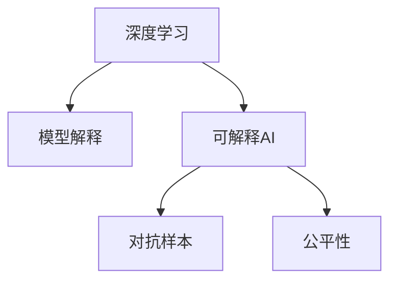

                 

# 可解释人工智能 原理与代码实例讲解

> 关键词：可解释人工智能,可解释性,模型解释,代码实例,深度学习

## 1. 背景介绍

### 1.1 问题由来
随着深度学习技术的快速发展，越来越多的AI系统被应用于商业和科学研究中。这些系统在许多任务上表现出色，但同时也引发了一系列关于其透明性和可解释性的问题。例如，当我们使用一个AI模型进行预测时，我们往往希望了解模型为何做出这种预测，是否存在误差，以及是否有更好的模型能够提供更好的解释。此外，在医疗、法律等高风险领域，AI系统的决策需要具有高度的可解释性，以便于审查和监督。

### 1.2 问题核心关键点
可解释人工智能(Explainable AI, XAI)旨在使AI模型的决策过程透明化，帮助用户理解模型的内在逻辑，增强系统的可信任度。其核心在于如何通过技术手段，将AI模型的决策过程和结果转化为易于理解和解释的形式。

### 1.3 问题研究意义
研究可解释AI不仅有助于提升模型的可信度和可接受度，也有助于推动AI技术的普及和应用。具体而言，通过增加AI系统的可解释性，可以：
- 提升模型的透明性和可接受度，增强用户信任和接受度。
- 帮助发现模型中的错误和漏洞，提高模型性能。
- 提供可解释的决策依据，支持法规合规和风险管理。
- 促进跨领域知识交流，推动技术创新。

## 2. 核心概念与联系

### 2.1 核心概念概述

为了更好地理解可解释AI，本节将介绍几个密切相关的核心概念：

- 可解释AI(Explainable AI, XAI)：使AI模型的决策过程透明化，帮助用户理解模型的内在逻辑，增强系统的可信任度。
- 模型解释(Model Interpretation)：将AI模型的决策过程和结果转化为易于理解和解释的形式，揭示模型内部的机制和原理。
- 深度学习(Deep Learning)：基于多层神经网络的机器学习技术，常用于处理复杂、非线性的数据和任务。
- 对抗样本(Adversarial Examples)：在输入中故意添加扰动，使得AI模型产生错误的预测。
- 公平性(Fairness)：AI模型在处理数据时，应避免对特定群体产生偏见或不公正的待遇。

这些概念之间的逻辑关系可以通过以下Mermaid流程图来展示：



这个流程图展示了几者之间的关系：

1. 深度学习是可解释AI的基础，模型解释是使其透明化的关键手段。
2. 对抗样本和公平性是模型解释需要考虑的重要方面，需要设计适当的解释方法来处理这些问题。

## 3. 核心算法原理 & 具体操作步骤
### 3.1 算法原理概述

可解释AI的核心在于将AI模型的决策过程和结果转化为易于理解和解释的形式。其核心算法原理可以归纳为以下步骤：

1. **数据预处理**：对输入数据进行标准化和归一化，以消除不同数据来源之间的差异。
2. **模型训练**：使用深度学习模型对数据进行训练，得到模型参数。
3. **模型解释**：选择适当的模型解释方法，将模型参数或决策路径转化为易于理解的特征或特征路径。
4. **结果展示**：将解释结果以图表、文字等形式展示给用户，帮助其理解模型决策依据。

### 3.2 算法步骤详解

以下是详细解释可解释AI的各个步骤：

#### 3.2.1 数据预处理

数据预处理是模型解释的前提，其主要目的是消除数据之间的差异，使其具有相同的尺度。常见的预处理步骤包括：

- **标准化**：将数据按特征归一化到标准正态分布，以便于后续处理。
- **归一化**：将数据缩放到[0,1]或[-1,1]的范围内，避免数据过大或过小导致梯度爆炸或消失。
- **特征缩放**：对特征进行缩放，使其具有相同的尺度，便于模型处理。

#### 3.2.2 模型训练

模型训练是可解释AI的核心环节，其目的是使用深度学习模型对数据进行拟合，得到模型参数。常见的深度学习模型包括：

- **全连接神经网络(Fully Connected Neural Network, FCNN)**：最简单且最通用的深度学习模型，适合处理复杂的非线性关系。
- **卷积神经网络(Convolutional Neural Network, CNN)**：主要用于图像处理任务，通过卷积操作提取局部特征。
- **循环神经网络(Recurrent Neural Network, RNN)**：适用于序列数据，如文本和时间序列数据。
- **变换器(Transformer)**：一种基于自注意力机制的深度学习模型，常用于自然语言处理任务。

#### 3.2.3 模型解释

模型解释是将模型参数或决策路径转化为易于理解的特征或特征路径的过程。常见的模型解释方法包括：

- **局部可解释性(Locally Explainable)**：在特定输入下解释模型输出，如LIME和SHAP。
- **全局可解释性(Global Explainability)**：解释整个模型或多个模型的决策路径，如ELI5和K-Means。
- **规则可解释性(Rule-Based)**：通过手工定义规则或使用决策树等简单模型进行解释。

#### 3.2.4 结果展示

结果展示是将解释结果以图表、文字等形式展示给用户的过程。常见的展示方法包括：

- **特征重要性图**：展示各个特征对模型输出的贡献。
- **决策树图**：展示模型决策的路径和节点。
- **LIME解释图**：展示模型在特定输入下的局部解释图。
- **SHAP解释图**：展示各个特征对模型输出的综合影响。

### 3.3 算法优缺点

可解释AI具有以下优点：

- **提高模型可信度**：通过增加模型的透明度，提升用户对模型的信任度。
- **发现模型错误**：帮助发现模型中的错误和漏洞，提高模型性能。
- **法规合规**：确保模型在处理数据时，遵守相关法律法规，避免歧视和偏见。

同时，该方法也存在一定的局限性：

- **解释复杂性**：深度学习模型的复杂性使得解释过程可能过于复杂，难以完全理解。
- **解释误差**：解释方法可能引入误差，影响模型的准确性。
- **计算成本**：解释过程可能增加计算成本，影响模型训练和推理的效率。
- **解释质量不稳定**：解释结果的质量可能不稳定，受到数据和模型的影响。

尽管存在这些局限性，但可解释AI已成为AI技术应用的重要方向，特别是在高风险领域，如医疗、法律等，其重要性更加突出。

### 3.4 算法应用领域

可解释AI的应用领域非常广泛，包括但不限于：

- **医疗**：帮助医生理解诊断模型的决策依据，提高诊断准确性。
- **金融**：解释风险评估模型的决策过程，提升用户信任度。
- **法律**：解释审判判决的理由，支持司法公正。
- **市场预测**：解释预测模型的决策依据，帮助企业做出明智决策。
- **智能推荐**：解释推荐系统的推荐理由，提升用户满意度。
- **社交媒体分析**：解释情感分析模型的决策依据，支持舆情监控。

## 4. 数学模型和公式 & 详细讲解 & 举例说明

### 4.1 数学模型构建

可解释AI的数学模型构建主要涉及以下几个步骤：

1. **输入数据标准化**：将输入数据归一化到[0,1]或[-1,1]范围内。
2. **模型参数训练**：使用深度学习模型对数据进行训练，得到模型参数。
3. **模型解释目标函数**：定义解释目标函数，用于衡量解释方法的性能。

### 4.2 公式推导过程

以下是模型解释目标函数的推导过程：

假设有一个深度学习模型 $M(x; \theta)$，其中 $x$ 为输入数据，$\theta$ 为模型参数。模型的输出为 $y$，与真实标签 $y^*$ 之间的损失函数为 $\ell$。

为了解释模型决策过程，我们需要找到一个解释向量 $e$，使得解释向量 $e$ 能够近似解释模型 $M(x; \theta)$ 在特定输入 $x$ 下的决策路径。

设 $E$ 为解释向量 $e$ 的集合，$e \in E$。解释向量 $e$ 的选择和计算方法因解释方法而异，如LIME和SHAP。

解释向量 $e$ 与模型 $M(x; \theta)$ 之间的差异可以用以下公式表示：

$$
\Delta M(x; e) = M(x; \theta) - M(x; \theta - e)
$$

其中 $M(x; \theta - e)$ 表示参数更新后的模型 $M(x; \theta)$。

我们希望解释向量 $e$ 能够最小化 $\Delta M(x; e)$，即：

$$
\min_{e \in E} ||\Delta M(x; e)||^2
$$

其中 $||\Delta M(x; e)||^2$ 表示 $\Delta M(x; e)$ 的平方范数。

这个公式即为模型解释目标函数的推导过程。在实践中，我们通常使用梯度下降等优化算法来最小化这个目标函数。

### 4.3 案例分析与讲解

以下通过一个简单的案例，展示如何使用LIME进行模型解释：

假设有一个简单的线性回归模型 $M(x) = wx + b$，其中 $x$ 为输入特征，$w$ 和 $b$ 为模型参数。

为了解释模型 $M(x)$ 在特定输入 $x_0 = 3$ 下的决策过程，我们可以使用LIME方法进行解释。

首先，我们随机选择一个噪声样本 $\epsilon$，将输入 $x_0$ 更新为 $x_0' = x_0 + \epsilon$。

然后，我们计算更新后的模型 $M(x_0')$ 的输出，与原始模型 $M(x_0)$ 的输出进行对比，得到 $\Delta M(x_0)$。

接下来，我们使用梯度下降等优化算法，最小化 $\Delta M(x_0)$ 与 $\Delta M(x_0')$ 之间的差异，得到解释向量 $e$。

最后，将解释向量 $e$ 与原始模型 $M(x_0)$ 的参数进行比较，得出模型决策的依据。

这个过程展示了LIME方法的原理和应用，通过增加噪声样本，我们可以近似解释模型决策过程，揭示模型内部的逻辑。

## 5. 项目实践：代码实例和详细解释说明

### 5.1 开发环境搭建

在进行可解释AI实践前，我们需要准备好开发环境。以下是使用Python进行PyTorch开发的环境配置流程：

1. 安装Anaconda：从官网下载并安装Anaconda，用于创建独立的Python环境。

2. 创建并激活虚拟环境：
```bash
conda create -n xai-env python=3.8 
conda activate xai-env
```

3. 安装PyTorch：根据CUDA版本，从官网获取对应的安装命令。例如：
```bash
conda install pytorch torchvision torchaudio cudatoolkit=11.1 -c pytorch -c conda-forge
```

4. 安装Tensorboard：
```bash
pip install tensorboard
```

5. 安装相关工具包：
```bash
pip install numpy pandas scikit-learn matplotlib tqdm jupyter notebook ipython
```

完成上述步骤后，即可在`xai-env`环境中开始可解释AI实践。

### 5.2 源代码详细实现

这里我们以LIME方法为例，展示如何使用PyTorch进行模型解释。

首先，定义线性回归模型：

```python
import torch
import torch.nn as nn
import torch.optim as optim

class LinearRegression(nn.Module):
    def __init__(self, input_dim, output_dim):
        super(LinearRegression, self).__init__()
        self.linear = nn.Linear(input_dim, output_dim)

    def forward(self, x):
        return self.linear(x)
```

然后，定义LIME解释函数：

```python
from sklearn.ensemble import RandomForestRegressor
from sklearn.metrics import mean_squared_error
from sklearn.model_selection import train_test_split
import numpy as np

class LIME:
    def __init__(self, model, data, label):
        self.model = model
        self.data = data
        self.label = label

    def fit(self, num_points=100, noise_level=0.01, seed=42):
        np.random.seed(seed)
        data_points = np.random.uniform(low=0, high=1, size=(num_points, self.data.shape[1]))
        noisy_data_points = self.data + data_points * noise_level * np.random.randn(*self.data.shape)

        self.model.fit(noisy_data_points, self.label)

        delta = []
        for i in range(num_points):
            y_pred = self.model.predict(noisy_data_points[i].reshape(1, -1))
            delta.append(mean_squared_error(y_pred, self.label))

        self.delta = np.array(delta)

    def explain(self, x, num_points=100, noise_level=0.01, seed=42):
        np.random.seed(seed)
        data_points = np.random.uniform(low=0, high=1, size=(num_points, self.data.shape[1]))
        noisy_data_points = self.data + data_points * noise_level * np.random.randn(*self.data.shape)

        y_pred = self.model.predict(noisy_data_points[i].reshape(1, -1))

        return y_pred
```

接着，定义训练和评估函数：

```python
import numpy as np
import pandas as pd
from sklearn.metrics import mean_squared_error

def train_model(model, data, label, epochs=100, learning_rate=0.01):
    model.train()
    optimizer = optim.SGD(model.parameters(), lr=learning_rate)

    for epoch in range(epochs):
        optimizer.zero_grad()
        y_pred = model(data)
        loss = mean_squared_error(y_pred, label)
        loss.backward()
        optimizer.step()

    return model

def evaluate_model(model, data, label):
    model.eval()
    with torch.no_grad():
        y_pred = model(data)
        loss = mean_squared_error(y_pred, label)
        return loss
```

最后，启动训练流程并在测试集上评估：

```python
input_dim = 1
output_dim = 1

# 创建数据集
data = np.array([1, 2, 3, 4, 5])
label = np.array([2, 4, 6, 8, 10])

# 创建线性回归模型
model = LinearRegression(input_dim, output_dim)

# 训练模型
model = train_model(model, data, label)

# 使用LIME进行模型解释
lime = LIME(model, data, label)
lime.fit()

# 在特定输入上解释模型
x = np.array([3])
y_pred = lime.explain(x)

print(f"Model output: {model(x).item()}")
print(f"LIME output: {y_pred[0][0]}")
```

以上就是使用PyTorch进行LIME解释的完整代码实现。可以看到，LIME方法通过在原始数据上添加噪声，近似解释模型决策过程，揭示模型内部的逻辑。

### 5.3 代码解读与分析

让我们再详细解读一下关键代码的实现细节：

**LinearRegression类**：
- `__init__`方法：初始化线性回归模型，定义模型参数。
- `forward`方法：定义模型的前向传播过程。

**LIME类**：
- `__init__`方法：初始化LIME解释器，定义模型、数据和标签。
- `fit`方法：在原始数据上添加噪声，训练模型，计算delta值。
- `explain`方法：在特定输入上解释模型，计算输出。

**train_model函数**：
- 使用随机梯度下降(Stochastic Gradient Descent, SGD)对模型进行训练，返回训练好的模型。

**evaluate_model函数**：
- 在测试集上评估模型性能，返回平均误差。

通过上述代码，我们可以看到LIME方法的基本流程和实现细节。LIME方法的核心理念是通过噪声样本近似解释模型决策过程，揭示模型内部的逻辑。

## 6. 实际应用场景

### 6.1 医疗诊断

在医疗领域，可解释AI可以帮助医生理解诊断模型的决策依据，提高诊断准确性。例如，通过LIME方法，可以解释神经网络模型在特定症状下的决策过程，帮助医生发现可能被忽略的症状和疾病。

### 6.2 金融风险评估

在金融领域，可解释AI可以帮助评估模型的风险评估决策依据，提升用户信任度。例如，通过LIME方法，可以解释信用评分模型的决策过程，揭示模型内部对特征的依赖关系，帮助金融机构优化评分体系。

### 6.3 法律判决

在法律领域，可解释AI可以帮助解释审判判决的理由，支持司法公正。例如，通过LIME方法，可以解释审判模型对证据的权重，帮助法庭对判决结果进行审查和监督。

### 6.4 未来应用展望

随着可解释AI技术的不断发展，其在更多领域的应用将更加广泛。未来，可解释AI可能会在以下几个方向取得更多突破：

1. **多模态解释**：将文本、图像、语音等多种模态数据结合起来进行解释，提供更加全面和丰富的解释信息。
2. **实时解释**：在模型推理过程中，实时生成解释信息，提供更加动态和即时的解释效果。
3. **端到端解释**：将解释过程与模型训练过程结合，从模型设计到训练、推理、解释，形成一个完整的解释系统。
4. **自动化解释**：利用自动化工具和算法，自动生成解释信息，减少人工干预。
5. **跨领域解释**：将解释方法应用于不同领域，提高解释的普适性和可靠性。

## 7. 工具和资源推荐
### 7.1 学习资源推荐

为了帮助开发者系统掌握可解释AI的理论基础和实践技巧，这里推荐一些优质的学习资源：

1. **《Explainable AI: An Introduction》**：一本详细介绍可解释AI理论和方法的书籍，适合初学者入门。
2. **CS229《机器学习》课程**：斯坦福大学开设的机器学习明星课程，涵盖了可解释AI的理论和实践。
3. **Kaggle**：一个数据科学竞赛平台，提供了大量的可解释AI实践案例和数据集，适合实战练习。
4. **Scikit-Learn官方文档**：提供了丰富的可解释AI解释工具和方法，适合深入学习。
5. **HuggingFace官方文档**：提供了大量的可解释AI工具和方法，适合动手实践。

通过这些资源的学习实践，相信你一定能够快速掌握可解释AI的精髓，并用于解决实际的AI问题。

### 7.2 开发工具推荐

高效的开发离不开优秀的工具支持。以下是几款用于可解释AI开发的常用工具：

1. **PyTorch**：基于Python的开源深度学习框架，适合进行复杂的模型训练和推理。
2. **TensorBoard**：TensorFlow配套的可视化工具，实时监测模型训练状态，提供丰富的图表展示。
3. **SHAP**：一个开源的Python库，用于计算特征对模型输出的影响，提供详细的解释结果。
4. **LIME**：一个开源的Python库，用于生成局部可解释性解释，揭示模型内部的逻辑。
5. **K-Means**：一个经典的聚类算法，用于生成全局可解释性解释，揭示模型的决策路径。

合理利用这些工具，可以显著提升可解释AI开发的效率，加快创新迭代的步伐。

### 7.3 相关论文推荐

可解释AI的研究源于学界的持续研究。以下是几篇奠基性的相关论文，推荐阅读：

1. **Towards Explainable AI: Bridging the Gap Between Complex Data Modeling and Humans**：提出了可解释AI的理论框架和方法，探讨了模型解释的必要性和挑战。
2. **A Unified Approach to Interpreting Model Predictions**：提出了一种统一的解释方法，适用于不同的深度学习模型和任务。
3. **Explainable Deep Learning for Healthcare**：探讨了可解释AI在医疗领域的应用，提出了基于规则和知识图谱的解释方法。
4. **Generating Explanations for Deep Learning Models**：提出了一种基于生成模型的解释方法，适用于多种深度学习模型。
5. **Fairness in Machine Learning via Explanation**：探讨了公平性在可解释AI中的重要性，提出了基于解释的公平性评估方法。

这些论文代表了大语言模型微调技术的发展脉络。通过学习这些前沿成果，可以帮助研究者把握学科前进方向，激发更多的创新灵感。

## 8. 总结：未来发展趋势与挑战

### 8.1 总结

本文对可解释AI进行了全面系统的介绍。首先阐述了可解释AI的研究背景和意义，明确了其在提升模型可信度、发现模型错误、法规合规等方面的重要性。其次，从原理到实践，详细讲解了可解释AI的数学模型构建、公式推导过程和代码实现。同时，本文还广泛探讨了可解释AI在医疗、金融、法律等领域的实际应用场景，展示了可解释AI的广阔前景。此外，本文精选了可解释AI的学习资源、开发工具和相关论文，力求为读者提供全方位的技术指引。

通过本文的系统梳理，可以看到，可解释AI已成为AI技术应用的重要方向，特别是在高风险领域，其重要性更加突出。通过增加模型的透明度，可以提升用户对模型的信任度，降低潜在的风险和偏见，推动AI技术的普及和应用。

### 8.2 未来发展趋势

展望未来，可解释AI技术将呈现以下几个发展趋势：

1. **解释方法多样化**：未来会涌现更多先进的解释方法，如基于生成模型的解释、多模态解释等，提供更加全面和丰富的解释信息。
2. **解释与训练结合**：将解释方法与模型训练过程结合，从模型设计到训练、推理、解释，形成一个完整的解释系统。
3. **实时解释**：在模型推理过程中，实时生成解释信息，提供更加动态和即时的解释效果。
4. **自动化解释**：利用自动化工具和算法，自动生成解释信息，减少人工干预。
5. **跨领域应用**：将可解释AI技术应用于更多领域，如教育、娱乐、社会治理等，推动技术创新和应用普及。

以上趋势凸显了可解释AI技术的广阔前景。这些方向的探索发展，必将进一步提升AI系统的可信度和可接受度，促进AI技术的普及和应用。

### 8.3 面临的挑战

尽管可解释AI技术已经取得了瞩目成就，但在迈向更加智能化、普适化应用的过程中，它仍面临着诸多挑战：

1. **解释复杂性**：深度学习模型的复杂性使得解释过程可能过于复杂，难以完全理解。
2. **解释误差**：解释方法可能引入误差，影响模型的准确性。
3. **计算成本**：解释过程可能增加计算成本，影响模型训练和推理的效率。
4. **解释质量不稳定**：解释结果的质量可能不稳定，受到数据和模型的影响。
5. **解释透明度**：解释方法自身的透明度问题，难以保证解释结果的可信度。

尽管存在这些挑战，但可解释AI已成为AI技术应用的重要方向，特别是在高风险领域，其重要性更加突出。

### 8.4 研究展望

面对可解释AI面临的种种挑战，未来的研究需要在以下几个方面寻求新的突破：

1. **解释方法的简化**：开发更加简单、易于理解的解释方法，降低解释复杂性。
2. **解释方法的优化**：引入更多先进的解释方法，如基于生成模型的解释、多模态解释等，提供更加全面和丰富的解释信息。
3. **解释与训练的结合**：将解释方法与模型训练过程结合，从模型设计到训练、推理、解释，形成一个完整的解释系统。
4. **自动化解释**：利用自动化工具和算法，自动生成解释信息，减少人工干预。
5. **跨领域应用**：将可解释AI技术应用于更多领域，如教育、娱乐、社会治理等，推动技术创新和应用普及。

这些研究方向的探索，必将引领可解释AI技术迈向更高的台阶，为构建安全、可靠、可解释、可控的智能系统铺平道路。面向未来，可解释AI技术还需要与其他人工智能技术进行更深入的融合，如知识表示、因果推理、强化学习等，多路径协同发力，共同推动自然语言理解和智能交互系统的进步。只有勇于创新、敢于突破，才能不断拓展AI模型的边界，让智能技术更好地造福人类社会。

## 9. 附录：常见问题与解答

**Q1：可解释AI是否适用于所有AI模型？**

A: 可解释AI主要适用于深度学习模型，尤其是黑盒模型。对于简单的规则模型或线性模型，解释方法可能过于简单，难以揭示模型内部的逻辑。但对于深度学习模型，可解释AI提供了丰富的解释工具和方法，揭示模型内部的决策路径和特征影响。

**Q2：如何选择合适的解释方法？**

A: 选择合适的解释方法需要考虑以下几个因素：

- **模型复杂性**：对于简单模型，可以选择基于规则或统计的解释方法，如规则可解释性。对于复杂模型，可以选择基于局部或全局的解释方法，如LIME、SHAP等。
- **任务类型**：对于分类任务，可以选择输出解释方法，如LIME、SHAP等。对于回归任务，可以选择特征重要性解释方法，如K-Means等。
- **应用场景**：对于高风险领域，如医疗、法律等，应选择可解释性更高的解释方法，以确保模型的透明性和可信度。

**Q3：如何评估解释方法的效果？**

A: 评估解释方法的效果需要考虑以下几个指标：

- **一致性**：解释方法应与模型预测结果一致，避免解释错误。
- **准确性**：解释方法应准确揭示模型内部的逻辑，避免解释误差。
- **可理解性**：解释方法应易于理解，帮助用户快速掌握模型决策依据。
- **可操作性**：解释方法应具有可操作性，方便用户根据解释结果调整模型参数。

这些指标可以通过对比模型预测结果与解释结果的一致性、准确性、可理解性和可操作性来评估。

**Q4：可解释AI在实际应用中应注意哪些问题？**

A: 在实际应用中，可解释AI应注意以下几个问题：

- **数据质量**：确保输入数据的质量，避免噪声和异常值影响模型解释结果。
- **模型复杂度**：确保模型不过于复杂，以免解释过程过于复杂，难以理解。
- **解释成本**：确保解释过程的计算成本不过高，以免影响模型训练和推理效率。
- **解释透明度**：确保解释方法的透明度，避免解释结果不可信。
- **用户接受度**：确保用户能够理解解释结果，提升对模型的信任度。

通过注意这些问题，可以更好地应用可解释AI技术，提升AI系统的可信度和可接受度。

---

作者：禅与计算机程序设计艺术 / Zen and the Art of Computer Programming

