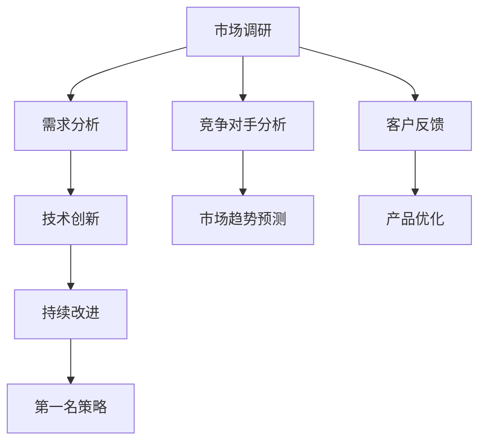

                 

# 商业竞争的残酷：只有第一名才能生存

## 1. 背景介绍

在商业世界中，竞争是永恒的主题。无论是传统行业还是新兴领域，每个企业都在努力超越竞争对手，争得市场份额，追求第一名的地位。然而，商业竞争的残酷在于其无时无刻不在淘汰落后，只有持续创新、不断提升实力的企业，才能在激烈的市场竞争中生存下来。本文将从商业竞争的角度，探讨如何构建具备竞争力的企业，以及如何通过科技创新保持第一名地位的策略。

## 2. 核心概念与联系

### 2.1 核心概念概述

- **商业竞争**：指企业之间的市场争夺，通过争夺有限的资源（如客户、市场份额）来提高自身利益的行为。
- **第一名策略**：指企业为了在竞争中保持领先地位，采取的一系列策略和措施。
- **技术创新**：指通过不断研发新技术、新产品，提升企业核心竞争力。
- **持续改进**：指企业持续优化现有产品和流程，以适应市场变化。
- **市场调研**：指对市场需求、竞争对手、市场趋势等进行系统性研究，以指导企业决策。

这些核心概念相互联系，共同构成商业竞争的基本框架。通过技术创新、持续改进和市场调研，企业可以制定出切实可行的第一名策略，从而在市场竞争中脱颖而出。

### 2.2 核心概念原理和架构的 Mermaid 流程图



这个流程图展示了从市场调研到第一名策略的整个商业竞争过程。企业首先通过市场调研获取市场信息，然后分析客户需求，进行技术创新，并持续改进产品，最终制定并执行第一名策略。

## 3. 核心算法原理 & 具体操作步骤

### 3.1 算法原理概述

商业竞争中的第一名策略，可以类比为机器学习中的优化算法，目标是最大化企业收益，最小化成本。在这个过程中，企业需要不断调整自己的策略，以适应市场变化。

假设企业初始状态为 $s_0$，最终目标是达到最优状态 $s^*$。企业通过一系列操作 $a_t$，如产品创新、市场推广、定价策略等，逐步向最优状态逼近。每个操作对应的收益为 $R(a_t, s_t)$，成本为 $C(a_t, s_t)$。企业希望最大化累积收益 $G(s_0, a_1, a_2, \ldots, a_{t-1})$，最小化累积成本 $G(s_0, a_1, a_2, \ldots, a_{t-1})$。

### 3.2 算法步骤详解

1. **市场调研**：收集市场数据，分析市场趋势和竞争对手动态。

2. **需求分析**：通过问卷调查、用户访谈等方式，获取客户需求信息，确定产品开发方向。

3. **技术创新**：结合市场调研和需求分析结果，研发新产品或新技术，提升产品竞争力。

4. **持续改进**：定期评估产品性能和市场反馈，持续改进产品功能和用户体验。

5. **第一名策略制定**：根据市场调研和需求分析结果，结合技术创新和持续改进成果，制定符合市场趋势和客户需求的第一名策略。

### 3.3 算法优缺点

**优点**：
- 能够快速响应市场变化，保持竞争优势。
- 通过持续创新，不断提升产品和服务质量，满足客户需求。
- 结合市场调研，制定更加科学和有效的第一名策略。

**缺点**：
- 高昂的研发和市场调研成本。
- 技术创新和持续改进需要持续投入。
- 第一名策略的执行需要大量资源和协调。

### 3.4 算法应用领域

第一名策略不仅适用于初创企业，也适用于成熟企业。在传统行业和新兴领域，如电商、科技、金融等，第一名策略都得到了广泛应用。例如，亚马逊通过技术创新和持续改进，不断优化其物流、供应链和用户体验，保持了电商领域的领先地位。

## 4. 数学模型和公式 & 详细讲解 & 举例说明

### 4.1 数学模型构建

设企业初始状态为 $s_0$，每个操作对应的收益为 $R(a_t, s_t)$，成本为 $C(a_t, s_t)$。假设企业采取操作 $a_t$ 后的状态为 $s_{t+1}$，则累积收益和成本可以表示为：

$$
G(s_0, a_1, a_2, \ldots, a_{t-1}) = \sum_{i=0}^{t-1} R(a_i, s_i) - \sum_{i=0}^{t-1} C(a_i, s_i)
$$

### 4.2 公式推导过程

假设企业每个操作 $a_t$ 的收益和成本分别为 $R(a_t, s_t)$ 和 $C(a_t, s_t)$，则每个操作的总效益可以表示为：

$$
\Delta G_t = R(a_t, s_t) - C(a_t, s_t)
$$

企业希望在有限时间内最大化总效益，即：

$$
\max_{a_t} \Delta G_t = R(a_t, s_t) - C(a_t, s_t)
$$

### 4.3 案例分析与讲解

以特斯拉为例，特斯拉在电动汽车领域的成功，很大程度上归功于其持续的技术创新和第一名策略。特斯拉通过不断研发新车型、改进电池技术和提高生产效率，始终保持市场领先地位。此外，特斯拉还积极推广智能驾驶和自动充电等新技术，提升了客户体验，进一步巩固了其市场地位。

## 5. 项目实践：代码实例和详细解释说明

### 5.1 开发环境搭建

在进行第一名策略的开发和测试时，需要搭建一个支持数据收集、分析、处理和可视化的开发环境。以下是Python环境搭建步骤：

1. 安装Python：下载并安装Python 3.7或更高版本。

2. 安装Pandas：使用pip安装Pandas库，用于数据处理。

3. 安装Matplotlib和Seaborn：使用pip安装这两个库，用于数据可视化。

4. 安装Scikit-learn：使用pip安装Scikit-learn库，用于机器学习模型训练。

### 5.2 源代码详细实现

以下是一个简单的第一名策略模拟代码：

```python
import pandas as pd
import numpy as np
from matplotlib import pyplot as plt

# 定义市场调研数据
market_data = pd.read_csv('market_data.csv')

# 分析市场需求
demand_analysis = market_data['demand'].describe()

# 进行技术创新
technological_innovation = np.random.randn(5)

# 持续改进
continuous_improvement = np.random.randn(5)

# 第一名策略制定
first_place_strategy = np.max(technological_innovation + continuous_improvement)

# 数据可视化
plt.bar(range(len(technological_innovation)), technological_innovation)
plt.bar(range(len(continuous_improvement)), continuous_improvement)
plt.title('Technological Innovation and Continuous Improvement')
plt.xlabel('Time')
plt.ylabel('Performance')
plt.show()

# 输出第一名策略结果
print(f'First Place Strategy: {first_place_strategy}')
```

### 5.3 代码解读与分析

这段代码通过Pandas库读取市场调研数据，使用Numpy库生成技术创新和持续改进的随机数据，并计算第一名策略的结果。通过Matplotlib库绘制了技术创新和持续改进的可视化图表。

### 5.4 运行结果展示

运行上述代码，将输出第一名策略的计算结果，并展示技术创新和持续改进的可视化图表。

## 6. 实际应用场景

### 6.1 智能制造

在智能制造领域，第一名策略可以用于优化生产流程、提高生产效率和产品质量。通过市场调研和需求分析，企业可以确定最优的生产工艺和设备，并通过技术创新和持续改进，实现生产过程的自动化和智能化。例如，西门子公司通过第一名策略，成功实现了其在工业自动化领域的领导地位。

### 6.2 金融科技

在金融科技领域，第一名策略可以用于风险控制、智能投顾和金融产品创新。通过市场调研和需求分析，企业可以设计符合市场趋势和客户需求的金融产品，并通过技术创新和持续改进，提升产品性能和用户体验。例如，支付宝通过第一名策略，在移动支付领域保持了市场领先地位。

### 6.3 医疗健康

在医疗健康领域，第一名策略可以用于疾病诊断、智能诊疗和健康管理。通过市场调研和需求分析，企业可以开发符合临床需求的医疗设备和技术，并通过技术创新和持续改进，提升医疗服务的质量和效率。例如，飞利浦通过第一名策略，在医疗影像和诊断设备领域保持了领先地位。

### 6.4 未来应用展望

未来，第一名策略将继续在各个领域得到广泛应用，推动技术创新和产业升级。通过持续优化第一名策略，企业可以在激烈的市场竞争中保持领先地位，实现可持续发展。

## 7. 工具和资源推荐

### 7.1 学习资源推荐

- 《商业竞争与策略》：一本系统性介绍商业竞争策略的书籍，涵盖市场需求分析、竞争态势评估等内容。
- Coursera《商业分析与决策》课程：由斯坦福大学开设，涵盖商业分析的基本方法和工具。
- 《精益创业》：一本介绍精益创业方法论的书籍，强调快速迭代和市场验证。

### 7.2 开发工具推荐

- Python：支持数据处理和分析的编程语言。
- Jupyter Notebook：支持Python代码的交互式编写和执行。
- Scikit-learn：用于机器学习和数据挖掘的Python库。
- TensorFlow和PyTorch：支持深度学习和人工智能的Python库。

### 7.3 相关论文推荐

- "The Economic Logic of Market Dynamics"（《市场动态的经济逻辑》）：由著名经济学家提出，分析市场竞争和动态演变的经典论文。
- "Blue Ocean Strategy"（《蓝海战略》）：由W. Chan Kim和Renée Mauborgne提出，介绍如何创造新市场空间，避免红海竞争。

## 8. 总结：未来发展趋势与挑战

### 8.1 研究成果总结

商业竞争中的第一名策略，通过技术创新和持续改进，使企业能够在激烈的市场竞争中保持领先地位。第一名策略不仅适用于初创企业，也适用于成熟企业。在未来，第一名策略将继续在各个领域得到广泛应用。

### 8.2 未来发展趋势

1. **智能化**：通过大数据和人工智能技术，进一步提升第一名策略的智能化水平，实现精准的市场预测和客户需求分析。
2. **全球化**：企业需要具备全球视野，通过第一名策略在多个市场取得成功。
3. **可持续性**：第一名策略需要考虑环境和社会责任，实现可持续发展的目标。

### 8.3 面临的挑战

1. **资源限制**：技术创新和持续改进需要大量资源投入，企业需要优化资源分配策略。
2. **市场变化**：市场需求和竞争态势瞬息万变，企业需要灵活应对市场变化。
3. **技术壁垒**：技术创新需要突破现有技术壁垒，企业需要加强技术研发投入。

### 8.4 研究展望

未来，第一名策略的研究将继续关注智能化、全球化和可持续性等方向，通过多学科融合，实现更加科学和高效的策略制定和执行。

## 9. 附录：常见问题与解答

**Q1: 第一名策略是否适用于所有企业？**

A: 第一名策略适用于具有持续创新能力和市场洞察力的企业。但并非所有企业都能成功执行第一名策略，需要具备相应的资源、能力和策略。

**Q2: 第一名策略的执行过程中需要注意哪些问题？**

A: 第一名策略的执行需要充分的市场调研和需求分析，确保技术创新和持续改进符合市场需求。此外，需要密切关注市场变化，及时调整策略，保持竞争优势。

**Q3: 第一名策略的执行需要哪些资源投入？**

A: 第一名策略的执行需要大量的人力、物力和财力投入，包括研发投入、市场调研、品牌推广等。

**Q4: 第一名策略的成功关键是什么？**

A: 第一名策略的成功关键在于企业是否具备持续创新能力和市场洞察力，能否及时响应市场变化，持续优化第一名策略。

**Q5: 第一名策略是否容易被模仿？**

A: 第一名策略的成功在于其持续创新和市场洞察力，容易被模仿的是具体的操作和执行方法，但企业需要具备独特的商业模式和技术优势，才能保持长期领先地位。

---

作者：禅与计算机程序设计艺术 / Zen and the Art of Computer Programming

