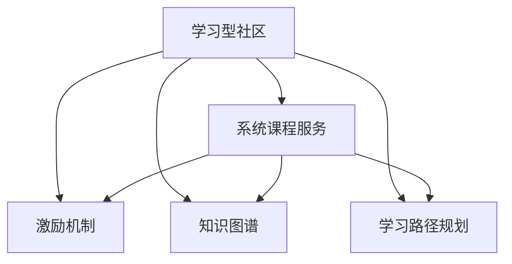
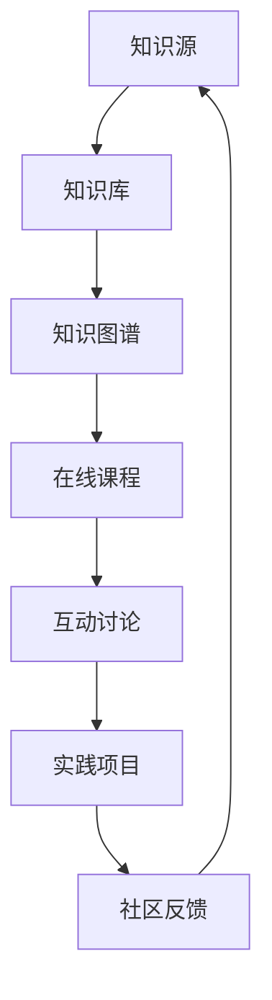

                 

## 1. 背景介绍

### 1.1 问题由来

近年来，随着人工智能技术的迅猛发展，越来越多的开发者和企业开始重视构建和维护一个高效、活跃的学习型社区。一个强大的学习型社区不仅能够吸引并留住高水平的技术人才，还能够促进知识共享和创新，加速技术迭代。特别是在快速变化的AI领域，如何构建并运营一个学习型社区，成为了一个重要的问题。

与此同时，随着互联网的普及和在线教育的发展，系统化、结构化的课程服务需求日益增加。传统线下的教育模式已经无法满足需求，企业、高校、机构和个人越来越倾向于使用在线平台进行知识传递和技能提升。因此，提供系统化的课程服务，也成为了构建学习型社区的一个重要组成部分。

### 1.2 问题核心关键点

在构建学习型社区和提供系统课程服务的过程中，关键在于如何组织和传播知识，如何构建有效的激励机制，以及如何确保课程内容的系统性和实用性。以下是核心关键点：

- **知识组织**：构建一个高效的课程体系，将知识按照逻辑和难易程度进行分类和分层。
- **激励机制**：通过设置积分、认证、排行榜等方式，激励社区成员积极参与知识分享和互动。
- **实用性**：课程内容应紧密结合实际应用需求，提供可操作的实践机会和项目经验。
- **持续更新**：保持课程内容的时效性和前沿性，及时更新和补充新知识和新技能。

## 2. 核心概念与联系

### 2.1 核心概念概述

为了更好地理解围绕主题构建学习型社区和提供系统课程服务的核心概念，本节将介绍几个关键概念：

- **学习型社区**：一个以学习和分享为核心目标的在线平台，通过知识传播、互动交流、项目实践等活动，促进技术人才的成长和社区的发展。
- **系统课程服务**：一套完整的、结构化的在线课程，包含从入门到进阶的多个层次，每个层次都有明确的学习目标和评估标准。
- **激励机制**：通过各种形式的奖励和认可，激励社区成员积极参与学习、分享和互动。
- **知识图谱**：利用图结构对知识进行组织和展示，帮助用户快速定位和理解复杂知识体系。
- **学习路径规划**：基于用户的学习进度和兴趣，推荐个性化的学习路径，确保学习效率和效果。

这些核心概念通过以下Mermaid流程图展示其关系：



### 2.2 核心概念原理和架构的 Mermaid 流程图



## 3. 核心算法原理 & 具体操作步骤

### 3.1 算法原理概述

构建学习型社区和提供系统课程服务，本质上是利用在线教育技术和社交网络技术，进行知识传播和人才汇聚的过程。其核心算法原理包括以下几个方面：

- **知识图谱构建**：利用图神经网络(Graph Neural Network, GNN)等技术，将知识进行图结构化表示，帮助用户快速查找和理解复杂知识体系。
- **个性化推荐算法**：基于用户的学习行为和兴趣，采用协同过滤、内容推荐等算法，为用户推荐个性化的学习路径和课程内容。
- **社区互动算法**：通过分析用户的互动行为，如点赞、评论、分享等，识别和推荐潜在的互动对象，增强社区活跃度。
- **学习效果评估算法**：采用机器学习技术，对用户的学习效果进行量化评估，生成学习报告，提供个性化反馈。

### 3.2 算法步骤详解

构建学习型社区和提供系统课程服务，通常包括以下几个关键步骤：

**Step 1: 准备课程内容**
- 根据学习目标，选择并设计课程内容和结构。
- 将课程内容按照难易程度、知识深度进行分类，并制定详细的学习计划和评估标准。
- 制作课程讲义、视频教程、实践项目等，确保课程内容的完整性和实用性。

**Step 2: 构建知识图谱**
- 利用图神经网络等技术，将课程内容和知识点进行图结构化表示。
- 对图结构进行分析和优化，确保知识图谱的清晰性和可访问性。
- 将知识图谱集成到学习平台，提供搜索、推荐和可视化功能。

**Step 3: 设计激励机制**
- 确定奖励方式，如积分、认证、排行榜等，激励社区成员积极参与。
- 设定任务和挑战，如项目实践、知识分享等，鼓励用户主动学习和分享。
- 定期进行社区活动，如线上研讨会、技术交流会等，增强社区凝聚力。

**Step 4: 实施课程服务**
- 将系统课程发布到学习平台，提供自助学习和交互式学习两种模式。
- 采用个性化推荐算法，根据用户的学习行为和兴趣，推荐相关课程和内容。
- 实施互动讨论和实践项目，促进用户之间的交流和合作。

**Step 5: 持续更新和优化**
- 根据用户反馈和最新技术趋势，定期更新和补充课程内容。
- 对知识图谱和推荐算法进行优化，提升用户体验和学习效果。
- 分析社区互动数据，识别和解决社区问题，提升社区活跃度和满意度。

### 3.3 算法优缺点

构建学习型社区和提供系统课程服务，具有以下优点：

- **高效知识传播**：利用在线平台和社交网络技术，快速传播和共享知识，提升学习效率。
- **灵活交互方式**：提供多种交互方式，如视频、文本、代码等，满足不同用户的需求。
- **个性化推荐**：通过个性化推荐算法，提供个性化的学习路径和内容，提升学习效果。
- **互动社区环境**：构建互动社区，增强用户之间的交流和合作，促进知识共享和创新。

同时，也存在一些缺点：

- **用户粘性不足**：社区和课程需要持续维护和优化，才能保持用户的长期参与。
- **内容质量参差不齐**：课程内容需要严格审核和管理，确保其高质量和实用性。
- **技术实现复杂**：知识图谱、个性化推荐等技术实现较为复杂，需要强大的技术支持和数据支持。
- **社区管理挑战**：如何维护社区秩序、处理争议和投诉，需要设计合理的管理机制和用户规则。

### 3.4 算法应用领域

构建学习型社区和提供系统课程服务，可以在多个领域得到广泛应用，例如：

- **企业培训**：帮助企业构建内部知识库，提供结构化培训课程，提升员工技能和绩效。
- **在线教育**：为中小学、大学等提供优质的在线课程和互动平台，支持学生的自主学习和协作学习。
- **技术社区**：构建面向开发者和技术爱好者的学习社区，提供技术分享、项目协作和技能提升的平台。
- **学术研究**：为科研机构和高校提供知识共享和学术交流的平台，促进学术研究的合作与创新。

## 4. 数学模型和公式 & 详细讲解 & 举例说明

### 4.1 数学模型构建

构建学习型社区和提供系统课程服务的数学模型，主要包括以下几个组成部分：

- **知识图谱模型**：利用图神经网络(GNN)等技术，对知识进行图结构化表示。常用的模型包括GraphSAGE、GraphConv等。
- **个性化推荐模型**：采用协同过滤、内容推荐等算法，为用户推荐个性化的学习路径和课程内容。常用的模型包括ALS、SVM、KNN等。
- **社区互动模型**：通过分析用户的互动行为，识别和推荐潜在的互动对象，增强社区活跃度。常用的模型包括基于图的社交网络模型、推荐系统等。
- **学习效果评估模型**：采用机器学习技术，对用户的学习效果进行量化评估，生成学习报告，提供个性化反馈。常用的模型包括线性回归、支持向量机等。

### 4.2 公式推导过程

以下是对知识图谱模型、个性化推荐模型和社区互动模型的简要推导过程。

**知识图谱模型**：

知识图谱模型可以表示为：

$$
G = (V, E, A)
$$

其中 $V$ 为节点集合，表示知识图谱中的知识点；$E$ 为边集合，表示知识点之间的关系；$A$ 为节点属性集合，表示知识点的特征信息。

利用图神经网络对知识图谱进行建模，常用的公式如下：

$$
h_i^{(l+1)} = \sigma\left(\sum_{j \in N_i(l)}\frac{1}{d_j(l)} h_j^{(l)}W^{(l+1)}_{in} + h_i^{(l)}W^{(l+1)}_{in}\right)
$$

其中 $h_i^{(l)}$ 表示节点 $i$ 在第 $l$ 层的信息表示，$N_i(l)$ 表示节点 $i$ 的邻居节点集合，$d_j(l)$ 表示节点 $j$ 在第 $l$ 层的度数，$W^{(l+1)}_{in}$ 表示信息传递权重矩阵，$\sigma$ 为激活函数。

**个性化推荐模型**：

个性化推荐模型可以表示为：

$$
\hat{y} = f(x; \theta)
$$

其中 $y$ 为推荐结果，$x$ 为输入特征，$\theta$ 为模型参数。

常用的协同过滤算法基于矩阵分解，其公式如下：

$$
\hat{y}_{ij} = \frac{A_i \cdot V_j}{\sqrt{\sum_k A_k^2 \cdot \sum_k V_k^2}}
$$

其中 $A$ 和 $V$ 分别为用户-物品矩阵和物品-属性矩阵，$x$ 为输入特征，$\theta$ 为模型参数。

**社区互动模型**：

社区互动模型可以表示为：

$$
P(y_i = 1 | x_i) = f(x_i; \theta)
$$

其中 $y_i$ 为互动结果，$x_i$ 为输入特征，$\theta$ 为模型参数。

常用的基于图的社交网络模型利用图结构进行建模，其公式如下：

$$
\hat{y}_{ij} = \sigma\left(\sum_{k \in N_i} \frac{1}{d_k} \left(A_{ik} + W_{ik}\right) h_k^{(l-1)}\right)
$$

其中 $A$ 为社交网络矩阵，$W$ 为社交网络权重矩阵，$h_k^{(l-1)}$ 表示节点 $k$ 的隐藏表示。

### 4.3 案例分析与讲解

以在线教育平台为例，分析知识图谱模型、个性化推荐模型和社区互动模型的作用。

**知识图谱模型**：在线教育平台可以通过构建知识图谱，将课程内容进行结构化表示。例如，将课程内容划分为知识点、章节、段落等层次，将知识点之间的关系进行标注。通过知识图谱的查询和推荐功能，用户可以快速定位和理解复杂知识体系。

**个性化推荐模型**：在线教育平台可以通过分析用户的学习行为和兴趣，提供个性化的学习路径和课程推荐。例如，根据用户的历史学习记录、点击行为和评价数据，采用协同过滤算法为用户推荐相关课程和内容。

**社区互动模型**：在线教育平台可以通过分析用户的互动行为，识别和推荐潜在的互动对象，增强社区活跃度。例如，根据用户在课程讨论区的发言和评论，推荐可能感兴趣的用户进行互动。

## 5. 项目实践：代码实例和详细解释说明

### 5.1 开发环境搭建

在进行项目实践前，我们需要准备好开发环境。以下是使用Python进行Django开发的环境配置流程：

1. 安装Anaconda：从官网下载并安装Anaconda，用于创建独立的Python环境。

2. 创建并激活虚拟环境：
```bash
conda create -n django-env python=3.8 
conda activate django-env
```

3. 安装Django：
```bash
pip install django
```

4. 安装第三方库：
```bash
pip install django-crispy-forms django-graphene graphql graphene-django
```

5. 安装开发工具：
```bash
pip install django-redis django-graphene-django
```

6. 安装数据可视化工具：
```bash
pip install matplotlib seaborn
```

完成上述步骤后，即可在`django-env`环境中开始项目实践。

### 5.2 源代码详细实现

这里我们以在线教育平台的个性化推荐系统为例，给出使用Django进行代码实现。

**推荐算法代码实现**：

```python
import numpy as np
from sklearn.metrics.pairwise import cosine_similarity

class RecommendationSystem:
    def __init__(self, user_data, item_data, similarity_matrix):
        self.user_data = user_data
        self.item_data = item_data
        self.similarity_matrix = similarity_matrix
    
    def get_recommendations(self, user_id, top_n=10):
        user_profile = self.user_data[user_id]
        user_items = user_profile['item_ids']
        
        user_similarity = np.array([[self.similarity_matrix[user_id, item_id] for item_id in user_items]])
        item_similarity = np.array([self.similarity_matrix[item_id, :].reshape(-1, 1) for item_id in user_items])
        
        item_similarity = np.concatenate((user_similarity, item_similarity), axis=1)
        user_item_score = cosine_similarity(item_similarity, item_similarity)
        
        item_scores = np.dot(user_item_score, self.item_data) / np.linalg.norm(self.item_data, axis=1)
        
        recommend_items = np.argsort(item_scores)[-top_n:][::-1]
        
        return self.item_data[recommend_items]
```

**用户数据代码实现**：

```python
from django.contrib.auth.models import User

class UserData:
    def __init__(self):
        self.user_data = {}
    
    def get_user(self, user_id):
        if user_id in self.user_data:
            return self.user_data[user_id]
        else:
            user = User.objects.get(id=user_id)
            user_profile = {
                'id': user.id,
                'item_ids': []
            }
            self.user_data[user_id] = user_profile
            return user_profile
    
    def add_item(self, user_id, item_id):
        user_profile = self.get_user(user_id)
        user_profile['item_ids'].append(item_id)
```

**课程数据代码实现**：

```python
class CourseData:
    def __init__(self):
        self.course_data = {}
    
    def get_course(self, course_id):
        if course_id in self.course_data:
            return self.course_data[course_id]
        else:
            course = Course.objects.get(id=course_id)
            course_data = {
                'id': course.id,
                'title': course.title,
                'content': course.content,
                'item_ids': []
            }
            self.course_data[course_id] = course_data
            return course_data
    
    def add_item(self, course_id, item_id):
        course_data = self.get_course(course_id)
        course_data['item_ids'].append(item_id)
```

**课程推荐接口实现**：

```python
from django.http import JsonResponse

class RecommendationView:
    def get(self, request):
        user_id = request.user.id
        top_n = 10
        
        user_data = UserData()
        course_data = CourseData()
        similarity_matrix = np.load('similarity_matrix.npy')
        
        recommendations = user_data.get_user(user_id).get_recommendations(user_id, top_n)
        
        response = {
            'courses': []
        }
        
        for course_id in recommendations:
            course = course_data.get_course(course_id)
            response['courses'].append({
                'id': course['id'],
                'title': course['title'],
                'content': course['content'],
                'item_ids': course['item_ids']
            })
        
        return JsonResponse(response)
```

以上代码实现了基于协同过滤算法的在线教育平台个性化推荐系统。可以看到，Django框架提供了简洁易用的API接口，可以快速构建网站后端。

### 5.3 代码解读与分析

让我们再详细解读一下关键代码的实现细节：

**UserData类**：
- `__init__`方法：初始化用户数据字典。
- `get_user`方法：根据用户ID获取用户数据。
- `add_item`方法：添加用户浏览的课程ID到用户数据中。

**CourseData类**：
- `__init__`方法：初始化课程数据字典。
- `get_course`方法：根据课程ID获取课程数据。
- `add_item`方法：添加课程浏览的课程ID到课程数据中。

**RecommendationView类**：
- `get`方法：根据用户ID和top_n获取推荐课程。
- 首先从用户数据中获取用户ID和已浏览的课程ID。
- 计算用户和课程的相似度矩阵，并计算用户和课程的评分矩阵。
- 根据评分矩阵计算每个课程的评分。
- 根据评分排序，选择top_n个课程进行推荐。
- 返回推荐结果。

以上代码展示了如何使用Django框架进行在线教育平台个性化推荐系统的开发。Django的简洁API和丰富的第三方库支持，大大简化了开发流程。

当然，工业级的系统实现还需考虑更多因素，如缓存机制、负载均衡、API接口的权限控制等。但核心的推荐算法原理基本与此类似。

## 6. 实际应用场景

### 6.1 智能教育系统

基于在线教育平台的个性化推荐系统，可以实现智能教育系统的构建。智能教育系统可以通过推荐系统，将优质的课程内容推荐给学生，提高学习效果。

在技术实现上，可以收集学生的学习行为数据，包括观看视频时长、练习题目数量、测试成绩等，作为推荐系统的输入。通过分析这些数据，推荐系统可以为用户推荐适合的课程和习题，促进个性化学习。

### 6.2 智能培训系统

在企业培训场景中，基于个性化推荐系统的培训系统可以提升培训效果。企业可以根据员工的职业发展路径，推荐相应的培训课程和技能提升模块，帮助员工快速成长。

在技术实现上，可以收集员工的历史培训记录和技能评估数据，作为推荐系统的输入。通过分析这些数据，推荐系统可以为用户推荐适合的培训课程和技能模块，提升培训效果。

### 6.3 在线学习社区

在线学习社区可以通过个性化推荐系统，促进知识共享和互动交流。学习社区可以为用户提供个性化的学习路径和推荐内容，增强学习效果。

在技术实现上，可以收集用户的兴趣和反馈数据，作为推荐系统的输入。通过分析这些数据，推荐系统可以为用户推荐相关课程和内容，促进社区活跃度和知识传播。

## 7. 工具和资源推荐

### 7.1 学习资源推荐

为了帮助开发者系统掌握在线教育平台的开发技术，这里推荐一些优质的学习资源：

1. Django官方文档：Django作为Python的开源Web框架，提供了丰富的学习资源，包括官方文档、教程、社区等。
2. GraphSAGE论文及代码实现：GraphSAGE是常用的知识图谱模型，提供了详细的论文和代码实现，适合深入学习和研究。
3. Python Machine Learning：这是由Sebastian Raschka和Vahid Mirjalili共同编写的书籍，详细介绍了Python在机器学习中的应用，包括在线教育平台的推荐系统开发。
4. Coursera和edX：这两个在线教育平台提供了大量的在线课程，涵盖了从基础到高级的各个层次，适合自学和进一步提升。
5. Kaggle：Kaggle是一个数据科学竞赛平台，提供了大量的数据集和算法竞赛，适合学习和实践。

通过对这些资源的学习实践，相信你一定能够快速掌握在线教育平台的开发技术和个性化推荐算法。

### 7.2 开发工具推荐

高效的开发离不开优秀的工具支持。以下是几款用于在线教育平台开发的常用工具：

1. Django：基于Python的开源Web框架，提供了丰富的API接口和第三方库支持，适合Web应用开发。
2. Flask：Python的轻量级Web框架，适合快速开发和迭代。
3. FastAPI：基于Python的异步Web框架，适合高性能和高并发的Web应用开发。
4. GraphQL：用于构建API接口的查询语言和运行时系统，适合数据驱动的Web应用开发。
5. Jupyter Notebook：基于Web的交互式开发环境，适合数据科学和机器学习开发。

合理利用这些工具，可以显著提升在线教育平台的开发效率，加快创新迭代的步伐。

### 7.3 相关论文推荐

在线教育平台的个性化推荐系统的发展离不开学界的持续研究。以下是几篇奠基性的相关论文，推荐阅读：

1. Recommender Systems Handbook：一本推荐系统领域的经典书籍，涵盖了推荐系统的各个方面，包括在线教育平台的推荐算法。
2. Personalized Recommendation Algorithms for E-Learning: A Survey：介绍了在线教育平台的个性化推荐算法，适合系统学习。
3. Knowledge-Graph-Based Recommender Systems: A Survey：介绍了基于知识图谱的推荐系统，适合深入研究。
4. Collaborative Filtering for Recommender Systems：介绍了协同过滤算法的原理和实现，适合技术学习。
5. Deep Learning for Recommendation Systems：介绍了深度学习在推荐系统中的应用，适合进阶学习。

这些论文代表了大语言模型微调技术的发展脉络。通过学习这些前沿成果，可以帮助研究者把握学科前进方向，激发更多的创新灵感。

## 8. 总结：未来发展趋势与挑战

### 8.1 研究成果总结

本文对围绕主题构建学习型社区和提供系统课程服务进行了全面系统的介绍。首先阐述了构建学习型社区和提供系统课程服务的研究背景和意义，明确了在AI领域构建高效学习社区和提供优质课程服务的独特价值。其次，从原理到实践，详细讲解了个性化推荐算法的数学原理和关键步骤，给出了推荐系统开发的完整代码实例。同时，本文还广泛探讨了个性化推荐系统在智能教育、智能培训等多个领域的应用前景，展示了个性化推荐范式的巨大潜力。

### 8.2 未来发展趋势

展望未来，在线教育平台的个性化推荐系统将呈现以下几个发展趋势：

1. 算法多样化。除了传统的协同过滤算法外，未来的推荐算法将更加多样化，包括深度学习、知识图谱、自然语言处理等，提升推荐效果和灵活性。
2. 数据动态化。未来的推荐系统将更加注重实时数据和动态更新，利用用户即时行为数据，动态调整推荐策略。
3. 用户个性化。未来的推荐系统将更加注重个性化，根据用户的兴趣和行为，推荐更符合个人需求的课程和内容。
4. 跨平台融合。未来的推荐系统将更加注重跨平台融合，利用多端数据和多种用户行为，提升推荐效果。
5. 人工智能辅助。未来的推荐系统将更多利用人工智能技术，如强化学习、迁移学习等，提升推荐效果和推荐策略的优化。

这些趋势凸显了个性化推荐系统的发展方向，也将进一步推动在线教育平台的进步和创新。

### 8.3 面临的挑战

尽管个性化推荐系统已经取得了显著的成果，但在迈向更加智能化、普适化应用的过程中，仍面临诸多挑战：

1. 数据质量问题。推荐系统的效果很大程度上取决于数据的质量，如何保证数据的多样性和准确性，是推荐系统面临的首要挑战。
2. 冷启动问题。对于新用户和新课程，推荐系统很难迅速建立准确的推荐模型，需要设计有效的冷启动策略。
3. 多样性和公平性。如何平衡不同用户和课程的推荐需求，避免推荐单一化或偏向性，是推荐系统面临的重要问题。
4. 鲁棒性和稳定性。如何保证推荐系统在不同环境和数据分布下的鲁棒性和稳定性，避免推荐系统因数据波动或异常而失效，是推荐系统面临的关键问题。
5. 隐私保护问题。如何保护用户的隐私数据，避免数据泄露和滥用，是推荐系统面临的伦理问题。

### 8.4 研究展望

面对个性化推荐系统面临的挑战，未来的研究需要在以下几个方面寻求新的突破：

1. 数据处理和清洗技术。研究如何提高数据的多样性和准确性，设计有效的数据处理和清洗算法，提升推荐系统的数据质量。
2. 冷启动策略设计。研究如何设计有效的冷启动策略，利用用户历史数据、社交网络和协同过滤等手段，快速建立准确的推荐模型。
3. 推荐系统公平性。研究如何设计公平的推荐策略，避免推荐单一化或偏向性，提升推荐系统的多样性和公平性。
4. 推荐系统鲁棒性。研究如何提高推荐系统的鲁棒性和稳定性，设计有效的异常检测和容错机制，确保推荐系统在不同环境和数据分布下稳定运行。
5. 隐私保护技术。研究如何保护用户的隐私数据，设计有效的数据加密和匿名化技术，确保用户数据的安全性。

这些研究方向的探索，必将引领个性化推荐系统迈向更高的台阶，为在线教育平台的创新和进步提供新的动力。面向未来，个性化推荐系统还需要与其他人工智能技术进行更深入的融合，如知识图谱、深度学习、强化学习等，协同发力，共同推动在线教育平台的进步和创新。

## 9. 附录：常见问题与解答

**Q1：如何构建一个高效的学习型社区？**

A: 构建高效的学习型社区，需要从以下几个方面入手：
1. 选择合适的平台和技术架构，如Django、Flask等Web框架。
2. 设计合理的激励机制，如积分、认证、排行榜等，激励社区成员积极参与。
3. 提供丰富的课程内容和个性化推荐，提升用户的学习体验。
4. 注重社区管理和互动，设计合理的用户规则和互动机制，增强社区活跃度。
5. 定期进行社区活动，如线上研讨会、技术交流会等，增强社区凝聚力。

**Q2：个性化推荐系统如何提升在线教育平台的用户体验？**

A: 个性化推荐系统通过分析用户的学习行为和兴趣，为用户推荐适合的课程和内容，提升学习效果和用户体验。具体实现可以采用协同过滤、内容推荐、知识图谱等算法，为用户提供个性化的学习路径和推荐内容，增强学习体验和满意度。

**Q3：在线教育平台推荐系统的技术难点是什么？**

A: 在线教育平台的推荐系统面临的技术难点主要包括：
1. 数据质量问题：如何保证数据的多样性和准确性，设计有效的数据处理和清洗算法，提升推荐系统的数据质量。
2. 冷启动问题：对于新用户和新课程，推荐系统很难迅速建立准确的推荐模型，需要设计有效的冷启动策略。
3. 多样性和公平性：如何平衡不同用户和课程的推荐需求，避免推荐单一化或偏向性，是推荐系统面临的重要问题。
4. 鲁棒性和稳定性：如何保证推荐系统在不同环境和数据分布下的鲁棒性和稳定性，避免推荐系统因数据波动或异常而失效，是推荐系统面临的关键问题。
5. 隐私保护问题：如何保护用户的隐私数据，设计有效的数据加密和匿名化技术，确保用户数据的安全性。

**Q4：如何设计高效的在线教育平台推荐系统？**

A: 设计高效的在线教育平台推荐系统，需要从以下几个方面入手：
1. 选择合适的推荐算法，如协同过滤、内容推荐、知识图谱等，根据具体需求选择适合的算法。
2. 设计有效的用户行为数据采集和处理机制，利用用户的历史学习记录、点击行为和评价数据，提升推荐系统的准确性和实用性。
3. 注重推荐系统的实时性和动态性，利用实时数据和动态更新，动态调整推荐策略。
4. 设计合理的激励机制，如积分、认证、排行榜等，激励社区成员积极参与和互动，提升推荐系统的数据质量和用户粘性。
5. 注重隐私保护，设计有效的数据加密和匿名化技术，确保用户数据的安全性。

这些关键点涵盖了在线教育平台推荐系统的各个方面，通过全面优化和设计，可以构建高效、实用的推荐系统。

**Q5：在线教育平台的推荐系统如何与智能教育系统结合？**

A: 在线教育平台的推荐系统可以与智能教育系统紧密结合，提升教育效果和用户体验。具体实现可以采用以下方法：
1. 收集学生的学习行为数据，包括观看视频时长、练习题目数量、测试成绩等，作为推荐系统的输入。
2. 分析这些数据，推荐适合学生的课程和习题，促进个性化学习。
3. 利用智能教育系统的数据分析和预测能力，优化推荐策略，提升推荐效果。
4. 通过智能教育系统的反馈机制，不断调整和优化推荐系统，提升推荐系统的准确性和实用性。

通过将推荐系统与智能教育系统结合，可以实现更加智能化、个性化的教育模式，提升学习效果和用户体验。

---

作者：禅与计算机程序设计艺术 / Zen and the Art of Computer Programming

