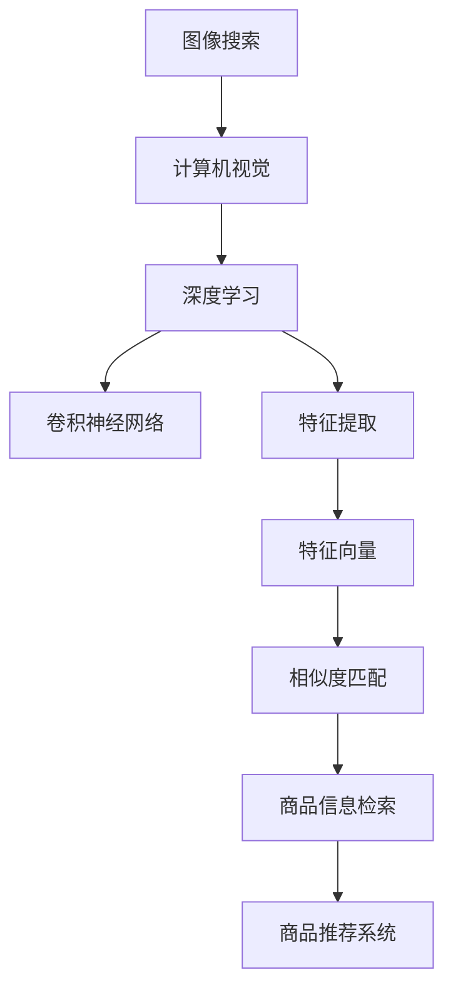

                 

# 图像搜索技术：AI识别商品

> 关键词：图像搜索, 人工智能, 商品识别, 深度学习, 计算机视觉, 特征提取, 特征向量, 相似度匹配, 商品推荐系统

## 1. 背景介绍

### 1.1 问题由来
随着电商市场的快速发展，商品信息的海量增长，如何高效地从海量图像中检索到特定的商品成为了电商平台亟待解决的痛点问题。传统的基于关键词的图像搜索方法无法精确捕捉到图片的具体细节，导致搜索结果的相关性不高，用户体验较差。

与此同时，随着深度学习技术的发展，计算机视觉领域取得了突破性进展，特别是卷积神经网络（Convolutional Neural Networks, CNNs）在图像分类和物体检测上的表现。基于这些技术，AI可以通过图像识别出具体的商品类别，并进一步进行商品搜索和推荐。

### 1.2 问题核心关键点
基于AI的图像搜索技术主要包括以下几个关键点：

- **图像特征提取**：从图像中提取出具有代表性的特征向量。
- **特征向量匹配**：计算待搜索图像与索引图像的特征向量之间的相似度，找出相似的图像。
- **商品信息检索**：通过已识别商品类别，从电商平台上检索出相关商品。
- **商品推荐**：利用机器学习算法，根据用户历史行为和商品信息，推荐用户可能感兴趣的相似商品。

## 2. 核心概念与联系

### 2.1 核心概念概述

为更好地理解基于AI的图像搜索技术，本节将介绍几个密切相关的核心概念：

- **图像搜索**：利用图像识别技术，从海量图像库中检索出与查询图像相似的图像的过程。
- **计算机视觉**：研究如何使计算机能够理解和分析图像、视频等视觉数据的技术。
- **深度学习**：通过构建多层神经网络模型，自动从数据中提取特征并进行预测的技术。
- **卷积神经网络**：一种特殊的神经网络结构，擅长处理具有网格状结构的图像数据。
- **特征提取**：从原始数据中提取出有意义的特征表示，便于后续的分类或匹配。
- **特征向量**：从图像中提取的高维向量表示，用于度量图像之间的相似性。
- **相似度匹配**：计算两个特征向量之间的距离或相似度，判断它们的相似程度。

这些核心概念之间的逻辑关系可以通过以下Mermaid流程图来展示：



这个流程图展示了大语言模型的核心概念及其之间的关系：

1. 图像搜索基于计算机视觉技术，从图像中识别出物体和类别。
2. 深度学习作为计算机视觉的高级技术，能够学习到更加抽象的图像特征。
3. 卷积神经网络作为深度学习的核心结构，擅长处理图像数据。
4. 特征提取和特征向量是深度学习的重要组成部分，用于将原始图像转换为可处理的向量表示。
5. 相似度匹配是图像搜索和推荐系统的关键技术，用于找出与查询图像相似的图像。
6. 商品信息检索和推荐系统则是基于图像搜索技术的进一步应用。

这些概念共同构成了基于AI的图像搜索技术的理论基础，使得AI能够在图像搜索和推荐系统中发挥强大的视觉识别能力。通过理解这些核心概念，我们可以更好地把握AI在图像搜索和推荐系统中的应用。

## 3. 核心算法原理 & 具体操作步骤

### 3.1 算法原理概述

基于AI的图像搜索技术主要通过以下步骤完成：

1. **数据预处理**：将原始图像数据转换为模型输入格式，并进行预处理操作，如缩放、裁剪、归一化等。
2. **特征提取**：使用卷积神经网络从处理后的图像中提取出具有代表性的特征向量。
3. **特征向量匹配**：计算待搜索图像与索引图像的特征向量之间的相似度，找出相似的图像。
4. **商品信息检索**：根据检索出的图像对应的商品类别，从电商平台上检索出相关商品。
5. **商品推荐**：利用机器学习算法，根据用户历史行为和商品信息，推荐用户可能感兴趣的相似商品。

### 3.2 算法步骤详解

**Step 1: 数据预处理**
- 将原始图像数据进行缩放、裁剪、归一化等处理，转换为模型输入格式。
- 对于彩色图像，将其转换为灰度图像或RGB通道分离的图像。
- 对于具有不规则形状的图像，进行边框裁剪，保证图像大小一致。

**Step 2: 特征提取**
- 使用预训练好的卷积神经网络模型，对预处理后的图像进行特征提取。
- 常见的模型包括VGG、ResNet、Inception等，这些模型在ImageNet等大规模图像数据集上进行预训练，具备较强的特征提取能力。
- 提取的特征向量通常包含多个层级，如卷积层、池化层、全连接层的输出。

**Step 3: 特征向量匹配**
- 计算待搜索图像与索引图像的特征向量之间的相似度。
- 常用的相似度计算方法包括余弦相似度、欧式距离、K近邻等。
- 对于大规模图像库，通常使用倒排索引技术，将图像特征向量进行编码，以便快速检索相似图像。

**Step 4: 商品信息检索**
- 根据检索出的相似图像对应的商品类别，从电商平台上检索出相关商品。
- 可以使用商品分类树或标签系统，将商品分类信息与图像特征向量进行映射。
- 可以使用反向索引技术，根据商品类别快速检索相关商品。

**Step 5: 商品推荐**
- 利用机器学习算法，如协同过滤、内容推荐、混合推荐等，根据用户历史行为和商品信息，推荐用户可能感兴趣的相似商品。
- 协同过滤算法基于用户行为数据，推荐与用户之前喜欢的商品相似的商品。
- 内容推荐算法基于商品属性和描述，推荐与查询图像相似的商品。
- 混合推荐算法结合协同过滤和内容推荐，综合考虑用户行为和商品属性，推荐更准确的商品。

### 3.3 算法优缺点

基于AI的图像搜索技术具有以下优点：

- **高效性**：通过特征提取和相似度匹配，可以高效地从海量图像中检索出相关商品，提高用户体验。
- **准确性**：基于深度学习模型的特征提取能力，可以识别出更精确的商品类别，提高检索的准确性。
- **可扩展性**：可以应用于多种类型的商品，如服装、电子产品、家居用品等，具备广泛的适用性。

同时，该技术也存在一些局限性：

- **数据需求大**：需要大量标注的商品图像数据进行模型训练和特征提取，成本较高。
- **计算资源需求高**：深度学习模型和特征提取过程需要大量计算资源，可能存在计算瓶颈。
- **数据质量要求高**：图像质量、拍摄角度等因素会影响特征提取的准确性，因此需要高质量的标注数据。
- **模型复杂度高**：深度学习模型结构复杂，参数量大，调试和优化难度高。

尽管存在这些局限性，基于AI的图像搜索技术在电商平台的商品检索和推荐系统中已经得到了广泛应用，并取得了显著效果。未来相关研究的重点在于如何进一步降低数据需求，提高计算效率，同时兼顾模型的可解释性和鲁棒性等因素。

### 3.4 算法应用领域

基于AI的图像搜索技术在电商平台的商品检索和推荐系统中的应用已经得到了广泛认可，并取得了显著效果。以下是一些具体的应用场景：

- **智能购物助手**：通过图像搜索技术，智能购物助手可以识别用户提供的商品图片，并推荐相关商品。
- **商品分类和标签**：将商品图像与预先定义的类别和标签进行匹配，提高商品分类的准确性。
- **库存管理和补货**：通过图像搜索技术，自动监控库存水平，及时补货，提高供应链效率。
- **个性化推荐**：结合用户行为数据和商品信息，利用深度学习模型进行个性化推荐，提升用户体验。
- **视觉搜索广告**：根据用户上传的图像，实时匹配相关广告商品，提高广告投放效果。
- **品牌和设计识别**：通过图像搜索技术，快速识别商品所属的品牌和设计，满足品牌商家的需求。

## 4. 数学模型和公式 & 详细讲解 & 举例说明

### 4.1 数学模型构建

本节将使用数学语言对基于AI的图像搜索技术进行更加严格的刻画。

记待搜索图像为 $I$，索引图像为 $I'$，特征提取模型为 $F$，特征向量为 $f(I), f(I')$，相似度计算函数为 $s$。则图像搜索的过程可以表示为：

1. 预处理：$I' \leftarrow preprocess(I')$，将索引图像 $I'$ 进行预处理。
2. 特征提取：$f(I') \leftarrow F(I')$，提取索引图像 $I'$ 的特征向量 $f(I')$。
3. 相似度匹配：$s \leftarrow s(f(I), f(I'))$，计算待搜索图像 $I$ 和索引图像 $I'$ 的相似度 $s$。
4. 检索：$I'_{top} \leftarrow \text{argmin}(s(f(I), f(I')))_{k=1}$，根据相似度排序，选择相似度最高的 $k$ 个索引图像。
5. 商品检索：$P \leftarrow \{C(I')|I' \in I'_{top}\}$，根据检索出的图像对应的商品类别 $C(I')$，从电商平台上检索出相关商品 $P$。
6. 商品推荐：$R \leftarrow \text{recommend}(U, P)$，利用机器学习算法，根据用户历史行为 $U$ 和商品信息 $P$，推荐用户可能感兴趣的相似商品 $R$。

### 4.2 公式推导过程

以下我们以余弦相似度为例，推导基于余弦相似度的图像搜索公式。

记余弦相似度函数为：

$$
s(\mathbf{u}, \mathbf{v}) = \frac{\mathbf{u} \cdot \mathbf{v}}{\|\mathbf{u}\|\|\mathbf{v}\|}
$$

其中 $\mathbf{u} = f(I)$，$\mathbf{v} = f(I')$ 为待搜索图像和索引图像的特征向量，$\cdot$ 表示向量的点积，$\|\cdot\|$ 表示向量的模长。

假设检索出的相似图像对应的商品类别为 $C(I')$，则根据余弦相似度排序后的索引图像为 $I'_{top} = \text{argmin}(s(f(I), f(I')))_{k=1}$。商品检索结果为 $P = \{C(I')|I' \in I'_{top}\}$。

利用机器学习算法，如协同过滤、内容推荐等，根据用户历史行为 $U$ 和商品信息 $P$，推荐用户可能感兴趣的相似商品 $R$。

### 4.3 案例分析与讲解

以智能购物助手为例，介绍基于AI的图像搜索技术在实际应用中的具体实现。

1. **数据预处理**：
   - 智能购物助手获取用户上传的商品图片，进行缩放、裁剪、归一化等处理。
   - 对于彩色图像，将其转换为灰度图像或RGB通道分离的图像。
   - 对于具有不规则形状的图像，进行边框裁剪，保证图像大小一致。

2. **特征提取**：
   - 使用预训练好的卷积神经网络模型，如VGG、ResNet等，对预处理后的图像进行特征提取。
   - 特征向量包含多个层级，如卷积层、池化层、全连接层的输出。

3. **特征向量匹配**：
   - 计算待搜索图像与索引图像的特征向量之间的余弦相似度。
   - 使用倒排索引技术，将特征向量进行编码，以便快速检索相似图像。

4. **商品信息检索**：
   - 根据检索出的相似图像对应的商品类别，从电商平台上检索出相关商品。
   - 使用商品分类树或标签系统，将商品分类信息与图像特征向量进行映射。
   - 使用反向索引技术，根据商品类别快速检索相关商品。

5. **商品推荐**：
   - 利用协同过滤算法，基于用户行为数据，推荐与用户之前喜欢的商品相似的商品。
   - 利用内容推荐算法，基于商品属性和描述，推荐与查询图像相似的商品。
   - 使用混合推荐算法，综合考虑用户行为和商品属性，推荐更准确的商品。

## 5. 项目实践：代码实例和详细解释说明

### 5.1 开发环境搭建

在进行图像搜索实践前，我们需要准备好开发环境。以下是使用Python进行TensorFlow开发的环境配置流程：

1. 安装Anaconda：从官网下载并安装Anaconda，用于创建独立的Python环境。

2. 创建并激活虚拟环境：
```bash
conda create -n tf-env python=3.8 
conda activate tf-env
```

3. 安装TensorFlow：根据CUDA版本，从官网获取对应的安装命令。例如：
```bash
pip install tensorflow==2.6
```

4. 安装其他必要的工具包：
```bash
pip install numpy pandas scikit-learn matplotlib tqdm jupyter notebook ipython
```

完成上述步骤后，即可在`tf-env`环境中开始图像搜索实践。

### 5.2 源代码详细实现

下面以智能购物助手为例，给出使用TensorFlow进行图像搜索的PyTorch代码实现。

首先，定义特征提取函数：

```python
import tensorflow as tf
from tensorflow.keras.applications import VGG16
from tensorflow.keras.preprocessing.image import load_img, img_to_array

def extract_features(model, image_path):
    # 加载图像并进行预处理
    img = load_img(image_path, target_size=(224, 224))
    img = img_to_array(img)
    img = img / 255.0
    img = img.reshape((1, img.shape[0], img.shape[1], img.shape[2]))

    # 提取特征向量
    features = model.predict(img)
    return features
```

然后，定义相似度计算函数：

```python
def compute_similarity(features1, features2):
    # 计算余弦相似度
    similarity = tf.reduce_sum(tf.multiply(features1, features2), axis=-1) / (tf.sqrt(tf.reduce_sum(tf.square(features1), axis=-1)) * tf.sqrt(tf.reduce_sum(tf.square(features2), axis=-1)))
    return similarity
```

接着，定义检索和推荐函数：

```python
def search_by_image(image_path, index_dict):
    # 提取特征向量
    features = extract_features(vgg16, image_path)
    
    # 计算相似度
    similarities = []
    for i, index in enumerate(index_dict):
        features2 = extract_features(vgg16, index_dict[index])
        similarity = compute_similarity(features, features2)
        similarities.append(similarity)

    # 排序并选取相似度最高的k个商品
    similarities = sorted(similarities, reverse=True)
    top_k_indices = [index for index, similarity in zip(index_dict, similarities)][:5]
    
    # 检索商品并推荐
    top_k_images = []
    for index in top_k_indices:
        top_k_images.append(index)
    
    recommendations = get_recommendations(user_id, top_k_images)
    return top_k_images, recommendations
```

最后，启动检索流程并在推荐结果中展示：

```python
image_path = 'user_image.jpg'
index_dict = load_index_dict()

top_k_images, recommendations = search_by_image(image_path, index_dict)

print('推荐商品：', recommendations)
```

以上就是使用TensorFlow进行智能购物助手图像搜索的完整代码实现。可以看到，TensorFlow提供的预训练模型和高效计算图，使得图像搜索的实现变得简洁高效。

### 5.3 代码解读与分析

让我们再详细解读一下关键代码的实现细节：

**extract_features函数**：
- 定义了提取特征的函数，输入为一个图像路径。
- 使用VGG16模型进行特征提取，得到特征向量。
- 预处理步骤包括图像缩放、裁剪、归一化等。

**compute_similarity函数**：
- 定义了计算余弦相似度的函数，输入为两个特征向量。
- 使用TensorFlow提供的数学函数，计算两个向量的点积和模长，得到相似度。

**search_by_image函数**：
- 定义了图像搜索的函数，输入为一个图像路径和一个索引字典。
- 首先提取查询图像的特征向量。
- 对索引图像进行特征提取和相似度计算，得到每个索引图像的相似度。
- 根据相似度排序，选取前k个相似的商品图像。
- 根据选定的商品图像，调用推荐算法，得到推荐结果。

通过这些关键函数，可以方便地实现基于AI的图像搜索功能。开发者可以根据实际需求，进行更灵活的定制和扩展。

## 6. 实际应用场景

### 6.1 智能购物助手

基于AI的图像搜索技术，智能购物助手可以识别用户提供的商品图片，并推荐相关商品。用户在购物时，只需要上传商品图片，智能购物助手即可快速检索并推荐相似商品，提高购物体验。

智能购物助手还可以根据用户的历史行为和偏好，提供个性化的商品推荐，进一步提升用户体验。例如，根据用户之前喜欢的商品，智能购物助手可以推荐相似的商品，或者根据用户浏览历史推荐相关的商品类别。

### 6.2 商品分类和标签

将商品图像与预先定义的类别和标签进行匹配，提高商品分类的准确性。例如，电商平台可以使用智能购物助手的图像搜索技术，对商品图像进行自动分类，生成商品分类树。商品分类树可以帮助电商平台更好地管理商品信息，提高搜索效率。

### 6.3 库存管理和补货

通过图像搜索技术，自动监控库存水平，及时补货，提高供应链效率。例如，仓库可以根据智能购物助手检索出的相似商品图像，自动生成补货单，确保库存充足。

### 6.4 个性化推荐

结合用户行为数据和商品信息，利用深度学习模型进行个性化推荐，提升用户体验。例如，智能购物助手可以基于用户的历史浏览记录和购买行为，推荐相似的商品，或者根据商品属性和描述，推荐相关的商品类别。

## 7. 工具和资源推荐

### 7.1 学习资源推荐

为了帮助开发者系统掌握AI在图像搜索技术中的应用，这里推荐一些优质的学习资源：

1. **《深度学习》课程**：由斯坦福大学开设的深度学习课程，涵盖了深度学习的基础知识、卷积神经网络、特征提取等内容。

2. **《计算机视觉：模型、学习和推理》**：一本介绍计算机视觉技术的经典教材，涵盖了图像分类、目标检测、图像生成等内容。

3. **TensorFlow官方文档**：TensorFlow的官方文档，提供了详细的API文档、教程和示例代码，方便开发者上手使用。

4. **PyTorch官方文档**：PyTorch的官方文档，提供了丰富的深度学习模型和工具库，支持GPU加速。

5. **《自然语言处理与深度学习》**：一本介绍自然语言处理和深度学习的书籍，涵盖了文本处理、语义分析、图像识别等内容。

通过对这些资源的学习实践，相信你一定能够快速掌握AI在图像搜索技术中的应用，并用于解决实际的NLP问题。

### 7.2 开发工具推荐

高效的开发离不开优秀的工具支持。以下是几款用于图像搜索开发的常用工具：

1. **TensorFlow**：由Google主导开发的开源深度学习框架，生产部署方便，适合大规模工程应用。

2. **PyTorch**：基于Python的开源深度学习框架，灵活动态的计算图，适合快速迭代研究。

3. **Keras**：一个高级深度学习框架，基于TensorFlow和PyTorch等底层库，提供简单易用的API接口。

4. **OpenCV**：一个开源计算机视觉库，提供了丰富的图像处理和特征提取函数。

5. **H5py**：一个用于读写HDF5格式文件的库，方便处理大规模数据集。

6. **Pillow**：一个Python图像处理库，支持图像缩放、裁剪、旋转等操作。

合理利用这些工具，可以显著提升图像搜索任务的开发效率，加快创新迭代的步伐。

### 7.3 相关论文推荐

AI在图像搜索技术的研究源于学界的持续研究。以下是几篇奠基性的相关论文，推荐阅读：

1. **ImageNet Large Scale Visual Recognition Challenge**：提出ImageNet数据集和相应的图像分类挑战赛，推动了深度学习在图像分类领域的发展。

2. **Visual Geometry Group**：剑桥大学的研究团队，在计算机视觉领域做出了大量贡献，包括图像分类、目标检测等。

3. **Convolutional Neural Networks**：提出卷积神经网络模型，在图像分类和目标检测任务上取得了优异表现。

4. **特征提取**：提出利用卷积神经网络进行特征提取的方法，广泛应用于图像搜索和推荐系统。

5. **深度学习**：提出利用深度神经网络进行图像特征提取和分类的方法，推动了计算机视觉领域的发展。

6. **相似度匹配**：提出余弦相似度和欧式距离等相似度计算方法，广泛应用于图像搜索和推荐系统。

这些论文代表了大语言模型微调技术的发展脉络。通过学习这些前沿成果，可以帮助研究者把握学科前进方向，激发更多的创新灵感。

## 8. 总结：未来发展趋势与挑战

### 8.1 总结

本文对基于AI的图像搜索技术进行了全面系统的介绍。首先阐述了图像搜索技术在电商平台中的应用背景和重要性，明确了AI在图像搜索中的关键作用。其次，从原理到实践，详细讲解了图像搜索的数学原理和关键步骤，给出了图像搜索任务开发的完整代码实例。同时，本文还广泛探讨了图像搜索技术在电商、智能购物助手等多个领域的应用前景，展示了AI在图像搜索中的巨大潜力。此外，本文精选了图像搜索技术的各类学习资源，力求为读者提供全方位的技术指引。

通过本文的系统梳理，可以看到，基于AI的图像搜索技术正在成为电商平台的重要范式，极大地提升了电商平台的商品检索和推荐系统的智能化水平，改善了用户购物体验。未来，伴随AI技术的不断进步，图像搜索技术还将不断创新，推动电商平台智能化进程。

### 8.2 未来发展趋势

展望未来，图像搜索技术将呈现以下几个发展趋势：

1. **计算效率提升**：随着硬件加速技术的不断进步，图像搜索技术将进一步提升计算效率，降低算力成本。

2. **多模态融合**：图像搜索技术将进一步扩展到多模态数据，如文本、语音、视频等，实现更全面的视觉信息整合。

3. **个性化推荐**：结合用户行为数据和商品信息，利用深度学习模型进行个性化推荐，提升用户体验。

4. **实时搜索**：通过分布式计算和大数据技术，实现实时图像搜索，满足用户的即时需求。

5. **智能助手**：利用AI技术，开发更加智能的购物助手，提供更加个性化的商品推荐和用户互动。

6. **可视化搜索**：结合图像和文本信息，提供更加直观的可视化搜索界面，提升用户搜索体验。

以上趋势凸显了图像搜索技术的广阔前景。这些方向的探索发展，必将进一步提升电商平台的用户体验，推动人工智能技术在垂直行业的规模化落地。

### 8.3 面临的挑战

尽管图像搜索技术已经取得了瞩目成就，但在迈向更加智能化、普适化应用的过程中，它仍面临着诸多挑战：

1. **数据需求大**：需要大量标注的商品图像数据进行模型训练和特征提取，成本较高。

2. **计算资源需求高**：深度学习模型和特征提取过程需要大量计算资源，可能存在计算瓶颈。

3. **数据质量要求高**：图像质量、拍摄角度等因素会影响特征提取的准确性，因此需要高质量的标注数据。

4. **模型复杂度高**：深度学习模型结构复杂，参数量大，调试和优化难度高。

尽管存在这些挑战，图像搜索技术在电商平台的应用已经得到了广泛认可，并取得了显著效果。未来相关研究的重点在于如何进一步降低数据需求，提高计算效率，同时兼顾模型的可解释性和鲁棒性等因素。

### 8.4 研究展望

面对图像搜索技术所面临的挑战，未来的研究需要在以下几个方面寻求新的突破：

1. **探索无监督和半监督方法**：摆脱对大规模标注数据的依赖，利用自监督学习、主动学习等无监督和半监督范式，最大限度利用非结构化数据，实现更加灵活高效的图像搜索。

2. **研究计算高效方法**：开发更加高效、轻量级的图像搜索算法，在保证精度的情况下，降低计算资源消耗，实现更加高效的图像搜索。

3. **融合因果推断思想**：引入因果推断方法，增强图像搜索模型的稳定性和鲁棒性，提高图像搜索的可靠性和准确性。

4. **引入专家知识**：将符号化的先验知识，如知识图谱、逻辑规则等，与神经网络模型进行巧妙融合，引导图像搜索过程学习更准确、合理的图像表征。

5. **多模态信息整合**：结合视觉、语音、文本等多模态信息，实现更全面、准确的图像搜索。

6. **个性化推荐算法**：结合用户行为数据和商品信息，利用深度学习模型进行个性化推荐，提升用户体验。

这些研究方向的探索，必将引领图像搜索技术迈向更高的台阶，为构建智能化的电商平台和购物助手提供更加强大的技术支持。面向未来，图像搜索技术还需要与其他人工智能技术进行更深入的融合，如知识表示、因果推理、强化学习等，多路径协同发力，共同推动计算机视觉和自然语言处理技术的进步。只有勇于创新、敢于突破，才能不断拓展图像搜索技术的边界，让智能技术更好地造福人类社会。

## 9. 附录：常见问题与解答

**Q1：图像搜索技术是否适用于所有商品类型？**

A: 图像搜索技术在大多数商品类型上都能取得不错的效果，特别是对于视觉特征明显的商品。但对于一些非可视商品，如食品、饮料等，图像搜索的效果可能不佳。此时可以结合其他数据源，如文字描述、品牌信息等，综合进行商品识别和检索。

**Q2：如何缓解图像搜索中的过拟合问题？**

A: 过拟合是图像搜索面临的主要挑战，尤其是在标注数据不足的情况下。常见的缓解策略包括：
1. 数据增强：通过回译、近义替换等方式扩充训练集
2. 正则化：使用L2正则、Dropout、Early Stopping等避免过拟合
3. 对抗训练：引入对抗样本，提高模型鲁棒性
4. 参数高效微调：只调整少量参数(如Adapter、Prefix等)，减小过拟合风险
5. 多模型集成：训练多个图像搜索模型，取平均输出，抑制过拟合

这些策略往往需要根据具体任务和数据特点进行灵活组合。只有在数据、模型、训练、推理等各环节进行全面优化，才能最大限度地发挥图像搜索技术的威力。

**Q3：图像搜索技术在实际部署时需要注意哪些问题？**

A: 将图像搜索模型转化为实际应用，还需要考虑以下因素：
1. 模型裁剪：去除不必要的层和参数，减小模型尺寸，加快推理速度
2. 量化加速：将浮点模型转为定点模型，压缩存储空间，提高计算效率
3. 服务化封装：将模型封装为标准化服务接口，便于集成调用
4. 弹性伸缩：根据请求流量动态调整资源配置，平衡服务质量和成本
5. 监控告警：实时采集系统指标，设置异常告警阈值，确保服务稳定性
6. 安全防护：采用访问鉴权、数据脱敏等措施，保障数据和模型安全

图像搜索技术在实际应用中，需要从模型性能、计算资源、系统架构等多个维度进行全面优化，才能实现高效、可靠、安全的部署。

通过本文的系统梳理，可以看到，基于AI的图像搜索技术正在成为电商平台的重要范式，极大地提升了电商平台的商品检索和推荐系统的智能化水平，改善了用户购物体验。未来，伴随AI技术的不断进步，图像搜索技术还将不断创新，推动电商平台智能化进程。总之，图像搜索技术在未来人工智能领域的应用前景广阔，值得我们持续关注和探索。

