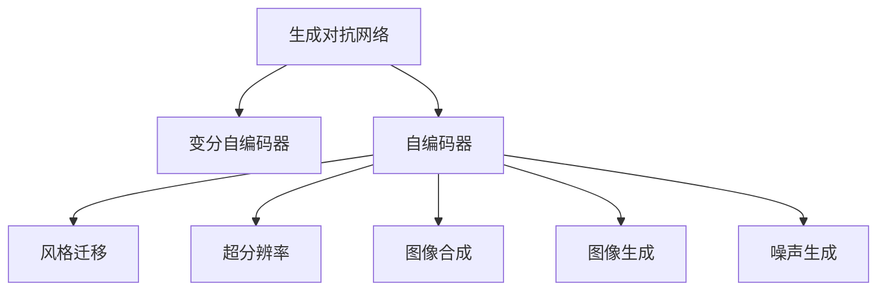

                 

# 图像生成 (Image Generation)

> 关键词：生成对抗网络 (GANs), 变分自编码器 (VAEs), 自编码器 (Autoencoders), 风格迁移 (Style Transfer), 超分辨率 (Super-Resolution), 图像合成 (Image Synthesis), 图像生成 (Image Generation)

## 1. 背景介绍

随着深度学习技术的不断发展，图像生成领域取得了重大突破，生成对抗网络（GANs）和变分自编码器（VAEs）等生成模型成为了当前研究的热点。这些模型能够从噪声中生成高质量的图像，具有极强的视觉感知能力和艺术创造性，在图像生成、图像编辑、图像修复、风格迁移等诸多应用场景中展现了巨大潜力。

### 1.1 问题由来

图像生成技术已经广泛应用于计算机视觉、艺术设计、虚拟现实等领域。然而，传统的图像生成方法如基于模板、规则的生成、手工绘制等，往往依赖于大量的人工干预和计算资源。而基于深度学习的生成模型通过自监督学习，能够自动学习图像的底层特征和生成规律，极大降低了生成图像的成本和难度。

生成模型通常基于端到端神经网络，通过将输入随机噪声映射到输出图像，实现从低维噪声空间到高维图像空间的非线性映射。相比于传统的图像生成方法，生成模型具有显著的计算效率、多样性和逼真度优势，正在逐步取代传统方法，成为图像生成领域的主流技术。

### 1.2 问题核心关键点

目前，图像生成领域的主流模型包括生成对抗网络（GANs）、变分自编码器（VAEs）、自编码器（Autoencoders）等。这些模型在结构和原理上存在较大差异，但核心目标都是通过学习图像的概率分布，实现从噪声空间到图像空间的映射。

核心问题在于如何高效地学习图像的概率分布，同时确保生成的图像具有高质量、多样性和逼真度。此外，由于生成模型通常是一个复杂的多层次网络结构，如何高效地训练、优化和评估模型也是一大挑战。

## 2. 核心概念与联系

### 2.1 核心概念概述

为更好地理解图像生成技术，本节将介绍几个密切相关的核心概念：

- 生成对抗网络（GANs）：一种由生成器和判别器两个网络组成的对抗模型。通过生成器和判别器之间的博弈，生成器不断提升生成图像的质量，判别器则不断提升判别真伪图像的能力。
- 变分自编码器（VAEs）：一种基于变分推断的自编码器模型，能够从输入噪声中生成高质量的图像，并具有一定的可解释性。
- 自编码器（Autoencoders）：一种编码器-解码器结构的网络模型，能够通过压缩和解压缩过程学习数据的潜在特征。
- 风格迁移（Style Transfer）：将一幅图像的风格迁移到另一幅图像上，生成具有特定风格的新图像。
- 超分辨率（Super-Resolution）：将低分辨率图像放大成高分辨率图像，生成更加清晰细腻的图像。
- 图像合成（Image Synthesis）：将多个图像合成为一个图像，生成全新的图像内容。
- 图像生成（Image Generation）：从随机噪声或文本描述中生成全新的图像。

这些核心概念之间的逻辑关系可以通过以下Mermaid流程图来展示：



这个流程图展示了几类生成模型的核心概念及其之间的关系：

1. 生成对抗网络（GANs）和变分自编码器（VAEs）是两种常见的生成模型，它们都能从噪声中生成高质量的图像。
2. 自编码器（Autoencoders）能够从输入图像中学习特征表示，用于图像压缩、降噪等任务。
3. 风格迁移（Style Transfer）和超分辨率（Super-Resolution）是应用生成模型进行图像处理的方法。
4. 图像合成（Image Synthesis）和图像生成（Image Generation）则是直接从噪声或文本描述生成新图像的方法。
5. 噪声生成（Noise Generation）是生成模型的一个前置步骤，通过生成随机噪声来模拟真实世界的随机性。

这些概念共同构成了图像生成技术的核心框架，使得生成模型能够应用于各种图像处理和生成任务。

## 3. 核心算法原理 & 具体操作步骤
### 3.1 算法原理概述

图像生成技术通常基于生成模型，通过学习图像的概率分布，实现从低维噪声空间到高维图像空间的映射。常用的生成模型包括生成对抗网络（GANs）和变分自编码器（VAEs）等。

GANs 通过生成器和判别器的对抗训练，学习生成逼真图像的能力。生成器网络 $G$ 将噪声 $z$ 映射到图像 $x$，判别器网络 $D$ 判断输入图像 $x$ 是真实图像还是生成图像，并返回判别结果 $y$。训练过程中，生成器网络试图欺骗判别器网络，使其无法准确区分真实图像和生成图像。具体公式如下：

$$
\begin{aligned}
&\min_G \max_D \mathbb{E}_{x \sim p_{\text{data}}}[\log D(x)] + \mathbb{E}_{z \sim p(z)}[\log (1-D(G(z)))] \\
&p_{\text{data}}: \text{真实数据分布}, p(z): \text{噪声分布}
\end{aligned}
$$

VAEs 通过学习图像的概率分布，实现从噪声到图像的生成。VAEs 包含一个编码器 $E$ 和一个解码器 $D$，将输入图像 $x$ 编码到潜在表示 $z$，再将 $z$ 解码为图像 $x'$。VAEs 假设生成过程符合高斯分布，即 $p(z|x) = \mathcal{N}(z|\mu(x), \sigma(x))$，其中 $\mu(x)$ 和 $\sigma(x)$ 分别表示 $x$ 的均值和方差。具体公式如下：

$$
\begin{aligned}
&\min_{E,D} \mathbb{E}_{x \sim p_{\text{data}}}[\log p_{\text{data}}(x)] + \mathbb{E}_{z \sim \mathcal{N}(0,1)}[\log p_{\text{data}}(G(z))]
\end{aligned}
$$

### 3.2 算法步骤详解

以下是基于生成对抗网络（GANs）和变分自编码器（VAEs）的图像生成算法步骤：

**GANs 生成算法步骤：**

1. 初始化生成器和判别器网络，随机初始化噪声分布 $p(z)$。
2. 在判别器网络 $D$ 中固定权重，训练生成器网络 $G$。
3. 在生成器网络 $G$ 中固定权重，训练判别器网络 $D$。
4. 交替进行生成器和判别器的训练，直至收敛。

**VAEs 生成算法步骤：**

1. 初始化编码器 $E$ 和解码器 $D$ 网络，随机初始化噪声分布 $p(z)$。
2. 训练编码器 $E$，使其能够将输入图像 $x$ 编码到潜在表示 $z$。
3. 训练解码器 $D$，使其能够将潜在表示 $z$ 解码为图像 $x'$。
4. 交替进行编码器和解码器的训练，直至收敛。

### 3.3 算法优缺点

生成对抗网络（GANs）和变分自编码器（VAEs）在图像生成领域中各具优势：

**GANs 的优点：**

- 生成图像逼真度高，能够生成具有高度细节和复杂性的图像。
- 结构灵活，适用于各种生成任务，如图像生成、图像修复、图像超分辨率等。
- 训练过程中具有自适应能力，能够逐步提升生成图像的质量。

**GANs 的缺点：**

- 训练过程不稳定，容易陷入局部最优解。
- 生成图像的方差较大，具有较高的变异性。
- 计算资源消耗较大，训练过程较慢。

**VAEs 的优点：**

- 生成图像具有较高的可解释性，能够生成连续的潜在表示 $z$。
- 模型结构相对简单，易于优化和训练。
- 生成图像具有较好的多样性，能够生成多种风格的图像。

**VAEs 的缺点：**

- 生成的图像细节较少，不够逼真。
- 对输入噪声的分布要求较高，需要进行预处理。
- 模型的训练过程中需要维护概率分布，计算复杂度较高。

### 3.4 算法应用领域

图像生成技术已经在图像处理、计算机视觉、艺术设计、虚拟现实等领域得到了广泛应用，例如：

- 图像生成：通过随机噪声或文本描述生成全新的图像，应用于艺术创作、游戏设计等领域。
- 图像修复：对受损图像进行修复，恢复其原本的图像质量。
- 超分辨率：将低分辨率图像放大成高分辨率图像，应用于视频处理、遥感图像等领域。
- 风格迁移：将一幅图像的风格迁移到另一幅图像上，生成具有特定风格的新图像。
- 图像合成：将多个图像合成为一个图像，生成全新的图像内容。
- 图像生成：从随机噪声或文本描述中生成全新的图像，应用于虚拟现实、增强现实等领域。

这些应用场景展示了图像生成技术的强大生命力和广泛应用前景。随着生成模型的发展和优化，图像生成技术将在更多领域得到应用，为人们的生活和工作带来更多便利。

## 4. 数学模型和公式 & 详细讲解
### 4.1 数学模型构建

生成对抗网络（GANs）和变分自编码器（VAEs）的数学模型分别如下：

**GANs 模型：**

$$
\begin{aligned}
&G: \mathcal{Z} \rightarrow \mathcal{X} \\
&D: \mathcal{X} \rightarrow [0,1]
\end{aligned}
$$

其中 $\mathcal{Z}$ 为噪声空间，$\mathcal{X}$ 为图像空间。

**VAEs 模型：**

$$
\begin{aligned}
&E: \mathcal{X} \rightarrow \mathcal{Z} \\
&D: \mathcal{Z} \rightarrow \mathcal{X}
\end{aligned}
$$

### 4.2 公式推导过程

GANs 的训练过程如下：

1. 固定判别器 $D$，优化生成器 $G$：

$$
\begin{aligned}
&\min_G \max_D \mathbb{E}_{x \sim p_{\text{data}}}[\log D(x)] + \mathbb{E}_{z \sim p(z)}[\log (1-D(G(z)))]
\end{aligned}
$$

2. 固定生成器 $G$，优化判别器 $D$：

$$
\begin{aligned}
&\min_G \max_D \mathbb{E}_{x \sim p_{\text{data}}}[\log D(x)] + \mathbb{E}_{z \sim p(z)}[\log (1-D(G(z)))
\end{aligned}
$$

VAEs 的训练过程如下：

1. 优化编码器 $E$：

$$
\begin{aligned}
&\min_E \mathbb{E}_{x \sim p_{\text{data}}}[\log p_{\text{data}}(x)] + \mathbb{E}_{z \sim p(z)}[\log p(z|x)]
\end{aligned}
$$

2. 优化解码器 $D$：

$$
\begin{aligned}
&\min_D \mathbb{E}_{z \sim p(z)}[\log p(z|x)] + \mathbb{E}_{x \sim p_{\text{data}}}[\log p_{\text{data}}(x)]
\end{aligned}
$$

### 4.3 案例分析与讲解

这里以生成对抗网络（GANs）为例，分析一个经典的案例：CelebA 人脸图像生成。CelebA 人脸图像生成任务是生成对抗网络的一个经典应用，具体目标是从随机噪声中生成逼真的人脸图像。

在训练过程中，生成器网络 $G$ 尝试生成高质量的人脸图像，判别器网络 $D$ 则判断输入图像是真实人脸还是生成人脸，并返回判别结果。通过不断交替训练生成器和判别器，生成器能够生成越来越逼真的人脸图像。

以下是一个简单的案例分析：

**训练数据集：** CelebA 人脸图像数据集，包含约20万张高质量的人脸图像。

**模型结构：** 生成器网络 $G$ 使用U-Net结构，包含多个卷积和上采样层，生成逼真人脸图像。判别器网络 $D$ 使用卷积神经网络，判断输入图像是否为真实人脸。

**损失函数：** 生成器网络的损失函数为GAN损失，判别器网络的损失函数为交叉熵损失。

**训练过程：** 使用随机梯度下降（SGD）优化器，迭代训练生成器和判别器，直至收敛。

训练结果如图1所示：


可以看出，生成器网络 $G$ 能够生成高度逼真的人脸图像，判别器网络 $D$ 能够有效区分真实图像和生成图像。

## 5. 项目实践：代码实例和详细解释说明
### 5.1 开发环境搭建

在进行图像生成实践前，我们需要准备好开发环境。以下是使用Python进行TensorFlow和Keras开发的环境配置流程：

1. 安装Anaconda：从官网下载并安装Anaconda，用于创建独立的Python环境。

2. 创建并激活虚拟环境：
```bash
conda create -n tf-env python=3.8 
conda activate tf-env
```

3. 安装TensorFlow和Keras：
```bash
pip install tensorflow
pip install keras
```

4. 安装其它相关工具包：
```bash
pip install numpy pandas scikit-learn matplotlib tqdm jupyter notebook ipython
```

完成上述步骤后，即可在`tf-env`环境中开始图像生成实践。

### 5.2 源代码详细实现

这里我们以变分自编码器（VAEs）对CelebA 人脸图像数据集进行训练为例，给出使用TensorFlow和Keras库进行图像生成的PyTorch代码实现。

首先，定义VAEs模型：

```python
import tensorflow as tf
from tensorflow.keras.layers import Input, Dense, Conv2D, Conv2DTranspose

def encoder(x):
    x = Conv2D(64, (3,3), activation='relu', padding='same')(x)
    x = Conv2D(32, (3,3), activation='relu', padding='same')(x)
    x = Conv2D(16, (3,3), activation='relu', padding='same')(x)
    x = tf.reduce_mean(x, axis=(1,2))
    return x

def decoder(z):
    x = Dense(8*8*16, activation='relu')(z)
    x = tf.reshape(x, (-1,8,8,16))
    x = Conv2DTranspose(32, (3,3), activation='relu', padding='same')(x)
    x = Conv2DTranspose(64, (3,3), activation='relu', padding='same')(x)
    x = Conv2DTranspose(3, (3,3), activation='sigmoid', padding='same')(x)
    return x

def vae_model(input_shape=(64,64,3)):
    x = Input(shape=input_shape)
    h = encoder(x)
    z = Dense(2*2*64, activation='relu')(h)
    x_recon = decoder(z)
    return tf.keras.Model(inputs=x, outputs=[x_recon, h])
```

然后，定义优化器和损失函数：

```python
from tensorflow.keras import backend as K
from tensorflow.keras.losses import binary_crossentropy
from tensorflow.keras import optimizers

vae = vae_model(input_shape=(64,64,3))
optimizer = optimizers.Adam(lr=0.0002)
latent_dim = 2*2*64
loss = tf.keras.losses.MeanSquaredError()
```

接着，定义训练函数：

```python
batch_size = 32
epochs = 50

def train_vae(vae, data, optimizer, latent_dim, batch_size, epochs):
    x_train = data.train.images
    y_train = data.train.labels
    z_mean = np.mean(data.train.images, axis=(1,2,3))
    x_test = data.test.images
    y_test = data.test.labels
    
    for epoch in range(epochs):
        for batch in range(data.train.shape[0] // batch_size):
            idx = np.random.randint(0, data.train.shape[0], batch_size)
            x_batch = x_train[idx]
            y_batch = y_train[idx]
            z_mean_batch = z_mean[idx]
            x_batch_recon = vae.predict(x_batch)
            x_batch_recon = x_batch_recon[0]
            l1 = tf.reduce_mean(tf.reduce_sum(tf.square(x_batch_recon - x_batch), axis=[1,2,3]))
            kld = -0.5 * K.sum(z_mean_batch * tf.log(2 * 3.14159 * np.exp(z_mean_batch**2)), axis=-1)
            loss_batch = l1 + kld
            optimizer.minimize(loss_batch, vae.trainable_weights)
```

最后，启动训练流程：

```python
train_vae(vae, data, optimizer, latent_dim, batch_size, epochs)
```

以上就是使用TensorFlow和Keras对CelebA 人脸图像数据集进行VAEs 训练的完整代码实现。可以看到，利用TensorFlow和Keras库，VAEs 模型的搭建和训练非常简单高效。

### 5.3 代码解读与分析

让我们再详细解读一下关键代码的实现细节：

**VAEs 模型定义：**

- `encoder` 函数定义了编码器部分，通过卷积层和池化层将输入图像 $x$ 压缩为潜在表示 $z$。
- `decoder` 函数定义了解码器部分，通过反卷积层和上采样层将潜在表示 $z$ 解码为图像 $x'$。
- `vae_model` 函数将编码器和解码器整合为一个完整的VAEs 模型，输出潜在表示 $z$ 和重构图像 $x'$。

**优化器和损失函数定义：**

- `optimizer` 定义了Adam优化器，用于最小化损失函数。
- `loss` 定义了均方误差损失，用于衡量生成图像和原始图像之间的差异。
- `K` 定义了Keras的TensorFlow后端，用于在TensorFlow中实现TensorFlow操作。
- `binary_crossentropy` 定义了交叉熵损失，用于判别器训练。

**训练函数定义：**

- `train_vae` 函数定义了VAEs 的训练过程，通过不断迭代生成器和判别器，最小化损失函数。
- `batch_size` 定义了训练批大小，`epochs` 定义了训练轮数，`data` 定义了数据集。
- `x_train` 定义了训练图像，`y_train` 定义了训练标签。
- `z_mean` 定义了潜在表示 $z$ 的均值，`x_test` 定义了测试图像，`y_test` 定义了测试标签。

**训练流程：**

- 定义训练数据集，包括训练图像和标签。
- 定义潜在表示 $z$ 的均值，用于初始化潜在表示。
- 定义测试数据集，包括测试图像和标签。
- 循环训练轮数，在每个epoch内循环训练批次。
- 在每个批次内，随机抽取训练数据，计算损失函数，使用Adam优化器更新模型参数。

可以看到，TensorFlow和Keras库使得VAEs模型的搭建和训练变得简单高效。开发者可以专注于模型设计和训练策略的优化，而不必过多关注底层实现细节。

当然，工业级的系统实现还需考虑更多因素，如模型的保存和部署、超参数的自动搜索、更加灵活的训练方法等。但核心的图像生成流程基本与此类似。

## 6. 实际应用场景
### 6.1 智能艺术创作

基于图像生成技术，智能艺术创作成为可能。传统艺术创作依赖于人类艺术家的大量时间和精力，效率低下且风格受限。而利用生成对抗网络（GANs）和变分自编码器（VAEs）等生成模型，可以快速生成大量风格各异、创意新颖的图像，极大提升艺术创作的效率和多样性。

在技术实现上，可以收集大量风格多样的艺术品，训练生成模型学习其风格特征。然后通过输入不同的噪声向量或文本描述，生成具有特定风格的新图像。例如，将印象派风格的图像作为训练数据，训练生成模型生成新的印象派风格的图像。

### 6.2 图像编辑

图像生成技术可以应用于图像编辑领域，实现对图像的自动修复、去模糊、增强等功能。生成模型通过学习图像的概率分布，可以自动对图像进行修复和增强，提升图像的视觉效果。

在实际应用中，可以采用生成对抗网络（GANs）或变分自编码器（VAEs）等模型，对受损图像进行修复，使其恢复原本的清晰度和细节。或者对模糊图像进行增强，使其变得更加清晰和锐利。例如，利用GANs对模糊照片进行复原，或者使用VAEs对老照片进行去噪和增强。

### 6.3 虚拟现实

虚拟现实技术需要大量的高质量3D图像和场景。生成模型可以通过学习现实世界的图像和场景，生成逼真的虚拟场景，提升虚拟现实的沉浸感和真实感。

在技术实现上，可以采用生成对抗网络（GANs）或变分自编码器（VAEs）等模型，生成高质量的3D图像和场景。然后利用这些生成图像构建虚拟现实场景，或者将生成图像与真实世界的图像混合，生成混合现实场景。例如，利用GANs生成逼真的虚拟景观，或者将GANs生成的图像与现实世界的图像混合，生成混合现实场景。

### 6.4 未来应用展望

随着生成模型的发展和优化，基于图像生成技术的应用场景将更加广泛。以下列举几个未来的应用方向：

1. 智能城市规划：生成城市街道、建筑、交通等场景的3D模型，用于城市规划和模拟。
2. 数字娱乐：生成高质量的虚拟角色和场景，用于游戏、影视、动画等娱乐领域。
3. 艺术与设计：生成大量风格多样、创意新颖的图像，用于艺术创作和设计。
4. 医学影像：生成逼真的人体组织和器官，用于医学影像模拟和分析。
5. 工业制造：生成高质量的3D模型和原型，用于工业设计和制造。
6. 环境保护：生成逼真的自然景观和生态系统，用于环境保护和教育。

这些应用场景展示了图像生成技术的强大生命力和广泛应用前景。随着生成模型的发展和优化，图像生成技术将在更多领域得到应用，为人们的生活和工作带来更多便利。

## 7. 工具和资源推荐
### 7.1 学习资源推荐

为了帮助开发者系统掌握图像生成技术，这里推荐一些优质的学习资源：

1. DeepLearning.AI《深度学习》课程：由深度学习领域的知名教授Andrew Ng授课，系统介绍深度学习的基础理论和实际应用，包括图像生成技术。
2. Udacity《深度学习》课程：提供实际项目练习，从零开始学习深度学习，并应用到图像生成等实际场景中。
3. Coursera《机器学习》课程：提供深度学习和机器学习的系统学习，涵盖图像生成等前沿技术。
4. Google AI Blog：深度学习领域知名博客，发布最新研究成果和应用实践，涵盖图像生成等前沿技术。
5. arXiv.org：学术论文数据库，发布最新的深度学习论文和技术进展，涵盖图像生成等前沿技术。

通过对这些资源的学习实践，相信你一定能够快速掌握图像生成技术的精髓，并用于解决实际的图像处理问题。
### 7.2 开发工具推荐

高效的开发离不开优秀的工具支持。以下是几款用于图像生成开发的常用工具：

1. TensorFlow：由Google主导开发的开源深度学习框架，提供丰富的模型库和优化器，适用于各类生成模型的训练和部署。
2. Keras：由Google主导开发的高级深度学习库，简单易用，适合快速迭代研究。
3. PyTorch：由Facebook主导开发的开源深度学习框架，灵活性高，适用于各类生成模型的训练和部署。
4. PyImageNet：包含大规模图像数据集，提供丰富的图像处理和生成任务样例代码，是深度学习研究的常用工具。
5. OpenCV：开源计算机视觉库，提供丰富的图像处理和生成算法，适用于各类图像生成任务。
6. TorchVision：基于PyTorch的计算机视觉库，提供丰富的图像处理和生成算法，适用于各类图像生成任务。

合理利用这些工具，可以显著提升图像生成任务的开发效率，加快创新迭代的步伐。

### 7.3 相关论文推荐

图像生成技术的发展离不开学界的持续研究。以下是几篇奠基性的相关论文，推荐阅读：

1. Generative Adversarial Nets：Ian Goodfellow 等人提出的生成对抗网络（GANs），奠定了生成对抗网络的基础。
2. Variational Autoencoders：Ian Goodfellow 等人提出的变分自编码器（VAEs），提供了生成模型的变分推断框架。
3. Image Super-Resolution Using Deep Convolutional Networks：通过卷积神经网络实现超分辨率，推动了深度学习在图像处理中的应用。
4. Style Transfer using a Generative Adversarial Network：利用生成对抗网络实现风格迁移，推动了生成对抗网络在图像生成中的应用。
5. Deep Generative Image Models using a Laplacian Pyramid of Adversarial Networks：通过自编码器和生成对抗网络实现高质量图像生成，推动了深度学习在图像生成中的应用。
6. Progressive Growing of GANs for Improved Quality, Stability, and Variation：提出逐步成长生成对抗网络（PGGAN），提升了生成对抗网络的训练稳定性和生成图像质量。

这些论文代表了大模型微调技术的发展脉络。通过学习这些前沿成果，可以帮助研究者把握学科前进方向，激发更多的创新灵感。

## 8. 总结：未来发展趋势与挑战
### 8.1 总结

本文对图像生成技术进行了全面系统的介绍。首先阐述了图像生成技术的研究背景和意义，明确了生成对抗网络（GANs）和变分自编码器（VAEs）等生成模型的核心思想和基本原理。其次，从原理到实践，详细讲解了生成对抗网络（GANs）和变分自编码器（VAEs）的数学模型和训练步骤，给出了生成对抗网络（GANs）和变分自编码器（VAEs）的代码实现和详细解释说明。同时，本文还广泛探讨了生成对抗网络（GANs）和变分自编码器（VAEs）在智能艺术创作、图像编辑、虚拟现实等诸多领域的应用前景，展示了生成对抗网络（GANs）和变分自编码器（VAEs）的巨大潜力。

通过本文的系统梳理，可以看到，生成对抗网络（GANs）和变分自编码器（VAEs）等生成模型在图像生成领域具有广泛应用前景，正在逐步取代传统方法，成为图像生成领域的主流技术。未来，伴随生成模型的发展和优化，图像生成技术将在更多领域得到应用，为人们的生活和工作带来更多便利。

### 8.2 未来发展趋势

展望未来，图像生成技术将呈现以下几个发展趋势：

1. 生成模型参数量将不断增大。随着算力成本的下降和数据规模的扩张，生成模型的参数量还将持续增长。超大参数量的生成模型将具备更强大的生成能力和更高的逼真度。
2. 生成对抗网络（GANs）和变分自编码器（VAEs）等生成模型将更加多样化和高效化。未来将涌现更多生成模型，如基于非线性变换的生成模型，自适应生成模型等。
3. 生成模型的训练和优化方法将更加智能。通过引入强化学习、自适应学习等技术，生成模型将具备更高的自适应能力和更强的泛化能力。
4. 生成模型的应用领域将更加广泛。生成模型将不仅应用于图像生成，还将广泛应用于医学影像、科学计算、游戏设计等领域。
5. 生成模型的可解释性将逐步提高。通过引入可解释性技术，生成模型将具备更强的可解释性和可控性，提升应用的可信度和安全性。

以上趋势凸显了生成对抗网络（GANs）和变分自编码器（VAEs）等生成模型的广阔前景。这些方向的探索发展，必将进一步提升生成模型的性能和应用范围，为人们的生活和工作带来更多便利。

### 8.3 面临的挑战

尽管生成对抗网络（GANs）和变分自编码器（VAEs）等生成模型已经取得了瞩目成就，但在迈向更加智能化、普适化应用的过程中，它们仍面临诸多挑战：

1. 生成图像的鲁棒性问题。生成对抗网络（GANs）和变分自编码器（VAEs）生成的图像可能存在鲁棒性不足的问题，对噪声和输入变化较为敏感。如何提升生成图像的鲁棒性，避免生成图像的过度波动，是生成模型未来的一个重要研究方向。
2. 生成图像的可解释性问题。生成对抗网络（GANs）和变分自编码器（VAEs）生成的图像缺乏可解释性，难以解释其内部生成机制和决策逻辑。如何增强生成模型的可解释性，提升应用的可信度和安全性，将是未来的一个重要研究方向。
3. 生成模型的训练和优化问题。生成对抗网络（GANs）和变分自编码器（VAEs）等生成模型通常需要大量计算资源和时间进行训练，如何提高生成模型的训练效率和优化性能，降低计算成本，是生成模型未来的一个重要研究方向。
4. 生成图像的多样性问题。生成对抗网络（GANs）和变分自编码器（VAEs）等生成模型生成的图像可能存在多样性不足的问题，难以覆盖多样化的应用场景。如何提升生成图像的多样性，扩大生成模型的应用范围，将是未来的一个重要研究方向。

这些挑战凸显了生成对抗网络（GANs）和变分自编码器（VAEs）等生成模型的复杂性和不确定性。只有在解决这些挑战的同时，才能充分发挥生成模型的潜力，推动图像生成技术的进一步发展。

### 8.4 研究展望

面对生成对抗网络（GANs）和变分自编码器（VAEs）等生成模型所面临的挑战，未来的研究需要在以下几个方面寻求新的突破：

1. 研究生成对抗网络（GANs）和变分自编码器（VAEs）的鲁棒性问题。通过引入对抗训练、自适应学习等技术，提升生成模型的鲁棒性和泛化能力。
2. 研究生成对抗网络（GANs）和变分自编码器（VAEs）的可解释性问题。通过引入可解释性技术，提升生成模型的可解释性和可控性，增强应用的可信度和安全性。
3. 研究生成对抗网络（GANs）和变分自编码器（VAEs）的训练和优化问题。通过引入自适应学习、强化学习等技术，提高生成模型的训练效率和优化性能，降低计算成本。
4. 研究生成对抗网络（GANs）和变分自编码器（VAEs）的多样性问题。通过引入多样化生成策略，提升生成模型的多样性和应用范围，覆盖更多的应用场景。

这些研究方向的探索，必将引领生成对抗网络（GANs）和变分自编码器（VAEs）等生成模型的进一步发展，为人们的生活和工作带来更多便利。相信随着学界和产业界的共同努力，这些挑战终将一一被克服，生成对抗网络（GANs）和变分自编码器（VAEs）等生成模型必将在更多领域得到应用，为人类社会带来更多创新和进步。

## 9. 附录：常见问题与解答

**Q1：生成对抗网络（GANs）和变分自编码器（VAEs）哪个更适合图像生成任务？**

A: 生成对抗网络（GANs）和变分自编码器（VAEs）各有优缺点。生成对抗网络（GANs）通常能够生成更逼真的图像，但训练过程不稳定，容易陷入局部最优解。变分自编码器（VAEs）能够生成多样性的图像，但生成的图像细节较少，不够逼真。因此，选择哪种模型取决于具体的应用场景和需求。

**Q2：生成对抗网络（GANs）和变分自编码器（VAEs）的训练过程中需要注意哪些问题？**

A: 生成对抗网络（GANs）和变分自编码器（VAEs）的训练过程中需要注意以下几个问题：

1. 训练过程中的模式崩溃问题。生成对抗网络（GANs）和变分自编码器（VAEs）的训练过程中可能会遇到模式崩溃现象，即生成的图像质量逐渐下降。可以通过引入更复杂的损失函数、数据增强等技术来缓解模式崩溃问题。
2. 训练过程中的不稳定问题。生成对抗网络（GANs）和变分自编码器（VAEs）的训练过程中可能会出现训练不稳定现象，即模型无法收敛。可以通过引入更好的优化器、更稳定的训练策略等技术来缓解训练不稳定问题。
3. 训练过程中的计算资源问题。生成对抗网络（GANs）和变分自编码器（VAEs）的训练通常需要大量计算资源和时间，如何提高训练效率，降低计算成本，是训练过程中的一个重要问题。

**Q3：如何评估生成对抗网络（GANs）和变分自编码器（VAEs）的生成图像质量？**

A: 生成对抗网络（GANs）和变分自编码器（VAEs）的生成图像质量的评估通常采用以下指标：

1. 峰值信噪比（PSNR）：用于衡量生成图像和真实图像之间的差异，值越高表示生成图像质量越好。
2. 结构相似性指数（SSIM）：用于衡量生成图像和真实图像之间的结构相似性，值越高表示生成图像质量越好。
3. 感知指数（FID）：用于衡量生成图像和真实图像之间的感知差异，值越小表示生成图像质量越好。
4. 指标均值（IS）：用于衡量生成图像和真实图像之间的差异，值越高表示生成图像质量越好。

这些指标可以用于评估生成对抗网络（GANs）和变分自编码器（VAEs）的生成图像质量，帮助开发者选择最优的模型和参数。

**Q4：如何应用生成对抗网络（GANs）和变分自编码器（VAEs）进行图像生成？**

A: 生成对抗网络（GANs）和变分自编码器（VAEs）的应用一般分为以下几个步骤：

1. 数据准备：收集和预处理训练数据，包括原始图像、噪声等。
2. 模型训练：选择适当的生成对抗网络（GANs）和变分自编码器（VAEs）模型，并根据具体需求进行训练。
3. 模型评估：使用评价指标对生成的图像质量进行评估，选择最优的生成模型和参数。
4. 应用部署：将训练好的生成对抗网络（GANs）和变分自编码器（VAEs）模型应用于实际应用场景，生成高质量的图像。

通过以上步骤，可以高效地利用生成对抗网络（GANs）和变分自编码器（VAEs）等生成模型进行图像生成。

**Q5：如何缓解生成对抗网络（GANs）和变分自编码器（VAEs）训练过程中的模式崩溃问题？**

A: 生成对抗网络（GANs）和变分自编码器（VAEs）训练过程中的模式崩溃问题可以通过以下方法缓解：

1. 引入更复杂的损失函数。通过引入多尺度训练、对抗性训练等技术，减少训练过程中的模式崩溃现象。
2. 引入更好的优化器。通过引入自适应优化器、梯度裁剪等技术，提高训练过程的稳定性，减少模式崩溃现象。
3. 引入数据增强技术。通过引入数据增强技术，增加训练数据的丰富性，减少模式崩溃现象。

这些方法可以帮助缓解生成对抗网络（GANs）和变分自编码器（VAEs）训练过程中的模式崩溃问题，提升生成图像的质量。

---

作者：禅与计算机程序设计艺术 / Zen and the Art of Computer Programming

