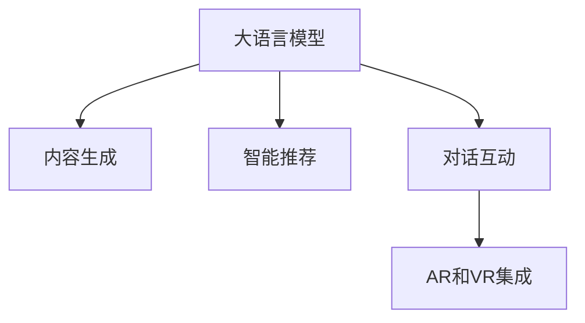

                 

# 在线娱乐与 LLM：互动、沉浸式的内容

## 1. 背景介绍

随着在线娱乐行业的快速发展，用户对互动、沉浸式内容的需求不断增长。在线娱乐平台不仅需要提供高品质的视频、音频内容，还希望能够通过智能推荐、游戏互动等方式，提升用户体验。大语言模型(Large Language Models, LLMs)以其强大的语言理解和生成能力，成为实现这一目标的重要技术手段。

### 1.1 问题由来

传统的在线娱乐内容通常以单向播放为主，缺乏用户互动性和沉浸感。但随着互联网和智能设备的发展，越来越多的用户希望能够通过互动方式获取个性化内容。例如，通过智能推荐系统推荐感兴趣的视频，通过游戏互动获得成就感等。

大语言模型（如GPT、BERT等）近年来在自然语言处理领域取得了巨大突破，能够生成高度逼真、逻辑连贯的文本内容。这些模型通过在大规模语料库上进行预训练，学习到了丰富的语言知识，具备了生成自然语言、理解用户意图、推导对话逻辑等能力。基于这些特性，大语言模型在在线娱乐领域的应用，尤其是互动和沉浸式内容生成方面，展现出了巨大潜力。

### 1.2 问题核心关键点

大语言模型在在线娱乐领域的应用，主要围绕以下几个关键点展开：

- **内容生成**：通过模型生成高质量文本内容，如剧情脚本、对话台词等，丰富在线娱乐形式。
- **智能推荐**：利用模型对用户偏好进行精准分析，推荐个性化的视频、游戏等内容，提升用户体验。
- **对话互动**：通过模型与用户进行智能对话，增强用户沉浸感和参与感。
- **增强现实(AR)和虚拟现实(VR)集成**：将大语言模型与AR、VR技术结合，创造沉浸式娱乐体验。

这些核心关键点构成了一个完整的在线娱乐生态系统，涉及内容创作、用户交互、场景设计等多个层面。

## 2. 核心概念与联系

### 2.1 核心概念概述

为更好地理解大语言模型在在线娱乐领域的应用，本节将介绍几个关键概念：

- **大语言模型(Large Language Models, LLMs)**：指通过在大规模语料库上进行预训练，学习到丰富语言知识的人工智能模型。大语言模型能够生成高度逼真、逻辑连贯的文本内容，具备强大的语言理解能力。

- **内容生成(Content Generation)**：通过模型自动生成高质量的文本内容，如剧情脚本、对话台词、视频解说等，为在线娱乐提供丰富的素材。

- **智能推荐(Recommendation Systems)**：利用模型对用户偏好进行精准分析，推荐个性化的视频、游戏等内容，提升用户体验。

- **对话互动(Chatbots)**：通过模型与用户进行智能对话，增强用户沉浸感和参与感。

- **增强现实(AR)和虚拟现实(VR)**：将大语言模型与AR、VR技术结合，创造沉浸式娱乐体验。

这些概念之间的逻辑关系可以通过以下Mermaid流程图来展示：



这个流程图展示了大语言模型在不同应用场景中的作用：

1. 大语言模型生成文本内容。
2. 通过智能推荐系统，根据用户偏好推荐个性化内容。
3. 模型进行智能对话，增强用户互动性。
4. 将模型与AR/VR技术结合，创造沉浸式体验。

## 3. 核心算法原理 & 具体操作步骤
### 3.1 算法原理概述

大语言模型在在线娱乐领域的应用主要依赖于其内容生成和智能推荐能力。以下将分别介绍这两个方面的算法原理。

#### 3.1.1 内容生成算法原理

内容生成算法的基本原理是通过大语言模型对用户需求进行理解，并自动生成符合需求的内容。具体流程如下：

1. **需求理解**：用户通过文字描述、语音输入等方式，表达自己的需求。模型对输入进行自然语言处理，提取关键信息。
2. **内容生成**：根据提取的信息，模型自动生成文本内容。例如，根据用户的描述，生成剧情脚本、对话台词、视频解说等。
3. **内容输出**：生成的内容进行格式化处理，并以适宜的形式输出，如文本、视频、音频等。

#### 3.1.2 智能推荐算法原理

智能推荐算法的基本原理是通过大语言模型对用户历史行为和偏好进行分析，预测其对未来内容的兴趣。具体流程如下：

1. **数据收集**：收集用户的历史行为数据，如观看记录、搜索历史、点赞评论等。
2. **特征提取**：使用大语言模型对数据进行特征提取，提取出用户兴趣点、观看偏好等关键信息。
3. **推荐模型训练**：利用提取的特征，训练推荐模型。模型可以根据用户当前状态，预测其对未来内容的兴趣。
4. **内容推荐**：根据模型的预测结果，推荐个性化的视频、游戏等内容。

### 3.2 算法步骤详解

#### 3.2.1 内容生成算法步骤

1. **数据收集与预处理**：收集用户的文字描述、语音输入等，进行分词、去除停用词等预处理。
2. **模型初始化**：选择合适的预训练模型（如GPT-3、BERT等）作为初始化参数。
3. **内容生成**：将预处理后的输入输入模型，模型自动生成文本内容。
4. **后处理与输出**：对生成内容进行后处理，如分句、标点符号添加等，并以适宜的形式输出。

#### 3.2.2 智能推荐算法步骤

1. **数据收集**：收集用户的历史行为数据，如观看记录、搜索历史、点赞评论等。
2. **特征提取**：使用大语言模型对数据进行特征提取，提取出用户兴趣点、观看偏好等关键信息。
3. **推荐模型训练**：利用提取的特征，训练推荐模型。模型可以根据用户当前状态，预测其对未来内容的兴趣。
4. **内容推荐**：根据模型的预测结果，推荐个性化的视频、游戏等内容。

### 3.3 算法优缺点

大语言模型在在线娱乐领域的应用，具有以下优点：

1. **生成内容丰富多样**：大语言模型能够生成高度逼真、逻辑连贯的文本内容，满足不同用户的多样化需求。
2. **智能推荐精准高效**：通过模型对用户兴趣进行分析，推荐个性化的内容，提升用户体验。
3. **用户互动性强**：模型能够进行智能对话，增强用户沉浸感和参与感。

同时，该方法也存在以下缺点：

1. **生成内容质量不稳定**：模型生成的内容可能存在逻辑错误、语义不通等问题。
2. **推荐算法复杂**：推荐系统需要处理大量用户行为数据，算法复杂度较高。
3. **资源消耗大**：大语言模型在生成和推荐过程中，需要占用大量计算资源和时间。

### 3.4 算法应用领域

大语言模型在在线娱乐领域的应用广泛，涵盖内容创作、用户交互、场景设计等多个层面。以下是几个典型应用领域：

1. **视频平台内容生成**：为视频平台生成剧情脚本、解说词、字幕等，丰富视频内容。
2. **游戏对话生成**：生成游戏角色对话、任务描述等，提升游戏互动性。
3. **智能客服**：通过模型与用户进行智能对话，解决用户问题，增强用户满意度。
4. **虚拟现实(VR)和增强现实(AR)内容创作**：生成虚拟场景中的对话、指引等，提升用户沉浸感。
5. **个性化推荐系统**：分析用户行为数据，推荐个性化视频、游戏等，提升用户体验。

## 4. 数学模型和公式 & 详细讲解 & 举例说明

### 4.1 数学模型构建

#### 4.1.1 内容生成数学模型

假设用户输入为 $X=\{x_1, x_2, \ldots, x_n\}$，其中 $x_i$ 为文本中的第 $i$ 个词。大语言模型 $M$ 根据输入 $X$ 生成文本内容 $Y=\{y_1, y_2, \ldots, y_m\}$，其中 $y_i$ 为生成的第 $i$ 个词。

内容生成的过程可以表示为：

$$
y_i = M(x_1, x_2, \ldots, x_n)
$$

其中 $M$ 为大语言模型，$f$ 为模型内部的生成函数。

#### 4.1.2 智能推荐数学模型

假设用户的历史行为数据为 $H=\{h_1, h_2, \ldots, h_n\}$，其中 $h_i$ 为第 $i$ 个行为。大语言模型 $M$ 根据用户历史行为数据 $H$ 生成推荐结果 $R=\{r_1, r_2, \ldots, r_m\}$，其中 $r_i$ 为用户对第 $i$ 个内容的兴趣度。

智能推荐的过程可以表示为：

$$
r_i = M(h_1, h_2, \ldots, h_n)
$$

其中 $M$ 为大语言模型，$g$ 为模型内部的推荐函数。

### 4.2 公式推导过程

#### 4.2.1 内容生成公式推导

在内容生成过程中，假设模型使用基于Transformer的编码-解码架构。输入 $X=\{x_1, x_2, \ldots, x_n\}$ 通过编码器 $E$ 转换为隐状态 $S=\{s_1, s_2, \ldots, s_n\}$，隐状态 $S$ 通过解码器 $D$ 生成文本内容 $Y=\{y_1, y_2, \ldots, y_m\}$。

解码器的输出概率分布为：

$$
P(y_i|y_{i-1}, y_{i-2}, \ldots, y_1, s_1, s_2, \ldots, s_n) = \frac{\exp(f(y_i|y_{i-1}, y_{i-2}, \ldots, y_1, s_1, s_2, \ldots, s_n))}{\sum_{y'_i \in \mathcal{Y}} \exp(f(y'_i|y_{i-1}, y_{i-2}, \ldots, y_1, s_1, s_2, \ldots, s_n))}
$$

其中 $f$ 为解码器内部的生成函数，$\mathcal{Y}$ 为词汇表。

#### 4.2.2 智能推荐公式推导

在智能推荐过程中，假设模型使用基于协同过滤的推荐算法。用户历史行为数据 $H=\{h_1, h_2, \ldots, h_n\}$ 转换为特征向量 $F=\{f_1, f_2, \ldots, f_n\}$，特征向量 $F$ 通过推荐函数 $g$ 生成推荐结果 $R=\{r_1, r_2, \ldots, r_m\}$。

推荐函数的输出概率分布为：

$$
P(r_i|f_1, f_2, \ldots, f_n) = \frac{\exp(g(r_i|f_1, f_2, \ldots, f_n))}{\sum_{r'_i \in \mathcal{R}} \exp(g(r'_i|f_1, f_2, \ldots, f_n))}
$$

其中 $g$ 为推荐函数，$\mathcal{R}$ 为推荐结果集。

### 4.3 案例分析与讲解

#### 4.3.1 视频平台内容生成案例

假设视频平台需要为一段新的剧情视频生成解说词。用户输入为剧情大纲：“两个孩子误入森林，遇到了一只神秘的生物。”

1. **数据收集与预处理**：收集用户输入，进行分词、去除停用词等预处理。
2. **模型初始化**：使用GPT-3作为初始化参数。
3. **内容生成**：将预处理后的输入输入模型，生成解说词：“在这个充满未知的森林里，两个孩子遇到了一只神秘的生物。它有着闪闪发光的眼睛，身上散发着奇异的能量……”
4. **后处理与输出**：对生成内容进行后处理，如分句、标点符号添加等，并以适宜的形式输出。

#### 4.3.2 游戏对话生成案例

假设游戏开发团队需要为一款冒险类游戏生成角色对话。用户输入为角色背景：“探险者小明，机智勇敢，擅长解谜。”

1. **数据收集与预处理**：收集用户输入，进行分词、去除停用词等预处理。
2. **模型初始化**：使用GPT-3作为初始化参数。
3. **内容生成**：将预处理后的输入输入模型，生成对话：“小明：这个迷宫好难，我怎么才能找到出路？”
4. **后处理与输出**：对生成内容进行后处理，如分句、标点符号添加等，并以适宜的形式输出。

## 5. 项目实践：代码实例和详细解释说明
### 5.1 开发环境搭建

在进行大语言模型应用实践前，我们需要准备好开发环境。以下是使用Python进行OpenAI GPT-3开发的环境配置流程：

1. **安装OpenAI Python SDK**：从OpenAI官网下载并安装OpenAI Python SDK，用于调用GPT-3 API。
2. **创建OpenAI账户**：访问OpenAI官网，创建账户并获取API密钥。
3. **配置环境变量**：将OpenAI API密钥添加到系统环境变量中。
4. **安装相关依赖**：安装numpy、pandas等Python库，用于数据处理和分析。

完成上述步骤后，即可在本地开发环境中开始大语言模型应用的实践。

### 5.2 源代码详细实现

下面我们以视频平台内容生成为例，给出使用OpenAI GPT-3进行视频解说词生成的PyTorch代码实现。

```python
from openai import OpenAI

openai.api_key = 'YOUR_API_KEY'

def generate_text(prompt, max_tokens=50):
    response = openai.Completion.create(
        engine="text-davinci-003",
        prompt=prompt,
        max_tokens=max_tokens
    )
    return response.choices[0].text

# 视频内容大纲
plot大纲 = "两个孩子误入森林，遇到了一只神秘的生物。"

# 生成解说词
summary = generate_text(plot大纲)
print(summary)
```

在这个代码示例中，我们使用OpenAI的GPT-3 API，通过调用`Completion.create`函数生成视频解说她。用户输入为视频内容大纲，输出为生成好的解说词。

### 5.3 代码解读与分析

让我们再详细解读一下关键代码的实现细节：

**openai库**：
- `OpenAI`类：用于访问OpenAI API，并调用各种API接口。
- `Completion.create`函数：用于生成文本内容。

**generate_text函数**：
- `prompt`参数：用户输入的视频内容大纲。
- `max_tokens`参数：限制生成内容的长度，避免过长。

**调用GPT-3 API**：
- 设置OpenAI API密钥。
- 调用`Completion.create`函数，指定引擎、提示和生成长度。
- 获取API响应，并返回生成内容的文本部分。

**视频内容大纲**：
- `plot大纲`：用户输入的视频内容大纲。

**生成解说词**：
- `generate_text`函数调用`Completion.create`函数，生成视频解说她。
- `print(summary)`：打印生成的解说词。

可以看到，使用OpenAI的GPT-3 API，可以快速实现视频平台内容生成任务。OpenAI提供了强大的预训练模型和便捷的API接口，使得大语言模型在在线娱乐领域的应用变得简单易行。

## 6. 实际应用场景
### 6.1 视频平台内容生成

视频平台可以利用大语言模型生成视频解说我、字幕、推荐文案等，丰富视频内容。具体应用场景如下：

1. **视频解说我**：为视频生成引人入胜的解说我，提升用户观影体验。
2. **字幕生成**：为视频自动生成中英文字幕，方便不同语言用户观看。
3. **推荐文案**：根据视频内容生成推荐文案，吸引用户点击观看。

### 6.2 游戏对话生成

游戏开发团队可以利用大语言模型生成游戏对话、任务描述、指引等，提升游戏互动性。具体应用场景如下：

1. **游戏对话**：生成角色对话，增强游戏互动性。
2. **任务描述**：生成任务描述，指引玩家完成游戏任务。
3. **指引生成**：生成游戏指引，帮助玩家解决难题。

### 6.3 智能客服

视频平台可以利用大语言模型构建智能客服系统，自动回答用户问题，提升用户体验。具体应用场景如下：

1. **常见问题解答**：自动回答用户常见问题，如视频播放、账户注册等。
2. **个性化推荐**：根据用户行为推荐个性化视频内容。
3. **情感分析**：分析用户情绪，及时调整客服策略。

### 6.4 虚拟现实(VR)和增强现实(AR)内容创作

虚拟现实和增强现实技术的发展，使得用户可以沉浸式体验视频、游戏等内容。大语言模型可以生成虚拟场景中的对话、指引等，提升用户沉浸感。具体应用场景如下：

1. **虚拟场景对话**：生成虚拟场景中的角色对话，增强用户沉浸感。
2. **指引生成**：生成虚拟场景中的指引，帮助用户完成虚拟任务。
3. **内容生成**：生成虚拟场景中的内容，丰富用户体验。

## 7. 工具和资源推荐
### 7.1 学习资源推荐

为了帮助开发者系统掌握大语言模型在在线娱乐领域的应用，这里推荐一些优质的学习资源：

1. **《深度学习与自然语言处理》书籍**：介绍深度学习和大语言模型的基础知识，涵盖在线娱乐领域的典型应用。
2. **OpenAI GPT-3官方文档**：提供GPT-3 API的使用指南，详细介绍了大语言模型在在线娱乐中的应用。
3. **《自然语言处理实战》书籍**：包含大语言模型在视频平台、游戏、智能客服等领域的实战案例。
4. **Coursera《深度学习自然语言处理》课程**：斯坦福大学开设的NLP明星课程，有Lecture视频和配套作业，适合入门NLP领域的基本概念和经典模型。
5. **Kaggle《自然语言处理》竞赛**：通过参与Kaggle竞赛，积累实战经验，提升模型应用能力。

通过对这些资源的学习实践，相信你一定能够快速掌握大语言模型在在线娱乐领域的应用技巧，并用于解决实际的NLP问题。

### 7.2 开发工具推荐

高效的开发离不开优秀的工具支持。以下是几款用于大语言模型在在线娱乐领域应用开发的常用工具：

1. **Jupyter Notebook**：轻量级的交互式开发环境，支持Python代码的调试和测试。
2. **PyTorch**：基于Python的开源深度学习框架，灵活动态的计算图，适合快速迭代研究。
3. **TensorFlow**：由Google主导开发的开源深度学习框架，生产部署方便，适合大规模工程应用。
4. **OpenAI GPT-3 API**：提供大语言模型API接口，方便开发者调用模型进行内容生成、智能推荐等。
5. **GPT-3的预训练模型**：使用OpenAI预训练模型，可以减少模型训练的计算资源消耗。

合理利用这些工具，可以显著提升大语言模型在在线娱乐领域应用开发的效率，加快创新迭代的步伐。

### 7.3 相关论文推荐

大语言模型在在线娱乐领域的应用得益于学界的持续研究。以下是几篇奠基性的相关论文，推荐阅读：

1. **"GPT-3: Language Models are Unsupervised Multitask Learners"**：OpenAI的GPT-3论文，展示了大语言模型的零样本学习能力。
2. **"Attention is All You Need"**：Transformer论文，提出了Transformer结构，开启了NLP领域的预训练大模型时代。
3. **"BERT: Pre-training of Deep Bidirectional Transformers for Language Understanding"**：BERT论文，提出BERT模型，引入基于掩码的自监督预训练任务。
4. **"AlphaGo Zero"**：AlphaGo Zero论文，展示了增强学习在智能游戏中的应用。
5. **"Playing Atari with a Human-level Model of Visual Perception and Attention"**：AlphaStar论文，展示了增强学习在实时策略游戏中的应用。

这些论文代表了大语言模型在在线娱乐领域的研究进展，通过学习这些前沿成果，可以帮助研究者把握学科前进方向，激发更多的创新灵感。

## 8. 总结：未来发展趋势与挑战

### 8.1 总结

本文对大语言模型在在线娱乐领域的应用进行了全面系统的介绍。首先阐述了大语言模型和内容生成、智能推荐等核心概念，明确了在线娱乐领域的核心任务。其次，从原理到实践，详细讲解了大语言模型在内容生成、智能推荐等任务的算法原理和具体操作步骤，给出了微调模型生成视频解说词的完整代码实现。同时，本文还广泛探讨了模型在视频平台、游戏、智能客服等多个领域的应用场景，展示了模型在在线娱乐领域的广阔前景。

通过本文的系统梳理，可以看到，大语言模型在在线娱乐领域的应用潜力巨大，能够生成丰富的内容，提供精准的推荐，增强用户互动性，提升用户体验。未来，伴随大语言模型和微调方法的持续演进，在线娱乐系统必将在内容创作、用户交互、场景设计等方面获得更大突破，为用户提供更加智能、互动、沉浸的娱乐体验。

### 8.2 未来发展趋势

展望未来，大语言模型在在线娱乐领域的应用将呈现以下几个发展趋势：

1. **内容生成多样化**：大语言模型能够生成更加多样化的内容，如剧情脚本、对话台词、推荐文案等，满足用户多样化需求。
2. **智能推荐精准化**：利用模型对用户兴趣进行精准分析，推荐个性化的视频、游戏等内容，提升用户体验。
3. **用户互动增强**：模型能够进行智能对话，增强用户沉浸感和参与感。
4. **AR/VR技术集成**：将大语言模型与AR/VR技术结合，创造沉浸式娱乐体验。
5. **多模态内容创作**：生成多模态内容，如视频、音频、图像等，增强用户沉浸感。

以上趋势凸显了大语言模型在在线娱乐领域的广泛应用前景，这些方向的探索发展，必将进一步提升在线娱乐系统的性能和用户体验，为用户带来更加智能、互动、沉浸的娱乐体验。

### 8.3 面临的挑战

尽管大语言模型在在线娱乐领域的应用已经取得了显著成果，但在迈向更加智能化、普适化应用的过程中，仍面临诸多挑战：

1. **内容质量不稳定**：模型生成的内容可能存在逻辑错误、语义不通等问题，需要进一步优化模型。
2. **推荐算法复杂**：推荐系统需要处理大量用户行为数据，算法复杂度较高，需要进一步优化推荐算法。
3. **资源消耗大**：大语言模型在生成和推荐过程中，需要占用大量计算资源和时间，需要进一步优化模型和算法。
4. **模型偏见和有害信息**：模型可能会学习到有偏见、有害的信息，需要通过数据和算法层面消除模型偏见，避免恶意用途。
5. **模型可解释性不足**：大语言模型通常是一个"黑盒"系统，难以解释其内部工作机制和决策逻辑，需要进一步提升模型的可解释性。

正视这些挑战，积极应对并寻求突破，将是大语言模型在在线娱乐领域走向成熟的必由之路。相信随着学界和产业界的共同努力，这些挑战终将一一被克服，大语言模型必将在构建人机协同的智能娱乐系统中扮演越来越重要的角色。

### 8.4 研究展望

面对大语言模型在在线娱乐领域所面临的挑战，未来的研究需要在以下几个方面寻求新的突破：

1. **生成内容质量优化**：进一步优化大语言模型，提升生成内容的逻辑连贯性和语言质量。
2. **推荐算法优化**：采用更多高效的推荐算法，如基于协同过滤、深度学习等，提升推荐系统的精准度。
3. **资源消耗优化**：通过模型压缩、稀疏化存储等技术，优化大语言模型的计算资源消耗。
4. **模型偏见消除**：通过数据预处理、算法优化等手段，消除模型中的偏见和有害信息，确保输出符合人类价值观和伦理道德。
5. **模型可解释性增强**：引入因果分析、博弈论等工具，提升模型的可解释性和可审计性，确保用户对模型输出的信任。

这些研究方向的探索，必将引领大语言模型在在线娱乐领域的应用迈向更高的台阶，为构建安全、可靠、可解释、可控的智能娱乐系统铺平道路。面向未来，大语言模型与人工智能技术进行更深入的融合，多路径协同发力，共同推动在线娱乐系统的进步。只有勇于创新、敢于突破，才能不断拓展在线娱乐领域的边界，让智能技术更好地造福人类社会。

## 9. 附录：常见问题与解答

**Q1：大语言模型在在线娱乐领域的应用有哪些优势？**

A: 大语言模型在在线娱乐领域的应用具有以下优势：

1. **内容生成丰富多样**：大语言模型能够生成高质量的文本内容，满足不同用户的多样化需求。
2. **智能推荐精准高效**：通过模型对用户兴趣进行精准分析，推荐个性化的内容，提升用户体验。
3. **用户互动性强**：模型能够进行智能对话，增强用户沉浸感和参与感。
4. **资源利用率高**：模型生成内容高效，资源消耗相对较低，适合在线娱乐系统的部署。

**Q2：如何优化大语言模型在在线娱乐领域的应用？**

A: 优化大语言模型在在线娱乐领域的应用可以从以下几个方面进行：

1. **数据预处理**：进行数据清洗、标注等预处理，提升模型输入数据的质量。
2. **模型优化**：通过微调、迁移学习等技术，优化模型生成内容的质量。
3. **推荐算法优化**：采用高效的推荐算法，提升推荐系统的精准度。
4. **资源优化**：通过模型压缩、稀疏化存储等技术，优化模型的计算资源消耗。
5. **伦理安全**：通过数据去偏、模型审核等手段，消除模型中的偏见和有害信息，确保输出符合人类价值观和伦理道德。

**Q3：大语言模型在在线娱乐领域的应用是否存在局限性？**

A: 大语言模型在在线娱乐领域的应用也存在一些局限性：

1. **生成内容质量不稳定**：模型生成的内容可能存在逻辑错误、语义不通等问题，需要进一步优化模型。
2. **推荐算法复杂**：推荐系统需要处理大量用户行为数据，算法复杂度较高，需要进一步优化推荐算法。
3. **资源消耗大**：大语言模型在生成和推荐过程中，需要占用大量计算资源和时间，需要进一步优化模型和算法。
4. **模型偏见和有害信息**：模型可能会学习到有偏见、有害的信息，需要通过数据和算法层面消除模型偏见，避免恶意用途。
5. **模型可解释性不足**：大语言模型通常是一个"黑盒"系统，难以解释其内部工作机制和决策逻辑，需要进一步提升模型的可解释性。

**Q4：大语言模型在在线娱乐领域的应用前景如何？**

A: 大语言模型在在线娱乐领域的应用前景广阔：

1. **内容生成多样化**：大语言模型能够生成更加多样化的内容，如剧情脚本、对话台词、推荐文案等，满足用户多样化需求。
2. **智能推荐精准化**：利用模型对用户兴趣进行精准分析，推荐个性化的视频、游戏等内容，提升用户体验。
3. **用户互动增强**：模型能够进行智能对话，增强用户沉浸感和参与感。
4. **AR/VR技术集成**：将大语言模型与AR/VR技术结合，创造沉浸式娱乐体验。
5. **多模态内容创作**：生成多模态内容，如视频、音频、图像等，增强用户沉浸感。

综上所述，大语言模型在在线娱乐领域的应用前景广阔，能够为用户带来更加智能、互动、沉浸的娱乐体验。

**Q5：大语言模型在在线娱乐领域的应用是否需要大量标注数据？**

A: 大语言模型在在线娱乐领域的应用需要大量的标注数据，尤其是在智能推荐、视频平台内容生成等任务中。标注数据的质量和数量直接影响模型的性能。然而，在实际应用中，标注数据的获取往往需要耗费大量人力和时间成本，因此如何降低标注数据的需求，是未来研究的一个重要方向。

**Q6：大语言模型在在线娱乐领域的应用是否需要计算资源？**

A: 大语言模型在在线娱乐领域的应用需要大量的计算资源，尤其是在模型训练和生成内容的过程中。因此，如何优化模型的计算资源消耗，提升模型推理速度，是未来研究的一个重要方向。

---

作者：禅与计算机程序设计艺术 / Zen and the Art of Computer Programming

