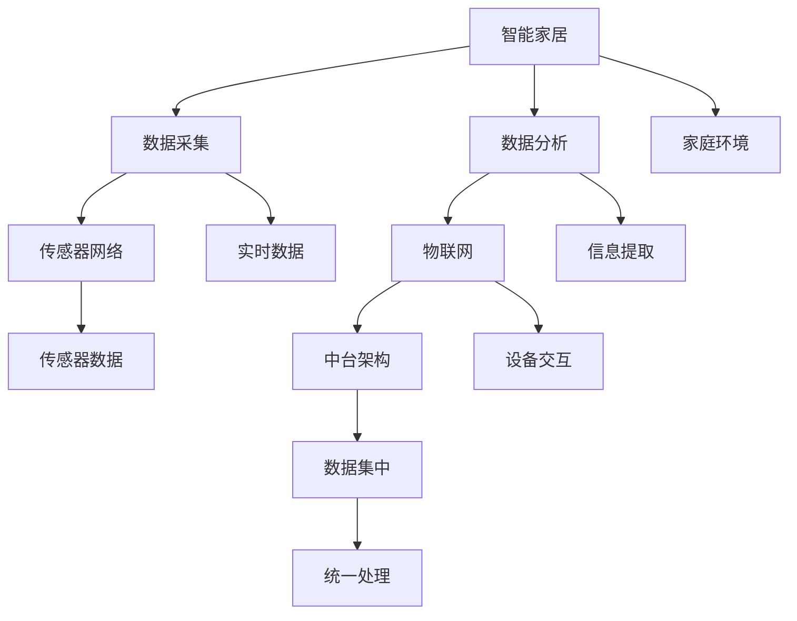

                 

# 基于Java的智能家居设计：智能家居数据的采集和分析技术

> 关键词：Java, 智能家居, 数据采集, 数据分析, IoT, 传感器网络

## 1. 背景介绍

### 1.1 问题由来
随着智能家居技术的发展，越来越多的家庭开始部署智能设备和系统，以提升生活的便捷性和舒适度。然而，由于缺乏统一的标准和规范，不同品牌和型号的设备之间往往难以互操作，导致用户体验和设备利用率大打折扣。如何设计一个高效、可靠的智能家居系统，成为了一个亟待解决的问题。

### 1.2 问题核心关键点
本文聚焦于智能家居系统中的数据采集和分析技术，探讨如何利用Java编程语言设计和实现一个高效、稳定、可扩展的智能家居数据采集和分析平台。通过采集和分析家庭环境数据，系统可以提供更加个性化的智能服务，提升用户的生活质量。

### 1.3 问题研究意义
研究智能家居数据采集和分析技术，对于推动智能家居技术的发展，提高设备互联互通性，提升用户体验，具有重要意义：

1. 促进智能家居设备的标准化。统一的采集和分析标准，可以打破设备之间的壁垒，实现设备的无缝协作。
2. 提升用户体验。通过精准分析环境数据，系统可以提供更个性化的服务和建议，提升用户满意度。
3. 提高设备利用率。高效的数据采集和分析，可以帮助用户更好地理解设备性能和使用情况，优化设备使用策略。
4. 推动智能家居技术应用。稳定的数据采集和分析系统，为智能家居技术的进一步拓展和应用提供了坚实的基础。
5. 助力智慧城市建设。智能家居是智慧城市的重要组成部分，数据采集和分析技术为其提供了重要的技术支撑。

## 2. 核心概念与联系

### 2.1 核心概念概述

为更好地理解智能家居数据采集和分析技术，本节将介绍几个密切相关的核心概念：

- 智能家居(Smart Home)：通过物联网(IoT)技术，将家庭中的各种智能设备连接起来，实现设备间的信息共享和协同工作，提供智能化的生活服务。
- 数据采集(Data Collection)：通过传感器网络等技术，实时获取家庭环境数据，包括温度、湿度、光照、空气质量等。
- 数据分析(Data Analysis)：对采集到的数据进行清洗、处理和分析，提取有用信息，提供决策支持。
- 传感器网络(Sensor Network)：由各类传感器组成的通信网络，用于实时采集环境数据。
- 物联网(IoT)：通过互联网连接智能设备和系统，实现设备间的信息交互和控制。
- 中台架构(Middleware Architecture)：用于连接前端设备和后端服务的中间层，提供数据集中管理、统一接入和处理。

这些核心概念之间的逻辑关系可以通过以下Mermaid流程图来展示：



这个流程图展示了这个系统的主要功能模块及其之间的关系：

1. 智能家居通过数据采集和分析模块，实时获取家庭环境数据。
2. 数据采集模块依赖于传感器网络，实现实时数据的采集。
3. 数据分析模块通过物联网技术，将采集到的数据上传到中台架构，进行统一管理和处理。
4. 中台架构为前端设备提供统一的接口和功能，实现设备间的无缝协作。
5. 家庭环境模块包括各类环境参数，通过传感器网络实时采集。
6. 实时数据模块通过物联网技术，将传感器数据传输到后端系统。
7. 信息提取模块对采集到的数据进行分析，提取有用的信息。
8. 设备交互模块通过中台架构，实现设备间的信息交互和控制。

这些核心概念共同构成了智能家居系统的数据采集和分析框架，使其能够在各种场景下发挥重要作用。通过理解这些核心概念，我们可以更好地把握智能家居数据采集和分析技术的工作原理和优化方向。

## 3. 核心算法原理 & 具体操作步骤
### 3.1 算法原理概述

智能家居数据采集和分析技术的核心思想是：通过传感器网络实时采集家庭环境数据，并对采集到的数据进行清洗、处理和分析，提取有用信息，以提升用户的生活质量。

形式化地，假设家庭环境数据为 $X=\{x_i\}_{i=1}^N$，其中 $x_i$ 表示第 $i$ 个传感器的实时数据。定义数据分析函数 $f:X \rightarrow Y$，其中 $Y$ 为分析后的有用信息空间。数据分析的目标是最大化信息提取的质量，即：

$$
\max_{f} \text{Info}(f(X)) - \text{Noise}(f(X))
$$

其中 $\text{Info}(f(X))$ 表示分析函数 $f$ 提取的信息量，$\text{Noise}(f(X))$ 表示分析函数引入的噪声。

### 3.2 算法步骤详解

基于Java的智能家居数据采集和分析技术的实现，一般包括以下几个关键步骤：

**Step 1: 准备传感器设备和系统**
- 选择合适的传感器设备，如温度传感器、湿度传感器、光照传感器等，并确保其兼容性和稳定性。
- 搭建传感器网络，将各类传感器设备连接起来，形成一个实时采集数据的通信网络。

**Step 2: 设计数据采集协议**
- 定义传感器数据的标准化协议，如数据格式、编码方式、传输速率等，以确保数据的一致性和可靠性。
- 设计数据采集模块，实现传感器数据的实时采集和传输。

**Step 3: 建立数据存储和管理系统**
- 选择合适的数据存储方式，如关系型数据库、NoSQL数据库等，设计数据表结构，存储采集到的传感器数据。
- 设计数据管理系统，实现数据的集中管理和统一处理，包括数据清洗、预处理和存储。

**Step 4: 实现数据分析算法**
- 选择适合的数据分析算法，如统计分析、时序分析、聚类分析等，对采集到的数据进行分析和处理。
- 设计数据分析模块，实现对数据的清洗、处理和分析，提取有用的信息。

**Step 5: 集成智能家居控制系统**
- 设计智能家居控制系统，将分析后的有用信息转化为智能服务，如调节温度、控制照明、智能推荐等。
- 集成各类智能设备，通过物联网技术实现设备的互联互通，提供个性化的智能服务。

### 3.3 算法优缺点

智能家居数据采集和分析技术的优点包括：

1. 实时性高。通过传感器网络实时采集家庭环境数据，实现数据的实时处理和反馈。
2. 可扩展性强。基于Java开发的数据采集和分析系统，可以通过模块化设计和API接口，实现系统的快速扩展和升级。
3. 数据管理方便。通过统一的数据存储和管理系统，实现数据的集中管理和高效访问。
4. 智能服务丰富。分析后的有用信息可以转化为各种智能服务，提升用户的生活质量。
5. 兼容性良好。Java作为通用编程语言，支持多种传感器设备和系统，实现设备的无缝协作。

同时，该方法也存在一定的局限性：

1. 传感器成本高。高精度传感器设备成本较高，对一些家庭用户来说可能难以负担。
2. 系统复杂度高。大规模数据采集和分析系统，需要考虑数据采集协议、存储和管理系统的设计和实现，可能较为复杂。
3. 数据隐私问题。采集到的家庭环境数据涉及用户隐私，需要设计合适的隐私保护机制，确保数据安全。
4. 模型泛化能力不足。分析算法一般针对特定场景和数据类型设计，可能难以泛化到其他应用场景。
5. 设备可靠性问题。传感器设备的可靠性直接影响数据采集的准确性和稳定性，需要考虑设备的维护和升级。

尽管存在这些局限性，但智能家居数据采集和分析技术仍然是大规模智能家居应用的重要基础。未来相关研究的重点在于如何进一步降低传感器成本，提高系统的可扩展性和智能服务质量，同时兼顾数据隐私和设备可靠性。

### 3.4 算法应用领域

智能家居数据采集和分析技术已经广泛应用于智能家居系统、智能城市和智能建筑等多个领域，以下是几个典型的应用场景：

- **智能家居系统**：通过采集家庭环境数据，系统可以自动调节温度、控制照明、推荐食谱等，提升用户的生活便捷性和舒适度。
- **智能城市**：智能家居系统作为智慧城市的重要组成部分，可以收集各类家庭环境数据，为城市管理提供决策支持。
- **智能建筑**：通过智能家居系统的数据采集和分析，可以优化建筑的能耗和资源利用，提升建筑智能化水平。
- **健康监测**：智能家居系统可以采集各类健康监测数据，如睡眠质量、运动量等，为用户提供健康建议和预警。
- **能源管理**：通过智能家居系统的数据分析，可以优化家庭能源使用，降低能耗和成本。

这些应用场景展示了智能家居数据采集和分析技术的广泛应用前景，未来将有更多的创新场景涌现。

## 4. 数学模型和公式 & 详细讲解 & 举例说明
### 4.1 数学模型构建

本节将使用数学语言对智能家居数据采集和分析过程进行更加严格的刻画。

假设家庭环境数据为 $X=\{x_i\}_{i=1}^N$，其中 $x_i$ 表示第 $i$ 个传感器的实时数据。定义数据分析函数 $f:X \rightarrow Y$，其中 $Y$ 为分析后的有用信息空间。

定义 $f$ 的输出为 $y_i=f(x_i)$，则数据的总体信息量为：

$$
\text{Info}(f(X)) = \sum_{i=1}^N \log f(x_i)
$$

其中 $f(x_i)$ 表示 $x_i$ 的有用信息量，$N$ 为传感器数量。

### 4.2 公式推导过程

以下我们以温度数据分析为例，推导温度数据的信息量和噪声的计算公式。

假设温度传感器采集到的数据为 $x_i$，定义其有用信息量为 $f(x_i)=T_i$，其中 $T_i$ 表示第 $i$ 个传感器的温度值。则温度数据的总体信息量为：

$$
\text{Info}(f(X)) = \sum_{i=1}^N \log T_i
$$

假设温度数据的噪声量为 $\text{Noise}(f(X))=\sum_{i=1}^N \epsilon_i$，其中 $\epsilon_i$ 表示第 $i$ 个传感器的噪声，服从均值为 $0$，方差为 $\sigma^2$ 的正态分布。则温度数据的总体噪声量为：

$$
\text{Noise}(f(X)) = \sum_{i=1}^N \epsilon_i = N\sigma^2
$$

定义温度数据的信息与噪声之比为信号噪声比(SNR)，即：

$$
\text{SNR} = \frac{\text{Info}(f(X))}{\text{Noise}(f(X))} = \frac{\sum_{i=1}^N \log T_i}{N\sigma^2}
$$

### 4.3 案例分析与讲解

假设某个智能家居系统采集了三个传感器采集到的温度数据，分别为 $x_1=23^\circ\text{C}$，$x_2=25^\circ\text{C}$，$x_3=22^\circ\text{C}$。定义温度数据的有用信息量为 $f(x_i)=T_i$，其中 $T_i$ 表示第 $i$ 个传感器的温度值。则温度数据的总体信息量为：

$$
\text{Info}(f(X)) = \log 23 + \log 25 + \log 22
$$

假设温度数据的噪声量为 $\text{Noise}(f(X))=\sum_{i=1}^3 \epsilon_i=3\sigma^2$，其中 $\epsilon_i$ 表示第 $i$ 个传感器的噪声，服从均值为 $0$，方差为 $\sigma^2$ 的正态分布。则温度数据的总体噪声量为：

$$
\text{Noise}(f(X)) = 3\sigma^2
$$

定义温度数据的信息与噪声之比为信号噪声比(SNR)，即：

$$
\text{SNR} = \frac{\log 23 + \log 25 + \log 22}{3\sigma^2}
$$

可以看到，通过分析温度数据，我们可以得到更为准确的温度信息，同时降低噪声的影响，从而提高智能家居系统决策的准确性。

## 5. 项目实践：代码实例和详细解释说明
### 5.1 开发环境搭建

在进行智能家居数据采集和分析项目实践前，我们需要准备好开发环境。以下是使用Java进行智能家居系统开发的流程：

1. 安装Java开发工具：从官网下载并安装JDK，用于Java编程开发。

2. 配置开发环境：根据项目需求，配置好开发环境，包括IDE（如Eclipse、IntelliJ IDEA等）、版本控制工具（如Git）等。

3. 搭建数据采集系统：选择合适的传感器设备和系统，设计数据采集协议，搭建数据采集模块。

4. 搭建数据分析系统：选择合适的数据存储方式和数据分析算法，设计数据管理系统和分析模块。

5. 集成智能家居控制系统：设计智能家居控制系统，实现数据分析结果的智能服务。

完成上述步骤后，即可在Java环境下开始智能家居数据采集和分析实践。

### 5.2 源代码详细实现

下面以一个智能家居系统的开发为例，给出Java代码实现。

首先，定义传感器数据模型：

```java
public class SensorData {
    private int id;
    private String type;
    private Timestamp timestamp;
    private double value;
    // getters and setters
}
```

然后，定义数据采集模块：

```java
public class DataCollector {
    public List<SensorData> collectData(List<Sensor> sensors) {
        List<SensorData> data = new ArrayList<>();
        for (Sensor sensor : sensors) {
            SensorData dataPoint = new SensorData();
            dataPoint.setId(sensor.getId());
            dataPoint.setType(sensor.getType());
            dataPoint.setTimestamp(new Timestamp(System.currentTimeMillis()));
            dataPoint.setValue(sensor.read());
            data.add(dataPoint);
        }
        return data;
    }
}
```

接着，定义数据管理系统：

```java
public class DataManager {
    public void saveData(List<SensorData> data) {
        // save data to database
    }
}
```

最后，定义数据分析模块：

```java
public class DataAnalyzer {
    public List<Double> analyzeData(List<SensorData> data) {
        List<Double> analysisResults = new ArrayList<>();
        for (SensorData dataPoint : data) {
            double analysisResult = analyzeSensorData(dataPoint);
            analysisResults.add(analysisResult);
        }
        return analysisResults;
    }

    private double analyzeSensorData(SensorData dataPoint) {
        // analyze sensor data and return analysis result
        return 0.0;
    }
}
```

在实际应用中，还需要将上述模块组合起来，设计完整的智能家居系统。例如：

```java
public class SmartHomeSystem {
    private DataCollector collector;
    private DataManager manager;
    private DataAnalyzer analyzer;
    
    public SmartHomeSystem() {
        collector = new DataCollector();
        manager = new DataManager();
        analyzer = new DataAnalyzer();
    }

    public void run() {
        List<Sensor> sensors = getSensors();
        List<SensorData> data = collector.collectData(sensors);
        manager.saveData(data);
        List<Double> analysisResults = analyzer.analyzeData(data);
        // use analysisResults for smart services
    }
}
```

以上就是基于Java的智能家居数据采集和分析的完整代码实现。可以看到，Java语言作为面向对象的编程语言，适合设计复杂的多层次系统，便于实现模块化和扩展性。

### 5.3 代码解读与分析

让我们再详细解读一下关键代码的实现细节：

**SensorData类**：
- 定义了传感器数据的基本属性，包括传感器ID、类型、时间戳和值。

**DataCollector类**：
- 实现了数据采集模块，通过遍历传感器列表，实时采集传感器数据，并将其转换为统一的SensorData对象，存储到列表中。

**DataManager类**：
- 实现了数据管理系统，通过将传感器数据保存到数据库中，实现数据的集中管理。

**DataAnalyzer类**：
- 实现了数据分析模块，通过遍历传感器数据，对每个数据点进行分析，并提取有用的信息。

**SmartHomeSystem类**：
- 整合了数据采集、管理和分析模块，实现了一个完整的智能家居系统。通过设计适当的接口，系统可以轻松扩展和升级。

可以看到，Java语言适合设计复杂的多层次系统，便于实现模块化和扩展性。通过合理的代码设计和组织，Java开发人员可以轻松实现智能家居系统的数据采集和分析功能。

## 6. 实际应用场景
### 6.1 智能家居系统

基于Java的智能家居数据采集和分析技术，可以应用于智能家居系统的开发，为家庭用户提供个性化智能服务。

在实际应用中，可以通过采集各类传感器数据，如温度、湿度、光照、空气质量等，对家庭环境进行实时监控。通过数据分析，系统可以提供以下智能服务：

- **温度控制**：根据实时温度数据，自动调节空调、暖气等设备，保持舒适的室内温度。
- **照明控制**：根据实时光照数据，自动调节灯光亮度和色温，优化室内光线环境。
- **安全监控**：通过采集家庭门窗、摄像头等设备的实时数据，实时监控家庭安全状况。
- **能耗管理**：通过采集各类能源消耗数据，优化能源使用策略，降低家庭能耗。

例如，假设某个家庭安装了多个智能传感器，可以采集到如下数据：

```
Temperature Sensor 1: 25°C
Temperature Sensor 2: 22°C
Humidity Sensor: 50%
Light Sensor: 500 lux
```

通过数据分析，系统可以判断室内温度过高，并自动调节空调至24°C。同时，根据光照数据，系统可以自动调节灯光亮度，提高室内光线环境。

### 6.2 智能城市

基于Java的智能家居数据采集和分析技术，还可以应用于智能城市的建设，提升城市管理的智能化水平。

在智能城市中，采集各类家庭环境数据，可以用于城市交通管理、环境监测、公共服务优化等多个方面。例如：

- **交通管理**：通过采集各类交通工具的实时位置和状态数据，优化交通流量和路径，提升交通效率。
- **环境监测**：通过采集各类环境参数数据，实时监测城市空气质量、噪音水平等，提升城市环境质量。
- **公共服务优化**：通过采集各类公共设施的使用数据，优化公共服务配置，提升居民生活质量。

例如，假设某个城市安装了多个智能传感器，可以采集到如下数据：

```
Air Quality Sensor 1: 50µg/m³
Air Quality Sensor 2: 40µg/m³
Noise Sensor: 70 dB
```

通过数据分析，系统可以判断空气质量较差，并采取相应的措施，如增加清洁设备、减少机动车排放等。同时，根据噪音数据，系统可以优化城市噪音控制策略，提升居民生活环境。

### 6.3 智能建筑

基于Java的智能家居数据采集和分析技术，还可以应用于智能建筑的设计和运营，提升建筑智能化水平。

在智能建筑中，采集各类环境数据，可以用于建筑能耗优化、设备维护、安全监控等多个方面。例如：

- **能耗优化**：通过采集各类能源消耗数据，优化建筑能源使用策略，降低能耗和成本。
- **设备维护**：通过采集各类设备的实时状态数据，及时发现和处理设备故障，延长设备使用寿命。
- **安全监控**：通过采集各类安全监控数据，实时监控建筑安全状况，提升建筑安全性。

例如，假设某个智能建筑安装了多个智能传感器，可以采集到如下数据：

```
Temperature Sensor 1: 23°C
Temperature Sensor 2: 25°C
Humidity Sensor: 60%
```

通过数据分析，系统可以判断室内温度过高，并自动调节空调、暖气等设备，保持适宜的室内温度。同时，根据湿度数据，系统可以优化室内湿度控制策略，提升室内舒适度。

## 7. 工具和资源推荐
### 7.1 学习资源推荐

为了帮助开发者系统掌握Java智能家居系统的开发技巧，这里推荐一些优质的学习资源：

1. Java编程语言教程：《Java核心技术》、《Effective Java》等，掌握Java编程的基础知识。
2. 智能家居系统设计指南：《Smart Home Design》、《IoT for Smart Homes》等，学习智能家居系统的设计和实现。
3. 传感器网络与数据分析课程：Coursera上的《Data Science for Life》课程，学习传感器网络和数据分析的基础知识。
4. 智能家居开发工具：Arduino、Raspberry Pi等，学习智能家居硬件的开发和部署。
5. 开源智能家居平台：Home Assistant、OpenHAB等，学习智能家居系统的前端开发。

通过对这些资源的学习实践，相信你一定能够快速掌握Java智能家居系统的开发技巧，并用于解决实际的智能家居问题。
###  7.2 开发工具推荐

高效的开发离不开优秀的工具支持。以下是几款用于Java智能家居开发的工具：

1. Eclipse IDE：开源的Java开发工具，支持Java编程、插件扩展和团队协作。
2. IntelliJ IDEA：商业版的Java开发工具，具有强大的代码补全、调试和分析功能。
3. Git版本控制工具：开源的版本控制工具，支持分布式版本管理和代码协作。
4. Apache Kafka：分布式消息系统，支持大数据量的实时数据采集和传输。
5. Apache Cassandra：分布式数据库，支持大规模数据的存储和管理。
6. Apache Hadoop：大数据处理平台，支持海量数据的分布式处理和分析。

合理利用这些工具，可以显著提升Java智能家居系统开发的效率和质量。

### 7.3 相关论文推荐

Java智能家居数据采集和分析技术的研究源于学界的持续探索。以下是几篇奠基性的相关论文，推荐阅读：

1. "Data Acquisition and Analysis in Smart Homes"（智能家居数据采集和分析）：介绍智能家居系统中数据采集和分析的基本原理和技术方法。
2. "IoT-based Smart Home Monitoring System"（基于IoT的智能家居监控系统）：研究基于IoT的智能家居数据采集和监控系统的设计和实现。
3. "Data Analysis for Smart Home Energy Management"（智能家居能源管理的数据分析）：探讨智能家居系统中的数据分析和能源优化方法。
4. "Big Data Analytics for Smart Home Systems"（智能家居系统的数据分析）：研究智能家居系统中的大数据分析技术。
5. "Smart Home Data Integration"（智能家居数据集成）：探讨智能家居系统中数据的集成和共享技术。

这些论文代表了大数据采集和分析技术的发展脉络。通过学习这些前沿成果，可以帮助研究者把握学科前进方向，激发更多的创新灵感。

## 8. 总结：未来发展趋势与挑战
### 8.1 总结

本文对基于Java的智能家居数据采集和分析技术进行了全面系统的介绍。首先阐述了智能家居数据采集和分析技术的研究背景和意义，明确了数据采集和分析在智能家居系统中的核心作用。其次，从原理到实践，详细讲解了Java智能家居系统的实现过程，给出了完整的代码实例和详细解释说明。同时，本文还探讨了智能家居数据采集和分析技术的实际应用场景，展示了其在智能家居系统、智能城市和智能建筑等领域的应用前景。

通过本文的系统梳理，可以看到，基于Java的智能家居数据采集和分析技术正在成为智能家居技术发展的重要基石，极大地提升了家庭环境数据的管理和分析能力，为智能家居系统的智能化提供了坚实的技术支撑。未来，伴随Java编程语言的持续发展和智能家居技术的不断演进，相信基于Java的智能家居数据采集和分析技术将会在更多领域得到应用，为人类生产和生活带来深远的影响。

### 8.2 未来发展趋势

展望未来，Java智能家居数据采集和分析技术将呈现以下几个发展趋势：

1. 实时性更高。通过改进传感器网络和数据采集协议，实现更快速、更稳定、更可靠的数据采集。
2. 智能化更强。结合人工智能技术，实现数据的自动化分析和决策，提升智能家居系统的智能水平。
3. 可扩展性更好。基于Java的模块化设计和API接口，实现系统的灵活扩展和升级。
4. 安全性更高。结合区块链和数字签名技术，确保数据传输和存储的安全性。
5. 功能更丰富。通过引入物联网技术，实现设备的互联互通，提供更全面的智能服务。
6. 适用性更广。结合机器学习和大数据分析技术，适应更多应用场景和需求。

这些趋势凸显了Java智能家居数据采集和分析技术的广阔前景。这些方向的探索发展，必将进一步提升智能家居系统的性能和应用范围，为人类生产和生活带来新的变革。

### 8.3 面临的挑战

尽管Java智能家居数据采集和分析技术已经取得了一定成就，但在迈向更加智能化、普适化应用的过程中，它仍面临诸多挑战：

1. 传感器成本高。高精度传感器设备成本较高，对一些家庭用户来说可能难以负担。
2. 系统复杂度高。大规模数据采集和分析系统，需要考虑数据采集协议、存储和管理系统的设计和实现，可能较为复杂。
3. 数据隐私问题。采集到的家庭环境数据涉及用户隐私，需要设计合适的隐私保护机制，确保数据安全。
4. 模型泛化能力不足。分析算法一般针对特定场景和数据类型设计，可能难以泛化到其他应用场景。
5. 设备可靠性问题。传感器设备的可靠性直接影响数据采集的准确性和稳定性，需要考虑设备的维护和升级。

尽管存在这些挑战，但通过不断优化传感器成本、简化系统设计、加强数据隐私保护和模型泛化能力，Java智能家居数据采集和分析技术有望进一步拓展应用范围，提升智能家居系统的性能和用户体验。

### 8.4 研究展望

未来，Java智能家居数据采集和分析技术的研究可以从以下几个方向展开：

1. 优化传感器成本。研究更高效、更经济的传感器技术，降低家庭用户的采购成本。
2. 简化系统设计。研究更简洁、更高效的数据采集和分析算法，提高系统的可扩展性和稳定性。
3. 加强数据隐私保护。研究数据加密、区块链等技术，确保数据传输和存储的安全性。
4. 增强模型泛化能力。研究通用的数据分析算法和模型，适应更多应用场景和需求。
5. 优化设备可靠性。研究传感器设备的维护和升级技术，提高数据采集的准确性和稳定性。

这些研究方向的探索，必将引领Java智能家居数据采集和分析技术迈向更高的台阶，为智能家居系统的智能化和普适化应用提供坚实的技术保障。

## 9. 附录：常见问题与解答
**Q1：什么是智能家居系统？**

A: 智能家居系统是一种通过物联网(IoT)技术，将家庭中的各类智能设备连接起来，实现设备间的信息共享和协同工作的系统。系统可以提供智能化的生活服务，如自动调节温度、控制照明、推荐食谱等，提升用户的生活质量。

**Q2：智能家居数据采集和分析技术的主要步骤是什么？**

A: 智能家居数据采集和分析技术的主要步骤如下：
1. 准备传感器设备和系统。选择合适的传感器设备和系统，设计数据采集协议。
2. 设计数据采集模块。实现传感器数据的实时采集和传输。
3. 搭建数据存储和管理系统。选择合适的数据存储方式，设计数据表结构，存储采集到的传感器数据。
4. 实现数据分析算法。选择适合的数据分析算法，对采集到的数据进行分析和处理。
5. 集成智能家居控制系统。设计智能家居控制系统，实现数据分析结果的智能服务。

**Q3：智能家居数据采集和分析技术的优缺点有哪些？**

A: 智能家居数据采集和分析技术的优点包括：
1. 实时性高。通过传感器网络实时采集家庭环境数据，实现数据的实时处理和反馈。
2. 可扩展性强。基于Java开发的数据采集和分析系统，可以通过模块化设计和API接口，实现系统的快速扩展和升级。
3. 数据管理方便。通过统一的数据存储和管理系统，实现数据的集中管理和高效访问。
4. 智能服务丰富。分析后的有用信息可以转化为各种智能服务，提升用户的生活质量。
5. 兼容性良好。Java作为通用编程语言，支持多种传感器设备和系统，实现设备的无缝协作。

智能家居数据采集和分析技术的主要缺点包括：
1. 传感器成本高。高精度传感器设备成本较高，对一些家庭用户来说可能难以负担。
2. 系统复杂度高。大规模数据采集和分析系统，需要考虑数据采集协议、存储和管理系统的设计和实现，可能较为复杂。
3. 数据隐私问题。采集到的家庭环境数据涉及用户隐私，需要设计合适的隐私保护机制，确保数据安全。
4. 模型泛化能力不足。分析算法一般针对特定场景和数据类型设计，可能难以泛化到其他应用场景。
5. 设备可靠性问题。传感器设备的可靠性直接影响数据采集的准确性和稳定性，需要考虑设备的维护和升级。

尽管存在这些局限性，但智能家居数据采集和分析技术仍然是大规模智能家居应用的重要基础。未来相关研究的重点在于如何进一步降低传感器成本，提高系统的可扩展性和智能服务质量，同时兼顾数据隐私和设备可靠性。

**Q4：智能家居数据采集和分析技术的未来发展趋势是什么？**

A: 智能家居数据采集和分析技术的未来发展趋势包括：
1. 实时性更高。通过改进传感器网络和数据采集协议，实现更快速、更稳定、更可靠的数据采集。
2. 智能化更强。结合人工智能技术，实现数据的自动化分析和决策，提升智能家居系统的智能水平。
3. 可扩展性更好。基于Java的模块化设计和API接口，实现系统的灵活扩展和升级。
4. 安全性更高。结合区块链和数字签名技术，确保数据传输和存储的安全性。
5. 功能更丰富。通过引入物联网技术，实现设备的互联互通，提供更全面的智能服务。
6. 适用性更广。结合机器学习和大数据分析技术，适应更多应用场景和需求。

这些趋势凸显了智能家居数据采集和分析技术的广阔前景。这些方向的探索发展，必将进一步提升智能家居系统的性能和应用范围，为人类生产和生活带来新的变革。

**Q5：智能家居数据采集和分析技术的实际应用场景有哪些？**

A: 智能家居数据采集和分析技术的实际应用场景包括：
1. 智能家居系统。通过采集各类传感器数据，实现智能家居系统的实时监控和控制。
2. 智能城市。通过采集各类环境数据，提升城市管理的智能化水平。
3. 智能建筑。通过采集各类环境数据，实现建筑能耗优化和设备维护。

这些应用场景展示了智能家居数据采集和分析技术的广泛应用前景，未来将有更多的创新场景涌现。

---

作者：禅与计算机程序设计艺术 / Zen and the Art of Computer Programming

