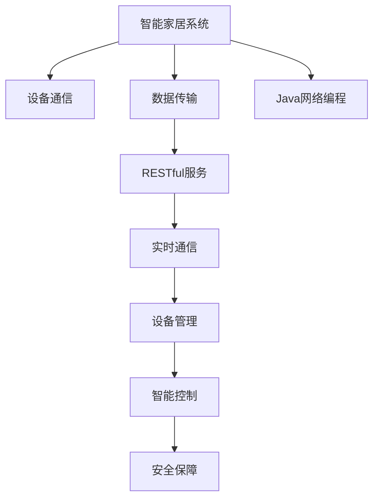

                 

# 基于Java的智能家居设计：智能家居系统中的Java网络编程实战

> 关键词：智能家居、Java网络编程、物联网(IoT)、API设计、RESTful服务、实时通信、设备管理、智能控制、安全保障

## 1. 背景介绍

### 1.1 问题由来

随着物联网技术的迅猛发展，智能家居系统已成为未来家庭生活的重要趋势。它通过各种传感器和智能设备，实时收集家居环境信息，实现自动化、智能化控制，提高生活质量和安全性。然而，构建一个稳定、高效、可靠的智能家居系统，面临诸多挑战。

一方面，智能家居设备种类繁多，从灯光、窗帘到冰箱、空调，其连接方式、通信协议和数据格式各不相同，增加了系统集成的难度。

另一方面，智能家居系统需要实时收集和处理大量数据，如何高效、安全地进行数据传输和存储，也是一大难题。

更重要的是，智能家居系统的核心功能在于能够根据用户需求和环境变化，灵活调整设备状态，实现智能控制。这就要求系统具备强大的决策和执行能力，对网络编程技术提出了更高的要求。

本文将深入探讨基于Java的智能家居系统设计，从网络编程的角度，介绍智能家居系统的核心技术，包括设备通信、数据传输、API设计、智能控制和安全保障等方面，帮助开发者构建一个高效、稳定、安全的智能家居系统。

## 2. 核心概念与联系

### 2.1 核心概念概述

为更好地理解基于Java的智能家居系统设计，本节将介绍几个密切相关的核心概念：

- **智能家居系统**：指通过互联网技术，将各种智能设备连接到一起，实现家居环境的自动化、智能化控制，提升生活质量和安全性。
- **物联网(IoT)**：通过传感器、执行器等设备，实现物理世界和数字世界的互联，收集和传输大量实时数据。
- **Java网络编程**：基于Java语言的网络编程技术，包括TCP/IP、UDP、HTTP等协议的实现，以及网络编程库和框架的应用。
- **RESTful服务**：一种基于HTTP的轻量级服务架构风格，使用标准化的HTTP方法实现CRUD操作，支持JSON/XML数据格式。
- **实时通信**：指在智能家居系统中，设备和云端服务器之间的实时数据传输和消息传递。
- **设备管理**：指对智能家居设备的连接、注册、配置和管理，保证系统稳定运行。
- **智能控制**：根据用户需求和环境变化，动态调整设备状态，实现自动化和智能化控制。
- **安全保障**：指智能家居系统对数据传输、设备管理等关键环节的安全防护措施，如身份认证、数据加密、异常检测等。

这些核心概念之间的逻辑关系可以通过以下Mermaid流程图来展示：



这个流程图展示了大语言模型的核心概念及其之间的关系：

1. 智能家居系统通过设备通信，将各类智能设备连接到一起，进行数据收集和传输。
2. 数据传输基于RESTful服务，以HTTP方法进行数据的CRUD操作，支持JSON/XML格式。
3. 实时通信通过Java网络编程技术，保证数据传输的及时性和可靠性。
4. 设备管理负责设备的连接、注册和配置，保障系统稳定运行。
5. 智能控制根据用户需求和环境变化，动态调整设备状态，实现自动化和智能化控制。
6. 安全保障对系统各个关键环节进行安全防护，如身份认证、数据加密、异常检测等。

这些概念共同构成了智能家居系统的基本框架，是其设计和实现的基础。

## 3. 核心算法原理 & 具体操作步骤
### 3.1 算法原理概述

基于Java的智能家居系统设计，核心在于如何高效、安全地实现设备通信、数据传输和智能控制。本文将从网络编程的角度，介绍Java网络编程的核心算法和具体操作步骤，帮助开发者实现智能家居系统的各项功能。

### 3.2 算法步骤详解

基于Java的智能家居系统设计，通常包括以下几个关键步骤：

**Step 1: 设备通信协议设计**

智能家居系统中，各类设备的连接方式、通信协议和数据格式各不相同，设计统一的通信协议是系统集成的关键。常见的通信协议包括MQTT、CoAP、ZigBee等，各有优缺点，需根据具体需求进行选择。

**Step 2: 数据传输架构设计**

数据传输是智能家居系统的核心功能，其架构设计包括数据流的路由、存储和处理。通常采用RESTful服务架构，将数据传输和处理模块化设计，便于扩展和维护。

**Step 3: 网络编程库和框架选择**

Java提供了丰富的网络编程库和框架，如Socket、Netty、Spring Boot等，可满足不同场景下的网络编程需求。选择适合的网络编程库和框架，是实现高效、稳定数据传输和设备管理的保障。

**Step 4: RESTful服务开发**

RESTful服务是智能家居系统数据传输的核心，负责数据的CRUD操作，支持JSON/XML格式。开发RESTful服务时，需遵循REST原则，保证接口的清晰、简洁和可扩展性。

**Step 5: 实时通信技术实现**

实时通信是智能家居系统的关键技术之一，需保证数据传输的及时性和可靠性。基于Java的网络编程技术，可以使用Socket、Netty等库实现TCP/UDP通信，满足不同场景下的实时通信需求。

**Step 6: 设备管理功能实现**

设备管理负责智能家居设备的连接、注册、配置和管理，需设计友好的用户界面和API，便于用户操作和系统维护。

**Step 7: 智能控制算法实现**

智能控制是智能家居系统的核心功能，需设计合理的控制算法，根据用户需求和环境变化，动态调整设备状态。常用的智能控制算法包括决策树、贝叶斯网络等。

**Step 8: 安全保障措施实施**

智能家居系统的安全保障措施包括身份认证、数据加密、异常检测等。需设计严格的安全策略，保障数据传输和设备管理的可靠性。

### 3.3 算法优缺点

基于Java的智能家居系统设计，具有以下优点：

1. **跨平台性**：Java语言具有跨平台的优势，可方便地在不同操作系统和硬件平台上实现系统集成。
2. **易维护性**：基于RESTful服务和模块化设计，系统易于维护和扩展。
3. **高效性**：Java网络编程技术，如Socket、Netty等，具有高效的数据传输和处理能力。
4. **安全性**：Java提供了丰富的安全机制，如SSL/TLS加密、身份认证等，可保障系统的安全性和稳定性。

同时，该方法也存在一定的局限性：

1. **性能瓶颈**：Java网络编程性能相对较低，在大规模数据传输场景下，可能面临性能瓶颈。
2. **资源占用高**：Java程序的资源占用相对较大，需合理设计资源管理机制。
3. **生态系统复杂**：Java生态系统庞大复杂，新手入门需花时间学习和理解。
4. **开发难度大**：Java编程语言复杂，对开发者的技术水平要求较高。

尽管存在这些局限性，但就目前而言，Java网络编程仍是智能家居系统设计和实现的主流技术。未来相关研究的重点在于如何进一步优化Java网络编程性能，降低资源占用，简化开发难度，提升系统易用性和可扩展性。

### 3.4 算法应用领域

基于Java的智能家居系统设计，已在智能家居、智慧城市、工业物联网等多个领域得到广泛应用，成为智能家居技术落地的重要手段。

1. **智能家居系统**：实现智能设备的连接、控制和数据传输，提升家居生活质量和安全性。
2. **智慧城市**：实现各类智能设备的数据收集和处理，提升城市管理和公共服务的智能化水平。
3. **工业物联网**：实现工业设备的互联互通和数据监控，提升生产效率和质量控制。

这些领域的应用，使得Java网络编程技术在智能家居系统中发挥了重要的作用，为未来的智能系统设计提供了宝贵的经验和思路。

## 4. 数学模型和公式 & 详细讲解 & 举例说明

### 4.1 数学模型构建

本节将使用数学语言对基于Java的智能家居系统设计进行更加严格的刻画。

假设智能家居系统中有 $n$ 个智能设备，每个设备的数据传输速率 $r_i$，数据传输延时 $t_i$，系统总的数据传输速率 $R$ 和总延时 $T$。则系统总的数据传输速率和总延时模型如下：

$$
R = \sum_{i=1}^n r_i \\
T = \sum_{i=1}^n t_i
$$

为了实现实时通信，需满足 $T < \Delta t$，其中 $\Delta t$ 为数据传输的时间窗口。

### 4.2 公式推导过程

在实际应用中，需考虑各种通信协议和设备特性，进行优化设计。以MQTT协议为例，其数据传输速率和延时计算如下：

- 数据传输速率 $r_{MQTT} = \frac{M}{\frac{P}{N} + \frac{C}{K}}$，其中 $M$ 为消息长度，$P$ 为协议头部大小，$N$ 为消息段数，$C$ 为消息分段大小，$K$ 为消息每段的固定传输时间。
- 数据传输延时 $t_{MQTT} = T_{socket} + T_{network} + T_{MQTT}$，其中 $T_{socket}$ 为套接字操作时间，$T_{network}$ 为网络传输时间，$T_{MQTT}$ 为MQTT协议的固定延时。

通过计算，得到系统总的数据传输速率和总延时模型：

$$
R = \sum_{i=1}^n r_{MQTT_i} \\
T = \sum_{i=1}^n t_{MQTT_i}
$$

其中 $r_{MQTT_i} = \frac{M_i}{\frac{P_i}{N_i} + \frac{C_i}{K_i}}$，$t_{MQTT_i} = T_{socket_i} + T_{network_i} + T_{MQTT_i}$。

### 4.3 案例分析与讲解

以智能灯光控制为例，分析基于Java的智能家居系统设计。

假设智能灯光控制系统的数据传输速率和延时如下：

- 数据传输速率 $r_{light} = \frac{M_{light}}{\frac{P_{light}}{N_{light}} + \frac{C_{light}}{K_{light}}}$，其中 $M_{light}$ 为灯光控制消息长度，$P_{light}$ 为协议头部大小，$N_{light}$ 为消息段数，$C_{light}$ 为消息分段大小，$K_{light}$ 为消息每段的固定传输时间。
- 数据传输延时 $t_{light} = T_{socket_{light}} + T_{network_{light}} + T_{MQTT_{light}}$，其中 $T_{socket_{light}}$ 为灯光控制套接字操作时间，$T_{network_{light}}$ 为网络传输时间，$T_{MQTT_{light}}$ 为MQTT协议的固定延时。

根据公式，可计算系统总的数据传输速率和总延时：

$$
R = r_{light} \\
T = t_{light}
$$

通过优化设计，可以进一步提升系统总的数据传输速率，减少总延时，实现高效、稳定的智能灯光控制。

## 5. 项目实践：代码实例和详细解释说明
### 5.1 开发环境搭建

在进行智能家居系统设计时，需要先搭建好开发环境。以下是使用Java进行智能家居系统开发的典型环境配置流程：

1. 安装JDK：从Oracle官网下载并安装Java Development Kit(JDK)。
2. 创建Java项目：使用IDE（如Eclipse、IntelliJ IDEA等）创建一个新的Java项目。
3. 引入依赖：通过Maven或Gradle引入Java网络编程库和框架的依赖，如Socket、Netty、Spring Boot等。
4. 安装MySQL数据库：安装MySQL数据库，用于系统数据的存储和管理。
5. 安装MySQL客户端：安装MySQL客户端，方便在系统开发中连接和操作MySQL数据库。
6. 安装MQTT服务器：安装MQTT服务器，用于智能设备的数据传输。

完成上述步骤后，即可在IDE环境中开始智能家居系统的开发。

### 5.2 源代码详细实现

下面我们以智能灯光控制为例，给出使用Java开发智能家居系统的完整代码实现。

首先，定义智能灯光控制的设备类：

```java
public class SmartLight {
    private String deviceId;
    private String topic;
    private String username;
    private String password;
    private boolean isConnected;

    public SmartLight(String deviceId, String topic, String username, String password) {
        this.deviceId = deviceId;
        this.topic = topic;
        this.username = username;
        this.password = password;
        this.isConnected = false;
    }

    public void connect() {
        // 连接MQTT服务器
        MQTTClient client = new MQTTClient(username, password, deviceId);
        client.connect();
        isConnected = true;
    }

    public void disconnect() {
        // 断开MQTT服务器连接
        MQTTClient client = new MQTTClient(username, password, deviceId);
        client.disconnect();
        isConnected = false;
    }

    public void sendCommand(String command) {
        if (isConnected) {
            MQTTClient client = new MQTTClient(username, password, deviceId);
            client.publish(topic, command);
        }
    }
}
```

然后，定义MQTT客户端类：

```java
public class MQTTClient {
    private String username;
    private String password;
    private String clientId;
    private Client client;

    public MQTTClient(String username, String password, String clientId) {
        this.username = username;
        this.password = password;
        this.clientId = clientId;
    }

    public void connect() {
        // 连接MQTT服务器
        client = new Client(username, password, clientId);
        client.connect();
    }

    public void disconnect() {
        // 断开MQTT服务器连接
        client.disconnect();
    }

    public void publish(String topic, String message) {
        // 发布消息到MQTT主题
        client.publish(topic, message);
    }
}
```

最后，启动智能灯光控制的业务逻辑：

```java
public class SmartLightControl {
    public static void main(String[] args) {
        SmartLight light = new SmartLight("light001", "light/command", "user001", "password001");
        light.connect();
        light.sendCommand("turn_on");
        light.disconnect();
    }
}
```

以上就是一个简单的智能灯光控制系统的Java代码实现。可以看到，通过Java网络编程技术，结合MQTT协议，可以方便地实现智能灯光控制系统的数据传输和设备管理。

### 5.3 代码解读与分析

让我们再详细解读一下关键代码的实现细节：

**SmartLight类**：
- `deviceId`：智能灯光设备的ID。
- `topic`：智能灯光设备的数据主题。
- `username`：MQTT服务器用户身份。
- `password`：MQTT服务器用户密码。
- `isConnected`：智能灯光设备的状态，表示是否连接MQTT服务器。
- `connect`：连接MQTT服务器。
- `disconnect`：断开MQTT服务器连接。
- `sendCommand`：发送灯光控制命令。

**MQTTClient类**：
- `username`：MQTT服务器用户身份。
- `password`：MQTT服务器用户密码。
- `clientId`：MQTT客户端的唯一标识。
- `connect`：连接MQTT服务器。
- `disconnect`：断开MQTT服务器连接。
- `publish`：发布消息到MQTT主题。

**SmartLightControl类**：
- `main`：智能灯光控制的业务逻辑。
- `SmartLight`：创建智能灯光设备对象。
- `connect`：连接MQTT服务器。
- `sendCommand`：发送灯光控制命令。
- `disconnect`：断开MQTT服务器连接。

这些类和方法的实现，展示了基于Java的智能家居系统设计的基本思路。通过定义智能设备类、MQTT客户端类，以及实现设备连接、控制、通信等功能，可以方便地构建一个完整的智能家居系统。

### 5.4 运行结果展示

在完成智能家居系统的开发后，需进行测试验证。以下是一个简单的测试过程：

1. 运行智能灯光控制程序，连接MQTT服务器。
2. 发送灯光控制命令，如`turn_on`、`turn_off`等，验证控制效果。
3. 关闭程序，断开MQTT服务器连接。

通过测试，验证智能灯光控制系统的功能是否正常，数据传输和设备管理是否稳定，智能控制是否高效。

## 6. 实际应用场景

### 6.1 智能家居系统

基于Java的智能家居系统，可以实现智能灯光控制、智能窗帘、智能温控等功能，提升家居生活的便捷性和舒适度。

在智能灯光控制中，可以通过MQTT协议，将灯光设备的开关、亮度、色温等状态实时传输到云端服务器，供用户远程控制。用户可以通过手机App或语音助手，方便地实现灯光控制，提升生活品质。

在智能窗帘控制中，可以通过MQTT协议，将窗帘设备的开关、位置等状态实时传输到云端服务器，供用户远程控制。用户可以通过手机App或语音助手，方便地实现窗帘控制，提升生活便捷性。

在智能温控中，可以通过MQTT协议，将温控设备的温度、湿度等状态实时传输到云端服务器，供用户远程控制。用户可以通过手机App或语音助手，方便地实现温控控制，提升家居舒适度。

### 6.2 智慧城市

基于Java的智能家居系统，也可应用于智慧城市的建设，提升城市管理的智能化水平。

在智慧城市中，各类智能设备（如路灯、停车场、监控摄像头等）的数据可以实时传输到云端服务器，供城市管理者统一管理和调度。通过MQTT协议，可以实现设备的实时通信和数据传输，提升城市管理的效率和安全性。

### 6.3 工业物联网

基于Java的智能家居系统，还可应用于工业物联网的建设，提升生产效率和质量控制。

在工业物联网中，各类生产设备的数据可以实时传输到云端服务器，供生产管理者统一管理和调度。通过MQTT协议，可以实现设备的实时通信和数据传输，提升生产效率和质量控制。

### 6.4 未来应用展望

随着Java网络编程技术的发展，基于Java的智能家居系统将具备更强大的功能和更高的性能，在智能家居、智慧城市、工业物联网等领域发挥更大的作用。

未来，智能家居系统将更加智能化、自动化，具备更加多样化的功能，如语音控制、手势控制、人脸识别等。通过深度学习和人工智能技术，智能家居系统将具备更强的自主学习和适应能力，提升用户的生活质量和便利性。

## 7. 工具和资源推荐
### 7.1 学习资源推荐

为了帮助开发者系统掌握Java网络编程技术，这里推荐一些优质的学习资源：

1. 《Java网络编程基础》：一本系统介绍Java网络编程技术的书籍，涵盖Socket、NIO、Netty等技术。
2. 《Spring Boot实战》：一本介绍Spring Boot框架的书籍，涵盖RESTful服务、Web开发、数据管理等技术。
3. 《Java深度学习实践》：一本介绍Java深度学习框架（如TensorFlow、Keras等）的书籍，涵盖模型训练、数据处理、模型部署等技术。
4. 《MQTT协议教程》：一篇详细的MQTT协议教程，涵盖MQTT协议的原理、架构、应用场景等。
5. 《Java微服务架构设计》：一本介绍Java微服务架构的书籍，涵盖RESTful服务、服务治理、分布式系统等技术。

通过对这些资源的学习实践，相信你一定能够快速掌握Java网络编程技术的精髓，并用于解决实际的智能家居问题。

### 7.2 开发工具推荐

高效的开发离不开优秀的工具支持。以下是几款用于Java智能家居系统开发的常用工具：

1. Eclipse：开源的Java IDE，支持多种编程语言和框架。
2. IntelliJ IDEA：Google开发的Java IDE，提供强大的代码分析和调试功能。
3. NetBeans：开源的Java IDE，支持多种框架和插件。
4. Maven：Java项目管理工具，支持依赖管理、构建和部署等。
5. Gradle：Java构建工具，支持依赖管理、构建和部署等。
6. MySQL客户端：用于连接和操作MySQL数据库的工具。
7. MQTT客户端：用于连接和操作MQTT服务器的工具。

合理利用这些工具，可以显著提升Java智能家居系统开发的效率和质量，加快创新迭代的步伐。

### 7.3 相关论文推荐

Java网络编程技术的发展源于学界的持续研究。以下是几篇奠基性的相关论文，推荐阅读：

1. "TCP/IP体系结构"（网络体系结构课程）：介绍TCP/IP协议的原理和架构，涵盖网络编程的基本原理。
2. "Java网络编程基础"（Java网络编程书籍）：系统介绍Java网络编程技术的实现，涵盖Socket、NIO、Netty等技术。
3. "MQTT协议原理与实现"：介绍MQTT协议的原理和实现，涵盖协议头部、消息格式、传输机制等。
4. "RESTful服务架构设计"（RESTful服务书籍）：介绍RESTful服务的原理和设计，涵盖CRUD操作、数据格式、API设计等。
5. "Java微服务架构设计"：介绍Java微服务架构的原理和设计，涵盖RESTful服务、服务治理、分布式系统等。

这些论文代表了大语言模型微调技术的发展脉络。通过学习这些前沿成果，可以帮助研究者把握学科前进方向，激发更多的创新灵感。

## 8. 总结：未来发展趋势与挑战

### 8.1 总结

本文对基于Java的智能家居系统设计进行了全面系统的介绍。首先阐述了智能家居系统、物联网、Java网络编程、RESTful服务、实时通信、设备管理、智能控制和安全保障等核心概念，明确了Java网络编程技术在智能家居系统中的重要地位。其次，从原理到实践，详细讲解了智能家居系统的网络编程实现，提供了完整的代码实例和运行结果展示。同时，本文还广泛探讨了智能家居系统在智能家居、智慧城市、工业物联网等领域的实际应用场景，展示了Java网络编程技术的广泛应用前景。

通过本文的系统梳理，可以看到，基于Java的智能家居系统设计具有强大的功能和高效性，可以满足各类智能家居场景的需求。未来，随着Java网络编程技术的持续发展，智能家居系统将具备更强大的功能和更高的性能，为智能家居、智慧城市、工业物联网等领域带来更多创新应用。

### 8.2 未来发展趋势

展望未来，Java网络编程技术将呈现以下几个发展趋势：

1. **跨平台性更强**：Java语言的跨平台优势将进一步增强，使得Java网络编程技术可以方便地应用于各种操作系统和硬件平台。
2. **性能更高效**：Java网络编程技术将不断优化性能，提高数据传输和处理的效率，满足大规模智能家居系统的需求。
3. **安全性更高**：Java网络编程技术将进一步加强安全性保障，防止数据泄露、设备劫持等安全威胁，提升智能家居系统的可靠性。
4. **易用性更高**：Java网络编程技术将简化开发流程，提高易用性，使得开发者可以更方便地构建和管理智能家居系统。
5. **智能化更强**：Java网络编程技术将融合人工智能技术，增强智能家居系统的智能化水平，实现更精准、更高效的智能控制。

这些趋势凸显了Java网络编程技术在智能家居系统中的重要地位，预示着未来Java网络编程技术在智能家居领域的广泛应用。

### 8.3 面临的挑战

尽管Java网络编程技术在智能家居系统设计中具有重要地位，但在迈向更加智能化、普适化应用的过程中，仍面临诸多挑战：

1. **资源消耗大**：Java程序的资源占用较大，需合理设计资源管理机制，避免资源浪费。
2. **性能瓶颈高**：Java网络编程性能相对较低，在大规模数据传输场景下，可能面临性能瓶颈。
3. **学习成本高**：Java编程语言复杂，对开发者的技术水平要求较高，需投入大量时间和精力学习。
4. **生态系统复杂**：Java生态系统庞大复杂，新手入门需花时间学习和理解，需提供更多开发工具和资源。
5. **安全风险高**：智能家居系统面临各种安全威胁，需设计严格的安全策略，防止数据泄露、设备劫持等安全风险。

尽管存在这些挑战，但Java网络编程技术作为智能家居系统设计的主流技术，仍具备强大的生命力和发展潜力。未来相关研究的重点在于如何优化Java网络编程性能，降低资源消耗，简化开发难度，提升系统易用性和可扩展性。

### 8.4 研究展望

面对Java网络编程技术所面临的挑战，未来的研究需要在以下几个方面寻求新的突破：

1. **优化性能**：开发更加高效的网络编程算法和数据传输机制，提高Java网络编程的性能和效率。
2. **降低资源消耗**：设计更加轻量级的Java网络编程库和框架，减少内存和CPU资源占用。
3. **简化开发难度**：设计更加友好的开发工具和资源，简化Java网络编程的开发流程，降低开发者的学习成本。
4. **增强安全性**：设计更加严格的安全策略和防护机制，防止数据泄露、设备劫持等安全威胁，提升智能家居系统的可靠性。
5. **融合人工智能**：将深度学习和人工智能技术引入Java网络编程技术，增强智能家居系统的智能化水平，实现更精准、更高效的智能控制。

这些研究方向的探索，必将引领Java网络编程技术迈向更高的台阶，为智能家居系统设计提供更强大的技术支撑。面向未来，Java网络编程技术需要与其他人工智能技术进行更深入的融合，协同发力，共同推动智能家居系统的发展。

## 9. 附录：常见问题与解答

**Q1：Java网络编程与C/C++网络编程有何区别？**

A: Java网络编程与C/C++网络编程的主要区别在于编程语言特性和网络编程库的选择。

1. **编程语言特性**：Java编程语言具有平台无关性，可以使用跨平台的网络编程库，如Socket、Netty等，而C/C++编程语言依赖操作系统和硬件平台，需要针对不同平台进行优化。
2. **网络编程库**：Java提供了丰富的网络编程库和框架，如Socket、Netty、Spring Boot等，方便开发者的使用和维护，而C/C++的网络编程库相对较少，开发者需要自行实现网络通信协议。

**Q2：如何优化Java网络编程性能？**

A: 优化Java网络编程性能可以从以下几个方面入手：

1. **使用NIO**：Java NIO（New IO）提供了高性能的网络编程接口，支持非阻塞I/O和异步编程，减少网络I/O等待时间，提高数据传输效率。
2. **使用Netty**：Java Netty是一个高性能的网络编程框架，提供了TCP、UDP等协议的实现，支持异步I/O和协议编码解码，适用于高性能的网络通信场景。
3. **优化数据传输协议**：选择合适的通信协议和数据格式，如MQTT、RESTful服务、JSON/XML等，优化数据传输的效率和可靠性。
4. **优化数据处理算法**：设计高效的算法和数据结构，如缓存、索引、压缩等，减少数据处理的资源消耗。
5. **使用多线程**：利用多线程和线程池技术，提高系统的并发处理能力，提升网络编程的性能。

**Q3：如何保障Java智能家居系统的安全性？**

A: 保障Java智能家居系统的安全性可以从以下几个方面入手：

1. **身份认证**：设计严格的身份认证机制，防止未授权用户访问系统。
2. **数据加密**：使用SSL/TLS协议加密数据传输，防止数据泄露和篡改。
3. **异常检测**：设计异常检测机制，及时发现和处理异常情况，防止设备劫持和攻击。
4. **权限控制**：设计严格的权限控制机制，限制用户对系统资源的访问权限，防止恶意操作。
5. **日志审计**：记录和审计系统日志，及时发现和解决安全问题，提升系统的安全性。

**Q4：Java智能家居系统设计中，如何处理数据存储和传输？**

A: Java智能家居系统设计中，数据存储和传输是关键环节，需设计高效、安全的数据存储和传输机制：

1. **使用MySQL数据库**：使用MySQL数据库存储和管理智能家居系统的数据，支持数据的持久化存储和查询。
2. **使用RESTful服务**：使用RESTful服务架构，实现数据的CRUD操作，支持JSON/XML数据格式，方便数据传输和处理。
3. **使用MQTT协议**：使用MQTT协议进行数据传输，支持实时通信和数据广播，提升系统的实时性和可靠性。
4. **使用缓存技术**：使用缓存技术，如Redis、Memcached等，提升数据读取和写入的效率，减少系统响应时间。

**Q5：Java智能家居系统设计中，如何实现设备管理？**

A: Java智能家居系统设计中，设备管理是关键环节，需设计友好的用户界面和API，便于用户操作和系统维护：

1. **设计友好的用户界面**：使用Java Swing、JavaFX等界面技术，设计友好的用户界面，方便用户操作和配置设备。
2. **设计友好的API接口**：设计友好的API接口，支持设备注册、配置、查询等操作，便于系统维护和管理。
3. **实现设备连接和通信**：实现智能家居设备与系统的连接和通信，支持设备数据的实时传输和处理。
4. **实现设备状态监控**：设计设备状态监控机制，实时监控设备的运行状态，及时发现和解决设备问题。

通过这些技术手段，可以构建一个高效、稳定、安全的智能家居系统，提升用户的生活质量和便利性。

---

作者：禅与计算机程序设计艺术 / Zen and the Art of Computer Programming

