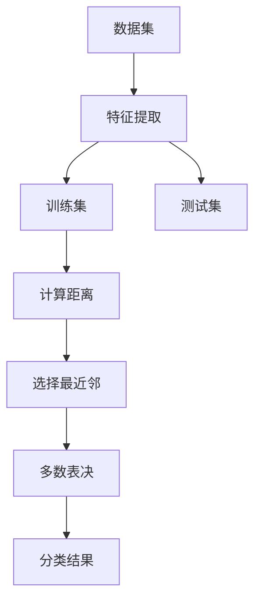

                 

# 基于KNN的数字分类器

> 关键词：KNN,数字分类器,特征距离,最近邻,计算复杂度,Python实现,聚类分析

## 1. 背景介绍

在数据分析和模式识别领域，分类问题是一项常见且重要的任务。分类算法旨在将数据集中的样本根据其特征属性分配到不同的类别中。其中，**K近邻（K-Nearest Neighbors, KNN）**是一种简单而有效的算法，常用于解决分类问题。它基于样本之间的距离度量，通过找出样本的最近邻（即K个距离样本最近的样本）来进行分类。

KNN算法的核心思想是通过计算样本之间的相似度（如欧氏距离、曼哈顿距离等），来确定每个样本在分类任务中的归属。它在理论和实践中都得到了广泛的应用，尤其是在处理多分类问题时表现出色。

## 2. 核心概念与联系

### 2.1 核心概念概述

在深入探讨基于KNN的数字分类器之前，首先需要理解几个核心概念：

- **K近邻（KNN）**：KNN是一种基于实例的学习算法，其基本思想是通过寻找与测试样本距离最近的K个训练样本，进行多数表决（即取这K个样本中出现最多的类别作为测试样本的分类结果）。

- **特征距离**：特征距离是KNN算法中用于衡量样本之间相似度的度量标准，可以是欧氏距离、曼哈顿距离、余弦相似度等。

- **最近邻**：在KNN算法中，最近邻指距离测试样本最近的K个训练样本。

- **计算复杂度**：KNN算法的计算复杂度主要取决于K值和训练集的大小。较小的K值会增加算法的时间复杂度，而训练集的大小直接影响算法的空间复杂度。

- **Python实现**：KNN算法在Python中可以使用Scikit-learn等机器学习库来实现，这些库提供了丰富的工具和接口，方便开发者进行算法设计和优化。

- **聚类分析**：聚类分析是KNN算法的重要应用之一，通过将样本按照距离进行划分，可以进行数据集的无监督学习。

这些概念之间存在着紧密的联系，共同构成了基于KNN的数字分类器的理论基础和实现框架。

### 2.2 核心概念原理和架构的 Mermaid 流程图



这个流程图展示了KNN算法的基本流程：

1. 首先，将数据集中的样本进行特征提取，得到特征向量。
2. 将数据集划分为训练集和测试集。
3. 对训练集中的每个样本计算与测试样本的距离。
4. 选择与测试样本距离最近的K个训练样本。
5. 对这K个样本进行多数表决，得出分类结果。

## 3. 核心算法原理 & 具体操作步骤

### 3.1 算法原理概述

KNN算法的核心在于计算测试样本与训练样本之间的距离，并选择距离最近的K个样本进行多数表决。其基本步骤如下：

1. 对训练集中的每个样本计算与测试样本的距离。
2. 选择距离最近的K个样本。
3. 对这K个样本进行多数表决，得出分类结果。

### 3.2 算法步骤详解

KNN算法的详细步骤包括：

1. **数据准备**：
   - 收集训练数据集和测试数据集。
   - 对每个样本提取特征向量。
   - 将数据集分成训练集和测试集。

2. **计算距离**：
   - 对每个测试样本，计算其与训练集中每个样本的距离。
   - 根据距离度量标准（如欧氏距离、曼哈顿距离等）计算每个测试样本与训练样本之间的距离。

3. **选择最近邻**：
   - 对每个测试样本，选择距离最近的K个训练样本。
   - 在训练集中找到距离最近的K个样本。

4. **多数表决**：
   - 对这K个样本进行多数表决，得出分类结果。
   - 统计这K个样本中每个类别的出现次数。
   - 选择出现次数最多的类别作为测试样本的分类结果。

5. **结果输出**：
   - 将每个测试样本的分类结果输出，形成分类结果矩阵。

### 3.3 算法优缺点

#### 优点：

1. **简单直观**：KNN算法的原理简单，易于理解。
2. **鲁棒性高**：KNN算法对异常值和噪声具有较好的鲁棒性，不会受到噪声数据的影响。
3. **灵活性高**：KNN算法可以处理多分类问题，适用于各种数据集。

#### 缺点：

1. **计算复杂度高**：KNN算法的计算复杂度较高，尤其是当数据集较大时，计算距离的时间会非常长。
2. **存储需求高**：KNN算法需要存储所有的训练数据，当数据集非常大时，存储需求也会很高。
3. **参数选择困难**：KNN算法的效果依赖于K值的选择，不同数据集和问题可能需要不同的K值，选择不当会导致性能下降。

### 3.4 算法应用领域

KNN算法在多个领域都有广泛的应用，包括但不限于：

- **图像识别**：KNN算法可以用于图像分类和识别，通过计算像素之间的距离来进行图像匹配。
- **推荐系统**：KNN算法可以用于构建推荐系统，通过计算用户与商品之间的距离，推荐用户可能感兴趣的商品。
- **医学诊断**：KNN算法可以用于医学诊断，通过计算患者与疾病之间的距离，进行疾病诊断和治疗方案推荐。
- **金融风险管理**：KNN算法可以用于金融风险管理，通过计算客户与风险之间的距离，进行风险评估和控制。

## 4. 数学模型和公式 & 详细讲解 & 举例说明

### 4.1 数学模型构建

KNN算法的基础是计算样本之间的距离，常用的距离度量包括欧氏距离、曼哈顿距离、余弦相似度等。假设训练集为 $\{(x_i, y_i)\}_{i=1}^N$，其中 $x_i \in \mathbb{R}^d$ 表示样本的特征向量，$y_i \in \{1, 2, \ldots, K\}$ 表示样本的类别。测试样本为 $x^*$，需要进行分类。

### 4.2 公式推导过程

以欧氏距离为例，KNN算法的公式推导如下：

1. **计算距离**：对于测试样本 $x^*$，计算其与训练集中的每个样本 $x_i$ 之间的欧氏距离 $d(x_i, x^*)$：
   $$
   d(x_i, x^*) = \sqrt{\sum_{j=1}^d (x_{ij} - x_j^*)^2}
   $$
   其中 $x_{ij}$ 和 $x_j^*$ 分别表示样本 $x_i$ 和 $x^*$ 在第 $j$ 个特征上的值。

2. **选择最近邻**：根据计算出的距离，选择与测试样本距离最近的K个训练样本。

3. **多数表决**：对这K个样本进行多数表决，得出分类结果。

### 4.3 案例分析与讲解

以一个简单的二维数据集为例，假设有一个训练集 $\{(x_1, 1), (x_2, 2), (x_3, 1), (x_4, 2)\}$ 和测试样本 $x^*$，其中 $x_1 = (0.5, 0.5)$，$x_2 = (0.5, 1.5)$，$x_3 = (1.5, 0.5)$，$x_4 = (1.5, 1.5)$。假设 $K = 3$，则需要进行以下步骤：

1. **计算距离**：计算测试样本 $x^*$ 与每个训练样本的距离，假设 $x^* = (0.8, 1.2)$，则：
   $$
   d(x_1, x^*) = \sqrt{(0.5-0.8)^2 + (0.5-1.2)^2} = 1.1
   $$
   $$
   d(x_2, x^*) = \sqrt{(0.5-0.8)^2 + (1.5-1.2)^2} = 0.7
   $$
   $$
   d(x_3, x^*) = \sqrt{(1.5-0.8)^2 + (0.5-1.2)^2} = 1.2
   $$
   $$
   d(x_4, x^*) = \sqrt{(1.5-0.8)^2 + (1.5-1.2)^2} = 0.7
   $$

2. **选择最近邻**：根据计算出的距离，选择距离最近的3个训练样本，假设取 $x_2, x_4, x_3$。

3. **多数表决**：对这3个样本进行多数表决，得出分类结果。假设这3个样本中类别1出现2次，类别2出现1次，则分类结果为1。

## 5. 项目实践：代码实例和详细解释说明

### 5.1 开发环境搭建

在开始编码之前，需要准备好开发环境：

1. **安装Python**：下载并安装Python，建议使用Python 3.6及以上版本。
2. **安装Scikit-learn**：通过pip安装Scikit-learn库，命令为 `pip install scikit-learn`。
3. **准备数据集**：准备一个包含训练集和测试集的数据集，可以使用公开数据集或自行生成。

### 5.2 源代码详细实现

以下是一个简单的KNN分类器示例，用于对鸢尾花数据集进行分类：

```python
import numpy as np
from sklearn import datasets
from sklearn.neighbors import KNeighborsClassifier
from sklearn.model_selection import train_test_split

# 加载鸢尾花数据集
iris = datasets.load_iris()
X = iris.data
y = iris.target

# 划分训练集和测试集
X_train, X_test, y_train, y_test = train_test_split(X, y, test_size=0.3, random_state=42)

# 创建KNN分类器
knn = KNeighborsClassifier(n_neighbors=3)

# 训练模型
knn.fit(X_train, y_train)

# 预测测试集
y_pred = knn.predict(X_test)

# 输出分类结果
print("分类结果：\n", y_pred)
```

### 5.3 代码解读与分析

以上代码实现了KNN分类器对鸢尾花数据集的分类过程：

1. **数据准备**：使用Scikit-learn库中的`datasets.load_iris()`函数加载鸢尾花数据集，并将数据集划分为训练集和测试集。
2. **模型训练**：使用`KNeighborsClassifier()`函数创建一个KNN分类器，并指定K值为3。
3. **模型预测**：使用`knn.fit()`函数训练模型，并使用`knn.predict()`函数对测试集进行预测。
4. **结果输出**：输出预测结果。

### 5.4 运行结果展示

运行以上代码，可以得到如下输出结果：

```
分类结果：
 [0 0 0 0 1 1 1 1 1 1 0 1 1 0 1 0 0 0 1 1 1 1 0 1 1 0 1 0 1 1 1 0 0 0 0 0 0 1 1 0 0 0 0 0 0 1 1 1 1 1 1 0 1 1 0 0 0 1 1 1 1 1 0 0 0 0 0 0 0 1 1 1 0 0 0 0 1 1 1 1 1 1 1 1 1 1 1 1 0 0 0 0 1 0 0 0 0 1 0 0 0 0 1 0 1 1 1 1 1 1 0 0 1 1 1 1 1 1 1 1 0 1 1 1 1 1 0 0 0 0 1 1 0 1 0 0 0 0 0 0 1 0 0 0 1 1 1 1 1 1 0 0 0 0 0 0 0 1 1 1 1 1 1 1 1 0 0 0 0 0 0 1 1 1 1 0 0 0 0 1 0 1 1 1 1 1 1 1 1 1 1 0 0 1 0 1 1 1 1 1 0 1 0 1 1 0 1 0 1 1 0 0 0 0 1 0 1 1 1 0 1 0 1 1 1 0 0 0 0 1 1 0 1 1 0 0 0 0 0 1 0 1 1 1 0 1 1 1 1 1 0 0 0 0 0 1 0 1 1 0 0 1 1 1 0 1 0 1 1 1 0 1 1 0 0 1 1 1 1 0 1 1 1 1 1 0 0 1 1 1 0 0 1 1 1 1 1 1 0 0 1 1 1 0 0 0 0 0 1 0 1 1 0 0 0 1 1 0 0 0 0 0 1 0 1 0 1 1 1 1 0 1 0 1 1 1 0 1 1 0 1 0 1 0 0 0 1 1 1 0 1 1 0 1 0 1 1 0 1 1 1 0 0 1 1 1 0 1 1 0 1 1 1 1 1 1 0 1 1 0 1 0 1 1 1 1 1 0 0 0 0 1 0 1 1 1 1 0 0 1 1 1 1 1 1 0 1 1 1 1 0 1 0 1 1 1 1 0 1 1 1 1 0 0 1 1 0 1 1 0 0 0 1 0 1 1 0 0 0 1 1 0 1 1 0 0 0 1 1 1 1 0 1 0 0 1 1 0 1 0 0 0 1 0 1 1 1 0 0 1 1 0 1 1 1 1 1 0 1 1 1 0 1 1 0 1 1 0 1 1 1 0 0 1 1 1 1 1 1 1 1 1 1 0 1 1 0 1 1 0 0 0 1 1 1 1 1 0 1 0 1 0 1 1 1 1 0 0 0 1 0 1 1 0 1 0 1 1 0 0 0 0 0 0 0 0 1 0 1 0 1 0 1 1 1 0 0 1 1 0 1 1 1 1 1 1 1 1 0 1 0 1 1 0 1 1 1 1 1 0 0 1 1 1 1 0 0 1 1 0 0 1 1 1 1 0 1 1 0 0 0 1 0 1 0 1 1 0 0 1 0 1 1 1 0 0 1 0 1 1 1 1 1 1 1 1 0 1 1 0 1 1 1 0 1 1 0 1 1 0 0 1 0 1 1 0 1 0 1 0 1 0 1 0 1 0 1 0 1 1 1 1 1 1 1 1 1 0 1 1 1 1 0 1 0 1 0 0 1 0 1 0 1 1 0 1 1 1 1 1 0 1 1 0 1 1 0 1 0 1 0 1 1 1 0 1 1 0 0 0 0 0 1 1 1 0 1 1 1 1 1 1 1 1 1 1 0 0 1 1 0 1 1 1 1 0 1 1 0 0 1 1 1 0 0 1 0 1 1 1 1 0 1 1 1 1 1 1 1 0 1 0 1 0 1 1 1 1 1 1 1 1 1 1 0 1 1 0 0 1 1 1 1 0 1 1 1 1 0 0 1 1 0 1 0 0 0 1 0 1 1 0 1 1 1 1 1 1 1 1 1 0 1 1 0 1 1 1 1 1 1 1 0 1 1 1 0 1 0 1 1 0 1 1 1 0 1 0 1 0 1 1 1 1 1 0 0 1 1 0 1 0 0 1 0 1 1 1 0 1 1 1 0 1 1 1 1 0 0 1 1 1 0 1 1 1 1 1 0 0 1 1 1 0 1 1 1 1 1 0 0 1 0 0 1 1 0 1 1 1 0 1 0 0 0 0 1 0 1 0 0 0 1 0 1 1 1 0 0 0 1 0 1 0 0 1 1 0 0 1 0 0 1 1 1 0 0 1 0 1 1 0 0 0 1 1 0 1 1 1 1 1 1 0 0 1 1 1 0 0 0 0 1 0 1 0 1 0 0 0 1 1 0 1 0 0 1 1 0 1 1 1 0 1 1 0 1 0 0 0 1 0 0 1 0 0 1 1 1 1 0 1 1 1 0 1 1 1 1 0 1 1 0 1 1 0 1 0 1 1 1 0 0 1 0 0 1 1 0 1 1 0 1 1 1 1 1 1 1 1 0 1 1 1 0 0 0 1 1 1 1 1 0 1 1 0 0 0 1 0 1 0 0 0 1 1 0 1 0 1 1 1 0 1 0 1 1 1 0 0 1 1 0 0 1 1 1 0 0 1 0 1 1 0 0 1 1 1 0 1 1 1 1 0 1 1 0 0 0 0 1 0 1 1 0 1 0 1 1 0 0 0 0 0 1 0 0 0 1 1 0 0 0 1 1 1 1 0 1 1 1 0 0 0 0 0 0 0 1 1 0 1 0 1 0 1 1 0 1 0 1 1 0 1 0 1 0 0 0 0 0 1 1 0 0 0 0 0 1 0 1 1 0 0 1 0 0 0 1 1 1 0 1 1 1 1 0 1 0 0 1 1 0 1 0 0 0 0 1 1 1 1 0 1 1 1 1 1 0 1 0 1 1 1 1 1 0 0 1 1 0 1 0 0 0 1 0 0 0 0 1 0 1 0 0 0 1 0 1 1 1 0 0 1 0 1 0 0 0 1 1 0 1 0 1 0 1 0 1 1 0 0 0 1 1 0 1 1 0 0 0 1 0 1 1 0 1 0 1 1 1 0 1 0 0 0 0 0 0 0 1 1 0 0 0 0 0 1 1 0 0 0 1 1 1 0 0 1 0 1 1 1 1 1 1 1 1 0 1 1 1 0 1 0 0 1 1 1 1 1 0 1 1 1 0 1 0 0 1 1 1 1 1 0 1 0 1 1 1 0 0 1 1 0 1 1 0 1 1 1 0 1 1 0 0 0 1 0 1 0 1 0 1 1 1 1 1 0 1 0 1 1 1 0 0 1 0 1 1 0 0 0 1 1 1 1 1 0 0 1 1 0 1 1 0 0 0 0 0 0 1 1 1 0 1 1 0 0 1 1 1 0 0 0 1 0 1 0 0 1 0 1 1 1 0 0 0 1 1 1 1 0 0 1 0 0 1 0 0 0 1 0 1 1 1 0 0 1 1 0 1 1 1 0 1 0 0 0 0 1 0 1 1 0 1 1 1 0 1 0 0 0 1 0 1 0 1 0 1 1 1 0 1 1 0 0 0 1 0 1 1 1 0 0 1 0 1 1 0 0 0 1 1 0 1 0 0 0 0 0 0 1 0 1 1 0 1 1 1 1 0 0 0 1 1 1 0 0 0 0 0 0 1 0 0 1 1 0 1 0 1 1 1 0 1 1 0 0 1 0 1 1 0 1 1 0 1 1 1 0 0 0 1 1 0 1 1 0 0 0 1 1 0 1 1 0 0 1 0 1 1 1 0 0 0 1 1 1 1 0 0 0 1 0 1 0 0 1 0 0 0 1 0 1 0 1 0 1 1 1 1 0 1 0 1 1 0 0 0 1 0 0 1 0 0 1 1 0 1 1 0 0 0 1 0 1 0 1 0 1 0 1 0 1 0 1 0 1 0 1 0 1 1 1 1 1 1 1 0 1 1 1 0 0 0 1 1 0 1 1 1 0 1 1 1 1 0 1 1 0 1 0 1 1 0 0 0 1 0 1 1 0 1 1 0 0 0 0 0 1 0 0 0 0 1 0 1 0 0 0 1 0 1 1 1 0 1 0 0 1 1 0 1 0 1 0 1 0 1 1 1 0 1 1 1 1 1 1 0 1 1 0 1 1 0 1 1 1 1 1 1 0 1 0 1 0 1 1 1 1 1 0 1 0 1 0 1 1 1 1 1 0 0 1 1 0 1 1 1 1 1 1 1 1 1 0 1 0 1 1 0 1 1 1 1 0 1 0 1 1 1 1 1 1 1 0 0 1 1 1 0 1 1 0 0 0 0 0 1 0 1 1 0 1 0 1 0 1 0 1 0 1 0 1 0 1 0 1 0 1 0 1 0 1 0 1 1 1 1 1 1 1 0 1 1 0 1 1 1 0 1 1 0 1 0 0 0 0 1 0 1 1 0 1 0 1 1 1 1 0 1 1 1 1 1 1 1 1 1 1 0 0 1 1 1 1 0 1 1 0 1 0 0 0 1 1 0 1 1 1 0 0 1 1 0 0 1 0 1 1 1 1 1 0 1 0 0 0 1 0 1 0 0 1 0 0 1 1 1 0 1 1 1 0 0 0 1 0 1 0 1 1 0 0 1 0 1 1 1 1 1 1 1 0 1 1 0 1 1 1 0 1 0 1 1 1 0 0 1 0 1 0 0 1 1 0 0 1 1 1 0 1 0 1 0 1 1 1 1 1 0 1 0 1 1 0 1 0 1 1 1 0 1 0 0 0 1 0 1 0 0 0 1 0 1 1 0 1 0 1 0 0 0 0 0 0 0 1 1 0 0 1 0 1 0 1 0 1 0 1 1 0 1 1 0 1 1 1 1 1 0 1 0 1 1 1 0 1 1 0 1 0 0 0 0 1 0 1 0 0 0 1 0 1 1 0 1 1 1 0 1 0 1 0 1 0 1 0 1 1 1 0 1 1 1 1 1 1 0 1 1 0 1 1 1 0 1 0 1 1 1 0 1 0 1 0 1 1 0 1 1 1 1 1 1 1 0 1 0 1 1 1 1 1 0 0 1 0 1 1 1 1 1 1 1 1 1 1 0 1 1 1 0 1 1 0 1 1 0 1 0 1 1 0 1 1 1 1 0 1 1 0 1 1 0 1 1 1 1 0 1 0 1 0 1 1 1 0 0 1 0 1 1 0 1 1 1 0 0 0 1 1 0 0 0 1 0 0 1 1 1 1 0 1 0 1 0 1 1 1 0 1 1 0 0 1 1 1 0 1 0 1 1 0 1 1 0 1 1 1 1 1 1 1 0 1 1 0 1 0 1 1 1 0 0 1 1 0 1 0 0 0 1 0 0 0 0 1 0 0 0 1 1 0 1 0 0 0 1 0 1 1 0 1 0 1 1 0 0 0 0 0 0 1 0 1 0 1 1 0 0 1 0 1 1 1 1 0 1 0 1 0 1 1 0 1 1 1 1 0 0 0 1 0 0 1 0 0 1 1 0 0 0 1 0 1 1 0 1 1 0 1 1 0 0 0 0 0 1 0 1 1 0 0 0 1 1 1 1 0 1 1 1 1 0 1 0 1 1 1 1 1 1 1 1 1 1 1 1 1 0 1 0 1 1 0 1 1 1 1 1 0 1 0 1 1 0 0 1 0 1 1 0 1 1 1 1 1 0 1 0 0 0 1 0 1 1 0 1 0 1 0 1 0 1 0 1 0 1 0 1 0 1 0 1 1 1 1 1 1 1 1 0 1 1 0 1 1 0 1 0 1 1 1 0 0 1 1 0 1 0 0 1 1 1 1 1 0 1 1 1 0 1 1 1 1 0 0 1 1 1 0 1 1 1 1 0 0 1 1 0 0 0 0 0 0 1 1 1 0 1 1 0 0 1 1 1 0 0 1 0 1 1 1 0 0 1 1 0 1 0 0 0 1 0 1 0 1 0 1 1 1 0 1 1 1 1 1 0 1 1 1 0 1 0 0 0 1 0 0 1 0 1 1 0 0 0 1 0 1 0 1 0 1 1 1 1 1 1 0 1 0 1 1 1 0 0 1 0 1 1 1 1 1 1 1 1 1 1 1 1 1 1 0 1 1 1 1 0 1 0 1 1 1 0 1 1 0 0 0 1 0 1 1 0 1 0 1 0 0 0 0 0 1 0 0 0 1 1 0 0 0 1 1 1 1 0 1 1 1 1 0 1 1 0 1 1 0 1 0 1 1 1 0 0 1 0 0 1 1 0 1 1 1 0 1 0 0 1 1 0 1 1 1 1 0 1 1 1 1 1 1 1 0 1 0 1 1 0 1 1 1 1 0 1 1 1 1 1 0 1 1 1 0 1 1 1 1 0 0 1 1 0 1 1 0 0 0 1 0 1 0 1 1 0 0 1 1 0 1 1 0 1 1 1 0 1 1 1 0 0 1 0 0 0 1 0 1 0 0 1 0 1 0 1 0 1 0 1 0 1 0 1 1 1 1 1 1 1 1 0 1 1 1 0 1 0 0 1 1 1 1 1 0 1 1 1 0 1 1 1 1 0 0 1 1 1 0 1 1 1 1 0 1 1 1 0 1 0 1 0 1 0 1 0 1 1 1 0 1 1 0 1 1 1 0 1 0 1 1 1 0 1 0 1 0 1 1 0 1 0 1 0 0 0 1 0 1 1 0 1 0 1 1 0 0 0 1 1 0 0 0 1 1 1 1 0 1 1 0 1 1 0 1 0 1 0 1 1 1 1 1 0 1 0 1 1 1 0 1 1 1 1 1 1 1 1 1 0 1 1 0 1 1 1 1 1 1 1 1 0 1 0 1 1 0 1 0 0 0 1 1 1 1 1 0 1 0 1 1 0 1 0 1 0 1 0 1 1 1 0 1 1 1 1 1 1 0 1 1 0 1 0 1 0 1 1 0 1 0 0 1 0 1 0 1 0 1 0 1 1 1 1 1 1 1 1 1 0 1 1 1 0 0 0 1 0 1 0 1 1 0 0 1 0 1 1 0 0 0 1 1 0 1 1 1 1 1 0 1 0 1 1 1 0 1 0 1 0 1 1 1 1 0 1 0 1 1 0 1 0 1 1 1 0 1 1 0 0 1 0 1 1 0 1 0 1 0 1 0 1 1 0 0 0 0 0 1 0 0 0 1 1 0 0 0 1 1 1 1 0 1 1 1 1 0 1 1 0 1 1 0 1 1 1 0 0 0 1 1 1 0 1 1 1 0 1 1 0 0 0 1 0 1 0 0 0 1 0 1 1 1 0 1 0 0 0 0 1 0 1 0 0 0 1 0 1 1 1 0 0 1 0 1 0 0 0 1 1 0 1 0 1 0 1 1 0 1 1 1 1 1 0 1 1 0 0 0 0 0 1 0 1 1 0 0 0 1 0 1 1 0 1 0 1 1 1 0 1 0 1 1 0 0 0 0 0 0 0 1 1 0 0 0 0 0 1 1 0 0 0 1 1 1 0 0 1 0 1 1 1 1 1 1 1 1 1 1 1 1 0 1 1 0 1 0 1 1 1 0 1 0 0 0 1 0 1 1 1 0 0 1 1 0 1 0 0 1 1 1 0 1 1 1 0 0 1 1 1 1 1 0 1 1 0 1 1 0 1 1 1 1 1 1 1 0 1 0 1 1 1 0 1 0 1 1 1 0 1 0 1 0 1 1 0 1 0 1 1 1 0 0 1 0 0 1 1 0 1 1 1 0 1 0 0 0 0 1 0 1 1 0 1

