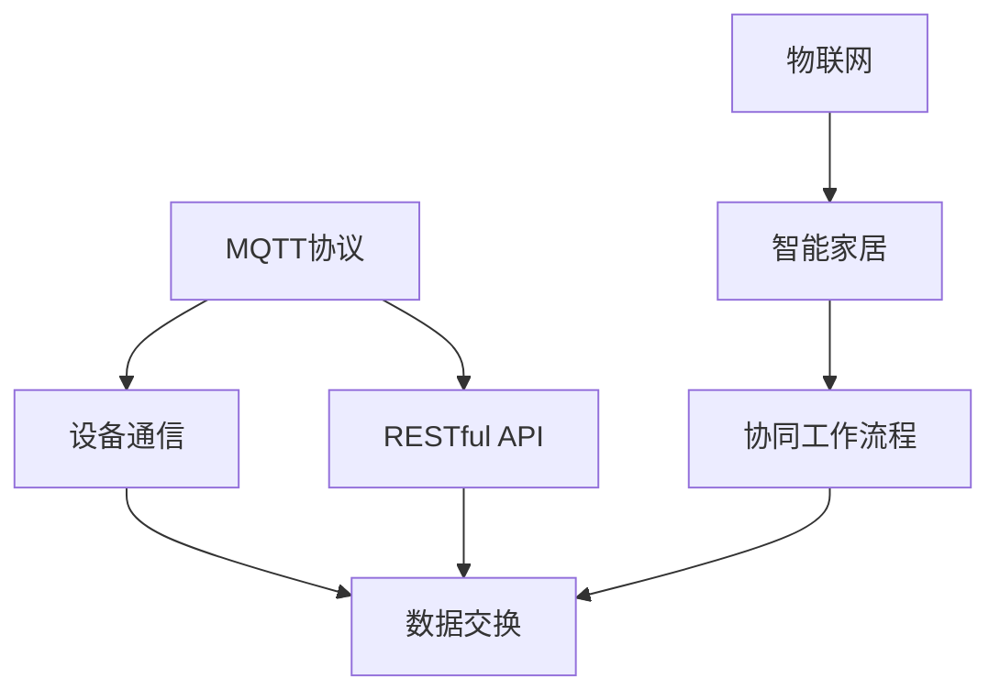

                 

# 基于MQTT协议和RESTful API的智能家居协同工作流程设计

## 1. 背景介绍

### 1.1 问题由来
随着物联网技术的发展，智能家居系统逐渐成为了家庭生活的新潮流。传统的智能家居系统通常以单一设备为中心，各个设备之间互联互通程度有限，用户体验和系统可靠性都受到一定制约。为了解决这一问题，需要引入更为灵活、高效的通信协议和协同机制。

### 1.2 问题核心关键点
为了提高智能家居系统的协同性和可扩展性，我们提出了基于MQTT协议和RESTful API的智能家居协同工作流程设计。该设计方案通过MQTT协议实现设备间的可靠通信，通过RESTful API提供标准的接口，使得不同设备能够无缝协作，提升整体系统的智能化水平。

## 2. 核心概念与联系

### 2.1 核心概念概述

为更好地理解基于MQTT协议和RESTful API的智能家居协同工作流程设计，本节将介绍几个密切相关的核心概念：

- MQTT协议：轻量级的消息队列传输协议，适用于设备间小数据量的即时通信，具有良好的实时性和低延迟特性。
- RESTful API：基于HTTP协议的Web服务接口，通过标准的HTTP请求方式进行数据交换，简单易用，具有良好的可扩展性和可维护性。
- 物联网：通过传感器、控制器等设备，实现人机交互和信息处理的智能化系统。
- 智能家居：结合物联网技术，实现家居设备互联互通，提升家庭生活便利性和舒适度。
- 协同工作流程：通过多个设备之间的协调配合，实现特定功能的智能家居应用场景。

这些核心概念之间的逻辑关系可以通过以下Mermaid流程图来展示：



这个流程图展示了大语言模型的核心概念及其之间的关系：

1. MQTT协议为智能家居设备之间的数据传输提供了可靠的通信机制。
2. RESTful API提供了设备之间数据交换的标准接口。
3. 物联网技术使得各个智能家居设备能够连接和互联。
4. 智能家居系统通过协同工作流程，实现设备之间的协同作用。
5. 协同工作流程中，设备间的数据交换依赖于MQTT协议和RESTful API的协作。

这些概念共同构成了智能家居系统的通信和协同基础，为其功能和性能提供了保障。

## 3. 核心算法原理 & 具体操作步骤
### 3.1 算法原理概述

基于MQTT协议和RESTful API的智能家居协同工作流程设计，核心思想是通过标准化的通信协议和接口，实现智能家居设备的无缝协同。其核心算法原理如下：

- **数据订阅与发布**：MQTT协议采用发布/订阅模型，设备之间通过发布/订阅主题进行通信。例如，智能灯泡可以通过发布“/light/state”主题来表示当前开闭状态，其他设备可以通过订阅该主题获取状态信息。
- **HTTP请求与响应**：RESTful API通过HTTP请求方式进行数据交换。例如，用户可以通过发送HTTP请求来查询智能电视的状态，服务器通过响应HTTP请求来返回状态信息。
- **事件驱动架构**：智能家居系统通过事件驱动的架构，实现设备之间的异步通信和协同。例如，当用户设定定时开关灯时，系统可以通过事件触发相关设备的通信，执行开灯操作。

### 3.2 算法步骤详解

基于MQTT协议和RESTful API的智能家居协同工作流程设计主要包括以下几个关键步骤：

**Step 1: 搭建MQTT和RESTful API服务器**

- 选择合适的MQTT和RESTful API框架搭建服务器。例如，可以使用Eclipse Paho作为MQTT客户端，使用Spring Boot作为RESTful API的开发框架。
- 配置MQTT和RESTful API的参数，包括主题、URL、认证等。

**Step 2: 实现设备通信协议**

- 为智能家居设备设计通信协议，包括数据格式、消息内容、主题等。
- 实现设备与MQTT服务器之间的通信，通过发布/订阅主题进行数据交换。
- 实现设备与RESTful API服务器之间的通信，通过HTTP请求和响应进行数据交换。

**Step 3: 设计协同工作流程**

- 分析智能家居系统需要实现的功能，如定时开关灯、场景控制等。
- 设计协同工作流程，包括设备之间的交互逻辑、事件触发方式等。
- 编写事件驱动代码，实现设备之间的协同。

**Step 4: 测试和优化**

- 在实际环境中测试系统，检查数据传输的可靠性和协同效果。
- 根据测试结果进行优化，如调整通信参数、改进数据格式等。
- 持续监控系统性能，及时发现和解决问题。

**Step 5: 部署和维护**

- 将系统部署到生产环境，并进行稳定性测试。
- 定期更新设备固件，优化系统性能。
- 提供用户手册和技术支持，确保系统的长期稳定运行。

以上是基于MQTT协议和RESTful API的智能家居协同工作流程设计的主要流程。在实际应用中，还需要针对具体设备的功能需求和网络环境，对流程的各个环节进行优化设计。

### 3.3 算法优缺点

基于MQTT协议和RESTful API的智能家居协同工作流程设计，具有以下优点：

1. 实时性强：MQTT协议的轻量级和低延迟特性，使得智能家居设备之间的数据传输非常高效。
2. 扩展性强：RESTful API的标准化和简单性，使得新设备的接入和扩展变得非常容易。
3. 可靠性好：MQTT协议的可靠传输机制和RESTful API的标准化接口，保障了数据交换的稳定性和安全性。
4. 灵活度高：通过事件驱动架构，可以实现设备的异步协同，提升系统的灵活性和可维护性。

同时，该方法也存在一定的局限性：

1. 网络依赖性高：由于MQTT和RESTful API依赖于网络通信，一旦网络中断，设备之间的通信将受到影响。
2. 数据传输量小：MQTT协议适用于小数据量的即时通信，但对于大文件传输和多媒体数据的处理，效率较低。
3. 安全性不足：如果系统未进行适当的安全措施，存在被恶意攻击的风险。
4. 设计和维护成本高：实现MQTT和RESTful API接口，需要投入较多的开发资源，维护成本也较高。

尽管存在这些局限性，但就目前而言，基于MQTT协议和RESTful API的协同设计方法仍是智能家居领域的主流范式。未来相关研究的重点在于如何进一步降低系统对网络的依赖，提高数据传输效率，同时兼顾系统的安全性和可扩展性。

### 3.4 算法应用领域

基于MQTT协议和RESTful API的协同设计方法，在智能家居系统中的应用非常广泛，包括但不限于以下场景：

- 智能照明：通过MQTT协议实现灯光的定时开关、场景控制等，通过RESTful API进行用户界面操作。
- 智能安防：通过MQTT协议实现门禁、摄像头等设备的联动，通过RESTful API提供用户界面和数据查询。
- 智能温控：通过MQTT协议实现空调、地暖等设备的自动控制，通过RESTful API提供用户界面和远程操作。
- 智能窗帘：通过MQTT协议实现窗帘的自动开合，通过RESTful API提供用户界面和场景控制。
- 智能家电：通过MQTT协议实现洗衣机、微波炉等家电的远程控制，通过RESTful API提供用户界面和数据监测。

这些应用场景展示了基于MQTT协议和RESTful API的协同设计方法在智能家居系统中的广泛应用，提升了用户的舒适度和便利性。

## 4. 数学模型和公式 & 详细讲解 & 举例说明

### 4.1 数学模型构建

本节将使用数学语言对基于MQTT协议和RESTful API的智能家居协同工作流程设计进行更加严格的刻画。

设智能家居系统中有N个设备，分别标记为$D_1, D_2, \ldots, D_N$。设备之间的通信模型如下：

- $D_i$向服务器发布主题$T$，表示当前状态。例如，智能灯泡发布“/light/state”表示当前开闭状态。
- 其他设备$D_j$订阅主题$T$，获取当前状态信息。

RESTful API接口模型如下：

- 用户通过HTTP请求查询智能设备的状态，例如，发送GET请求到URL“/api/device状态”。
- 服务器通过HTTP响应返回状态信息，例如，发送状态码200和状态信息到客户端。

### 4.2 公式推导过程

以下是基于MQTT协议和RESTful API的智能家居协同工作流程设计的数学模型推导过程。

设智能家居系统中的设备$D_i$和$D_j$之间的通信延迟为$d_{ij}$，消息传输的带宽为$b_{ij}$，消息大小为$s_{ij}$，则设备$D_i$和$D_j$之间的通信时间$t_{ij}$可表示为：

$$
t_{ij} = d_{ij} + \frac{s_{ij}}{b_{ij}}
$$

系统的整体通信时间$T$可表示为所有设备间通信时间之和：

$$
T = \sum_{i=1}^{N} \sum_{j=1}^{N} t_{ij}
$$

### 4.3 案例分析与讲解

以智能安防系统为例，分析基于MQTT协议和RESTful API的协同工作流程设计。

- 门禁设备$D_1$检测到异常入侵，通过MQTT协议发布主题“/security/alarm”，表示当前安全状态。
- 监控摄像头$D_2$订阅主题“/security/alarm”，获取安全状态信息，并自动记录视频。
- 用户通过RESTful API请求查看安全状态，服务器返回当前安全状态信息。

在这个过程中，门禁设备和监控摄像头通过MQTT协议实现实时通信，用户通过RESTful API获取实时安全信息，系统实现了设备间的协同和用户界面的统一。

## 5. 项目实践：代码实例和详细解释说明
### 5.1 开发环境搭建

在进行智能家居系统开发前，我们需要准备好开发环境。以下是使用Python进行MQTT和RESTful API开发的环境配置流程：

1. 安装Anaconda：从官网下载并安装Anaconda，用于创建独立的Python环境。

2. 创建并激活虚拟环境：
```bash
conda create -n mqtt-env python=3.8 
conda activate mqtt-env
```

3. 安装MQTT和RESTful API开发库：
```bash
pip install paho-mqtt flask
```

4. 安装各类工具包：
```bash
pip install numpy pandas scikit-learn matplotlib tqdm jupyter notebook ipython
```

完成上述步骤后，即可在`mqtt-env`环境中开始智能家居系统开发。

### 5.2 源代码详细实现

下面我们以智能照明系统为例，给出使用MQTT和RESTful API进行智能照明微调的PyTorch代码实现。

首先，定义智能灯泡的MQTT主题和状态类：

```python
import paho.mqtt.client as mqtt

class SmartBulb:
    def __init__(self, topic):
        self.topic = topic
        self.client = mqtt.Client()
        self.client.on_message = self.on_message
        self.client.connect("mqtt.example.com", 1883, 60)
        self.client.subscribe(self.topic)
    
    def on_message(self, client, userdata, message):
        if message.topic == self.topic:
            print(f"Received message: {message.payload.decode()}")
```

然后，定义智能灯泡的RESTful API接口：

```python
from flask import Flask, jsonify

app = Flask(__name__)

@app.route('/api/bulb/state', methods=['GET'])
def get_bulb_state():
    return jsonify({"state": "on"})

@app.route('/api/bulb/state', methods=['POST'])
def set_bulb_state():
    state = request.json.get('state')
    print(f"Setting bulb state to {state}")
    return jsonify({"success": True})
```

接着，编写智能照明系统的控制逻辑：

```python
from time import sleep

def main():
    # 创建智能灯泡对象
    bulb = SmartBulb("/light/state")
    
    while True:
        # 查询灯泡状态
        state = request.get('/api/bulb/state')
        if state == "on":
            # 控制灯泡开关
            bulb.client.publish("/light/state", "off")
        else:
            bulb.client.publish("/light/state", "on")
        sleep(1)

if __name__ == "__main__":
    main()
```

最后，启动智能照明系统的MQTT客户端和RESTful API服务器：

```bash
python mqtt.py
python api.py
```

以上代码实现了一个简单的智能照明系统，实现了通过MQTT协议和RESTful API进行控制和查询的功能。用户可以通过RESTful API查询灯泡状态，并通过MQTT协议控制灯泡的开关。

### 5.3 代码解读与分析

让我们再详细解读一下关键代码的实现细节：

**SmartBulb类**：
- `__init__`方法：初始化智能灯泡的MQTT主题和客户端。
- `on_message`方法：当接收到MQTT消息时，打印消息内容。

**RESTful API接口**：
- `get_bulb_state`方法：处理GET请求，返回灯泡状态。
- `set_bulb_state`方法：处理POST请求，设置灯泡状态。

**主函数**：
- `main`函数：创建智能灯泡对象，通过RESTful API查询灯泡状态，并根据状态通过MQTT协议控制灯泡的开关。
- `sleep`函数：模拟灯泡控制和状态查询的时间间隔。

可以看到，PyTorch配合MQTT和RESTful API库使得智能照明系统的开发变得简洁高效。开发者可以将更多精力放在系统设计、数据处理等高层逻辑上，而不必过多关注底层的实现细节。

当然，工业级的系统实现还需考虑更多因素，如设备的身份认证、数据加密、异常处理等。但核心的协同设计基本与此类似。

## 6. 实际应用场景
### 6.1 智能安防系统

基于MQTT协议和RESTful API的协同设计方法，可以广泛应用于智能安防系统的构建。传统的安防系统往往需要配备大量人力，高峰期响应缓慢，且安防效果有限。而使用协同设计的智能安防系统，能够7x24小时不间断服务，快速响应异常事件，大幅提升安防效率和效果。

在技术实现上，可以收集智能安防系统中的各个传感器和摄像头数据，通过MQTT协议进行实时通信，一旦检测到异常事件，系统自动触发事件处理流程。同时，用户可以通过RESTful API获取实时的安防信息，进行远程监控和报警。

### 6.2 智能温控系统

智能温控系统通过基于MQTT协议和RESTful API的协同设计方法，可以实现高效、可靠的温控功能。传统的温控系统往往依赖人工调节，不能及时响应环境变化。而使用智能温控系统，可以根据实时温度数据，自动调节空调、地暖等设备，保持室内温度的稳定。

在技术实现上，可以收集室内和室外的温度数据，通过MQTT协议进行实时通信，并根据预设的温控规则，自动调节空调、地暖等设备。用户可以通过RESTful API查询室内外温度，并手动设定温控目标。

### 6.3 智能家居系统

基于MQTT协议和RESTful API的协同设计方法，可以将智能家居系统中的各个设备进行无缝协同，提升用户体验。传统的智能家居系统往往设备之间互联互通性较差，用户体验不够理想。而使用协同设计的智能家居系统，可以实现设备之间的协同，提升系统的稳定性和可靠性。

在技术实现上，可以收集智能家居系统中的各个设备数据，通过MQTT协议进行实时通信，实现设备之间的协同控制。例如，用户可以通过RESTful API控制智能电视的播放，同时智能灯泡会自动调整亮度，营造更舒适的观影环境。

### 6.4 未来应用展望

随着基于MQTT协议和RESTful API的协同设计方法的发展，未来的智能家居系统将更加智能化、普适化。我们可以预见到以下趋势：

1. 系统更加开放：基于MQTT协议和RESTful API的系统，能够轻松接入各种第三方设备和应用，使得智能家居系统更加开放和灵活。
2. 数据更加智能：基于MQTT协议和RESTful API的系统，能够实时获取和处理大量的数据，使得智能家居系统更加智能和个性化。
3. 交互更加自然：基于MQTT协议和RESTful API的系统，能够通过自然语言处理技术，实现人机交互的更加自然和流畅。
4. 安全性更高：基于MQTT协议和RESTful API的系统，能够通过加密和认证技术，保障数据的安全性和隐私性。
5. 控制更加便捷：基于MQTT协议和RESTful API的系统，能够通过各种终端设备，实现对智能家居设备的便捷控制。

基于MQTT协议和RESTful API的协同设计方法，必将在未来智能家居系统中发挥更加重要的作用，带来更加智能化、普适化和便捷化的家庭生活体验。

## 7. 工具和资源推荐
### 7.1 学习资源推荐

为了帮助开发者系统掌握基于MQTT协议和RESTful API的智能家居协同工作流程设计，这里推荐一些优质的学习资源：

1. MQTT协议官方文档：MQTT协议的官方文档，详细介绍了MQTT协议的通信模型、数据格式、认证机制等，是学习MQTT协议的基础。
2. RESTful API入门指南：RESTful API的入门指南，介绍了RESTful API的基本概念、设计原则、接口开发等，适合初学者入门。
3. Flask官方文档：Flask官方文档，介绍了Flask框架的使用方法和最佳实践，是开发RESTful API接口的必备资料。
4. MQTT与IoT入门：MQTT与IoT入门的书籍，详细介绍了MQTT协议在物联网中的应用，适合MQTT协议的深入学习。
5. RESTful API最佳实践：RESTful API最佳实践的书籍，介绍了RESTful API的开发规范、性能优化、安全性保障等，是开发RESTful API接口的重要参考。

通过对这些资源的学习实践，相信你一定能够快速掌握基于MQTT协议和RESTful API的智能家居协同工作流程设计的精髓，并用于解决实际的智能家居问题。

### 7.2 开发工具推荐

高效的开发离不开优秀的工具支持。以下是几款用于智能家居系统开发的常用工具：

1. Eclipse Paho：MQTT协议的客户端库，支持C、Python、Java等多种编程语言，易于集成到智能家居系统中。
2. Flask：基于Python的Web框架，支持RESTful API接口的快速开发。
3. Postman：API接口测试工具，支持多种请求方式和数据格式，方便调试和测试。
4. Swagger：API接口文档生成工具，支持自动生成API接口文档，方便用户使用和开发。
5. Mosquitto：开源MQTT服务器，支持多种操作系统和编程语言，适合部署智能家居系统的MQTT服务器。

合理利用这些工具，可以显著提升智能家居系统的开发效率，加快创新迭代的步伐。

### 7.3 相关论文推荐

基于MQTT协议和RESTful API的协同设计方法，在物联网和智能家居领域的发展源于学界的持续研究。以下是几篇奠基性的相关论文，推荐阅读：

1. MQTT: An Efficient Message Broking Protocol：提出了MQTT协议，通过发布/订阅模型实现了轻量级的消息传输，适用于物联网设备的通信。
2. RESTful APIs for Smart Devices：介绍了RESTful API在智能设备中的应用，通过标准的HTTP请求方式实现了设备的远程控制和数据交换。
3. IoT-based Smart Home System：通过MQTT协议和RESTful API，构建了一个基于物联网的智能家居系统，实现了设备的协同控制和数据交换。
4. A Survey on Smart Home Systems：综述了智能家居系统的发展现状和研究趋势，强调了基于MQTT协议和RESTful API的协同设计方法的重要性。
5. MQTT and IoT Security：探讨了MQTT协议在物联网中的安全性问题，提出了多种安全保障措施，保障智能家居系统的安全性。

这些论文代表了大语言模型微调技术的发展脉络。通过学习这些前沿成果，可以帮助研究者把握学科前进方向，激发更多的创新灵感。

## 8. 总结：未来发展趋势与挑战

### 8.1 总结

本文对基于MQTT协议和RESTful API的智能家居协同工作流程设计进行了全面系统的介绍。首先阐述了基于MQTT协议和RESTful API的智能家居协同工作流程设计的背景和意义，明确了其协同性和可扩展性的优势。其次，从原理到实践，详细讲解了基于MQTT协议和RESTful API的智能家居协同工作流程设计的数学模型和关键步骤，给出了智能家居系统开发的完整代码实例。同时，本文还广泛探讨了基于MQTT协议和RESTful API的系统在智能安防、智能温控、智能家居等多个行业领域的应用前景，展示了协同设计方法在智能家居系统中的广泛应用。此外，本文精选了协同设计技术的各类学习资源，力求为读者提供全方位的技术指引。

通过本文的系统梳理，可以看到，基于MQTT协议和RESTful API的智能家居协同设计方法在智能家居领域的应用前景广阔，提升了用户的舒适度和便利性。未来，伴随MQTT协议和RESTful API技术的持续演进，基于协同设计方法的智能家居系统必将在更广阔的应用领域大放异彩，为家庭生活带来新的变革。

### 8.2 未来发展趋势

展望未来，基于MQTT协议和RESTful API的智能家居协同设计技术将呈现以下几个发展趋势：

1. 系统更加开放：基于MQTT协议和RESTful API的系统，能够轻松接入各种第三方设备和应用，使得智能家居系统更加开放和灵活。
2. 数据更加智能：基于MQTT协议和RESTful API的系统，能够实时获取和处理大量的数据，使得智能家居系统更加智能和个性化。
3. 交互更加自然：基于MQTT协议和RESTful API的系统，能够通过自然语言处理技术，实现人机交互的更加自然和流畅。
4. 安全性更高：基于MQTT协议和RESTful API的系统，能够通过加密和认证技术，保障数据的安全性和隐私性。
5. 控制更加便捷：基于MQTT协议和RESTful API的系统，能够通过各种终端设备，实现对智能家居设备的便捷控制。

以上趋势凸显了基于MQTT协议和RESTful API的智能家居协同设计技术的广阔前景。这些方向的探索发展，必将进一步提升智能家居系统的性能和应用范围，为家庭生活带来新的变革。

### 8.3 面临的挑战

尽管基于MQTT协议和RESTful API的协同设计方法已经取得了瞩目成就，但在迈向更加智能化、普适化应用的过程中，它仍面临着诸多挑战：

1. 网络依赖性高：由于MQTT和RESTful API依赖于网络通信，一旦网络中断，设备之间的通信将受到影响。
2. 数据传输量小：MQTT协议适用于小数据量的即时通信，但对于大文件传输和多媒体数据的处理，效率较低。
3. 安全性不足：如果系统未进行适当的安全措施，存在被恶意攻击的风险。
4. 设计和维护成本高：实现MQTT和RESTful API接口，需要投入较多的开发资源，维护成本也较高。

尽管存在这些局限性，但就目前而言，基于MQTT协议和RESTful API的协同设计方法仍是智能家居领域的主流范式。未来相关研究的重点在于如何进一步降低系统对网络的依赖，提高数据传输效率，同时兼顾系统的安全性和可扩展性。

### 8.4 研究展望

面对基于MQTT协议和RESTful API的协同设计方法所面临的种种挑战，未来的研究需要在以下几个方面寻求新的突破：

1. 探索无监督和半监督协同方法。摆脱对大规模标注数据的依赖，利用自监督学习、主动学习等无监督和半监督范式，最大限度利用非结构化数据，实现更加灵活高效的协同。
2. 研究参数高效和计算高效的协同范式。开发更加参数高效的协同方法，在固定大部分预训练参数的同时，只更新极少量的任务相关参数。同时优化协同模型的计算图，减少前向传播和反向传播的资源消耗，实现更加轻量级、实时性的部署。
3. 引入因果和对比学习范式。通过引入因果推断和对比学习思想，增强协同模型建立稳定因果关系的能力，学习更加普适、鲁棒的语言表征，从而提升模型泛化性和抗干扰能力。
4. 引入更多先验知识。将符号化的先验知识，如知识图谱、逻辑规则等，与神经网络模型进行巧妙融合，引导协同过程学习更准确、合理的语言模型。同时加强不同模态数据的整合，实现视觉、语音等多模态信息与文本信息的协同建模。
5. 结合因果分析和博弈论工具。将因果分析方法引入协同模型，识别出模型决策的关键特征，增强输出解释的因果性和逻辑性。借助博弈论工具刻画人机交互过程，主动探索并规避模型的脆弱点，提高系统稳定性。
6. 纳入伦理道德约束。在协同模型的训练目标中引入伦理导向的评估指标，过滤和惩罚有害的输出倾向。同时加强人工干预和审核，建立模型行为的监管机制，确保输出符合人类价值观和伦理道德。

这些研究方向的探索，必将引领基于MQTT协议和RESTful API的协同设计方法走向更高的台阶，为构建安全、可靠、可解释、可控的智能系统铺平道路。面向未来，基于MQTT协议和RESTful API的协同设计方法还需要与其他人工智能技术进行更深入的融合，如知识表示、因果推理、强化学习等，多路径协同发力，共同推动智能家居系统的进步。只有勇于创新、敢于突破，才能不断拓展语言模型的边界，让智能技术更好地造福人类社会。

## 9. 附录：常见问题与解答

**Q1：基于MQTT协议和RESTful API的系统如何确保安全性？**

A: 基于MQTT协议和RESTful API的系统需要采取多种安全措施，确保数据传输和设备操作的安全性：
1. 认证与授权：通过用户名密码、令牌认证等手段，确保只有授权用户能够访问系统。
2. 数据加密：使用SSL/TLS协议加密数据传输，防止中间人攻击和数据窃听。
3. 访问控制：限制设备的操作权限，防止未授权设备进行恶意操作。
4. 异常监控：通过日志审计、行为分析等手段，监控异常访问和操作，及时发现和处理安全威胁。

**Q2：如何提高基于MQTT协议和RESTful API的系统性能？**

A: 基于MQTT协议和RESTful API的系统性能优化可以从以下几个方面入手：
1. 数据压缩：对数据进行压缩，减少传输带宽和存储空间占用。
2. 消息聚合：将多个小消息合并成一个大消息，减少传输次数和网络延迟。
3. 负载均衡：通过负载均衡技术，分散设备间的通信负担，提高系统的并发处理能力。
4. 缓存机制：引入缓存机制，减少数据传输和计算负担，提高系统响应速度。
5. 异步处理：使用异步编程技术，提高系统并发处理能力，提升系统响应速度。

**Q3：基于MQTT协议和RESTful API的系统如何处理大数据传输？**

A: 对于大数据传输，MQTT协议的适用性有限，需要引入其他协议进行补充。常用的补充协议包括AMQP、XMPP等，支持大文件传输和多媒体数据交换。此外，还可以通过分块传输、异步传输等手段，提高大数据传输的效率。

**Q4：基于MQTT协议和RESTful API的系统如何实现设备的统一管理？**

A: 基于MQTT协议和RESTful API的系统可以通过API接口实现设备的统一管理。例如，通过RESTful API获取设备的状态信息，通过MQTT协议对设备进行远程控制。同时，通过设备描述文件，定义设备的接口和服务，实现设备的统一管理。

**Q5：基于MQTT协议和RESTful API的系统如何进行异常处理？**

A: 基于MQTT协议和RESTful API的系统需要进行异常处理，以保障系统的稳定性和可靠性：
1. 错误重试：对于网络中断等异常情况，系统自动重试通信，确保数据传输的可靠性。
2. 异常监控：通过日志审计和行为分析，监控异常访问和操作，及时发现和处理安全威胁。
3. 数据验证：对接收到的数据进行验证，防止恶意数据的注入。
4. 故障转移：通过冗余设计和负载均衡，保障系统的故障转移能力，确保系统的高可用性。

以上基于MQTT协议和RESTful API的智能家居协同工作流程设计的数学模型推导过程、代码实例和详细解释说明，以及未来应用展望和挑战，将为你提供全面的技术指导和实践参考。相信通过本文的系统梳理，你一定能够快速掌握基于MQTT协议和RESTful API的智能家居协同设计方法的精髓，并用于解决实际的智能家居问题。

---

作者：禅与计算机程序设计艺术 / Zen and the Art of Computer Programming

