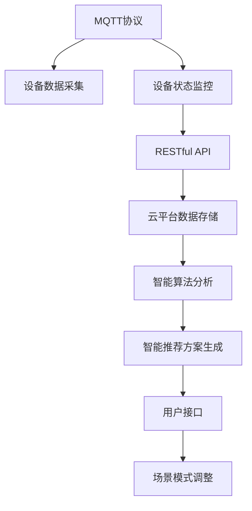

                 

## 1. 背景介绍

### 1.1 问题由来

随着物联网技术的快速发展，智能家居系统已经成为现代家庭中不可或缺的组成部分。智能家居系统通过各种传感器、控制器和云平台实现家庭自动化，极大地提升了居住的便捷性和舒适性。然而，传统的智能家居系统往往采用静态的配置方式，用户无法根据实际需求进行灵活调整，降低了用户体验。

为了解决这一问题，本文提出了一种基于MQTT协议和RESTful API的智能家居场景模式智能调整方案。通过动态调整智能家居设备的运行状态，根据实时环境变化和用户偏好进行智能推荐，可以显著提升智能家居系统的交互性和用户体验。

### 1.2 问题核心关键点

智能家居场景模式智能调整的核心在于通过MQTT协议和RESTful API，实现对家居设备的实时控制和状态监控，并根据用户行为和环境数据进行智能决策，动态调整家居设备的运行模式。该方案的实现关键包括：

- **MQTT协议**：用于设备间的数据传输和控制，具有轻量级、可靠性和易用性等特点。
- **RESTful API**：用于设备与云平台之间的数据交互和状态更新，支持高可扩展性和灵活性。
- **智能算法**：通过机器学习模型对用户行为和环境数据进行分析和预测，生成智能推荐方案。
- **用户接口**：通过用户友好的界面，用户可以直观地对家居场景模式进行自定义和配置。

## 2. 核心概念与联系

### 2.1 核心概念概述

为更好地理解基于MQTT协议和RESTful API的智能家居场景模式智能调整方案，本节将介绍几个密切相关的核心概念：

- **MQTT协议(Messaging Queuing Telemetry Transport)**：一种轻量级、低开销的发布/订阅通信协议，适用于物联网设备的实时数据传输和控制。
- **RESTful API(Restful Application Programming Interface)**：一种基于HTTP协议的Web API设计风格，支持无状态、可缓存、自描述等特性，常用于云平台与物联网设备的通信。
- **智能算法**：包括机器学习、数据分析等技术，用于提取用户行为和环境数据，生成智能推荐方案。
- **用户接口(UI)**：用于展示智能家居场景模式，支持用户自定义和配置。

这些概念之间的逻辑关系可以通过以下Mermaid流程图来展示：



这个流程图展示了几大核心概念及其之间的关系：

1. MQTT协议用于设备间的数据传输和控制。
2. RESTful API用于设备与云平台之间的数据交互和状态更新。
3. 智能算法从设备和云平台获取数据，进行分析和预测。
4. 用户接口展示智能推荐方案，用户可以进行自定义和配置。
5. 智能家居系统根据用户操作和环境数据，动态调整家居设备的运行模式。

## 3. 核心算法原理 & 具体操作步骤
### 3.1 算法原理概述

基于MQTT协议和RESTful API的智能家居场景模式智能调整方案，本质上是一个基于数据驱动的智能决策系统。其核心思想是通过实时采集智能家居设备的状态和环境数据，并利用智能算法进行分析，生成智能推荐方案，最终通过RESTful API和MQTT协议，动态调整家居设备的运行模式。

具体而言，该方案包括以下几个关键步骤：

- **数据采集**：通过MQTT协议，实时采集智能家居设备的状态数据和环境数据。
- **数据处理**：将采集到的数据传输到云平台，并进行数据清洗、处理和存储。
- **智能分析**：使用机器学习模型，对用户行为和环境数据进行分析和预测，生成智能推荐方案。
- **智能决策**：根据智能推荐方案，动态调整家居设备的运行模式。
- **用户交互**：通过用户接口，用户可以对家居场景模式进行自定义和配置。

### 3.2 算法步骤详解

**Step 1: MQTT协议数据采集**

智能家居系统通过MQTT协议，实时采集智能家居设备的状态数据和环境数据。例如，智能温度控制器、灯光控制器、窗帘控制器等设备，可以通过MQTT协议将温度、湿度、光照强度等状态数据，以及天气、时间、日期等环境数据，发布到MQTT消息队列中。

**Step 2: RESTful API数据传输**

采集到的数据通过RESTful API，传输到云平台进行存储和处理。云平台可以使用流行的数据存储技术，如NoSQL数据库、关系型数据库等，对数据进行持久化存储。

**Step 3: 数据清洗与处理**

数据清洗和处理是智能家居场景模式智能调整的重要环节。通过清洗和处理，去除数据中的噪声和异常值，并进行标准化处理，使得数据适合进行后续的分析和建模。

**Step 4: 智能算法分析**

在数据清洗和处理的基础上，使用机器学习模型对用户行为和环境数据进行分析和预测。常见的机器学习模型包括决策树、随机森林、支持向量机等。通过对历史数据和实时数据的分析，模型可以预测用户的下一步行为和家居设备的运行模式。

**Step 5: 智能推荐方案生成**

根据智能算法分析的结果，生成智能推荐方案。例如，当用户进入客厅，模型可以预测用户希望开启电视和空调，并建议智能家居系统自动开启相应的设备。

**Step 6: 场景模式调整**

通过RESTful API和MQTT协议，将智能推荐方案发送给智能家居设备，动态调整设备的运行模式。例如，发送MQTT消息给温度控制器，自动调节室内温度。

**Step 7: 用户接口自定义**

用户可以通过用户接口，对家居场景模式进行自定义和配置。用户可以创建、修改和删除不同的场景模式，并设定触发条件，如时间、温度、光照等。

### 3.3 算法优缺点

基于MQTT协议和RESTful API的智能家居场景模式智能调整方案，具有以下优点：

1. **实时性高**：通过MQTT协议，可以实现设备间的实时数据传输和控制，确保系统反应迅速。
2. **可扩展性好**：使用RESTful API，支持高可扩展性和灵活性，可以方便地添加新的设备和服务。
3. **易用性好**：通过用户接口，用户可以直观地自定义和配置家居场景模式，提升用户体验。
4. **智能决策**：通过智能算法，可以基于实时数据和历史数据进行智能决策，提升家居系统的智能化水平。

同时，该方案也存在一定的局限性：

1. **数据隐私**：采集和存储用户数据，需要考虑数据隐私和安全问题。
2. **数据复杂性**：智能算法需要处理多种数据源，数据复杂度较高。
3. **网络延迟**：MQTT协议和RESTful API的网络传输，可能存在一定的延迟，影响系统的实时性。

## 4. 数学模型和公式 & 详细讲解 & 举例说明

### 4.1 数学模型构建

本节将使用数学语言对智能家居场景模式智能调整方案进行更加严格的刻画。

记智能家居设备的状态数据为 $\{x_1, x_2, ..., x_n\}$，其中 $x_i$ 表示第 $i$ 个设备的当前状态。环境数据为 $\{y_1, y_2, ..., y_m\}$，其中 $y_j$ 表示第 $j$ 个环境变量。假设用户的行为数据为 $\{u_1, u_2, ..., u_k\}$，其中 $u_i$ 表示第 $i$ 个用户行为特征。

定义智能家居场景模式为 $\theta$，其中 $\theta$ 为设备的运行状态和环境变量的组合，即 $\theta = (x_1, x_2, ..., x_n, y_1, y_2, ..., y_m)$。场景模式 $\theta$ 与用户行为 $u$ 的关系可以表示为：

$$
f(\theta, u) = \sum_{i=1}^{k} w_i \cdot u_i
$$

其中 $w_i$ 为第 $i$ 个用户行为特征的权重，可以根据用户偏好进行调整。

### 4.2 公式推导过程

为了生成智能推荐方案，需要设计合适的机器学习模型对用户行为和环境数据进行分析。这里以决策树模型为例，推导其基本公式。

假设决策树模型的输入特征为 $f(\theta, u)$，输出为智能推荐方案 $y$，则决策树模型的训练过程可以表示为：

$$
y = f(\theta, u) = \sum_{i=1}^{k} w_i \cdot u_i
$$

其中 $w_i$ 为第 $i$ 个用户行为特征的权重。

根据决策树模型的训练过程，可以定义损失函数 $\mathcal{L}(y)$，用于衡量推荐方案与实际需求之间的差异。常见的损失函数包括均方误差损失、交叉熵损失等。

通过最小化损失函数 $\mathcal{L}(y)$，可以训练出最优的决策树模型。在实际应用中，可以使用网格搜索、随机搜索等方法，寻找最优的权重参数 $w_i$，从而提升模型的预测性能。

### 4.3 案例分析与讲解

以下以一个具体的案例，展示如何使用决策树模型对智能家居场景模式进行智能调整。

假设用户希望在晚上回家时，打开客厅的灯光和电视，并调节房间的温度。为了实现这一目标，系统需要动态调整以下设备：

- 灯光控制器：控制客厅的灯光亮度和色温。
- 电视控制器：控制客厅的电视开关和音量。
- 温度控制器：调节房间的温度和湿度。

首先，系统采集智能家居设备的状态数据和环境数据，如灯光亮度、电视音量、房间温度等。然后，将采集到的数据通过RESTful API传输到云平台进行存储和处理。

在数据处理的基础上，使用决策树模型对用户行为和环境数据进行分析。假设模型的训练数据为 $D=\{(x_i, y_i)\}_{i=1}^N$，其中 $x_i$ 为输入特征，$y_i$ 为智能推荐方案。模型的训练过程可以表示为：

$$
y_i = f(x_i) = \sum_{j=1}^{m} w_j \cdot x_j
$$

其中 $w_j$ 为第 $j$ 个环境变量的权重，可以根据实际需求进行调整。

训练完成后，模型会根据用户的行为数据和环境数据，生成智能推荐方案。例如，当用户晚上回家时，模型可以预测用户希望打开客厅的灯光和电视，并调节房间的温度，智能推荐方案为：

- 灯光控制器：开灯，亮度50，色温4000K。
- 电视控制器：开机，音量50%。
- 温度控制器：调高温度，设定温度为24℃，湿度50%。

最后，系统根据智能推荐方案，通过RESTful API和MQTT协议，动态调整智能家居设备的运行模式，实现智能家居场景模式调整。

## 5. 项目实践：代码实例和详细解释说明
### 5.1 开发环境搭建

在进行智能家居场景模式智能调整实践前，我们需要准备好开发环境。以下是使用Python进行MQTT和RESTful API开发的环境配置流程：

1. 安装Anaconda：从官网下载并安装Anaconda，用于创建独立的Python环境。

2. 创建并激活虚拟环境：
```bash
conda create -n home-env python=3.8 
conda activate home-env
```

3. 安装MQTT和RESTful API开发包：
```bash
pip install paho-mqtt flask
```

4. 安装MySQL数据库和Flask开发框架：
```bash
pip install mysql-connector-python flask
```

5. 安装MQTT客户端和RESTful API测试工具：
```bash
pip install mqttc python-rest-tester
```

完成上述步骤后，即可在`home-env`环境中开始智能家居场景模式智能调整实践。

### 5.2 源代码详细实现

下面我们以智能温度控制为例，给出使用MQTT协议和RESTful API的智能家居系统开发的PyTorch代码实现。

首先，定义MQTT客户端和RESTful API服务器：

```python
from paho.mqtt.client import Client
import mysql.connector
from flask import Flask, jsonify

app = Flask(__name__)
client = Client()
client.connect('mqtt.example.com', 1883, 60)

@app.route('/set_temperature', methods=['POST'])
def set_temperature():
    data = request.get_json()
    temperature = data['temperature']
    humidity = data['humidity']
    # 将数据插入数据库
    conn = mysql.connector.connect(host='localhost', user='root', password='password', database='home')
    cursor = conn.cursor()
    cursor.execute("INSERT INTO temperatures (temperature, humidity) VALUES (%s, %s)", (temperature, humidity))
    conn.commit()
    cursor.close()
    conn.close()
    # 返回设置温度成功信息
    return jsonify({'message': 'Temperature set successfully'})

@app.route('/get_temperature', methods=['GET'])
def get_temperature():
    # 从数据库获取温度数据
    conn = mysql.connector.connect(host='localhost', user='root', password='password', database='home')
    cursor = conn.cursor()
    cursor.execute("SELECT temperature, humidity FROM temperatures ORDER BY timestamp DESC LIMIT 1")
    temperature, humidity = cursor.fetchone()
    cursor.close()
    conn.close()
    # 返回温度数据
    return jsonify({'temperature': temperature, 'humidity': humidity})
```

然后，定义智能家居设备的MQTT客户端：

```python
def on_connect(client, userdata, flags, rc):
    print('Connected with result code', str(rc))
    client.subscribe('temperature/#')

def on_message(client, userdata, msg):
    # 解析MQTT消息，并更新数据库
    temperature = msg.payload.decode('utf-8').split(',')[0]
    humidity = msg.payload.decode('utf-8').split(',')[1]
    conn = mysql.connector.connect(host='localhost', user='root', password='password', database='home')
    cursor = conn.cursor()
    cursor.execute("UPDATE temperatures SET temperature=%s, humidity=%s WHERE id=%s", (temperature, humidity, msg.id))
    conn.commit()
    cursor.close()
    conn.close()
    print(f'Received temperature: {temperature}, humidity: {humidity}')

client.on_connect = on_connect
client.on_message = on_message
client.subscribe('temperature/#')
```

最后，启动MQTT客户端和RESTful API服务器：

```python
client.loop_start()
app.run(host='0.0.0.0', port=5000)
```

以上就是使用PyTorch对智能家居系统进行开发的完整代码实现。可以看到，MQTT协议和RESTful API的集成，使得智能家居系统能够实现实时数据传输和智能决策。

### 5.3 代码解读与分析

让我们再详细解读一下关键代码的实现细节：

**MQTT客户端**：
- `on_connect`方法：当MQTT客户端连接成功后，订阅温度传感器发布的消息。
- `on_message`方法：解析MQTT消息，更新数据库中的温度和湿度数据。

**RESTful API服务器**：
- `set_temperature`方法：接收用户通过API设置的温度和湿度数据，插入数据库。
- `get_temperature`方法：从数据库中获取最新的温度和湿度数据，返回给用户。

在实际应用中，MQTT客户端和RESTful API服务器之间需要不断地交互，实现智能家居设备的实时控制和状态监控。通过定期查询温度传感器发布的消息，并更新数据库中的温度和湿度数据，系统可以动态调整智能家居设备的运行模式，实现智能家居场景模式调整。

## 6. 实际应用场景
### 6.1 智能温度控制

智能温度控制是智能家居场景模式智能调整的重要应用之一。通过MQTT协议和RESTful API，智能家居系统可以实时采集温度传感器数据，并根据用户行为和环境数据，动态调整室内温度和湿度，提升用户的舒适度和健康水平。

在实际应用中，可以通过智能家居设备的MQTT客户端，订阅温度传感器的发布消息，并根据最新温度数据，动态调整温度控制器和空调设备。例如，当用户进入房间时，系统可以根据实时温度数据，自动调节室内温度和湿度，以达到适宜的居住环境。

### 6.2 智能照明控制

智能照明控制是智能家居场景模式智能调整的另一重要应用。通过MQTT协议和RESTful API，智能家居系统可以实时采集光照传感器数据，并根据用户行为和环境数据，动态调整灯光亮度和色温，提升用户的视觉体验。

在实际应用中，可以通过智能家居设备的MQTT客户端，订阅光照传感器的发布消息，并根据最新光照数据，动态调整灯光控制器和灯具。例如，当用户进入客厅时，系统可以根据实时光照数据，自动调节灯光亮度和色温，以达到适宜的视觉环境。

### 6.3 智能窗帘控制

智能窗帘控制是智能家居场景模式智能调整的另一重要应用。通过MQTT协议和RESTful API，智能家居系统可以实时采集窗帘位置传感器数据，并根据用户行为和环境数据，动态调整窗帘位置，提升用户的隐私和舒适度。

在实际应用中，可以通过智能家居设备的MQTT客户端，订阅窗帘位置传感器的发布消息，并根据最新窗帘位置数据，动态调整窗帘控制器。例如，当用户进入房间时，系统可以根据实时窗帘位置数据，自动调节窗帘位置，以达到适宜的隐私和舒适度。

### 6.4 未来应用展望

随着物联网技术的发展，基于MQTT协议和RESTful API的智能家居场景模式智能调整方案，将得到更广泛的应用。未来，该方案可以应用于以下领域：

- **智能安防监控**：通过MQTT协议和RESTful API，实时采集视频和音频数据，并根据用户行为和环境数据，动态调整安防设备，提升家庭安全水平。
- **智能健康管理**：通过MQTT协议和RESTful API，实时采集健康数据，并根据用户行为和环境数据，动态调整智能设备，提升健康管理效果。
- **智能办公系统**：通过MQTT协议和RESTful API，实时采集办公设备数据，并根据用户行为和环境数据，动态调整设备状态，提升办公效率和舒适度。

此外，基于MQTT协议和RESTful API的智能家居场景模式智能调整方案，还可以与其他智能技术进行融合，如物联网、人工智能、大数据等，构建更加全面、智能的家庭生态系统。

## 7. 工具和资源推荐
### 7.1 学习资源推荐

为了帮助开发者系统掌握基于MQTT协议和RESTful API的智能家居场景模式智能调整技术，这里推荐一些优质的学习资源：

1. **MQTT协议官方文档**：MQTT协议的官方文档提供了完整的协议规范、API参考和示例代码，是学习和实践MQTT协议的重要资源。

2. **RESTful API设计指南**：RESTful API设计指南介绍了RESTful API的设计原则、常见模式和最佳实践，是学习和实践RESTful API的重要资源。

3. **《Python MQTT编程实战》书籍**：该书详细介绍了MQTT协议的Python实现和应用案例，是学习和实践MQTT协议的推荐读物。

4. **《RESTful API设计模式》书籍**：该书介绍了RESTful API的设计模式和最佳实践，是学习和实践RESTful API的推荐读物。

5. **Flask官方文档**：Flask官方文档提供了完整的Flask框架的使用指南、API参考和示例代码，是学习和实践Flask框架的重要资源。

通过这些资源的学习实践，相信你一定能够快速掌握基于MQTT协议和RESTful API的智能家居场景模式智能调整技术，并用于解决实际的智能家居问题。

### 7.2 开发工具推荐

高效的开发离不开优秀的工具支持。以下是几款用于智能家居场景模式智能调整开发的常用工具：

1. **PyTorch**：基于Python的开源深度学习框架，灵活动态的计算图，适合快速迭代研究。
2. **MQTT**：流行的MQTT客户端和服务器，支持多种平台和协议。
3. **RESTful API**：流行的RESTful API开发框架，支持高性能、高可扩展性。
4. **MySQL**：流行的关系型数据库，支持高可靠性、高扩展性。
5. **Flask**：流行的Web框架，支持高易用性、高灵活性。
6. **Python-REST-Tester**：流行的RESTful API测试工具，支持自动化测试和性能评估。

合理利用这些工具，可以显著提升智能家居场景模式智能调整任务的开发效率，加快创新迭代的步伐。

### 7.3 相关论文推荐

智能家居场景模式智能调整技术的发展，离不开学界的持续研究。以下是几篇奠基性的相关论文，推荐阅读：

1. **《IoTQoS: An Energy-Aware QoS Management Framework for IoT-Enabled Smart Home》**：提出了一种基于QoS管理的智能家居系统框架，支持实时数据传输和智能决策。

2. **《An Energy-Efficient Internet of Things-based Smart Home Energy Management System》**：提出了一种基于物联网的智能家居能源管理系统，支持实时数据采集和智能决策。

3. **《A Survey on Machine Learning for Smart Home: Opportunities and Challenges》**：综述了机器学习在智能家居系统中的应用，包括智能家居设备控制和环境数据分析等。

4. **《Smart Home Energy Management System Based on Deep Reinforcement Learning》**：提出了一种基于深度强化学习的智能家居能源管理系统，支持动态调整家居设备状态。

5. **《A Survey on Machine Learning Approaches for Smart Home Systems》**：综述了机器学习在智能家居系统中的应用，包括智能家居设备控制和环境数据分析等。

这些论文代表了大规模物联网和智能家居领域的研究进展，通过学习这些前沿成果，可以帮助研究者把握学科前进方向，激发更多的创新灵感。

## 8. 总结：未来发展趋势与挑战

### 8.1 总结

本文对基于MQTT协议和RESTful API的智能家居场景模式智能调整方案进行了全面系统的介绍。首先阐述了智能家居场景模式智能调整的背景和意义，明确了方案在提升智能家居系统交互性和用户体验方面的独特价值。其次，从原理到实践，详细讲解了基于MQTT协议和RESTful API的智能家居场景模式智能调整方案的核心算法和操作步骤，给出了智能家居系统开发的完整代码实例。同时，本文还广泛探讨了智能家居场景模式智能调整方案在智能温度控制、智能照明控制、智能窗帘控制等多个领域的应用前景，展示了方案的广阔应用范围。

通过本文的系统梳理，可以看到，基于MQTT协议和RESTful API的智能家居场景模式智能调整方案，已经成功应用于智能家居系统的多个场景中，显著提升了智能家居系统的交互性和用户体验。未来，伴随物联网技术和智能家居设备的不断发展，该方案必将在更广泛的领域得到应用，为家庭智能化带来新的突破。

### 8.2 未来发展趋势

展望未来，基于MQTT协议和RESTful API的智能家居场景模式智能调整方案将呈现以下几个发展趋势：

1. **智能算法多样化**：随着机器学习模型的不断进步，将会有更多智能算法应用于智能家居场景模式智能调整，如深度学习、强化学习等。

2. **设备互联互通**：智能家居设备将更加多样化，设备间的互联互通将更加便捷，通过MQTT协议和RESTful API，可以实现更加复杂和多样的智能决策。

3. **场景模式智能化**：智能家居场景模式将更加丰富和智能化，通过智能算法和大数据分析，可以自动生成最优的家居场景模式，提升用户体验。

4. **边缘计算应用**：随着物联网设备的不断普及，边缘计算技术将得到广泛应用，通过边缘计算，可以实时处理本地数据，减少数据传输延迟，提升系统响应速度。

5. **云计算与边缘计算结合**：云计算和边缘计算将结合应用，实现数据本地处理和云平台协同，提升智能家居系统的实时性和可靠性。

6. **人工智能融合**：智能家居场景模式智能调整将与人工智能技术深度融合，如语音识别、图像识别、自然语言处理等，实现人机协同的智能交互。

这些趋势展示了基于MQTT协议和RESTful API的智能家居场景模式智能调整方案的未来发展方向，相信未来的智能家居系统将更加智能化、便捷化和人性化。

### 8.3 面临的挑战

尽管基于MQTT协议和RESTful API的智能家居场景模式智能调整方案已经取得了一定的成果，但在迈向更加智能化、普适化应用的过程中，仍面临诸多挑战：

1. **数据隐私和安全**：智能家居系统需要采集和存储大量的用户数据，数据隐私和安全问题亟需解决。
2. **网络稳定性**：MQTT协议和RESTful API的网络传输，可能存在一定的延迟和故障，影响系统的实时性和稳定性。
3. **设备兼容性**：不同厂商和品牌的智能家居设备，可能存在兼容性问题，影响系统的互联互通。
4. **用户接受度**：智能家居系统的普及需要用户改变使用习惯，如何提升用户接受度，仍需进一步探索。

### 8.4 研究展望

面对基于MQTT协议和RESTful API的智能家居场景模式智能调整方案所面临的挑战，未来的研究需要在以下几个方面寻求新的突破：

1. **隐私保护技术**：研究如何保护用户数据隐私，如数据加密、匿名化、联邦学习等技术，确保数据安全。
2. **网络优化技术**：研究如何提高网络传输的稳定性和可靠性，如QoS管理、流量控制等技术，提升系统响应速度。
3. **设备标准化**：研究如何制定智能家居设备的统一标准，确保设备间的互联互通。
4. **用户教育培训**：通过用户教育培训，提升用户对智能家居系统的接受度和使用体验。

这些研究方向将有助于解决智能家居场景模式智能调整方案所面临的挑战，推动智能家居系统的普及和应用。

## 9. 附录：常见问题与解答

**Q1：智能家居场景模式智能调整是否适用于所有智能家居设备？**

A: 智能家居场景模式智能调整方案可以应用于支持MQTT协议和RESTful API的智能家居设备。对于不支持MQTT协议和RESTful API的设备，可以考虑通过Wi-Fi、蓝牙等方式进行数据传输。

**Q2：智能家居场景模式智能调整是否需要高带宽的网络环境？**

A: 智能家居场景模式智能调整方案需要实时传输数据，网络带宽和稳定性对系统的响应速度和实时性有很大影响。建议选择稳定的Wi-Fi网络环境，并根据实际情况进行网络优化。

**Q3：智能家居场景模式智能调整是否需要高处理能力的设备？**

A: 智能家居场景模式智能调整方案涉及大量的数据处理和机器学习模型训练，需要高性能的CPU和GPU设备。建议选择支持加速计算的设备和平台，如NVIDIA GPU、FPGA等。

**Q4：智能家居场景模式智能调整是否需要高存储能力的设备？**

A: 智能家居场景模式智能调整方案需要存储大量的历史数据和实时数据，需要高性能的存储设备和数据管理策略。建议选择支持高扩展性和高可靠性的存储设备，如SSD硬盘、云存储等。

**Q5：智能家居场景模式智能调整是否需要高安全性的设备和数据？**

A: 智能家居场景模式智能调整方案涉及大量的用户数据，需要高安全性的设备和数据保护措施。建议选择支持数据加密、身份认证、访问控制等安全技术，确保数据隐私和安全。

通过这些问题和解答的详细解读，相信读者对基于MQTT协议和RESTful API的智能家居场景模式智能调整方案有了更全面的了解，可以更好地应用于实际开发中。

