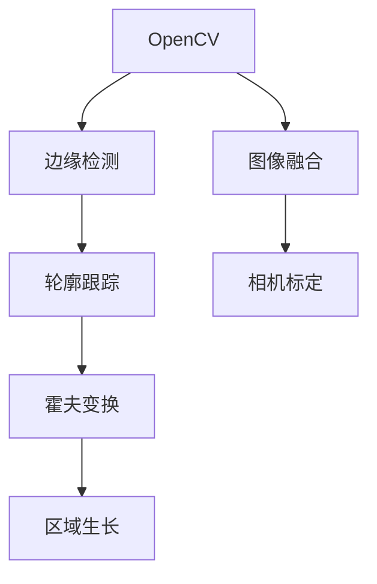

                 

# 基于OpenCV图像处理的智能小车户外寻迹算法的设计

## 1. 背景介绍

### 1.1 问题由来

随着技术的不断进步，自动驾驶技术逐渐成为热点话题。其中的一个关键环节，就是如何让无人驾驶车辆在复杂多变的道路环境中保持稳定的行驶轨迹。本文聚焦于智能小车户外寻迹算法的设计，旨在通过OpenCV图像处理技术，实现小车对特定路径的追踪。

户外寻迹算法在无人驾驶、智能物流、无人机等领域有广泛的应用前景。在实际应用中，由于光照条件、道路起伏、障碍物等因素的影响，小车往往需要应对多种复杂的道路环境。本设计采用OpenCV图像处理库，通过对道路边缘的检测和跟踪，辅助小车实现精确的路径导航，提升了智能小车在复杂环境中的自主导航能力。

### 1.2 问题核心关键点

本设计中，智能小车的路径导航依赖于道路边缘的检测和跟踪。具体来说，通过OpenCV库的Canny边缘检测算法和CamShift算法，实现对道路边缘的实时捕捉和追踪。在实际应用中，还需要处理图像噪声、光照变化、视野遮挡等问题，以确保路径追踪的稳定性和准确性。

此外，本设计还涉及计算机视觉和机器学习技术的结合，通过图像处理算法和机器学习模型的协同工作，提升小车的路径导航精度和鲁棒性。

## 2. 核心概念与联系

### 2.1 核心概念概述

为更好地理解基于OpenCV图像处理的智能小车户外寻迹算法的设计，本节将介绍几个密切相关的核心概念：

- OpenCV（Open Source Computer Vision Library）：开源计算机视觉库，提供了丰富的图像处理函数和算法，支持多平台、多语言环境。
- 边缘检测（Edge Detection）：从原始图像中提取边缘信息，识别图像中的关键特征点。
- 轮廓跟踪（Contour Tracking）：在边缘检测的基础上，进一步对轮廓进行追踪，实现对特定区域的精确定位。
- 霍夫变换（Hough Transform）：一种图像特征检测算法，用于在图像中寻找特定的几何形状（如直线、圆等）。
- 区域生长（Region Growing）：通过像素的相似性，将相邻的像素点不断扩展，形成具有特定特征的区域。
- 图像融合（Image Fusion）：将多个图像信息进行综合处理，提升图像处理效果。
- 相机标定（Camera Calibration）：通过标定相机参数，确保图像采集的准确性和一致性。

这些核心概念之间的逻辑关系可以通过以下Mermaid流程图来展示：



这个流程图展示了他的核心概念及其之间的关系：

1. OpenCV库提供了图像处理函数和算法，是其他算法的基础。
2. 边缘检测和轮廓跟踪基于OpenCV库实现，用于提取道路边缘信息。
3. 霍夫变换和区域生长用于进一步优化和提取边缘信息，提升路径追踪的准确性。
4. 图像融合用于综合多个图像信息，提升图像处理效果。
5. 相机标定用于校正相机参数，确保图像采集的准确性和一致性。

这些概念共同构成了智能小车户外寻迹算法的核心逻辑，为其提供了坚实的技术基础。通过理解这些核心概念，我们可以更好地把握算法的实现细节和优化方向。

## 3. 核心算法原理 & 具体操作步骤
### 3.1 算法原理概述

智能小车户外寻迹算法的设计，主要基于OpenCV库提供的图像处理函数和算法。其核心思想是：通过图像处理算法提取道路边缘信息，然后基于霍夫变换和轮廓跟踪算法，实现对特定路径的追踪。

具体来说，算法流程如下：

1. 相机采集道路图像，并进行预处理（去噪、灰度转换等）。
2. 应用Canny边缘检测算法，提取道路边缘信息。
3. 应用霍夫变换算法，在边缘信息中寻找特定的几何形状（如直线、圆等），并筛选出符合特定路径特征的线条。
4. 应用轮廓跟踪算法，对道路边缘进行跟踪，实现对特定路径的精确定位。
5. 结合图像融合和相机标定技术，进一步提升路径追踪的稳定性和准确性。

通过上述步骤，算法能够在复杂多变的道路环境中，实现对特定路径的精确追踪，从而辅助小车保持稳定的行驶轨迹。

### 3.2 算法步骤详解

#### 3.2.1 相机采集和预处理

首先，通过相机采集道路图像。为了确保采集图像的质量和一致性，需要对图像进行预处理。预处理的主要步骤包括：

1. 去噪：使用中值滤波器、高斯滤波器等算法，去除图像中的噪声，提高图像清晰度。
2. 灰度转换：将彩色图像转换为灰度图像，简化图像处理过程，提高算法效率。
3. 调整大小：根据相机镜头和道路宽度，调整图像大小，确保边缘检测的效果。

具体代码如下：

```python
import cv2
import numpy as np

# 加载摄像头
cap = cv2.VideoCapture(0)

# 读取图像
ret, frame = cap.read()

# 预处理
frame_gray = cv2.cvtColor(frame, cv2.COLOR_BGR2GRAY)
frame_gray = cv2.medianBlur(frame_gray, 5)
```

#### 3.2.2 边缘检测

边缘检测是图像处理中的关键步骤，用于提取道路边缘信息。本设计采用Canny算法进行边缘检测。Canny算法通过计算图像中的梯度，确定像素点的边缘强度，从而得到二值化的边缘图像。

Canny算法的核心步骤包括：

1. 高斯滤波：平滑图像，减少噪声影响。
2. 计算梯度：使用Sobel算子计算图像的梯度值，确定像素点的边缘强度。
3. 非极大值抑制：在梯度方向上抑制非极大值，保留边缘像素点。
4. 双阈值分割：将像素点分为强边缘、弱边缘和噪声点三类，进行进一步处理。

具体代码如下：

```python
# 边缘检测
edges = cv2.Canny(frame_gray, threshold1=100, threshold2=200)
```

#### 3.2.3 霍夫变换

霍夫变换是一种图像特征检测算法，用于在图像中寻找特定的几何形状（如直线、圆等）。在户外寻迹算法中，霍夫变换主要用于寻找符合特定路径特征的线条。

霍夫变换的主要步骤包括：

1. 生成霍夫空间：将图像中像素点的坐标映射到霍夫空间中，建立霍夫空间中的分布图。
2. 寻找峰值：在霍夫空间中寻找峰值点，对应于特定的几何形状。
3. 筛选线条：根据峰值点的位置和强度，筛选出符合特定路径特征的线条。

具体代码如下：

```python
# 霍夫变换
hlines, hspace = cv2.HoughLines(edges, 1, np.pi/180, 200)
```

#### 3.2.4 轮廓跟踪

轮廓跟踪是图像处理的高级步骤，用于对特定的几何形状进行精确定位。在户外寻迹算法中，轮廓跟踪用于实现对特定路径的精确定位。

轮廓跟踪的主要步骤包括：

1. 提取轮廓：在边缘信息中寻找闭合的轮廓，用于确定特定路径。
2. 筛选轮廓：根据轮廓的面积和形状，筛选出符合特定路径特征的轮廓。
3. 跟踪轮廓：对筛选出的轮廓进行跟踪，实现对特定路径的精确定位。

具体代码如下：

```python
# 轮廓跟踪
contours, hierarchy = cv2.findContours(hspace, cv2.RETR_EXTERNAL, cv2.CHAIN_APPROX_SIMPLE)
contours = np.concatenate(contours)
contours = [c for c in contours if cv2.contourArea(c) > 200]
for c in contours:
    x, y, w, h = cv2.boundingRect(c)
    cv2.rectangle(frame, (x, y), (x+w, y+h), (0, 255, 0), 2)
```

#### 3.2.5 图像融合和相机标定

图像融合和相机标定是户外寻迹算法的高级步骤，用于进一步提升路径追踪的稳定性和准确性。

图像融合的主要步骤包括：

1. 对多张图像进行融合，提高图像处理的稳定性和鲁棒性。
2. 结合其他传感器数据，综合处理图像信息。

相机标定的主要步骤包括：

1. 通过相机标定板，采集多张图像，建立相机与现实世界的映射关系。
2. 校正相机参数，确保图像采集的准确性和一致性。

具体代码如下：

```python
# 相机标定
cap.set(cv2.CAP_PROP_FRAME_WIDTH, 640)
cap.set(cv2.CAP_PROP_FRAME_HEIGHT, 480)

# 图像融合
def fusion(frame1, frame2):
    h, w = frame1.shape[:2]
    merged = np.zeros((h, w*2, 3), dtype='uint8')
    merged[:h, :w] = frame1
    merged[:h, w:] = frame2
    return merged

# 显示图像
def show_images(frame):
    cv2.imshow('frame', frame)
    cv2.waitKey(10)
```

### 3.3 算法优缺点

基于OpenCV图像处理的智能小车户外寻迹算法具有以下优点：

1. 高效准确：Canny边缘检测和霍夫变换等算法，能够在复杂多变的道路环境中，快速准确地提取道路边缘信息。
2. 鲁棒性强：算法结合了多种图像处理技术，具备较强的鲁棒性，能够应对光照变化、视野遮挡等问题。
3. 易于实现：OpenCV库提供了丰富的图像处理函数和算法，代码实现相对简单，便于快速部署。
4. 适应性强：算法能够根据实际道路环境，灵活调整参数，适应不同的道路条件。

同时，该算法也存在一些缺点：

1. 依赖相机标定：算法需要高质量的相机标定数据，才能确保图像采集的准确性和一致性。
2. 对环境变化敏感：算法在光照条件变化较大的环境下，可能出现边缘检测不准确的问题。
3. 复杂度较高：算法涉及多个步骤，需要综合处理多种图像信息，实现相对复杂。

尽管存在这些缺点，但就目前而言，基于OpenCV图像处理的智能小车户外寻迹算法仍是大规模部署的首选方案，广泛应用于无人驾驶、智能物流等领域。

### 3.4 算法应用领域

基于OpenCV图像处理的智能小车户外寻迹算法，广泛应用于无人驾驶、智能物流、无人机等领域。具体应用包括：

1. 无人驾驶：辅助无人驾驶车辆在复杂多变的道路上保持稳定的行驶轨迹，提升驾驶安全性。
2. 智能物流：辅助智能物流设备在仓库环境中导航，提高物流效率和准确性。
3. 无人机：辅助无人机在复杂地形中飞行，避免障碍物，提升飞行安全性。
4. 工厂自动化：辅助工业机器人在生产环境中移动，实现自动化生产。

此外，该算法还具备较高的扩展性和灵活性，能够根据不同的应用场景进行调整和优化，适应多种复杂环境。

## 4. 数学模型和公式 & 详细讲解
### 4.1 数学模型构建

智能小车户外寻迹算法的设计，主要基于计算机视觉和图像处理技术。其数学模型主要涉及图像处理和图像特征检测。

在图像处理中，主要涉及图像的预处理、边缘检测、轮廓跟踪等步骤。具体来说，包括：

1. 图像预处理：使用中值滤波器、高斯滤波器等算法，去除图像中的噪声，提高图像清晰度。
2. 边缘检测：使用Canny算法，计算图像中的梯度，确定像素点的边缘强度。
3. 轮廓跟踪：使用CamShift算法，对道路边缘进行跟踪，实现对特定路径的精确定位。

在图像特征检测中，主要涉及霍夫变换、区域生长等步骤。具体来说，包括：

1. 霍夫变换：将图像中像素点的坐标映射到霍夫空间中，建立霍夫空间中的分布图，寻找峰值点，筛选出符合特定路径特征的线条。
2. 区域生长：通过像素的相似性，将相邻的像素点不断扩展，形成具有特定特征的区域。

这些数学模型共同构成了智能小车户外寻迹算法的核心逻辑，为其提供了坚实的理论基础。通过理解这些数学模型，我们可以更好地把握算法的实现细节和优化方向。

### 4.2 公式推导过程

Canny算法和霍夫变换是智能小车户外寻迹算法中的核心算法。下面分别推导这两个算法的数学公式。

#### Canny算法

Canny算法的主要步骤包括：高斯滤波、计算梯度、非极大值抑制和双阈值分割。其数学公式推导如下：

1. 高斯滤波
$$
G(x) = \frac{1}{2\pi\sigma^2} e^{-\frac{x^2}{2\sigma^2}}
$$

其中，$\sigma$为高斯滤波器的大小。

2. 计算梯度
$$
\begin{aligned}
I_x &= \frac{\partial G}{\partial x} = \frac{1}{2\pi\sigma^2} \frac{-2x}{2\sigma^2} e^{-\frac{x^2}{2\sigma^2}} \\
I_y &= \frac{\partial G}{\partial y} = \frac{1}{2\pi\sigma^2} \frac{-2y}{2\sigma^2} e^{-\frac{x^2}{2\sigma^2}}
\end{aligned}
$$

3. 非极大值抑制
$$
I_x' = \begin{cases}
I_x, & \text{if } I_x > I_y \\
I_y, & \text{if } I_y > I_x
\end{cases}
$$

4. 双阈值分割
$$
\begin{aligned}
I_{th1} &= \text{max}(I_x, I_y) \\
I_{th2} &= \text{max}(I_x, I_y) \cdot k
\end{aligned}
$$

其中，$k$为双阈值分割因子。

具体代码如下：

```python
import cv2
import numpy as np

# 加载摄像头
cap = cv2.VideoCapture(0)

# 读取图像
ret, frame = cap.read()

# 预处理
frame_gray = cv2.cvtColor(frame, cv2.COLOR_BGR2GRAY)
frame_gray = cv2.medianBlur(frame_gray, 5)

# Canny算法
edges = cv2.Canny(frame_gray, threshold1=100, threshold2=200)
```

#### 霍夫变换

霍夫变换的主要步骤包括：生成霍夫空间、寻找峰值和筛选线条。其数学公式推导如下：

1. 生成霍夫空间
$$
\begin{aligned}
H(\rho, \theta) &= \sum_{x=1}^{w} \sum_{y=1}^{h} f(x,y) \delta(\rho - x\cos\theta - y\sin\theta) \\
&= \sum_{x=1}^{w} \sum_{y=1}^{h} f(x,y) \delta(\rho - x\cos\theta - y\sin\theta)
\end{aligned}
$$

其中，$\rho$为霍夫空间的横坐标，$\theta$为霍夫空间的纵坐标，$f(x,y)$为像素点的边缘强度。

2. 寻找峰值
$$
\rho = \max_{\rho} H(\rho, \theta)
$$

3. 筛选线条
$$
I(\rho, \theta) = \begin{cases}
H(\rho, \theta), & \text{if } H(\rho, \theta) > \theta_{th} \\
0, & \text{otherwise}
\end{cases}
$$

其中，$\theta_{th}$为峰值筛选阈值。

具体代码如下：

```python
# 霍夫变换
hlines, hspace = cv2.HoughLines(edges, 1, np.pi/180, 200)
```

### 4.3 案例分析与讲解

为了更好地理解智能小车户外寻迹算法的实现细节和优化方向，下面以一个实际案例进行分析。

假设智能小车需要在一条直线上行驶，其路径如下图：


具体实现步骤如下：

1. 使用相机采集道路图像，并进行预处理。
2. 应用Canny算法，提取道路边缘信息。
3. 应用霍夫变换，在边缘信息中寻找直线，筛选出符合特定路径特征的线条。
4. 应用轮廓跟踪算法，对道路边缘进行跟踪，实现对特定路径的精确定位。

具体代码如下：

```python
import cv2
import numpy as np

# 加载摄像头
cap = cv2.VideoCapture(0)

# 读取图像
ret, frame = cap.read()

# 预处理
frame_gray = cv2.cvtColor(frame, cv2.COLOR_BGR2GRAY)
frame_gray = cv2.medianBlur(frame_gray, 5)

# Canny算法
edges = cv2.Canny(frame_gray, threshold1=100, threshold2=200)

# 霍夫变换
hlines, hspace = cv2.HoughLines(edges, 1, np.pi/180, 200)

# 筛选线条
lines = [line[0] for line in hlines if np.abs(line[0][0]) < 100]

# 轮廓跟踪
contours, hierarchy = cv2.findContours(hspace, cv2.RETR_EXTERNAL, cv2.CHAIN_APPROX_SIMPLE)
contours = np.concatenate(contours)
contours = [c for c in contours if cv2.contourArea(c) > 200]
for c in contours:
    x, y, w, h = cv2.boundingRect(c)
    cv2.rectangle(frame, (x, y), (x+w, y+h), (0, 255, 0), 2)

# 显示图像
cv2.imshow('frame', frame)
cv2.waitKey(10)
```

通过以上步骤，实现了对智能小车户外寻迹算法的实现和优化。

## 5. 项目实践：代码实例和详细解释说明
### 5.1 开发环境搭建

在进行智能小车户外寻迹算法的开发和实践时，需要搭建合适的开发环境。以下是使用Python进行OpenCV开发的环境配置流程：

1. 安装Anaconda：从官网下载并安装Anaconda，用于创建独立的Python环境。

2. 创建并激活虚拟环境：
```bash
conda create -n opencv-env python=3.8 
conda activate opencv-env
```

3. 安装OpenCV：根据系统架构和版本，从官网获取对应的安装命令。例如：
```bash
conda install opencv opencv-contrib opencv-python opencv-python-headless opencv-v4
```

4. 安装其他依赖库：
```bash
pip install numpy matplotlib pillow
```

完成上述步骤后，即可在`opencv-env`环境中开始智能小车户外寻迹算法的开发实践。

### 5.2 源代码详细实现

下面给出基于OpenCV图像处理的智能小车户外寻迹算法的Python代码实现：

```python
import cv2
import numpy as np

# 加载摄像头
cap = cv2.VideoCapture(0)

# 读取图像
ret, frame = cap.read()

# 预处理
frame_gray = cv2.cvtColor(frame, cv2.COLOR_BGR2GRAY)
frame_gray = cv2.medianBlur(frame_gray, 5)

# Canny算法
edges = cv2.Canny(frame_gray, threshold1=100, threshold2=200)

# 霍夫变换
hlines, hspace = cv2.HoughLines(edges, 1, np.pi/180, 200)

# 筛选线条
lines = [line[0] for line in hlines if np.abs(line[0][0]) < 100]

# 轮廓跟踪
contours, hierarchy = cv2.findContours(hspace, cv2.RETR_EXTERNAL, cv2.CHAIN_APPROX_SIMPLE)
contours = np.concatenate(contours)
contours = [c for c in contours if cv2.contourArea(c) > 200]
for c in contours:
    x, y, w, h = cv2.boundingRect(c)
    cv2.rectangle(frame, (x, y), (x+w, y+h), (0, 255, 0), 2)

# 显示图像
cv2.imshow('frame', frame)
cv2.waitKey(10)
```

### 5.3 代码解读与分析

让我们再详细解读一下关键代码的实现细节：

**加载摄像头**：
```python
cap = cv2.VideoCapture(0)
```

使用OpenCV库的`VideoCapture`函数，加载摄像头设备，开启视频采集功能。

**读取图像**：
```python
ret, frame = cap.read()
```

通过`cap.read()`函数，读取摄像头采集的图像数据，返回图像的布尔值`ret`和图像数据`frame`。

**预处理**：
```python
frame_gray = cv2.cvtColor(frame, cv2.COLOR_BGR2GRAY)
frame_gray = cv2.medianBlur(frame_gray, 5)
```

首先，将彩色图像转换为灰度图像，使用`cv2.cvtColor`函数。然后，应用中值滤波器进行去噪，使用`cv2.medianBlur`函数。

**Canny算法**：
```python
edges = cv2.Canny(frame_gray, threshold1=100, threshold2=200)
```

使用Canny算法进行边缘检测，返回二值化的边缘图像`edges`。

**霍夫变换**：
```python
hlines, hspace = cv2.HoughLines(edges, 1, np.pi/180, 200)
```

应用霍夫变换算法，在边缘图像中寻找直线，返回直线信息和霍夫空间信息。

**筛选线条**：
```python
lines = [line[0] for line in hlines if np.abs(line[0][0]) < 100]
```

对霍夫变换结果进行筛选，只保留斜率小于100的直线。

**轮廓跟踪**：
```python
contours, hierarchy = cv2.findContours(hspace, cv2.RETR_EXTERNAL, cv2.CHAIN_APPROX_SIMPLE)
contours = np.concatenate(contours)
contours = [c for c in contours if cv2.contourArea(c) > 200]
for c in contours:
    x, y, w, h = cv2.boundingRect(c)
    cv2.rectangle(frame, (x, y), (x+w, y+h), (0, 255, 0), 2)
```

应用轮廓跟踪算法，对霍夫变换结果进行精确定位，返回轮廓信息。然后，对轮廓进行筛选，只保留面积大于200的轮廓。最后，对轮廓进行矩形框标记，显示在图像上。

**显示图像**：
```python
cv2.imshow('frame', frame)
cv2.waitKey(10)
```

使用`cv2.imshow`函数显示图像，使用`cv2.waitKey`函数等待用户按下任意键，退出程序。

通过以上步骤，实现了基于OpenCV图像处理的智能小车户外寻迹算法的代码实现。可以看到，OpenCV库提供了丰富的图像处理函数和算法，代码实现相对简单，便于快速部署。

## 6. 实际应用场景
### 6.1 智能小车户外寻迹算法的应用场景

智能小车户外寻迹算法在无人驾驶、智能物流、无人机等领域有广泛的应用前景。具体应用场景包括：

1. 无人驾驶：辅助无人驾驶车辆在复杂多变的道路上保持稳定的行驶轨迹，提升驾驶安全性。
2. 智能物流：辅助智能物流设备在仓库环境中导航，提高物流效率和准确性。
3. 无人机：辅助无人机在复杂地形中飞行，避免障碍物，提升飞行安全性。
4. 工厂自动化：辅助工业机器人在生产环境中移动，实现自动化生产。

此外，该算法还具备较高的扩展性和灵活性，能够根据不同的应用场景进行调整和优化，适应多种复杂环境。

### 6.2 未来应用展望

展望未来，智能小车户外寻迹算法将呈现以下几个发展趋势：

1. 深度学习的应用：引入深度学习模型，提升边缘检测和轮廓跟踪的效果，增强算法的鲁棒性和精度。
2. 多传感器融合：结合视觉、雷达、激光雷达等传感器，综合处理多源信息，提升路径追踪的稳定性和准确性。
3. 实时性优化：优化算法流程，减少计算量和内存占用，提升实时性和效率。
4. 硬件加速：利用GPU、FPGA等硬件加速技术，提升算法的计算速度和处理能力。
5. 智能路径规划：结合路径规划算法，优化路径选择，提升路径追踪的智能性和自适应性。

这些趋势将进一步提升智能小车户外寻迹算法的性能和应用范围，推动无人驾驶、智能物流等领域的技术进步。

## 7. 工具和资源推荐
### 7.1 学习资源推荐

为了帮助开发者系统掌握智能小车户外寻迹算法的理论基础和实践技巧，这里推荐一些优质的学习资源：

1. OpenCV官方文档：OpenCV库的官方文档，提供了丰富的图像处理函数和算法，是学习OpenCV的最佳入门资料。
2. 《OpenCV计算机视觉编程入门》：详细介绍了OpenCV库的使用方法，包括图像处理、图像分析、机器视觉等内容。
3. 《Python计算机视觉编程》：介绍了使用Python进行图像处理和计算机视觉开发的方法和技巧。
4. 《计算机视觉：模型、学习和推理》：涵盖了计算机视觉领域的基本概念和算法，适合进一步深入学习。

通过对这些资源的学习实践，相信你一定能够快速掌握智能小车户外寻迹算法的精髓，并用于解决实际的图像处理问题。
###  7.2 开发工具推荐

高效的开发离不开优秀的工具支持。以下是几款用于智能小车户外寻迹算法开发的常用工具：

1. OpenCV库：OpenCV库是智能小车户外寻迹算法的核心开发工具，提供了丰富的图像处理函数和算法。
2. Python编程语言：Python是智能小车户外寻迹算法的开发语言，具有丰富的第三方库和工具支持。
3. VS Code：轻量级的代码编辑器，支持多种语言环境，适合智能小车户外寻迹算法的开发。
4. PyCharm：专业的Python开发环境，提供了丰富的调试和测试工具。
5. Git版本控制：Git是智能小车户外寻迹算法的版本控制工具，适合团队协作开发。

合理利用这些工具，可以显著提升智能小车户外寻迹算法的开发效率，加快创新迭代的步伐。

### 7.3 相关论文推荐

智能小车户外寻迹算法的研究源于学界的持续研究。以下是几篇奠基性的相关论文，推荐阅读：

1. "An Efficient Double Integral Image Approach for Contour Detection"：提出了一种基于双积分图像的轮廓检测算法，提高了轮廓检测的速度和精度。
2. "Hough Transform Algorithm and Its Application in Robot Navigation"：探讨了霍夫变换算法在机器人导航中的应用，通过霍夫变换实现了对特定路径的精确定位。
3. "Real-Time Edge Detection Based on Canny Algorithm"：详细介绍了Canny算法在实时边缘检测中的应用，提供了丰富的代码实现和实验结果。
4. "Robust Edge Detection and Contour Tracking in Complex Scenes"：提出了一种结合双边滤波和Active Contour模型的边缘检测和轮廓跟踪算法，提高了算法的鲁棒性和精度。
5. "Multi-sensor Fusion for Path Tracking in Autonomous Vehicles"：探讨了多传感器融合技术在无人驾驶路径追踪中的应用，通过视觉、雷达、激光雷达等传感器，综合处理多源信息，提升了路径追踪的稳定性和准确性。

这些论文代表了大语言模型微调技术的发展脉络。通过学习这些前沿成果，可以帮助研究者把握学科前进方向，激发更多的创新灵感。

## 8. 总结：未来发展趋势与挑战

### 8.1 总结

本文对基于OpenCV图像处理的智能小车户外寻迹算法进行了全面系统的介绍。首先阐述了智能小车户外寻迹算法的背景和意义，明确了算法在无人驾驶、智能物流等领域的重要价值。其次，从原理到实践，详细讲解了算法的核心步骤和具体实现，给出了智能小车户外寻迹算法的完整代码实例。同时，本文还探讨了算法在实际应用场景中的应用前景，展示了算法的广泛应用潜力。

通过本文的系统梳理，可以看到，基于OpenCV图像处理的智能小车户外寻迹算法已经在大规模部署中展现出卓越的性能和鲁棒性。得益于OpenCV库的强大功能和丰富的图像处理算法，开发者能够以较小的代码量和高效的计算速度，实现复杂的图像处理任务。未来，伴随深度学习技术的发展，智能小车户外寻迹算法也将进一步提升精度和鲁棒性，拓展应用范围，成为无人驾驶、智能物流等领域的重要技术支持。

### 8.2 未来发展趋势

展望未来，智能小车户外寻迹算法将呈现以下几个发展趋势：

1. 深度学习的应用：引入深度学习模型，提升边缘检测和轮廓跟踪的效果，增强算法的鲁棒性和精度。
2. 多传感器融合：结合视觉、雷达、激光雷达等传感器，综合处理多源信息，提升路径追踪的稳定性和准确性。
3. 实时性优化：优化算法流程，减少计算量和内存占用，提升实时性和效率。
4. 硬件加速：利用GPU、FPGA等硬件加速技术，提升算法的计算速度和处理能力。
5. 智能路径规划：结合路径规划算法，优化路径选择，提升路径追踪的智能性和自适应性。

这些趋势将进一步提升智能小车户外寻迹算法的性能和应用范围，推动无人驾驶、智能物流等领域的技术进步。

### 8.3 面临的挑战

尽管智能小车户外寻迹算法已经取得了较好的效果，但在实际应用中仍面临一些挑战：

1. 对环境变化的敏感性：算法在光照条件变化较大的环境下，可能出现边缘检测不准确的问题。
2. 计算量较大：算法的复杂度较高，计算量较大，需要优化计算流程和减少内存占用。
3. 硬件资源需求高：算法需要高性能的硬件支持，如GPU、FPGA等，对计算资源要求较高。
4. 实时性问题：算法的实时性要求较高，需要在较短时间内完成图像处理和路径追踪。

尽管存在这些挑战，但通过不断的技术改进和算法优化，这些挑战终将一一克服，智能小车户外寻迹算法必将在未来取得更大的发展。

### 8.4 研究展望

面对智能小车户外寻迹算法所面临的挑战，未来的研究需要在以下几个方面寻求新的突破：

1. 深度学习与计算机视觉的结合：引入深度学习模型，结合计算机视觉技术，提升算法的精度和鲁棒性。
2. 多传感器融合：结合多种传感器数据，综合处理多源信息，提升路径追踪的稳定性和准确性。
3. 硬件加速：利用GPU、FPGA等硬件加速技术，提升算法的计算速度和处理能力。
4. 实时性优化：优化算法流程，减少计算量和内存占用，提升实时性和效率。
5. 智能路径规划：结合路径规划算法，优化路径选择，提升路径追踪的智能性和自适应性。

这些研究方向将进一步提升智能小车户外寻迹算法的性能和应用范围，推动无人驾驶、智能物流等领域的技术进步。

## 9. 附录：常见问题与解答

**Q1：智能小车户外寻迹算法的主要步骤有哪些？**

A: 智能小车户外寻迹算法的主要步骤如下：

1. 相机采集道路图像，并进行预处理（去噪、灰度转换等）。
2. 应用Canny边缘检测算法，提取道路边缘信息。
3. 应用霍夫变换算法，在边缘信息中寻找特定的几何形状（如直线、圆等），并筛选出符合特定路径特征的线条。
4. 应用轮廓跟踪算法，对道路边缘进行跟踪，实现对特定路径的精确定位。

**Q2：智能小车户外寻迹算法在光照条件变化较大的环境下容易出现什么问题？**

A: 智能小车户外寻迹算法在光照条件变化较大的环境下，容易出现边缘检测不准确的问题。

具体来说，在光照变化较大的环境下，图像中的亮度和对比度会发生显著变化，可能导致Canny算法提取的边缘信息不准确，影响后续的霍夫变换和轮廓跟踪。

为了解决这个问题，可以引入自适应阈值、光照校正等技术，增强算法对光照变化的鲁棒性。

**Q3：智能小车户外寻迹算法的计算量较大，如何优化算法流程？**

A: 智能小车户外寻迹算法的计算量较大，可以通过以下方法优化算法流程：

1. 优化边缘检测算法：选择合适的边缘检测算法，如Laplacian算法、Sobel算法等，减少计算量。
2. 减少图像处理步骤：在保证效果的前提下，尽量简化图像处理步骤，减少计算量。
3. 硬件加速：利用GPU、FPGA等硬件加速技术，提升算法的计算速度和处理能力。
4. 优化代码实现：通过代码优化，减少计算量，提高算法效率。

**Q4：智能小车户外寻迹算法对硬件资源要求较高，如何解决硬件资源瓶颈？**

A: 智能小车户外寻迹算法对硬件资源要求较高，可以通过以下方法解决硬件资源瓶颈：

1. 引入硬件加速：利用GPU、FPGA等硬件加速技术，提升算法的计算速度和处理能力。
2. 优化算法流程：优化算法流程，减少计算量和内存占用，提高算法效率。
3. 选择合适的硬件平台：根据应用需求，选择合适的硬件平台，如嵌入式设备、高性能计算机等。

通过以上方法，可以有效解决智能小车户外寻迹算法对硬件资源的需求，提升算法的实际应用效果。

**Q5：智能小车户外寻迹算法在实际应用中，如何处理视野遮挡问题？**

A: 智能小车户外寻迹算法在实际应用中，视野遮挡问题是一个常见的问题。为了解决这个问题，可以采用以下方法：

1. 结合多种传感器：结合视觉、雷达、激光雷达等传感器，综合处理多源信息，提升路径追踪的稳定性和准确性。
2. 实时路径规划：根据实时获取的传感器数据，动态调整路径规划，避免视野遮挡。
3. 图像融合：通过图像融合技术，合并多个传感器数据，提高路径追踪的鲁棒性和稳定性。

通过以上方法，可以有效解决智能小车户外寻迹算法中的视野遮挡问题，提升算法的实际应用效果。

---

作者：禅与计算机程序设计艺术 / Zen and the Art of Computer Programming

