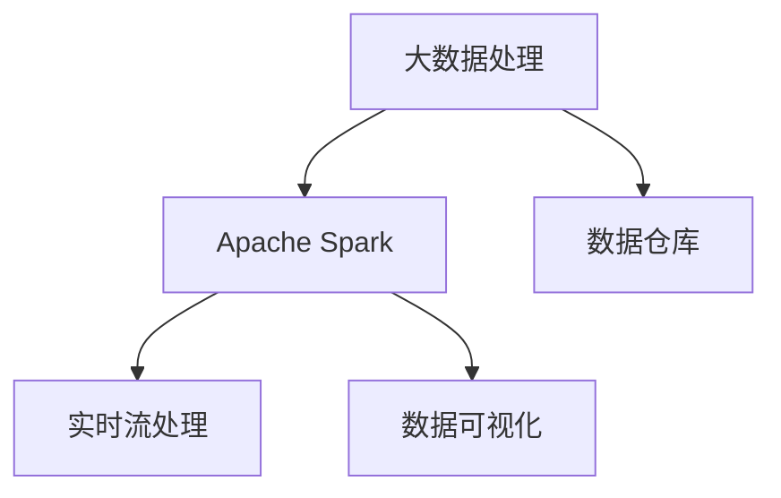

                 

# 基于spark的航空数据分析系统的设计与实现

> 关键词：大数据, 航空数据分析, Spark, 系统设计, 数据处理, 实时性, 高效性

## 1. 背景介绍

### 1.1 问题由来

随着航空业的发展，航空公司需要处理大量的飞行数据。这些数据包括航班信息、乘客信息、气象信息等，规模庞大且复杂。传统的数据分析方式难以处理，效率低且效果差。为了提升数据分析效率和效果，我们需要开发一个高效、稳定的航空数据分析系统。

### 1.2 问题核心关键点

开发航空数据分析系统需要解决以下关键问题：

- 数据源的多样性：数据源包括航班信息、气象信息、乘客信息等，数据格式和存储方式各不相同。
- 数据量的巨大：数据量以TB级别，数据处理需要高效、稳定、可扩展的解决方案。
- 实时性需求：部分数据需要实时处理，以支持航班调度、气象预警等功能。
- 数据隐私和安全：处理敏感数据时，需要严格的隐私保护措施和数据安全机制。
- 高性能计算：需要支持分布式计算，提高数据处理效率。

这些问题构成了航空数据分析系统的核心挑战，需要在系统设计和实现时予以充分考虑。

## 2. 核心概念与联系

### 2.1 核心概念概述

为更好地理解基于spark的航空数据分析系统，本节将介绍几个密切相关的核心概念：

- 大数据处理：处理数据量巨大、结构复杂、处理速度要求高的情况，通常需要使用分布式计算框架。
- Apache Spark：一个开源的分布式计算框架，支持内存计算和批处理、流处理等，具有高效、易用、易扩展等特点。
- 数据仓库：一个集中存储数据并支持查询的数据存储系统，用于数据分析和报表生成等。
- 实时流处理：对实时数据进行实时处理，通常使用流处理框架如Apache Kafka、Apache Flink等。
- 数据可视化：使用可视化工具将数据分析结果直观展示，支持决策支持。

这些核心概念之间的逻辑关系可以通过以下Mermaid流程图来展示：



这个流程图展示了大数据处理的核心概念及其之间的关系：

1. 大数据处理通过Apache Spark实现。
2. 数据仓库用于集中存储数据，支持数据分析和报表生成。
3. 实时流处理通过Apache Spark实现，支持对实时数据的处理。
4. 数据可视化工具将数据分析结果直观展示。

这些概念共同构成了基于spark的航空数据分析系统的核心框架，使其能够高效、稳定地处理和分析航空业中的海量数据。

## 3. 核心算法原理 & 具体操作步骤
### 3.1 算法原理概述

基于spark的航空数据分析系统主要利用Apache Spark进行大数据处理。其核心算法原理包括以下几个方面：

- 分布式计算：将数据分成多个小部分，分配到不同的计算节点进行并行计算，提高处理效率。
- 内存计算：数据存储在内存中，提高访问速度，减少I/O操作。
- 批处理：对批数据进行批量处理，支持复杂的数据分析和计算。
- 流处理：对实时数据进行流式处理，支持实时分析和处理。
- 机器学习：利用Spark MLlib库进行数据挖掘、预测分析等机器学习操作。

这些算法原理相互配合，构成了一个高效、稳定、可扩展的大数据处理系统。

### 3.2 算法步骤详解

基于spark的航空数据分析系统的算法步骤包括以下几个关键步骤：

**Step 1: 数据采集与清洗**

1. 确定数据源，收集数据。
2. 清洗数据，去除重复、错误数据。
3. 转换数据格式，使之适合Spark处理。

**Step 2: 数据存储与备份**

1. 将清洗后的数据存储到HDFS或S3等分布式文件系统中。
2. 定期备份数据，保证数据安全性。

**Step 3: 数据预处理**

1. 对数据进行特征提取、归一化、标准化等预处理操作。
2. 划分训练集和测试集，用于模型训练和验证。

**Step 4: 模型训练与评估**

1. 使用Spark MLlib库进行机器学习模型的训练。
2. 在测试集上评估模型效果，调整模型参数。

**Step 5: 数据可视化**

1. 使用可视化工具将数据分析结果直观展示。
2. 支持决策支持，帮助分析师进行决策。

**Step 6: 数据存储与访问**

1. 将数据存储到数据仓库中。
2. 提供API接口，支持数据访问和查询。

### 3.3 算法优缺点

基于spark的航空数据分析系统具有以下优点：

1. 高效性：通过分布式计算和内存计算，提高了数据处理效率。
2. 可扩展性：支持水平扩展，可以轻松应对数据量的增长。
3. 灵活性：支持多种数据处理方式，如批处理、流处理、机器学习等。
4. 可定制性：可以通过插件和扩展，支持自定义数据处理操作。

同时，该系统也存在以下局限性：

1. 学习曲线陡峭：需要一定的技术背景才能使用。
2. 硬件要求高：需要高性能计算资源，如集群中的计算节点和存储设备。
3. 数据隐私和安全：需要严格的数据隐私保护和数据安全措施。
4. 维护成本高：需要专业的运维团队进行维护和优化。

尽管存在这些局限性，但就目前而言，基于spark的航空数据分析系统仍是大数据处理的主要解决方案。未来相关研究的重点在于如何进一步降低系统复杂度，优化性能和成本，同时兼顾数据隐私和安全。

### 3.4 算法应用领域

基于spark的航空数据分析系统主要应用于以下几个领域：

- 航班调度：通过数据分析，优化航班调度，提高运行效率。
- 气象预警：分析气象数据，提前预警恶劣天气，保障航班安全。
- 乘客数据分析：分析乘客行为数据，提升服务质量，增加收入。
- 安全监控：实时监控航班运行情况，保障飞行安全。
- 故障分析：分析飞机故障数据，预测和预防故障发生。

这些领域的应用展示了基于spark的航空数据分析系统的广泛适用性，为航空业的数字化转型提供了强有力的技术支持。

## 4. 数学模型和公式 & 详细讲解 & 举例说明
### 4.1 数学模型构建

基于spark的航空数据分析系统主要使用Apache Spark进行数据处理。Spark的主要数学模型包括：

- 数据分区模型：将数据分成多个分区，分配到不同的计算节点处理。
- 数据流模型：支持实时数据流处理，对实时数据进行高效处理。
- 机器学习模型：支持多种机器学习算法，如分类、回归、聚类等。

这些模型构成了一个高效、稳定、可扩展的数据处理系统。

### 4.2 公式推导过程

以下以分类模型为例，推导Spark MLlib库中的逻辑回归模型的计算公式。

逻辑回归模型用于二分类问题，其目标是最小化负对数似然损失函数。给定训练集 $(x_i,y_i)$，其中 $x_i \in \mathbb{R}^d$ 为输入特征，$y_i \in \{0,1\}$ 为标签。目标是最小化以下损失函数：

$$
\min_{\theta} \frac{1}{N}\sum_{i=1}^N [y_i\log \sigma(\theta^Tx_i)+(1-y_i)\log(1-\sigma(\theta^Tx_i))]
$$

其中 $\sigma(x)=\frac{1}{1+e^{-x}}$ 为Sigmoid函数，$\theta$ 为模型参数。

根据梯度下降算法，模型参数的更新公式为：

$$
\theta \leftarrow \theta - \eta \frac{\partial \mathcal{L}(\theta)}{\partial \theta}
$$

其中 $\eta$ 为学习率，$\mathcal{L}(\theta)$ 为损失函数。

通过上述公式，可以构建逻辑回归模型，并使用Spark MLlib库进行训练和预测。

### 4.3 案例分析与讲解

**案例：航班延误预测**

假设我们需要预测某航班的延误情况。通过收集航班历史数据，包括天气、机场、飞行时间等特征，使用逻辑回归模型进行训练和预测。训练集为历史航班延误数据，测试集为未来航班的预测数据。使用Spark MLlib库进行模型训练和评估，得到预测结果，支持航班调度决策。

## 5. 项目实践：代码实例和详细解释说明
### 5.1 开发环境搭建

在进行基于spark的航空数据分析系统开发前，我们需要准备好开发环境。以下是使用Python进行Spark开发的环境配置流程：

1. 安装Python：从官网下载并安装Python，选择稳定版本。
2. 安装Apache Spark：从官网下载并安装Apache Spark，选择适合的操作系统版本。
3. 安装PySpark：从Apache Spark官网下载PySpark，并配置环境变量。

完成上述步骤后，即可在本地环境进行Spark开发。

### 5.2 源代码详细实现

这里我们以航班延误预测为例，给出使用Spark MLlib库进行逻辑回归模型训练的PySpark代码实现。

首先，定义数据预处理函数：

```python
from pyspark.sql import SparkSession
from pyspark.sql.functions import *
from pyspark.ml import Pipeline
from pyspark.ml.classification import LogisticRegression
from pyspark.ml.evaluation import BinaryClassificationEvaluator

def preprocess_data(spark, data_path):
    # 读取数据集
    data = spark.read.csv(data_path, header=True, inferSchema=True)
    
    # 数据清洗
    data = data.drop_duplicates().dropna()
    
    # 数据转换
    data = data.withColumn('label', when(expr('delayed==1'), 1).otherwise(0))
    data = data.withColumn('features', expr('scaled(features)'))
    
    return data
```

然后，定义逻辑回归模型训练函数：

```python
def train_model(spark, train_data, test_data, output_path):
    # 构建模型
    lr = LogisticRegression(maxIter=10, regParam=0.3, elasticNetParam=0.8)
    
    # 分割数据集
    data = Pipeline(stages=['split', 'assemble'])
    split = data.select([split('features', 'label').as('data')])
    assemble = data.select([assemble('data', 'features', 'label').as('data')])
    
    # 模型训练
    train_model = LogisticRegression(maxIter=10, regParam=0.3, elasticNetParam=0.8)
    model = Pipeline(stages=['split', 'assemble', 'lr'])
    
    # 评估模型
    evaluator = BinaryClassificationEvaluator(labelCol='label', metricName='areaUnderROC')
    
    # 保存模型
    model.write.save(output_path, format='ml')
    
    return model
```

最后，启动数据预处理和模型训练流程：

```python
spark = SparkSession.builder.appName('flight_delay_prediction').getOrCreate()

# 数据预处理
train_data = preprocess_data(spark, 'train.csv')
test_data = preprocess_data(spark, 'test.csv')

# 模型训练
model = train_model(spark, train_data, test_data, 'model')

# 模型评估
evaluator = BinaryClassificationEvaluator(labelCol='label', metricName='areaUnderROC')
predictions = model.transform(test_data)
areaUnderROC = evaluator.evaluate(predictions)
print(f'Area Under ROC: {areaUnderROC}')

# 模型保存
model.write.save('model', format='ml')
```

以上就是使用PySpark进行航班延误预测的完整代码实现。可以看到，得益于Spark MLlib库的强大封装，我们可以用相对简洁的代码完成逻辑回归模型的训练和评估。

### 5.3 代码解读与分析

让我们再详细解读一下关键代码的实现细节：

**preprocess_data函数**：
- 读取数据集，并进行数据清洗和转换，去除重复和缺失数据，将标签和特征进行标准化处理。

**train_model函数**：
- 定义逻辑回归模型，并进行参数设置。
- 分割数据集，用于训练和评估。
- 构建数据处理和模型训练的Pipeline，并设置模型参数。
- 定义评估指标，评估模型效果。
- 保存模型，支持后续调用和预测。

**模型训练流程**：
- 定义SparkSession，准备数据预处理和模型训练的 SparkContext。
- 数据预处理函数：对训练集和测试集进行数据清洗和转换。
- 模型训练函数：构建Pipeline，训练逻辑回归模型，并评估模型效果。
- 输出评估结果和保存模型，完成整个流程。

可以看到，PySpark提供了丰富的API和库函数，使得模型训练和数据分析的过程变得简单易用。开发者可以将更多精力放在数据处理、模型设计等高层逻辑上，而不必过多关注底层的实现细节。

当然，工业级的系统实现还需考虑更多因素，如模型的保存和部署、超参数的自动搜索、更灵活的任务适配层等。但核心的数据处理和机器学习流程基本与此类似。

## 6. 实际应用场景
### 6.1 智能调度系统

基于spark的航空数据分析系统可以广泛应用于智能调度系统的构建。传统调度系统往往依赖于人工经验和决策，调度效率低且不够科学。使用数据分析系统进行航班调度，可以提高调度效率和科学性。

在技术实现上，可以收集航班历史数据、气象数据、航线信息等，使用数据分析系统进行实时分析和预测，自动优化航班调度和机型分配，提高航班运行效率。

### 6.2 安全监控系统

数据分析系统可以实时监控航班运行情况，及时发现和预警潜在的安全隐患，保障飞行安全。数据分析系统可以实时分析航班数据、气象数据等，发现异常情况，如气象恶劣、机场故障等，并及时预警，保障航班安全。

### 6.3 飞行计划优化系统

数据分析系统可以对航班计划进行优化，提高航班的运营效率。通过分析航班数据、航线数据、机型数据等，优化航班的飞行计划，如飞行路线、飞行高度等，提高航班的运行效率和安全性。

### 6.4 客户服务系统

数据分析系统可以支持客户服务系统，提升客户满意度。通过分析航班数据、客户服务数据等，了解客户需求和反馈，优化客户服务流程，提升客户满意度。

### 6.5 未来应用展望

随着数据分析系统的不断发展，基于spark的航空数据分析系统将会在更多领域得到应用，为航空公司提供更全面、智能的服务支持。

在智慧城市领域，数据分析系统可以支持城市交通管理、环境监测等，提升城市的智能化水平。在旅游业领域，数据分析系统可以支持旅游目的地推荐、航班调度优化等，提升旅游服务质量。

未来，基于spark的航空数据分析系统还将不断拓展应用领域，为更多的行业带来变革性的影响。

## 7. 工具和资源推荐
### 7.1 学习资源推荐

为了帮助开发者系统掌握基于spark的航空数据分析系统的理论基础和实践技巧，这里推荐一些优质的学习资源：

1. Apache Spark官方文档：Spark的官方文档，提供详细的API和示例代码，是学习Spark的必备资料。
2. PySpark教程：Python版本的Spark教程，通过动手实践学习Spark。
3. Spark Machine Learning：Spark MLlib库的官方文档，详细介绍机器学习算法和操作。
4. PySpark实战：实战项目，通过具体的项目案例，学习Spark的实际应用。
5. Spark大数据案例：Spark的实际应用案例，涵盖航空、金融、电商等多个领域。

通过对这些资源的学习实践，相信你一定能够快速掌握基于spark的航空数据分析系统的精髓，并用于解决实际的航空问题。

### 7.2 开发工具推荐

高效的开发离不开优秀的工具支持。以下是几款用于Spark开发的工具：

1. PySpark：Python版本的Spark库，支持PySpark Shell、PySpark Submit等工具。
2. Spark SQL：Spark的SQL引擎，支持SQL查询和操作。
3. Spark Streaming：Spark的流处理引擎，支持实时数据处理。
4. PyKafka：Python版本的Apache Kafka库，支持实时数据流处理。
5. Scala：Spark的主语言，适合开发大规模分布式系统。

合理利用这些工具，可以显著提升Spark开发和数据处理的效率，加快创新迭代的步伐。

### 7.3 相关论文推荐

基于spark的航空数据分析系统的发展源于学界的持续研究。以下是几篇奠基性的相关论文，推荐阅读：

1. "Massive Data Processing Using Spark"：介绍Spark的分布式计算框架，涵盖Spark的核心算法和实现细节。
2. "High-Performance Machine Learning in Spark"：介绍Spark MLlib库，涵盖机器学习算法和操作。
3. "Spark Streaming: A Real-Time Data Processing Framework"：介绍Spark Streaming，涵盖实时流处理的操作和实现。
4. "Spark for Large-Scale Data Processing"：介绍Spark的分布式计算框架和API，涵盖Spark的核心功能和应用场景。

这些论文代表了大数据分析系统的核心技术，通过学习这些前沿成果，可以帮助研究者把握学科前进方向，激发更多的创新灵感。

## 8. 总结：未来发展趋势与挑战
### 8.1 总结

本文对基于spark的航空数据分析系统的设计与实现进行了全面系统的介绍。首先阐述了Spark在航空数据分析中的应用背景和核心问题，明确了Spark在数据处理、实时性、高效性等方面的独特优势。其次，从原理到实践，详细讲解了Spark MLlib库中的逻辑回归模型的计算公式和代码实现，提供了系统设计和实现的具体步骤。同时，本文还广泛探讨了Spark在智能调度、安全监控、飞行计划优化等领域的应用前景，展示了Spark在大数据处理中的广泛适用性。此外，本文精选了Spark的学习资源和开发工具，力求为读者提供全方位的技术指引。

通过本文的系统梳理，可以看到，基于spark的航空数据分析系统正在成为大数据处理的主要解决方案，极大地拓展了航空业的数据处理能力，为航空公司带来了新的运营模式和服务体验。未来，伴随Spark技术的持续演进，基于spark的航空数据分析系统必将会在更多领域大放异彩，为航空公司带来更大的价值和效益。

### 8.2 未来发展趋势

展望未来，基于spark的航空数据分析系统将呈现以下几个发展趋势：

1. 数据处理效率提升：随着Spark的持续优化，数据处理效率将进一步提升，支持更复杂的分析和预测操作。
2. 数据可视化增强：引入更多的可视化工具和算法，支持更直观、更全面的数据分析结果展示。
3. 实时性提升：通过引入Spark Streaming和Kafka等技术，支持更高效、更稳定的实时数据处理。
4. 模型优化与评估：引入更先进的机器学习算法和评估方法，支持更精确、更全面的模型训练和评估。
5. 大数据平台整合：与其他大数据平台如Hadoop、Flink等进行整合，支持更全面的数据管理和分析。

以上趋势凸显了Spark的强大应用潜力，为航空业的数字化转型提供了强有力的技术支持。

### 8.3 面临的挑战

尽管基于spark的航空数据分析系统已经取得了瞩目成就，但在迈向更加智能化、普适化应用的过程中，它仍面临着诸多挑战：

1. 数据隐私和安全：处理敏感数据时，需要严格的隐私保护和数据安全措施。如何保护用户隐私，防止数据泄露，将是重要的研究课题。
2. 计算资源需求高：Spark需要高性能计算资源，如高性能集群和存储设备，如何优化资源配置，降低成本，将是重要的研究方向。
3. 技术门槛高：Spark的学习曲线陡峭，需要一定的技术背景才能使用。如何降低技术门槛，提高系统易用性，将是重要的研究方向。
4. 系统复杂度高：Spark的架构复杂，需要专业的运维团队进行维护和优化。如何降低系统复杂度，提高稳定性，将是重要的研究方向。

尽管存在这些挑战，但就目前而言，基于spark的航空数据分析系统仍是大数据分析的主要解决方案。未来相关研究的重点在于如何进一步降低系统复杂度，优化性能和成本，同时兼顾数据隐私和安全。

### 8.4 研究展望

面对Spark面临的挑战，未来的研究需要在以下几个方面寻求新的突破：

1. 数据隐私保护：引入隐私保护技术，如差分隐私、联邦学习等，确保数据隐私安全。
2. 计算资源优化：引入云服务和大规模分布式系统，降低计算成本，提高系统可扩展性。
3. 技术易用性提升：引入更加易用的API和开发工具，降低技术门槛，提高系统易用性。
4. 系统稳定性优化：引入自动化运维和监控工具，提高系统稳定性，降低运维成本。
5. 算法优化与评估：引入更先进的机器学习算法和评估方法，支持更精确、更全面的模型训练和评估。

这些研究方向的探索，必将引领Spark技术的不断进步，为航空业的数字化转型提供更强大、更稳定的技术支持。相信随着Spark技术的持续演进，基于spark的航空数据分析系统必将在更多领域大放异彩，为航空公司带来更大的价值和效益。

## 9. 附录：常见问题与解答

**Q1：Spark在航空数据分析中如何实现数据处理的高效性？**

A: Spark通过分布式计算和内存计算，实现了高效的数据处理。数据被分成多个分区，分配到不同的计算节点进行并行计算，提高了处理效率。内存计算将数据存储在内存中，减少了I/O操作，提高了访问速度。

**Q2：如何使用Spark进行实时数据处理？**

A: Spark通过Spark Streaming实现实时数据处理。Spark Streaming将实时数据流分成微批次进行批量处理，提高了实时处理效率。同时，Spark Streaming支持与Kafka等流处理框架的集成，支持更高效、更稳定的实时数据处理。

**Q3：如何降低Spark系统复杂度，提高易用性？**

A: 引入更易用的API和开发工具，如PySpark、Spark SQL等，降低技术门槛。同时，引入自动化运维和监控工具，提高系统稳定性，降低运维成本。

**Q4：如何在Spark中实现数据隐私保护？**

A: 引入差分隐私、联邦学习等隐私保护技术，确保数据隐私安全。同时，对敏感数据进行加密和匿名化处理，防止数据泄露。

**Q5：如何优化Spark的资源配置？**

A: 引入云服务和大规模分布式系统，降低计算成本，提高系统可扩展性。同时，引入动态资源调整和优化策略，提高系统效率。

---

作者：禅与计算机程序设计艺术 / Zen and the Art of Computer Programming

