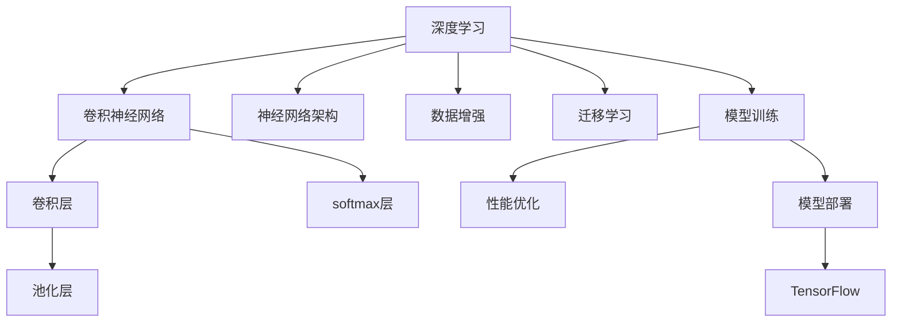

                 

# 基于tensorflow图像识别系统的设计与开发

> 关键词：图像识别,深度学习,神经网络,卷积神经网络,卷积层,池化层,softmax层,神经网络架构,数据增强,迁移学习,模型训练,性能优化,模型部署,TensorFlow

## 1. 背景介绍

### 1.1 问题由来
图像识别技术在近年来取得了突破性的进展，广泛应用于智能安防、医疗诊断、自动驾驶、机器人视觉等多个领域。其核心在于通过深度学习算法，将原始图像数据转化为机器可以理解的语义信息，进而进行分类、检测、分割等任务。TensorFlow作为一款强大的深度学习框架，提供了丰富的工具和库，使图像识别系统的开发变得更加便捷高效。

### 1.2 问题核心关键点
构建一个高效的图像识别系统，需要从模型选择、数据预处理、训练策略、性能优化等多个方面进行精心设计和调试。本文聚焦于基于TensorFlow的图像识别系统设计与开发，详细介绍了从模型构建到应用部署的整个流程，并提出了一套完整的优化策略，以期为读者提供系统的技术指引。

### 1.3 问题研究意义
掌握基于TensorFlow的图像识别系统设计与开发方法，对于推动深度学习在图像领域的广泛应用，提升自动化视觉系统的智能化水平，具有重要意义：

1. 加速研发进程。通过借鉴已有研究成果，能够迅速构建高性能的图像识别系统，减少重复开发工作。
2. 提升识别精度。利用TensorFlow丰富的深度学习模型和优化算法，可以获得更精确的图像分类、检测和分割结果。
3. 灵活适应需求。结合任务特点和资源条件，对模型和训练策略进行定制化设计，使其更好地满足具体应用场景的需求。
4. 提高部署效率。TensorFlow支持多种硬件平台，能够快速部署和优化图像识别系统，提升实际应用效果。
5. 推动创新应用。借助图像识别技术，能够开发更多创新的业务和产品，为各行业带来新的变革。

## 2. 核心概念与联系

### 2.1 核心概念概述

为更好地理解基于TensorFlow的图像识别系统，本节将介绍几个密切相关的核心概念：

- 深度学习(Deep Learning)：通过多层神经网络，从大量数据中自动提取特征并进行分类、回归、聚类等任务。
- 卷积神经网络(Convolutional Neural Network, CNN)：一种特殊的深度神经网络，通过卷积层、池化层等结构，高效处理图像数据。
- 卷积层(Convolutional Layer)：用于提取图像的局部特征，是CNN的核心组件。
- 池化层(Pooling Layer)：用于降维和提取图像的总体特征，常用有最大池化和平均池化。
- softmax层(Softmax Layer)：用于多分类任务，将输出转化为概率分布。
- 神经网络架构(Neural Network Architecture)：设计合理的网络结构和参数配置，对于提升模型性能至关重要。
- 数据增强(Data Augmentation)：通过对原始数据进行变换，扩充训练集，提升模型泛化能力。
- 迁移学习(Transfer Learning)：通过在大规模数据集上预训练的模型，在小数据集上进行微调，快速构建高精度模型。
- 模型训练(Model Training)：通过前向传播和反向传播，优化模型参数，提高模型的预测准确率。
- 性能优化(Performance Optimization)：通过调整超参数、模型裁剪、量化加速等手段，提升模型的推理效率和稳定性。
- 模型部署(Model Deployment)：将训练好的模型应用到实际系统中，进行推理预测。
- TensorFlow：谷歌推出的开源深度学习框架，提供强大的计算图功能和丰富的工具库。

这些核心概念之间的逻辑关系可以通过以下Mermaid流程图来展示：



这个流程图展示了大语言模型的核心概念及其之间的关系：

1. 深度学习作为基础技术，通过多层神经网络实现数据自动特征提取。
2. 卷积神经网络通过卷积层、池化层等结构，高效处理图像数据。
3. 神经网络架构设计合理的网络结构和参数配置，对于提升模型性能至关重要。
4. 数据增强通过对原始数据进行变换，扩充训练集，提升模型泛化能力。
5. 迁移学习通过在大规模数据集上预训练的模型，在小数据集上进行微调，快速构建高精度模型。
6. 模型训练通过前向传播和反向传播，优化模型参数，提高模型的预测准确率。
7. 性能优化通过调整超参数、模型裁剪、量化加速等手段，提升模型的推理效率和稳定性。
8. 模型部署将训练好的模型应用到实际系统中，进行推理预测。
9. TensorFlow作为深度学习框架，提供了强大的计算图功能和丰富的工具库，使图像识别系统的开发变得更加便捷高效。

## 3. 核心算法原理 & 具体操作步骤
### 3.1 算法原理概述

基于TensorFlow的图像识别系统主要基于卷积神经网络进行模型构建和训练。其核心思想是通过卷积层和池化层提取图像的局部和总体特征，然后通过全连接层进行分类、检测或分割等任务。

形式化地，假设输入图像为 $x$，图像类别数为 $C$，卷积神经网络的输出为 $y$，则分类任务的目标是找到最优参数 $\theta$，使得损失函数 $\mathcal{L}(y,\hat{y})$ 最小化，其中 $\hat{y}$ 为模型预测的类别概率分布。常用的损失函数包括交叉熵损失函数：

$$
\mathcal{L}(y,\hat{y}) = -\frac{1}{N}\sum_{i=1}^N\sum_{j=1}^C y_{i,j}\log \hat{y}_{i,j}
$$

其中 $y_{i,j}$ 表示第 $i$ 个样本属于第 $j$ 类的真实标签，$\hat{y}_{i,j}$ 表示模型预测第 $i$ 个样本属于第 $j$ 类的概率。

### 3.2 算法步骤详解

基于TensorFlow的图像识别系统设计与开发，主要包括以下几个关键步骤：

**Step 1: 准备数据集**
- 收集图像数据集，并对图像进行预处理，如缩放、旋转、裁剪等。
- 将图像数据集划分为训练集、验证集和测试集。
- 将图像和标签进行编码，以便在TensorFlow中使用。

**Step 2: 构建神经网络架构**
- 选择合适的卷积神经网络架构，如VGG、ResNet、Inception等。
- 在TensorFlow中定义模型结构，包括卷积层、池化层、全连接层等。
- 设置模型参数，如卷积核大小、步长、填充方式等。

**Step 3: 设置超参数**
- 选择合适的优化算法及其参数，如Adam、SGD等，设置学习率、批大小、迭代轮数等。
- 设置正则化技术及强度，包括权重衰减、Dropout等。

**Step 4: 执行模型训练**
- 将训练集数据分批次输入模型，前向传播计算损失函数。
- 反向传播计算参数梯度，根据设定的优化算法和学习率更新模型参数。
- 周期性在验证集上评估模型性能，根据性能指标决定是否触发 Early Stopping。
- 重复上述步骤直到满足预设的迭代轮数或 Early Stopping 条件。

**Step 5: 测试和部署**
- 在测试集上评估模型性能，对比训练前后的精度提升。
- 使用模型进行推理预测，集成到实际的应用系统中。
- 持续收集新的数据，定期重新训练模型，以适应数据分布的变化。

以上是基于TensorFlow的图像识别系统设计与开发的一般流程。在实际应用中，还需要根据具体任务的特点，对模型架构和训练策略进行优化设计，如改进网络结构、引入数据增强、搜索最优超参数组合等，以进一步提升模型性能。

### 3.3 算法优缺点

基于TensorFlow的图像识别系统具有以下优点：
1. 丰富的深度学习模型和优化算法：TensorFlow内置了多种预训练的深度学习模型，如Inception、ResNet等，同时提供了Adam、SGD等优化算法。
2. 灵活的模型构建和训练：TensorFlow支持动态图和静态图两种模式，使得模型的构建和训练更加灵活。
3. 高效的计算图优化：TensorFlow提供了TensorRT等工具，可以对计算图进行优化，提高推理速度和资源利用率。
4. 强大的社区支持和生态系统：TensorFlow拥有庞大的用户和开发者社区，提供丰富的工具和库，便于快速开发和优化。

同时，该方法也存在一定的局限性：
1. 对硬件要求较高：构建高性能的图像识别系统，需要强大的GPU或TPU等硬件支持。
2. 数据标注成本高：高质量的标注数据是模型训练的前提，标注成本较高。
3. 模型复杂度高：大规模卷积神经网络模型参数量大，计算复杂度高。
4. 可解释性不足：深度学习模型通常被视为"黑盒"系统，缺乏可解释性。
5. 需要专业知识：深度学习模型的设计和优化需要丰富的专业知识和经验。

尽管存在这些局限性，但就目前而言，基于TensorFlow的图像识别系统仍然是深度学习领域的主流范式。未来相关研究的重点在于如何进一步降低对硬件和标注数据的依赖，提高模型的可解释性和普适性，同时兼顾效率和精度。

### 3.4 算法应用领域

基于TensorFlow的图像识别系统已经在图像分类、目标检测、语义分割等多个领域得到了广泛的应用，例如：

- 图像分类：如识别手写数字、动物、花卉等。通过卷积神经网络对图像进行分类。
- 目标检测：如在图像中检测人脸、车辆、行人等目标。通过目标检测模型对图像进行标注。
- 语义分割：如将图像分割成不同的语义区域，如道路、车辆、行人等。通过语义分割模型对像素进行分类。
- 图像生成：如从输入文本生成图像。通过生成对抗网络等模型生成图像。
- 人脸识别：如识别人脸并将其与数据库中的人脸进行比对。通过卷积神经网络和深度特征提取技术实现。
- 医疗影像分析：如识别和分割医学影像中的病变区域。通过卷积神经网络和医学图像处理技术实现。

除了上述这些经典任务外，TensorFlow支持的图像识别技术还被创新性地应用到更多场景中，如行为分析、视频监控、无人驾驶等，为图像识别技术带来了新的突破。随着深度学习技术的不断进步，相信基于TensorFlow的图像识别系统将在更多领域得到应用，为计算机视觉和图像处理技术带来新的变革。

## 4. 数学模型和公式 & 详细讲解  
### 4.1 数学模型构建

本节将使用数学语言对基于TensorFlow的图像识别过程进行更加严格的刻画。

记输入图像为 $x \in \mathbb{R}^{H \times W \times 3}$，其中 $H$ 和 $W$ 表示图像的高度和宽度，3表示RGB三个通道。假设卷积神经网络的输出为 $y \in \mathbb{R}^C$，其中 $C$ 表示类别数。

定义模型 $f(x; \theta)$ 在输入 $x$ 上的损失函数为 $\mathcal{L}(f(x; \theta), y)$，则在训练集 $\mathcal{D}$ 上的经验风险为：

$$
\mathcal{L}(\theta) = \frac{1}{N}\sum_{(x,y) \in \mathcal{D}} \mathcal{L}(f(x; \theta), y)
$$

在实践中，我们通常使用基于梯度的优化算法（如Adam、SGD等）来近似求解上述最优化问题。设 $\eta$ 为学习率，$\lambda$ 为正则化系数，则参数的更新公式为：

$$
\theta \leftarrow \theta - \eta \nabla_{\theta}\mathcal{L}(\theta) - \eta\lambda\theta
$$

其中 $\nabla_{\theta}\mathcal{L}(\theta)$ 为损失函数对参数 $\theta$ 的梯度，可通过反向传播算法高效计算。

### 4.2 公式推导过程

以下我们以二分类任务为例，推导交叉熵损失函数及其梯度的计算公式。

假设模型 $f(x; \theta)$ 在输入 $x$ 上的输出为 $\hat{y}=f(x; \theta) \in [0,1]$，表示样本属于正类的概率。真实标签 $y \in \{0,1\}$。则二分类交叉熵损失函数定义为：

$$
\mathcal{L}(f(x; \theta), y) = -[y\log \hat{y} + (1-y)\log (1-\hat{y})]
$$

将其代入经验风险公式，得：

$$
\mathcal{L}(\theta) = -\frac{1}{N}\sum_{i=1}^N [y_i\log f(x_i; \theta)+(1-y_i)\log(1-f(x_i; \theta))]
$$

根据链式法则，损失函数对参数 $\theta_k$ 的梯度为：

$$
\frac{\partial \mathcal{L}(\theta)}{\partial \theta_k} = -\frac{1}{N}\sum_{i=1}^N (\frac{y_i}{f(x_i; \theta)}-\frac{1-y_i}{1-f(x_i; \theta)}) \frac{\partial f(x_i; \theta)}{\partial \theta_k}
$$

其中 $\frac{\partial f(x_i; \theta)}{\partial \theta_k}$ 可进一步递归展开，利用自动微分技术完成计算。

在得到损失函数的梯度后，即可带入参数更新公式，完成模型的迭代优化。重复上述过程直至收敛，最终得到适应下游任务的最优模型参数 $\theta^*$。

## 5. 项目实践：代码实例和详细解释说明
### 5.1 开发环境搭建

在进行图像识别系统开发前，我们需要准备好开发环境。以下是使用Python进行TensorFlow开发的环境配置流程：

1. 安装Anaconda：从官网下载并安装Anaconda，用于创建独立的Python环境。

2. 创建并激活虚拟环境：
```bash
conda create -n tf-env python=3.8 
conda activate tf-env
```

3. 安装TensorFlow：根据CUDA版本，从官网获取对应的安装命令。例如：
```bash
pip install tensorflow-gpu==2.7.0
```

4. 安装各类工具包：
```bash
pip install numpy pandas scikit-learn matplotlib tqdm jupyter notebook ipython
```

完成上述步骤后，即可在`tf-env`环境中开始图像识别系统的开发。

### 5.2 源代码详细实现

下面我们以手写数字识别任务为例，给出使用TensorFlow对卷积神经网络进行训练的PyTorch代码实现。

首先，定义模型结构：

```python
import tensorflow as tf
from tensorflow.keras import layers, models

model = models.Sequential()
model.add(layers.Conv2D(32, (3, 3), activation='relu', input_shape=(28, 28, 1)))
model.add(layers.MaxPooling2D((2, 2)))
model.add(layers.Conv2D(64, (3, 3), activation='relu'))
model.add(layers.MaxPooling2D((2, 2)))
model.add(layers.Flatten())
model.add(layers.Dense(64, activation='relu'))
model.add(layers.Dense(10))
```

然后，定义训练函数：

```python
from tensorflow.keras.datasets import mnist
from tensorflow.keras.utils import to_categorical

(x_train, y_train), (x_test, y_test) = mnist.load_data()

x_train = x_train.reshape(-1, 28, 28, 1) / 255.0
x_test = x_test.reshape(-1, 28, 28, 1) / 255.0
y_train = to_categorical(y_train, num_classes=10)
y_test = to_categorical(y_test, num_classes=10)

model.compile(optimizer='adam', loss='categorical_crossentropy', metrics=['accuracy'])

history = model.fit(x_train, y_train, batch_size=64, epochs=10, validation_data=(x_test, y_test))
```

最后，评估模型性能：

```python
score = model.evaluate(x_test, y_test, verbose=0)
print('Test loss:', score[0])
print('Test accuracy:', score[1])
```

以上代码实现了对手写数字识别任务的卷积神经网络模型的训练和评估。可以看到，利用TensorFlow和Keras库，可以快速构建、训练和评估深度学习模型，极大简化了模型开发流程。

### 5.3 代码解读与分析

让我们再详细解读一下关键代码的实现细节：

**模型定义**：
- 使用`Sequential`模型依次添加卷积层、池化层、全连接层。卷积层通过`Conv2D`实现，池化层通过`MaxPooling2D`实现，全连接层通过`Dense`实现。
- 设置各层的参数，如卷积核大小、激活函数、输入形状等。

**数据预处理**：
- 使用`mnist.load_data()`加载手写数字数据集。
- 将数据集转换为`(x_train, y_train), (x_test, y_test)`格式。
- 对图像数据进行归一化，将像素值缩放到[0,1]之间。
- 将标签转换为独热编码格式，以便在模型训练中使用。

**模型编译**：
- 使用`model.compile()`设置优化器、损失函数和评估指标。
- 优化器使用Adam，损失函数使用交叉熵损失函数，评估指标使用准确率。

**模型训练**：
- 使用`model.fit()`对模型进行训练，设置批大小和迭代轮数。
- 在每个epoch结束后，评估模型在验证集上的性能。
- 通过`model.evaluate()`评估模型在测试集上的性能。

可以看到，利用TensorFlow和Keras库，代码实现变得简洁高效。开发者可以将更多精力放在模型设计、数据处理等高层逻辑上，而不必过多关注底层的实现细节。

当然，工业级的系统实现还需考虑更多因素，如模型的保存和部署、超参数的自动搜索、更灵活的网络结构设计等。但核心的微调范式基本与此类似。

## 6. 实际应用场景
### 6.1 智能安防系统

基于卷积神经网络的图像识别技术，在智能安防系统中有着广泛的应用。传统安防系统依赖大量人工进行监控和预警，存在成本高、效率低等问题。通过引入基于TensorFlow的图像识别技术，可以实现自动化的监控和报警。

在技术实现上，可以收集安防监控视频，通过视频帧切割和标注，构建监督数据集。在预训练卷积神经网络模型后，将其应用于实时视频流，自动检测和识别异常行为。对于检测到的异常行为，系统可以自动发送警报，通知安保人员进行进一步处理。

### 6.2 医疗影像分析

医疗影像分析是卷积神经网络的重要应用领域之一。传统的医学影像分析依赖医生手工标注，耗时长、成本高。通过预训练卷积神经网络模型，可以将影像自动分类、分割和标注。

在具体应用中，可以收集不同病种的高质量医学影像，并对其进行标注。通过预训练的卷积神经网络模型对医学影像进行分析和推理，自动识别病变区域和病种，辅助医生进行诊断。在训练好的模型基础上，可以构建自动化的影像分析系统，提高医学影像处理的效率和准确性。

### 6.3 自动驾驶系统

自动驾驶系统依赖对道路场景的精确理解和分析，而卷积神经网络在此方面表现出色。通过预训练卷积神经网络模型，可以识别和分类道路上的车辆、行人、交通标志等元素，提供实时道路场景理解。

在技术实现上，可以收集大量的道路场景图像，并对其进行标注。通过预训练的卷积神经网络模型，对实时摄像头采集的图像进行分析和推理，识别道路上的各类元素，并进行路径规划和决策，实现自动驾驶。

### 6.4 未来应用展望

随着卷积神经网络技术的不断进步，基于TensorFlow的图像识别技术将在更多领域得到应用，为计算机视觉和图像处理技术带来新的变革。

在智慧城市治理中，基于TensorFlow的图像识别技术可以帮助城市管理者实时监控和管理交通、环境、安全等关键领域，提高城市治理的智能化水平。

在农业领域，基于图像识别的农业生产管理系统，可以自动识别作物生长状态、病虫害等，辅助农民进行科学决策，提高农业生产效率和质量。

在文化领域，基于图像识别的文物保护系统，可以自动识别文物的损坏情况，及时进行修复和维护，保障文化遗产的安全。

此外，在教育、艺术、交通等众多领域，基于TensorFlow的图像识别技术也将不断涌现，为人类生活的各个方面带来新的变化。相信随着技术的日益成熟，基于TensorFlow的图像识别技术必将在各个领域大放异彩，深刻影响人类的生产生活方式。

## 7. 工具和资源推荐
### 7.1 学习资源推荐

为了帮助开发者系统掌握基于TensorFlow的图像识别技术，这里推荐一些优质的学习资源：

1. TensorFlow官方文档：TensorFlow官网提供了丰富的官方文档，包括入门教程、模型库、API文档等，是学习TensorFlow的最佳资源。

2. Deep Learning Specialization：由Andrew Ng教授主持的深度学习课程，涵盖了深度学习的基础知识和前沿技术，是学习深度学习的入门课程。

3. Hands-On Machine Learning with Scikit-Learn, Keras, and TensorFlow：书籍《动手学深度学习》介绍了基于Keras和TensorFlow的深度学习实践，适合动手学习TensorFlow的开发者。

4. TensorFlow Tutorials：TensorFlow官网提供的各种实用教程，涵盖图像识别、自然语言处理等多个领域，适合快速上手TensorFlow的开发者。

5. Kaggle竞赛：Kaggle提供了丰富的数据集和竞赛，可以帮助开发者实战练习TensorFlow的图像识别应用，提升技能水平。

通过对这些资源的学习实践，相信你一定能够快速掌握基于TensorFlow的图像识别技术，并用于解决实际的计算机视觉问题。

### 7.2 开发工具推荐

高效的开发离不开优秀的工具支持。以下是几款用于TensorFlow图像识别系统开发的常用工具：

1. Jupyter Notebook：支持Python编程，提供交互式笔记本环境，便于调试和记录开发过程。

2. Google Colab：谷歌提供的在线Jupyter Notebook环境，支持GPU计算，方便开发者快速实验和分享学习笔记。

3. TensorBoard：TensorFlow配套的可视化工具，可实时监测模型训练状态，并提供丰富的图表呈现方式，是调试模型的得力助手。

4. TensorRT：NVIDIA推出的高性能深度学习推理引擎，可对计算图进行优化，提高推理速度和资源利用率。

5. Tesseract OCR：Google开发的开源OCR引擎，可以将图像中的文字识别出来，并进行文本处理，适合文本识别的应用场景。

6. OpenCV：开源计算机视觉库，提供了丰富的图像处理和计算机视觉算法，便于进行图像预处理和特征提取。

合理利用这些工具，可以显著提升TensorFlow图像识别系统的开发效率，加快创新迭代的步伐。

### 7.3 相关论文推荐

TensorFlow作为深度学习领域的领先框架，其图像识别技术的不断发展离不开学术界的持续研究。以下是几篇奠基性的相关论文，推荐阅读：

1. ImageNet Classification with Deep Convolutional Neural Networks：提出卷积神经网络，并在ImageNet数据集上取得突破性成果。

2. Efficient Object Localization Using Deep Convolutional Networks：提出基于卷积神经网络的物体检测方法，在PASCAL VOC数据集上取得优异效果。

3. Deep Residual Learning for Image Recognition：提出ResNet网络结构，提升深度神经网络模型的训练效率和精度。

4. Inception-v3, Inception ResNet and the Impact of Residual Connections on Learning：提出Inception网络结构，通过多分支卷积提升模型性能。

5. Single Image Haze Removal Using Dark Channel Prior：提出基于Dark Channel Prior的图像去雾方法，提升图像处理的效果。

6. Deep Learning for AI-based Medical Image Analysis：介绍基于深度学习的医学影像分析技术，涵盖图像分类、分割、检测等多个任务。

这些论文代表了大语言模型微调技术的发展脉络。通过学习这些前沿成果，可以帮助研究者把握学科前进方向，激发更多的创新灵感。

## 8. 总结：未来发展趋势与挑战

### 8.1 总结

本文对基于TensorFlow的图像识别系统设计与开发方法进行了全面系统的介绍。首先阐述了图像识别技术的研究背景和意义，明确了图像识别系统开发的关键环节和步骤。其次，从原理到实践，详细讲解了卷积神经网络的数学模型和训练过程，给出了具体的代码实现和结果分析。同时，本文还广泛探讨了图像识别技术在安防、医疗、自动驾驶等众多领域的应用前景，展示了其在各行各业带来的变革性影响。此外，本文精选了图像识别技术的各类学习资源，力求为读者提供全方位的技术指引。

通过本文的系统梳理，可以看到，基于TensorFlow的图像识别技术已经成为计算机视觉领域的主流范式，极大地拓展了深度学习在图像领域的广泛应用。借助TensorFlow丰富的深度学习模型和优化算法，图像识别技术能够在更广阔的领域中发挥其独特的价值，为各行业带来新的变革。

### 8.2 未来发展趋势

展望未来，基于TensorFlow的图像识别技术将呈现以下几个发展趋势：

1. 模型规模持续增大。随着算力成本的下降和数据规模的扩张，卷积神经网络模型的参数量还将持续增长。超大规模卷积神经网络模型蕴含的丰富特征表示，有望支撑更加复杂多变的图像识别任务。

2. 网络架构日趋多样。除了传统的卷积神经网络，未来会涌现更多网络架构，如Transformer、DenseNet等，通过引入自注意力机制、残差连接等技术，提升模型的表达能力和泛化能力。

3. 多模态融合成为常态。未来的图像识别技术将更多地结合多模态数据，如图像、语音、文本等，通过多模态融合提升系统的感知能力和智能水平。

4. 端到端学习兴起。未来的图像识别系统将更多地采用端到端训练方式，如通过自监督学习、半监督学习等，从更少的标签数据中学习到更丰富的语义信息。

5. 深度学习与人工智能的深度融合。未来的图像识别技术将更多地结合人工智能的其他分支，如知识图谱、自然语言处理等，构建更加全面、智能的视觉系统。

以上趋势凸显了TensorFlow图像识别技术的广阔前景。这些方向的探索发展，必将进一步提升图像识别系统的性能和应用范围，为计算机视觉和图像处理技术带来新的突破。

### 8.3 面临的挑战

尽管基于TensorFlow的图像识别技术已经取得了瞩目成就，但在迈向更加智能化、普适化应用的过程中，它仍面临着诸多挑战：

1. 标注数据成本高：高质量的标注数据是模型训练的前提，但标注成本较高。如何进一步降低数据标注成本，获取更多高质量标注数据，将成为重要研究方向。

2. 模型复杂度高：大规模卷积神经网络模型参数量大，计算复杂度高。如何优化模型结构和训练策略，提高模型的推理效率和稳定性，还需要更多实践探索。

3. 可解释性不足：深度学习模型通常被视为"黑盒"系统，缺乏可解释性。如何赋予图像识别模型更强的可解释性，增强其决策逻辑的可信度，将是未来的一个重要课题。

4. 数据隐私保护：图像识别系统通常需要大量数据进行训练，如何保护用户隐私，避免数据泄露风险，还需要更多的技术和管理措施。

5. 泛化性能不足：模型在特定数据集上表现良好，但在不同数据集上泛化性能较差。如何提高模型的泛化能力，增强其在复杂多变环境下的适应性，将是重要的研究挑战。

6. 对抗攻击脆弱：图像识别模型容易受到对抗样本攻击，导致预测错误。如何提高模型的鲁棒性，增强其对对抗样本的抵抗能力，将是重要的研究方向。

正视TensorFlow图像识别技术面临的这些挑战，积极应对并寻求突破，将是大规模图像识别系统走向成熟的必由之路。相信随着学界和产业界的共同努力，这些挑战终将一一被克服，TensorFlow图像识别技术必将在更广阔的应用领域发挥其独特的价值。

### 8.4 研究展望

面向未来，TensorFlow图像识别技术需要在以下几个方面寻求新的突破：

1. 探索无监督和半监督学习方式：摆脱对大规模标注数据的依赖，利用自监督学习、主动学习等无监督和半监督范式，最大限度利用非结构化数据，实现更加灵活高效的图像识别。

2. 引入先验知识：将符号化的先验知识，如知识图谱、逻辑规则等，与神经网络模型进行巧妙融合，引导模型学习更准确、合理的语义表示。

3. 增强模型泛化能力：结合因果分析方法，增强模型建立稳定因果关系的能力，学习更加普适、鲁棒的语言表征，从而提升模型泛化性和抗干扰能力。

4. 改进模型训练策略：通过引入对抗训练、自适应学习率调度等策略，进一步优化模型的训练过程，提高模型的推理效率和性能。

5. 融合多模态信息：未来的图像识别系统将更多地结合多模态数据，如图像、语音、文本等，通过多模态融合提升系统的感知能力和智能水平。

6. 结合人工智能其他分支：未来的图像识别技术将更多地结合人工智能的其他分支，如知识图谱、自然语言处理等，构建更加全面、智能的视觉系统。

这些研究方向的探索，必将引领TensorFlow图像识别技术迈向更高的台阶，为构建安全、可靠、可解释、可控的智能系统铺平道路。面向未来，TensorFlow图像识别技术还需要与其他人工智能技术进行更深入的融合，如知识表示、因果推理、强化学习等，多路径协同发力，共同推动自然语言理解和智能交互系统的进步。只有勇于创新、敢于突破，才能不断拓展图像识别技术的边界，让智能技术更好地造福人类社会。

## 9. 附录：常见问题与解答

**Q1：构建TensorFlow图像识别系统时，需要注意哪些关键点？**

A: 构建TensorFlow图像识别系统时，需要注意以下几个关键点：
1. 数据预处理：确保数据质量，进行归一化、缩放、旋转等处理，以便于模型训练。
2. 模型选择：选择合适的卷积神经网络架构，如VGG、ResNet、Inception等，根据任务特点进行调整。
3. 模型训练：设置合适的学习率、批大小、迭代轮数等超参数，利用数据增强等技术提高模型泛化能力。
4. 模型评估：使用验证集和测试集评估模型性能，确保模型泛化良好。
5. 模型部署：将模型导出为TensorFlow Serving格式，支持在线推理。
6. 性能优化：通过模型裁剪、量化加速等技术提升模型推理效率。

**Q2：如何提高TensorFlow图像识别模型的推理效率？**

A: 提高TensorFlow图像识别模型的推理效率，可以通过以下几种方式：
1. 模型裁剪：去除不必要的层和参数，减小模型尺寸，加快推理速度。
2. 量化加速：将浮点模型转为定点模型，压缩存储空间，提高计算效率。
3. 推理优化：利用TensorRT等工具，对计算图进行优化，提高推理速度和资源利用率。
4. 硬件加速：利用GPU、TPU等硬件加速设备，提升模型推理效率。

**Q3：TensorFlow图像识别系统在实际应用中，需要注意哪些问题？**

A: TensorFlow图像识别系统在实际应用中，需要注意以下几个问题：
1. 数据标注成本高：高质量的标注数据是模型训练的前提，但标注成本较高，如何获取更多高质量标注数据，将是重要研究方向。
2. 模型复杂度高：大规模卷积神经网络模型参数量大，计算复杂度高，如何优化模型结构和训练策略，提高模型的推理效率和稳定性，还需要更多实践探索。
3. 可解释性不足：深度学习模型通常被视为"黑盒"系统，缺乏可解释性，如何赋予模型更强的可解释性，增强其决策逻辑的可信度，将是未来的一个重要课题。
4. 数据隐私保护：图像识别系统通常需要大量数据进行训练，如何保护用户隐私，避免数据泄露风险，还需要更多的技术和管理措施。
5. 泛化性能不足：模型在特定数据集上表现良好，但在不同数据集上泛化性能较差，如何提高模型的泛化能力，增强其在复杂多变环境下的适应性，将是重要的研究挑战。
6. 对抗攻击脆弱：图像识别模型容易受到对抗样本攻击，导致预测错误，如何提高模型的鲁棒性，增强其对对抗样本的抵抗能力，将是重要的研究方向。

正视TensorFlow图像识别系统面临的这些挑战，积极应对并寻求突破，将是大规模图像识别系统走向成熟的必由之路。相信随着学界和产业界的共同努力，这些挑战终将一一被克服，TensorFlow图像识别技术必将在更广阔的应用领域发挥其独特的价值。

---

作者：禅与计算机程序设计艺术 / Zen and the Art of Computer Programming

