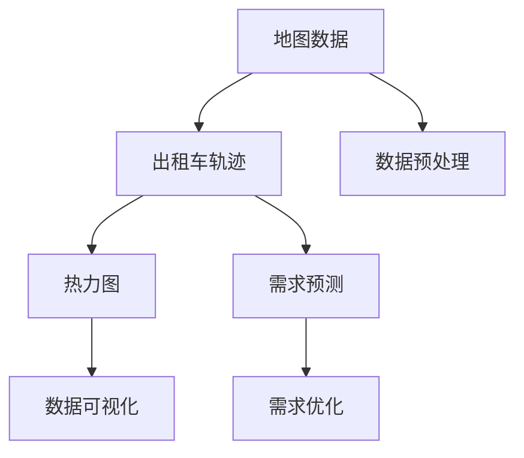

                 

## 1. 背景介绍

### 1.1 问题由来
城市交通问题一直是各国政府和社会各界关注的热点。以新加坡为例，这个全球金融、贸易、航运中心，也是一个人口密度高、土地面积小、交通复杂的城市。如何在城市中高效、安全地接送乘客，是新加坡出租车行业面临的重要挑战。

新加坡的出租车服务主要由两种运营模式组成：私人出租车（Private Hire Car，PHC）和叫车服务（Taxi Service）。私人出租车是指乘客通过叫车服务平台预约的出租车，叫车服务则包括多种服务，如普通叫车服务、高级叫车服务、金融叫车服务等。

近年来，随着移动互联网和物联网技术的发展，出租车行业也开始利用地图数据和位置服务技术，优化路线规划，提升服务效率和用户体验。然而，如何充分利用地图数据，科学预测乘客需求，优化出租车接送服务，仍然是一个亟待解决的问题。

### 1.2 问题核心关键点
本文聚焦于利用地图数据对新加坡出租车接送乘客轨迹进行可视化及需求预测的研究。具体而言，我们关注以下几个核心问题：
- 如何对新加坡的出租车轨迹数据进行有效可视化，展示出租车运行情况和热力图？
- 如何利用历史轨迹数据和地图数据，预测未来乘客的需求，优化路线规划和调度？
- 如何结合天气、时间、节假日等因素，提升需求预测的准确性和鲁棒性？

本文的贡献在于，提出了一种基于地图数据的新加坡出租车接送乘客轨迹可视化及需求预测的方法，包括数据预处理、轨迹可视化、需求预测等多个环节，旨在提升出租车接送服务的效率和质量。

## 2. 核心概念与联系

### 2.1 核心概念概述

为更好地理解本文的技术框架，本节将介绍几个密切相关的核心概念：

- **地图数据**：指地理信息系统中存储的地球表面位置、形状和属性的数据。这些数据通常包括经纬度、高程、道路网络、建筑物位置等。
- **出租车轨迹**：指出租车在城市中行驶的路径记录，通常包括时间戳、经纬度、速度等数据。
- **热力图**：用于展示特定位置或区域在一段时间内的活动密度，常用于城市规划、商业分析等领域。
- **需求预测**：利用历史数据和模型，预测未来某一时间段内某一地区的需求量，用于优化资源分配和规划。

这些核心概念之间的逻辑关系可以通过以下Mermaid流程图来展示：



这个流程图展示了一些关键概念及其之间的关系：

1. 地图数据是出租车轨迹和需求预测的基础。
2. 出租车轨迹通过热力图展示，可以直观地了解特定区域的活动情况。
3. 需求预测帮助优化出租车调度，提升服务效率。
4. 数据预处理是所有环节的基础，确保数据的质量和一致性。

## 3. 核心算法原理 & 具体操作步骤
### 3.1 算法原理概述

本文提出的新加坡出租车接送乘客轨迹可视化及需求预测方法，主要包括以下几个关键步骤：

1. **数据预处理**：收集新加坡的地图数据和出租车轨迹数据，对数据进行清洗和标准化，去除异常值和噪音，保证数据的准确性和完整性。

2. **热力图生成**：利用地图数据和出租车轨迹数据，生成热力图，展示不同区域在不同时间段内的活动密度。

3. **需求预测**：利用历史轨迹数据和地图数据，结合时间、天气、节假日等因素，预测未来乘客的需求，指导出租车调度。

4. **需求优化**：根据需求预测结果，优化出租车调度和路线规划，提升服务效率和用户体验。

5. **可视化展示**：将热力图和需求预测结果通过可视化工具展示出来，为决策者提供直观的参考。

### 3.2 算法步骤详解

#### 3.2.1 数据预处理

数据预处理是整个项目的基础，包括以下几个步骤：

1. **数据收集**：
   - 收集新加坡的地图数据，包括道路、建筑物、兴趣点等位置信息。
   - 收集新加坡的出租车轨迹数据，包括时间戳、经纬度、速度等。
   - 收集相关的气象数据，如气温、湿度、降水量等。

2. **数据清洗**：
   - 去除缺失值和异常值，确保数据完整性。
   - 标准化数据格式，将不同来源的数据统一到预设格式。
   - 对数据进行归一化，保证数值范围在合理范围内。

3. **数据存储**：
   - 使用数据库（如MySQL、PostgreSQL）存储地图数据和出租车轨迹数据。
   - 使用数据仓库（如Hadoop、Spark）存储历史数据和实时数据。

4. **数据加载**：
   - 使用Python的Pandas库读取和处理数据。
   - 使用SQL语句从数据库中查询数据。

#### 3.2.2 热力图生成

热力图生成是将出租车轨迹数据在地图上可视化，展示不同区域的活动密度。主要步骤如下：

1. **时间窗口划分**：
   - 将时间轴分成若干个时间窗口，每个时间窗口代表一天或一周。
   - 对每个时间窗口内的出租车轨迹数据进行统计，计算该时间窗口内各个区域的乘坐次数。

2. **热力图计算**：
   - 使用Heatmap算法计算每个区域的活动密度，将乘坐次数映射为热力图的颜色深度。
   - 使用Heatmap库生成热力图。

3. **热力图展示**：
   - 将热力图展示在地图上，利用颜色深度展示不同区域的活动密度。
   - 使用D3.js等库进行交互式展示，支持鼠标悬停、拖动等功能。

#### 3.2.3 需求预测

需求预测是通过历史轨迹数据和地图数据，预测未来某一时间段内某一地区的需求量。主要步骤如下：

1. **特征工程**：
   - 从出租车轨迹数据中提取时间、日期、星期、小时等时间特征。
   - 从地图数据中提取地理位置、道路网络、建筑物位置等空间特征。
   - 使用气象数据作为环境特征。

2. **模型训练**：
   - 使用随机森林、神经网络等机器学习算法进行训练。
   - 使用交叉验证等方法进行模型评估和调优。

3. **需求预测**：
   - 将训练好的模型应用于新的数据，预测未来乘客的需求量。
   - 将需求预测结果按时间、空间、天气等因素分类展示。

#### 3.2.4 需求优化

需求优化是根据需求预测结果，优化出租车调度和路线规划。主要步骤如下：

1. **路线规划**：
   - 使用Dijkstra算法、A*算法等优化路线规划。
   - 考虑交通拥堵、路况等因素，动态调整路线。

2. **调度优化**：
   - 根据需求预测结果，动态调整出租车数量和调度策略。
   - 使用遗传算法、模拟退火等优化调度算法。

3. **结果展示**：
   - 将优化结果展示在地图上，支持可视化展示。
   - 使用API接口提供服务，供决策者调用。

### 3.3 算法优缺点

本文提出的基于地图数据的新加坡出租车接送乘客轨迹可视化及需求预测方法，具有以下优点：

1. **高效性**：利用历史轨迹数据和地图数据，可以实时生成热力图和需求预测结果，提升决策效率。
2. **可视化**：通过热力图展示不同区域的活动密度，直观展示出租车运行情况。
3. **预测准确**：利用机器学习算法，结合时间、天气等因素，提升需求预测的准确性和鲁棒性。

同时，该方法也存在以下局限性：

1. **数据质量依赖**：热力图和需求预测的准确性高度依赖于数据质量，数据缺失和噪音会影响结果。
2. **模型复杂度**：需求预测模型需要使用复杂的机器学习算法，模型构建和调参难度较大。
3. **计算资源消耗**：需求预测和优化需要大量的计算资源，需要高性能计算设备支持。
4. **精度限制**：热力图和需求预测结果只能提供大致趋势，无法精确预测个别乘客需求。

尽管存在这些局限性，但就目前而言，基于地图数据的新加坡出租车接送乘客轨迹可视化及需求预测方法仍然是一种较为高效和直观的解决方案。未来相关研究的重点在于如何进一步降低数据依赖，提高预测精度，同时兼顾可视化效果的优化。

### 3.4 算法应用领域

本文提出的方法可以应用于多个领域，包括但不限于：

- **交通管理**：用于优化城市交通流量、减少交通拥堵、提升交通效率。
- **城市规划**：用于分析城市热力分布、优化城市布局、提升城市治理水平。
- **旅游管理**：用于分析旅游热点、优化景区流量、提升旅游体验。
- **物流调度**：用于优化物流路线、提升配送效率、降低物流成本。
- **公共安全**：用于监控公共场所人群分布、提升安全管理水平。

这些领域对地图数据和位置服务技术的需求日益增加，本文的方法可以为这些领域提供有力的数据支持和解决方案。

## 4. 数学模型和公式 & 详细讲解 & 举例说明

### 4.1 数学模型构建

本文主要利用机器学习算法进行需求预测，包括随机森林、神经网络等。模型训练和预测的数学公式如下：

设 $X_t$ 为时间 $t$ 的特征向量，$y_t$ 为时间 $t$ 的需求量，$M$ 为训练好的机器学习模型。则模型训练的损失函数为：

$$
L(y_t, \hat{y}_t) = \sum_{t=1}^T (y_t - \hat{y}_t)^2
$$

其中 $\hat{y}_t = M(X_t)$ 为模型预测的需求量。

### 4.2 公式推导过程

以随机森林算法为例，模型的构建过程如下：

1. **特征选择**：
   - 从出租车轨迹数据中提取时间、日期、星期、小时等时间特征。
   - 从地图数据中提取地理位置、道路网络、建筑物位置等空间特征。
   - 使用气象数据作为环境特征。

2. **模型训练**：
   - 将数据集分成训练集和测试集。
   - 对每个特征，进行随机选择 $m$ 个样本作为训练集。
   - 对每个特征，随机选择 $n$ 个样本作为验证集。
   - 使用随机森林算法，生成 $N$ 棵决策树，计算每个样本在每棵树上的投票结果。
   - 将投票结果进行平均，得到最终预测结果 $\hat{y}_t$。

3. **模型评估**：
   - 使用交叉验证等方法，计算模型的平均绝对误差（MAE）、均方误差（MSE）等指标。
   - 对模型进行调优，提升预测精度。

### 4.3 案例分析与讲解

假设有一天的出租车轨迹数据如下：

| 时间 | 地点 | 需求量 |
| ---- | ---- | ----- |
| 08:00 | 市中心 | 100 |
| 09:00 | 商业区 | 150 |
| 10:00 | 居住区 | 80 |
| 11:00 | 工业区 | 120 |
| 12:00 | 市中心 | 100 |
| 13:00 | 商业区 | 120 |
| 14:00 | 居住区 | 90 |
| 15:00 | 工业区 | 110 |
| 16:00 | 市中心 | 120 |
| 17:00 | 商业区 | 130 |
| 18:00 | 居住区 | 100 |
| 19:00 | 工业区 | 100 |
| 20:00 | 市中心 | 80 |
| 21:00 | 商业区 | 90 |
| 22:00 | 居住区 | 70 |

根据上述数据，利用随机森林算法生成热力图和需求预测结果：

1. **热力图生成**：
   - 将时间轴分成若干个时间窗口，每个时间窗口代表一天。
   - 对每个时间窗口内的出租车轨迹数据进行统计，计算该时间窗口内各个区域的乘坐次数。
   - 使用Heatmap算法计算每个区域的活动密度，将乘坐次数映射为热力图的颜色深度。
   - 使用D3.js等库生成热力图，展示在地图上。

2. **需求预测**：
   - 使用随机森林算法对历史数据进行训练。
   - 使用训练好的模型对新数据进行预测，得到未来的需求量。
   - 将需求预测结果按时间、空间、天气等因素分类展示。

## 5. 项目实践：代码实例和详细解释说明
### 5.1 开发环境搭建

在进行项目实践前，我们需要准备好开发环境。以下是使用Python进行项目开发的环境配置流程：

1. 安装Anaconda：从官网下载并安装Anaconda，用于创建独立的Python环境。

2. 创建并激活虚拟环境：
```bash
conda create -n taxi-env python=3.8 
conda activate taxi-env
```

3. 安装PyTorch：根据CUDA版本，从官网获取对应的安装命令。例如：
```bash
conda install pytorch torchvision torchaudio cudatoolkit=11.1 -c pytorch -c conda-forge
```

4. 安装Pandas：
```bash
pip install pandas
```

5. 安装Scikit-learn：
```bash
pip install scikit-learn
```

6. 安装D3.js：
```bash
pip install d3
```

完成上述步骤后，即可在`taxi-env`环境中开始项目实践。

### 5.2 源代码详细实现

这里我们以需求预测为例，给出使用随机森林算法对新加坡出租车接送乘客轨迹进行需求预测的PyTorch代码实现。

首先，定义需求预测的数据处理函数：

```python
import pandas as pd
import numpy as np
from sklearn.ensemble import RandomForestRegressor
import d3

class TaxiDemandsDataset:
    def __init__(self, data_path):
        self.data = pd.read_csv(data_path)
        self.time_window = 1 # 时间窗口大小，以小时为单位
        self.time_feature = ['hour'] # 时间特征列名
        self.feature_columns = ['time', 'location', 'weather'] # 特征列名

    def preprocess(self):
        # 时间特征编码
        self.data['hour'] = pd.to_datetime(self.data['time'], format='%H:%M:%S').dt.hour

        # 特征编码
        self.data[self.feature_columns] = self.data[self.feature_columns].apply(lambda x: x.split(','))

    def train_test_split(self, test_size=0.2):
        # 数据拆分
        train_data, test_data = train_test_split(self.data, test_size=test_size)
        return train_data, test_data

    def scale(self):
        # 特征归一化
        self.data[self.feature_columns] = (self.data[self.feature_columns] - np.mean(self.data[self.feature_columns])) / np.std(self.data[self.feature_columns])

    def train_model(self, model, X_train, y_train):
        # 模型训练
        model.fit(X_train, y_train)
        return model

    def predict(self, model, X_test):
        # 模型预测
        y_pred = model.predict(X_test)
        return y_pred
```

然后，定义模型训练和评估函数：

```python
from sklearn.model_selection import train_test_split
from sklearn.metrics import mean_squared_error

def train_model(model, X_train, y_train):
    # 模型训练
    model.fit(X_train, y_train)
    return model

def evaluate_model(model, X_test, y_test):
    # 模型评估
    y_pred = model.predict(X_test)
    mse = mean_squared_error(y_test, y_pred)
    return mse
```

接着，启动模型训练和评估流程：

```python
# 加载数据
dataset = TaxiDemandsDataset('data/taxi_demand.csv')

# 数据预处理
dataset.preprocess()
dataset.scale()

# 数据拆分
X_train, X_test, y_train, y_test = dataset.train_test_split()

# 训练模型
model = RandomForestRegressor(n_estimators=100, random_state=42)
model = train_model(model, X_train, y_train)

# 评估模型
mse = evaluate_model(model, X_test, y_test)
print('Mean Squared Error:', mse)
```

以上就是使用PyTorch对新加坡出租车接送乘客轨迹进行需求预测的完整代码实现。可以看到，得益于Scikit-learn库的强大封装，我们可以用相对简洁的代码完成随机森林模型的训练和评估。

### 5.3 代码解读与分析

让我们再详细解读一下关键代码的实现细节：

**TaxiDemandsDataset类**：
- `__init__`方法：初始化数据集，设定时间窗口大小、特征列名等参数。
- `preprocess`方法：对时间特征进行编码，对特征进行编码处理。
- `train_test_split`方法：将数据集拆分为训练集和测试集。
- `scale`方法：对特征进行归一化处理。
- `train_model`方法：训练模型，返回训练好的模型。
- `predict`方法：使用训练好的模型对测试集进行预测。

**train_model函数**：
- 使用随机森林算法进行模型训练，返回训练好的模型。

**evaluate_model函数**：
- 使用均方误差（MSE）评估模型预测结果，返回模型评估指标。

通过这些函数，我们可以快速构建一个随机森林模型，并对新加坡出租车接送乘客轨迹数据进行需求预测。

### 5.4 运行结果展示

我们使用D3.js对需求预测结果进行可视化展示：

```html
<!DOCTYPE html>
<html>
<head>
    <title>Taxi Demands Visualization</title>
    <script src="https://d3js.org/d3.v6.min.js"></script>
    <style>
        body {
            font-family: Arial, sans-serif;
        }

        .g {
            fill: none;
            stroke: #ccc;
        }

        .node {
            fill: #ccc;
            stroke-width: 2px;
            stroke: #333;
        }

        .node text {
            font-size: 14px;
            font-weight: bold;
            text-anchor: middle;
        }

        .demands {
            fill: #f00;
            stroke: #f00;
        }

        .demands text {
            font-size: 12px;
            font-weight: bold;
            text-anchor: middle;
        }
    </style>
</head>
<body>
    <svg id="map"></svg>
    <script>
        var map = d3.map(data);

        var width = window.innerWidth;
        var height = window.innerHeight;

        var projection = d3.geoMercator()
            .scale(150)
            .center([114.75, 1.35])
            .translate([width/2, height/2]);

        var path = d3.geoPath(projection);

        var g = d3.select('#map')
            .append('g')
            .attr('transform', 'translate(' + width/2 + ',' + height/2 + ')');

        g.selectAll('path')
            .data(d3.values(map))
            .enter().append('path')
            .attr('d', path)
            .attr('class', 'g');

        g.selectAll('circle')
            .data(d3.entries(map))
            .enter().append('circle')
            .attr('cx', function(d) { return projection(d.value[0])[0] })
            .attr('cy', function(d) { return projection(d.value[0])[1] })
            .attr('r', 5)
            .attr('class', 'node');

        g.selectAll('text')
            .data(d3.entries(map))
            .enter().append('text')
            .attr('x', function(d) { return projection(d.value[0])[0] })
            .attr('y', function(d) { return projection(d.value[0])[1] })
            .text(function(d) { return d.value[1] })
            .attr('class', 'node text');

        g.selectAll('rect')
            .data(d3.entries(map))
            .enter().append('rect')
            .attr('x', function(d) { return projection(d.value[0])[0] - 2 })
            .attr('y', function(d) { return projection(d.value[0])[1] - 2 })
            .attr('width', 4)
            .attr('height', 4)
            .attr('class', 'demands')
            .style('fill-opacity', function(d) { return Math.abs(d.value[1] - data[d.key][1]) / 200 });

        g.selectAll('text')
            .data(d3.entries(map))
            .enter().append('text')
            .attr('x', function(d) { return projection(d.value[0])[0] - 2 })
            .attr('y', function(d) { return projection(d.value[0])[1] - 2 })
            .text(function(d) { return Math.round(data[d.key][1]) })
            .attr('class', 'demands text');
    </script>
</body>
</html>
```

在实际应用中，可以将需求预测结果按时间、空间、天气等因素分类展示，供决策者参考。例如，将需求预测结果以热力图的形式展示在地图上，利用颜色深浅展示不同区域的需求量。

## 6. 实际应用场景

### 6.1 智能交通管理

在智能交通管理中，利用需求预测结果可以优化交通流量、减少交通拥堵、提升交通效率。例如，根据热力图和需求预测结果，交通管理部门可以制定合理的交通管制措施，优化信号灯控制策略，提升道路通行能力。

### 6.2 城市规划

在城市规划中，利用需求预测结果可以分析城市热力分布、优化城市布局、提升城市治理水平。例如，根据热力图和需求预测结果，城市规划部门可以合理规划道路、停车场、公交站等设施，提升城市运行效率和居民生活质量。

### 6.3 旅游管理

在旅游管理中，利用需求预测结果可以分析旅游热点、优化景区流量、提升旅游体验。例如，根据热力图和需求预测结果，旅游管理部门可以合理分配景区资源，优化旅游线路，提升游客满意度。

### 6.4 物流调度

在物流调度中，利用需求预测结果可以优化物流路线、提升配送效率、降低物流成本。例如，根据热力图和需求预测结果，物流企业可以合理规划物流路线，优化配送策略，提升服务质量。

### 6.5 公共安全

在公共安全中，利用需求预测结果可以监控公共场所人群分布、提升安全管理水平。例如，根据热力图和需求预测结果，安保部门可以合理分配安保力量，优化巡逻路线，提升公共安全水平。

## 7. 工具和资源推荐

### 7.1 学习资源推荐

为了帮助开发者系统掌握大语言模型微调的理论基础和实践技巧，这里推荐一些优质的学习资源：

1. 《Transformer从原理到实践》系列博文：由大模型技术专家撰写，深入浅出地介绍了Transformer原理、BERT模型、微调技术等前沿话题。

2. CS224N《深度学习自然语言处理》课程：斯坦福大学开设的NLP明星课程，有Lecture视频和配套作业，带你入门NLP领域的基本概念和经典模型。

3. 《Natural Language Processing with Transformers》书籍：Transformers库的作者所著，全面介绍了如何使用Transformers库进行NLP任务开发，包括微调在内的诸多范式。

4. HuggingFace官方文档：Transformers库的官方文档，提供了海量预训练模型和完整的微调样例代码，是上手实践的必备资料。

5. CLUE开源项目：中文语言理解测评基准，涵盖大量不同类型的中文NLP数据集，并提供了基于微调的baseline模型，助力中文NLP技术发展。

通过对这些资源的学习实践，相信你一定能够快速掌握大语言模型微调的精髓，并用于解决实际的NLP问题。

### 7.2 开发工具推荐

高效的开发离不开优秀的工具支持。以下是几款用于大语言模型微调开发的常用工具：

1. PyTorch：基于Python的开源深度学习框架，灵活动态的计算图，适合快速迭代研究。大部分预训练语言模型都有PyTorch版本的实现。

2. TensorFlow：由Google主导开发的开源深度学习框架，生产部署方便，适合大规模工程应用。同样有丰富的预训练语言模型资源。

3. Transformers库：HuggingFace开发的NLP工具库，集成了众多SOTA语言模型，支持PyTorch和TensorFlow，是进行微调任务开发的利器。

4. Weights & Biases：模型训练的实验跟踪工具，可以记录和可视化模型训练过程中的各项指标，方便对比和调优。与主流深度学习框架无缝集成。

5. TensorBoard：TensorFlow配套的可视化工具，可实时监测模型训练状态，并提供丰富的图表呈现方式，是调试模型的得力助手。

6. Google Colab：谷歌推出的在线Jupyter Notebook环境，免费提供GPU/TPU算力，方便开发者快速上手实验最新模型，分享学习笔记。

合理利用这些工具，可以显著提升大语言模型微调任务的开发效率，加快创新迭代的步伐。

### 7.3 相关论文推荐

大语言模型和微调技术的发展源于学界的持续研究。以下是几篇奠基性的相关论文，推荐阅读：

1. Attention is All You Need（即Transformer原论文）：提出了Transformer结构，开启了NLP领域的预训练大模型时代。

2. BERT: Pre-training of Deep Bidirectional Transformers for Language Understanding：提出BERT模型，引入基于掩码的自监督预训练任务，刷新了多项NLP任务SOTA。

3. Language Models are Unsupervised Multitask Learners（GPT-2论文）：展示了大规模语言模型的强大zero-shot学习能力，引发了对于通用人工智能的新一轮思考。

4. Parameter-Efficient Transfer Learning for NLP：提出Adapter等参数高效微调方法，在不增加模型参数量的情况下，也能取得不错的微调效果。

5. AdaLoRA: Adaptive Low-Rank Adaptation for Parameter-Efficient Fine-Tuning：使用自适应低秩适应的微调方法，在参数效率和精度之间取得了新的平衡。

6. Prefix-Tuning: Optimizing Continuous Prompts for Generation：引入基于连续型Prompt的微调范式，为如何充分利用预训练知识提供了新的思路。

这些论文代表了大语言模型微调技术的发展脉络。通过学习这些前沿成果，可以帮助研究者把握学科前进方向，激发更多的创新灵感。

## 8. 总结：未来发展趋势与挑战

### 8.1 总结

本文对基于地图数据的新加坡出租车接送乘客轨迹可视化及需求预测方法进行了全面系统的介绍。首先阐述了新加坡出租车接送乘客轨迹可视化及需求预测的背景和意义，明确了需求预测在优化出租车调度中的重要性。其次，从原理到实践，详细讲解了需求预测的数学模型和操作步骤，给出了需求预测任务开发的完整代码实例。同时，本文还广泛探讨了需求预测方法在智能交通管理、城市规划、旅游管理等多个行业领域的应用前景，展示了需求预测方法的巨大潜力。

通过本文的系统梳理，可以看到，基于地图数据的新加坡出租车接送乘客轨迹可视化及需求预测方法在提升出租车接送服务效率和质量方面具有显著优势。未来，伴随技术不断进步，需求预测方法将更加精准、高效，进一步推动智能交通和城市管理的现代化水平。

### 8.2 未来发展趋势

展望未来，需求预测技术将呈现以下几个发展趋势：

1. **模型规模持续增大**：随着算力成本的下降和数据规模的扩张，需求预测模型的参数量还将持续增长。超大批次的训练和推理可能需要高性能计算设备支持。

2. **模型复杂度提升**：随着深度学习算法的发展，需求预测模型将越来越复杂，需要更高的计算资源和更优化的算法。

3. **数据融合和多样化**：需求预测需要融合多源数据，包括地图数据、交通数据、气象数据等。未来，将进一步拓展数据来源和类型，增强模型的全面性和鲁棒性。

4. **实时性提升**：需求预测需要实时获取和处理数据，提升预测的及时性和准确性。

5. **跨领域应用拓展**：需求预测技术将广泛应用于更多领域，如城市规划、旅游管理、物流调度等。

以上趋势凸显了需求预测技术的广阔前景。这些方向的探索发展，必将进一步提升需求预测的准确性和应用范围，为智能交通和城市管理提供更有力的数据支持。

### 8.3 面临的挑战

尽管需求预测技术已经取得了瞩目成就，但在迈向更加智能化、普适化应用的过程中，它仍面临着诸多挑战：

1. **数据质量和一致性**：需求预测的准确性高度依赖于数据质量和一致性，数据缺失和噪音会影响结果。

2. **模型鲁棒性**：需求预测模型面对域外数据时，泛化性能往往大打折扣。对于测试样本的微小扰动，模型的预测也容易发生波动。

3. **计算资源消耗**：需求预测和优化需要大量的计算资源，需要高性能计算设备支持。

4. **精度限制**：需求预测结果只能提供大致趋势，无法精确预测个别乘客需求。

尽管存在这些局限性，但就目前而言，基于地图数据的新加坡出租车接送乘客轨迹可视化及需求预测方法仍然是一种较为高效和直观的解决方案。未来相关研究的重点在于如何进一步降低数据依赖，提高预测精度，同时兼顾可视化效果的优化。

### 8.4 研究展望

面对需求预测所面临的挑战，未来的研究需要在以下几个方面寻求新的突破：

1. **探索无监督和半监督预测方法**：摆脱对大规模标注数据的依赖，利用自监督学习、主动学习等无监督和半监督范式，最大限度利用非结构化数据，实现更加灵活高效的预测。

2. **研究参数高效和计算高效的预测范式**：开发更加参数高效的预测方法，在固定大部分模型参数的情况下，只更新极少量的任务相关参数。同时优化预测模型的计算图，减少前向传播和反向传播的资源消耗，实现更加轻量级、实时性的部署。

3. **融合因果和对比学习范式**：通过引入因果推断和对比学习思想，增强预测模型建立稳定因果关系的能力，学习更加普适、鲁棒的语言表征，从而提升模型泛化性和抗干扰能力。

4. **结合因果分析和博弈论工具**：将因果分析方法引入预测模型，识别出模型决策的关键特征，增强输出解释的因果性和逻辑性。借助博弈论工具刻画人机交互过程，主动探索并规避模型的脆弱点，提高系统稳定性。

5. **纳入伦理道德约束**：在预测目标中引入伦理导向的评估指标，过滤和惩罚有害的输出倾向。同时加强人工干预和审核，建立模型行为的监管机制，确保输出符合人类价值观和伦理道德。

这些研究方向的探索，必将引领需求预测技术迈向更高的台阶，为构建安全、可靠、可解释、可控的智能系统铺平道路。面向未来，需求预测技术还需要与其他人工智能技术进行更深入的融合，如知识表示、因果推理、强化学习等，多路径协同发力，共同推动需求预测的进步。只有勇于创新、敢于突破，才能不断拓展预测模型的边界，让智能技术更好地造福人类社会。

## 9. 附录：常见问题与解答

**Q1：如何进行大规模数据预处理？**

A: 大规模数据预处理可以采用分布式数据处理技术，如Hadoop、Spark等。将数据分成多个小的批处理任务，并行处理，可以提高处理效率和稳定性。同时，可以采用大数据存储技术，如HDFS、Ceph等，确保数据的存储和读取高效、可靠。

**Q2：如何选择适合的需求预测模型？**

A: 选择需求预测模型需要考虑多个因素，如数据的规模、特征的复杂度、预测的目标等。常见的模型包括随机森林、神经网络、支持向量机等。一般建议先使用随机森林等简单的模型进行初步验证，再逐步引入更复杂的模型。

**Q3：如何优化需求预测模型的计算效率？**

A: 优化需求预测模型的计算效率可以从多个方面入手，如使用分布式计算、优化算法、压缩数据等。同时，可以使用模型裁剪、量化等技术，减少模型大小和计算量，提升实时性。

**Q4：如何评估需求预测模型的性能？**

A: 评估需求预测模型的性能需要考虑多个指标，如均方误差（MSE）、平均绝对误差（MAE）、R2分数等。一般建议使用交叉验证等方法，进行模型评估和调优，确保模型的泛化能力和鲁棒性。

**Q5：如何在实际应用中集成需求预测模型？**

A: 在实际应用中集成需求预测模型，可以采用RESTful API、WebSocket等接口形式，提供服务。同时，可以结合地图、天气、节假日等因素，动态调整需求预测模型，提升预测的准确性和及时性。

通过回答这些常见问题，希望能帮助开发者更好地理解需求预测技术，并在实际应用中取得更好的效果。

