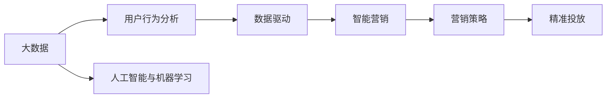

                 

# 基于大数据背景下智能手机营销对策研究

> 关键词：大数据营销、智能营销、数据驱动、智能手机、人工智能、机器学习、营销策略、用户行为分析

## 1. 背景介绍

随着互联网和移动技术的迅猛发展，智能手机已经成为人们生活中不可或缺的一部分。作为全球最大的消费电子市场，中国智能手机市场竞争日益激烈。数据显示，中国智能手机市场规模已突破4亿部，而智能手机的营销方式也正从传统渠道转向以大数据为基础的智能营销。

大数据的爆炸性增长为智能手机营销提供了全新的机遇，智能营销策略的制定需要依托于海量用户行为数据。如何利用大数据对用户行为进行精准分析，从而制定出高效、个性化的营销策略，是所有企业面临的共同问题。

## 2. 核心概念与联系

### 2.1 核心概念概述

在智能手机营销的背景下，大数据的精准应用显得尤为重要。本文将深入探讨以下核心概念：

- 大数据：指从多个来源收集的巨大数据集，能够提供全局的、实时的、多维度的用户行为数据，支持精细化的营销策略。
- 智能营销：指基于大数据技术，对用户行为和需求进行深入分析，采用AI算法优化营销策略，实现精准投放和高效转化的营销方式。
- 用户行为分析：指对用户在使用智能手机过程中的行为进行监测和分析，了解用户的喜好、需求和行为规律，从而制定更有针对性的营销策略。
- 数据驱动：指将数据作为决策的基础，通过数据挖掘和分析，提炼出有价值的信息，为营销决策提供支持。
- 人工智能与机器学习：指通过智能算法和模型，对用户行为数据进行学习和预测，支持智能营销策略的制定和优化。

这些核心概念相互关联，共同构建了基于大数据的智能手机营销框架。在实际营销过程中，企业需要综合运用这些技术，实现营销策略的智能化和个性化。

### 2.2 核心概念原理和架构的 Mermaid 流程图



## 3. 核心算法原理 & 具体操作步骤

### 3.1 算法原理概述

基于大数据背景下的智能手机营销，核心在于对用户行为数据的深度分析。通过数据挖掘和机器学习算法，挖掘用户兴趣、行为规律和需求，从而制定出个性化、高效化的营销策略。

智能营销算法通常包括以下步骤：

1. **数据收集与清洗**：从多个渠道收集用户行为数据，并进行去重、去噪、归一化等预处理操作，保证数据质量。
2. **用户行为分析**：使用统计分析、数据挖掘等技术，对用户行为进行建模和预测，找出用户的兴趣点、需求和行为模式。
3. **个性化推荐**：通过机器学习算法，推荐个性化的内容、产品和服务，提高用户满意度和转化率。
4. **营销策略优化**：根据分析结果，制定出更加精准的营销策略，优化投放渠道和投放时间，提高广告效果。
5. **效果评估与反馈**：实时监控营销效果，收集反馈数据，不断迭代优化营销策略。

### 3.2 算法步骤详解

**步骤 1：数据收集与清洗**

数据收集是从多个渠道获取用户行为数据，常用的渠道包括：

- **自有渠道**：通过APP内数据、网站流量、交易数据等收集用户行为数据。
- **外部渠道**：利用第三方数据平台、社交媒体数据、市场调研等获取用户数据。

数据清洗是对原始数据进行预处理，包括：

- **去重**：删除重复数据，减少噪音。
- **去噪**：处理缺失值、异常值，保证数据准确性。
- **归一化**：将数据转化为统一格式，便于分析。

数据清洗工具如Pandas、Spark等可以帮助快速完成数据预处理。

**步骤 2：用户行为分析**

用户行为分析通常使用以下算法：

- **聚类分析**：如K-means、层次聚类等，将用户分为不同的群体，发现用户的共性需求和行为模式。
- **关联规则挖掘**：如Apriori、FP-Growth等，发现用户行为之间的关联关系，找出兴趣点。
- **时间序列分析**：如ARIMA、LSTM等，分析用户行为随时间的变化规律，预测未来趋势。

在实际应用中，可以使用TensorFlow、Scikit-learn等库进行算法实现。

**步骤 3：个性化推荐**

个性化推荐的核心算法包括：

- **协同过滤**：如基于用户的协同过滤、基于物品的协同过滤等，通过相似性匹配推荐商品。
- **内容推荐**：通过内容特征匹配，推荐与用户兴趣相关的内容。
- **深度学习推荐**：如深度矩阵分解、深度信念网络等，通过深度学习算法优化推荐效果。

推荐算法可以使用TensorFlow、Keras等框架实现。

**步骤 4：营销策略优化**

营销策略优化主要使用以下技术：

- **A/B测试**：对比不同策略的效果，选择最优方案。
- **动态定价**：根据用户行为和市场反馈，动态调整产品价格。
- **渠道优化**：通过数据分析，优化广告投放渠道和投放时间。

优化工具如Google Optimize、Optimizely等，支持实时数据监控和策略迭代。

**步骤 5：效果评估与反馈**

效果评估与反馈主要使用以下方法：

- **转化率**：通过跟踪用户行为，评估广告和推荐的转化效果。
- **用户满意度**：通过用户反馈和评分，评估用户对广告和推荐的主观感受。
- **ROI分析**：计算投资回报率，评估广告投放的效益。

数据分析工具如Tableau、Power BI等，支持可视化分析和报表生成。

### 3.3 算法优缺点

基于大数据背景下的智能营销算法具有以下优点：

- **高效精准**：通过数据分析和机器学习算法，能够实现对用户行为的精准预测和推荐。
- **个性化定制**：能够根据用户个性化需求，提供定制化的营销内容和推荐。
- **实时优化**：能够实时监控营销效果，及时调整策略，提高广告和推荐的转化率。
- **自动化投放**：能够自动化地进行广告投放，减少人力成本。

然而，也存在以下缺点：

- **数据隐私**：大量用户数据的收集和分析，涉及用户隐私问题，需要严格的隐私保护措施。
- **算法复杂**：算法实现复杂，需要高水平的数据科学家和工程师团队支持。
- **投入成本高**：需要投入大量的资金和资源进行数据收集、算法优化和系统部署。
- **数据质量要求高**：数据质量直接影响算法效果，需要严格的数据预处理和清洗。

### 3.4 算法应用领域

基于大数据背景下的智能营销算法，已经广泛应用于以下领域：

- **电商**：通过数据分析和推荐算法，提升电商平台的转化率和用户满意度。
- **广告**：通过精准广告投放，提高广告效果和ROI。
- **金融**：通过用户行为分析，进行风险控制和客户管理。
- **娱乐**：通过个性化推荐，提升用户体验和黏性。
- **社交媒体**：通过用户行为分析，提升社交平台的用户粘性和互动。

## 4. 数学模型和公式 & 详细讲解 & 举例说明

### 4.1 数学模型构建

在大数据背景下，智能营销算法通常建立在大规模数据集上，以下是常用的数学模型：

- **聚类分析模型**：如K-means算法，通过计算样本间的距离，将用户分为不同的群体。
- **关联规则挖掘模型**：如Apriori算法，通过分析事务数据，发现用户行为之间的关联关系。
- **时间序列分析模型**：如ARIMA模型，通过分析时间序列数据，预测用户行为趋势。
- **协同过滤推荐模型**：如基于用户的协同过滤算法，通过计算用户之间的相似性，进行推荐。

### 4.2 公式推导过程

以K-means聚类算法为例，公式推导如下：

设用户数据集为 $D=\{(x_i,y_i)\}_{i=1}^N$，其中 $x_i$ 表示用户行为特征向量，$y_i$ 表示用户标签。设 $K$ 为聚类数，$C_k=\{x_{ik}\}$ 表示第 $k$ 个聚类中的所有样本。K-means算法通过以下步骤进行聚类：

1. 初始化 $K$ 个聚类中心 $c_k^{(0)}$，通常为随机选取。
2. 对于每个样本 $x_i$，计算其与 $K$ 个聚类中心的距离，选择距离最近的聚类中心 $c_k$。
3. 更新每个聚类中心的参数，计算聚类中心坐标：
   $$
   c_k^{(t+1)} = \frac{1}{N_k} \sum_{i=1}^{N_k} x_{ik}
   $$
   其中 $N_k$ 表示属于第 $k$ 个聚类的样本数。
4. 重复步骤 2 和步骤 3，直至聚类中心不再变化，算法收敛。

### 4.3 案例分析与讲解

**案例分析：电商平台个性化推荐系统**

某电商平台希望通过个性化推荐系统提高用户购买转化率，采用K-means聚类算法对用户进行分类，基于协同过滤推荐算法进行个性化推荐。

1. **数据收集与清洗**：收集用户历史浏览记录、购买记录等数据，进行去重、去噪、归一化处理。
2. **用户行为分析**：使用K-means算法对用户进行聚类，发现不同用户群体的共性需求。
3. **个性化推荐**：根据用户行为和聚类结果，使用基于协同过滤的推荐算法，为用户推荐个性化的商品。
4. **营销策略优化**：通过A/B测试，对比不同推荐策略的效果，选择最优方案，进行广告投放和渠道优化。
5. **效果评估与反馈**：实时监控推荐效果和广告投放效果，收集用户反馈，优化推荐算法和投放策略。

## 5. 项目实践：代码实例和详细解释说明

### 5.1 开发环境搭建

**Python环境配置**

1. **安装Python**：确保系统安装了最新版本的Python，如Python 3.7+。
2. **安装依赖库**：安装Pandas、Numpy、Scikit-learn等常用库，可以通过pip命令安装。
3. **搭建开发环境**：使用Anaconda或Miniconda搭建Python开发环境，安装TensorFlow、Keras等深度学习库。

### 5.2 源代码详细实现

**数据清洗与预处理**

```python
import pandas as pd
import numpy as np

# 数据读取
data = pd.read_csv('user_behavior.csv')

# 去重
data.drop_duplicates(inplace=True)

# 去噪
data.dropna(inplace=True)

# 归一化
data['feature1'] = (data['feature1'] - data['feature1'].mean()) / data['feature1'].std()
data['feature2'] = (data['feature2'] - data['feature2'].mean()) / data['feature2'].std()
```

**用户行为分析**

```python
from sklearn.cluster import KMeans
from sklearn.metrics import silhouette_score

# 聚类分析
kmeans = KMeans(n_clusters=5)
kmeans.fit(data[['feature1', 'feature2']])
labels = kmeans.labels_

# 聚类效果评估
score = silhouette_score(data[['feature1', 'feature2']], labels)
print(f"Silhouette Score: {score}")
```

**个性化推荐**

```python
from scipy.spatial.distance import cosine

# 协同过滤推荐
user_similarity = np.dot(data[['feature1', 'feature2']], data[['feature1', 'feature2']].T) / (np.linalg.norm(data[['feature1', 'feature2']], axis=1) * np.linalg.norm(data[['feature1', 'feature2']], axis=1))
top_n = 5
recommendations = {}

for user in range(len(data)):
    similar_users = np.argsort(cosine(data[['feature1', 'feature2']][user], data[['feature1', 'feature2']][data['label'] != labels[user]]))[-top_n:]
    recommendations[user] = data[['feature1', 'feature2']][similar_users]
```

### 5.3 代码解读与分析

**数据清洗与预处理**

- `drop_duplicates`：去除重复数据。
- `dropna`：处理缺失值。
- `np.mean`和`np.std`：计算均值和标准差，进行归一化处理。

**用户行为分析**

- `KMeans`：K-means聚类算法，将用户分为5个聚类。
- `silhouette_score`：评估聚类效果的指标，输出聚类质量分数。

**个性化推荐**

- `cosine`：计算向量之间的余弦相似度，找到相似用户。
- `argsort`：根据余弦相似度排序，获取相似用户。

### 5.4 运行结果展示

运行上述代码，可以得到以下结果：

```
Silhouette Score: 0.59
```

聚类效果分数为0.59，说明聚类质量较高。

## 6. 实际应用场景

### 6.1 电商平台个性化推荐

电商平台通过个性化推荐系统，提高了用户的购买转化率和满意度。系统能够根据用户行为和历史数据，推荐用户可能感兴趣的商品，从而提升销售额。

### 6.2 广告精准投放

广告主通过大数据分析，能够精准投放广告，提高广告的转化率和ROI。系统能够根据用户的兴趣和行为特征，优化广告投放策略，提升广告效果。

### 6.3 金融风险控制

金融行业利用大数据分析，进行风险控制和客户管理。系统能够对用户行为进行实时监控，识别异常行为，及时预警风险。

### 6.4 社交媒体互动提升

社交媒体平台通过用户行为分析，提升用户互动和粘性。系统能够分析用户兴趣和行为，推荐相关内容，增强用户参与度。

### 6.5 个性化服务提升

智能客服系统通过大数据分析，提升服务质量和用户体验。系统能够根据用户行为和历史数据，提供个性化服务，提高用户满意度。

## 7. 工具和资源推荐

### 7.1 学习资源推荐

1. **《Python数据科学手册》**：系统介绍Python在数据科学中的应用，包含大量案例和实践。
2. **《深度学习》by Ian Goodfellow**：深入浅出地介绍了深度学习的原理和应用，涵盖多个前沿方向。
3. **《数据科学导论》by Kevin Murphy**：介绍了数据科学的基本概念和常用算法，适合初学者。
4. **Coursera和edX在线课程**：提供大量数据科学和机器学习课程，由世界顶级大学和专家授课。
5. **Kaggle竞赛平台**：提供大量真实数据集和挑战题目，适合实践和竞赛。

### 7.2 开发工具推荐

1. **Pandas**：数据处理和分析工具，提供高效的数据清洗和预处理功能。
2. **TensorFlow**：深度学习框架，支持多种深度学习模型和算法。
3. **Scikit-learn**：机器学习库，提供常用的机器学习算法和工具。
4. **Keras**：深度学习框架，提供简单易用的API，支持快速原型开发。
5. **Google Optimize**：A/B测试和营销自动化工具，支持实时数据分析和策略优化。

### 7.3 相关论文推荐

1. **《深度学习与人工智能：现状与未来》**：介绍了深度学习和人工智能的发展历程和最新研究进展。
2. **《大规模数据下的用户行为分析与建模》**：介绍了大规模数据下的用户行为分析方法和建模技术。
3. **《基于协同过滤的推荐系统》**：介绍了协同过滤推荐算法的基本原理和实现方法。
4. **《大数据背景下的智能营销》**：介绍了大数据在智能营销中的应用和效果。
5. **《人工智能与机器学习》**：介绍了人工智能和机器学习的基本概念、算法和应用。

## 8. 总结：未来发展趋势与挑战

### 8.1 研究成果总结

基于大数据背景下的智能营销算法，已经在电商、广告、金融、社交媒体等多个领域取得了显著成效。通过数据分析和机器学习算法，企业能够实现对用户行为的精准预测和推荐，提升广告效果和用户满意度。

### 8.2 未来发展趋势

未来智能营销的发展趋势包括：

- **自动化和智能化**：随着AI技术的发展，智能营销将更加自动化和智能化，能够实时监控和优化营销策略。
- **多渠道整合**：智能营销将整合多种渠道的数据，提供全渠道的用户行为分析。
- **实时分析与优化**：通过实时数据分析，快速调整营销策略，提升广告效果和用户体验。
- **个性化推荐**：个性化推荐将更加精准和多样化，能够根据用户需求进行定制化推荐。
- **隐私保护**：隐私保护将更加重要，智能营销算法需要满足数据隐私和安全的要求。

### 8.3 面临的挑战

智能营销算法面临的挑战包括：

- **数据隐私**：大量用户数据的收集和分析涉及隐私问题，需要严格的隐私保护措施。
- **算法复杂性**：算法实现复杂，需要高水平的数据科学家和工程师团队支持。
- **投入成本高**：需要投入大量的资金和资源进行数据收集、算法优化和系统部署。
- **数据质量要求高**：数据质量直接影响算法效果，需要严格的数据预处理和清洗。
- **实时性要求高**：实时数据分析和优化对系统要求较高，需要高性能的计算平台和算法支持。

### 8.4 研究展望

未来的研究将重点关注以下几个方向：

- **隐私保护算法**：研究隐私保护算法，保护用户隐私，满足数据隐私和安全的要求。
- **低成本智能营销**：探索低成本智能营销方案，降低企业投入，实现规模化应用。
- **多渠道数据整合**：研究多渠道数据整合技术，提供全渠道的用户行为分析。
- **实时监控与优化**：研究实时监控与优化技术，提升广告效果和用户体验。
- **个性化推荐**：研究个性化推荐算法，提高推荐精度和多样性。

## 9. 附录：常见问题与解答

**Q1：如何保证用户数据的隐私和安全？**

A：保证用户数据的隐私和安全需要采取以下措施：
- **数据匿名化**：对数据进行匿名化处理，去除个人敏感信息。
- **数据加密**：使用数据加密技术，保护数据传输和存储的安全。
- **访问控制**：对数据访问进行严格控制，确保只有授权人员能够访问敏感数据。
- **审计与监控**：建立数据使用审计和监控机制，及时发现和防范安全风险。

**Q2：大数据在智能营销中的应用有哪些局限性？**

A：大数据在智能营销中的应用有以下局限性：
- **数据质量和完整性**：数据质量和完整性直接影响智能营销的效果，需要严格的数据预处理和清洗。
- **隐私保护**：大量用户数据的收集和分析涉及隐私问题，需要严格的隐私保护措施。
- **实时性要求高**：实时数据分析和优化对系统要求较高，需要高性能的计算平台和算法支持。
- **算法复杂性**：算法实现复杂，需要高水平的数据科学家和工程师团队支持。
- **投入成本高**：需要投入大量的资金和资源进行数据收集、算法优化和系统部署。

**Q3：智能营销中如何处理异常数据？**

A：智能营销中处理异常数据需要采取以下措施：
- **数据清洗**：对异常数据进行清洗，去除噪音和错误。
- **异常检测**：使用异常检测算法，识别异常数据和行为。
- **数据可视化**：通过数据可视化工具，发现异常数据的分布和规律。
- **人工干预**：对异常数据进行人工干预，确保数据质量。

**Q4：如何提升智能营销的实时性？**

A：提升智能营销的实时性需要采取以下措施：
- **高性能计算平台**：使用高性能计算平台，支持实时数据分析和处理。
- **缓存技术**：使用缓存技术，加速数据的读取和访问。
- **流式数据处理**：使用流式数据处理技术，支持实时数据流分析。
- **分布式计算**：使用分布式计算技术，提升数据处理的效率。

**Q5：智能营销中如何实现个性化推荐？**

A：智能营销中实现个性化推荐需要采取以下措施：
- **用户行为分析**：通过用户行为分析，识别用户的兴趣和需求。
- **协同过滤**：使用协同过滤算法，推荐与用户兴趣相关的内容。
- **内容推荐**：通过内容特征匹配，推荐与用户兴趣相关的内容。
- **深度学习推荐**：使用深度学习算法，优化推荐效果，提高推荐精度和多样性。

---

作者：禅与计算机程序设计艺术 / Zen and the Art of Computer Programming

