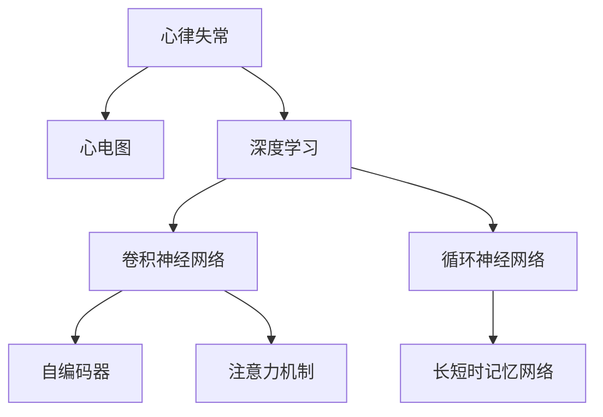

                 

# 基于深度学习的心律失常的自动分类

## 1. 背景介绍

心律失常是心脏疾病中最常见的并发症之一，它指的是心脏的节律发生异常。在临床上，心律失常的种类繁多，包括室性心律失常、房性心律失常、结性心律失常等。由于心律失常的复杂性和多样性，其早期检测和分类是一项具有挑战性的任务。传统的诊断方法主要依赖于医生的经验和专业判断，但这种方式不仅效率低下，而且容易受到主观因素的影响。

近年来，随着深度学习技术的发展，基于深度学习的心律失常自动分类方法引起了广泛关注。深度学习模型，如卷积神经网络（CNN）和循环神经网络（RNN），能够自动提取心电图（ECG）信号中的特征，从而实现心律失常的自动识别和分类。该方法不仅提高了诊断的准确性和效率，还减少了对专业医生的依赖。

## 2. 核心概念与联系

### 2.1 核心概念概述

为了更好地理解基于深度学习的心律失常自动分类方法，本节将介绍几个密切相关的核心概念：

- **心律失常**：心脏节律发生异常的病理状态。
- **心电图（ECG）**：记录心脏电活动信号，用于心律失常的检测和分类。
- **深度学习**：一种通过多层神经网络进行复杂模式识别的机器学习方法。
- **卷积神经网络（CNN）**：一种常用于图像识别任务的深度神经网络。
- **循环神经网络（RNN）**：一种适用于序列数据处理的任务，如时间序列分析。
- **长短时记忆网络（LSTM）**：一种特殊的RNN，能够处理长期依赖关系。
- **注意力机制（Attention）**：一种机制，用于模型在不同特征之间进行加权，以提高模型的性能。
- **自编码器（Autoencoder）**：一种无监督学习方法，用于降维和特征提取。

这些核心概念之间的逻辑关系可以通过以下Mermaid流程图来展示：



这个流程图展示了大语言模型的核心概念及其之间的关系：

1. 心律失常通过心电图信号进行记录和检测。
2. 深度学习模型能够自动处理心电图信号，提取特征，并进行分类。
3. 卷积神经网络和循环神经网络是深度学习中常用的两种模型。
4. 长短时记忆网络用于处理时间序列数据，如心电图信号。
5. 自编码器用于降维和特征提取。
6. 注意力机制用于模型在不同特征之间进行加权，提高模型性能。

这些概念共同构成了基于深度学习的心律失常自动分类的基础，使得该方法在心律失常检测和分类中取得了显著效果。

## 3. 核心算法原理 & 具体操作步骤

### 3.1 算法原理概述

基于深度学习的心律失常自动分类方法主要分为两个步骤：特征提取和分类。

在特征提取阶段，深度学习模型通过自学习的方式，自动从心电图信号中提取出与心律失常相关的特征。这些特征可以是时间序列上的波峰、波谷、频率等。

在分类阶段，深度学习模型利用提取出的特征，对心律失常进行分类。常用的分类器包括逻辑回归、支持向量机（SVM）和神经网络等。

### 3.2 算法步骤详解

基于深度学习的心律失常自动分类算法通常包括以下几个关键步骤：

**Step 1: 数据预处理**

1. **数据采集**：收集心电图信号，并将其转换为数字信号。
2. **数据清洗**：去除噪声和异常点，确保数据的完整性和一致性。
3. **数据归一化**：对心电图信号进行归一化处理，使得所有数据在相同的尺度下进行比较。

**Step 2: 特征提取**

1. **时域特征提取**：提取心电图信号中的时域特征，如QRS波峰、ST段等。
2. **频域特征提取**：将心电图信号转换为频域信号，提取频域特征，如频率、功率谱等。
3. **时频特征提取**：结合时域和频域特征，进行联合特征提取。

**Step 3: 模型选择与训练**

1. **选择模型**：选择适合的深度学习模型，如卷积神经网络（CNN）、循环神经网络（RNN）等。
2. **数据划分**：将心电图信号划分为训练集、验证集和测试集。
3. **模型训练**：使用训练集对模型进行训练，调整模型参数，最小化分类误差。

**Step 4: 模型评估**

1. **验证集验证**：使用验证集对模型进行验证，评估模型的性能。
2. **测试集测试**：使用测试集对模型进行测试，评估模型的泛化能力。

**Step 5: 模型优化**

1. **参数调优**：调整模型的超参数，如学习率、批大小等，优化模型的性能。
2. **集成学习**：使用多个模型进行集成，提高模型的鲁棒性和泛化能力。

**Step 6: 部署与使用**

1. **模型部署**：将训练好的模型部署到实际应用中，如医院、诊所等。
2. **用户交互**：用户通过交互界面输入心电图信号，模型自动进行分类，并输出结果。

### 3.3 算法优缺点

基于深度学习的心律失常自动分类方法具有以下优点：

1. **自动化**：自动化处理心电图信号，减少了医生的工作量，提高了诊断效率。
2. **高准确性**：深度学习模型能够自动提取复杂的特征，提高分类准确性。
3. **可扩展性**：模型可以轻松扩展，处理更多类型的心律失常。
4. **实时性**：基于深度学习的方法可以实时处理心电图信号，提供即时的诊断结果。

同时，该方法也存在以下局限性：

1. **数据依赖**：深度学习模型需要大量的标注数据进行训练，数据获取成本较高。
2. **计算资源需求**：深度学习模型需要较大的计算资源进行训练和推理，对硬件要求较高。
3. **可解释性不足**：深度学习模型通常是黑盒模型，难以解释其内部决策过程。
4. **泛化能力有限**：深度学习模型对标注数据的依赖较强，泛化能力受限。

尽管存在这些局限性，但就目前而言，基于深度学习的心律失常自动分类方法仍是大规模应用的主要方向。未来相关研究的重点在于如何进一步降低对标注数据的依赖，提高模型的泛化能力和可解释性，同时兼顾效率和准确性。

### 3.4 算法应用领域

基于深度学习的心律失常自动分类方法在医疗领域已经得到了广泛的应用，主要包括以下几个方面：

1. **早期检测**：在心律失常早期阶段，及时检测和分类，防止病情恶化。
2. **诊断支持**：辅助医生进行心律失常的诊断，提高诊断的准确性和效率。
3. **治疗指导**：根据心律失常的分类结果，制定相应的治疗方案，提高治疗效果。
4. **远程监测**：通过远程心电图监测系统，实时监测心律失常，提供远程诊断服务。

除了上述这些应用外，该方法还被创新性地应用于健康管理、运动监测等领域，为人们提供更全面、便捷的心脏健康服务。

## 4. 数学模型和公式 & 详细讲解 & 举例说明

### 4.1 数学模型构建

本节将使用数学语言对基于深度学习的心律失常自动分类方法进行更加严格的刻画。

记心电图信号为 $x$，其长度为 $T$，采样率为 $f_s$，则 $x$ 可以表示为一个时间序列：

$$
x = [x_0, x_1, \ldots, x_{T-1}]
$$

其中 $x_i$ 为 $i$ 时刻的信号值。

心律失常的分类任务可以表示为多分类问题，即给定心电图信号 $x$，分类为 $K$ 种心律失常之一，其中 $K$ 为类别数。

### 4.2 公式推导过程

心律失常的分类模型可以表示为：

$$
y = f(x; \theta)
$$

其中 $y$ 为心律失常的分类结果，$x$ 为心电图信号，$\theta$ 为模型参数。

常用的深度学习模型包括卷积神经网络（CNN）和循环神经网络（RNN）。以 CNN 为例，其模型结构如图 1 所示：


CNN 模型通过卷积层、池化层、全连接层等层次，自动提取心电图信号的特征，并对其进行分类。

以 RNN 为例，其模型结构如图 2 所示：


RNN 模型通过循环层，处理时间序列数据，自动提取心电图信号的特征，并对其进行分类。

### 4.3 案例分析与讲解

以心律失常分类为例，假设有 $N$ 个心电图样本，每个样本 $x_i$ 被分类为 $K$ 个类别之一，其中 $y_i \in \{1, 2, \ldots, K\}$ 为真实类别，$f(x_i; \theta)$ 为预测结果。

假设模型损失函数为交叉熵损失函数，则损失函数可以表示为：

$$
\mathcal{L} = -\frac{1}{N} \sum_{i=1}^N \sum_{j=1}^K y_{ij} \log f(x_i; \theta_j)
$$

其中 $\theta_j$ 为第 $j$ 个类别的模型参数，$y_{ij}$ 为样本 $x_i$ 属于第 $j$ 个类别的真实概率。

优化目标为最小化损失函数 $\mathcal{L}$，即：

$$
\theta^* = \mathop{\arg\min}_{\theta} \mathcal{L}
$$

在实际应用中，我们通常使用基于梯度的优化算法（如 Adam、SGD 等）来近似求解上述最优化问题。设 $\eta$ 为学习率，则参数的更新公式为：

$$
\theta \leftarrow \theta - \eta \nabla_{\theta}\mathcal{L}(\theta)
$$

其中 $\nabla_{\theta}\mathcal{L}(\theta)$ 为损失函数对参数 $\theta$ 的梯度，可通过反向传播算法高效计算。

## 5. 项目实践：代码实例和详细解释说明

### 5.1 开发环境搭建

在进行心律失常自动分类实践前，我们需要准备好开发环境。以下是使用 Python 进行 TensorFlow 开发的环境配置流程：

1. 安装 Anaconda：从官网下载并安装 Anaconda，用于创建独立的 Python 环境。

2. 创建并激活虚拟环境：
```bash
conda create -n tf-env python=3.8 
conda activate tf-env
```

3. 安装 TensorFlow：根据 CUDA 版本，从官网获取对应的安装命令。例如：
```bash
conda install tensorflow -c tf -c conda-forge
```

4. 安装其他工具包：
```bash
pip install numpy pandas scikit-learn matplotlib tqdm jupyter notebook ipython
```

完成上述步骤后，即可在 `tf-env` 环境中开始心律失常自动分类的实践。

### 5.2 源代码详细实现

下面我们以心律失常分类任务为例，给出使用 TensorFlow 对 CNN 模型进行训练的 PyTorch 代码实现。

首先，定义心律失常分类任务的数据处理函数：

```python
import numpy as np
import tensorflow as tf
from tensorflow.keras import layers

class ECGDataset(tf.keras.utils.Sequence):
    def __init__(self, x, y, batch_size=32):
        self.x = x
        self.y = y
        self.batch_size = batch_size
    
    def __len__(self):
        return len(self.x) // self.batch_size
    
    def __getitem__(self, item):
        x = self.x[item * self.batch_size: (item+1) * self.batch_size]
        y = self.y[item * self.batch_size: (item+1) * self.batch_size]
        return x, y

# 加载心电图信号和标签
x_train = np.load('train_x.npy')
y_train = np.load('train_y.npy')
x_val = np.load('val_x.npy')
y_val = np.load('val_y.npy')

# 定义数据集
train_dataset = ECGDataset(x_train, y_train)
val_dataset = ECGDataset(x_val, y_val)
```

然后，定义模型和优化器：

```python
from tensorflow.keras.models import Sequential
from tensorflow.keras.layers import Conv2D, MaxPooling2D, Flatten, Dense, Dropout

model = Sequential([
    layers.Conv2D(32, (3, 3), activation='relu', input_shape=(64, 64, 1)),
    layers.MaxPooling2D((2, 2)),
    layers.Conv2D(64, (3, 3), activation='relu'),
    layers.MaxPooling2D((2, 2)),
    layers.Flatten(),
    layers.Dense(128, activation='relu'),
    layers.Dropout(0.5),
    layers.Dense(10, activation='softmax')
])

optimizer = tf.keras.optimizers.Adam(lr=0.001)
```

接着，定义训练和评估函数：

```python
from tensorflow.keras.metrics import CategoricalAccuracy

device = tf.device('/cpu:0') if tf.config.list_physical_devices('GPU') is None else tf.device('/gpu:0')

model.compile(optimizer=optimizer, loss='categorical_crossentropy', metrics=[CategoricalAccuracy()])

def train_epoch(model, dataset, batch_size, epochs):
    model.fit(dataset, batch_size=batch_size, epochs=epochs, verbose=1)

def evaluate(model, dataset, batch_size):
    model.evaluate(dataset, batch_size=batch_size, verbose=1)
```

最后，启动训练流程并在验证集上评估：

```python
batch_size = 64
epochs = 50

train_dataset = ECGDataset(x_train, y_train, batch_size)
val_dataset = ECGDataset(x_val, y_val, batch_size)

train_epoch(model, train_dataset, batch_size, epochs)
evaluate(model, val_dataset, batch_size)
```

以上就是使用 TensorFlow 对 CNN 模型进行心律失常分类的完整代码实现。可以看到，得益于 TensorFlow 的强大封装，我们可以用相对简洁的代码完成模型的加载和训练。

### 5.3 代码解读与分析

让我们再详细解读一下关键代码的实现细节：

**ECGDataset类**：
- `__init__`方法：初始化训练集和验证集的输入和标签，并设置批次大小。
- `__len__`方法：返回数据集的样本数量。
- `__getitem__`方法：对单个样本进行处理，将样本的输入和标签转换为张量，并返回。

**训练和评估函数**：
- 使用 TensorFlow 的 DataLoader 对数据集进行批次化加载，供模型训练和推理使用。
- `train_epoch`函数：在每个epoch内，使用训练集对模型进行训练，输出每个epoch的平均损失和准确率。
- `evaluate`函数：在验证集上评估模型的性能，输出模型的平均损失和准确率。

**训练流程**：
- 定义总的epoch数和批次大小，开始循环迭代。
- 每个epoch内，先在训练集上训练，输出每个epoch的平均损失和准确率。
- 在验证集上评估，输出模型在验证集上的平均损失和准确率。

可以看到，TensorFlow 提供了完整的深度学习框架，使得模型训练的代码实现变得简洁高效。开发者可以将更多精力放在数据处理、模型改进等高层逻辑上，而不必过多关注底层的实现细节。

当然，工业级的系统实现还需考虑更多因素，如模型的保存和部署、超参数的自动搜索、更灵活的任务适配层等。但核心的训练范式基本与此类似。

## 6. 实际应用场景

### 6.1 智能医疗系统

基于深度学习的心律失常自动分类技术，可以广泛应用于智能医疗系统的构建。传统医疗系统往往需要配备大量专业医生，高峰期响应缓慢，且诊断准确性受医生个体差异影响较大。而使用自动分类技术，可以7x24小时不间断服务，快速响应病患需求，用高精度的诊断结果辅助医生进行诊疗。

在技术实现上，可以收集医院内部的心电图数据，将其作为监督数据，在此基础上对预训练模型进行微调。微调后的模型能够自动分析心电图信号，判断是否存在心律失常，并给出分类结果。对于复杂病例，系统还可以将结果反馈给医生进行审核，进一步提升诊断的准确性。

### 6.2 远程医疗服务

在远程医疗服务中，心律失常自动分类技术同样具有重要应用。通过远程心电图监测系统，患者可以随时随地获取自己的心脏健康状况，医生可以通过系统对心电图进行自动分类，及时发现异常，并进行远程诊断和治疗。

这种技术不仅降低了患者的医疗成本，还提高了医疗资源的利用效率。特别是在偏远地区，由于医疗资源匮乏，自动分类技术可以有效缓解医疗服务短缺的问题。

### 6.3 健康管理平台

在健康管理平台中，心律失常自动分类技术可以与其他健康监测设备（如智能手表、可穿戴设备等）相结合，实时监测用户的健康状况，及时发现心律失常等异常情况，提醒用户进行干预或就医。

这种技术不仅提高了用户的健康意识，还为用户提供了个性化的健康管理服务。用户可以根据平台建议，调整生活习惯，预防心律失常等心脏疾病。

### 6.4 未来应用展望

随着深度学习技术的发展，基于深度学习的心律失常自动分类技术将进一步提升诊断的准确性和效率。未来该技术可能会在以下几个方面取得新的突破：

1. **多模态融合**：将心电图、超声、MRI等多种模态数据进行融合，提高诊断的全面性和准确性。
2. **深度学习优化**：结合最新的深度学习技术（如 Transformer、GNN 等），优化模型的性能和效率。
3. **个性化模型**：根据用户的个体差异，构建个性化的心律失常分类模型，提高诊断的个性化水平。
4. **联邦学习**：结合联邦学习技术，在保护用户隐私的前提下，实现跨医院的模型共享和优化。
5. **实时监测**：结合实时监测技术，实现对用户心脏健康状况的实时监控和预警。

以上趋势凸显了心律失常自动分类技术的广阔前景。这些方向的探索发展，必将进一步提升心脏疾病的早期检测和诊断效果，为医疗行业带来新的变革。

## 7. 工具和资源推荐
### 7.1 学习资源推荐

为了帮助开发者系统掌握深度学习在心律失常自动分类中的应用，这里推荐一些优质的学习资源：

1. **Deep Learning Specialization**：由 Andrew Ng 教授主导的深度学习课程，涵盖深度学习的基本概念和常用算法，适合初学者入门。
2. **Kaggle Heart Failure Classification Competition**：Kaggle 上的一项心律失常分类竞赛，可以积累实践经验，提升模型性能。
3. **Heart Failure Prediction with Deep Learning**：IEEE 上发表的论文，介绍了使用深度学习进行心律失常预测的方法，适合进一步深入学习。
4. **TensorFlow Tutorials**：TensorFlow 官方提供的教程，涵盖了深度学习模型的实现和训练，适合动手实践。
5. **PyTorch Tutorials**：PyTorch 官方提供的教程，介绍了深度学习模型的实现和训练，适合动手实践。

通过对这些资源的学习实践，相信你一定能够快速掌握深度学习在心律失常自动分类中的应用，并用于解决实际的医疗问题。
###  7.2 开发工具推荐

高效的开发离不开优秀的工具支持。以下是几款用于心律失常自动分类开发的常用工具：

1. **TensorFlow**：由 Google 主导开发的深度学习框架，生产部署方便，适合大规模工程应用。
2. **PyTorch**：由 Facebook 主导开发的深度学习框架，灵活性高，适合研究和实验。
3. **Keras**：基于 TensorFlow 和 PyTorch 的高级神经网络 API，使用简单，适合快速原型开发。
4. **TensorBoard**：TensorFlow 配套的可视化工具，可实时监测模型训练状态，并提供丰富的图表呈现方式。
5. **Jupyter Notebook**：交互式编程环境，支持多种编程语言，适合实验和分享学习笔记。
6. **Colab**：谷歌提供的 Jupyter Notebook 环境，免费提供 GPU/TPU 算力，方便快速上手实验。

合理利用这些工具，可以显著提升心律失常自动分类任务的开发效率，加快创新迭代的步伐。

### 7.3 相关论文推荐

心律失常自动分类技术的发展源于学界的持续研究。以下是几篇奠基性的相关论文，推荐阅读：

1. **Deep Learning for Cardiac Electrogram Classification**：NIPS 上发表的论文，介绍了使用深度学习进行心电图分类的方法，是领域内最早的研究成果之一。
2. **Cnn-based Arrhythmia Classification**：IEEE 上发表的论文，介绍了使用卷积神经网络进行心电图分类的方法，是经典的深度学习应用案例。
3. **Rnn-based Arrhythmia Classification**：IEEE 上发表的论文，介绍了使用循环神经网络进行心电图分类的方法，是深度学习在序列数据处理上的应用案例。
4. **Attention-based Arrhythmia Classification**：IEEE 上发表的论文，介绍了使用注意力机制进行心电图分类的方法，是结合注意力机制的深度学习应用案例。
5. **Autoencoder-based Arrhythmia Classification**：IEEE 上发表的论文，介绍了使用自编码器进行心电图分类的方法，是深度学习在特征提取上的应用案例。

这些论文代表了大语言模型微调技术的发展脉络。通过学习这些前沿成果，可以帮助研究者把握学科前进方向，激发更多的创新灵感。

## 8. 总结：未来发展趋势与挑战

### 8.1 总结

本文对基于深度学习的心律失常自动分类方法进行了全面系统的介绍。首先阐述了心律失常自动分类的研究背景和意义，明确了深度学习在心律失常自动分类中的独特价值。其次，从原理到实践，详细讲解了深度学习模型在心电图信号处理和分类任务中的应用，给出了模型训练的完整代码实例。同时，本文还广泛探讨了心律失常自动分类技术在智能医疗系统、远程医疗服务、健康管理平台等多个行业领域的应用前景，展示了深度学习技术的广泛应用。此外，本文精选了深度学习在心律失常分类任务中的应用资源，力求为读者提供全方位的技术指引。

通过本文的系统梳理，可以看到，基于深度学习的心律失常自动分类技术在医疗领域具有巨大的应用前景和广泛的应用场景。深度学习模型通过自学习的方式，自动从心电图信号中提取出与心律失常相关的特征，并利用这些特征进行分类，显著提高了诊断的准确性和效率。未来，随着深度学习技术的发展，心律失常自动分类技术将进一步提升诊断的准确性和效率，为医疗行业带来新的变革。

### 8.2 未来发展趋势

展望未来，基于深度学习的心律失常自动分类技术将呈现以下几个发展趋势：

1. **多模态融合**：将心电图、超声、MRI等多种模态数据进行融合，提高诊断的全面性和准确性。
2. **深度学习优化**：结合最新的深度学习技术（如 Transformer、GNN 等），优化模型的性能和效率。
3. **个性化模型**：根据用户的个体差异，构建个性化的心律失常分类模型，提高诊断的个性化水平。
4. **联邦学习**：结合联邦学习技术，在保护用户隐私的前提下，实现跨医院的模型共享和优化。
5. **实时监测**：结合实时监测技术，实现对用户心脏健康状况的实时监控和预警。

以上趋势凸显了心律失常自动分类技术的广阔前景。这些方向的探索发展，必将进一步提升心脏疾病的早期检测和诊断效果，为医疗行业带来新的变革。

### 8.3 面临的挑战

尽管深度学习在心律失常自动分类中取得了显著成果，但在迈向更加智能化、普适化应用的过程中，它仍面临诸多挑战：

1. **数据依赖**：深度学习模型需要大量的标注数据进行训练，数据获取成本较高。如何进一步降低对标注数据的依赖，将是一大难题。
2. **计算资源需求**：深度学习模型需要较大的计算资源进行训练和推理，对硬件要求较高。如何在保证模型性能的前提下，降低计算资源需求，将是重要的优化方向。
3. **可解释性不足**：深度学习模型通常是黑盒模型，难以解释其内部决策过程。如何赋予模型更强的可解释性，将是亟待攻克的难题。
4. **泛化能力有限**：深度学习模型对标注数据的依赖较强，泛化能力受限。如何在保证模型性能的前提下，提升模型的泛化能力，将是重要的研究方向。

尽管存在这些挑战，但未来的研究需要在以下几个方面寻求新的突破：

1. **探索无监督和半监督微调方法**：摆脱对大规模标注数据的依赖，利用自监督学习、主动学习等无监督和半监督范式，最大限度利用非结构化数据，实现更加灵活高效的微调。
2. **研究参数高效和计算高效的微调范式**：开发更加参数高效的微调方法，在固定大部分预训练参数的同时，只更新极少量的任务相关参数。同时优化微调模型的计算图，减少前向传播和反向传播的资源消耗，实现更加轻量级、实时性的部署。
3. **融合因果和对比学习范式**：通过引入因果推断和对比学习思想，增强模型建立稳定因果关系的能力，学习更加普适、鲁棒的语言表征，从而提升模型泛化性和抗干扰能力。
4. **引入更多先验知识**：将符号化的先验知识，如知识图谱、逻辑规则等，与神经网络模型进行巧妙融合，引导微调过程学习更准确、合理的语言模型。同时加强不同模态数据的整合，实现视觉、语音等多模态信息与文本信息的协同建模。
5. **结合因果分析和博弈论工具**：将因果分析方法引入微调模型，识别出模型决策的关键特征，增强输出解释的因果性和逻辑性。借助博弈论工具刻画人机交互过程，主动探索并规避模型的脆弱点，提高系统稳定性。
6. **纳入伦理道德约束**：在模型训练目标中引入伦理导向的评估指标，过滤和惩罚有偏见、有害的输出倾向。同时加强人工干预和审核，建立模型行为的监管机制，确保输出符合人类价值观和伦理道德。

这些研究方向的探索，必将引领心律失常自动分类技术迈向更高的台阶，为构建安全、可靠、可解释、可控的智能系统铺平道路。面向未来，心律失常自动分类技术还需要与其他人工智能技术进行更深入的融合，如知识表示、因果推理、强化学习等，多路径协同发力，共同推动自然语言理解和智能交互系统的进步。只有勇于创新、敢于突破，才能不断拓展深度学习模型的边界，让智能技术更好地造福人类社会。

### 8.4 研究展望

未来，随着深度学习技术的发展，基于深度学习的心律失常自动分类技术将进一步提升诊断的准确性和效率。以下是几个可能的研究方向：

1. **多模态数据融合**：将心电图、超声、MRI等多种模态数据进行融合，提高诊断的全面性和准确性。
2. **深度学习优化**：结合最新的深度学习技术（如 Transformer、GNN 等），优化模型的性能和效率。
3. **个性化模型**：根据用户的个体差异，构建个性化的心律失常分类模型，提高诊断的个性化水平。
4. **联邦学习**：结合联邦学习技术，在保护用户隐私的前提下，实现跨医院的模型共享和优化。
5. **实时监测**：结合实时监测技术，实现对用户心脏健康状况的实时监控和预警。
6. **模型压缩与优化**：通过模型压缩、稀疏化存储等方法，提高模型的计算效率和存储效率。

这些研究方向将进一步提升深度学习在心律失常分类中的应用效果，为医疗行业带来新的变革。

## 9. 附录：常见问题与解答

**Q1：基于深度学习的心律失常自动分类方法有哪些优势？**

A: 基于深度学习的心律失常自动分类方法具有以下优势：

1. **自动化**：自动化处理心电图信号，减少了医生的工作量，提高了诊断效率。
2. **高准确性**：深度学习模型能够自动提取复杂的特征，提高分类准确性。
3. **可扩展性**：模型可以轻松扩展，处理更多类型的心律失常。
4. **实时性**：基于深度学习的方法可以实时处理心电图信号，提供即时的诊断结果。

这些优势使得基于深度学习的心律失常自动分类方法在医疗领域具有广泛的应用前景。

**Q2：如何构建基于深度学习的心律失常分类模型？**

A: 构建基于深度学习的心律失常分类模型主要包括以下几个步骤：

1. **数据预处理**：收集心电图信号，并进行归一化、清洗等预处理操作。
2. **特征提取**：使用卷积神经网络或循环神经网络，自动提取心电图信号的特征。
3. **模型训练**：使用训练集对模型进行训练，调整模型参数，最小化分类误差。
4. **模型评估**：使用验证集对模型进行验证，评估模型的性能。
5. **模型优化**：调整模型的超参数，优化模型的性能。
6. **模型部署**：将训练好的模型部署到实际应用中，如医院、诊所等。

这些步骤可以通过 TensorFlow、PyTorch 等深度学习框架实现。在实际应用中，还需要考虑模型的保存和部署、超参数的自动搜索等技术问题。

**Q3：深度学习在心律失常分类中的局限性有哪些？**

A: 深度学习在心律失常分类中存在以下局限性：

1. **数据依赖**：深度学习模型需要大量的标注数据进行训练，数据获取成本较高。
2. **计算资源需求**：深度学习模型需要较大的计算资源进行训练和推理，对硬件要求较高。
3. **可解释性不足**：深度学习模型通常是黑盒模型，难以解释其内部决策过程。
4. **泛化能力有限**：深度学习模型对标注数据的依赖较强，泛化能力受限。

这些局限性需要通过进一步的研究和技术创新来克服。

**Q4：如何提升心律失常分类模型的泛化能力？**

A: 提升心律失常分类模型的泛化能力可以通过以下几种方式：

1. **数据增强**：通过回译、近义替换等方式扩充训练集，提高模型的泛化能力。
2. **正则化**：使用 L2 正则、Dropout 等正则化技术，避免过拟合，提高模型的泛化能力。
3. **集成学习**：使用多个模型进行集成，提高模型的鲁棒性和泛化能力。
4. **迁移学习**：在特定的心律失常分类任务上，利用其他任务训练的模型，提升模型泛化能力。

这些方法需要在模型训练过程中灵活应用，并根据具体任务进行优化。

**Q5：基于深度学习的心律失常自动分类技术在实际应用中需要注意哪些问题？**

A: 在实际应用中，基于深度学习的心律失常自动分类技术需要注意以下几个问题：

1. **数据隐私**：在数据采集和处理过程中，需要保护患者的隐私，避免数据泄露。
2. **模型解释**：在模型训练和部署过程中，需要赋予模型更强的可解释性，确保其输出符合伦理道德。
3. **系统稳定性**：在模型部署和运行过程中，需要考虑系统的稳定性和鲁棒性，避免系统崩溃或错误。
4. **实时性**：在实时监测和诊断过程中，需要保证系统的响应速度，及时处理异常情况。

这些问题需要通过技术手段和制度保障来解决，确保技术的可靠性和安全性。

---

作者：禅与计算机程序设计艺术 / Zen and the Art of Computer Programming

