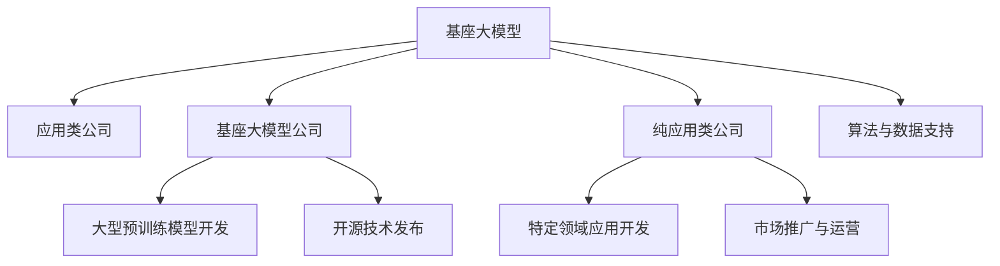

                 

# 基座大模型公司 vs 纯应用类公司：角色与目标之别

## 1. 背景介绍

当前，全球科技行业正处于人工智能(AI)技术应用的飞速发展阶段，众多科技公司纷纷布局AI领域，涌现出一批以大模型为基座和以应用为核心的公司。这些公司各具特色，但背后的角色与目标存在显著差异。理解这些差异对于行业从业者和投资者来说至关重要。

### 1.1 大模型与应用的初步探索
在大模型时代，基座大模型公司与纯应用类公司开始崭露头角。基座大模型公司通过投入大量资源和人力进行基础研究，构建大规模预训练模型，如GPT、BERT等。而纯应用类公司则专注于将这些大模型应用到具体场景中，如智能客服、金融舆情监测、个性化推荐等。两家公司各有优势，形成了鲜明的对比。

### 1.2 大模型公司的兴起
基座大模型公司如OpenAI、Google等，通过强大的预训练模型和开源技术，推动了AI领域的前沿研究与技术创新。这些公司投入巨资构建大规模数据集和计算资源，开发复杂高效的深度学习算法，形成了一整套AI基础设施。

### 1.3 应用类公司的蓬勃发展
纯应用类公司，如阿里、美团等，依托基座大模型的技术成果，在具体应用领域实现了快速迭代和市场突破。这些公司利用基座模型的基础能力，结合自身业务需求，快速迭代推出符合市场需求的AI产品。

## 2. 核心概念与联系

### 2.1 核心概念概述

为更好地理解基座大模型公司和纯应用类公司的差异，本节将介绍几个关键概念：

- 基座大模型(Foundational Large Model)：指通过大规模数据预训练构建的通用语言模型，具备丰富的语言知识和常识推理能力。这类模型可以应用于多种自然语言处理任务，是AI技术研发的基础设施。

- 应用类公司(Application-based Company)：指基于基座大模型技术，在特定行业领域开发AI应用的公司。这类公司往往专注于产品落地和市场拓展，较少进行基础研究。

- 基座大模型公司(Foundation Large Model Company)：指专注于开发和维护基座大模型的公司，如OpenAI、Google Deepmind等。这类公司投入大量资源，进行核心技术的研发和推广。

- 纯应用类公司(Application-based Company)：指基于基座大模型，开发特定场景下AI应用的公司，如阿里、美团等。这类公司主要依赖基座大模型提供的技术支持，专注于产品开发和市场运营。

这些核心概念之间的逻辑关系可以通过以下Mermaid流程图来展示：



这个流程图展示了大模型和应用类公司之间的依赖关系：

1. 基座大模型公司通过开发和发布预训练模型及开源技术，为应用类公司提供技术支持。
2. 应用类公司利用基座大模型的技术能力，开发特定场景下的AI应用，并通过市场推广实现商业化。
3. 在实际应用中，基座大模型和应用类公司之间有数据和算法的互动，不断迭代优化产品和服务。

## 3. 核心算法原理 & 具体操作步骤
### 3.1 算法原理概述

基座大模型和应用类公司的工作原理各具特色，但都基于深度学习算法和大规模数据预训练。本节将从算法角度介绍两者的核心原理。

### 3.2 算法步骤详解

#### 基座大模型公司
基座大模型公司主要进行以下步骤：

1. **数据预处理**：构建大规模数据集，并进行清洗、标注等预处理。
2. **模型设计**：设计预训练模型架构，如Transformer、BERT等。
3. **模型训练**：在GPU/TPU等高性能设备上，进行大规模无标签数据的预训练。
4. **模型优化**：基于具体任务需求，进行有监督微调，提升模型在特定任务上的性能。
5. **技术发布**：将训练好的模型进行开源或授权，推动技术传播和应用。

#### 纯应用类公司
纯应用类公司主要进行以下步骤：

1. **需求分析**：分析具体应用场景的需求，确定要解决的问题。
2. **基座模型引入**：引入基座大模型的开源版本或API服务。
3. **应用开发**：结合基座大模型，开发针对具体应用的产品和解决方案。
4. **产品优化**：根据用户反馈，不断迭代优化产品功能和性能。
5. **市场推广**：通过营销渠道推广产品，实现商业化。

### 3.3 算法优缺点

基座大模型公司与纯应用类公司各有优缺点，具体如下：

#### 基座大模型公司
- **优点**：
  1. **技术领先**：掌握核心技术，引领行业发展。
  2. **数据优势**：拥有海量数据资源，推动技术创新。
  3. **持续研发**：持续投入研发，技术迭代快。
  4. **标准制定**：影响技术标准和行业规范。
- **缺点**：
  1. **高成本**：需要大量资金和技术投入。
  2. **市场风险**：技术突破和市场应用的不确定性。
  3. **复杂度**：技术复杂，难度大，研发周期长。

#### 纯应用类公司
- **优点**：
  1. **快速应用**：快速迭代产品，市场反应快。
  2. **市场导向**：精准解决用户痛点，提高用户体验。
  3. **成本低**：技术依赖开源，成本低。
  4. **灵活性**：应用灵活，能快速适应市场需求。
- **缺点**：
  1. **技术依赖**：技术依赖基座大模型，受制于人。
  2. **产品同质化**：产品同质化现象严重，差异化不足。
  3. **技术短板**：缺乏核心技术，长期发展受限。

### 3.4 算法应用领域

基座大模型公司和纯应用类公司的应用领域各有所长。

#### 基座大模型公司
- **研究前沿**：基础研究，如自然语言处理(NLP)、计算机视觉(CV)、语音识别(Speech Recognition)等。
- **技术创新**：推动行业技术革新，如深度学习、强化学习、迁移学习等。
- **技术开源**：促进技术传播，如TensorFlow、PyTorch、GPT-3等。

#### 纯应用类公司
- **行业应用**：特定领域的应用，如金融、医疗、电商、教育等。
- **产品开发**：解决具体问题，如智能客服、舆情监测、推荐系统等。
- **市场拓展**：推动市场应用，如阿里、美团、腾讯等。

## 4. 数学模型和公式 & 详细讲解 & 举例说明
### 4.1 数学模型构建

为了更好地理解基座大模型公司和纯应用类公司的算法原理，本节将使用数学语言对基座大模型的预训练过程进行更加严格的刻画。

记基座大模型为 $M_{\theta}$，其中 $\theta$ 为预训练得到的模型参数。假设基座大模型通过大规模无标签数据集 $D$ 进行预训练，目标是最小化数据分布误差：

$$
\min_{\theta} \mathcal{L}_{pre}(M_{\theta}, D)
$$

其中 $\mathcal{L}_{pre}$ 为预训练损失函数，通常为基于掩码的自监督损失，如语言模型损失、掩码语言模型损失等。

### 4.2 公式推导过程

以BERT模型的预训练为例，推导其掩码语言模型损失函数及其梯度计算公式。

记BERT模型的输入为 $(x_i, y_i)$，其中 $x_i$ 为输入文本，$y_i$ 为输入文本的掩码掩码。则掩码语言模型损失函数为：

$$
\ell(x_i, y_i) = -\frac{1}{N} \sum_{i=1}^N \sum_{j=1}^N -y_{i,j}\log P(y_j|x_i)
$$

其中 $P(y_j|x_i)$ 为预测掩码位置 $y_j$ 的概率分布。将其代入预训练损失函数，得：

$$
\mathcal{L}_{pre}(\theta) = \frac{1}{N}\sum_{i=1}^N \sum_{j=1}^N -y_{i,j}\log P(y_j|x_i)
$$

根据链式法则，掩码语言模型损失函数对参数 $\theta$ 的梯度为：

$$
\frac{\partial \mathcal{L}_{pre}(\theta)}{\partial \theta} = \frac{1}{N}\sum_{i=1}^N \sum_{j=1}^N \frac{\partial \log P(y_j|x_i)}{\partial \theta}
$$

其中 $\frac{\partial \log P(y_j|x_i)}{\partial \theta}$ 可进一步递归展开，利用自动微分技术完成计算。

### 4.3 案例分析与讲解

以金融舆情监测任务为例，分析BERT模型微调的具体步骤。

首先，收集金融领域相关的新闻、报道、评论等文本数据，进行标注，构建数据集 $D=\{(x_i, y_i)\}_{i=1}^N$。在此基础上，将数据集划分为训练集、验证集和测试集。

然后，在基座大模型之上，设计并引入BERT模型的输出层和损失函数。对于分类任务，通常使用线性分类器和交叉熵损失函数。

接下来，设置微调超参数，选择合适的优化算法及其参数，如AdamW、SGD等，设置学习率、批大小、迭代轮数等。同时，应用正则化技术，如L2正则、Dropout、Early Stopping等，防止模型过度适应小规模训练集。

最后，执行梯度训练，使用训练集数据分批次输入模型，前向传播计算损失函数，反向传播计算参数梯度，根据设定的优化算法和学习率更新模型参数。周期性在验证集上评估模型性能，根据性能指标决定是否触发 Early Stopping。重复上述步骤直至满足预设的迭代轮数或 Early Stopping 条件。

## 5. 项目实践：代码实例和详细解释说明
### 5.1 开发环境搭建

在进行微调实践前，我们需要准备好开发环境。以下是使用Python进行PyTorch开发的环境配置流程：

1. 安装Anaconda：从官网下载并安装Anaconda，用于创建独立的Python环境。

2. 创建并激活虚拟环境：
```bash
conda create -n pytorch-env python=3.8 
conda activate pytorch-env
```

3. 安装PyTorch：根据CUDA版本，从官网获取对应的安装命令。例如：
```bash
conda install pytorch torchvision torchaudio cudatoolkit=11.1 -c pytorch -c conda-forge
```

4. 安装Transformers库：
```bash
pip install transformers
```

5. 安装各类工具包：
```bash
pip install numpy pandas scikit-learn matplotlib tqdm jupyter notebook ipython
```

完成上述步骤后，即可在`pytorch-env`环境中开始微调实践。

### 5.2 源代码详细实现

这里我们以金融舆情监测任务为例，给出使用Transformers库对BERT模型进行微调的PyTorch代码实现。

首先，定义BERT模型进行舆情监测的数据处理函数：

```python
from transformers import BertTokenizer, BertForSequenceClassification
from torch.utils.data import Dataset, DataLoader
import torch

class FinancialNewsDataset(Dataset):
    def __init__(self, texts, labels, tokenizer, max_len=128):
        self.texts = texts
        self.labels = labels
        self.tokenizer = tokenizer
        self.max_len = max_len
        
    def __len__(self):
        return len(self.texts)
    
    def __getitem__(self, item):
        text = self.texts[item]
        label = self.labels[item]
        
        encoding = self.tokenizer(text, return_tensors='pt', max_length=self.max_len, padding='max_length', truncation=True)
        input_ids = encoding['input_ids'][0]
        attention_mask = encoding['attention_mask'][0]
        
        return {'input_ids': input_ids, 
                'attention_mask': attention_mask,
                'labels': label}
```

然后，定义模型和优化器：

```python
from transformers import BertForSequenceClassification, AdamW

model = BertForSequenceClassification.from_pretrained('bert-base-cased', num_labels=2)

optimizer = AdamW(model.parameters(), lr=2e-5)
```

接着，定义训练和评估函数：

```python
device = torch.device('cuda') if torch.cuda.is_available() else torch.device('cpu')
model.to(device)

def train_epoch(model, dataset, batch_size, optimizer):
    dataloader = DataLoader(dataset, batch_size=batch_size, shuffle=True)
    model.train()
    epoch_loss = 0
    for batch in dataloader:
        input_ids = batch['input_ids'].to(device)
        attention_mask = batch['attention_mask'].to(device)
        labels = batch['labels'].to(device)
        model.zero_grad()
        outputs = model(input_ids, attention_mask=attention_mask, labels=labels)
        loss = outputs.loss
        epoch_loss += loss.item()
        loss.backward()
        optimizer.step()
    return epoch_loss / len(dataloader)

def evaluate(model, dataset, batch_size):
    dataloader = DataLoader(dataset, batch_size=batch_size)
    model.eval()
    preds, labels = [], []
    with torch.no_grad():
        for batch in dataloader:
            input_ids = batch['input_ids'].to(device)
            attention_mask = batch['attention_mask'].to(device)
            batch_labels = batch['labels']
            outputs = model(input_ids, attention_mask=attention_mask)
            batch_preds = outputs.logits.argmax(dim=1).to('cpu').tolist()
            batch_labels = batch_labels.to('cpu').tolist()
            for pred, label in zip(batch_preds, batch_labels):
                preds.append(pred)
                labels.append(label)
                
    print(classification_report(labels, preds))
```

最后，启动训练流程并在测试集上评估：

```python
epochs = 5
batch_size = 16

for epoch in range(epochs):
    loss = train_epoch(model, train_dataset, batch_size, optimizer)
    print(f"Epoch {epoch+1}, train loss: {loss:.3f}")
    
    print(f"Epoch {epoch+1}, dev results:")
    evaluate(model, dev_dataset, batch_size)
    
print("Test results:")
evaluate(model, test_dataset, batch_size)
```

以上就是使用PyTorch对BERT进行金融舆情监测任务微调的完整代码实现。可以看到，得益于Transformers库的强大封装，我们可以用相对简洁的代码完成BERT模型的加载和微调。

### 5.3 代码解读与分析

让我们再详细解读一下关键代码的实现细节：

**FinancialNewsDataset类**：
- `__init__`方法：初始化文本、标签、分词器等关键组件。
- `__len__`方法：返回数据集的样本数量。
- `__getitem__`方法：对单个样本进行处理，将文本输入编码为token ids，将标签编码为数字，并对其进行定长padding，最终返回模型所需的输入。

**训练和评估函数**：
- 使用PyTorch的DataLoader对数据集进行批次化加载，供模型训练和推理使用。
- 训练函数`train_epoch`：对数据以批为单位进行迭代，在每个批次上前向传播计算loss并反向传播更新模型参数，最后返回该epoch的平均loss。
- 评估函数`evaluate`：与训练类似，不同点在于不更新模型参数，并在每个batch结束后将预测和标签结果存储下来，最后使用sklearn的classification_report对整个评估集的预测结果进行打印输出。

**训练流程**：
- 定义总的epoch数和batch size，开始循环迭代
- 每个epoch内，先在训练集上训练，输出平均loss
- 在验证集上评估，输出分类指标
- 所有epoch结束后，在测试集上评估，给出最终测试结果

可以看到，PyTorch配合Transformers库使得BERT微调的代码实现变得简洁高效。开发者可以将更多精力放在数据处理、模型改进等高层逻辑上，而不必过多关注底层的实现细节。

当然，工业级的系统实现还需考虑更多因素，如模型的保存和部署、超参数的自动搜索、更灵活的任务适配层等。但核心的微调范式基本与此类似。

## 6. 实际应用场景
### 6.1 智能客服系统

基于大语言模型微调的对话技术，可以广泛应用于智能客服系统的构建。传统客服往往需要配备大量人力，高峰期响应缓慢，且一致性和专业性难以保证。而使用微调后的对话模型，可以7x24小时不间断服务，快速响应客户咨询，用自然流畅的语言解答各类常见问题。

在技术实现上，可以收集企业内部的历史客服对话记录，将问题和最佳答复构建成监督数据，在此基础上对预训练对话模型进行微调。微调后的对话模型能够自动理解用户意图，匹配最合适的答案模板进行回复。对于客户提出的新问题，还可以接入检索系统实时搜索相关内容，动态组织生成回答。如此构建的智能客服系统，能大幅提升客户咨询体验和问题解决效率。

### 6.2 金融舆情监测

金融机构需要实时监测市场舆论动向，以便及时应对负面信息传播，规避金融风险。传统的人工监测方式成本高、效率低，难以应对网络时代海量信息爆发的挑战。基于大语言模型微调的文本分类和情感分析技术，为金融舆情监测提供了新的解决方案。

具体而言，可以收集金融领域相关的新闻、报道、评论等文本数据，并对其进行主题标注和情感标注。在此基础上对预训练语言模型进行微调，使其能够自动判断文本属于何种主题，情感倾向是正面、中性还是负面。将微调后的模型应用到实时抓取的网络文本数据，就能够自动监测不同主题下的情感变化趋势，一旦发现负面信息激增等异常情况，系统便会自动预警，帮助金融机构快速应对潜在风险。

### 6.3 个性化推荐系统

当前的推荐系统往往只依赖用户的历史行为数据进行物品推荐，无法深入理解用户的真实兴趣偏好。基于大语言模型微调技术，个性化推荐系统可以更好地挖掘用户行为背后的语义信息，从而提供更精准、多样的推荐内容。

在实践中，可以收集用户浏览、点击、评论、分享等行为数据，提取和用户交互的物品标题、描述、标签等文本内容。将文本内容作为模型输入，用户的后续行为（如是否点击、购买等）作为监督信号，在此基础上微调预训练语言模型。微调后的模型能够从文本内容中准确把握用户的兴趣点。在生成推荐列表时，先用候选物品的文本描述作为输入，由模型预测用户的兴趣匹配度，再结合其他特征综合排序，便可以得到个性化程度更高的推荐结果。

### 6.4 未来应用展望

随着大语言模型微调技术的发展，基于微调范式将在更多领域得到应用，为传统行业带来变革性影响。

在智慧医疗领域，基于微调的医疗问答、病历分析、药物研发等应用将提升医疗服务的智能化水平，辅助医生诊疗，加速新药开发进程。

在智能教育领域，微调技术可应用于作业批改、学情分析、知识推荐等方面，因材施教，促进教育公平，提高教学质量。

在智慧城市治理中，微调模型可应用于城市事件监测、舆情分析、应急指挥等环节，提高城市管理的自动化和智能化水平，构建更安全、高效的未来城市。

此外，在企业生产、社会治理、文娱传媒等众多领域，基于大模型微调的人工智能应用也将不断涌现，为NLP技术带来了全新的突破。随着预训练模型和微调方法的不断进步，相信NLP技术将在更广阔的应用领域大放异彩。

## 7. 工具和资源推荐
### 7.1 学习资源推荐

为了帮助开发者系统掌握大语言模型微调的理论基础和实践技巧，这里推荐一些优质的学习资源：

1. 《Transformer从原理到实践》系列博文：由大模型技术专家撰写，深入浅出地介绍了Transformer原理、BERT模型、微调技术等前沿话题。

2. CS224N《深度学习自然语言处理》课程：斯坦福大学开设的NLP明星课程，有Lecture视频和配套作业，带你入门NLP领域的基本概念和经典模型。

3. 《Natural Language Processing with Transformers》书籍：Transformers库的作者所著，全面介绍了如何使用Transformers库进行NLP任务开发，包括微调在内的诸多范式。

4. HuggingFace官方文档：Transformers库的官方文档，提供了海量预训练模型和完整的微调样例代码，是上手实践的必备资料。

5. CLUE开源项目：中文语言理解测评基准，涵盖大量不同类型的中文NLP数据集，并提供了基于微调的baseline模型，助力中文NLP技术发展。

通过对这些资源的学习实践，相信你一定能够快速掌握大语言模型微调的精髓，并用于解决实际的NLP问题。
###  7.2 开发工具推荐

高效的开发离不开优秀的工具支持。以下是几款用于大语言模型微调开发的常用工具：

1. PyTorch：基于Python的开源深度学习框架，灵活动态的计算图，适合快速迭代研究。大部分预训练语言模型都有PyTorch版本的实现。

2. TensorFlow：由Google主导开发的开源深度学习框架，生产部署方便，适合大规模工程应用。同样有丰富的预训练语言模型资源。

3. Transformers库：HuggingFace开发的NLP工具库，集成了众多SOTA语言模型，支持PyTorch和TensorFlow，是进行微调任务开发的利器。

4. Weights & Biases：模型训练的实验跟踪工具，可以记录和可视化模型训练过程中的各项指标，方便对比和调优。与主流深度学习框架无缝集成。

5. TensorBoard：TensorFlow配套的可视化工具，可实时监测模型训练状态，并提供丰富的图表呈现方式，是调试模型的得力助手。

6. Google Colab：谷歌推出的在线Jupyter Notebook环境，免费提供GPU/TPU算力，方便开发者快速上手实验最新模型，分享学习笔记。

合理利用这些工具，可以显著提升大语言模型微调任务的开发效率，加快创新迭代的步伐。

### 7.3 相关论文推荐

大语言模型和微调技术的发展源于学界的持续研究。以下是几篇奠基性的相关论文，推荐阅读：

1. Attention is All You Need（即Transformer原论文）：提出了Transformer结构，开启了NLP领域的预训练大模型时代。

2. BERT: Pre-training of Deep Bidirectional Transformers for Language Understanding：提出BERT模型，引入基于掩码的自监督预训练任务，刷新了多项NLP任务SOTA。

3. Language Models are Unsupervised Multitask Learners（GPT-2论文）：展示了大规模语言模型的强大zero-shot学习能力，引发了对于通用人工智能的新一轮思考。

4. Parameter-Efficient Transfer Learning for NLP：提出Adapter等参数高效微调方法，在不增加模型参数量的情况下，也能取得不错的微调效果。

5. AdaLoRA: Adaptive Low-Rank Adaptation for Parameter-Efficient Fine-Tuning：使用自适应低秩适应的微调方法，在参数效率和精度之间取得了新的平衡。

6. Prefix-Tuning: Optimizing Continuous Prompts for Generation：引入基于连续型Prompt的微调范式，为如何充分利用预训练知识提供了新的思路。

这些论文代表了大语言模型微调技术的发展脉络。通过学习这些前沿成果，可以帮助研究者把握学科前进方向，激发更多的创新灵感。

## 8. 总结：未来发展趋势与挑战
### 8.1 总结

本文对基座大模型公司和纯应用类公司的角色与目标进行了全面系统的介绍。首先阐述了基座大模型公司和纯应用类公司的兴起背景和发展现状，明确了两者之间的依赖关系和差异化目标。其次，从算法角度介绍了基座大模型公司和纯应用类公司的核心原理和具体操作步骤，给出了详细的代码实现和性能评估。同时，本文还广泛探讨了基座大模型公司和纯应用类公司在实际应用场景中的广泛应用，展示了微调范式的巨大潜力。

通过本文的系统梳理，可以看到，基座大模型公司和纯应用类公司各具特色，共同推动了人工智能技术的普及和发展。基座大模型公司通过持续的研发和技术创新，为应用类公司提供了强大的技术支持。而纯应用类公司则通过快速迭代和市场推广，将技术落地到具体场景中，实现了商业化应用。两者相辅相成，共同构建了现代人工智能技术的生态体系。

### 8.2 未来发展趋势

展望未来，基座大模型公司和纯应用类公司将呈现以下几个发展趋势：

1. 技术融合加速。基座大模型公司将继续深化技术创新，推动AI技术向更广泛的应用领域扩展。纯应用类公司则将加强技术积累，提升自身在特定领域的技术能力。两者将更加紧密地合作，推动AI技术的发展。

2. 应用领域拓展。基座大模型公司将继续拓展AI技术的应用场景，如医疗、法律、金融等垂直领域。纯应用类公司则将利用基座大模型的技术优势，开发更多高价值的应用产品。

3. 多模态融合。未来的AI技术将不再局限于文本数据，而是向图像、视频、语音等多模态数据融合发展。基座大模型公司将引入多模态预训练技术，纯应用类公司将开发多模态应用产品。

4. 伦理与治理。随着AI技术的广泛应用，伦理与安全问题将日益凸显。基座大模型公司将加强伦理道德约束，纯应用类公司将构建数据隐私保护机制。

5. 持续学习与动态优化。未来的AI系统需要具备持续学习与动态优化能力，基座大模型公司将推动技术突破，纯应用类公司将优化产品迭代流程。

6. 全球化合作。随着AI技术的全球化发展，基座大模型公司将加强国际合作，共同推动技术标准的制定。纯应用类公司将拓展全球市场，推动技术传播与落地。

### 8.3 面临的挑战

尽管基座大模型公司和纯应用类公司取得了显著成果，但在迈向更加智能化、普适化应用的过程中，仍面临诸多挑战：

1. 技术标准不一。不同的公司和平台采用了不同的技术和算法，导致技术标准不一，增加了系统集成和互操作性难题。

2. 数据隐私问题。基座大模型和应用类公司需要处理海量数据，数据隐私保护成为一大挑战。如何确保数据安全，防止数据泄露，将是长期关注的重要问题。

3. 伦理道德挑战。AI技术的应用可能带来伦理道德风险，如偏见、歧视、误导等。如何在技术设计和应用过程中加强伦理约束，保障用户权益，将是关键课题。

4. 市场竞争激烈。AI技术的商业化应用竞争激烈，如何构建核心竞争力，保持长期发展优势，将是企业的长期挑战。

5. 技术落地难度。AI技术从实验室到市场的落地过程复杂，如何提高技术易用性，降低使用门槛，将是关键问题。

6. 持续投入压力。AI技术的研发和应用需要持续的资金和人力投入，如何平衡短期收益与长期投入，将是企业的战略难题。

### 8.4 研究展望

面对基座大模型公司和纯应用类公司所面临的挑战，未来的研究需要在以下几个方面寻求新的突破：

1. 构建统一的技术标准。推动AI技术的标准化，提高系统集成和互操作性，确保技术的一致性和可靠性。

2. 加强数据隐私保护。开发隐私保护技术，确保数据在传输和存储过程中的安全，防止数据泄露和滥用。

3. 制定伦理道德规范。构建AI技术的伦理道德框架，推动技术的设计和应用符合人类价值观和伦理规范。

4. 优化产品易用性。开发用户友好的AI工具和平台，降低技术使用门槛，提升用户体验。

5. 平衡短期与长期投入。通过技术创新和商业模式创新，平衡短期收益和长期投入，实现可持续发展。

6. 加强国际合作与交流。推动AI技术的全球化发展，加强国际合作，共同推动技术标准的制定和应用推广。

这些研究方向的探索，将引领基座大模型公司和纯应用类公司走向成熟，为构建安全、可靠、可解释、可控的智能系统铺平道路。面向未来，AI技术的核心竞争力将更多地体现在技术融合、应用拓展、多模态融合、伦理治理等方面，基座大模型公司和纯应用类公司需共同努力，推动AI技术向更加普适化、智能化方向发展。

## 9. 附录：常见问题与解答

**Q1：基座大模型公司和纯应用类公司之间的角色与目标有何差异？**

A: 基座大模型公司专注于基础研究，通过大规模预训练构建通用语言模型，推动AI技术的发展。而纯应用类公司则依托基座大模型技术，开发特定场景下的AI应用，实现商业化落地。两者之间的角色与目标存在显著差异。

**Q2：基座大模型公司和纯应用类公司在数据应用上有何不同？**

A: 基座大模型公司通常需要收集大规模无标签数据进行预训练，数据依赖于开源或政府机构提供。而纯应用类公司则依赖于基座大模型的开源版本，对数据的需求相对较小。

**Q3：基座大模型公司和纯应用类公司在技术研发上有何不同？**

A: 基座大模型公司进行基础研究，投入大量资金和人力进行技术创新和模型优化。而纯应用类公司主要关注产品开发，利用基座大模型技术进行快速迭代和市场推广。

**Q4：基座大模型公司和纯应用类公司在市场推广上有何不同？**

A: 基座大模型公司主要通过开源技术推广，吸引开发者和合作伙伴。而纯应用类公司则通过市场推广和产品优化，快速拓展市场份额。

**Q5：基座大模型公司和纯应用类公司在伦理治理上有何不同？**

A: 基座大模型公司需要建立伦理道德框架，确保技术设计和应用符合人类价值观和伦理规范。而纯应用类公司则需构建数据隐私保护机制，防止数据泄露和滥用。

通过以上问答，可以看出基座大模型公司和纯应用类公司在数据应用、技术研发、市场推广、伦理治理等方面存在显著差异，两者相互依赖、相互促进，共同推动AI技术的普适化和智能化发展。

---

作者：禅与计算机程序设计艺术 / Zen and the Art of Computer Programming

