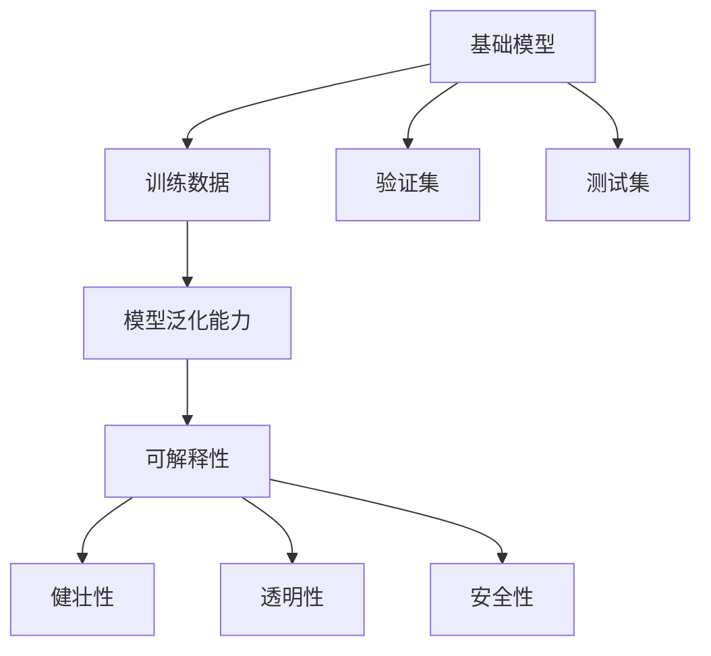

                 

# 基础模型的专业规范与科学精神

## 1. 背景介绍

随着人工智能技术的迅猛发展，基础模型在学术和工业界得到了广泛的应用。然而，在实际应用中，模型的规范性和科学性仍然存在诸多问题，影响了模型的实际效果和可信度。本文将系统介绍基础模型的专业规范与科学精神，帮助开发者更好地理解和使用基础模型。

## 2. 核心概念与联系

### 2.1 核心概念概述

为更好地理解基础模型的专业规范与科学精神，本节将介绍几个密切相关的核心概念：

- 基础模型(Fundamental Models)：指能够在大规模数据上训练的、具有普适性和可解释性的模型，如线性回归、逻辑回归、决策树、神经网络等。
- 训练数据(Training Data)：指用于训练模型的大量原始数据，包括特征和标签。
- 验证集(Validation Set)：指用于验证模型在未见过的数据上的泛化性能的样本集。
- 测试集(Test Set)：指用于评估模型泛化能力的外部数据集。
- 模型泛化能力(Generalization Capability)：指模型在新数据上的表现能力。
- 可解释性(Interpretability)：指模型输出的结果是否具有合理性和可信度，是否能够被用户理解和使用。
- 健壮性(Robustness)：指模型在对抗各种攻击、噪声干扰和异常情况下的稳定性。
- 透明性(Transparency)：指模型的决策过程是否透明、公正，是否存在潜在的偏见和歧视。
- 安全性(Security)：指模型是否能够抵御潜在的安全威胁，保证数据和模型的安全。

这些核心概念之间的逻辑关系可以通过以下Mermaid流程图来展示：



这个流程图展示了一系列概念之间的关系：

1. 基础模型通过训练数据进行训练，从而获得泛化能力。
2. 通过验证集对模型进行评估，确保泛化能力的可靠性。
3. 在测试集上评估模型的泛化能力，从而对模型的实际效果进行评价。
4. 模型泛化能力的高低，直接影响可解释性、健壮性、透明性和安全性。

这些概念共同构成了基础模型的规范性和科学精神的核心框架，确保了模型的应用价值和可靠性。

## 3. 核心算法原理 & 具体操作步骤
### 3.1 算法原理概述

基础模型的训练过程包括数据预处理、模型训练、模型评估和模型调优等步骤。其核心原理是利用训练数据对模型进行优化，使其在验证集和测试集上表现良好，从而具有较高的泛化能力。

### 3.2 算法步骤详解

基础模型的训练过程可以分解为以下几个关键步骤：

**Step 1: 数据预处理**
- 对原始数据进行清洗、去重、归一化、标准化等预处理操作，确保数据质量和一致性。
- 将数据集划分为训练集、验证集和测试集，确保每个集合并具有代表性。

**Step 2: 模型训练**
- 选择合适的优化器（如SGD、Adam、Adagrad等）和损失函数（如均方误差、交叉熵、对数损失等）。
- 设置合适的学习率、批量大小和迭代轮数，确保模型收敛。
- 使用正则化技术（如L2正则、Dropout、Early Stopping等），防止过拟合。
- 使用数据增强技术（如数据扩充、噪声注入等），增加模型鲁棒性。

**Step 3: 模型评估**
- 在验证集上评估模型泛化能力，计算各项指标（如准确率、精确率、召回率、F1值等）。
- 根据评估结果调整模型参数，如学习率、批量大小等。

**Step 4: 模型调优**
- 对模型进行多次训练和评估，选择泛化性能最佳的模型作为最终模型。
- 在测试集上评估最终模型的泛化能力，确保模型的实际应用效果。

### 3.3 算法优缺点

基础模型的训练过程具有以下优点：

1. 简单易行。通过选择适当的算法和超参数，可以在较短的时间内获得较好的模型效果。
2. 适应性强。基础模型可以应用于各种不同的任务和数据类型，具有较高的泛化能力。
3. 可解释性好。基础模型的决策过程通常比较简单，易于理解和解释。

同时，该方法也存在一定的局限性：

1. 对数据依赖性强。基础模型的训练效果很大程度上取决于训练数据的质量和数量，获取高质量数据成本较高。
2. 模型复杂度低。基础模型的表现主要依赖于特征工程和超参数调优，难以处理复杂问题。
3. 泛化能力有限。当数据分布差异较大时，基础模型的泛化性能可能受到影响。
4. 可解释性不足。基础模型的决策过程通常缺乏可解释性，难以对其推理逻辑进行分析和调试。

尽管存在这些局限性，但就目前而言，基础模型的训练过程仍然是最主流的数据驱动学习范式，具有重要的理论价值和实际应用意义。

### 3.4 算法应用领域

基础模型的训练过程广泛应用于各种NLP任务，如文本分类、情感分析、机器翻译、命名实体识别、问答系统等。

在文本分类任务中，基础模型通过训练数据对文本进行分类，如情感分类、主题分类等。通过选择适当的特征提取方法（如TF-IDF、Word2Vec等），可以显著提升分类效果。

在情感分析任务中，基础模型通过训练数据对文本进行情感极性判断，如正面、负面、中性等。通过选择适当的损失函数和评估指标，可以提升情感分析的准确性和鲁棒性。

在机器翻译任务中，基础模型通过训练数据对文本进行语言翻译，如将英文翻译成中文等。通过选择适当的模型架构（如Seq2Seq、Transformer等），可以显著提升翻译效果。

在命名实体识别任务中，基础模型通过训练数据对文本中的实体进行识别和标注，如人名、地名、机构名等。通过选择适当的标签空间和评估指标，可以提升实体识别的准确性和鲁棒性。

在问答系统中，基础模型通过训练数据对自然语言问题进行理解和回答，如构建知识图谱、选择最佳答案等。通过选择适当的模型架构和推理算法，可以实现高效、准确的回答。

除了上述这些经典任务外，基础模型的训练过程也被创新性地应用到更多场景中，如自动摘要、信息抽取、语音识别、图像识别等，为NLP技术带来了全新的突破。随着基础模型的不断发展，相信NLP技术将在更广阔的应用领域大放异彩。

## 4. 数学模型和公式 & 详细讲解 & 举例说明
### 4.1 数学模型构建

本节将使用数学语言对基础模型的训练过程进行更加严格的刻画。

记基础模型为 $M_{\theta}(x)$，其中 $x$ 为输入样本，$\theta$ 为模型参数。假设训练数据集为 $D=\{(x_i,y_i)\}_{i=1}^N$，其中 $y_i \in \{0,1\}$ 为标签。

定义模型 $M_{\theta}$ 在数据样本 $(x,y)$ 上的损失函数为 $\ell(M_{\theta}(x),y)$，则在数据集 $D$ 上的经验风险为：

$$
\mathcal{L}(\theta) = \frac{1}{N} \sum_{i=1}^N \ell(M_{\theta}(x_i),y_i)
$$

其中 $\ell$ 为损失函数，如交叉熵损失、均方误差损失等。

训练模型的目标是最小化经验风险，即找到最优参数：

$$
\theta^* = \mathop{\arg\min}_{\theta} \mathcal{L}(\theta)
$$

在实践中，我们通常使用基于梯度的优化算法（如SGD、Adam等）来近似求解上述最优化问题。设 $\eta$ 为学习率，$\lambda$ 为正则化系数，则参数的更新公式为：

$$
\theta \leftarrow \theta - \eta \nabla_{\theta}\mathcal{L}(\theta) - \eta\lambda\theta
$$

其中 $\nabla_{\theta}\mathcal{L}(\theta)$ 为损失函数对参数 $\theta$ 的梯度，可通过反向传播算法高效计算。

### 4.2 公式推导过程

以下我们以二分类任务为例，推导交叉熵损失函数及其梯度的计算公式。

假设模型 $M_{\theta}$ 在输入 $x$ 上的输出为 $\hat{y}=M_{\theta}(x) \in [0,1]$，表示样本属于正类的概率。真实标签 $y \in \{0,1\}$。则二分类交叉熵损失函数定义为：

$$
\ell(M_{\theta}(x),y) = -[y\log \hat{y} + (1-y)\log (1-\hat{y})]
$$

将其代入经验风险公式，得：

$$
\mathcal{L}(\theta) = -\frac{1}{N}\sum_{i=1}^N [y_i\log M_{\theta}(x_i)+(1-y_i)\log(1-M_{\theta}(x_i))]
$$

根据链式法则，损失函数对参数 $\theta_k$ 的梯度为：

$$
\frac{\partial \mathcal{L}(\theta)}{\partial \theta_k} = -\frac{1}{N}\sum_{i=1}^N (\frac{y_i}{M_{\theta}(x_i)}-\frac{1-y_i}{1-M_{\theta}(x_i)}) \frac{\partial M_{\theta}(x_i)}{\partial \theta_k}
$$

其中 $\frac{\partial M_{\theta}(x_i)}{\partial \theta_k}$ 可进一步递归展开，利用自动微分技术完成计算。

在得到损失函数的梯度后，即可带入参数更新公式，完成模型的迭代优化。重复上述过程直至收敛，最终得到适应下游任务的最优模型参数 $\theta^*$。

### 4.3 案例分析与讲解

以线性回归模型为例，说明基础模型训练过程的具体步骤。

**Step 1: 数据预处理**
- 收集训练数据集 $D=\{(x_i,y_i)\}_{i=1}^N$，其中 $x_i \in \mathbb{R}^d$ 为输入特征，$y_i \in \mathbb{R}$ 为标签。
- 对原始数据进行清洗、去重、归一化等预处理操作，确保数据质量和一致性。

**Step 2: 模型训练**
- 选择适当的优化器（如SGD）和损失函数（如均方误差）。
- 设置合适的学习率 $\eta$ 和批量大小 $m$，确保模型收敛。
- 使用正则化技术（如L2正则），防止过拟合。
- 使用数据增强技术（如随机噪声注入），增加模型鲁棒性。

**Step 3: 模型评估**
- 在验证集上评估模型泛化能力，计算均方误差 $MSE$ 和决定系数 $R^2$。
- 根据评估结果调整模型参数，如学习率、批量大小等。

**Step 4: 模型调优**
- 对模型进行多次训练和评估，选择泛化性能最佳的模型作为最终模型。
- 在测试集上评估最终模型的泛化能力，确保模型的实际应用效果。

在实际应用中，基础模型的训练过程还需要考虑更多因素，如超参数调优、特征工程、模型集成等。但核心的训练范式基本与此类似。

## 5. 项目实践：代码实例和详细解释说明
### 5.1 开发环境搭建

在进行基础模型训练实践前，我们需要准备好开发环境。以下是使用Python进行PyTorch开发的环境配置流程：

1. 安装Anaconda：从官网下载并安装Anaconda，用于创建独立的Python环境。

2. 创建并激活虚拟环境：
```bash
conda create -n pytorch-env python=3.8 
conda activate pytorch-env
```

3. 安装PyTorch：根据CUDA版本，从官网获取对应的安装命令。例如：
```bash
conda install pytorch torchvision torchaudio cudatoolkit=11.1 -c pytorch -c conda-forge
```

4. 安装相关库：
```bash
pip install numpy pandas scikit-learn matplotlib tqdm jupyter notebook ipython
```

完成上述步骤后，即可在`pytorch-env`环境中开始基础模型训练实践。

### 5.2 源代码详细实现

下面我们以线性回归模型为例，给出使用PyTorch进行基础模型训练的代码实现。

首先，定义线性回归模型：

```python
import torch
import torch.nn as nn
import torch.optim as optim

class LinearRegression(nn.Module):
    def __init__(self, input_dim):
        super(LinearRegression, self).__init__()
        self.linear = nn.Linear(input_dim, 1)

    def forward(self, x):
        return self.linear(x)
```

然后，定义训练函数：

```python
def train_model(model, train_loader, optimizer, epochs, device):
    model.to(device)
    for epoch in range(epochs):
        model.train()
        for batch_idx, (data, target) in enumerate(train_loader):
            data, target = data.to(device), target.to(device)
            optimizer.zero_grad()
            output = model(data)
            loss = nn.MSELoss()(output, target)
            loss.backward()
            optimizer.step()
            if (batch_idx+1) % 100 == 0:
                print('Train Epoch: {} [{}/{} ({:.0f}%)]\tLoss: {:.6f}'.format(
                    epoch, batch_idx * len(data), len(train_loader.dataset),
                    100. * batch_idx / len(train_loader), loss.item()))
```

最后，启动训练流程：

```python
device = torch.device('cuda' if torch.cuda.is_available() else 'cpu')

# 定义训练集和测试集
train_dataset = torchvision.datasets.MNIST(root='./data', train=True, transform=transforms.ToTensor(), download=True)
test_dataset = torchvision.datasets.MNIST(root='./data', train=False, transform=transforms.ToTensor(), download=True)

# 定义数据加载器
train_loader = torch.utils.data.DataLoader(train_dataset, batch_size=64, shuffle=True)
test_loader = torch.utils.data.DataLoader(test_dataset, batch_size=1000, shuffle=False)

# 定义模型、优化器和损失函数
model = LinearRegression(784)
optimizer = optim.SGD(model.parameters(), lr=0.001, momentum=0.9)
criterion = nn.MSELoss()

# 训练模型
train_model(model, train_loader, optimizer, epochs=10, device=device)

# 测试模型
model.eval()
with torch.no_grad():
    correct = 0
    total = 0
    for data, target in test_loader:
        data, target = data.to(device), target.to(device)
        output = model(data)
        _, predicted = torch.max(output.data, 1)
        total += target.size(0)
        correct += (predicted == target).sum().item()

    print('Accuracy of the network on the 10000 test images: {} %'.format(100 * correct / total))
```

以上就是使用PyTorch进行线性回归模型训练的完整代码实现。可以看到，得益于PyTorch的强大封装，我们可以用相对简洁的代码完成模型的定义、训练和测试。

### 5.3 代码解读与分析

让我们再详细解读一下关键代码的实现细节：

**LinearRegression类**：
- `__init__`方法：初始化线性回归模型，其中 `self.linear` 为线性层。
- `forward`方法：前向传播计算模型的输出。

**train_model函数**：
- 在每个epoch内，对模型进行训练。
- 使用DataLoader对训练集进行批次化加载，供模型训练使用。
- 在每个batch上前向传播计算损失函数，并反向传播更新模型参数。
- 每100个batch输出一次训练进度和损失值。
- 在测试集上评估模型泛化能力，输出模型精度。

**代码实现细节**：
- `model.to(device)`：将模型参数转移到GPU或CPU设备上，加速模型计算。
- `nn.MSELoss()`：定义均方误差损失函数。
- `optimizer.zero_grad()`：清零优化器的梯度缓存。
- `optimizer.step()`：执行梯度更新。
- `with torch.no_grad()`：开启无梯度计算模式，加速测试过程。

可以看到，PyTorch提供的强大工具和库，使得基础模型的训练过程变得非常高效和灵活。开发者可以更加专注于模型架构和特征工程的设计，而不必过多关注底层的实现细节。

## 6. 实际应用场景
### 6.1 数据挖掘与分析

基础模型在数据挖掘与分析中具有广泛的应用，能够自动从海量数据中提取有价值的信息和规律。

在零售行业，基础模型可以帮助企业分析客户消费行为，识别高价值客户，提升客户满意度和忠诚度。例如，通过分类算法对客户进行细分，可以发现不同客户群体的消费特点，从而制定针对性的营销策略。

在金融行业，基础模型可以帮助银行和保险公司进行风险评估，识别潜在的风险客户。例如，通过回归算法对客户信用评分进行预测，可以评估客户的信用风险，制定相应的授信策略。

在医疗行业，基础模型可以帮助医院和诊所进行疾病预测和诊断，提高医疗服务的精准性和效率。例如，通过分类算法对病人的症状进行诊断，可以预测病人的患病概率，提供个性化的治疗方案。

### 6.2 推荐系统

推荐系统是基础模型的经典应用之一，通过分析用户的历史行为数据，为用户推荐感兴趣的商品和服务。

在电商平台上，基础模型可以帮助卖家提升销售额，为用户推荐相关的商品。例如，通过协同过滤算法对用户行为进行分析，可以发现用户对商品的兴趣偏好，从而推荐相似的商品。

在视频平台上，基础模型可以帮助视频制作者提升观看量，为用户推荐感兴趣的视频。例如，通过内容推荐算法对视频内容进行分析，可以推荐相关主题的视频，增加用户的观看时长和满意度。

在音乐平台上，基础模型可以帮助音乐人提升播放量，为用户推荐喜欢的音乐。例如，通过协同过滤算法对用户行为进行分析，可以推荐相似类型的音乐，增加用户的播放时长和满意度。

### 6.3 自动生成内容

基础模型在自动生成内容方面也具有广泛的应用，能够自动生成高质量的文章、代码、图像等内容。

在内容生成领域，基础模型可以帮助媒体公司生成新闻报道、广告文案等内容。例如，通过语言模型对大量文本数据进行训练，可以自动生成高质量的报道，减少人力成本，提高内容生产的效率。

在代码生成领域，基础模型可以帮助软件开发人员生成高质量的代码。例如，通过代码生成模型对代码库进行分析，可以自动生成相似的代码，减少开发时间，提高代码质量。

在图像生成领域，基础模型可以帮助艺术家生成高质量的图像。例如，通过生成对抗网络(GAN)对大量图像数据进行训练，可以自动生成逼真的图像，增加创作灵感，提高艺术创作的效率。

### 6.4 未来应用展望

随着基础模型的不断发展，其应用领域也将不断拓展，为各行各业带来新的突破。

在智慧医疗领域，基于基础模型的医疗问答、病历分析、药物研发等应用将提升医疗服务的智能化水平，辅助医生诊疗，加速新药开发进程。

在智能教育领域，基础模型可应用于作业批改、学情分析、知识推荐等方面，因材施教，促进教育公平，提高教学质量。

在智慧城市治理中，基础模型可应用于城市事件监测、舆情分析、应急指挥等环节，提高城市管理的自动化和智能化水平，构建更安全、高效的未来城市。

此外，在企业生产、社会治理、文娱传媒等众多领域，基于基础模型的人工智能应用也将不断涌现，为经济社会发展注入新的动力。相信随着技术的日益成熟，基础模型必将在更广阔的应用领域大放异彩，深刻影响人类的生产生活方式。

## 7. 工具和资源推荐
### 7.1 学习资源推荐

为了帮助开发者系统掌握基础模型的训练技术，这里推荐一些优质的学习资源：

1. 《机器学习实战》：这本书详细介绍了基础模型的训练方法和应用案例，适合初学者快速入门。

2. 《深度学习》（Ian Goodfellow著）：这本书是深度学习的经典教材，介绍了各种基础模型的训练原理和应用场景。

3. Coursera上的“机器学习”课程：斯坦福大学的Andrew Ng教授讲授的机器学习课程，深入浅出地介绍了各种基础模型和训练方法。

4. Kaggle：Kaggle是一个数据科学竞赛平台，汇集了大量高质量的数据集和竞赛题目，适合进行实际训练和实践。

5. GitHub：GitHub是一个代码托管平台，汇集了大量开源代码和库，适合进行代码学习和借鉴。

通过对这些资源的学习实践，相信你一定能够快速掌握基础模型的训练方法和应用技巧，并用于解决实际的NLP问题。

### 7.2 开发工具推荐

高效的开发离不开优秀的工具支持。以下是几款用于基础模型训练开发的常用工具：

1. PyTorch：基于Python的开源深度学习框架，灵活便捷，适合快速迭代研究。

2. TensorFlow：由Google主导开发的开源深度学习框架，功能强大，适合大规模工程应用。

3. Keras：基于TensorFlow和Theano等后端实现的高级深度学习框架，简单易用，适合快速原型开发。

4. scikit-learn：Python的科学计算库，提供了丰富的机器学习算法和数据处理工具，适合进行数据预处理和特征工程。

5. Jupyter Notebook：Python的交互式开发环境，支持代码编写和实时展示，适合进行研究和实验。

合理利用这些工具，可以显著提升基础模型训练的开发效率，加快创新迭代的步伐。

### 7.3 相关论文推荐

基础模型的训练过程涉及大量前沿技术，以下是几篇奠基性的相关论文，推荐阅读：

1. 《Perceptron: an improved training strategy for multiclass linear perceptrons》：这篇论文首次提出了线性回归模型的训练算法，奠定了线性回归模型的基础。

2. 《Multiclass classification by Decision Trees and Ensemble Methods》：这篇论文首次提出了决策树模型的训练算法，奠定了决策树模型的基础。

3. 《Adaptive Boosting》：这篇论文首次提出了Adaboost算法，奠定了集成学习的理论基础。

4. 《Deep Learning》：这篇论文是深度学习的经典教材，介绍了各种基础模型的训练原理和应用场景。

5. 《Deep Residual Learning for Image Recognition》：这篇论文首次提出了残差网络(ResNet)，奠定了深度卷积神经网络的基础。

这些论文代表了大模型训练技术的发展脉络，通过学习这些前沿成果，可以帮助研究者把握学科前进方向，激发更多的创新灵感。

## 8. 总结：未来发展趋势与挑战

### 8.1 总结

本文对基础模型的专业规范与科学精神进行了全面系统的介绍。首先阐述了基础模型在学术和工业界的应用现状和价值，明确了基础模型训练过程中的规范性和科学性。其次，从原理到实践，详细讲解了基础模型训练过程的各个环节，给出了具体的代码实现和分析。同时，本文还广泛探讨了基础模型在多个领域的应用前景，展示了其广泛的应用价值。

通过本文的系统梳理，可以看到，基础模型的训练过程正在成为机器学习和人工智能领域的重要范式，极大地拓展了数据驱动学习的边界，推动了人工智能技术的广泛应用。未来，伴随基础模型的不断发展，相信NLP技术将在更广阔的应用领域大放异彩，深刻影响人类的生产生活方式。

### 8.2 未来发展趋势

展望未来，基础模型的训练过程将呈现以下几个发展趋势：

1. 模型规模持续增大。随着算力成本的下降和数据规模的扩张，基础模型的参数量还将持续增长。超大规模基础模型蕴含的丰富知识，有望支撑更加复杂多变的训练任务。

2. 训练方法日趋多样。除了传统的随机梯度下降(Stochastic Gradient Descent)外，未来会涌现更多高效的训练方法，如基于优化器的方法(如Adam、Adagrad等)、基于自适应的方法(如AdaGrad、AdaDelta等)、基于矩估计的方法(如RMSprop等)。

3. 训练过程自动化。未来训练过程将更多地依赖自动化工具和库，减少人工干预，提高训练效率和稳定性。例如，使用机器学习库自动选择优化器、学习率、批量大小等超参数。

4. 数据增强技术广泛应用。基础模型训练过程中将更多地采用数据增强技术，增加模型的鲁棒性和泛化能力。例如，通过图像翻转、噪声注入等方法，增加训练数据的多样性。

5. 模型融合与迁移学习。未来训练过程中将更多地采用模型融合与迁移学习技术，提升模型泛化能力。例如，将多个基础模型进行融合，形成更加鲁棒的集成模型。

6. 自监督学习方法兴起。未来训练过程中将更多地采用自监督学习方法，减少对标注数据的依赖，提高模型的泛化能力。例如，通过掩码语言模型、自回归模型等方法，利用无标注数据进行预训练。

这些趋势凸显了基础模型训练技术的广阔前景。这些方向的探索发展，必将进一步提升基础模型的性能和应用范围，为人工智能技术的发展注入新的动力。

### 8.3 面临的挑战

尽管基础模型的训练过程已经取得了显著进展，但在迈向更加智能化、普适化应用的过程中，它仍面临着诸多挑战：

1. 数据质量瓶颈。基础模型的训练效果很大程度上取决于训练数据的质量和数量，获取高质量数据成本较高。如何通过数据增强、自监督学习等方法，提高训练数据的质量，是未来亟需解决的问题。

2. 模型复杂度问题。随着模型规模的增大，训练过程变得越来越复杂，难以进行优化和调试。如何采用更加高效的训练方法，减少模型复杂度，是未来亟需解决的问题。

3. 泛化能力不足。当数据分布差异较大时，基础模型的泛化性能可能受到影响。如何通过迁移学习、自监督学习等方法，提升模型的泛化能力，是未来亟需解决的问题。

4. 可解释性不足。基础模型的决策过程通常缺乏可解释性，难以对其推理逻辑进行分析和调试。如何提升模型的可解释性，是未来亟需解决的问题。

5. 安全性问题。基础模型面临潜在的安全威胁，如对抗样本攻击、数据泄露等。如何提升模型的安全性，是未来亟需解决的问题。

6. 伦理道德问题。基础模型可能学习到有害信息，如偏见、歧视等。如何提升模型的伦理道德性，是未来亟需解决的问题。

这些挑战凸显了基础模型训练技术的复杂性和多样性，需要持续不断地进行研究和技术创新，以应对新的问题和挑战。

### 8.4 研究展望

面对基础模型训练所面临的挑战，未来的研究需要在以下几个方面寻求新的突破：

1. 探索更高效的数据增强方法。采用更加多样化的数据增强技术，如噪声注入、变换网络等，提升模型的泛化能力。

2. 研究更高效的模型融合方法。采用更加多样化的模型融合方法，如投票、堆叠、混合网络等，提升模型的鲁棒性和泛化能力。

3. 引入更多先验知识。将符号化的先验知识，如知识图谱、逻辑规则等，与神经网络模型进行巧妙融合，引导基础模型学习更准确、合理的知识。

4. 结合因果分析和博弈论工具。将因果分析方法引入基础模型，识别出模型决策的关键特征，增强输出解释的因果性和逻辑性。借助博弈论工具刻画人机交互过程，主动探索并规避模型的脆弱点，提高系统稳定性。

5. 纳入伦理道德约束。在基础模型的训练目标中引入伦理导向的评估指标，过滤和惩罚有害的输出倾向。同时加强人工干预和审核，建立模型行为的监管机制，确保输出符合人类价值观和伦理道德。

这些研究方向的探索，必将引领基础模型训练技术迈向更高的台阶，为人工智能技术的落地应用提供坚实的基础。面向未来，基础模型训练技术还需要与其他人工智能技术进行更深入的融合，如知识表示、因果推理、强化学习等，多路径协同发力，共同推动人工智能技术的进步。只有勇于创新、敢于突破，才能不断拓展基础模型的边界，让智能技术更好地造福人类社会。

## 9. 附录：常见问题与解答

**Q1：基础模型的训练过程是否一定要使用大量标注数据？**

A: 基础模型的训练过程通常需要大量的标注数据，以获得较好的泛化能力。然而，对于部分低标注数据的任务，如半监督学习、零样本学习等，也可以通过自监督学习方法，利用无标注数据进行预训练，从而提升模型的泛化能力。

**Q2：如何处理训练数据中的噪声和异常值？**

A: 训练数据中的噪声和异常值会对模型的训练效果产生负面影响，通常采用以下方法进行处理：
1. 数据清洗：对原始数据进行清洗、去重、归一化等预处理操作，确保数据质量和一致性。
2. 数据增强：通过数据扩充、噪声注入等方法，增加训练数据的多样性。
3. 异常值检测：对训练数据进行异常值检测和处理，去除噪声和异常值。

**Q3：如何防止过拟合？**

A: 过拟合是基础模型训练过程中常见的问题，通常采用以下方法进行处理：
1. 数据增强：通过数据扩充、噪声注入等方法，增加训练数据的多样性。
2. 正则化：使用L2正则、Dropout、Early Stopping等方法，防止过拟合。
3. 模型集成：通过多个基础模型的集成，降低过拟合风险。

**Q4：基础模型的训练过程是否需要可视化工具？**

A: 可视化工具可以帮助开发者更好地理解训练过程和模型效果，通常采用以下方法：
1. 训练日志：记录训练过程中的损失值、学习率等关键指标，进行趋势分析。
2. 可视化工具：使用TensorBoard、Weights & Biases等可视化工具，实时监测训练状态和模型效果。

**Q5：如何处理训练数据中的类别不平衡问题？**

A: 训练数据中的类别不平衡问题会导致模型对少数类别的预测效果较差，通常采用以下方法进行处理：
1. 类别权重调整：在损失函数中加入类别权重，调整不同类别的损失比例。
2. 过采样和欠采样：通过过采样和欠采样方法，平衡不同类别的样本数量。

这些方法可以帮助开发者更好地处理训练数据中的噪声、异常值、过拟合、类别不平衡等问题，确保基础模型训练过程的稳定性和可靠性。

---

作者：禅与计算机程序设计艺术 / Zen and the Art of Computer Programming

