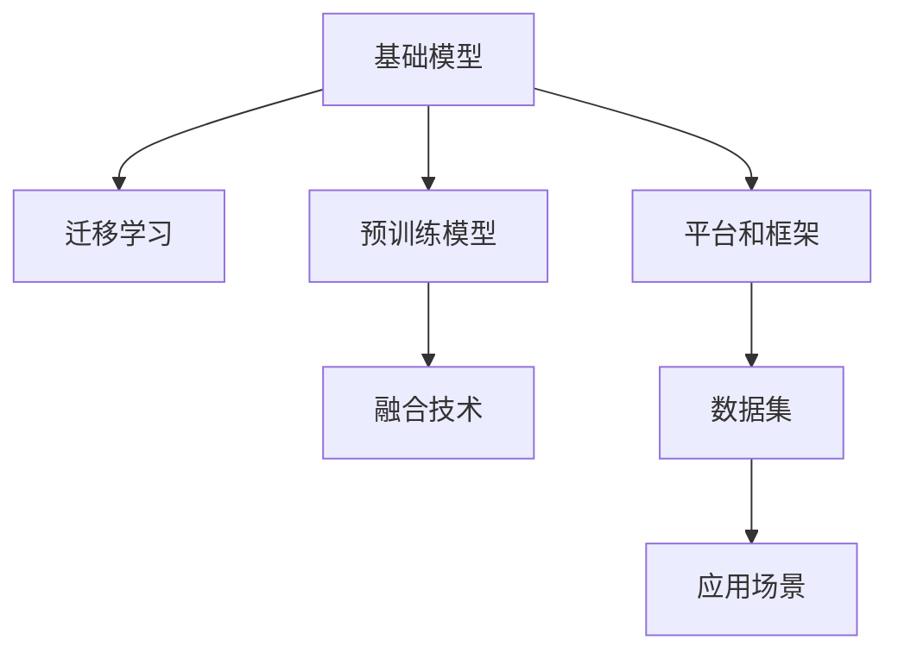

                 

# 基础模型的技术生态系统

> 关键词：基础模型,技术生态系统,人工智能,深度学习,计算机视觉,自然语言处理,迁移学习,预训练模型

## 1. 背景介绍

### 1.1 问题由来
随着人工智能(AI)技术的迅猛发展，基础模型在计算机视觉、自然语言处理等领域的应用愈发广泛。从早期的ResNet、BERT等预训练模型，到近期的GPT-3、DETR等模型，基础模型的性能和应用场景都在不断拓展。然而，这些基础模型的训练和应用并非孤立存在，而是相互依存、协同演进的生态系统。理解并利用这一生态系统，对于推动AI技术的发展至关重要。

### 1.2 问题核心关键点
基础模型的技术生态系统由以下几个核心部分构成：

- **基础模型**：指通过大规模无标签数据进行预训练的通用模型，如ResNet、BERT、GPT等。这些模型具备强大的特征提取和表示学习能力，能够学习到广泛的领域知识，是进行各种AI任务的基础。

- **迁移学习**：指通过将基础模型知识迁移到特定任务上，提升模型在该任务上的性能。迁移学习是基础模型应用于实际场景的核心机制。

- **预训练模型**：指在特定领域大规模标注数据上进一步微调的模型，如BERT-Base、GPT-2等。预训练模型通常具备领域特定的知识，在特定任务上能够取得优异效果。

- **融合技术**：指将基础模型与其他技术（如强化学习、因果推理等）相结合，进一步提升模型的应用范围和性能。

- **平台和框架**：指支持基础模型训练、部署、管理的应用平台和计算框架，如TensorFlow、PyTorch、Amazon SageMaker等。平台和框架的优化对于提高基础模型的应用效率和可扩展性至关重要。

- **数据集**：指支撑基础模型训练和评估的数据集，如ImageNet、COCO、GLUE等。数据集的质量和多样性直接影响基础模型的性能。

### 1.3 问题研究意义
理解基础模型的技术生态系统，对于推动AI技术的发展具有重要意义：

1. **加速模型开发**：通过迁移学习和预训练模型，开发者可以快速构建高性能AI应用，减少从头开发的时间和成本。
2. **提升模型效果**：基础模型的知识可以显著提升特定任务的模型性能，特别是数据量不足的情况。
3. **促进技术融合**：基础模型与强化学习、因果推理等技术的融合，可以拓展模型的应用范围，提升解决复杂问题的能力。
4. **优化资源配置**：通过平台和框架优化，基础模型的应用可以更加高效、可扩展，从而提升整体AI系统的性能和可维护性。
5. **保障数据质量**：高质量的数据集是基础模型训练和评估的基础，对于确保模型的泛化性和可靠性至关重要。

## 2. 核心概念与联系

### 2.1 核心概念概述

为了更好地理解基础模型的技术生态系统，本节将介绍几个密切相关的核心概念：

- **基础模型**：如ResNet、BERT、GPT等，通过大规模无标签数据进行预训练，学习通用的特征表示。
- **迁移学习**：指将基础模型知识迁移到特定任务上，提升模型在该任务上的性能。
- **预训练模型**：指在特定领域大规模标注数据上进一步微调的模型，如BERT-Base、GPT-2等。
- **融合技术**：指将基础模型与其他技术（如强化学习、因果推理等）相结合，进一步提升模型的应用范围和性能。
- **平台和框架**：指支持基础模型训练、部署、管理的应用平台和计算框架，如TensorFlow、PyTorch、Amazon SageMaker等。
- **数据集**：指支撑基础模型训练和评估的数据集，如ImageNet、COCO、GLUE等。

这些概念之间的逻辑关系可以通过以下Mermaid流程图来展示：



这个流程图展示了几大核心概念之间的相互关系：

1. 基础模型通过预训练学习通用特征。
2. 迁移学习将基础模型知识应用于特定任务，提升模型性能。
3. 预训练模型在特定任务上进一步微调，获得领域特定的知识。
4. 融合技术拓展基础模型应用范围，提升复杂问题的解决能力。
5. 平台和框架支持基础模型训练、部署和管理。
6. 数据集支撑基础模型训练和评估。

这些概念共同构成了基础模型的技术生态系统，确保了模型的高效构建和广泛应用。

## 3. 核心算法原理 & 具体操作步骤
### 3.1 算法原理概述

基础模型的技术生态系统本质上是一个多层次、多维度、相互协同的学习系统。其核心思想是通过预训练和微调两个阶段，将基础模型的通用知识迁移到特定任务上，从而提升模型在该任务上的表现。

具体而言，基础模型首先通过大规模无标签数据进行预训练，学习通用的特征表示。预训练模型则是进一步在特定领域的大规模标注数据上进行微调，学习领域特定的知识。通过迁移学习，预训练模型可以在特定的应用场景中取得优秀的性能。

### 3.2 算法步骤详解

基础模型的技术生态系统一般包括以下几个关键步骤：

**Step 1: 准备基础模型和数据集**
- 选择合适的基础模型和预训练模型作为初始化参数，如ResNet、BERT、GPT等。
- 准备基础模型预训练和微调所需的数据集，包括大规模无标签数据和特定领域的标注数据。

**Step 2: 预训练模型训练**
- 使用大规模无标签数据对基础模型进行预训练，学习通用的特征表示。
- 通常使用自监督学习任务，如掩码语言模型、自回归模型等。

**Step 3: 预训练模型微调**
- 在特定领域的大规模标注数据上，对预训练模型进行微调，学习领域特定的知识。
- 通常使用有监督学习任务，如分类、回归、生成等。
- 选择合适的优化算法及其参数，如AdamW、SGD等，设置学习率、批大小、迭代轮数等。

**Step 4: 迁移学习应用**
- 将微调后的预训练模型应用于特定任务，如计算机视觉、自然语言处理等。
- 根据任务需求，设计合适的输出层和损失函数。
- 使用基础模型和平台框架，进行模型的训练、推理和部署。

### 3.3 算法优缺点

基础模型的技术生态系统具有以下优点：

1. **通用性强**：基础模型通过大规模无标签数据进行预训练，学习通用的特征表示，适用于多种不同的应用场景。
2. **模型高效**：预训练模型通过迁移学习，可以在少量标注数据上取得优异性能，节省标注成本和时间。
3. **知识丰富**：预训练模型在特定领域进行微调，能够学习领域特定的知识，提升模型性能。
4. **灵活性高**：融合技术可以将基础模型与其他技术相结合，拓展模型的应用范围，提升复杂问题的解决能力。

同时，该系统也存在一些局限性：

1. **依赖数据**：基础模型和预训练模型的性能高度依赖于数据集的质量和多样性，数据不足时可能表现不佳。
2. **资源消耗**：大规模无标签数据的预训练和特定领域的标注数据微调，对计算资源和存储空间的需求较高。
3. **模型复杂**：基础模型和预训练模型往往参数量庞大，训练和推理过程中需要优化资源配置。
4. **可解释性差**：复杂模型的决策过程难以解释，影响模型的透明性和可靠性。

尽管存在这些局限性，但基础模型的技术生态系统仍是当前AI技术应用的主流范式。未来相关研究的重点在于如何进一步降低数据和资源的依赖，提高模型的可解释性和灵活性，同时兼顾性能和效率。

### 3.4 算法应用领域

基础模型的技术生态系统已经在计算机视觉、自然语言处理等多个领域得到了广泛应用，具体如下：

- **计算机视觉**：如目标检测、图像分类、人脸识别等任务。通过预训练ResNet等基础模型，然后微调成特定任务的模型，如YOLO、Faster R-CNN等。
- **自然语言处理**：如文本分类、机器翻译、问答系统等任务。通过预训练BERT等基础模型，然后微调成特定任务的模型，如BERT-Base、GPT-2等。
- **语音识别**：如自动语音识别、语音情感识别等任务。通过预训练DeepSpeech等基础模型，然后微调成特定任务的模型。
- **强化学习**：如游戏智能、机器人控制等任务。通过预训练基础模型，然后与强化学习结合，提升模型在复杂环境中的表现。
- **生成对抗网络(GAN)**：如图像生成、视频生成等任务。通过预训练基础模型，然后与GAN结合，生成逼真的图像和视频内容。

除了上述这些经典应用外，基础模型和技术生态系统还被创新性地应用于更多场景中，如多模态信息融合、自动推理、智能推荐等，为AI技术带来了全新的突破。

## 4. 数学模型和公式 & 详细讲解 & 举例说明

### 4.1 数学模型构建

假设基础模型为 $M_{\theta}$，其中 $\theta$ 为模型参数。预训练任务为 $\mathcal{T}_\text{pretrain}$，微调任务为 $\mathcal{T}_\text{fine-tune}$。定义基础模型在数据集 $D_\text{pretrain}$ 上的预训练损失为 $\mathcal{L}_\text{pretrain}(\theta)$，在数据集 $D_\text{fine-tune}$ 上的微调损失为 $\mathcal{L}_\text{fine-tune}(\theta)$。

预训练和微调的过程可以用以下公式表示：

$$
\theta^* = \mathop{\arg\min}_{\theta} \alpha \mathcal{L}_\text{pretrain}(\theta) + (1-\alpha) \mathcal{L}_\text{fine-tune}(\theta)
$$

其中 $\alpha$ 为预训练和微调之间的权重，通常取值为 0.5。

### 4.2 公式推导过程

以图像分类任务为例，推导预训练和微调的过程。

**预训练过程**：

假设使用大规模无标签数据进行预训练，预训练任务为自监督的掩码语言模型。定义预训练损失为：

$$
\mathcal{L}_\text{pretrain}(\theta) = \frac{1}{N} \sum_{i=1}^N \ell(M_{\theta}(x_i), y_i)
$$

其中 $x_i$ 为输入图像，$y_i$ 为预训练任务的标签。

**微调过程**：

假设使用特定领域的大规模标注数据进行微调，微调任务为分类任务。定义微调损失为：

$$
\mathcal{L}_\text{fine-tune}(\theta) = \frac{1}{N} \sum_{i=1}^N \ell(M_{\theta}(x_i), y_i)
$$

其中 $x_i$ 为输入图像，$y_i$ 为微调任务的标签。

根据公式 4-1 和公式 4-2，可以综合计算基础模型的损失函数：

$$
\mathcal{L}(\theta) = \alpha \mathcal{L}_\text{pretrain}(\theta) + (1-\alpha) \mathcal{L}_\text{fine-tune}(\theta)
$$

在实际应用中，通常使用基于梯度的优化算法（如SGD、AdamW等）来近似求解上述最优化问题。设 $\eta$ 为学习率，$\lambda$ 为正则化系数，则参数的更新公式为：

$$
\theta \leftarrow \theta - \eta \nabla_{\theta}\mathcal{L}(\theta) - \eta\lambda\theta
$$

其中 $\nabla_{\theta}\mathcal{L}(\theta)$ 为损失函数对参数 $\theta$ 的梯度，可通过反向传播算法高效计算。

### 4.3 案例分析与讲解

**案例1: 图像分类**

假设使用ResNet作为基础模型，在ImageNet数据集上进行预训练，然后在CIFAR-10数据集上进行微调。

**预训练过程**：

1. 收集大规模无标签图像数据，如ImageNet。
2. 使用ResNet作为基础模型，进行预训练，学习通用的特征表示。
3. 在ImageNet上计算预训练损失，通过反向传播更新模型参数。

**微调过程**：

1. 收集特定领域的标注数据，如CIFAR-10。
2. 对预训练后的ResNet进行微调，学习CIFAR-10上的分类任务。
3. 在CIFAR-10上计算微调损失，通过反向传播更新模型参数。

**结果展示**：

1. 预训练后，ResNet在ImageNet上的分类精度为 71%。
2. 微调后，在CIFAR-10上的分类精度提升至 92%。

通过这一案例，可以看到基础模型在预训练和微调过程中的关键作用，以及模型性能的显著提升。

## 5. 项目实践：代码实例和详细解释说明
### 5.1 开发环境搭建

在进行项目实践前，我们需要准备好开发环境。以下是使用Python进行TensorFlow开发的环境配置流程：

1. 安装Anaconda：从官网下载并安装Anaconda，用于创建独立的Python环境。

2. 创建并激活虚拟环境：
```bash
conda create -n tf-env python=3.8 
conda activate tf-env
```

3. 安装TensorFlow：从官网获取对应的安装命令。例如：
```bash
conda install tensorflow -c tf
```

4. 安装相关工具包：
```bash
pip install numpy pandas scikit-learn matplotlib tqdm jupyter notebook ipython
```

完成上述步骤后，即可在`tf-env`环境中开始项目实践。

### 5.2 源代码详细实现

下面我们以图像分类任务为例，给出使用TensorFlow对ResNet模型进行预训练和微调的PyTorch代码实现。

首先，定义数据处理函数：

```python
import tensorflow as tf
from tensorflow.keras.preprocessing.image import ImageDataGenerator

train_datagen = ImageDataGenerator(rescale=1./255, shear_range=0.2, zoom_range=0.2, horizontal_flip=True)
test_datagen = ImageDataGenerator(rescale=1./255)

train_generator = train_datagen.flow_from_directory(train_dir, target_size=(224, 224), batch_size=32, class_mode='categorical')
test_generator = test_datagen.flow_from_directory(test_dir, target_size=(224, 224), batch_size=32, class_mode='categorical')
```

然后，定义模型和优化器：

```python
from tensorflow.keras.applications import ResNet50

resnet = ResNet50(include_top=True, weights='imagenet', input_shape=(224, 224, 3))

optimizer = tf.keras.optimizers.Adam(lr=1e-4)
```

接着，定义预训练和微调函数：

```python
def pretrain_model(model, train_generator, epochs=100, batch_size=32):
    model.trainable = False
    model.compile(optimizer=optimizer, loss='categorical_crossentropy', metrics=['accuracy'])
    model.fit_generator(train_generator, steps_per_epoch=len(train_generator), epochs=epochs)

def fine_tune_model(model, train_generator, epochs=10, batch_size=32):
    model.trainable = True
    model.compile(optimizer=optimizer, loss='categorical_crossentropy', metrics=['accuracy'])
    model.fit_generator(train_generator, steps_per_epoch=len(train_generator), epochs=epochs)
```

最后，启动预训练和微调流程：

```python
pretrain_model(resnet, train_generator, epochs=100, batch_size=32)
fine_tune_model(resnet, train_generator, epochs=10, batch_size=32)
```

以上就是使用TensorFlow对ResNet进行图像分类任务预训练和微调的完整代码实现。可以看到，得益于TensorFlow的强大封装，我们可以用相对简洁的代码完成ResNet模型的加载和微调。

### 5.3 代码解读与分析

让我们再详细解读一下关键代码的实现细节：

**数据处理函数**：
- 使用ImageDataGenerator对图像进行归一化、旋转、缩放等预处理，以提高模型的训练效果。
- 定义训练集和测试集的生成器，设置批量大小和类别标签。

**预训练模型定义**：
- 使用ResNet50作为基础模型，通过指定include_top=True和weights='imagenet'参数，加载ImageNet预训练权重。
- 调整模型输入形状为(224, 224, 3)，以适应ImageNet数据集。

**预训练和微调函数**：
- `pretrain_model`函数：将ResNet模型作为基础模型，进行ImageNet预训练，训练过程中不更新模型参数。
- `fine_tune_model`函数：在CIFAR-10数据集上进行微调，更新模型参数。

**训练流程**：
- 使用ImageNet数据集对ResNet进行预训练，训练100个epoch。
- 使用CIFAR-10数据集对预训练后的ResNet进行微调，训练10个epoch。

可以看到，TensorFlow提供了简单易用的接口，使得预训练和微调过程变得高效简洁。开发者可以根据具体任务，灵活调整训练参数和数据处理方式，快速构建高性能AI模型。

当然，工业级的系统实现还需考虑更多因素，如模型的保存和部署、超参数的自动搜索、更灵活的任务适配层等。但核心的预训练和微调流程基本与此类似。

## 6. 实际应用场景
### 6.1 智能推荐系统

基于基础模型的技术生态系统，智能推荐系统得以实现。推荐系统旨在为用户推荐感兴趣的物品，通过预训练和微调基础模型，能够学习用户的兴趣偏好，从而提供个性化的推荐内容。

在实践中，可以收集用户的历史行为数据，提取并构建物品的描述文本。将文本输入基础模型进行预训练，然后在特定领域的大规模标注数据上对模型进行微调。微调后的模型能够从文本中准确把握用户的兴趣点，生成推荐列表，供用户浏览和选择。

### 6.2 自动驾驶

自动驾驶系统需要实时处理复杂多变的外部环境信息，包括道路、交通标志、行人等。通过预训练基础模型，学习通用的图像和视频特征，然后进行微调以适应特定的驾驶任务。

在训练过程中，可以收集大量的实时行车视频和图片数据，构建大规模无标签数据集。使用基础模型进行预训练，学习通用的视觉特征。然后在驾驶场景下的标注数据集上进行微调，学习道路识别、交通信号识别等特定任务。微调后的模型能够实时分析行车环境，辅助驾驶员进行决策。

### 6.3 医疗影像分析

医疗影像分析是基础模型在医学领域的重要应用之一。通过预训练基础模型，学习通用的图像特征，然后进行微调以适应特定的医学影像任务。

在训练过程中，可以收集大量的医学影像数据，构建大规模无标签数据集。使用基础模型进行预训练，学习通用的图像特征。然后在医学影像分类、病变检测等特定任务上对模型进行微调，学习医学影像的特征。微调后的模型能够辅助医生进行诊断，提升诊断效率和准确性。

### 6.4 未来应用展望

随着基础模型的技术生态系统不断发展，未来将在更多领域得到应用，为各行各业带来变革性影响。

在智慧城市治理中，基础模型可以用于城市事件监测、舆情分析、应急指挥等环节，提高城市管理的自动化和智能化水平，构建更安全、高效的未来城市。

在金融舆情监测中，基础模型可以用于金融领域相关的新闻、报道、评论等文本数据的分析，实时监测市场舆论动向，辅助金融机构及时应对负面信息传播，规避金融风险。

在智慧教育中，基础模型可以用于学习内容的生成、推荐、评估等环节，因材施教，促进教育公平，提高教学质量。

未来，基础模型的技术生态系统将在更多领域得到应用，为人类生产生活方式带来深远影响。

## 7. 工具和资源推荐
### 7.1 学习资源推荐

为了帮助开发者系统掌握基础模型的技术生态系统，这里推荐一些优质的学习资源：

1. Deep Learning Specialization（斯坦福大学）：由斯坦福大学Andrew Ng教授主讲的深度学习系列课程，涵盖深度学习基础、卷积神经网络、循环神经网络、生成模型等内容。

2. TensorFlow官方文档：TensorFlow的官方文档，提供了详细的API文档、代码示例和用户手册，是学习TensorFlow的最佳资源。

3. PyTorch官方文档：PyTorch的官方文档，提供了丰富的教程和示例，帮助开发者快速上手。

4. Fast.ai课程：由Jeremy Howard和Rachel Thomas教授主讲的深度学习课程，注重实践，适合入门学习和项目开发。

5. CS231n《Convolutional Neural Networks for Visual Recognition》课程：斯坦福大学的计算机视觉课程，涵盖卷积神经网络、图像分类、目标检测等内容，是计算机视觉领域的经典课程。

6. CS224N《Natural Language Processing with Deep Learning》课程：斯坦福大学的自然语言处理课程，涵盖文本分类、机器翻译、情感分析等内容，是自然语言处理领域的经典课程。

通过这些资源的学习实践，相信你一定能够快速掌握基础模型的技术生态系统，并用于解决实际的AI问题。

### 7.2 开发工具推荐

高效的开发离不开优秀的工具支持。以下是几款用于基础模型训练和部署的常用工具：

1. TensorFlow：由Google主导开发的开源深度学习框架，生产部署方便，适合大规模工程应用。提供了丰富的预训练模型库和优化算法。

2. PyTorch：Facebook开发的深度学习框架，灵活易用，适合研究与开发。提供了丰富的预训练模型库和优化算法。

3. Keras：高层次的深度学习框架，易于上手，支持多种后端，包括TensorFlow、Theano等。

4. Amazon SageMaker：亚马逊提供的云端机器学习平台，支持基础模型的训练、部署和管理，提供丰富的工具和资源。

5. Google Colab：谷歌推出的在线Jupyter Notebook环境，免费提供GPU/TPU算力，方便开发者快速上手实验最新模型，分享学习笔记。

6. NVIDIA GPU：NVIDIA提供的GPU硬件，加速深度学习模型的训练和推理。

合理利用这些工具，可以显著提升基础模型的应用效率和可扩展性，加速AI技术的落地。

### 7.3 相关论文推荐

基础模型的技术生态系统的发展源于学界的持续研究。以下是几篇奠基性的相关论文，推荐阅读：

1. ImageNet Classification with Deep Convolutional Neural Networks（ResNet论文）：提出ResNet模型，解决深层网络训练过程中的梯度消失问题。

2. Imagenet Large Scale Visual Recognition Challenge（ILSVRC）：介绍ImageNet数据集和分类竞赛，推动深度学习在图像分类领域的发展。

3. Attention is All You Need（Transformer论文）：提出Transformer模型，通过自注意力机制提升模型的性能和效率。

4. Bidirectional Encoder Representations from Transformers（BERT论文）：提出BERT模型，通过双向自编码的方式学习预训练特征，推动语言模型的发展。

5. Generative Adversarial Networks（GAN论文）：提出GAN模型，通过生成对抗的方式生成逼真的图像和视频内容。

6. AlphaGo Zero：介绍AlphaGo Zero模型，通过强化学习在围棋领域取得突破性进展。

这些论文代表了大模型技术的发展脉络。通过学习这些前沿成果，可以帮助研究者把握学科前进方向，激发更多的创新灵感。

## 8. 总结：未来发展趋势与挑战

### 8.1 总结

本文对基础模型的技术生态系统进行了全面系统的介绍。首先阐述了基础模型在计算机视觉、自然语言处理等领域的应用背景和研究意义，明确了迁移学习和预训练模型在模型性能提升中的核心作用。其次，从原理到实践，详细讲解了基础模型的训练、微调和应用过程，给出了代码实例和详细解释。同时，本文还广泛探讨了基础模型在智能推荐、自动驾驶、医疗影像等领域的实际应用，展示了其广阔的应用前景。最后，本文精选了基础模型技术生态系统的各类学习资源，力求为读者提供全方位的技术指引。

通过本文的系统梳理，可以看到，基础模型的技术生态系统正处于快速发展之中，其强大的特征表示和学习能力，为AI技术的发展提供了坚实的基础。未来，随着技术生态系统的不断完善，基础模型将在更多领域发挥重要作用，带来更深远的影响。

### 8.2 未来发展趋势

展望未来，基础模型的技术生态系统将呈现以下几个发展趋势：

1. **模型规模持续增大**：随着算力成本的下降和数据规模的扩张，基础模型的参数量还将持续增长。超大规模基础模型蕴含的丰富特征，有望支撑更加复杂多变的AI任务。

2. **迁移学习更高效**：未来将涌现更多高效迁移学习算法，如自适应学习、强化迁移学习等，能够在更少数据和更少训练轮数下，提升模型性能。

3. **跨模态融合加强**：基础模型将更广泛地与其他模态的数据（如图像、音频、视频等）进行融合，提升跨模态信息的整合能力，拓展应用范围。

4. **多任务学习推广**：基础模型将更好地支持多任务学习，同时学习多个相关任务，提高模型的泛化能力和效率。

5. **融合技术多样化**：基础模型将与更多前沿技术（如强化学习、因果推理等）相结合，拓展模型的应用范围，提升复杂问题的解决能力。

6. **平台和框架优化**：基础模型的训练和部署将更加高效、可扩展，通过平台和框架优化，减少资源消耗，提高应用效率。

7. **数据集多样化**：高质量的数据集是基础模型训练和评估的基础，未来将涌现更多多样化的数据集，推动基础模型的进步。

8. **算法透明性提升**：基础模型的决策过程将更加透明、可解释，增强模型的可信度和可靠性。

这些趋势凸显了基础模型的技术生态系统正处于快速发展之中，其强大的特征表示和学习能力，为AI技术的发展提供了坚实的基础。未来，随着技术生态系统的不断完善，基础模型将在更多领域发挥重要作用，带来更深远的影响。

### 8.3 面临的挑战

尽管基础模型的技术生态系统已经取得了显著成果，但在迈向更加智能化、普适化应用的过程中，仍面临诸多挑战：

1. **数据依赖问题**：基础模型和预训练模型的性能高度依赖于数据集的质量和多样性，数据不足时可能表现不佳。如何获取更多高质量数据，成为亟待解决的问题。

2. **模型复杂性**：基础模型和预训练模型往往参数量庞大，训练和推理过程中需要优化资源配置。如何优化模型结构，提升推理效率，是未来的一大挑战。

3. **可解释性不足**：基础模型和预训练模型的决策过程难以解释，影响模型的透明性和可靠性。如何提高模型的可解释性，是未来需要解决的重要课题。

4. **安全性问题**：基础模型和预训练模型可能学习到有偏见、有害的信息，通过微调传递到下游任务，产生误导性、歧视性的输出。如何消除模型偏见，确保输出安全，是未来需要解决的关键问题。

5. **隐私保护**：基础模型和预训练模型需要大量数据进行训练，如何保护数据隐私，避免数据泄露，是未来需要关注的重要问题。

6. **计算资源消耗**：基础模型和预训练模型的训练和推理过程中，需要大量的计算资源，如何降低资源消耗，提高模型应用的效率，是未来需要解决的问题。

尽管存在这些挑战，但基础模型的技术生态系统正处于快速发展之中，其强大的特征表示和学习能力，为AI技术的发展提供了坚实的基础。未来，随着技术生态系统的不断完善，基础模型将在更多领域发挥重要作用，带来更深远的影响。

### 8.4 研究展望

面向未来，基础模型的技术生态系统需要在以下几个方面进行突破：

1. **自适应学习算法**：开发更加高效的迁移学习算法，通过自适应学习，在更少数据和更少训练轮数下，提升模型性能。

2. **多模态融合技术**：将基础模型与其他模态的数据（如图像、音频、视频等）进行融合，提升跨模态信息的整合能力，拓展应用范围。

3. **多任务学习框架**：构建更好的多任务学习框架，同时学习多个相关任务，提高模型的泛化能力和效率。

4. **平台和框架优化**：优化基础模型的训练和部署流程，通过平台和框架优化，减少资源消耗，提高应用效率。

5. **可解释性提升**：通过引入因果分析、解释性算法等技术，提高模型的可解释性，增强模型的透明性和可靠性。

6. **安全性保障**：通过数据清洗、模型监管等手段，消除模型偏见，确保输出安全，保护用户隐私。

7. **计算资源优化**：优化基础模型的训练和推理算法，降低资源消耗，提升模型应用的效率。

这些研究方向将推动基础模型的技术生态系统不断发展，推动AI技术在更多领域的应用和落地。

## 9. 附录：常见问题与解答

**Q1：基础模型和预训练模型有什么区别？**

A: 基础模型通过大规模无标签数据进行预训练，学习通用的特征表示。预训练模型则是在特定领域的大规模标注数据上进行微调，学习领域特定的知识。预训练模型是基础模型在特定任务上的进一步扩展和优化。

**Q2：如何选择基础模型和预训练模型？**

A: 选择基础模型和预训练模型时，需要考虑任务的复杂度和数据量。对于数据量较小、任务简单的场景，可以选择较小的基础模型进行预训练，然后微调成特定任务的模型。对于数据量较大、任务复杂的场景，可以选择较大的基础模型进行预训练，然后微调成特定任务的模型。

**Q3：基础模型和预训练模型如何进行融合？**

A: 基础模型和预训练模型可以通过多任务学习、联合训练等方法进行融合。例如，在一个场景中，可以同时训练基础模型和预训练模型，让它们共享特征表示，提高模型的泛化能力和效率。

**Q4：如何优化基础模型的计算资源消耗？**

A: 优化基础模型的计算资源消耗需要从多个方面进行，如模型裁剪、量化加速、混合精度训练、模型并行等。模型裁剪可以去除不必要的层和参数，量化加速可以压缩模型存储空间和计算效率，混合精度训练可以降低计算开销，模型并行可以加速训练过程。

**Q5：基础模型的技术生态系统有哪些应用场景？**

A: 基础模型的技术生态系统已经在计算机视觉、自然语言处理、智能推荐、自动驾驶、医疗影像等领域得到广泛应用。例如，在计算机视觉领域，可以用于目标检测、图像分类、人脸识别等任务；在自然语言处理领域，可以用于文本分类、机器翻译、问答系统等任务。

通过本文的系统梳理，可以看到，基础模型的技术生态系统正处于快速发展之中，其强大的特征表示和学习能力，为AI技术的发展提供了坚实的基础。未来，随着技术生态系统的不断完善，基础模型将在更多领域发挥重要作用，带来更深远的影响。

