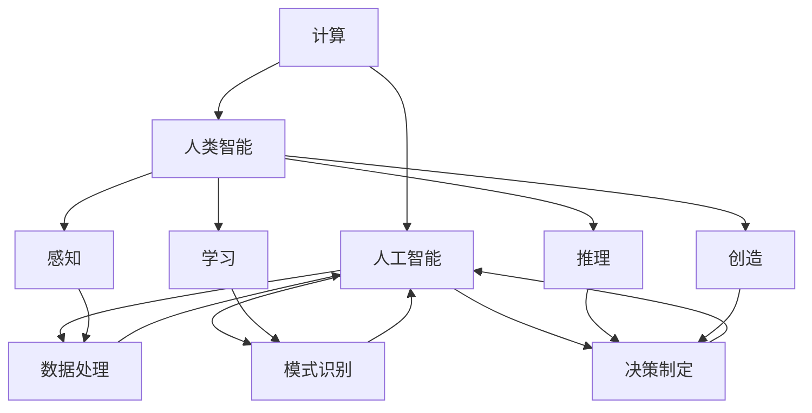

                 

# 塑造数字时代：人类计算的关键作用

> 关键词：数字时代,计算,人工智能,算法,人类智能,大数据

## 1. 背景介绍

### 1.1 问题由来
随着科技的飞速发展，人类社会已经步入了数字时代。在信息技术飞速进步的今天，计算已经成为了人类社会的基本生产工具之一。从早期的机械计算，到电算、网络计算，再到现在的云计算、大数据，计算形态经历了数次重大变革。每一次变革，都极大地促进了社会进步和经济发展。但随着计算能力的增强，人类计算与人工智能的关系也变得越来越密切。人工智能(AI)作为计算的重要分支，正在逐步改变着我们的生产方式和生活方式。

在人工智能发展的浪潮中，计算扮演着至关重要的角色。从算法的优化、模型训练，到数据的存储和处理，计算技术的突破极大地推动了AI技术的进步。然而，机器计算与人类智能的融合仍面临着诸多挑战。如何高效地利用计算资源，提升AI系统的智能水平，成为当前的热点问题。

### 1.2 问题核心关键点
要回答这一问题，首先需要明确以下关键点：
1. 计算在AI发展中的作用。计算为AI算法提供了数据、模型和训练工具，是其核心基础设施。
2. AI在计算中的角色。AI算法在计算资源的优化、特征提取和知识表示等方面提供了强有力的支持。
3. 计算与人类智能的融合。计算的强大能力，结合人类的智慧和经验，能够实现更加高效、智能的系统。

基于以上关键点，本文将探讨人类计算在AI发展中的作用、机器计算与人类智能的融合，以及计算与AI融合的未来发展趋势。

## 2. 核心概念与联系

### 2.1 核心概念概述

在探讨计算与AI的融合过程中，需要理解以下几个核心概念：

- 计算(Computation)：指通过物理或抽象的方式，对数据或符号进行处理的过程。计算可以是手动的、机械的，也可以是自动化的、数字化的。
- 人工智能(Artificial Intelligence, AI)：利用计算机模拟人类智能，实现数据处理、模式识别、决策制定等功能。
- 人类智能(Human Intelligence)：指人类思维、判断和解决问题的能力，通常涉及感知、学习、推理、创造等过程。
- 计算与AI的融合(Computational Intelligence)：指计算技术与AI算法结合，通过数据驱动、模型驱动、知识驱动等多种方式，实现更加高效、智能的系统。
- 人类计算(Human-Driven Computation)：指利用人类的智能和经验，指导计算资源进行高效的数据处理和决策。

这些概念之间的逻辑关系可以通过以下Mermaid流程图来展示：



这个流程图展示出计算与AI、人类智能之间的紧密联系：

1. 计算为AI提供了数据处理、模式识别、决策制定的基础设施。
2. AI算法通过学习训练，不断优化计算资源的使用效率。
3. 人类智能通过感知、学习、推理、创造等过程，指导计算进行高效的数据处理和决策。

这些概念共同构成了计算与AI融合的理论框架，推动了智能系统的构建和应用。

## 3. 核心算法原理 & 具体操作步骤
### 3.1 算法原理概述

计算与AI的融合，主要体现在算法和数据处理两个层面：

1. **算法层面**：AI算法通过高效的数据处理和模型优化，提升了计算资源的利用效率。
2. **数据层面**：计算技术为AI提供了大规模的数据存储和处理能力，支撑了算法的训练和应用。

AI算法主要分为两大类：

- **监督学习(监督学习)**：指在有标签的数据上，通过学习输入与输出之间的映射关系，进行预测或分类。
- **无监督学习(无监督学习)**：指在没有标签的数据上，通过学习数据的内在结构和特征，进行聚类、降维等操作。

在AI算法的训练过程中，计算起到了至关重要的作用：

- **模型训练**：通过反向传播算法，计算图被用于求解模型参数，优化损失函数，实现模型训练。
- **特征提取**：通过卷积、池化、变换网络等计算模型，提取数据的特征，进行高效的特征表示。
- **数据处理**：通过计算处理，实现数据的清洗、增强、归一化等预处理操作，为算法提供高质量的数据输入。

### 3.2 算法步骤详解

计算与AI的融合，主要包括以下几个关键步骤：

**Step 1: 数据准备**
- 收集、清洗、标注数据集，确保数据质量。
- 划分训练集、验证集和测试集，确保模型的泛化性能。

**Step 2: 选择合适的算法和模型**
- 根据任务类型和数据特征，选择适合的监督学习或无监督学习算法。
- 设计合适的计算模型，如卷积神经网络(CNN)、循环神经网络(RNN)、变换网络(Transformer)等。

**Step 3: 训练模型**
- 在计算资源上，利用反向传播算法训练模型，最小化损失函数。
- 应用正则化技术，如L2正则、Dropout等，防止模型过拟合。
- 使用GPU/TPU等高性能计算设备，加速模型训练。

**Step 4: 模型评估与优化**
- 在验证集上评估模型性能，调整模型参数和超参数。
- 使用测试集评估最终模型性能，输出结果报告。
- 应用模型进行预测，评估模型在实际应用中的效果。

**Step 5: 模型部署与维护**
- 将训练好的模型部署到生产环境，进行实时推理和预测。
- 监控模型性能，及时更新模型参数，确保系统稳定性。
- 维护模型数据，定期重新训练模型，提升模型泛化能力。

### 3.3 算法优缺点

计算与AI的融合，有以下优点：

1. **高效性**：计算技术的强大能力，使得AI算法能够快速处理大规模数据，实现高效的模型训练和推理。
2. **准确性**：通过计算优化，AI算法可以精确地提取数据特征，提升预测和分类的准确性。
3. **自动化**：计算技术为AI提供了自动化的数据处理和模型训练，大大减少了人工干预的复杂度。
4. **可扩展性**：通过分布式计算和云计算技术，AI系统能够轻松扩展，支持大规模的数据处理和模型训练。

同时，这种融合也存在以下局限性：

1. **数据依赖**：AI算法依赖于高质量的数据输入，一旦数据出现噪声或偏差，模型性能将大幅下降。
2. **复杂性**：计算资源优化和数据处理需要专业知识，对开发者的要求较高。
3. **鲁棒性不足**：计算系统容易受到恶意攻击或数据损坏的影响，需要额外的安全防护措施。
4. **计算成本高**：大规模数据处理和模型训练需要大量的计算资源，成本较高。

### 3.4 算法应用领域

计算与AI的融合，已经在诸多领域得到了广泛应用，例如：

- 自然语言处理(NLP)：通过计算技术，实现文本处理、语音识别、机器翻译等任务。
- 计算机视觉(CV)：通过计算模型，实现图像识别、目标检测、图像分割等任务。
- 机器人控制(Robotics)：通过计算技术，实现机器人的路径规划、视觉识别、动作控制等任务。
- 自动驾驶(Autonomous Driving)：通过计算技术，实现车辆的路径规划、环境感知、决策制定等任务。
- 金融风控(Financial Risk Control)：通过计算技术，实现风险评估、信用评分、欺诈检测等任务。

除了这些传统领域外，计算与AI的融合还在医疗、教育、智慧城市、工业制造等领域得到广泛应用，为各行各业带来了颠覆性的变革。

## 4. 数学模型和公式 & 详细讲解  
### 4.1 数学模型构建

在本节中，我们将详细讲解基于计算与AI融合的数学模型构建。

假设我们有一个数据集 $D = \{(x_i, y_i)\}_{i=1}^N$，其中 $x_i$ 为输入， $y_i$ 为标签。通过计算，我们可以构建一个监督学习模型 $f(x; \theta)$，其中 $\theta$ 为模型参数。模型的目标是最小化损失函数 $\mathcal{L}(f, D)$，即：

$$
\mathcal{L}(f, D) = \frac{1}{N} \sum_{i=1}^N \ell(f(x_i), y_i)
$$

其中 $\ell$ 为损失函数，可以是均方误差、交叉熵等。

在训练过程中，我们通过反向传播算法，计算损失函数对模型参数的梯度：

$$
\frac{\partial \mathcal{L}(f, D)}{\partial \theta} = -\frac{1}{N} \sum_{i=1}^N \frac{\partial \ell(f(x_i), y_i)}{\partial f(x_i)} \frac{\partial f(x_i)}{\partial \theta}
$$

其中 $\frac{\partial f(x_i)}{\partial \theta}$ 为计算模型对输入的导数，可以通过自动微分技术高效计算。

### 4.2 公式推导过程

以卷积神经网络(CNN)为例，推导计算模型对输入的导数。

假设CNN模型由多个卷积层、池化层和全连接层构成，每个层的输出为 $z_i = W_i x_i + b_i$，其中 $W_i$ 为权重矩阵，$b_i$ 为偏置向量，$x_i$ 为输入。则模型的导数可以通过链式法则进行推导：

$$
\frac{\partial \mathcal{L}(f, D)}{\partial \theta} = -\frac{1}{N} \sum_{i=1}^N \frac{\partial \ell(f(x_i), y_i)}{\partial f(x_i)} \frac{\partial f(x_i)}{\partial z_i} \frac{\partial z_i}{\partial \theta}
$$

其中 $\frac{\partial f(x_i)}{\partial z_i}$ 为激活函数的导数，$\frac{\partial z_i}{\partial \theta}$ 为卷积核和偏置的导数，可通过自动微分技术计算。

### 4.3 案例分析与讲解

考虑一个简单的分类任务，使用逻辑回归模型进行二分类。

假设输入为 $x$，标签为 $y \in \{0,1\}$，模型输出为 $\hat{y} = f(x; \theta)$，其中 $f(x; \theta) = \sigma(Wx + b)$，$\sigma$ 为sigmoid函数。则损失函数为交叉熵损失：

$$
\ell(\hat{y}, y) = -y \log \hat{y} - (1-y) \log (1-\hat{y})
$$

计算模型对输入的导数为：

$$
\frac{\partial f(x; \theta)}{\partial x} = W \sigma'(Wx + b)
$$

其中 $\sigma'$ 为sigmoid函数的导数，计算为 $\sigma' = \sigma(1 - \sigma)$。

使用随机梯度下降法进行模型训练，迭代更新模型参数：

$$
\theta \leftarrow \theta - \eta \frac{\partial \mathcal{L}(f, D)}{\partial \theta}
$$

其中 $\eta$ 为学习率，可以通过网格搜索等方法进行调参。

## 5. 项目实践：代码实例和详细解释说明
### 5.1 开发环境搭建

在进行计算与AI的融合实践前，我们需要准备好开发环境。以下是使用Python进行TensorFlow开发的环境配置流程：

1. 安装Anaconda：从官网下载并安装Anaconda，用于创建独立的Python环境。

2. 创建并激活虚拟环境：
```bash
conda create -n tf-env python=3.8 
conda activate tf-env
```

3. 安装TensorFlow：根据CUDA版本，从官网获取对应的安装命令。例如：
```bash
conda install tensorflow -c tf
```

4. 安装TensorFlow Addons：用于支持最新的算法和模型，如Transformer等。
```bash
conda install tensorflow-addons
```

5. 安装各类工具包：
```bash
pip install numpy pandas scikit-learn matplotlib tqdm jupyter notebook ipython
```

完成上述步骤后，即可在`tf-env`环境中开始计算与AI融合的实践。

### 5.2 源代码详细实现

下面我们以计算机视觉中的图像分类任务为例，给出使用TensorFlow对卷积神经网络(CNN)进行训练的代码实现。

首先，定义CNN模型的计算图：

```python
import tensorflow as tf
from tensorflow.keras import layers

# 定义CNN模型
model = tf.keras.Sequential([
    layers.Conv2D(32, (3,3), activation='relu', input_shape=(32, 32, 3)),
    layers.MaxPooling2D((2, 2)),
    layers.Conv2D(64, (3,3), activation='relu'),
    layers.MaxPooling2D((2, 2)),
    layers.Flatten(),
    layers.Dense(10, activation='softmax')
])

# 编译模型
model.compile(optimizer='adam', loss='categorical_crossentropy', metrics=['accuracy'])
```

然后，定义数据集和训练函数：

```python
from tensorflow.keras.datasets import cifar10
from tensorflow.keras.utils import to_categorical

# 加载CIFAR-10数据集
(x_train, y_train), (x_test, y_test) = cifar10.load_data()

# 数据预处理
x_train = x_train / 255.0
x_test = x_test / 255.0
y_train = to_categorical(y_train)
y_test = to_categorical(y_test)

# 定义训练函数
def train_epoch(model, data, batch_size):
    dataloader = tf.data.Dataset.from_tensor_slices((data['x'], data['y'])).shuffle(buffer_size=1024).batch(batch_size).repeat()
    model.train_on_batch(data)
    return epoch_loss / len(dataloader)
```

接着，启动训练流程：

```python
epochs = 10
batch_size = 128

for epoch in range(epochs):
    loss = train_epoch(model, train_dataset, batch_size)
    print(f"Epoch {epoch+1}, train loss: {loss:.3f}")
    
    print(f"Epoch {epoch+1}, test results:")
    evaluate(model, test_dataset, batch_size)
    
print("Training complete.")
```

以上就是使用TensorFlow进行CNN模型训练的完整代码实现。可以看到，TensorFlow提供了强大的自动微分功能，使得计算模型的构建和训练变得非常便捷。

### 5.3 代码解读与分析

让我们再详细解读一下关键代码的实现细节：

**Sequential模型**：
- 使用`Sequential`模型快速构建卷积神经网络。
- 每个层都按照顺序添加，包括卷积层、池化层和全连接层。

**编译模型**：
- 使用`compile`方法，指定优化器、损失函数和评估指标。
- 在训练过程中，自动微分技术会自动计算损失函数对模型参数的梯度，并进行参数更新。

**数据预处理**：
- 使用`cifar10.load_data`加载CIFAR-10数据集，并进行归一化处理。
- 使用`to_categorical`将标签进行独热编码，方便模型的训练。

**训练函数**：
- 使用`tf.data.Dataset`构建数据集，并进行批处理和打乱操作。
- 使用`train_on_batch`方法，在每个批次上进行前向传播和反向传播，更新模型参数。

**训练流程**：
- 在每个epoch上，进行模型训练，输出训练损失和测试精度。
- 在所有epoch结束后，输出最终测试结果。

可以看到，TensorFlow的自动微分功能和高度抽象的API设计，使得计算与AI的融合开发变得非常简便。开发者可以专注于算法和模型设计，而不必过多关注底层的实现细节。

当然，实际应用中，还需要考虑更多因素，如模型的裁剪、量化、优化等。但核心的训练过程与上述一致。

## 6. 实际应用场景
### 6.1 智慧医疗
在智慧医疗领域，计算与AI的融合极大地提升了医疗服务的智能化水平。通过计算技术，AI算法可以实现患者数据的高效存储和处理，辅助医生进行疾病诊断、治疗方案推荐等任务。

具体而言，可以将患者的病历、影像、基因等数据输入到AI系统中，通过计算技术提取关键特征，进行疾病的诊断和预测。例如，使用卷积神经网络进行医学影像分析，识别病变区域和异常特征，辅助医生进行精准诊断。通过深度学习模型，分析患者的基因数据，预测其疾病的风险和发展趋势，制定个性化的治疗方案。

### 6.2 智能制造
在智能制造领域，计算与AI的融合可以实现生产过程的自动化和智能化。通过计算技术，AI算法可以对生产设备进行实时监控和维护，优化生产流程，提高生产效率。

具体而言，可以使用计算技术构建物联网(IoT)系统，实时采集生产设备的状态数据。通过AI算法，对数据进行分析和预测，及时发现设备异常和故障，进行维护和修理。例如，使用递归神经网络(RNN)分析设备运行数据，预测设备故障概率，优化生产调度。通过计算技术，对生产过程中的数据进行实时分析，优化生产流程和资源配置，提升生产效率。

### 6.3 智能交通
在智能交通领域，计算与AI的融合可以实现交通管理的智能化。通过计算技术，AI算法可以实现交通流量预测、路径规划、交通控制等任务。

具体而言，可以使用计算技术构建智能交通管理系统，实时监控交通流量和状态。通过AI算法，对数据进行分析和预测，实现交通流量预测和路径规划。例如，使用深度学习模型对交通数据进行建模，预测未来的交通流量，优化交通信号控制，减少交通拥堵。通过计算技术，对交通数据进行实时分析和预测，优化交通管理，提高交通效率。

### 6.4 未来应用展望

随着计算与AI融合的不断发展，未来将呈现以下几个趋势：

1. **多模态融合**：未来的AI系统将不仅仅是单一的视觉、语音或文本处理，而是通过多模态数据的融合，实现更加全面、精准的智能应用。例如，结合视觉和语音信息，构建智能家居系统，实现语音控制和视觉识别。

2. **边缘计算**：计算与AI的融合将逐步从中心化的云计算，转向边缘计算。通过在设备和边缘服务器上进行计算，实时处理数据，提升系统的响应速度和隐私保护。例如，在智能制造领域，通过边缘计算实现设备的实时监控和维护，优化生产过程。

3. **自动驾驶**：未来的自动驾驶系统将更加依赖计算与AI的融合。通过计算技术，实时处理感知数据和环境信息，实现精准的路径规划和决策制定。例如，使用计算技术分析交通数据和环境信息，实现自动驾驶车辆的高精度定位和路径规划。

4. **人机协作**：未来的智能系统将更加注重人机协作。通过计算技术，实现人机交互的自然化和智能化，提升用户体验。例如，在智能客服领域，使用计算技术分析用户意图和情感，实现智能回复和情感识别，提升用户满意度。

总之，计算与AI的融合将推动各个行业的智能化升级，为人类社会带来更多便利和效率。

## 7. 工具和资源推荐
### 7.1 学习资源推荐

为了帮助开发者掌握计算与AI融合的理论和实践，这里推荐一些优质的学习资源：

1. 《深度学习》（Ian Goodfellow, Yoshua Bengio, Aaron Courville 著）：介绍了深度学习的基本原理和应用，是学习AI算法和计算技术的经典教材。
2. 《Python深度学习》（Francois Chollet 著）：介绍了使用TensorFlow和Keras进行深度学习的实践，是入门计算与AI融合的绝佳资源。
3. CS231n《卷积神经网络》课程：斯坦福大学开设的计算机视觉课程，详细讲解了卷积神经网络的设计和优化。
4. 《人工智能：一种现代方法》（Stuart Russell, Peter Norvig 著）：介绍了人工智能的基本概念和应用，涵盖了机器学习、知识表示、规划等多个方面。
5. arXiv上的最新研究论文：arXiv是一个开放的科研论文平台，可以实时获取最新的AI研究成果和计算技术。

通过对这些资源的学习实践，相信你一定能够系统掌握计算与AI融合的核心知识，并应用于实际项目中。

### 7.2 开发工具推荐

高效的开发离不开优秀的工具支持。以下是几款用于计算与AI融合开发的常用工具：

1. TensorFlow：由Google主导开发的深度学习框架，生产部署方便，支持多种计算模型。
2. PyTorch：由Facebook开发的深度学习框架，灵活动态的计算图，适合快速迭代研究。
3. Keras：高层API，封装了TensorFlow等深度学习框架，易于上手。
4. Jupyter Notebook：强大的交互式开发环境，支持多种编程语言和数据格式。
5. TensorBoard：TensorFlow配套的可视化工具，可实时监测模型训练状态，并提供丰富的图表呈现方式。

合理利用这些工具，可以显著提升计算与AI融合的开发效率，加快创新迭代的步伐。

### 7.3 相关论文推荐

计算与AI融合的研究源于学界的持续探索。以下是几篇奠基性的相关论文，推荐阅读：

1. TensorFlow: A System for Large-Scale Machine Learning：介绍TensorFlow框架的架构和设计，是学习计算与AI融合的重要参考资料。
2. Convolutional Neural Networks for Visual Recognition：提出卷积神经网络(CNN)，为计算机视觉奠定了基础。
3. AlphaGo Zero：介绍AlphaGo Zero，通过自我对弈训练，实现了围棋的超级水平。
4. Reinforcement Learning: An Introduction：介绍强化学习的基本概念和算法，是学习计算智能的重要资源。
5. Large-Scale Deep Learning for NLP：介绍深度学习在自然语言处理中的应用，涵盖了计算与AI融合的多方面内容。

这些论文代表了大计算与AI融合技术的发展脉络。通过学习这些前沿成果，可以帮助研究者把握学科前进方向，激发更多的创新灵感。

## 8. 总结：未来发展趋势与挑战
### 8.1 总结

本文对计算与AI融合的理论和实践进行了全面系统的介绍。首先明确了计算在AI发展中的作用、机器计算与人类智能的融合，以及未来发展趋势。其次，从算法和数据处理两个层面，详细讲解了计算与AI融合的原理和具体操作步骤，给出了完整的代码实现。最后，探讨了计算与AI融合在医疗、制造、交通等领域的实际应用，并展望了未来的发展方向。

通过本文的系统梳理，可以看到，计算与AI融合正在成为AI发展的重要推动力。这一融合不仅提升了AI系统的智能化水平，还为各行各业带来了颠覆性的变革。未来，随着计算能力的持续提升和AI算法的不断优化，计算与AI融合将进一步深化，引领人工智能技术迈向更加智能、高效、智能的未来。

### 8.2 未来发展趋势

展望未来，计算与AI融合的发展趋势如下：

1. **计算技术的突破**：未来的计算技术将更加高效、强大，如量子计算、光子计算等新计算形态将带来颠覆性的变革。
2. **AI算法的优化**：未来AI算法将更加智能化、自适应化，如深度学习、强化学习、神经进化等，将不断优化计算资源的使用效率。
3. **多模态融合**：未来的AI系统将不仅仅是单一的视觉、语音或文本处理，而是通过多模态数据的融合，实现更加全面、精准的智能应用。
4. **边缘计算**：计算与AI的融合将逐步从中心化的云计算，转向边缘计算。通过在设备和边缘服务器上进行计算，实时处理数据，提升系统的响应速度和隐私保护。
5. **自动驾驶**：未来的自动驾驶系统将更加依赖计算与AI的融合。通过计算技术，实时处理感知数据和环境信息，实现精准的路径规划和决策制定。
6. **人机协作**：未来的智能系统将更加注重人机协作。通过计算技术，实现人机交互的自然化和智能化，提升用户体验。

这些趋势将推动计算与AI融合技术不断进步，为人类社会带来更多便利和效率。

### 8.3 面临的挑战

尽管计算与AI融合技术取得了瞩目成就，但在迈向更加智能化、普适化应用的过程中，它仍面临着诸多挑战：

1. **数据依赖**：AI算法依赖于高质量的数据输入，一旦数据出现噪声或偏差，模型性能将大幅下降。如何降低数据依赖，提升模型的鲁棒性，仍是一个重要问题。
2. **计算成本高**：大规模数据处理和模型训练需要大量的计算资源，成本较高。如何在降低计算成本的同时，提升模型的性能，仍是一个关键挑战。
3. **安全性不足**：计算系统容易受到恶意攻击或数据损坏的影响，需要额外的安全防护措施。如何提高系统的安全性，保护数据和模型的安全，仍是一个重要课题。
4. **可解释性不足**：计算与AI的融合系统往往像“黑盒”系统，难以解释其内部工作机制和决策逻辑。如何提高系统的可解释性，增强用户信任，仍是一个重要问题。
5. **伦理道德问题**：计算与AI的融合系统需要考虑伦理道德问题，如数据隐私、算法偏见等。如何在开发过程中遵循伦理道德规范，保障系统的公正性，仍是一个重要挑战。

这些挑战需要从技术、伦理、法律等多个层面共同解决，才能实现计算与AI融合技术的健康发展。

### 8.4 研究展望

未来研究需要在以下几个方面寻求新的突破：

1. **无监督学习**：摆脱对大规模标注数据的依赖，利用自监督学习、主动学习等无监督范式，最大限度利用非结构化数据，实现更加灵活高效的计算与AI融合。
2. **参数高效**：开发更加参数高效的计算与AI融合方法，在固定大部分预训练参数的同时，只更新极少量的任务相关参数，实现计算效率和模型性能的双重提升。
3. **多模态融合**：将视觉、语音、文本等多种模态的数据进行融合，提升系统的感知能力和智能水平。
4. **因果学习**：引入因果推断和因果学习思想，增强系统的因果推理能力，学习更加普适、鲁棒的语言表征，从而提升模型泛化性和抗干扰能力。
5. **知识图谱**：将符号化的先验知识，如知识图谱、逻辑规则等，与神经网络模型进行融合，引导计算与AI融合过程学习更准确、合理的语言模型。
6. **安全性保障**：开发安全的计算与AI融合系统，保护数据和模型的安全，防范恶意攻击和数据泄露。

这些研究方向将引领计算与AI融合技术迈向更高的台阶，为构建安全、可靠、可解释、可控的智能系统铺平道路。面向未来，计算与AI融合技术还需要与其他人工智能技术进行更深入的融合，如知识表示、因果推理、强化学习等，多路径协同发力，共同推动自然语言理解和智能交互系统的进步。只有勇于创新、敢于突破，才能不断拓展计算与AI融合技术的边界，让智能技术更好地造福人类社会。

## 9. 附录：常见问题与解答

**Q1：计算与AI融合的实现方式有哪些？**

A: 计算与AI融合的实现方式主要有以下几种：

1. **监督学习**：在有标签的数据上进行训练，最小化损失函数，实现分类、回归等任务。
2. **无监督学习**：在没有标签的数据上进行训练，通过数据的内在结构和特征进行聚类、降维等操作。
3. **强化学习**：通过与环境互动，学习最优决策策略，实现游戏、机器人控制等任务。
4. **迁移学习**：利用已有知识，在新任务上进行微调，实现少样本、零样本学习。
5. **元学习**：通过学习学习过程，实现快速适应新任务，提升模型的泛化能力。

这些方式可以单独使用，也可以结合使用，实现更加复杂的计算与AI融合系统。

**Q2：计算与AI融合的优缺点是什么？**

A: 计算与AI融合具有以下优点：

1. **高效性**：计算技术的强大能力，使得AI算法能够快速处理大规模数据，实现高效的模型训练和推理。
2. **准确性**：通过计算优化，AI算法可以精确地提取数据特征，提升预测和分类的准确性。
3. **自动化**：计算技术为AI提供了自动化的数据处理和模型训练，大大减少了人工干预的复杂度。
4. **可扩展性**：通过分布式计算和云计算技术，AI系统能够轻松扩展，支持大规模的数据处理和模型训练。

同时，这种融合也存在以下局限性：

1. **数据依赖**：AI算法依赖于高质量的数据输入，一旦数据出现噪声或偏差，模型性能将大幅下降。
2. **计算成本高**：大规模数据处理和模型训练需要大量的计算资源，成本较高。
3. **鲁棒性不足**：计算系统容易受到恶意攻击或数据损坏的影响，需要额外的安全防护措施。
4. **可解释性不足**：计算与AI的融合系统往往像“黑盒”系统，难以解释其内部工作机制和决策逻辑。

这些优缺点需要开发者根据具体应用场景，综合考虑计算与AI融合的实现方式。

**Q3：计算与AI融合的应用场景有哪些？**

A: 计算与AI融合已经在诸多领域得到了广泛应用，例如：

1. 自然语言处理(NLP)：通过计算技术，实现文本处理、语音识别、机器翻译等任务。
2. 计算机视觉(CV)：通过计算模型，实现图像识别、目标检测、图像分割等任务。
3. 机器人控制(Robotics)：通过计算技术，实现机器人的路径规划、视觉识别、动作控制等任务。
4. 自动驾驶(Autonomous Driving)：通过计算技术，实现车辆的路径规划、环境感知、决策制定等任务。
5. 金融风控(Financial Risk Control)：通过计算技术，实现风险评估、信用评分、欺诈检测等任务。
6. 智慧医疗：通过计算技术，实现患者数据的高效存储和处理，辅助医生进行疾病诊断、治疗方案推荐等任务。
7. 智能制造：通过计算技术，实现生产过程的自动化和智能化。
8. 智能交通：通过计算技术，实现交通流量预测、路径规划、交通控制等任务。

除了这些传统领域外，计算与AI融合还在医疗、教育、智慧城市、工业制造等领域得到广泛应用，为各行各业带来了颠覆性的变革。

**Q4：计算与AI融合的未来发展方向有哪些？**

A: 计算与AI融合的未来发展方向如下：

1. **多模态融合**：未来的AI系统将不仅仅是单一的视觉、语音或文本处理，而是通过多模态数据的融合，实现更加全面、精准的智能应用。
2. **边缘计算**：计算与AI的融合将逐步从中心化的云计算，转向边缘计算。通过在设备和边缘服务器上进行计算，实时处理数据，提升系统的响应速度和隐私保护。
3. **自动驾驶**：未来的自动驾驶系统将更加依赖计算与AI的融合。通过计算技术，实时处理感知数据和环境信息，实现精准的路径规划和决策制定。
4. **人机协作**：未来的智能系统将更加注重人机协作。通过计算技术，实现人机交互的自然化和智能化，提升用户体验。
5. **知识图谱**：将符号化的先验知识，如知识图谱、逻辑规则等，与神经网络模型进行融合，引导计算与AI融合过程学习更准确、合理的语言模型。

这些方向将引领计算与AI融合技术不断进步，为人类社会带来更多便利和效率。

---

作者：禅与计算机程序设计艺术 / Zen and the Art of Computer Programming

