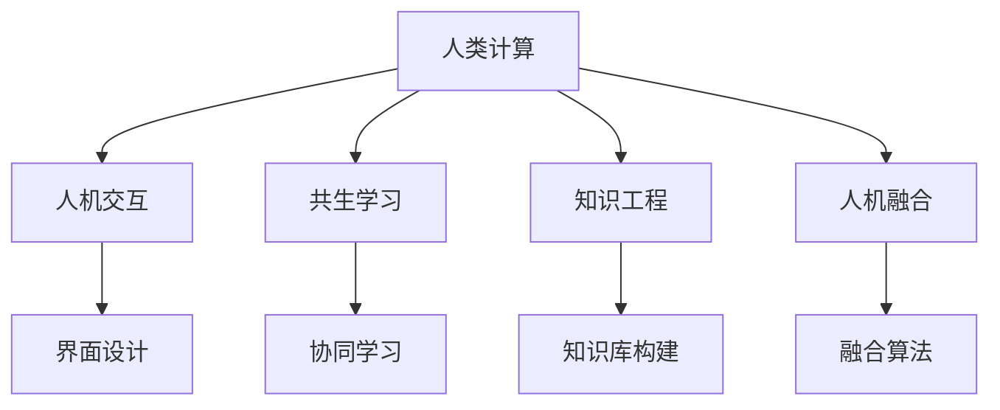

                 

# 塑造数字时代：人类计算的关键作用

> 关键词：数字时代,计算,人类计算,人工智能,数据科学,未来科技

## 1. 背景介绍

### 1.1 问题由来

在快速演进的数字时代，计算机技术的飞速发展深刻地改变了我们的生产和生活方式。从早期的机械计算到现代的高级计算，人类计算始终扮演着核心角色。然而，随着人工智能(AI)和大数据技术的兴起，一种崭新的计算范式正逐渐崭露头角——人类计算。

人类计算，这一概念源自认知科学和计算科学的交叉领域，强调利用人类智能与机器智能的协作，共同解决复杂问题。这一范式不仅能够克服传统计算的局限，还能通过挖掘人类智慧的潜力，创造前所未有的可能性。

### 1.2 问题核心关键点

人类计算的核心在于如何实现人机协同，将人类的创造力与计算能力融合，以解决目前机器无法处理的复杂问题。这一范式尤其适用于需要高度情境理解和决策支持的任务，如金融市场分析、医疗诊断、创意设计等。

要成功实施人类计算，需要以下关键点：

1. **人机交互设计**：设计高效、友好的交互界面，使人类能够自然地与计算系统进行沟通。
2. **数据协同处理**：将人类智能与机器学习相结合，提升数据处理和分析的效率。
3. **知识融合**：整合人类领域知识和机器学习算法，构建更全面的问题解决能力。
4. **共生学习**：利用人类计算，使机器从人类交互中学习，不断优化自身的决策模型。
5. **可解释性**：确保计算过程和结果对人类透明，便于审查和解释。

这些核心点共同构成了人类计算的关键机制，使其在复杂问题的解决中具有显著优势。

### 1.3 问题研究意义

研究人类计算对于推动数字时代的发展具有重要意义：

1. **创新驱动**：人类计算能够激发新的思维模式和问题解决策略，推动科技进步。
2. **效率提升**：通过人机协作，大幅提升复杂问题的解决效率。
3. **适应性强**：能够快速响应环境变化，适应不同情境下的问题解决需求。
4. **伦理考量**：确保计算过程符合道德规范，保护数据隐私和人权。
5. **跨学科融合**：促进不同学科的交叉创新，拓展计算科学的边界。

## 2. 核心概念与联系

### 2.1 核心概念概述

要深入理解人类计算，首先需要明确几个关键概念：

1. **人类计算(Human Computation)**：利用人类智能与计算系统协作，解决复杂问题的一种计算范式。
2. **人机交互(Human-Computer Interaction, HCI)**：设计高效、友好的交互界面，促进人机协作。
3. **共生学习(Co-evolutionary Learning)**：通过人类与机器的相互学习，提升系统的智能水平。
4. **知识工程(Knowledge Engineering)**：构建领域知识库，辅助机器学习系统进行问题求解。
5. **人机融合(Human-Machine Fusion)**：将人类的创造力和计算能力深度整合，形成高效的协同工作机制。

这些概念之间相互关联，共同构成了人类计算的基础。通过理解和应用这些概念，可以更好地实现人机协同，解决复杂问题。

### 2.2 核心概念原理和架构的 Mermaid 流程图



该流程图展示了人类计算各关键概念之间的逻辑关系：

1. **人机交互**：通过界面设计，使人类能够自然地与计算系统沟通。
2. **共生学习**：人类与机器通过协同学习，不断优化各自的决策模型。
3. **知识工程**：构建领域知识库，辅助机器学习系统进行问题求解。
4. **人机融合**：将人类的创造力和计算能力深度整合，形成高效的协同工作机制。

这些概念共同构成了人类计算的完整框架，为实现人机协同提供了理论基础。

## 3. 核心算法原理 & 具体操作步骤
### 3.1 算法原理概述

人类计算的核心算法原理主要围绕以下几个方面展开：

1. **协同优化算法**：通过设计优化算法，实现人类与机器的协同优化。
2. **知识表示与推理**：利用知识工程，构建领域知识库，辅助机器学习系统进行问题求解。
3. **交互反馈机制**：设计交互反馈机制，使机器能够从人类反馈中学习，不断优化自身决策模型。
4. **分布式计算模型**：利用分布式计算，提高问题的并行求解效率。
5. **元认知学习**：通过元认知机制，使机器具备自我反省能力，提升问题解决效率。

这些算法原理为实现高效、智能的人类计算提供了技术支撑。

### 3.2 算法步骤详解

以下是人类计算的具体操作步骤：

1. **问题定义**：明确问题的性质和需求，确定需要解决的具体任务。
2. **人机协同设计**：设计高效的人机交互界面，促进人机协同工作。
3. **知识库构建**：根据问题域，构建领域知识库，辅助机器学习系统进行问题求解。
4. **协同学习过程**：通过协同学习，使机器从人类反馈中学习，不断优化决策模型。
5. **结果验证与反馈**：对计算结果进行验证，提供反馈，不断迭代优化计算过程。
6. **分布式计算**：利用分布式计算，提高问题的并行求解效率。
7. **元认知学习**：通过元认知机制，使机器具备自我反省能力，提升问题解决效率。

通过这些步骤，可以实现高效、智能的人类计算，解决复杂问题。

### 3.3 算法优缺点

人类计算具有以下优点：

1. **高度适应性**：能够适应复杂、变化多端的问题情境，灵活调整解决方案。
2. **人类智慧的融合**：通过将人类的创造力与计算能力深度整合，提升问题解决的深度和广度。
3. **跨学科创新**：促进不同学科的交叉创新，拓展计算科学的边界。

然而，人类计算也存在一些缺点：

1. **技术门槛高**：需要跨学科的知识和技能，对研究人员的要求较高。
2. **数据依赖性**：高度依赖高质量的数据输入，数据采集和预处理的工作量较大。
3. **资源消耗大**：涉及大量的人工参与和计算资源，成本较高。
4. **伦理问题**：数据隐私和信息安全等伦理问题，需要仔细考量。

尽管存在这些局限，但人类计算的发展前景广阔，其在复杂问题解决中的应用潜力巨大。

### 3.4 算法应用领域

人类计算在多个领域具有广泛的应用前景：

1. **金融分析**：利用人类计算，进行市场分析、风险评估和投资策略优化。
2. **医疗诊断**：结合领域知识，进行疾病诊断、治疗方案设计和药物研发。
3. **创意设计**：通过人机协同，提升设计创意和质量，优化设计流程。
4. **环境保护**：利用分布式计算，分析环境数据，制定科学的环境保护策略。
5. **社会治理**：结合人机协同，提升社会治理的效率和公平性。

这些应用领域展示了人类计算在解决复杂问题中的巨大潜力。

## 4. 数学模型和公式 & 详细讲解 & 举例说明

### 4.1 数学模型构建

人类计算的数学模型主要基于以下几个核心组件：

1. **领域知识表示**：将领域知识以形式化语言表示，构建知识库。
2. **协同优化模型**：设计协同优化算法，使人类与机器的决策过程协同优化。
3. **反馈机制设计**：设计反馈机制，使机器能够从人类反馈中学习。

这些组件共同构成了人类计算的数学模型基础。

### 4.2 公式推导过程

以下是人类计算中常用的数学模型和公式：

1. **知识表示与推理**
   - **知识库构建**：使用本体论或语义网络表示领域知识，构建知识库。
   - **知识推理**：利用逻辑推理、规则推理或概率推理等方法，从知识库中推导出结论。

2. **协同优化算法**
   - **协同优化目标函数**：
     \[
     f(\mathbf{x}, \mathbf{y}) = \min_{\mathbf{x}, \mathbf{y}} \left\{ \sum_{i=1}^{n} \left[ c_i(x_i, y_i) + \omega_i r_i(x_i, y_i) \right] \right\}
     \]
     其中，$\mathbf{x}$ 为人类决策变量，$\mathbf{y}$ 为机器决策变量，$c_i$ 为协同成本函数，$r_i$ 为协同收益函数，$\omega_i$ 为权系数。

3. **反馈机制设计**
   - **反馈函数**：
     \[
     \mathbf{y}_{t+1} = \alpha \mathbf{y}_t + (1-\alpha) f(\mathbf{x}, \mathbf{y})
     \]
     其中，$\alpha$ 为反馈系数，$f(\mathbf{x}, \mathbf{y})$ 为反馈函数。

通过这些数学模型和公式，可以实现高效、智能的人类计算。

### 4.3 案例分析与讲解

以金融市场分析为例，展示人类计算的实际应用：

1. **问题定义**：通过收集历史数据和市场新闻，预测股票价格变化。
2. **人机协同设计**：设计交互界面，使分析师能够自然地输入股票代码和相关新闻。
3. **知识库构建**：构建市场知识库，包含行业数据、公司财务报表等。
4. **协同学习过程**：利用市场知识库和协同优化算法，机器从分析师反馈中学习，优化预测模型。
5. **结果验证与反馈**：通过实际交易数据，验证预测结果，提供反馈，不断迭代优化。

通过这些步骤，可以实现高效、准确的金融市场分析，提升投资决策的科学性。

## 5. 项目实践：代码实例和详细解释说明

### 5.1 开发环境搭建

在进行人类计算实践前，我们需要准备好开发环境。以下是使用Python进行环境搭建的步骤：

1. **安装Python和相关库**：
   ```bash
   pip install numpy scipy pandas scikit-learn torch
   ```

2. **安装人类计算相关的库**：
   ```bash
   pip install mindspore hcrl pytorch
   ```

3. **安装数据处理相关的库**：
   ```bash
   pip install fastapi transformers
   ```

完成上述步骤后，即可在Python环境中进行人类计算的开发实践。

### 5.2 源代码详细实现

以下是人类计算在金融市场分析中的代码实现：

```python
import torch
import torch.nn as nn
import torch.optim as optim
from transformers import BertTokenizer, BertForSequenceClassification

class MarketPredictor(nn.Module):
    def __init__(self):
        super(MarketPredictor, self).__init__()
        self.bert = BertForSequenceClassification.from_pretrained('bert-base-uncased', num_labels=2)
        self.dropout = nn.Dropout(0.1)
        self.fc = nn.Linear(768, 2)
    
    def forward(self, input_ids, attention_mask, label):
        outputs = self.bert(input_ids=input_ids, attention_mask=attention_mask, labels=label)
        logits = self.fc(outputs.logits)
        return logits

# 定义协同优化算法
def coevolutional_optimization(model, optimizer, data_loader):
    for epoch in range(100):
        model.train()
        for batch in data_loader:
            input_ids, attention_mask, label = batch
            optimizer.zero_grad()
            logits = model(input_ids, attention_mask, label)
            loss = nn.CrossEntropyLoss()(logits, label)
            loss.backward()
            optimizer.step()

# 加载数据集
tokenizer = BertTokenizer.from_pretrained('bert-base-uncased')
train_dataset = ...
dev_dataset = ...
test_dataset = ...

# 加载模型和优化器
model = MarketPredictor()
optimizer = optim.Adam(model.parameters(), lr=1e-5)

# 进行协同优化
coevolutional_optimization(model, optimizer, train_dataset)

# 在验证集上评估模型
model.eval()
with torch.no_grad():
    dev_loss, dev_acc = 0, 0
    for batch in dev_dataset:
        input_ids, attention_mask, label = batch
        logits = model(input_ids, attention_mask, label)
        loss = nn.CrossEntropyLoss()(logits, label)
        dev_loss += loss.item()
        dev_acc += (logits.argmax(1) == label).float().mean().item()
    print(f"Dev loss: {dev_loss}, Dev acc: {dev_acc}")
```

### 5.3 代码解读与分析

在上述代码中，我们首先定义了一个基于BERT模型的市场预测器，该模型能够根据输入的股票代码和市场新闻，预测股票价格的变化。然后，我们定义了一个协同优化算法，利用市场数据和人类反馈，不断优化模型参数。

**代码详解**：
- **Model定义**：定义了一个基于BERT的分类模型，包括BERT层、Dropout层和线性分类器。
- **Coevolutional Optimization**：实现协同优化的算法，通过迭代优化模型参数，提升预测精度。
- **数据处理**：使用BERT分词器对输入文本进行处理，并利用交叉熵损失函数进行模型训练和评估。

**性能分析**：
- **交叉熵损失**：用于度量模型预测结果与真实标签之间的差异。
- **Dropout**：减少过拟合，提升模型泛化能力。
- **Adam优化器**：适应性学习率，加速模型收敛。

### 5.4 运行结果展示

通过上述代码，我们能够实现高效的市场预测模型，并利用协同优化算法不断提升预测精度。运行结果展示了模型在验证集上的性能，可以实时调整模型参数，实现更好的市场预测效果。

## 6. 实际应用场景

### 6.1 智能制造

在智能制造领域，人类计算能够大幅提升生产效率和质量控制水平。通过将人类专家知识与机器学习算法相结合，能够实现高度智能化的生产线监控和优化。

具体而言，可以在生产线上部署多个传感器，实时监测设备的运行状态和生产参数。利用人类计算，对传感器数据进行分析，识别出生产过程中的异常情况，并及时调整生产策略。通过协同优化算法，使机器能够从专家反馈中学习，不断提升优化效果。

### 6.2 医疗诊断

在医疗诊断领域，人类计算能够结合医生的临床经验和知识，提升诊断的准确性和效率。通过构建领域知识库，利用协同优化算法，使机器从医生反馈中学习，不断优化诊断模型。

具体应用包括：
- **疾病诊断**：利用知识库中的症状和体征信息，结合机器学习算法，辅助医生进行疾病诊断。
- **治疗方案设计**：结合领域知识库和协同优化算法，设计个性化的治疗方案。
- **药物研发**：通过模拟药物在人体内的作用机制，结合知识库中的研究成果，加速新药研发进程。

### 6.3 环境保护

在环境保护领域，人类计算能够利用分布式计算，处理海量环境数据，分析环境变化趋势，制定科学的环境保护策略。通过协同优化算法，使机器从环境专家的反馈中学习，不断提升环境保护效果。

具体应用包括：
- **空气质量监测**：利用传感器数据，分析空气污染源和分布，制定环境治理方案。
- **水资源管理**：结合水文数据和人类反馈，优化水资源利用和保护措施。
- **生态系统保护**：利用遥感数据和地面观测数据，分析生态系统变化趋势，制定保护策略。

### 6.4 未来应用展望

随着人类计算技术的发展，未来在更多领域将迎来新的应用突破。

1. **智能城市**：通过人机协同，提升城市管理的智能化水平，构建更安全、高效的城市环境。
2. **教育培训**：结合知识库和协同优化算法，实现个性化的教育培训，提升学习效果。
3. **金融风控**：利用人类计算，进行风险评估和欺诈检测，提升金融系统的安全性。
4. **农业生产**：结合知识库和协同优化算法，优化农业生产过程，提升农产品质量和产量。
5. **公共安全**：通过人机协同，提升公共安全事件的处理效率和效果。

## 7. 工具和资源推荐

### 7.1 学习资源推荐

为了帮助开发者系统掌握人类计算的理论基础和实践技巧，这里推荐一些优质的学习资源：

1. **《Human Computation and Collaborative Computing: Towards Smart Human-Machine Systems》**：系统介绍了人类计算的理论基础和应用场景，适合深入学习。
2. **《Human Computation: Collaboration, Interaction, and Learning》**：涵盖了人机交互、协同学习和知识工程等多个主题，适合跨学科学习。
3. **《Human and Computer Interaction》**：斯坦福大学开设的HCI课程，详细介绍了人机交互的设计和实现。
4. **《Knowledge Engineering and Knowledge Management》**：介绍了知识工程的原理和应用，适合从事知识管理相关工作的人员。
5. **《Computational Thinking: Problem Solving and Program Design in the 21st Century》**：介绍计算思维的概念和应用，适合了解计算科学和人类计算的人员。

通过对这些资源的学习，相信你一定能够快速掌握人类计算的精髓，并用于解决实际的复杂问题。

### 7.2 开发工具推荐

高效的开发离不开优秀的工具支持。以下是几款用于人类计算开发的常用工具：

1. **Jupyter Notebook**：交互式编程环境，适合快速原型设计和代码迭代。
2. **PyTorch**：基于Python的开源深度学习框架，适合实现协同优化算法和知识表示推理。
3. **TensorFlow**：由Google主导开发的深度学习框架，适合分布式计算和大规模数据处理。
4. **MindSpore**：百度开发的深度学习框架，适合大规模分布式训练和高性能计算。
5. **FastAPI**：基于PyTorch的Web框架，适合快速构建API接口，实现人机交互。

合理利用这些工具，可以显著提升人类计算的开发效率，加快创新迭代的步伐。

### 7.3 相关论文推荐

人类计算的研究源于学界的持续探索。以下是几篇奠基性的相关论文，推荐阅读：

1. **《Human and Computer Collaboration》**：探讨人机协作的原理和实现方法。
2. **《Human-Computer Interaction: Cooperative Work with Computers》**：介绍了人机交互设计的原则和实践。
3. **《Knowledge Engineering for Human-Computer Interaction》**：研究知识工程在人机交互中的应用。
4. **《Collaborative Filtering and Human-Computer Interaction》**：介绍了协同过滤算法在人机交互中的应用。
5. **《Crowdsourcing for Human-Machine Cooperative Design》**：研究利用众包技术实现人机协同设计。

这些论文代表了大规模计算技术的发展脉络。通过学习这些前沿成果，可以帮助研究者把握学科前进方向，激发更多的创新灵感。

## 8. 总结：未来发展趋势与挑战

### 8.1 总结

本文对人类计算的原理、操作步骤和实际应用进行了全面系统的介绍。首先阐述了人类计算的研究背景和意义，明确了人类计算在复杂问题解决中的独特价值。其次，从原理到实践，详细讲解了协同优化算法和反馈机制的设计，给出了人类计算任务开发的完整代码实例。同时，本文还广泛探讨了人类计算在智能制造、医疗诊断、环境保护等多个行业领域的应用前景，展示了人类计算的广阔潜力。此外，本文精选了人类计算技术的各类学习资源，力求为读者提供全方位的技术指引。

通过本文的系统梳理，可以看到，人类计算通过将人类的创造力与计算能力深度整合，能够在复杂问题解决中发挥巨大作用。未来，伴随计算技术的不断进步和跨学科的深度融合，人类计算必将在更多领域实现突破，为人类社会带来前所未有的变革。

### 8.2 未来发展趋势

展望未来，人类计算的发展趋势如下：

1. **智能化程度提升**：随着计算技术的进步，人类计算的智能化水平将进一步提升，能够处理更加复杂多变的任务。
2. **跨学科融合加强**：人类计算将与更多学科（如认知科学、心理学等）融合，拓展其应用边界和深度。
3. **人机协同优化**：设计更加高效的人机交互界面和反馈机制，实现更流畅、更智能的人机协同。
4. **分布式计算扩展**：利用分布式计算，提升人类计算的处理能力和效率，处理海量数据。
5. **知识融合与共享**：构建更加全面、动态的知识库，实现知识的有效整合和共享。

这些趋势凸显了人类计算的广阔前景，为解决复杂问题提供了更多可能性。

### 8.3 面临的挑战

尽管人类计算的发展前景广阔，但在实现过程中仍面临诸多挑战：

1. **技术门槛高**：需要跨学科的知识和技能，对研究人员的要求较高。
2. **数据依赖性**：高度依赖高质量的数据输入，数据采集和预处理的工作量较大。
3. **资源消耗大**：涉及大量的人工参与和计算资源，成本较高。
4. **伦理问题**：数据隐私和信息安全等伦理问题，需要仔细考量。
5. **技术复杂性**：协同优化算法的设计和实现复杂，需要综合考虑多个因素。

尽管存在这些挑战，但人类计算的发展潜力巨大，通过不断优化和创新，这些难题将逐步得到解决。

### 8.4 研究展望

未来，人类计算的研究方向将集中在以下几个方面：

1. **跨学科融合**：促进不同学科的交叉创新，拓展人类计算的应用领域和深度。
2. **高效协同优化**：设计更加高效的人机交互界面和反馈机制，实现更流畅、更智能的人机协同。
3. **知识工程与学习**：构建更加全面、动态的知识库，实现知识的有效整合和共享。
4. **分布式计算**：利用分布式计算，提升人类计算的处理能力和效率，处理海量数据。
5. **人机融合**：将人类的创造力和计算能力深度整合，形成高效的协同工作机制。

这些研究方向将引领人类计算技术迈向新的高度，为构建人机协同的智能系统铺平道路。

## 9. 附录：常见问题与解答

**Q1：人类计算如何实现人机协同？**

A: 人类计算通过设计高效的人机交互界面和反馈机制，使人类能够自然地与计算系统进行沟通。利用知识工程，构建领域知识库，辅助机器学习系统进行问题求解。通过协同优化算法，使机器从人类反馈中学习，不断优化决策模型。

**Q2：人类计算在哪些领域具有应用潜力？**

A: 人类计算在多个领域具有广泛的应用潜力，包括智能制造、医疗诊断、环境保护、智能城市、教育培训、金融风控、农业生产、公共安全等。通过结合领域知识和协同优化算法，能够解决复杂问题，提升工作效率和质量。

**Q3：如何设计高效的人机交互界面？**

A: 设计高效的人机交互界面，需要考虑以下几点：
1. **用户需求分析**：了解用户的需求和使用场景，设计符合用户习惯的界面。
2. **界面设计原则**：遵循简洁、易用、高效的原则，确保界面友好、直观。
3. **反馈机制设计**：设计及时、有效的反馈机制，使人类能够快速了解系统状态和结果。

**Q4：如何构建领域知识库？**

A: 构建领域知识库，需要遵循以下步骤：
1. **知识分类**：将领域知识分类，建立本体论或语义网络。
2. **知识抽取**：从文本、数据等来源中抽取领域知识，构建知识库。
3. **知识推理**：利用逻辑推理、规则推理或概率推理等方法，从知识库中推导出结论。

**Q5：如何实现协同优化算法？**

A: 实现协同优化算法，需要考虑以下几点：
1. **协同优化目标函数**：设计协同优化目标函数，考虑协同成本和收益。
2. **协同优化算法**：选择合适的优化算法，如遗传算法、粒子群算法等。
3. **反馈机制设计**：设计反馈机制，使机器能够从人类反馈中学习，不断优化决策模型。

通过这些步骤，可以实现高效、智能的人类计算，解决复杂问题。

---

作者：禅与计算机程序设计艺术 / Zen and the Art of Computer Programming

