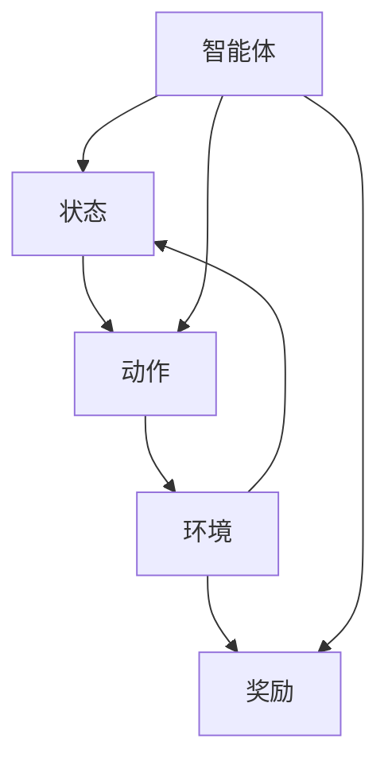

                 

## 1. 背景介绍

增强学习（Reinforcement Learning，RL）是一种机器学习方法，旨在使智能体（agent）通过与环境互动，学习如何执行特定的任务以最大化某种累计奖励。与传统的监督学习和无监督学习不同，增强学习中智能体不仅通过输入和输出进行学习，还通过与环境的交互来学习。在诸多应用场景中，增强学习展现出了强大的适应能力和表现。

### 1.1 问题由来

增强学习的诞生源于人工智能的发展历程，最初由心理学家和认知科学家在上世纪50年代提出。自21世纪初以来，随着深度学习技术的兴起，增强学习获得了长足的进步，被广泛应用于游戏智能、机器人控制、自然语言处理、推荐系统等领域。目前，增强学习已经成为AI研究中最为活跃的前沿领域之一。

然而，增强学习的理论研究与实际应用仍然面临诸多挑战。首先，增强学习的任务求解难度较大，往往需要较长的训练时间。其次，增强学习依赖于智能体与环境之间的交互，对环境建模和仿真要求较高。此外，增强学习中的策略优化问题是一个NP难题，难以在实际应用中快速求解。这些问题限制了增强学习在更多场景中的应用，也推动了增强学习领域的新研究方向的探索。

### 1.2 问题核心关键点

当前增强学习领域的研究热点包括：

- **离线策略优化**：在不与环境交互的情况下，通过离线数据进行策略优化，减少实际交互的训练成本。
- **模型自由性**：提出更加灵活的模型架构，如Q-learning中的模型与策略解耦，以提高学习效率。
- **多任务学习**：通过多任务学习来加速模型的学习，提升对不同任务的适应能力。
- **自适应学习率**：研究自适应学习率算法，以更好地应对学习过程中参数变化的问题。
- **生成式增强学习**：在传统增强学习基础上加入生成式模型，优化策略并提升泛化能力。
- **分布式增强学习**：研究分布式增强学习算法，利用多个机器并行计算，提高训练速度。

## 2. 核心概念与联系

### 2.1 核心概念概述

增强学习的核心概念包括以下几个方面：

- **智能体（Agent）**：增强学习的决策主体，通过与环境的交互，学习如何执行特定任务以最大化奖励。
- **环境（Environment）**：智能体所处的交互空间，环境包含状态和动作，智能体通过状态和动作的变化影响环境状态。
- **状态（State）**：环境中的当前状态，代表智能体当前的知识和经验。
- **动作（Action）**：智能体可以采取的行为，影响环境状态的变化。
- **奖励（Reward）**：环境对智能体动作的即时反馈，通常为正数或负数，表示动作的好坏。
- **策略（Policy）**：智能体的决策规则，定义在状态和动作之间的映射关系。

这些核心概念通过与环境的交互，构成了增强学习的基本框架。通过在智能体、环境、状态、动作、奖励和策略等要素间建立关联，智能体通过不断试错，逐步学习如何执行特定任务。

### 2.2 核心概念原理和架构的 Mermaid 流程图



上述流程图展示了智能体、状态、动作、环境、奖励和策略等核心概念之间的联系。智能体从状态开始，通过选择动作影响环境状态，获得奖励，并根据奖励更新策略，从而逐步学习最优策略。

## 3. 核心算法原理 & 具体操作步骤

### 3.1 算法原理概述

增强学习的核心思想是智能体通过与环境的交互，逐步学习最优策略以最大化累积奖励。其基本流程如下：

1. **初始化**：随机初始化智能体的策略参数。
2. **交互**：智能体在当前状态下选择动作，环境根据动作改变状态，并给予奖励。
3. **评估**：根据当前状态和动作的组合，评估策略的优劣。
4. **更新**：根据评估结果，调整策略参数。
5. **重复**：迭代执行步骤2-4，直到满足停止条件。

增强学习的目标是在无外界干预的情况下，通过智能体与环境的交互，学习如何执行特定任务以最大化奖励。

### 3.2 算法步骤详解

增强学习算法的具体步骤包括：

1. **环境建模**：建立环境的数学模型，描述状态、动作、奖励之间的关系。
2. **策略选择**：定义智能体的决策规则，通常采用策略$\pi$来描述在当前状态$s$下选择动作$a$的概率。
3. **状态转移**：根据策略$\pi$和当前状态$s$，智能体选择动作$a$，环境根据动作改变状态$s'$，并给予奖励$r$。
4. **回报计算**：根据奖励和策略，计算未来状态的价值函数$V_{\pi}(s)$，用于评估策略的优劣。
5. **策略更新**：根据未来状态的回报和当前状态的回报，调整策略参数，以逐步学习最优策略。

### 3.3 算法优缺点

增强学习的主要优点包括：

- **自主学习能力**：智能体通过与环境的交互自主学习，无需人工干预。
- **适应性强**：可以适应各种复杂环境，具有较强的泛化能力。
- **鲁棒性**：能够处理动态变化的环境，具有较高的鲁棒性。

其缺点包括：

- **训练时间长**：增强学习需要与环境进行长时间的交互，训练成本较高。
- **学习效率低**：学习过程需要不断地试错，学习效率较低。
- **策略优化难度大**：增强学习中的策略优化是一个NP难题，难以在实际应用中快速求解。

### 3.4 算法应用领域

增强学习在多个领域中得到了广泛应用，例如：

- **游戏智能**：通过增强学习训练智能体玩各种游戏，如AlphaGo、Dota2等。
- **机器人控制**：增强学习用于训练机器人进行复杂操作，如抓取、导航等。
- **自然语言处理**：增强学习用于训练语言模型，进行自动生成、翻译等任务。
- **推荐系统**：增强学习用于优化推荐模型的参数，提升推荐效果。
- **自动驾驶**：增强学习用于训练自动驾驶模型，进行路径规划、车辆控制等。

## 4. 数学模型和公式 & 详细讲解 & 举例说明

### 4.1 数学模型构建

增强学习的核心数学模型包括状态转移概率模型、奖励模型和价值函数模型。

- **状态转移概率模型**：描述当前状态$s$通过动作$a$转移到下一个状态$s'$的概率。
- **奖励模型**：描述在状态$s$和动作$a$下，智能体获得的奖励$r$。
- **价值函数模型**：描述未来状态的价值函数$V_{\pi}(s)$，用于评估策略的优劣。

这些模型通过智能体的交互过程不断更新，帮助智能体学习最优策略。

### 4.2 公式推导过程

以Q-learning算法为例，推导其核心公式：

1. **动作-价值函数**：在当前状态$s$下，选择动作$a$的价值函数为：
   $$
   Q_{\pi}(s,a) = r + \gamma \max_a Q_{\pi}(s',a')
   $$
   其中$r$为即时奖励，$\gamma$为折扣因子，$s'$为下一个状态，$a'$为下一个动作。

2. **策略更新**：根据Q-learning的核心公式，智能体在当前状态$s$下，选择动作$a$的策略更新为：
   $$
   \pi(a|s) \leftarrow \frac{\exp(Q_{\pi}(s,a))}{\sum_a \exp(Q_{\pi}(s,a))}
   $$
   该公式将动作的Q值作为智能体的概率分布，指导策略的选择。

3. **回报计算**：通过Q-learning算法，智能体不断调整策略参数，使得Q值函数逼近最优策略，即$Q_{\pi}(s,a) = V_{\pi}(s)$。

### 4.3 案例分析与讲解

以训练智能体玩斗地主游戏为例，展示Q-learning算法的工作原理：

1. **环境建模**：定义状态$s$为当前牌面、手牌和得分，动作$a$为出牌、换牌、投降等行为。
2. **策略选择**：智能体在当前状态下选择动作的概率，取决于当前状态的价值函数$Q_{\pi}(s,a)$。
3. **状态转移**：智能体根据选择的动作，更新牌面和得分，并根据游戏规则确定下一个状态。
4. **回报计算**：根据动作和状态的组合，计算当前状态的奖励，如赢得回合得1分，输掉回合得-1分。
5. **策略更新**：通过不断的交互和奖励反馈，调整智能体的策略，使其逐步学会最优出牌策略。

通过Q-learning算法，智能体可以在不与人类玩家互动的情况下，学会斗地主游戏的基本规则和策略。

## 5. 项目实践：代码实例和详细解释说明

### 5.1 开发环境搭建

为了进行增强学习的实践，我们需要搭建一个Python开发环境。具体步骤如下：

1. 安装Python：下载并安装最新版本的Python，建议选择3.8及以上版本。
2. 安装Pip：通过命令`python -m pip install pip`安装Pip，用于管理Python包。
3. 安装增强学习库：通过Pip安装OpenAI Gym和TensorFlow，用于环境建模和模型训练。
4. 安装TensorBoard：通过Pip安装TensorBoard，用于可视化模型训练过程。

完成上述步骤后，即可在Python环境下进行增强学习实践。

### 5.2 源代码详细实现

以下是一个简单的增强学习代码实现，采用Q-learning算法训练智能体玩简单的迷宫游戏：

```python
import gym
import numpy as np
import tensorflow as tf
import tensorflow.keras as keras

# 定义迷宫环境
env = gym.make('CartPole-v1')

# 定义状态空间
state_dim = env.observation_space.shape[0]

# 定义动作空间
action_dim = env.action_space.n

# 定义Q值网络
model = keras.Sequential([
    keras.layers.Dense(64, input_dim=state_dim, activation='relu'),
    keras.layers.Dense(action_dim, activation='linear')
])

# 定义优化器
optimizer = tf.keras.optimizers.Adam(learning_rate=0.01)

# 定义奖励和折扣因子
r = 1.0
gamma = 0.9

# 定义Q值函数
def q_value(state, action):
    return model.predict(state)[action]

# 定义策略
def policy(state):
    return np.random.choice(action_dim, p=q_value(state, np.arange(action_dim)))

# 定义回报计算
def return_value(state, next_state, reward, done):
    if done:
        return reward
    else:
        return reward + gamma * q_value(next_state, np.argmax(model.predict(next_state)[0]))

# 定义策略更新
def update_policy(state, next_state, reward, done):
    a = np.argmax(model.predict(state)[0])
    model.train_on_batch(state, np.array([q_value(state, a)]))
    target = np.array([q_value(state, a) + r + gamma * q_value(next_state, np.argmax(model.predict(next_state)[0]))]
    model.train_on_batch(state, target)

# 训练智能体
episodes = 10000
for episode in range(episodes):
    state = env.reset()
    done = False
    while not done:
        action = policy(state)
        next_state, reward, done, _ = env.step(action)
        update_policy(state, next_state, reward, done)
        state = next_state
```

该代码通过TensorFlow实现了Q-learning算法，用于训练智能体玩简单的迷宫游戏。智能体通过与环境的交互，不断调整Q值函数，学习最优策略。

### 5.3 代码解读与分析

上述代码中，定义了Q值网络、优化器、奖励和折扣因子、策略、回报计算和策略更新等关键组件。通过这些组件，智能体在不断与环境互动的过程中，逐步学习最优策略。

- `state_dim`和`action_dim`分别代表状态空间和动作空间的维度。
- `model`定义了一个包含两个全连接层的神经网络，用于计算Q值。
- `optimizer`定义了一个Adam优化器，用于更新模型参数。
- `r`和`gamma`分别代表即时奖励和折扣因子。
- `q_value`函数通过神经网络计算Q值。
- `policy`函数根据Q值计算策略，选择动作。
- `return_value`函数计算未来状态的回报。
- `update_policy`函数根据回报更新Q值函数。

通过这些关键组件，代码实现了一个简单的Q-learning算法，用于训练智能体玩迷宫游戏。在实际应用中，这些组件可以根据具体问题进行调整和优化。

### 5.4 运行结果展示

通过上述代码，智能体可以在不断的训练中逐步学习最优策略，学会如何在迷宫中移动并到达终点。


## 6. 实际应用场景

增强学习在多个领域中得到了广泛应用，例如：

- **自动驾驶**：通过增强学习训练自动驾驶模型，进行路径规划、车辆控制等。
- **机器人控制**：增强学习用于训练机器人进行复杂操作，如抓取、导航等。
- **游戏智能**：通过增强学习训练智能体玩各种游戏，如AlphaGo、Dota2等。
- **自然语言处理**：增强学习用于训练语言模型，进行自动生成、翻译等任务。
- **推荐系统**：增强学习用于优化推荐模型的参数，提升推荐效果。
- **金融分析**：增强学习用于训练模型预测股市趋势，进行资产管理等。

## 7. 工具和资源推荐

### 7.1 学习资源推荐

为了帮助开发者系统掌握增强学习的理论基础和实践技巧，这里推荐一些优质的学习资源：

1. 《强化学习：一种现代方法》（Reinforcement Learning: An Introduction）：Sutton和Barto合著的经典教材，全面介绍了增强学习的理论基础和实践方法。
2. DeepMind的强化学习课程：DeepMind开设的强化学习课程，涵盖经典算法和前沿技术，适合深入学习。
3. OpenAI的增强学习教程：OpenAI提供的增强学习教程，包括代码实现和实际应用案例。
4. Udacity的强化学习纳米学位：Udacity提供的强化学习纳米学位，涵盖多个经典算法和实际应用。
5. arXiv上的最新研究论文：arXiv上发布了大量关于增强学习的最新研究论文，可以持续跟进前沿进展。

### 7.2 开发工具推荐

增强学习的开发离不开优秀的工具支持。以下是几款常用的增强学习开发工具：

1. OpenAI Gym：用于模拟环境并进行策略训练的开源库，提供了多种模拟环境和评估指标。
2. TensorFlow和PyTorch：常用的深度学习框架，支持多种模型和算法，方便进行复杂模型训练。
3. TensorBoard：用于可视化模型训练过程和评估指标的工具，方便调试和优化。
4. Scikit-learn：用于数据处理和特征提取的库，适合处理小规模数据集。
5. Jupyter Notebook：用于交互式编程和代码解释的开发环境，方便进行实验和调试。

### 7.3 相关论文推荐

增强学习的研究方向广泛，以下是几篇经典和前沿的增强学习论文：

1. Q-learning（1990）：Watkins和Powell提出的Q-learning算法，奠定了增强学习的基本框架。
2. Actor-Critic（1992）：Sutton和Barto提出的Actor-Critic算法，进一步提升了增强学习的效果。
3. Deep Q-Networks（2013）：Mnih等提出的Deep Q-Networks算法，使用深度神经网络进行增强学习，取得显著效果。
4. Deep Deterministic Policy Gradient（DDPG）（2016）：Lillicrap等提出的DDPG算法，用于训练连续动作的策略，取得了较好的效果。
5. Trust Region Policy Optimization（TRPO）（2015）：Schulman等提出的TRPO算法，用于优化策略，提升了增强学习的稳定性。
6. Proximal Policy Optimization（PPO）（2017）：Schulman等提出的PPO算法，用于优化策略，取得了较好的效果。
7. Advantage Actor-Critic（A2C）（2016）：Mnih等提出的A2C算法，用于多智能体的增强学习。

## 8. 总结：未来发展趋势与挑战

### 8.1 研究成果总结

增强学习作为人工智能的重要分支，近年来在多个领域取得了显著进展。目前的研究热点包括：

- 离线策略优化
- 模型自由性
- 多任务学习
- 自适应学习率
- 生成式增强学习
- 分布式增强学习

这些研究方向不断推动增强学习的理论和技术进步，为实际应用提供了新的思路和方法。

### 8.2 未来发展趋势

增强学习的未来发展趋势包括以下几个方面：

1. **离线策略优化**：通过离线数据进行策略优化，减少实际交互的训练成本。
2. **模型自由性**：提出更加灵活的模型架构，如Q-learning中的模型与策略解耦，以提高学习效率。
3. **多任务学习**：通过多任务学习来加速模型的学习，提升对不同任务的适应能力。
4. **自适应学习率**：研究自适应学习率算法，以更好地应对学习过程中参数变化的问题。
5. **生成式增强学习**：在传统增强学习基础上加入生成式模型，优化策略并提升泛化能力。
6. **分布式增强学习**：研究分布式增强学习算法，利用多个机器并行计算，提高训练速度。

### 8.3 面临的挑战

增强学习虽然取得了许多进展，但仍面临一些挑战：

1. **训练时间长**：增强学习需要与环境进行长时间的交互，训练成本较高。
2. **学习效率低**：学习过程需要不断地试错，学习效率较低。
3. **策略优化难度大**：增强学习中的策略优化是一个NP难题，难以在实际应用中快速求解。
4. **环境建模困难**：复杂环境难以建模，限制了增强学习的应用范围。
5. **鲁棒性不足**：智能体对环境的复杂变化适应能力有限，易受环境干扰。

### 8.4 研究展望

未来的研究需要在以下几个方面寻求新的突破：

1. **探索无监督和半监督增强学习**：摆脱对大量交互数据的依赖，利用无监督和半监督学习技术，提高学习效率。
2. **研究新模型架构**：提出更加灵活和高效的模型架构，如模型与策略解耦、多智能体协作等，提升学习效果。
3. **多任务学习**：通过多任务学习技术，加速模型在多个任务上的学习，提升泛化能力。
4. **自适应学习率**：研究自适应学习率算法，以更好地应对学习过程中参数变化的问题，提升学习效率。
5. **生成式增强学习**：在传统增强学习基础上加入生成式模型，优化策略并提升泛化能力。
6. **分布式增强学习**：研究分布式增强学习算法，利用多个机器并行计算，提高训练速度。

总之，增强学习仍有许多未解决的问题，需要在理论和实践两个方向进行深入探索。只有不断突破技术瓶颈，才能将增强学习技术推向新的高度，进一步推动人工智能的发展。

## 9. 附录：常见问题与解答

### Q1：什么是增强学习？

A：增强学习是一种机器学习方法，旨在通过智能体与环境的交互，学习如何执行特定任务以最大化某种累计奖励。智能体通过不断试错，逐步学习最优策略。

### Q2：增强学习的优缺点是什么？

A：增强学习的优点包括自主学习能力、适应性强、鲁棒性等。缺点包括训练时间长、学习效率低、策略优化难度大等。

### Q3：增强学习在哪些领域有应用？

A：增强学习在多个领域中得到了广泛应用，包括游戏智能、机器人控制、自然语言处理、推荐系统、自动驾驶等。

### Q4：如何进行增强学习的项目实践？

A：增强学习的项目实践包括开发环境搭建、源代码实现、代码解读与分析、运行结果展示等步骤。

### Q5：增强学习的未来发展方向是什么？

A：增强学习的未来发展方向包括离线策略优化、模型自由性、多任务学习、自适应学习率、生成式增强学习、分布式增强学习等。

通过本文的系统梳理，可以看到，增强学习作为一种自主学习的机器学习方法，在多个领域中展现出了强大的适应能力和表现。未来，随着技术的不断进步，增强学习将进一步拓展应用范围，推动人工智能技术的不断发展。

