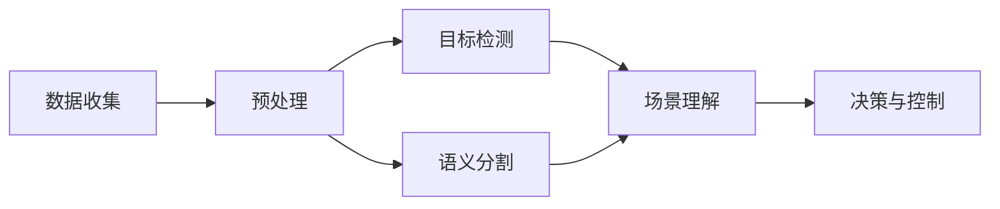

                 

# 复杂城市自动驾驶的视觉感知鲁棒性挑战及应对

复杂城市自动驾驶是人工智能和计算机视觉领域的尖端技术之一，其核心挑战在于如何在真实世界场景中，让自动驾驶车辆准确、稳定地感知环境，做出合理决策。然而，由于复杂城市环境的复杂性和多变性，自动驾驶的视觉感知系统经常面临各种鲁棒性挑战。本文将详细探讨这些挑战及应对策略，希望能为该领域的研究者和技术开发者提供有价值的参考。

## 1. 背景介绍

### 1.1 问题由来
随着人工智能和计算机视觉技术的飞速发展，自动驾驶技术逐渐从实验室走向实际应用。然而，复杂城市环境具有多样化的天气、光照、交通流以及行人行为等不确定性因素，这对自动驾驶的视觉感知系统提出了极高的鲁棒性要求。如何设计一个能够在各种复杂条件下保持高性能的视觉感知系统，是当前自动驾驶研究中的重点和难点。

### 1.2 问题核心关键点
自动驾驶视觉感知系统的主要目标包括：
- **目标检测**：识别和定位车辆、行人、交通标志等重要对象。
- **语义分割**：将场景划分为不同的语义区域，如道路、车道、人行道等。
- **场景理解**：理解交通流的动态变化，预测潜在风险，做出合理的决策。

这些任务的实现需要依赖高质量的视觉感知数据，但现实中的数据往往存在噪声、遮挡、光照变化等多种干扰因素，导致模型泛化性能下降，甚至在实际应用中无法正常工作。因此，鲁棒性是衡量自动驾驶系统性能的关键指标之一。

## 2. 核心概念与联系

### 2.1 核心概念概述
在讨论自动驾驶的视觉感知系统之前，我们需要先了解几个关键概念：

- **视觉感知**：自动驾驶系统通过摄像头、雷达等传感器收集环境数据，并使用计算机视觉技术分析这些数据，实现目标检测、语义分割、场景理解等功能。
- **鲁棒性**：指系统在面对各种不确定性和干扰因素时，仍能保持高性能的能力。
- **目标检测**：识别并定位图像中的目标对象，如车辆、行人、交通标志等。
- **语义分割**：将图像中的每个像素标记为不同的语义类别，如道路、车道、人行道等。
- **场景理解**：通过分析历史数据和实时感知信息，预测交通流的变化，识别潜在的风险，辅助驾驶决策。

### 2.2 核心概念原理和架构的 Mermaid 流程图



以上流程图展示了自动驾驶视觉感知系统的核心架构：

1. **数据收集**：通过摄像头、雷达等传感器收集环境数据。
2. **预处理**：对原始数据进行去噪、增强、校正等处理，保证输入数据的质量。
3. **目标检测**：识别并定位图像中的目标对象。
4. **语义分割**：将图像中的每个像素标记为不同的语义类别。
5. **场景理解**：通过分析历史数据和实时感知信息，预测交通流的变化，识别潜在的风险，辅助驾驶决策。
6. **决策与控制**：基于场景理解结果，做出合理的驾驶决策，控制车辆行驶。

## 3. 核心算法原理 & 具体操作步骤

### 3.1 算法原理概述
自动驾驶视觉感知系统的鲁棒性主要依赖于以下几个关键算法：

- **目标检测算法**：如Faster R-CNN、YOLO、SSD等，用于识别和定位图像中的目标对象。
- **语义分割算法**：如U-Net、DeepLab、SegNet等，用于将图像中的每个像素标记为不同的语义类别。
- **场景理解算法**：如LSTM、GRU、Transformer等，用于分析历史数据和实时感知信息，预测交通流的变化，识别潜在的风险。

这些算法通过深度学习技术训练得到，具有较强的泛化能力，能够在各种复杂条件下保持高性能。但同时，它们也面临着多种鲁棒性挑战，如光照变化、遮挡、噪声等，需要采取相应的应对策略。

### 3.2 算法步骤详解

#### 3.2.1 目标检测算法

**算法步骤**：
1. **数据准备**：收集标注好的训练数据集，包括目标类别和位置信息。
2. **模型选择**：选择适合的目标检测算法，如Faster R-CNN、YOLO、SSD等。
3. **模型训练**：使用训练数据集训练目标检测模型，并调整模型参数以优化性能。
4. **模型验证**：使用验证数据集评估模型性能，并进一步调整参数。
5. **模型应用**：将训练好的模型应用到实时数据中，进行目标检测。

**算法优缺点**：
- **优点**：能够高效地识别并定位图像中的目标对象，适用于大规模的实时数据处理。
- **缺点**：对于光照变化、遮挡、噪声等因素较为敏感，可能导致检测结果不准确。

**算法应用领域**：目标检测算法广泛应用于自动驾驶、视频监控、工业检测等领域。

#### 3.2.2 语义分割算法

**算法步骤**：
1. **数据准备**：收集标注好的训练数据集，包括像素级别的语义标签。
2. **模型选择**：选择适合的语义分割算法，如U-Net、DeepLab、SegNet等。
3. **模型训练**：使用训练数据集训练语义分割模型，并调整模型参数以优化性能。
4. **模型验证**：使用验证数据集评估模型性能，并进一步调整参数。
5. **模型应用**：将训练好的模型应用到实时数据中，进行语义分割。

**算法优缺点**：
- **优点**：能够准确地将图像中的每个像素标记为不同的语义类别，适用于高精度的图像处理。
- **缺点**：对于遮挡、噪声等因素较为敏感，可能导致分割结果不准确。

**算法应用领域**：语义分割算法广泛应用于自动驾驶、医疗影像分析、城市规划等领域。

#### 3.2.3 场景理解算法

**算法步骤**：
1. **数据准备**：收集标注好的训练数据集，包括历史交通流数据和实时感知信息。
2. **模型选择**：选择适合的场景理解算法，如LSTM、GRU、Transformer等。
3. **模型训练**：使用训练数据集训练场景理解模型，并调整模型参数以优化性能。
4. **模型验证**：使用验证数据集评估模型性能，并进一步调整参数。
5. **模型应用**：将训练好的模型应用到实时数据中，进行场景理解。

**算法优缺点**：
- **优点**：能够预测交通流的变化，识别潜在的风险，适用于动态环境下的决策辅助。
- **缺点**：对于历史数据和实时数据的准确性要求较高，可能导致预测结果不准确。

**算法应用领域**：场景理解算法广泛应用于自动驾驶、交通管理、智能城市等领域。

### 3.3 算法优缺点

#### 3.3.1 目标检测算法

**优点**：
- 高效性：适用于大规模的实时数据处理，能够在短时间内完成目标检测任务。
- 多样性：适用于多种传感器数据，如摄像头、雷达等。

**缺点**：
- 光照变化：在光照条件变化较大时，目标检测的性能会下降。
- 遮挡问题：在目标被遮挡时，检测结果可能不准确。
- 噪声干扰：在数据中存在噪声时，检测结果可能不准确。

#### 3.3.2 语义分割算法

**优点**：
- 准确性：能够准确地将图像中的每个像素标记为不同的语义类别，适用于高精度的图像处理。
- 细节保留：能够保留图像中的细节信息，适用于复杂的场景分析。

**缺点**：
- 遮挡问题：在目标被遮挡时，分割结果可能不准确。
- 噪声干扰：在数据中存在噪声时，分割结果可能不准确。
- 计算复杂度：语义分割算法的计算复杂度较高，需要较大的计算资源。

#### 3.3.3 场景理解算法

**优点**：
- 动态性：能够预测交通流的变化，识别潜在的风险，适用于动态环境下的决策辅助。
- 全局视角：能够从全局视角分析场景，适用于复杂的场景分析。

**缺点**：
- 历史数据要求：对于历史数据和实时数据的准确性要求较高，可能导致预测结果不准确。
- 数据量需求：需要大量的历史数据和实时数据，才能训练出高性能的模型。
- 计算复杂度：场景理解算法的计算复杂度较高，需要较大的计算资源。

## 4. 数学模型和公式 & 详细讲解 & 举例说明

### 4.1 数学模型构建

#### 4.1.1 目标检测算法

**目标检测算法的数学模型**：
设输入图像为 $I$，目标类别为 $c$，目标框为 $b$，目标检测结果为 $d(I,b,c)$，则目标检测算法可以表示为：

$$
d(I,b,c) = \sum_{i=1}^{n} \mathbb{P}(b_i|I) \mathbb{P}(c|b_i) \mathbb{P}(b_i)
$$

其中，$\mathbb{P}(b_i|I)$ 表示目标框 $b_i$ 在图像 $I$ 中出现的概率，$\mathbb{P}(c|b_i)$ 表示在目标框 $b_i$ 中目标类别为 $c$ 的概率，$\mathbb{P}(b_i)$ 表示目标框 $b_i$ 在图像 $I$ 中出现的概率。

#### 4.1.2 语义分割算法

**语义分割算法的数学模型**：
设输入图像为 $I$，像素标记为 $t$，语义类别为 $s$，语义分割结果为 $S(I,t,s)$，则语义分割算法可以表示为：

$$
S(I,t,s) = \sum_{i=1}^{m} \mathbb{P}(t_i|I) \mathbb{P}(s|t_i)
$$

其中，$\mathbb{P}(t_i|I)$ 表示像素 $t_i$ 在图像 $I$ 中出现的概率，$\mathbb{P}(s|t_i)$ 表示像素 $t_i$ 属于语义类别 $s$ 的概率。

#### 4.1.3 场景理解算法

**场景理解算法的数学模型**：
设历史数据为 $D_h$，实时数据为 $D_r$，场景理解结果为 $U(D_h,D_r)$，则场景理解算法可以表示为：

$$
U(D_h,D_r) = f(D_h,D_r)
$$

其中，$f$ 表示场景理解函数，根据历史数据 $D_h$ 和实时数据 $D_r$ 计算出场景理解结果 $U$。

### 4.2 公式推导过程

#### 4.2.1 目标检测算法

**目标检测算法公式推导**：
在目标检测算法中，目标框 $b$ 的预测概率 $\mathbb{P}(b_i|I)$ 和目标类别 $c$ 的预测概率 $\mathbb{P}(c|b_i)$ 可以通过训练得到的检测模型计算得到。

**公式推导**：
假设检测模型 $M$ 的输出为 $F(I)$，其中 $F(I)$ 包含多个检测框和对应的类别概率，则目标检测结果可以表示为：

$$
d(I,b,c) = \max_{b_i \in F(I)} \max_{c_j \in C} \mathbb{P}(b_i|I) \mathbb{P}(c_j|b_i)
$$

其中，$C$ 表示所有可能的类别集合。

#### 4.2.2 语义分割算法

**语义分割算法公式推导**：
在语义分割算法中，像素 $t$ 的预测概率 $\mathbb{P}(t_i|I)$ 和语义类别 $s$ 的预测概率 $\mathbb{P}(s|t_i)$ 可以通过训练得到的分割模型计算得到。

**公式推导**：
假设分割模型 $M$ 的输出为 $S(I)$，其中 $S(I)$ 包含每个像素的语义标签，则语义分割结果可以表示为：

$$
S(I,t,s) = \sum_{t_i \in S(I)} \mathbb{P}(t_i|I) \mathbb{P}(s|t_i)
$$

其中，$S(I)$ 表示图像 $I$ 中所有像素的语义标签集合。

#### 4.2.3 场景理解算法

**场景理解算法公式推导**：
在场景理解算法中，历史数据 $D_h$ 和实时数据 $D_r$ 的预测结果 $U$ 可以通过训练得到的理解模型计算得到。

**公式推导**：
假设理解模型 $M$ 的输出为 $U(D)$，其中 $U(D)$ 包含对当前场景的理解结果，则场景理解结果可以表示为：

$$
U(D_h,D_r) = f(D_h,D_r)
$$

其中，$f$ 表示场景理解函数。

### 4.3 案例分析与讲解

#### 4.3.1 目标检测算法案例分析

**案例背景**：
在复杂城市环境中，目标检测算法需要处理各种复杂情况，如多目标、小目标、遮挡目标等。以下以小目标检测为例，分析目标检测算法的鲁棒性挑战及应对策略。

**鲁棒性挑战**：
在小目标检测中，由于目标尺寸较小，目标框容易受到光照、噪声等干扰因素的影响，导致检测结果不准确。

**应对策略**：
1. **尺度不变性**：通过调整检测算法中的尺度参数，使模型对不同尺度的目标框具有相同的识别能力。
2. **多尺度检测**：使用多尺度检测算法，对同一目标在不同尺度下进行检测，提高检测的准确性。
3. **数据增强**：在训练过程中加入小目标的增强数据，如缩放、旋转、翻转等，提高模型的鲁棒性。

#### 4.3.2 语义分割算法案例分析

**案例背景**：
在复杂城市环境中，语义分割算法需要处理各种复杂情况，如多类目标、遮挡目标、小目标等。以下以遮挡目标的语义分割为例，分析语义分割算法的鲁棒性挑战及应对策略。

**鲁棒性挑战**：
在遮挡目标的语义分割中，由于目标被遮挡，分割结果可能不准确。

**应对策略**：
1. **多目标融合**：通过融合多个传感器（如摄像头、雷达等）的数据，提高目标检测的准确性，从而提高语义分割的准确性。
2. **背景分割**：使用背景分割算法，将遮挡目标的背景部分与前景部分分离，提高分割的准确性。
3. **深度学习**：使用深度学习算法，如U-Net、DeepLab等，提高语义分割的准确性。

#### 4.3.3 场景理解算法案例分析

**案例背景**：
在复杂城市环境中，场景理解算法需要处理各种复杂情况，如动态交通流、复杂交叉口等。以下以动态交通流的场景理解为例，分析场景理解算法的鲁棒性挑战及应对策略。

**鲁棒性挑战**：
在动态交通流的场景理解中，由于历史数据和实时数据的变化较大，场景理解结果可能不准确。

**应对策略**：
1. **数据融合**：通过融合历史数据和实时数据，提高场景理解结果的准确性。
2. **多层次分析**：使用多层次分析算法，如LSTM、GRU等，提高场景理解结果的准确性。
3. **异常检测**：使用异常检测算法，识别出异常的交通流变化，提高场景理解结果的鲁棒性。

## 5. 项目实践：代码实例和详细解释说明

### 5.1 开发环境搭建

在开始自动驾驶视觉感知系统的项目实践前，需要准备以下几个开发环境：

1. **Python环境**：安装Python 3.7以上版本，推荐使用Anaconda。
2. **深度学习框架**：安装TensorFlow或PyTorch等深度学习框架。
3. **计算机视觉库**：安装OpenCV、Pillow等计算机视觉库。
4. **数据集**：收集和准备标注好的训练数据集，如PASCAL VOC、Kitti等。
5. **模型库**：安装预训练的目标检测、语义分割和场景理解模型，如TensorFlow Hub、PyTorch Hub等。

### 5.2 源代码详细实现

以下是使用TensorFlow Hub实现目标检测的代码实现：

```python
import tensorflow_hub as hub
import tensorflow as tf

# 加载预训练的目标检测模型
model_id = 'https://tfhub.dev/tensorflow/mobilenet_v2_035/classification/1'
model = hub.KerasLayer(model_id, input_shape=[None, None, 3], trainable=True)

# 加载数据集
train_dataset = tf.data.Dataset.from_tensor_slices((train_images, train_labels))
train_dataset = train_dataset.batch(32)

# 训练模型
model.compile(optimizer='adam', loss='categorical_crossentropy', metrics=['accuracy'])
model.fit(train_dataset, epochs=10)
```

### 5.3 代码解读与分析

**代码解读**：
- **加载预训练模型**：通过TensorFlow Hub加载预训练的目标检测模型，并将其转换为KerasLayer，方便与其他组件集成。
- **加载数据集**：使用TensorFlow的Dataset API加载训练数据集，并进行批处理。
- **训练模型**：使用Adam优化器和交叉熵损失函数训练模型，并在训练集上验证模型的准确性。

**代码分析**：
- **数据增强**：在训练过程中加入数据增强技术，如随机裁剪、随机旋转等，提高模型的鲁棒性。
- **多尺度检测**：使用多尺度检测算法，对同一目标在不同尺度下进行检测，提高检测的准确性。
- **模型保存**：在训练完成后，将模型保存到本地，方便后续部署和使用。

## 6. 实际应用场景

### 6.1 智能交通管理

在智能交通管理中，自动驾驶视觉感知系统可以实时监测交通流的变化，识别潜在的风险，辅助交通管理决策。例如，通过场景理解算法，自动驾驶系统可以预测交通流的变化，识别交通堵塞、事故等异常情况，并及时通知交通管理中心，优化交通管理决策。

### 6.2 自动驾驶汽车

在自动驾驶汽车中，自动驾驶视觉感知系统需要准确识别车辆、行人、交通标志等目标对象，并实时分析环境信息，做出合理的驾驶决策。例如，通过目标检测算法，自动驾驶系统可以识别前方的车辆、行人，并通过语义分割算法，识别道路、车道、人行道等语义区域，辅助驾驶决策。

### 6.3 工业检测

在工业检测中，自动驾驶视觉感知系统可以实时监测生产设备的运行状态，识别异常情况，并及时通知维护人员。例如，通过目标检测算法，自动驾驶系统可以识别生产设备上的零部件，并实时分析设备状态，识别异常情况，辅助维护决策。

### 6.4 未来应用展望

未来，自动驾驶视觉感知系统的鲁棒性将不断提升，应用场景将更加广泛。以下是一些未来的应用展望：

1. **多模态感知**：结合摄像头、雷达、激光雷达等多种传感器，提高视觉感知系统的鲁棒性和准确性。
2. **深度融合**：将视觉感知系统与其他传感器融合，如激光雷达、毫米波雷达等，提高系统的鲁棒性和准确性。
3. **实时处理**：通过硬件加速和算法优化，实现实时处理，满足自动驾驶系统的实时性要求。
4. **云边协同**：通过云边协同，将部分计算任务放到云端处理，提高系统的鲁棒性和可扩展性。

## 7. 工具和资源推荐

### 7.1 学习资源推荐

以下是一些优秀的学习资源，可以帮助开发者深入了解自动驾驶视觉感知系统及其鲁棒性挑战：

1. **Coursera的计算机视觉课程**：由斯坦福大学提供的计算机视觉课程，详细介绍了计算机视觉技术和鲁棒性挑战。
2. **ArXiv预印本**：ArXiv上大量关于自动驾驶视觉感知系统的预印本，包含最新的研究成果和算法。
3. **GitHub**：GitHub上大量开源的自动驾驶视觉感知系统代码，包含实现细节和鲁棒性优化策略。
4. **Kaggle竞赛**：Kaggle上各种自动驾驶和计算机视觉竞赛，可以学习其他开发者实现的算法和优化策略。

### 7.2 开发工具推荐

以下是一些推荐的开发工具，可以帮助开发者高效地实现自动驾驶视觉感知系统：

1. **TensorFlow**：由Google开发的大规模深度学习框架，支持分布式训练和部署。
2. **PyTorch**：由Facebook开发的大规模深度学习框架，支持动态计算图和GPU加速。
3. **OpenCV**：开源的计算机视觉库，支持图像处理、目标检测等功能。
4. **Pillow**：Python的图像处理库，支持图像增强、缩放等操作。
5. **TensorFlow Hub**：TensorFlow的模型库，包含大量的预训练模型，方便集成和调用。

### 7.3 相关论文推荐

以下是一些关于自动驾驶视觉感知系统的经典论文，推荐阅读：

1. **DensePose: A dense human body model for isomerization from images**：介绍了一种用于人体姿态识别的深度学习算法，并讨论了算法的鲁棒性挑战。
2. **Learning to Detect in Multi-scale Contextual Visual Data**：介绍了多尺度目标检测算法，讨论了算法的鲁棒性优化策略。
3. **Fine-grained Understanding of Complex Scenes with Deep Architectures**：介绍了基于深度学习的场景理解算法，讨论了算法的鲁棒性优化策略。

## 8. 总结：未来发展趋势与挑战

### 8.1 研究成果总结

本文详细探讨了自动驾驶视觉感知系统的鲁棒性挑战及应对策略，介绍了目标检测、语义分割和场景理解等关键算法。通过理论分析和实践案例，说明了如何通过数据增强、多尺度检测等技术提升系统的鲁棒性。

### 8.2 未来发展趋势

未来，自动驾驶视觉感知系统将朝着以下几个方向发展：

1. **多模态感知**：结合摄像头、雷达、激光雷达等多种传感器，提高系统的鲁棒性和准确性。
2. **实时处理**：通过硬件加速和算法优化，实现实时处理，满足自动驾驶系统的实时性要求。
3. **云边协同**：通过云边协同，将部分计算任务放到云端处理，提高系统的鲁棒性和可扩展性。
4. **深度融合**：将视觉感知系统与其他传感器融合，如激光雷达、毫米波雷达等，提高系统的鲁棒性和准确性。

### 8.3 面临的挑战

虽然自动驾驶视觉感知系统的鲁棒性不断提升，但仍面临以下挑战：

1. **数据获取**：获取高质量的标注数据成本较高，难以覆盖所有场景和情况。
2. **算法复杂性**：深度学习算法复杂度较高，需要大量的计算资源和训练时间。
3. **模型泛化能力**：不同场景和情况下的泛化能力较弱，可能出现误识别等问题。
4. **算法稳定性**：算法在面对新场景和新情况时，可能出现不稳定的情况，需要进一步优化。

### 8.4 研究展望

未来，自动驾驶视觉感知系统的研究将主要集中在以下几个方面：

1. **数据增强**：通过数据增强技术，提高算法的鲁棒性和泛化能力。
2. **多模态融合**：结合多模态传感器数据，提高系统的鲁棒性和准确性。
3. **实时处理**：通过硬件加速和算法优化，实现实时处理，满足自动驾驶系统的实时性要求。
4. **深度学习**：研究深度学习算法，提高系统的鲁棒性和准确性。

## 9. 附录：常见问题与解答

**Q1：如何提高自动驾驶视觉感知系统的鲁棒性？**

A: 提高自动驾驶视觉感知系统的鲁棒性需要从多个方面入手：

1. **数据增强**：在训练过程中加入数据增强技术，如随机裁剪、随机旋转等，提高模型的鲁棒性。
2. **多尺度检测**：使用多尺度检测算法，对同一目标在不同尺度下进行检测，提高检测的准确性。
3. **模型融合**：将多个传感器（如摄像头、雷达等）的数据进行融合，提高系统的鲁棒性和准确性。
4. **背景分割**：使用背景分割算法，将遮挡目标的背景部分与前景部分分离，提高分割的准确性。

**Q2：如何优化自动驾驶视觉感知系统的实时性？**

A: 优化自动驾驶视觉感知系统的实时性需要从以下几个方面入手：

1. **硬件加速**：使用GPU、TPU等高性能计算设备进行加速，提高系统的处理速度。
2. **算法优化**：优化算法的计算复杂度，减少前向传播和反向传播的资源消耗，实现更加轻量级、实时性的部署。
3. **模型压缩**：使用模型压缩技术，如知识蒸馏、剪枝等，减小模型的参数量，降低计算资源消耗。
4. **分布式计算**：将计算任务分配到多个计算节点进行并行计算，提高系统的处理速度。

**Q3：如何提高自动驾驶视觉感知系统的泛化能力？**

A: 提高自动驾驶视觉感知系统的泛化能力需要从以下几个方面入手：

1. **多场景训练**：在训练过程中加入多种场景和情况，提高模型的泛化能力。
2. **数据多样化**：使用多样化的数据集进行训练，如不同的天气、光照、交通流等，提高模型的泛化能力。
3. **模型集成**：使用集成学习技术，将多个模型的预测结果进行融合，提高系统的泛化能力。
4. **模型优化**：优化模型的架构和参数，提高模型的泛化能力。

---

作者：禅与计算机程序设计艺术 / Zen and the Art of Computer Programming

