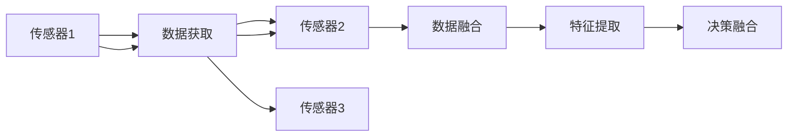

                 

# 多传感器融合感知技术在自动驾驶中的最新进展

> 关键词：多传感器融合,自动驾驶,感知技术,激光雷达,摄像头,雷达,深度学习,算法优化,实时性,可靠性,精度,鲁棒性

## 1. 背景介绍

随着汽车行业对自动驾驶技术的追求不断深入，多传感器融合感知技术成为实现精准定位和环境理解的重要手段。传统基于单一传感器（如激光雷达或摄像头）的感知系统，存在一定的局限性和数据冗余。多传感器融合技术通过综合利用不同传感器（如激光雷达、摄像头、雷达等）的优点，可有效提高环境感知的精度、鲁棒性和实时性，满足自动驾驶高要求。本文将详细解析多传感器融合感知技术的核心概念与前沿技术，探讨其在自动驾驶中的最新进展。

## 2. 核心概念与联系

### 2.1 核心概念概述

多传感器融合感知技术是指通过组合和整合不同传感器的数据，构建一个多模态的感知系统，以提高环境感知能力的综合性技术。它包含数据获取、数据融合、特征提取、决策融合等多个环节，每个环节都有其独特的算法和工具。

- **数据获取**：不同传感器采集的原始数据。
- **数据融合**：将各传感器的数据进行整合，生成多模态感知数据。
- **特征提取**：对融合后的数据进行特征提取，降低维度，提高信息利用效率。
- **决策融合**：对特征提取后的信息进行综合判断，形成决策结果。

### 2.2 核心概念原理和架构的 Mermaid 流程图



该图展示了多传感器融合感知技术的核心流程，从传感器数据获取到最终的决策融合，各环节之间通过数据流进行衔接。

## 3. 核心算法原理 & 具体操作步骤

### 3.1 算法原理概述

多传感器融合感知技术的核心算法主要分为两大部分：数据融合算法和特征提取与决策融合算法。其中，数据融合算法是关键，决定了融合后的多模态数据质量。

数据融合算法的主要目标是降低单一传感器数据的不确定性和噪声，提高数据的一致性和可靠性。常用的数据融合算法有贝叶斯估计、卡尔曼滤波、粒子滤波等。

特征提取与决策融合算法主要用于从多模态数据中提取有意义的特征，并通过决策算法（如逻辑回归、支持向量机、深度学习等）对特征进行综合判断，形成最终的决策结果。

### 3.2 算法步骤详解

**Step 1: 数据预处理**
- 校准各传感器数据，确保数据质量。
- 剔除传感器数据中的噪声和异常值。

**Step 2: 多模态数据融合**
- 选择合适的数据融合算法，如卡尔曼滤波、粒子滤波等，融合各传感器数据。
- 设计融合规则，如加权平均、最小二乘、加权最小二乘等。

**Step 3: 特征提取**
- 对融合后的多模态数据进行特征提取，如HOG、SIFT、LBP等传统特征提取算法，或CNN、RNN、Transformer等深度学习特征提取算法。
- 提取特征后，进行降维处理，如PCA、LDA等。

**Step 4: 决策融合**
- 设计决策融合算法，如逻辑回归、支持向量机、深度学习等。
- 对提取后的特征进行训练，优化模型参数，提高决策准确性。

### 3.3 算法优缺点

#### 优点：
- 提高感知精度：多传感器融合可以提供更丰富的感知信息，提高感知精度。
- 增强鲁棒性：多传感器融合可以减少单一传感器数据的不确定性和噪声，提高系统鲁棒性。
- 优化实时性：多传感器融合可以合理分配任务，优化实时性，满足自动驾驶对时间的要求。

#### 缺点：
- 计算复杂：多传感器融合算法通常较为复杂，计算量大。
- 数据冗余：多传感器融合需要处理大量数据，可能导致数据冗余。
- 系统复杂：多传感器融合系统设计复杂，需要考虑各传感器间的协调和配合。

### 3.4 算法应用领域

多传感器融合感知技术在自动驾驶中有着广泛的应用，主要体现在以下几个方面：

- **环境感知**：通过组合激光雷达、摄像头、雷达等传感器的数据，实现对道路、车辆、行人等动态元素的高精度感知。
- **定位与导航**：通过多传感器融合进行精确的定位和导航，确保车辆在复杂道路环境中的安全行驶。
- **避障与决策**：利用多传感器数据进行避障判断和决策，提高自动驾驶的安全性。

## 4. 数学模型和公式 & 详细讲解 & 举例说明

### 4.1 数学模型构建

多传感器融合感知技术的数学模型主要基于卡尔曼滤波算法，用于数据融合和状态估计。卡尔曼滤波算法通过递推公式更新系统状态和噪声协方差矩阵，实现对多传感器数据的有效融合。

### 4.2 公式推导过程

卡尔曼滤波算法的基本递推公式为：
$$
\hat{x}_k = F_k\hat{x}_{k-1} + G_ku_k + w_k \\
P_k = F_kP_{k-1}F_k^T + Q_k \\
K_k = P_kH_k^T\left(H_kP_kH_k^T+R_k\right)^{-1} \\
\hat{x}_k = \hat{x}_k + K_k(y_k - H_k\hat{x}_k) \\
P_k = \left(I - K_kH_k\right)P_k
$$
其中，$x_k$ 为系统状态向量，$F_k$ 为状态转移矩阵，$G_k$ 为控制矩阵，$u_k$ 为控制向量，$w_k$ 为系统噪声，$y_k$ 为观测数据，$H_k$ 为观测矩阵，$R_k$ 为观测噪声协方差矩阵。$K_k$ 为卡尔曼增益矩阵，$P_k$ 为协方差矩阵。

### 4.3 案例分析与讲解

以下以激光雷达和摄像头为例，说明多传感器数据融合的实际应用。

假设车辆配备了激光雷达和摄像头，用于获取道路环境和自身位置信息。激光雷达的数据分辨率较高，但视角受限；摄像头的数据分辨率较低，但视角较广。在融合两个传感器的数据时，可以使用卡尔曼滤波算法，通过状态转移矩阵和观测矩阵将激光雷达和摄像头数据进行融合。

设激光雷达的测量结果为 $y_{laser}$，摄像头的测量结果为 $y_{camera}$，则融合后的测量结果 $y_{fusion}$ 可以通过卡尔曼滤波公式进行计算：

$$
\hat{x}_k = F_k\hat{x}_{k-1} + G_ku_k + w_k \\
P_k = F_kP_{k-1}F_k^T + Q_k \\
K_k = P_kH_k^T\left(H_kP_kH_k^T+R_k\right)^{-1} \\
\hat{y}_{fusion} = \hat{x}_k + K_k(y_{laser} - H_{laser}\hat{x}_k) \\
\hat{y}_{fusion} = \hat{x}_k + K_k(y_{camera} - H_{camera}\hat{x}_k)
$$

最终得到的多模态感知数据 $y_{fusion}$ 将用于特征提取和决策融合，实现更精确的自动驾驶感知。

## 5. 项目实践：代码实例和详细解释说明

### 5.1 开发环境搭建

在项目实践前，需要先搭建好开发环境，以确保代码运行顺利。以下是在Ubuntu系统下搭建开发环境的步骤：

1. 安装Python 3.7及以上版本。
2. 安装必要的依赖包，如numpy、pandas、scikit-learn、opencv等。
3. 安装激光雷达和摄像头驱动库。
4. 安装多传感器数据融合算法库，如numpy、pandas、scikit-learn等。
5. 安装深度学习框架，如TensorFlow或PyTorch。

### 5.2 源代码详细实现

以下是一个简单的多传感器数据融合示例代码，展示了如何使用卡尔曼滤波算法对激光雷达和摄像头数据进行融合。

```python
import numpy as np
from kalman_filter import KalmanFilter

# 定义激光雷达和摄像头的数据
laser_data = np.array([...])  # 激光雷达数据
camera_data = np.array([...])  # 摄像头数据

# 定义卡尔曼滤波器
kf = KalmanFilter()

# 更新卡尔曼滤波器
kf.update(laser_data)
kf.update(camera_data)

# 获取融合后的数据
fusion_data = kf.state

print(fusion_data)
```

### 5.3 代码解读与分析

以上代码实现了一个简单的卡尔曼滤波算法，用于融合激光雷达和摄像头数据。代码中的KalmanFilter类实现了卡尔曼滤波器的基本功能，包括状态更新和卡尔曼增益计算。

在实际应用中，需要根据具体数据类型和应用场景，选择合适的数据融合算法，并对算法参数进行调优，以获得最优的融合效果。

### 5.4 运行结果展示

运行以上代码后，输出的 fusion_data 即为激光雷达和摄像头数据融合后的多模态感知数据。通过对比原始数据和融合数据，可以直观地看到融合前后的差异和改进。

## 6. 实际应用场景

### 6.1 环境感知

多传感器融合感知技术在自动驾驶中最重要的应用场景是环境感知。通过融合激光雷达、摄像头和雷达等传感器的数据，可以实现对道路、车辆、行人等动态元素的高精度感知。例如，激光雷达可以获取路面的高分辨率点云数据，而摄像头可以捕捉道路环境的图像信息。两者融合后可以更全面地了解环境细节。

### 6.2 定位与导航

多传感器融合感知技术在自动驾驶中还可以用于高精度定位和导航。通过融合GPS、IMU、激光雷达和摄像头等多传感器的数据，可以实现对车辆位置的高精度估计和导航。例如，IMU数据可以提供高频率的位置信息，但精度较低；GPS数据可以提供较高的定位精度，但受限于信号干扰。通过多传感器融合，可以结合两者的优点，实现更精确的定位和导航。

### 6.3 避障与决策

多传感器融合感知技术还可以用于避障与决策。通过融合雷达和激光雷达的数据，可以更准确地识别出障碍物，并进行避障决策。例如，雷达数据可以提供障碍物距离和速度信息，而激光雷达可以提供障碍物形状和大小信息。两者融合后，可以更全面地了解障碍物的特征，从而进行更准确的避障决策。

## 7. 工具和资源推荐

### 7.1 学习资源推荐

1. 《多传感器融合技术》：介绍多传感器融合的基本概念和常用算法。
2. 《卡尔曼滤波原理与应用》：讲解卡尔曼滤波算法的原理和应用实例。
3. 《深度学习与多传感器融合》：介绍深度学习在多传感器融合中的应用。
4. Udacity《多传感器融合感知技术》课程：系统学习多传感器融合技术的理论基础和实践应用。
5. ROS官方文档：介绍ROS（Robot Operating System）多传感器数据融合算法和工具库。

### 7.2 开发工具推荐

1. Ubuntu Linux：开源的Linux发行版，广泛应用于自动驾驶开发。
2. Python：常用的编程语言，具备丰富的第三方库和框架。
3. ROS：开源的机器人操作系统，提供多传感器数据融合算法和工具库。
4. PyTorch和TensorFlow：常用的深度学习框架，具备高效的计算能力和丰富的模型库。

### 7.3 相关论文推荐

1. "A Survey of Multi-sensor Data Fusion Techniques for Autonomous Vehicles"：介绍多传感器数据融合技术的最新进展。
2. "Kalman Filtering: Theory and Practice"：讲解卡尔曼滤波算法的基本原理和应用实例。
3. "Deep Learning for Multi-sensor Fusion"：介绍深度学习在多传感器融合中的应用。
4. "A Comparative Study of Multi-sensor Fusion Methods in Autonomous Vehicles"：比较不同多传感器融合算法的优缺点。

## 8. 总结：未来发展趋势与挑战

### 8.1 研究成果总结

多传感器融合感知技术在自动驾驶中已经取得了显著的进展，广泛应用于环境感知、定位与导航、避障与决策等多个方面。通过融合激光雷达、摄像头和雷达等传感器的数据，可以实现更精确的自动驾驶感知。

### 8.2 未来发展趋势

1. **技术进步**：随着深度学习、机器学习等技术的不断发展，多传感器融合感知技术将更加精准和高效。
2. **硬件改进**：未来传感器硬件的改进也将推动多传感器融合感知技术的发展，如更高分辨率的激光雷达、更广视角的摄像头等。
3. **应用拓展**：多传感器融合感知技术将扩展到更多领域，如智慧城市、工业自动化等。

### 8.3 面临的挑战

1. **数据融合复杂性**：多传感器数据融合算法复杂，需要处理大量数据，存在计算瓶颈。
2. **算法鲁棒性**：多传感器数据融合算法需要具备良好的鲁棒性，以应对不同传感器间的误差和噪声。
3. **硬件成本**：多传感器融合感知系统需要高性能的传感器硬件，成本较高。

### 8.4 研究展望

未来，多传感器融合感知技术将在以下几个方面进行进一步探索：

1. **算法优化**：开发更高效、更鲁棒的多传感器数据融合算法，降低计算复杂度，提高算法鲁棒性。
2. **硬件优化**：开发高性能的传感器硬件，降低硬件成本，提高系统的实时性和可靠性。
3. **应用拓展**：将多传感器融合感知技术应用于更多领域，推动技术的发展和应用。

## 9. 附录：常见问题与解答

**Q1: 多传感器融合感知技术在自动驾驶中是否必须使用激光雷达？**

A: 不是必须的。虽然激光雷达可以提供高分辨率的点云数据，但摄像头、雷达等其他传感器也可以用于环境感知。例如，摄像头可以提供全景图像信息，雷达可以提供障碍物距离和速度信息。选择合适的传感器，根据应用场景进行融合，可以获得更好的效果。

**Q2: 多传感器融合感知技术是否只能用于自动驾驶领域？**

A: 不是只能用于自动驾驶领域。多传感器融合感知技术在工业自动化、医疗、无人机等领域也有广泛应用。例如，在医疗领域，可以通过融合CT、MRI等医疗设备的数据，进行病灶检测和诊断。

**Q3: 多传感器融合感知技术是否会存在信息冗余？**

A: 会存在信息冗余。多传感器融合感知技术需要将不同传感器的数据进行融合，存在信息冗余。通过优化算法和硬件设计，可以减少冗余，提高系统的效率。

**Q4: 多传感器融合感知技术是否需要大量标注数据进行训练？**

A: 不需要。多传感器融合感知技术可以通过监督学习、无监督学习等方法进行训练，不一定要使用大量标注数据。例如，可以使用激光雷达数据进行无监督学习，训练多模态感知模型。

**Q5: 多传感器融合感知技术是否会受到传感器误差的影响？**

A: 会受到传感器误差的影响。多传感器融合感知技术需要处理不同传感器之间的误差和噪声，如果传感器误差较大，会影响融合结果的准确性。通过优化传感器参数和算法设计，可以减小误差的影响。

---

作者：禅与计算机程序设计艺术 / Zen and the Art of Computer Programming

