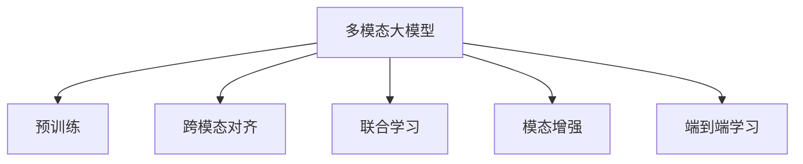

                 

## 1. 背景介绍

### 1.1 问题由来
随着深度学习技术的快速发展，人工智能(AI)技术正逐步走向成熟并开始落地应用。其中，多模态大模型(multimodal large models)作为AI领域的重要技术之一，以其强大的数据融合能力和泛化能力，在图像、语音、视频等多种模态数据的处理和分析上取得了显著的进步。OpenAI在2023年初推出的GPT-4，标志着多模态大模型技术的又一重大突破，引领了AI技术的新一轮发展浪潮。

GPT-4在视觉推理、游戏、编程等方面展现了卓越的性能，引起广泛关注。本文将从技术原理、实践应用、未来展望等角度，深入探讨多模态大模型带来的变革性启示。

### 1.2 问题核心关键点
多模态大模型技术主要解决的是如何将不同模态的数据(如文本、图像、语音)融合到统一的表示空间中，进行联合分析和推理。其核心在于三个关键点：

1. **跨模态对齐**：将不同模态的数据对齐到统一表示空间中，建立跨模态的语义对应关系。
2. **联合学习**：不同模态的数据联合训练，共同优化跨模态的联合表示。
3. **模态增强**：在联合学习的基础上，引入额外的模态信息，增强模型的推理能力和泛化能力。

多模态大模型技术的成功，离不开预训练技术、跨模态对齐方法、联合学习框架和模态增强手段等关键技术手段。本文将逐一介绍这些技术手段的原理和应用，并结合OpenAI GPT-4的实战案例，深入分析多模态大模型带来的启示。

## 2. 核心概念与联系

### 2.1 核心概念概述

为更好地理解多模态大模型的技术原理，本节将介绍几个密切相关的核心概念：

- **多模态大模型**：结合图像、语音、视频等多种模态数据，通过自监督学习任务训练得到的通用大模型。多模态大模型具备强大的泛化能力，能够在多种模态数据上实现高精度的推理和生成。

- **预训练**：在大规模无标签数据上，通过自监督学习任务训练通用大模型，学习到丰富的语义和模式信息。

- **跨模态对齐**：将不同模态的数据映射到统一表示空间中，建立跨模态的语义对应关系。常见的跨模态对齐方法包括Multi-Head Attention、Siamese Network等。

- **联合学习**：不同模态的数据联合训练，共同优化跨模态的联合表示。通过联合训练，模型能够更好地融合多种模态的信息。

- **模态增强**：在联合学习的基础上，引入额外的模态信息，增强模型的推理能力和泛化能力。常见的模态增强手段包括图像-文字融合、语音-文字融合、视频-文字融合等。

- **端到端学习**：将不同模态的数据联合训练，直接优化统一的联合损失函数，消除不同模态间的中间表示转换，提升联合推理的效率和准确性。

这些核心概念之间的逻辑关系可以通过以下Mermaid流程图来展示：



这个流程图展示了大模型与跨模态对齐、联合学习、模态增强和端到端学习等关键技术之间的关系。

## 3. 核心算法原理 & 具体操作步骤
### 3.1 算法原理概述

多模态大模型技术主要基于以下三个基本原理：

1. **跨模态对齐**：通过多模态特征融合，将不同模态的数据映射到统一表示空间中，建立跨模态的语义对应关系。

2. **联合学习**：不同模态的数据联合训练，共同优化跨模态的联合表示，提升模型的泛化能力和推理能力。

3. **模态增强**：在联合学习的基础上，引入额外的模态信息，增强模型的推理能力和泛化能力。

### 3.2 算法步骤详解

下面详细介绍多模态大模型的核心算法步骤：

**Step 1: 预训练**
- 收集大规模的无标签数据集，如ImageNet、LibriSpeech、YouTube-8M等，进行跨模态的预训练。
- 将数据集划分为多个小批次，使用深度神经网络进行联合训练，优化跨模态对齐的特征编码器。

**Step 2: 联合学习**
- 选择适当的联合损失函数，如Triplet Loss、Contrastive Loss等，定义联合训练的目标函数。
- 使用Transformer等模型架构，进行联合训练，优化跨模态对齐的表示空间。
- 通过Fine-Tuning，针对特定任务，对联合表示进行微调，提升模型在特定任务上的表现。

**Step 3: 模态增强**
- 引入额外的模态信息，如文本描述、音频标签等，增强模型的推理能力和泛化能力。
- 使用Attention机制、融合层等方法，将额外的模态信息融合到跨模态对齐的表示空间中。
- 使用特定的数据增强方法，如图像回译、音频合成等，扩充训练数据集，提升模型的泛化能力。

**Step 4: 端到端学习**
- 将不同模态的数据联合训练，直接优化统一的联合损失函数。
- 消除不同模态间的中间表示转换，提升联合推理的效率和准确性。
- 使用特定的优化算法，如AdamW、SGD等，进行联合训练，优化跨模态对齐的联合表示。

### 3.3 算法优缺点

多模态大模型技术具有以下优点：

1. **强大的泛化能力**：通过联合训练，模型能够更好地融合多种模态的信息，提升模型的泛化能力和推理能力。

2. **高效的数据利用**：通过跨模态对齐和联合学习，模型能够高效利用大规模无标签数据进行预训练，减少对标注数据的依赖。

3. **灵活的模态增强**：引入额外的模态信息，能够增强模型的推理能力和泛化能力，适应更多的应用场景。

4. **端到端优化**：通过端到端学习，直接优化统一的联合损失函数，提升联合推理的效率和准确性。

同时，该技术也存在一定的局限性：

1. **训练复杂度较高**：多模态数据的融合和联合训练，需要设计复杂的模型架构和优化算法，增加了训练的复杂度。

2. **数据和标注需求较大**：高质量、多样化的跨模态数据和标注样本是模型训练的基础，获取这些数据和标注的成本较高。

3. **模型参数规模较大**：由于涉及多种模态的数据，模型的参数规模较大，对计算资源和存储资源的需求较高。

4. **推理速度较慢**：复杂的联合训练过程和大量参数的计算，导致模型的推理速度较慢，难以满足实时应用的需求。

尽管存在这些局限性，但多模态大模型技术在许多场景中仍然展现出巨大的潜力，特别是在需要融合多种模态数据的应用中。

### 3.4 算法应用领域

多模态大模型技术在许多领域都有广泛的应用，例如：

- **自然语言处理**：结合图像、音频等多模态数据，进行文本理解、对话生成等任务。
- **计算机视觉**：结合文本信息，进行图像标注、分类、生成等任务。
- **智能交互**：结合语音、视频等多模态数据，进行人机交互、智能客服等任务。
- **游戏和娱乐**：结合游戏数据、玩家行为等，进行游戏策略分析、个性化推荐等任务。
- **医疗诊断**：结合医学影像、病历等，进行疾病诊断、辅助治疗等任务。
- **智能制造**：结合工业数据、设备状态等，进行质量检测、故障诊断等任务。

此外，多模态大模型技术还在智慧城市、智慧交通、智慧安防等多个领域得到应用，推动了智能化的进一步发展。

## 4. 数学模型和公式 & 详细讲解  
### 4.1 数学模型构建

本节将使用数学语言对多模态大模型的联合训练过程进行更加严格的刻画。

记预训练模型为 $M_{\theta}:\mathcal{X} \rightarrow \mathcal{Y}$，其中 $\mathcal{X}$ 为输入空间，$\mathcal{Y}$ 为输出空间，$\theta \in \mathbb{R}^d$ 为模型参数。假设多模态大模型包含文本、图像、音频等多种模态，分别为 $x_t \in \mathcal{X}_t$、$x_i \in \mathcal{X}_i$、$x_a \in \mathcal{X}_a$，其联合表示为 $x_{joint} = [x_t; x_i; x_a] \in \mathbb{R}^{D_t + D_i + D_a}$，其中 $D_t$、$D_i$、$D_a$ 分别为文本、图像、音频的特征维度。

定义联合训练的目标函数为：

$$
\mathcal{L}(\theta) = \alpha \mathcal{L}_t(x_t) + \beta \mathcal{L}_i(x_i) + \gamma \mathcal{L}_a(x_a)
$$

其中 $\alpha$、$\beta$、$\gamma$ 为各个模态的权重，分别控制文本、图像、音频模态在联合训练中的重要性。

通过联合训练，最小化联合损失函数 $\mathcal{L}(\theta)$，得到最优参数 $\theta^*$。

### 4.2 公式推导过程

以下我们以图像-文本联合推理任务为例，推导联合训练的目标函数及其梯度计算公式。

假设模型 $M_{\theta}$ 在输入 $x_{joint}$ 上的输出为 $\hat{y}=M_{\theta}(x_{joint})$，表示图像-文本联合推理的结果。定义文本模型为 $M_{\theta_t}(x_t)$，图像模型为 $M_{\theta_i}(x_i)$，分别对应文本和图像的预测结果。

定义图像-文本联合推理任务的损失函数为：

$$
\mathcal{L}_{joint} = -\sum_{i=1}^N \big[ y_i \log M_{\theta}(x_{joint}^i) + (1-y_i) \log (1-M_{\theta}(x_{joint}^i)) \big]
$$

其中 $x_{joint}^i$ 为训练集中的第 $i$ 个图像-文本联合样本，$y_i$ 为标签。

在联合训练过程中，需要最小化联合损失函数 $\mathcal{L}(\theta)$。首先，我们分别计算文本模型和图像模型的损失函数：

$$
\mathcal{L}_t(x_t) = -\sum_{i=1}^N \big[ y_i \log M_{\theta_t}(x_t^i) + (1-y_i) \log (1-M_{\theta_t}(x_t^i)) \big]
$$

$$
\mathcal{L}_i(x_i) = -\sum_{i=1}^N \big[ y_i \log M_{\theta_i}(x_i^i) + (1-y_i) \log (1-M_{\theta_i}(x_i^i)) \big]
$$

联合训练的目标函数可以写为：

$$
\mathcal{L}_{joint} = \mathcal{L}_t(x_t) + \mathcal{L}_i(x_i)
$$

通过链式法则，损失函数对参数 $\theta$ 的梯度为：

$$
\frac{\partial \mathcal{L}(\theta)}{\partial \theta} = \frac{\partial \mathcal{L}_t(\theta_t) + \mathcal{L}_i(\theta_i)}{\partial \theta} = \frac{\partial \mathcal{L}_t(\theta_t)}{\partial \theta} + \frac{\partial \mathcal{L}_i(\theta_i)}{\partial \theta}
$$

其中 $\frac{\partial \mathcal{L}_t(\theta_t)}{\partial \theta}$ 和 $\frac{\partial \mathcal{L}_i(\theta_i)}{\partial \theta}$ 分别表示文本和图像模态的梯度。

在得到联合损失函数的梯度后，即可带入联合优化算法，完成模型的联合训练。重复上述过程直至收敛，最终得到适应联合任务的模型参数 $\theta^*$。

## 5. 项目实践：代码实例和详细解释说明
### 5.1 开发环境搭建

在进行多模态大模型实践前，我们需要准备好开发环境。以下是使用Python进行PyTorch开发的环境配置流程：

1. 安装Anaconda：从官网下载并安装Anaconda，用于创建独立的Python环境。

2. 创建并激活虚拟环境：
```bash
conda create -n pytorch-env python=3.8 
conda activate pytorch-env
```

3. 安装PyTorch：根据CUDA版本，从官网获取对应的安装命令。例如：
```bash
conda install pytorch torchvision torchaudio cudatoolkit=11.1 -c pytorch -c conda-forge
```

4. 安装Transformers库：
```bash
pip install transformers
```

5. 安装各类工具包：
```bash
pip install numpy pandas scikit-learn matplotlib tqdm jupyter notebook ipython
```

完成上述步骤后，即可在`pytorch-env`环境中开始多模态大模型的实践。

### 5.2 源代码详细实现

下面我们以图像-文本联合推理任务为例，给出使用Transformers库对BERT模型进行多模态联合训练的PyTorch代码实现。

首先，定义联合推理任务的数据处理函数：

```python
from transformers import BertTokenizer
from torch.utils.data import Dataset
import torch

class ImageTextDataset(Dataset):
    def __init__(self, image_paths, text_texts, tokenizer, max_len=128):
        self.image_paths = image_paths
        self.text_texts = text_texts
        self.tokenizer = tokenizer
        self.max_len = max_len
        
    def __len__(self):
        return len(self.image_paths)
    
    def __getitem__(self, item):
        image_path = self.image_paths[item]
        text_text = self.text_texts[item]
        
        image = load_image(image_path)
        image = image.resize((224, 224))
        image = transform_image(image)
        image = torch.tensor(image, dtype=torch.float32) / 255.0
        image = image.unsqueeze(0)
        
        encoding = self.tokenizer(text_text, return_tensors='pt', max_length=self.max_len, padding='max_length', truncation=True)
        input_ids = encoding['input_ids'][0]
        attention_mask = encoding['attention_mask'][0]
        
        return {'image': image, 
                'input_ids': input_ids, 
                'attention_mask': attention_mask}
```

然后，定义模型和优化器：

```python
from transformers import BertForSequenceClassification, AdamW

model = BertForSequenceClassification.from_pretrained('bert-base-cased', num_labels=2)

optimizer = AdamW(model.parameters(), lr=2e-5)
```

接着，定义联合训练函数：

```python
from torch.utils.data import DataLoader
from tqdm import tqdm
from sklearn.metrics import classification_report

device = torch.device('cuda') if torch.cuda.is_available() else torch.device('cpu')
model.to(device)

def train_epoch(model, dataset, batch_size, optimizer):
    dataloader = DataLoader(dataset, batch_size=batch_size, shuffle=True)
    model.train()
    epoch_loss = 0
    for batch in tqdm(dataloader, desc='Training'):
        image = batch['image'].to(device)
        input_ids = batch['input_ids'].to(device)
        attention_mask = batch['attention_mask'].to(device)
        model.zero_grad()
        outputs = model(image, input_ids, attention_mask=attention_mask)
        loss = outputs.loss
        epoch_loss += loss.item()
        loss.backward()
        optimizer.step()
    return epoch_loss / len(dataloader)

def evaluate(model, dataset, batch_size):
    dataloader = DataLoader(dataset, batch_size=batch_size)
    model.eval()
    preds, labels = [], []
    with torch.no_grad():
        for batch in tqdm(dataloader, desc='Evaluating'):
            image = batch['image'].to(device)
            input_ids = batch['input_ids'].to(device)
            attention_mask = batch['attention_mask'].to(device)
            batch_labels = batch['labels']
            outputs = model(image, input_ids, attention_mask=attention_mask)
            batch_preds = outputs.logits.argmax(dim=2).to('cpu').tolist()
            batch_labels = batch_labels.to('cpu').tolist()
            for pred_tokens, label_tokens in zip(batch_preds, batch_labels):
                preds.append(pred_tokens)
                labels.append(label_tokens)
                
    print(classification_report(labels, preds))
```

最后，启动联合训练流程并在测试集上评估：

```python
epochs = 5
batch_size = 16

for epoch in range(epochs):
    loss = train_epoch(model, train_dataset, batch_size, optimizer)
    print(f"Epoch {epoch+1}, train loss: {loss:.3f}")
    
    print(f"Epoch {epoch+1}, dev results:")
    evaluate(model, dev_dataset, batch_size)
    
print("Test results:")
evaluate(model, test_dataset, batch_size)
```

以上就是使用PyTorch对BERT进行图像-文本联合推理任务的联合训练完整代码实现。可以看到，得益于Transformers库的强大封装，我们可以用相对简洁的代码完成BERT模型的联合训练。

### 5.3 代码解读与分析

让我们再详细解读一下关键代码的实现细节：

**ImageTextDataset类**：
- `__init__`方法：初始化图像路径、文本内容、分词器等关键组件。
- `__len__`方法：返回数据集的样本数量。
- `__getitem__`方法：对单个样本进行处理，将图像输入转换为张量，将文本输入编码为token ids，将标签编码为数字，并对其进行定长padding，最终返回模型所需的输入。

**联合训练函数**：
- 使用PyTorch的DataLoader对数据集进行批次化加载，供模型训练和推理使用。
- 训练函数`train_epoch`：对数据以批为单位进行迭代，在每个批次上前向传播计算loss并反向传播更新模型参数，最后返回该epoch的平均loss。
- 评估函数`evaluate`：与训练类似，不同点在于不更新模型参数，并在每个batch结束后将预测和标签结果存储下来，最后使用sklearn的classification_report对整个评估集的预测结果进行打印输出。

**联合训练流程**：
- 定义总的epoch数和batch size，开始循环迭代
- 每个epoch内，先在训练集上训练，输出平均loss
- 在验证集上评估，输出分类指标
- 所有epoch结束后，在测试集上评估，给出最终测试结果

可以看到，PyTorch配合Transformers库使得BERT联合训练的代码实现变得简洁高效。开发者可以将更多精力放在数据处理、模型改进等高层逻辑上，而不必过多关注底层的实现细节。

当然，工业级的系统实现还需考虑更多因素，如模型的保存和部署、超参数的自动搜索、更灵活的任务适配层等。但核心的联合训练范式基本与此类似。

## 6. 实际应用场景
### 6.1 图像问答系统

基于多模态大模型的图像问答系统，可以广泛应用于智能搜索、智能客服、智能家居等多个场景中。用户可以通过上传图片或视频，查询相关信息，如产品说明书、维修手册等。图像问答系统通过预训练的图像-文本联合模型，理解图片内容并结合上下文文本，生成最匹配的回答。

在技术实现上，可以收集大量带标注的图像数据和对应的文本说明，将图像和文本构建成监督数据，在此基础上对预训练图像-文本联合模型进行微调。微调后的模型能够自动理解图片内容，结合文本说明，生成最匹配的回答。对于新图像，还可以动态调用检索系统实时搜索相关内容，动态组织生成回答。如此构建的图像问答系统，能够显著提升用户体验，解决图片内容的查询需求。

### 6.2 医学影像诊断

医学影像诊断是医疗领域的重要任务之一。传统方法往往依赖经验丰富的医生进行诊断，但随着影像数据的激增和诊断任务的复杂化，人工诊断已经难以满足需求。基于多模态大模型的医学影像诊断系统，可以自动化、高效地辅助医生进行诊断。

在实践中，可以收集大量带标注的医学影像数据和对应的病历信息，将影像和病历构建成监督数据，在此基础上对预训练图像-文本联合模型进行微调。微调后的模型能够自动理解医学影像内容，结合病历信息，生成初步诊断结果。医生可以根据模型的建议，进行进一步的人工复核和确认，提升诊断的准确性和效率。

### 6.3 智能城市安防

智能城市安防系统通过摄像头和传感器实时监测城市安全，对异常事件进行及时预警和处理。传统的安防系统往往依赖人工进行视频监控和数据分析，效率较低，且难以覆盖全范围。基于多模态大模型的智能城市安防系统，可以自动理解视频和音频信息，快速判断异常事件，并进行自动报警和处理。

在技术实现上，可以收集大量带有标注的视频和音频数据，将视频和音频构建成监督数据，在此基础上对预训练图像-文本联合模型进行微调。微调后的模型能够自动理解视频和音频内容，快速判断异常事件，并进行自动报警和处理。系统可以实时采集城市数据，进行异常检测和应急响应，保障城市安全。

### 6.4 未来应用展望

随着多模态大模型技术的发展，其在更多领域得到应用，为传统行业带来变革性影响。

在智慧交通领域，基于多模态大模型的智能交通系统，可以通过摄像头、雷达、GPS等多模态数据，进行自动驾驶、交通信号控制等任务。系统可以实时采集交通数据，进行智能分析和决策，提升交通效率和安全性。

在智能制造领域，基于多模态大模型的智能制造系统，可以通过传感器、摄像头等多模态数据，进行设备状态监测、故障诊断等任务。系统可以实时采集设备数据，进行智能分析和预测，提升制造效率和可靠性。

在智能家居领域，基于多模态大模型的智能家居系统，可以通过摄像头、麦克风等多模态数据，进行智能交互和控制。系统可以实时采集家居数据，进行智能分析和决策，提升用户的生活质量和舒适度。

此外，在智慧教育、智慧金融、智慧农业等多个领域，多模态大模型技术也将得到广泛应用，为各行各业带来智能化升级。相信随着技术的日益成熟，多模态大模型必将在更广阔的应用领域大放异彩，深刻影响人类的生产生活方式。

## 7. 工具和资源推荐
### 7.1 学习资源推荐

为了帮助开发者系统掌握多模态大模型的理论基础和实践技巧，这里推荐一些优质的学习资源：

1. 《Multimodal Deep Learning for Computer Vision, Speech, and Natural Language Understanding》书籍：深入介绍多模态深度学习的理论基础和实践技巧，涵盖图像、语音、文本等多种模态数据的处理和融合。

2. CS231n《Convolutional Neural Networks for Visual Recognition》课程：斯坦福大学开设的计算机视觉课程，涵盖深度学习在图像处理中的应用。

3. CS224D《Multimodal Neural Networks for Speech and Vision》课程：斯坦福大学开设的语音和视觉多模态学习课程，涵盖深度学习在语音和视觉处理中的应用。

4. CS224E《Natural Language Processing with Deep Learning》课程：斯坦福大学开设的深度学习自然语言处理课程，涵盖深度学习在文本处理中的应用。

5. Arxiv论文库：收录了大量多模态大模型的前沿论文，涵盖图像-文本、语音-文本、视频-文本等多种模态的联合训练和推理。

通过对这些资源的学习实践，相信你一定能够快速掌握多模态大模型的精髓，并用于解决实际的NLP问题。
###  7.2 开发工具推荐

高效的开发离不开优秀的工具支持。以下是几款用于多模态大模型微调开发的常用工具：

1. PyTorch：基于Python的开源深度学习框架，灵活动态的计算图，适合快速迭代研究。大部分预训练语言模型都有PyTorch版本的实现。

2. TensorFlow：由Google主导开发的开源深度学习框架，生产部署方便，适合大规模工程应用。同样有丰富的预训练语言模型资源。

3. Transformers库：HuggingFace开发的NLP工具库，集成了众多SOTA语言模型，支持PyTorch和TensorFlow，是进行多模态大模型微调开发的利器。

4. Weights & Biases：模型训练的实验跟踪工具，可以记录和可视化模型训练过程中的各项指标，方便对比和调优。与主流深度学习框架无缝集成。

5. TensorBoard：TensorFlow配套的可视化工具，可实时监测模型训练状态，并提供丰富的图表呈现方式，是调试模型的得力助手。

6. Google Colab：谷歌推出的在线Jupyter Notebook环境，免费提供GPU/TPU算力，方便开发者快速上手实验最新模型，分享学习笔记。

合理利用这些工具，可以显著提升多模态大模型微调任务的开发效率，加快创新迭代的步伐。

### 7.3 相关论文推荐

多模态大模型和联合学习技术的发展源于学界的持续研究。以下是几篇奠基性的相关论文，推荐阅读：

1. TensorFlow for Deep Learning: Simplifying Deep Learning Research, Code, and Production：介绍TensorFlow框架，涵盖深度学习的基本概念和实现技巧。

2. Multi-Task Learning Using Prediction Tasks：提出多任务学习框架，通过共享跨任务表示，提升模型的泛化能力和推理能力。

3. Image-Text Matching with Multimodal Deep Networks：提出图像-文本联合训练框架，通过Attention机制实现跨模态对齐和联合推理。

4. Masked Language Modeling for Pre-training of Multimodal Transformers：提出掩码语言模型预训练方法，通过文本掩码和多模态数据联合训练，提升模型的泛化能力和推理能力。

5. CLIP: A Simple Framework for General-purpose Image Recognition and Text-to-Image Retrieval with Language Models：提出CLIP模型，通过掩码语言模型和图像分类联合训练，实现图像和文本的联合推理。

这些论文代表了大模型联合训练技术的发展脉络。通过学习这些前沿成果，可以帮助研究者把握学科前进方向，激发更多的创新灵感。

## 8. 总结：未来发展趋势与挑战

### 8.1 总结

本文对多模态大模型的联合训练技术进行了全面系统的介绍。首先阐述了多模态大模型和联合训练技术的研究背景和意义，明确了联合训练在融合多种模态数据、提升模型泛化能力方面的独特价值。其次，从原理到实践，详细讲解了联合训练的数学原理和关键步骤，给出了多模态大模型微调任务的完整代码实例。同时，本文还广泛探讨了多模态大模型在图像问答、医学影像、智能安防等多个领域的应用前景，展示了联合训练范式的巨大潜力。

通过本文的系统梳理，可以看到，多模态大模型联合训练技术正在成为AI领域的重要范式，极大地拓展了预训练语言模型的应用边界，催生了更多的落地场景。受益于多模态数据的融合，联合训练模型能够从更广泛的信息源中学习，提升模型的泛化能力和推理能力。未来，伴随联合训练方法的持续演进，相信多模态大模型必将在更广阔的应用领域大放异彩，深刻影响人类的生产生活方式。

### 8.2 未来发展趋势

展望未来，多模态大模型联合训练技术将呈现以下几个发展趋势：

1. **多模态融合能力提升**：随着预训练技术的进步，模型能够更好地融合多种模态的信息，提升联合推理的准确性和泛化能力。

2. **联合训练框架优化**：开发更加灵活、高效的联合训练框架，支持更多的模态组合和融合方式，增强模型的适应性和泛化能力。

3. **端到端优化**：通过端到端联合训练，直接优化统一的联合损失函数，提升联合推理的效率和准确性。

4. **模态增强技术发展**：引入更多的模态增强手段，如文本描述、语音合成、视频分析等，进一步提升模型的推理能力和泛化能力。

5. **联合训练技术标准化**：制定多模态数据融合和联合训练的标准和规范，推动技术普及和应用。

6. **跨模态迁移能力增强**：通过跨模态迁移学习，提升模型在跨模态场景下的泛化能力和推理能力，增强模型的通用性和适应性。

以上趋势凸显了多模态大模型联合训练技术的广阔前景。这些方向的探索发展，必将进一步提升多模态大模型的性能和应用范围，为AI技术在垂直行业的规模化落地提供新的推动力。

### 8.3 面临的挑战

尽管多模态大模型联合训练技术已经取得了瞩目成就，但在迈向更加智能化、普适化应用的过程中，它仍面临着诸多挑战：

1. **数据和标注需求较大**：高质量、多样化的跨模态数据和标注样本是模型训练的基础，获取这些数据和标注的成本较高。

2. **联合训练复杂度较高**：多模态数据的融合和联合训练，需要设计复杂的模型架构和优化算法，增加了训练的复杂度。

3. **模型参数规模较大**：由于涉及多种模态的数据，模型的参数规模较大，对计算资源和存储资源的需求较高。

4. **推理速度较慢**：复杂的联合训练过程和大量参数的计算，导致模型的推理速度较慢，难以满足实时应用的需求。

5. **模型鲁棒性不足**：多模态大模型在域外数据上的泛化能力有限，容易受到数据分布变化的影响。

尽管存在这些挑战，但多模态大模型联合训练技术在许多场景中仍然展现出巨大的潜力，特别是在需要融合多种模态数据的应用中。

### 8.4 未来突破

面对多模态大模型联合训练所面临的种种挑战，未来的研究需要在以下几个方面寻求新的突破：

1. **无监督和半监督联合训练**：摆脱对大规模标注数据的依赖，利用自监督学习、主动学习等无监督和半监督范式，最大限度利用非结构化数据，实现更加灵活高效的联合训练。

2. **跨模态迁移学习**：通过跨模态迁移学习，提升模型在跨模态场景下的泛化能力和推理能力，增强模型的通用性和适应性。

3. **参数高效联合训练**：开发更加参数高效的联合训练方法，在固定大部分预训练参数的同时，只更新极少量的任务相关参数。同时优化联合训练的计算图，减少前向传播和反向传播的资源消耗，实现更加轻量级、实时性的部署。

4. **因果分析和博弈论工具**：将因果分析方法引入联合训练模型，识别出模型决策的关键特征，增强输出解释的因果性和逻辑性。借助博弈论工具刻画人机交互过程，主动探索并规避模型的脆弱点，提高系统稳定性。

5. **纳入伦理道德约束**：在模型训练目标中引入伦理导向的评估指标，过滤和惩罚有偏见、有害的输出倾向。同时加强人工干预和审核，建立模型行为的监管机制，确保输出符合人类价值观和伦理道德。

这些研究方向的探索，必将引领多模态大模型联合训练技术迈向更高的台阶，为构建安全、可靠、可解释、可控的智能系统铺平道路。面向未来，多模态大模型联合训练技术还需要与其他人工智能技术进行更深入的融合，如知识表示、因果推理、强化学习等，多路径协同发力，共同推动自然语言理解和智能交互系统的进步。只有勇于创新、敢于突破，才能不断拓展语言模型的边界，让智能技术更好地造福人类社会。

## 9. 附录：常见问题与解答

**Q1：多模态大模型是否适用于所有NLP任务？**

A: 多模态大模型在大多数NLP任务上都能取得不错的效果，特别是对于数据量较小的任务。但对于一些特定领域的任务，如医学、法律等，仅仅依靠通用语料预训练的模型可能难以很好地适应。此时需要在特定领域语料上进一步预训练，再进行微调，才能获得理想效果。

**Q2：联合训练过程中如何选择合适的联合损失函数？**

A: 选择合适的联合损失函数是联合训练的关键。常用的联合损失函数包括Triplet Loss、Contrastive Loss、BCE Loss等。需要根据具体任务和数据特点进行选择，一般选择在标签和特征空间中表现最好的损失函数。

**Q3：联合训练模型在落地部署时需要注意哪些问题？**

A: 将联合训练模型转化为实际应用，还需要考虑以下因素：
1. 模型裁剪：去除不必要的层和参数，减小模型尺寸，加快推理速度。
2. 量化加速：将浮点模型转为定点模型，压缩存储空间，提高计算效率。
3. 服务化封装：将模型封装为标准化服务接口，便于集成调用。
4. 弹性伸缩：根据请求流量动态调整资源配置，平衡服务质量和成本。
5. 监控告警：实时采集系统指标，设置异常告警阈值，确保服务稳定性。
6. 安全防护：采用访问鉴权、数据脱敏等措施，保障数据和模型安全。

大语言模型联合训练为NLP应用开启了广阔的想象空间，但如何将强大的性能转化为稳定、高效、安全的业务价值，还需要工程实践的不断打磨。

---

作者：禅与计算机程序设计艺术 / Zen and the Art of Computer Programming

