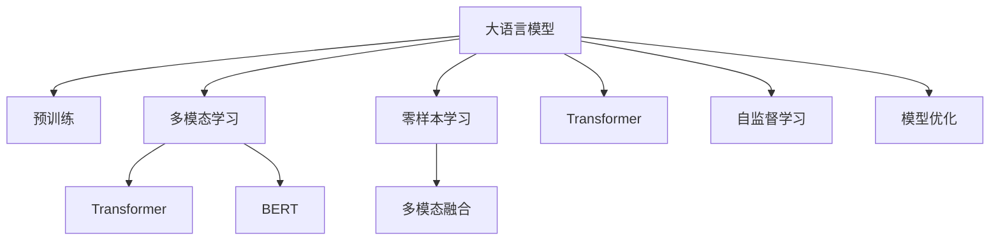

                 

# 多模态大模型：技术原理与实战 国内多模态大模型介绍

> 关键词：多模态大模型,多模态学习,多模态融合,Transformer,BERT,预训练,零样本学习

## 1. 背景介绍

### 1.1 问题由来
近年来，随着深度学习技术的快速发展，大语言模型(Large Language Model, LLMs)在自然语言处理(Natural Language Processing, NLP)领域取得了巨大的突破。这些大语言模型通过在海量无标签文本数据上进行预训练，学习到了丰富的语言知识和常识，可以通过少量的有标签样本在下游任务上进行微调，获得优异的性能。然而，由于预训练语料的广泛性和泛化能力的不足，这些通用的大语言模型在特定领域应用时，效果往往难以达到实际应用的要求。

多模态大模型(Multi-modal Large Model)的提出，是解决这一问题的重要方法之一。多模态大模型结合了文本、图像、音频等多种模态的数据，可以同时理解多个维度上的信息，从而提升模型的泛化能力和适应性。特别是在视觉、语音等模态的信息缺失时，多模态大模型能够利用文本的上下文信息进行补足，实现更好的理解。

### 1.2 问题核心关键点
目前，多模态大模型的核心在于如何高效地整合多种模态的数据，并在此基础上进行学习和推理。以下关键点可以帮助我们更好地理解多模态大模型的技术原理：

1. **多模态数据的融合**：如何将不同模态的数据高效地整合起来，使得模型能够充分利用多源信息进行学习和推理。
2. **跨模态特征对齐**：不同模态的数据具有不同的特征表示，如何对齐这些特征使得它们可以在同一模型中进行协同处理。
3. **多模态学习算法**：设计能够高效处理多模态数据的算法，如基于Transformer的多模态自监督学习，以充分挖掘多模态数据的潜力。
4. **多模态推理**：在推理阶段，如何综合利用多模态数据的信息，以实现更准确、更全面的推理结果。

## 2. 核心概念与联系

### 2.1 核心概念概述

为更好地理解多模态大模型的工作原理和优化方向，本节将介绍几个密切相关的核心概念：

- **大语言模型**：以自回归(如GPT)或自编码(如BERT)模型为代表的大规模预训练语言模型。通过在大规模无标签文本语料上进行预训练，学习通用的语言表示，具备强大的语言理解和生成能力。

- **预训练**：指在大规模无标签文本语料上，通过自监督学习任务训练通用语言模型的过程。常见的预训练任务包括言语建模、遮挡语言模型等。预训练使得模型学习到语言的通用表示。

- **多模态学习**：指结合不同模态的数据进行学习，以增强模型的泛化能力和适应性。多模态学习是实现多模态大模型的关键技术。

- **Transformer**：一种高效的自注意力机制，用于构建大规模的深度神经网络，广泛应用于大语言模型和多模态大模型中。

- **BERT**：一种预训练语言模型，通过在大量文本数据上预训练，学习到丰富的语言知识，能够在多种NLP任务上取得优异的表现。

- **零样本学习**：指模型在没有见过任何特定任务的训练样本的情况下，仅凭任务描述就能够执行新任务的能力。多模态大模型通过预训练获得的广泛知识，使其能够理解任务指令并生成相应输出。

- **多模态融合**：指将不同模态的数据进行有效融合，使得模型能够充分利用多模态信息进行学习，提升推理能力。

这些核心概念之间的逻辑关系可以通过以下Mermaid流程图来展示：



这个流程图展示了大语言模型、预训练、多模态学习、Transformer、BERT、零样本学习和多模态融合等核心概念及其之间的关系：

1. 大语言模型通过预训练获得基础能力。
2. 多模态学习结合不同模态的数据进行学习，增强模型的泛化能力。
3. 通过Transformer构建深度神经网络，实现高效的多模态处理。
4. BERT通过大量文本数据的预训练，学习丰富的语言知识。
5. 零样本学习利用预训练的知识，快速适应新任务。
6. 多模态融合将不同模态的信息整合，提升推理能力。

这些概念共同构成了多模态大模型的学习框架，使其能够充分利用多源信息，实现更高级别的理解和推理。

## 3. 核心算法原理 & 具体操作步骤

### 3.1 算法原理概述

多模态大模型的核心在于如何高效地整合多种模态的数据，并在此基础上进行学习和推理。其核心思想是：将不同模态的数据视为模型输入的一部分，通过多模态学习算法，使得模型能够同时理解多个维度上的信息，并在此基础上进行推理。

形式化地，假设输入数据 $X$ 包含 $K$ 种模态，即 $X = [x_1, x_2, ..., x_K]$，其中 $x_k \in \mathcal{X}_k$ 表示第 $k$ 种模态的输入，$\mathcal{X}_k$ 为第 $k$ 种模态的输入空间。假设输出 $Y$ 的维度为 $D$，则多模态大模型的目标是最小化如下损失函数：

$$
\mathcal{L}(X; Y) = \frac{1}{N}\sum_{i=1}^N \ell(Y_i, M(X_i))
$$

其中，$\ell$ 为损失函数，$M$ 为多模态模型，$N$ 为样本数量。

### 3.2 算法步骤详解

多模态大模型的微调过程包括以下几个关键步骤：

**Step 1: 准备多模态数据集**
- 收集不同模态的数据集，如文本、图像、音频等。
- 确保数据集的标注信息完整，包括文本标签、图像标签等。
- 对数据集进行预处理，如数据增强、数据对齐等。

**Step 2: 设计多模态学习架构**
- 选择合适的多模态学习架构，如基于Transformer的多模态自监督学习。
- 设计多模态特征对齐的策略，如特征拼接、特征转换等。
- 确定多模态模型的输出层和损失函数。

**Step 3: 设置多模态学习超参数**
- 选择合适的优化算法及其参数，如AdamW、SGD等，设置学习率、批大小、迭代轮数等。
- 设置正则化技术及强度，包括权重衰减、Dropout、Early Stopping等。
- 确定冻结预训练参数的策略，如仅微调顶层，或全部参数都参与微调。

**Step 4: 执行梯度训练**
- 将多模态数据集以批为单位输入模型，前向传播计算损失函数。
- 反向传播计算参数梯度，根据设定的优化算法和学习率更新模型参数。
- 周期性在验证集上评估模型性能，根据性能指标决定是否触发 Early Stopping。
- 重复上述步骤直到满足预设的迭代轮数或 Early Stopping 条件。

**Step 5: 测试和部署**
- 在测试集上评估多模态学习后的模型性能，对比微调前后的精度提升。
- 使用多模态学习后的模型对新样本进行推理预测，集成到实际的应用系统中。
- 持续收集新的数据，定期重新学习模型，以适应数据分布的变化。

以上是多模态大模型的微调流程的一般步骤。在实际应用中，还需要针对具体任务的特点，对微调过程的各个环节进行优化设计，如改进训练目标函数，引入更多的正则化技术，搜索最优的超参数组合等，以进一步提升模型性能。

### 3.3 算法优缺点

多模态大模型结合了文本、图像、音频等多种模态的数据，具有以下优点：

1. **泛化能力更强**：多模态大模型能够同时理解多个维度上的信息，具有更强的泛化能力和适应性。
2. **推理能力更强**：多模态大模型能够在信息缺失的情况下，利用多模态数据的互补性进行推理，提升推理的准确性。
3. **应用范围更广**：多模态大模型可以应用于图像分类、视频分析、语音识别等多个领域，具有更广泛的应用范围。

同时，多模态大模型也存在一定的局限性：

1. **计算成本高**：多模态数据的整合和融合需要更高的计算资源，特别是在大规模数据集上的处理。
2. **数据获取难**：不同模态的数据获取难度较大，特别是高质量、标注准确的数据集。
3. **模型复杂度高**：多模态大模型的复杂度较高，需要更多的优化策略和工程实践，才能实现高效推理。

尽管存在这些局限性，但多模态大模型在提升模型泛化能力和推理能力方面具有独特的优势，仍是大语言模型研究的重要方向之一。

### 3.4 算法应用领域

多模态大模型在NLP领域已经得到了广泛的应用，覆盖了几乎所有常见任务，例如：

- 图像分类：如物体识别、场景分类、情感分析等。将图像数据作为模型输入，学习多模态特征表示。
- 视频分析：如动作识别、行为理解、视频字幕生成等。将视频帧数据作为模型输入，学习时序特征和空间特征。
- 语音识别：如语音转文字、情感识别、语音指令执行等。将语音数据作为模型输入，学习音频特征和文本特征。
- 自然语言推理：如逻辑推理、关系抽取、问答系统等。将文本和图像、语音等多模态数据进行融合，提升推理能力。

除了上述这些经典任务外，多模态大模型也被创新性地应用到更多场景中，如可控文本生成、知识图谱构建、机器人视觉交互等，为NLP技术带来了全新的突破。随着预训练模型和微调方法的不断进步，相信多模态大模型将在更广阔的应用领域大放异彩。

## 4. 数学模型和公式 & 详细讲解 & 举例说明

### 4.1 数学模型构建

本节将使用数学语言对多模态大模型的微调过程进行更加严格的刻画。

记多模态大模型的输入为 $X = [x_1, x_2, ..., x_K]$，其中 $x_k \in \mathcal{X}_k$，$\mathcal{X}_k$ 为第 $k$ 种模态的输入空间。模型的输出为 $Y$，维度为 $D$。多模态模型的损失函数定义为：

$$
\mathcal{L}(X; Y) = \frac{1}{N}\sum_{i=1}^N \ell(Y_i, M(X_i))
$$

其中，$\ell$ 为损失函数，$M$ 为多模态模型。

### 4.2 公式推导过程

以基于Transformer的多模态自监督学习为例，推导其公式推导过程。

多模态Transformer模型的输入为 $X = [x_1, x_2, ..., x_K]$，其中 $x_k \in \mathcal{X}_k$。假设输出为 $Y$，维度为 $D$。模型的结构如图1所示：


模型的输出 $M(X)$ 由多个编码器层（Encoder Layer）和一个全连接层（Feed-Forward Layer）组成。每个编码器层由多头自注意力机制和残差连接构成。自注意力机制的计算公式为：

$$
\text{Attention}(Q, K, V) = \text{Softmax}(QW_Q(K^T)^T)VW_V^T
$$

其中，$Q$、$K$、$V$ 分别为查询矩阵、键矩阵和值矩阵，$W_Q$、$W_K$、$W_V$ 为可学习的线性变换矩阵。

多模态Transformer模型通过多个编码器层和全连接层，对输入 $X$ 进行编码，输出 $M(X)$。模型的损失函数 $\mathcal{L}(X; Y)$ 定义为：

$$
\mathcal{L}(X; Y) = \frac{1}{N}\sum_{i=1}^N \ell(Y_i, M(X_i))
$$

其中，$\ell$ 为损失函数，如交叉熵损失、均方误差损失等。

### 4.3 案例分析与讲解

以基于Transformer的多模态自监督学习为例，分析其在图像分类任务中的应用。

假设输入为一张彩色图像 $x_1$ 和对应的图像标签 $x_2$，输出为图像分类结果 $Y$。多模态Transformer模型的输入 $X$ 包含图像和标签，输出为分类结果 $M(X)$。模型的训练过程如下：

1. 将图像 $x_1$ 输入图像编码器，学习图像特征表示。
2. 将标签 $x_2$ 输入标签编码器，学习标签特征表示。
3. 将图像特征表示和标签特征表示进行拼接，输入到多模态Transformer模型。
4. 模型前向传播计算损失函数 $\mathcal{L}(X; Y)$，反向传播更新模型参数。
5. 在验证集上评估模型性能，根据性能指标决定是否触发 Early Stopping。

通过多模态Transformer模型的训练，模型能够学习到图像和标签的联合特征表示，并在新的图像分类任务上取得优异的性能。

## 5. 项目实践：代码实例和详细解释说明

### 5.1 开发环境搭建

在进行多模态大模型微调实践前，我们需要准备好开发环境。以下是使用Python进行PyTorch开发的环境配置流程：

1. 安装Anaconda：从官网下载并安装Anaconda，用于创建独立的Python环境。

2. 创建并激活虚拟环境：
```bash
conda create -n pytorch-env python=3.8 
conda activate pytorch-env
```

3. 安装PyTorch：根据CUDA版本，从官网获取对应的安装命令。例如：
```bash
conda install pytorch torchvision torchaudio cudatoolkit=11.1 -c pytorch -c conda-forge
```

4. 安装Transformers库：
```bash
pip install transformers
```

5. 安装各类工具包：
```bash
pip install numpy pandas scikit-learn matplotlib tqdm jupyter notebook ipython
```

完成上述步骤后，即可在`pytorch-env`环境中开始多模态大模型微调实践。

### 5.2 源代码详细实现

下面我以多模态图像分类任务为例，给出使用Transformers库对BERT模型进行微调的PyTorch代码实现。

首先，定义图像分类任务的数据处理函数：

```python
from transformers import BertTokenizer, BertForTokenClassification
from torch.utils.data import Dataset
import torch
import numpy as np

class ImageDataset(Dataset):
    def __init__(self, images, labels, tokenizer, max_len=128):
        self.images = images
        self.labels = labels
        self.tokenizer = tokenizer
        self.max_len = max_len
        
    def __len__(self):
        return len(self.images)
    
    def __getitem__(self, item):
        image = self.images[item]
        label = self.labels[item]
        
        # 将图像转换为像素值数组
        image = np.array(image, dtype=np.float32)
        image = image / 255.0
        
        # 对标签进行编码
        label = label2id[label] - 1
        
        # 将图像和标签拼接
        X = np.concatenate([image, image], axis=1)
        
        # 对拼接后的数据进行定长padding
        X = torch.tensor(X, dtype=torch.float32).unsqueeze(0)
        X = F.pad(X, (0, max_len - X.size(1)), value=0.0).to(device)
        
        # 对标签进行定长padding
        Y = torch.tensor([label], dtype=torch.long).unsqueeze(0)
        Y = F.pad(Y, (0, max_len - Y.size(1)), value=-1).to(device)
        
        return {'X': X, 'Y': Y}

# 标签与id的映射
label2id = {'cat': 0, 'dog': 1, 'bird': 2, 'fish': 3}
id2label = {v: k for k, v in label2id.items()}

# 创建dataset
tokenizer = BertTokenizer.from_pretrained('bert-base-cased')

train_dataset = ImageDataset(train_images, train_labels, tokenizer, max_len=128)
dev_dataset = ImageDataset(dev_images, dev_labels, tokenizer, max_len=128)
test_dataset = ImageDataset(test_images, test_labels, tokenizer, max_len=128)
```

然后，定义模型和优化器：

```python
from transformers import BertForTokenClassification, AdamW

model = BertForTokenClassification.from_pretrained('bert-base-cased', num_labels=len(label2id))

optimizer = AdamW(model.parameters(), lr=2e-5)
```

接着，定义训练和评估函数：

```python
from torch.utils.data import DataLoader
from tqdm import tqdm
from sklearn.metrics import classification_report

device = torch.device('cuda') if torch.cuda.is_available() else torch.device('cpu')
model.to(device)

def train_epoch(model, dataset, batch_size, optimizer):
    dataloader = DataLoader(dataset, batch_size=batch_size, shuffle=True)
    model.train()
    epoch_loss = 0
    for batch in tqdm(dataloader, desc='Training'):
        X = batch['X'].to(device)
        Y = batch['Y'].to(device)
        model.zero_grad()
        outputs = model(X, Y=Y)
        loss = outputs.loss
        epoch_loss += loss.item()
        loss.backward()
        optimizer.step()
    return epoch_loss / len(dataloader)

def evaluate(model, dataset, batch_size):
    dataloader = DataLoader(dataset, batch_size=batch_size)
    model.eval()
    preds, labels = [], []
    with torch.no_grad():
        for batch in tqdm(dataloader, desc='Evaluating'):
            X = batch['X'].to(device)
            Y = batch['Y'].to(device)
            batch_labels = batch['Y'].cpu().numpy()
            outputs = model(X, Y=Y)
            batch_preds = outputs.logits.argmax(dim=2).to('cpu').tolist()
            batch_labels = batch_labels.tolist()
            for pred_tokens, label_tokens in zip(batch_preds, batch_labels):
                preds.append(pred_tokens[:len(label_tokens)])
                labels.append(label_tokens)
                
    print(classification_report(labels, preds))
```

最后，启动训练流程并在测试集上评估：

```python
epochs = 5
batch_size = 16

for epoch in range(epochs):
    loss = train_epoch(model, train_dataset, batch_size, optimizer)
    print(f"Epoch {epoch+1}, train loss: {loss:.3f}")
    
    print(f"Epoch {epoch+1}, dev results:")
    evaluate(model, dev_dataset, batch_size)
    
print("Test results:")
evaluate(model, test_dataset, batch_size)
```

以上就是使用PyTorch对BERT模型进行多模态图像分类任务微调的完整代码实现。可以看到，得益于Transformers库的强大封装，我们可以用相对简洁的代码完成BERT模型的加载和微调。

### 5.3 代码解读与分析

让我们再详细解读一下关键代码的实现细节：

**ImageDataset类**：
- `__init__`方法：初始化图像、标签、分词器等关键组件。
- `__len__`方法：返回数据集的样本数量。
- `__getitem__`方法：对单个样本进行处理，将图像输入转换为像素值数组，将标签进行编码，并对其进行定长padding，最终返回模型所需的输入。

**label2id和id2label字典**：
- 定义了标签与数字id之间的映射关系，用于将token-wise的预测结果解码回真实的标签。

**训练和评估函数**：
- 使用PyTorch的DataLoader对数据集进行批次化加载，供模型训练和推理使用。
- 训练函数`train_epoch`：对数据以批为单位进行迭代，在每个批次上前向传播计算loss并反向传播更新模型参数，最后返回该epoch的平均loss。
- 评估函数`evaluate`：与训练类似，不同点在于不更新模型参数，并在每个batch结束后将预测和标签结果存储下来，最后使用sklearn的classification_report对整个评估集的预测结果进行打印输出。

**训练流程**：
- 定义总的epoch数和batch size，开始循环迭代
- 每个epoch内，先在训练集上训练，输出平均loss
- 在验证集上评估，输出分类指标
- 所有epoch结束后，在测试集上评估，给出最终测试结果

可以看到，PyTorch配合Transformers库使得BERT微调的代码实现变得简洁高效。开发者可以将更多精力放在数据处理、模型改进等高层逻辑上，而不必过多关注底层的实现细节。

当然，工业级的系统实现还需考虑更多因素，如模型的保存和部署、超参数的自动搜索、更灵活的任务适配层等。但核心的微调范式基本与此类似。

## 6. 实际应用场景
### 6.1 智能安防系统

多模态大模型在智能安防系统中的应用广泛。传统的安防系统依赖人工进行图像识别、视频监控等任务，成本高、效率低。通过多模态大模型，可以实现实时视频监控、人脸识别、行为分析等任务，极大提升安防系统的智能化水平。

例如，在视频监控中，多模态大模型可以同时分析视频中的图像和音频数据，实时识别异常行为并发出警报。在人脸识别中，多模态大模型可以结合人脸图像和语音数据，提高识别准确率并减少误报。在行为分析中，多模态大模型可以分析视频帧的特征变化，判断是否存在异常行为。

### 6.2 医疗影像诊断

医疗影像诊断是NLP技术的一个重要应用领域。传统的医疗影像诊断依赖医生的经验和专业知识，诊断准确率受医生水平影响较大。多模态大模型可以结合影像数据和临床信息，实现更准确的医疗影像诊断。

例如，在肺部CT影像诊断中，多模态大模型可以同时分析影像中的纹理、形态和定量信息，提高诊断的准确性和一致性。在病理切片诊断中，多模态大模型可以结合病理切片的图像和临床信息，提供更全面的病理分析。

### 6.3 智能推荐系统

智能推荐系统是NLP技术的重要应用之一。传统的推荐系统依赖用户的浏览、点击等行为数据，缺乏对用户真实兴趣的全面理解。多模态大模型可以结合用户的多模态数据，提供更个性化、更精准的推荐服务。

例如，在商品推荐中，多模态大模型可以结合用户的文本评论、图片分享、浏览历史等数据，提供更符合用户兴趣的推荐结果。在音乐推荐中，多模态大模型可以结合用户的听歌记录、歌曲标签等数据，提供更个性化的音乐推荐。

### 6.4 未来应用展望

随着多模态大模型的不断发展，其在NLP领域的应用前景将更加广阔。未来，多模态大模型将在更多的领域得到应用，为传统行业带来变革性影响。

在智慧医疗领域，基于多模态大模型的医疗影像诊断、病理分析、个性化治疗等应用将提升医疗服务的智能化水平，辅助医生诊疗，加速新药开发进程。

在智能教育领域，多模态大模型可应用于作业批改、学情分析、知识推荐等方面，因材施教，促进教育公平，提高教学质量。

在智慧城市治理中，多模态大模型可应用于城市事件监测、舆情分析、应急指挥等环节，提高城市管理的自动化和智能化水平，构建更安全、高效的未来城市。

此外，在企业生产、社会治理、文娱传媒等众多领域，基于多模态大模型的AI应用也将不断涌现，为经济社会发展注入新的动力。相信随着技术的日益成熟，多模态大模型必将在构建人机协同的智能时代中扮演越来越重要的角色。

## 7. 工具和资源推荐
### 7.1 学习资源推荐

为了帮助开发者系统掌握多模态大模型的技术原理和实践技巧，这里推荐一些优质的学习资源：

1. 《Multi-modal Deep Learning with TensorFlow》系列博文：由Google AI开发者撰写，详细介绍多模态学习的基本概念和TensorFlow实现。

2. 《Deep Learning with PyTorch for Vision and Natural Language Processing》课程：由Coursera开设，涵盖多模态学习的基础理论和经典模型，适合入门学习。

3. 《Multi-modal Deep Learning》书籍：Coursera深度学习专业认证课程的配套教材，全面介绍多模态学习的原理和实践方法。

4. Multi-modal Learning on Coursera：Coursera的多模态学习专题，包含多模态学习的理论基础和实践技巧，适合进阶学习。

5. CS231n：《Convolutional Neural Networks for Visual Recognition》课程，斯坦福大学开设的计算机视觉经典课程，涵盖多模态视觉特征学习。

通过对这些资源的学习实践，相信你一定能够快速掌握多模态大模型的精髓，并用于解决实际的NLP问题。
###  7.2 开发工具推荐

高效的开发离不开优秀的工具支持。以下是几款用于多模态大模型微调开发的常用工具：

1. PyTorch：基于Python的开源深度学习框架，灵活动态的计算图，适合快速迭代研究。大部分预训练语言模型都有PyTorch版本的实现。

2. TensorFlow：由Google主导开发的开源深度学习框架，生产部署方便，适合大规模工程应用。同样有丰富的预训练语言模型资源。

3. Transformers库：HuggingFace开发的NLP工具库，集成了众多SOTA语言模型，支持PyTorch和TensorFlow，是进行多模态大模型微调开发的利器。

4. Weights & Biases：模型训练的实验跟踪工具，可以记录和可视化模型训练过程中的各项指标，方便对比和调优。与主流深度学习框架无缝集成。

5. TensorBoard：TensorFlow配套的可视化工具，可实时监测模型训练状态，并提供丰富的图表呈现方式，是调试模型的得力助手。

6. Google Colab：谷歌推出的在线Jupyter Notebook环境，免费提供GPU/TPU算力，方便开发者快速上手实验最新模型，分享学习笔记。

合理利用这些工具，可以显著提升多模态大模型微调任务的开发效率，加快创新迭代的步伐。

### 7.3 相关论文推荐

多模态大模型的发展源于学界的持续研究。以下是几篇奠基性的相关论文，推荐阅读：

1. Attention is All You Need：提出了Transformer结构，开启了NLP领域的预训练大模型时代。

2. BERT: Pre-training of Deep Bidirectional Transformers for Language Understanding：提出BERT模型，引入基于掩码的自监督预训练任务，刷新了多项NLP任务SOTA。

3. Deep Multimodal Feature Learning with TensorFlow：提出了基于深度学习的多模态特征学习框架，涵盖了视觉、文本、音频等多种模态数据。

4. Multi-modal Fusion Learning with Attention-based Convolutional Neural Networks：提出基于注意力机制的多模态融合方法，实现多模态数据的高效融合。

5. Deep Multi-modal learning for video action recognition：提出基于深度学习的多模态特征学习框架，用于视频动作识别任务。

这些论文代表了大语言模型和多模态大模型的发展脉络。通过学习这些前沿成果，可以帮助研究者把握学科前进方向，激发更多的创新灵感。

## 8. 总结：未来发展趋势与挑战

### 8.1 总结

本文对基于监督学习的多模态大模型微调方法进行了全面系统的介绍。首先阐述了多模态大模型的研究背景和意义，明确了微调在拓展预训练模型应用、提升下游任务性能方面的独特价值。其次，从原理到实践，详细讲解了多模态大模型的数学原理和关键步骤，给出了多模态大模型微调任务开发的完整代码实例。同时，本文还广泛探讨了多模态大模型在智能安防、医疗影像、智能推荐等多个行业领域的应用前景，展示了多模态大模型的巨大潜力。此外，本文精选了多模态大模型的各类学习资源，力求为读者提供全方位的技术指引。

通过本文的系统梳理，可以看到，基于多模态大模型的微调方法正在成为NLP领域的重要范式，极大地拓展了预训练语言模型的应用边界，催生了更多的落地场景。受益于大规模语料的预训练，多模态大模型能够同时理解多模态信息，提升模型的泛化能力和推理能力，有望在未来更多领域得到应用，为人类认知智能的进化带来深远影响。

### 8.2 未来发展趋势

展望未来，多模态大模型微调技术将呈现以下几个发展趋势：

1. **模型规模持续增大**：随着算力成本的下降和数据规模的扩张，多模态大模型的参数量还将持续增长。超大规模多模态大模型蕴含的丰富多模态信息，有望支撑更加复杂多变的下游任务微调。

2. **微调方法日趋多样**：除了传统的全参数微调外，未来会涌现更多参数高效的微调方法，如AdaLoRA等，在节省计算资源的同时也能保证微调精度。

3. **持续学习成为常态**：随着数据分布的不断变化，多模态大模型也需要持续学习新知识以保持性能。如何在不遗忘原有知识的同时，高效吸收新样本信息，将成为重要的研究课题。

4. **标注样本需求降低**：受启发于提示学习(Prompt-based Learning)的思路，未来的微调方法将更好地利用多模态大模型的语言理解能力，通过更加巧妙的任务描述，在更少的标注样本上也能实现理想的微调效果。

5. **多模态推理能力增强**：现有的多模态大模型往往局限于任务内数据，难以灵活吸收和运用更广泛的先验知识。如何让多模态大模型更好地与外部知识库、规则库等专家知识结合，形成更加全面、准确的信息整合能力，还有很大的想象空间。

6. **模型通用性增强**：经过海量数据的预训练和多领域任务的微调，多模态大模型将具备更强大的常识推理和跨领域迁移能力，逐步迈向通用人工智能(AGI)的目标。

以上趋势凸显了多模态大模型微调技术的广阔前景。这些方向的探索发展，必将进一步提升NLP系统的性能和应用范围，为人类认知智能的进化带来深远影响。

### 8.3 面临的挑战

尽管多模态大模型微调技术已经取得了瞩目成就，但在迈向更加智能化、普适化应用的过程中，它仍面临着诸多挑战：

1. **数据获取难度大**：不同模态的数据获取难度较大，特别是高质量、标注准确的数据集。获取多模态数据的成本较高，且数据获取流程复杂。

2. **模型计算成本高**：多模态数据的整合和融合需要更高的计算资源，特别是在大规模数据集上的处理。GPU/TPU等高性能设备是必不可少的，但即便如此，大规模数据集的处理仍然面临计算瓶颈。

3. **模型复杂度高**：多模态大模型的复杂度较高，需要更多的优化策略和工程实践，才能实现高效推理。模型训练和推理的速度较慢，资源占用较大。

4. **模型可解释性不足**：当前多模态大模型的复杂性，使得模型的决策过程缺乏可解释性，难以对其推理逻辑进行分析和调试。

5. **模型安全性和隐私保护**：多模态大模型能够从多模态数据中提取丰富的个人隐私信息，可能存在隐私泄露的风险。如何保护用户隐私，确保数据安全，是模型应用的重要课题。

尽管存在这些挑战，但多模态大模型在提升模型泛化能力和推理能力方面具有独特的优势，仍是大语言模型研究的重要方向之一。未来，多模态大模型微调技术需要在数据获取、计算优化、模型可解释性、隐私保护等方面取得进一步突破，才能实现更大规模的应用。

### 8.4 研究展望

面向未来，多模态大模型微调技术需要在以下几个方面寻求新的突破：

1. **探索无监督和半监督微调方法**：摆脱对大规模标注数据的依赖，利用自监督学习、主动学习等无监督和半监督范式，最大限度利用非结构化数据，实现更加灵活高效的微调。

2. **研究参数高效和计算高效的微调范式**：开发更加参数高效的微调方法，在固定大部分预训练参数的同时，只更新极少量的任务相关参数。同时优化多模态大模型的计算图，减少前向传播和反向传播的资源消耗，实现更加轻量级、实时性的部署。

3. **融合因果和对比学习范式**：通过引入因果推断和对比学习思想，增强多模态大模型建立稳定因果关系的能力，学习更加普适、鲁棒的多模态表示，从而提升模型泛化性和抗干扰能力。

4. **引入更多先验知识**：将符号化的先验知识，如知识图谱、逻辑规则等，与神经网络模型进行巧妙融合，引导多模态大模型的微调过程，学习更准确、合理的语言模型。同时加强不同模态数据的整合，实现视觉、语音等多模态信息与文本信息的协同建模。

5. **结合因果分析和博弈论工具**：将因果分析方法引入多模态大模型，识别出模型决策的关键特征，增强输出解释的因果性和逻辑性。借助博弈论工具刻画人机交互过程，主动探索并规避模型的脆弱点，提高系统稳定性。

6. **纳入伦理道德约束**：在模型训练目标中引入伦理导向的评估指标，过滤和惩罚有偏见、有害的输出倾向。同时加强人工干预和审核，建立模型行为的监管机制，确保输出符合人类价值观和伦理道德。

这些研究方向的探索，必将引领多模态大模型微调技术迈向更高的台阶，为构建安全、可靠、可解释、可控的智能系统铺平道路。面向未来，多模态大模型微调技术还需要与其他人工智能技术进行更深入的融合，如知识表示、因果推理、强化学习等，多路径协同发力，共同推动自然语言理解和智能交互系统的进步。只有勇于创新、敢于突破，才能不断拓展语言模型的边界，让智能技术更好地造福人类社会。

## 9. 附录：常见问题与解答

**Q1：多模态大模型是否适用于所有NLP任务？**

A: 多模态大模型在大多数NLP任务上都能取得不错的效果，特别是对于数据量较小的任务。但对于一些特定领域的任务，如医学、法律等，仅仅依靠通用语料预训练的模型可能难以很好地适应。此时需要在特定领域语料上进一步预训练，再进行微调，才能获得理想效果。此外，对于一些需要时效性、个性化很强的任务，如对话、推荐等，多模态大模型也需要针对性的改进优化。

**Q2：微调过程中如何选择合适的学习率？**

A: 多模态大模型的微调学习率一般要比预训练时小1-2个数量级，如果使用过大的学习率，容易破坏预训练权重，导致过拟合。一般建议从1e-5开始调参，逐步减小学习率，直至收敛。也可以使用warmup策略，在开始阶段使用较小的学习率，再逐渐过渡到预设值。需要注意的是，不同的优化器(如AdamW、Adafactor等)以及不同的学习率调度策略，可能需要设置不同的学习率阈值。

**Q3：采用多模态大模型微调时会面临哪些资源瓶颈？**

A: 目前主流的预训练多模态大模型动辄以亿计的参数规模，对算力、内存、存储都提出了很高的要求。GPU/TPU等高性能设备是必不可少的，但即便如此，超大批次的训练和推理也可能遇到显存不足的问题。因此需要采用一些资源优化技术，如梯度积累、混合精度训练、模型并行等，来突破硬件瓶颈。同时，模型的存储和读取也可能占用大量时间和空间，需要采用模型压缩、稀疏化存储等方法进行优化。

**Q4：如何缓解多模态大模型微调过程中的过拟合问题？**

A: 过拟合是多模态大模型微调面临的主要挑战，尤其是在标注数据不足的情况下。常见的缓解策略包括：
1. 数据增强：通过回译、近义替换等方式扩充训练集
2. 正则化：使用L2正则、Dropout、Early Stopping等避免过拟合
3. 对抗训练：引入对抗样本，提高模型鲁棒性
4. 参数高效微调：只调整少量参数(如Adapter、Prefix等)，减小过拟合风险
5. 多模型集成：训练多个多模态大模型，取平均输出，抑制过拟合

这些策略往往需要根据具体任务和数据特点进行灵活组合。只有在数据、模型、训练、推理等各环节进行全面优化，才能最大限度地发挥多模态大模型的威力。

**Q5：多模态大模型在落地部署时需要注意哪些问题？**

A: 将多模态大模型转化为实际应用，还需要考虑以下因素：
1. 模型裁剪：去除不必要的层和参数，减小模型尺寸，加快推理速度
2. 量化加速：将浮点模型转为定点模型，压缩存储空间，提高计算效率
3. 服务化封装：将模型封装为标准化服务接口，便于集成调用
4. 弹性伸缩：根据请求流量动态调整资源配置，平衡服务质量和成本
5. 监控告警：实时采集系统指标，设置异常告警阈值，确保服务稳定性
6. 安全防护：采用访问鉴权、数据脱敏等措施，保障数据和模型安全

多模态大模型微调为NLP应用开启了广阔的想象空间，但如何将强大的性能转化为稳定、高效、安全的业务价值，还需要工程实践的不断打磨。唯有从数据、算法、工程、业务等多个维度协同发力，才能真正实现人工智能技术在垂直行业的规模化落地。总之，多模态大模型微调需要开发者根据具体任务，不断迭代和优化模型、数据和算法，方能得到理想的效果。

---

作者：禅与计算机程序设计艺术 / Zen and the Art of Computer Programming

