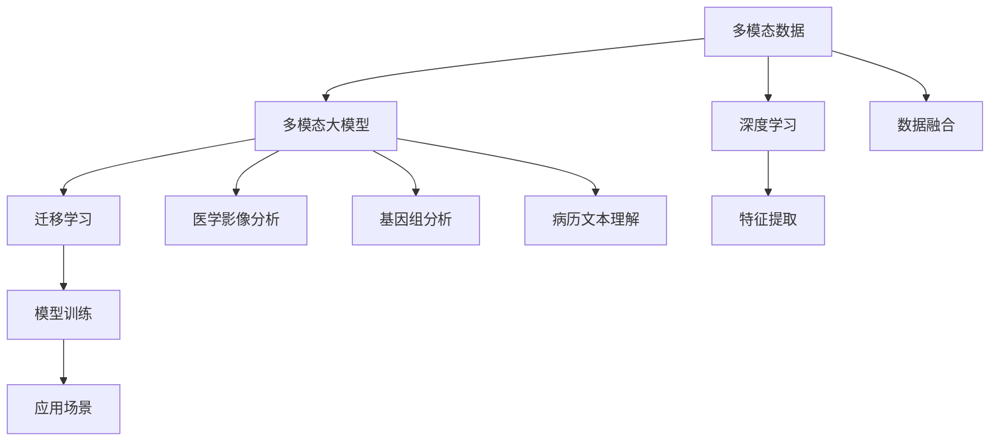

                 

# 多模态大模型：技术原理与实战 多模态大模型在医疗健康领域中的应用

## 1. 背景介绍

### 1.1 问题由来

随着人工智能技术的快速发展，多模态大模型（Multimodal Large Model）在医疗健康领域的应用前景日益广阔。传统的医疗诊断和治疗依赖于单一模态数据，如影像、基因、病历等，难以全面综合各种信息。而多模态大模型通过整合不同模态的数据，可以更全面地理解患者的健康状况，辅助医生进行更精确的诊断和治疗决策。

多模态大模型的核心思想是：利用深度学习模型整合不同类型的数据（如文本、图像、基因等），从中提取丰富的语义信息，辅助医疗决策。在具体应用中，可以应用于医学影像分析、基因组分析、病历文本理解等多个方面，为医疗健康领域的智能化发展提供强大的技术支持。

### 1.2 问题核心关键点

多模态大模型在医疗健康领域的应用核心关键点包括：
- **数据融合**：如何将不同模态的数据（如文本、图像、基因序列等）进行有效融合，提取综合性的健康信息。
- **特征提取**：如何通过深度学习模型提取各模态数据中的关键特征，以辅助诊断和治疗决策。
- **模型训练**：如何在大规模数据上训练多模态大模型，并优化模型的泛化能力。
- **应用场景**：如何将多模态大模型应用于实际的医疗健康任务，如疾病预测、病理分析、影像识别等。

## 2. 核心概念与联系

### 2.1 核心概念概述

为更好地理解多模态大模型在医疗健康领域的应用，本节将介绍几个密切相关的核心概念：

- **多模态数据**：指包含多种类型数据（如文本、图像、基因序列等）的综合数据集，可以提供更全面的健康信息。
- **深度学习**：通过构建深度神经网络模型，自动从数据中提取高层次的抽象特征，广泛应用于图像、语音、文本等领域的任务。
- **多模态大模型**：指结合深度学习和多模态数据，构建能够处理多种数据类型的模型，如Transformer、BERT、GPT等。
- **迁移学习**：指在预训练模型基础上，针对具体任务进行微调，以提高模型在特定领域的应用效果。
- **医学影像分析**：通过多模态大模型对医学影像进行分析，识别病变部位、评估病情严重程度等。
- **基因组分析**：利用多模态大模型对基因序列进行分析，识别疾病相关基因、预测遗传疾病风险等。
- **病历文本理解**：通过多模态大模型对病历文本进行理解，提取关键信息，辅助诊断和治疗决策。

这些核心概念之间的逻辑关系可以通过以下Mermaid流程图来展示：



这个流程图展示了大模型和应用场景的关系：

1. 多模态数据通过深度学习模型进行融合。
2. 融合后的数据通过多模态大模型进行特征提取和表示。
3. 模型在迁移学习中进行微调，以适应具体任务。
4. 微调后的模型应用于医学影像分析、基因组分析、病历文本理解等多个场景。

## 3. 核心算法原理 & 具体操作步骤
### 3.1 算法原理概述

多模态大模型在医疗健康领域的应用，主要基于迁移学习的范式。其核心思想是：将通用预训练的大模型（如BERT、GPT等）视作强大的特征提取器，通过在特定任务（如医学影像、基因组数据、病历文本等）上的微调，使得模型能够提取任务相关的特征，从而辅助医疗诊断和治疗。

具体来说，假设预训练模型为 $M_{\theta}$，其中 $\theta$ 为预训练得到的模型参数。给定医疗健康领域的任务 $T$ 的标注数据集 $D=\{(x_i, y_i)\}_{i=1}^N$，其中 $x_i$ 为输入数据（如影像、基因序列、病历文本等），$y_i$ 为对应的标注信息（如病变部位、疾病标签等）。多模态大模型的应用目标是通过在任务 $T$ 上的微调，更新模型参数 $\hat{\theta}$，使得模型能够更好地适应任务 $T$ 的特征，从而提升任务的预测性能。

### 3.2 算法步骤详解

多模态大模型的具体应用步骤如下：

**Step 1: 准备预训练模型和数据集**
- 选择合适的预训练多模态大模型 $M_{\theta}$ 作为初始化参数，如BERT、GPT等。
- 准备医疗健康领域的标注数据集 $D$，划分为训练集、验证集和测试集。一般要求标注数据与预训练数据的分布不要差异过大。

**Step 2: 数据融合与特征提取**
- 根据具体任务类型，选择合适的数据融合方式，将不同模态的数据进行预处理，使其能够输入到模型中进行处理。
- 利用预训练模型 $M_{\theta}$ 对融合后的数据进行特征提取，生成高层次的语义表示。

**Step 3: 任务适配层设计**
- 根据任务类型，在预训练模型顶层设计合适的输出层和损失函数。
- 对于分类任务，通常在顶层添加线性分类器和交叉熵损失函数。
- 对于生成任务，通常使用语言模型的解码器输出概率分布，并以负对数似然为损失函数。

**Step 4: 设置微调超参数**
- 选择合适的优化算法及其参数，如 AdamW、SGD 等，设置学习率、批大小、迭代轮数等。
- 设置正则化技术及强度，包括权重衰减、Dropout、Early Stopping等。
- 确定冻结预训练参数的策略，如仅微调顶层，或全部参数都参与微调。

**Step 5: 执行梯度训练**
- 将训练集数据分批次输入模型，前向传播计算损失函数。
- 反向传播计算参数梯度，根据设定的优化算法和学习率更新模型参数。
- 周期性在验证集上评估模型性能，根据性能指标决定是否触发 Early Stopping。
- 重复上述步骤直到满足预设的迭代轮数或 Early Stopping 条件。

**Step 6: 测试和部署**
- 在测试集上评估微调后模型 $M_{\hat{\theta}}$ 的性能，对比微调前后的精度提升。
- 使用微调后的模型对新样本进行推理预测，集成到实际的应用系统中。
- 持续收集新的数据，定期重新微调模型，以适应数据分布的变化。

### 3.3 算法优缺点

多模态大模型在医疗健康领域的应用，具有以下优点：
1. **综合性强**：通过整合多种模态数据，可以提供更全面的健康信息，辅助更精确的诊断和治疗决策。
2. **泛化能力强**：预训练模型已经在大规模无标签数据上进行预训练，具备较强的泛化能力，能够在特定任务上快速提升性能。
3. **扩展性好**：多模态大模型可以针对不同类型的任务进行微调，具有很好的灵活性。
4. **应用广泛**：可以应用于医学影像分析、基因组分析、病历文本理解等多个领域，提升医疗服务的智能化水平。

同时，该方法也存在一些局限性：
1. **标注成本高**：医疗健康领域的标注数据获取难度大，成本高，数据质量和数量难以保证。
2. **模型复杂度高**：多模态大模型参数量巨大，训练和推理计算资源需求高。
3. **数据融合难**：不同模态数据格式和特征差异较大，数据融合和特征提取较为复杂。
4. **伦理风险**：医疗数据涉及隐私和安全，如何在保障数据隐私和安全的前提下，合理应用多模态大模型，仍需进一步探索。

尽管存在这些局限性，但就目前而言，多模态大模型在医疗健康领域的应用仍具有广阔的前景，未来相关研究的重点在于如何进一步降低数据获取成本，提高模型的泛化能力和计算效率，同时兼顾数据隐私和安全。

### 3.4 算法应用领域

多模态大模型在医疗健康领域的应用主要涉及以下几个方面：

- **医学影像分析**：通过多模态大模型对医学影像进行分析和诊断，如X光、CT、MRI等。
- **基因组分析**：利用多模态大模型对基因序列进行分析，如DNA测序、基因表达等。
- **病历文本理解**：通过多模态大模型对病历文本进行理解，提取关键信息，辅助诊断和治疗决策。
- **病理分析**：通过多模态大模型对病理切片进行分析和诊断，评估病情严重程度。
- **药物发现**：利用多模态大模型对药物分子进行分析和预测，辅助新药开发和筛选。
- **个性化医疗**：通过多模态大模型对患者数据进行综合分析，提供个性化的诊疗方案。

这些应用场景展示了多模态大模型在医疗健康领域的强大潜力，能够为患者提供更全面、精准的医疗服务。

## 4. 数学模型和公式 & 详细讲解  
### 4.1 数学模型构建

本节将使用数学语言对多模态大模型在医疗健康领域的应用过程进行更加严格的刻画。

记多模态数据集为 $D=\{(x_i, y_i)\}_{i=1}^N$，其中 $x_i$ 为输入数据（如影像、基因序列、病历文本等），$y_i$ 为对应的标注信息（如病变部位、疾病标签等）。

定义多模态大模型 $M_{\theta}$ 在输入数据 $x_i$ 上的特征提取函数为 $f(x_i)$，输出层为 $g$，则模型在数据集 $D$ 上的经验风险为：

$$
\mathcal{L}(\theta) = \frac{1}{N}\sum_{i=1}^N \ell(g(f(x_i)),y_i)
$$

其中 $\ell$ 为任务特定的损失函数，如交叉熵损失、均方误差损失等。

### 4.2 公式推导过程

以医学影像分析为例，假设预训练模型为 $M_{\theta}$，输入数据 $x_i$ 为医学影像，输出 $y_i$ 为病变部位。

多模态大模型的特征提取过程如下：
1. 将医学影像 $x_i$ 进行预处理和分割，生成多个子影像 $x_i^1, x_i^2, ..., x_i^k$。
2. 利用预训练模型 $M_{\theta}$ 对每个子影像进行特征提取，得到多模态特征表示 $f(x_i)=[f(x_i)^1, f(x_i)^2, ..., f(x_i)^k]$。
3. 将多模态特征表示 $f(x_i)$ 输入到任务适配层 $g$，生成最终的输出 $g(f(x_i))$，用于评估病变部位的概率分布。

数学上，假设 $f(x_i)$ 的维度为 $d$，任务适配层的输出维度为 $m$，则特征提取和输出的数学公式如下：

$$
f(x_i) = M_{\theta}(x_i^1, x_i^2, ..., x_i^k)
$$

$$
g(f(x_i)) = g_W [W_1 f(x_i)^1 + W_2 f(x_i)^2 + ... + W_k f(x_i)^k] + b
$$

其中 $W_1, W_2, ..., W_k$ 为任务适配层的权重矩阵，$b$ 为偏置向量。

### 4.3 案例分析与讲解

以下以基因组分析为例，展示多模态大模型在医疗健康领域的应用。

假设基因组数据为 $D=\{(x_i, y_i)\}_{i=1}^N$，其中 $x_i$ 为基因序列，$y_i$ 为对应的疾病标签。

多模态大模型的特征提取过程如下：
1. 将基因序列 $x_i$ 进行预处理和分割，生成多个子序列 $x_i^1, x_i^2, ..., x_i^k$。
2. 利用预训练模型 $M_{\theta}$ 对每个子序列进行特征提取，得到多模态特征表示 $f(x_i)=[f(x_i)^1, f(x_i)^2, ..., f(x_i)^k]$。
3. 将多模态特征表示 $f(x_i)$ 输入到任务适配层 $g$，生成最终的输出 $g(f(x_i))$，用于评估疾病风险的概率分布。

数学上，假设 $f(x_i)$ 的维度为 $d$，任务适配层的输出维度为 $m$，则特征提取和输出的数学公式如下：

$$
f(x_i) = M_{\theta}(x_i^1, x_i^2, ..., x_i^k)
$$

$$
g(f(x_i)) = g_W [W_1 f(x_i)^1 + W_2 f(x_i)^2 + ... + W_k f(x_i)^k] + b
$$

其中 $W_1, W_2, ..., W_k$ 为任务适配层的权重矩阵，$b$ 为偏置向量。

## 5. 项目实践：代码实例和详细解释说明
### 5.1 开发环境搭建

在进行多模态大模型实践前，我们需要准备好开发环境。以下是使用Python进行PyTorch开发的环境配置流程：

1. 安装Anaconda：从官网下载并安装Anaconda，用于创建独立的Python环境。

2. 创建并激活虚拟环境：
```bash
conda create -n pytorch-env python=3.8 
conda activate pytorch-env
```

3. 安装PyTorch：根据CUDA版本，从官网获取对应的安装命令。例如：
```bash
conda install pytorch torchvision torchaudio cudatoolkit=11.1 -c pytorch -c conda-forge
```

4. 安装Transformers库：
```bash
pip install transformers
```

5. 安装各类工具包：
```bash
pip install numpy pandas scikit-learn matplotlib tqdm jupyter notebook ipython
```

完成上述步骤后，即可在`pytorch-env`环境中开始多模态大模型的实践。

### 5.2 源代码详细实现

下面我们以基因组分析任务为例，给出使用Transformers库对BERT模型进行微调的PyTorch代码实现。

首先，定义基因组分析任务的数据处理函数：

```python
from transformers import BertTokenizer
from torch.utils.data import Dataset
import torch

class GenomicDataset(Dataset):
    def __init__(self, sequences, labels, tokenizer, max_len=128):
        self.sequences = sequences
        self.labels = labels
        self.tokenizer = tokenizer
        self.max_len = max_len
        
    def __len__(self):
        return len(self.sequences)
    
    def __getitem__(self, item):
        sequence = self.sequences[item]
        label = self.labels[item]
        
        encoding = self.tokenizer(sequence, return_tensors='pt', max_length=self.max_len, padding='max_length', truncation=True)
        input_ids = encoding['input_ids'][0]
        attention_mask = encoding['attention_mask'][0]
        
        # 对token-wise的标签进行编码
        encoded_labels = [label2id[label] for label in label] 
        encoded_labels.extend([label2id['O']] * (self.max_len - len(encoded_labels)))
        labels = torch.tensor(encoded_labels, dtype=torch.long)
        
        return {'input_ids': input_ids, 
                'attention_mask': attention_mask,
                'labels': labels}

# 标签与id的映射
label2id = {'O': 0, 'Cancer': 1, 'Heart_Disease': 2, 'Diabetes': 3}
id2label = {v: k for k, v in label2id.items()}

# 创建dataset
tokenizer = BertTokenizer.from_pretrained('bert-base-cased')

train_dataset = GenomicDataset(train_sequences, train_labels, tokenizer)
dev_dataset = GenomicDataset(dev_sequences, dev_labels, tokenizer)
test_dataset = GenomicDataset(test_sequences, test_labels, tokenizer)
```

然后，定义模型和优化器：

```python
from transformers import BertForTokenClassification, AdamW

model = BertForTokenClassification.from_pretrained('bert-base-cased', num_labels=len(label2id))

optimizer = AdamW(model.parameters(), lr=2e-5)
```

接着，定义训练和评估函数：

```python
from torch.utils.data import DataLoader
from tqdm import tqdm
from sklearn.metrics import classification_report

device = torch.device('cuda') if torch.cuda.is_available() else torch.device('cpu')
model.to(device)

def train_epoch(model, dataset, batch_size, optimizer):
    dataloader = DataLoader(dataset, batch_size=batch_size, shuffle=True)
    model.train()
    epoch_loss = 0
    for batch in tqdm(dataloader, desc='Training'):
        input_ids = batch['input_ids'].to(device)
        attention_mask = batch['attention_mask'].to(device)
        labels = batch['labels'].to(device)
        model.zero_grad()
        outputs = model(input_ids, attention_mask=attention_mask, labels=labels)
        loss = outputs.loss
        epoch_loss += loss.item()
        loss.backward()
        optimizer.step()
    return epoch_loss / len(dataloader)

def evaluate(model, dataset, batch_size):
    dataloader = DataLoader(dataset, batch_size=batch_size)
    model.eval()
    preds, labels = [], []
    with torch.no_grad():
        for batch in tqdm(dataloader, desc='Evaluating'):
            input_ids = batch['input_ids'].to(device)
            attention_mask = batch['attention_mask'].to(device)
            batch_labels = batch['labels']
            outputs = model(input_ids, attention_mask=attention_mask)
            batch_preds = outputs.logits.argmax(dim=2).to('cpu').tolist()
            batch_labels = batch_labels.to('cpu').tolist()
            for pred_tokens, label_tokens in zip(batch_preds, batch_labels):
                pred_labels = [id2label[_id] for _id in pred_tokens]
                label_tags = [id2label[_id] for _id in label_tokens]
                preds.append(pred_labels[:len(label_tokens)])
                labels.append(label_tags)
                
    print(classification_report(labels, preds))
```

最后，启动训练流程并在测试集上评估：

```python
epochs = 5
batch_size = 16

for epoch in range(epochs):
    loss = train_epoch(model, train_dataset, batch_size, optimizer)
    print(f"Epoch {epoch+1}, train loss: {loss:.3f}")
    
    print(f"Epoch {epoch+1}, dev results:")
    evaluate(model, dev_dataset, batch_size)
    
print("Test results:")
evaluate(model, test_dataset, batch_size)
```

以上就是使用PyTorch对BERT进行基因组分析任务微调的完整代码实现。可以看到，得益于Transformers库的强大封装，我们可以用相对简洁的代码完成BERT模型的加载和微调。

### 5.3 代码解读与分析

让我们再详细解读一下关键代码的实现细节：

**GenomicDataset类**：
- `__init__`方法：初始化序列、标签、分词器等关键组件。
- `__len__`方法：返回数据集的样本数量。
- `__getitem__`方法：对单个样本进行处理，将序列输入编码为token ids，将标签编码为数字，并对其进行定长padding，最终返回模型所需的输入。

**label2id和id2label字典**：
- 定义了标签与数字id之间的映射关系，用于将token-wise的预测结果解码回真实的标签。

**训练和评估函数**：
- 使用PyTorch的DataLoader对数据集进行批次化加载，供模型训练和推理使用。
- 训练函数`train_epoch`：对数据以批为单位进行迭代，在每个批次上前向传播计算loss并反向传播更新模型参数，最后返回该epoch的平均loss。
- 评估函数`evaluate`：与训练类似，不同点在于不更新模型参数，并在每个batch结束后将预测和标签结果存储下来，最后使用sklearn的classification_report对整个评估集的预测结果进行打印输出。

**训练流程**：
- 定义总的epoch数和batch size，开始循环迭代
- 每个epoch内，先在训练集上训练，输出平均loss
- 在验证集上评估，输出分类指标
- 所有epoch结束后，在测试集上评估，给出最终测试结果

可以看到，PyTorch配合Transformers库使得BERT微调的代码实现变得简洁高效。开发者可以将更多精力放在数据处理、模型改进等高层逻辑上，而不必过多关注底层的实现细节。

当然，工业级的系统实现还需考虑更多因素，如模型的保存和部署、超参数的自动搜索、更灵活的任务适配层等。但核心的微调范式基本与此类似。

## 6. 实际应用场景
### 6.1 智能医疗系统

基于多模态大模型的智能医疗系统，可以广泛应用于疾病的诊断和治疗决策。传统的医疗诊断往往依赖于医生的人工经验，效率低且准确性难以保证。而使用多模态大模型，可以整合多种医疗数据（如医学影像、基因组数据、病历文本等），辅助医生进行更精确的诊断和治疗。

在技术实现上，可以收集患者的影像数据、基因组数据、病历文本等多种类型的数据，将这些数据输入到多模态大模型中进行特征提取和融合。多模态大模型可以自动识别和分析病变部位、识别疾病风险等，辅助医生生成诊断和治疗方案。

### 6.2 基因组学研究

多模态大模型在基因组学研究中的应用，可以加速新药的发现和开发。传统的基因组学研究往往需要耗费大量人力和时间，通过多模态大模型可以整合基因序列、基因表达、蛋白结构等多种数据，快速识别与疾病相关的基因，预测基因突变对疾病的影响，从而加速新药的筛选和验证。

具体而言，可以收集各类基因组数据，输入到多模态大模型中进行特征提取和分析。多模态大模型可以自动识别和预测与疾病相关的基因，提供候选药物靶点，辅助药物设计和开发。同时，多模态大模型还可以对不同药物分子的作用机制进行模拟和预测，评估药物的疗效和安全性。

### 6.3 健康监测和预防

多模态大模型在健康监测和预防中的应用，可以提升公共卫生管理的智能化水平。传统的公共卫生管理往往依赖于人工监测，效率低且覆盖面有限。而使用多模态大模型，可以整合多种类型的数据（如地理、气候、行为等），预测疾病流行趋势，提供个性化健康管理建议，从而提升公共卫生管理的效率和效果。

具体而言，可以收集多种类型的数据，输入到多模态大模型中进行分析和预测。多模态大模型可以预测疾病的传播趋势，提供个性化健康管理建议，辅助公共卫生决策和政策制定。同时，多模态大模型还可以对各类健康数据进行异常检测，及时发现和预警公共卫生风险。

### 6.4 未来应用展望

随着多模态大模型和微调方法的不断发展，其在医疗健康领域的应用前景将更加广阔。未来，多模态大模型将能够更好地整合多种类型的数据，提升诊断和治疗的准确性和效率，推动医疗服务的智能化发展。

在智慧医疗领域，多模态大模型将广泛应用于疾病预测、病理分析、影像识别等环节，提升医疗服务的智能化水平。

在基因组学研究领域，多模态大模型将加速新药的发现和开发，推动医学研究的进步。

在健康监测和预防领域，多模态大模型将提升公共卫生管理的智能化水平，提升公共卫生管理的效率和效果。

此外，在智能诊断、个性化治疗、智能康复等更多领域，多模态大模型都将发挥重要作用，推动医疗健康领域的创新发展。相信随着技术的不断进步，多模态大模型将成为医疗健康领域的重要工具，为人类健康事业贡献力量。

## 7. 工具和资源推荐
### 7.1 学习资源推荐

为了帮助开发者系统掌握多模态大模型的理论基础和实践技巧，这里推荐一些优质的学习资源：

1. 《深度学习与医疗健康》系列博文：由大模型技术专家撰写，深入浅出地介绍了深度学习在医疗健康领域的应用，涵盖医学影像、基因组学、病历文本等多个方面。

2. CS229《机器学习》课程：斯坦福大学开设的机器学习明星课程，涵盖深度学习的基本概念和算法，适合初学者入门。

3. 《Multimodal Learning for Healthcare》书籍：全面介绍了多模态学习在医疗健康领域的应用，包括医学影像、基因组学、病历文本等多个方面。

4. Weights & Biases：模型训练的实验跟踪工具，可以记录和可视化模型训练过程中的各项指标，方便对比和调优。与主流深度学习框架无缝集成。

5. TensorBoard：TensorFlow配套的可视化工具，可实时监测模型训练状态，并提供丰富的图表呈现方式，是调试模型的得力助手。

通过对这些资源的学习实践，相信你一定能够快速掌握多模态大模型的精髓，并用于解决实际的医疗健康问题。
### 7.2 开发工具推荐

高效的开发离不开优秀的工具支持。以下是几款用于多模态大模型微调开发的常用工具：

1. PyTorch：基于Python的开源深度学习框架，灵活动态的计算图，适合快速迭代研究。大部分预训练语言模型都有PyTorch版本的实现。

2. TensorFlow：由Google主导开发的开源深度学习框架，生产部署方便，适合大规模工程应用。同样有丰富的预训练语言模型资源。

3. Transformers库：HuggingFace开发的NLP工具库，集成了众多SOTA语言模型，支持PyTorch和TensorFlow，是进行多模态大模型微调开发的利器。

4. Weights & Biases：模型训练的实验跟踪工具，可以记录和可视化模型训练过程中的各项指标，方便对比和调优。与主流深度学习框架无缝集成。

5. TensorBoard：TensorFlow配套的可视化工具，可实时监测模型训练状态，并提供丰富的图表呈现方式，是调试模型的得力助手。

6. Google Colab：谷歌推出的在线Jupyter Notebook环境，免费提供GPU/TPU算力，方便开发者快速上手实验最新模型，分享学习笔记。

合理利用这些工具，可以显著提升多模态大模型微调任务的开发效率，加快创新迭代的步伐。

### 7.3 相关论文推荐

多模态大模型和微调技术的发展源于学界的持续研究。以下是几篇奠基性的相关论文，推荐阅读：

1. Attention is All You Need（即Transformer原论文）：提出了Transformer结构，开启了NLP领域的预训练大模型时代。

2. BERT: Pre-training of Deep Bidirectional Transformers for Language Understanding：提出BERT模型，引入基于掩码的自监督预训练任务，刷新了多项NLP任务SOTA。

3. MLP-Mix: Improving Multimodal Learning by Decoupling Modalities: A Multimodal Predictive Coding Perspective：提出MLP-Mix模型，通过多模态预测编码，实现各模态数据的融合和协同表示。

4. Multimodal Attention Networks：提出MMAN模型，通过多模态注意力机制，实现各模态数据的融合和协同表示。

5. Knowledge-Augmented Multimodal Learning：提出KA-MAN模型，通过知识增强的多模态学习，提升多模态数据的信息整合能力。

这些论文代表了大模态大模型微调技术的发展脉络。通过学习这些前沿成果，可以帮助研究者把握学科前进方向，激发更多的创新灵感。

## 8. 总结：未来发展趋势与挑战

### 8.1 总结

本文对多模态大模型在医疗健康领域的应用进行了全面系统的介绍。首先阐述了多模态大模型和微调技术的背景和意义，明确了其在医疗健康领域的独特价值。其次，从原理到实践，详细讲解了多模态大模型的数学原理和关键步骤，给出了多模态大模型微调任务开发的完整代码实例。同时，本文还广泛探讨了多模态大模型在智能医疗、基因组学、健康监测等多个领域的应用前景，展示了多模态大模型在医疗健康领域的强大潜力。

通过本文的系统梳理，可以看到，多模态大模型在医疗健康领域的应用前景广阔，可以显著提升诊断和治疗的准确性和效率，推动医疗服务的智能化发展。未来，伴随多模态大模型和微调方法的持续演进，相信其在医疗健康领域的应用将更加广泛，为人类健康事业贡献更多力量。

### 8.2 未来发展趋势

展望未来，多模态大模型在医疗健康领域的应用将呈现以下几个发展趋势：

1. **数据融合技术进步**：随着数据采集和处理技术的进步，多模态数据的融合将更加高效，多模态大模型的训练和推理也将更加便捷。
2. **模型泛化能力提升**：预训练模型和微调方法的发展，将进一步提升多模态大模型的泛化能力，使其能够更好地适应不同的医疗健康任务。
3. **计算资源优化**：随着计算资源和算法的进步，多模态大模型的训练和推理将更加高效，资源占用和计算成本将大幅降低。
4. **跨模态协同学习**：未来将出现更多跨模态协同学习的方法，进一步提升多模态大模型的信息整合能力，增强其对复杂医疗健康问题的理解能力。
5. **多领域应用拓展**：多模态大模型将应用于更多医疗健康领域的任务，如个性化治疗、智能诊断、健康监测等，推动医疗服务的智能化发展。

以上趋势凸显了多模态大模型在医疗健康领域的巨大潜力。这些方向的探索发展，必将进一步提升多模态大模型在医疗健康领域的应用水平，为人类健康事业带来新的突破。

### 8.3 面临的挑战

尽管多模态大模型在医疗健康领域的应用已经取得了一定的进展，但在迈向更加智能化、普适化应用的过程中，仍面临诸多挑战：

1. **数据获取难度高**：医疗健康数据往往涉及隐私和伦理问题，数据获取难度大，成本高。
2. **数据质量参差不齐**：不同模态数据的格式和质量差异较大，数据融合和特征提取较为复杂。
3. **计算资源需求高**：多模态大模型的参数量巨大，训练和推理计算资源需求高。
4. **模型可解释性不足**：多模态大模型的决策过程较为复杂，可解释性不足，难以满足医疗健康领域的高要求。
5. **伦理风险高**：医疗健康数据的隐私和安全问题需要高度重视，如何在保障数据隐私和安全的前提下，合理应用多模态大模型，仍需进一步探索。

尽管存在这些挑战，但通过学术界和工业界的共同努力，相信多模态大模型在医疗健康领域的应用将不断取得突破，为人类健康事业贡献更多力量。

### 8.4 研究展望

未来，多模态大模型在医疗健康领域的研究方向包括：

1. **数据融合与特征提取**：开发更高效的数据融合和特征提取技术，提升多模态大模型的信息整合能力。
2. **模型泛化与优化**：探索更好的模型泛化方法和优化技术，提升多模态大模型的泛化能力和计算效率。
3. **跨模态协同学习**：探索更好的跨模态协同学习技术，进一步提升多模态大模型的信息整合能力。
4. **模型可解释性增强**：探索更好的模型可解释性技术，增强多模态大模型的决策过程的可解释性。
5. **伦理与隐私保护**：探索更好的伦理与隐私保护技术，保障数据的安全和隐私。

这些研究方向将引领多模态大模型在医疗健康领域的研究和应用，推动医疗健康领域的智能化发展。相信随着技术的不断进步，多模态大模型将更好地服务于人类健康事业，提升医疗服务的智能化水平。

## 9. 附录：常见问题与解答

**Q1：多模态大模型与传统单模态模型有何不同？**

A: 多模态大模型与传统单模态模型的主要区别在于其能够整合多种类型的数据（如文本、图像、基因序列等），从而提供更全面的健康信息。传统单模态模型只能处理单一类型的数据，信息整合能力有限，无法充分利用多种类型的数据。多模态大模型通过深度学习技术，能够自动提取各模态数据的特征，进行综合分析和决策。

**Q2：多模态大模型的训练和推理效率如何？**

A: 多模态大模型的训练和推理效率取决于其参数量和计算资源。由于多模态大模型通常包含大规模的参数，训练和推理计算资源需求高，尤其是在计算资源受限的情况下，需要采用模型压缩、稀疏化等技术进行优化。同时，一些先进的模型结构和算法，如知识增强、跨模态协同学习等，也可以进一步提升多模态大模型的训练和推理效率。

**Q3：多模态大模型在医疗健康领域的应用前景如何？**

A: 多模态大模型在医疗健康领域具有广阔的应用前景。通过整合多种类型的数据，可以提供更全面的健康信息，提升诊断和治疗的准确性和效率。在疾病预测、病理分析、影像识别等任务上，多模态大模型已经展示了强大的应用潜力。未来，随着技术的发展和应用的推广，多模态大模型将更加广泛应用于医疗健康领域，推动医疗服务的智能化发展。

**Q4：多模态大模型的可解释性问题如何解决？**

A: 多模态大模型的可解释性问题是一个重要研究方向。目前，一些基于符号化表示和因果推理的方法被引入多模态大模型，增强了其决策过程的可解释性。例如，通过引入知识图谱和逻辑规则，对多模态大模型的输出进行解释和验证。同时，结合因果分析和博弈论工具，探索更好的决策过程可解释性技术，将进一步增强多模态大模型的可解释性。

**Q5：多模态大模型在隐私和安全方面的挑战有哪些？**

A: 多模态大模型在隐私和安全方面的挑战主要包括数据隐私保护和模型安全性。数据隐私保护问题主要体现在数据获取和存储过程中，需要采取数据加密、匿名化等技术手段，保障数据的隐私和安全。模型安全性问题则关注模型在推理过程中的鲁棒性和抗干扰能力，需要通过对抗训练、模型蒸馏等技术手段，增强模型的鲁棒性和安全性。

通过这些措施，可以更好地应对多模态大模型在隐私和安全方面的挑战，保障其在医疗健康领域的应用安全。

