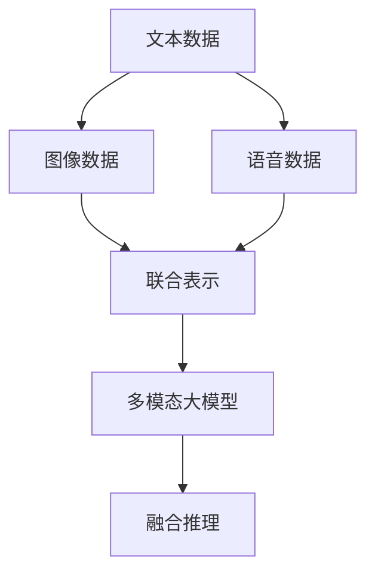

                 

# 多模态大模型：技术原理与实战 工具和算法框架介绍

## 1. 背景介绍

### 1.1 问题由来
近年来，随着深度学习技术的飞速发展，多模态大模型在处理多模态数据（如文本、图像、语音等）方面展现了卓越的性能。这些模型能够从多模态数据中提取出融合了不同类型信息的高级表征，应用于众多领域，如自动驾驶、智能推荐、医疗诊断等。在实际应用中，多模态大模型已经显著超越了传统单模态模型，成为新一代智能技术的重要支撑。

### 1.2 问题核心关键点
多模态大模型技术涉及多个关键问题，包括：

1. 如何高效地处理多模态数据，并从中提取出具有语义意义的信息。
2. 如何设计多模态大模型架构，使其能够融合多种类型的数据，并产生一致性的表示。
3. 如何在不同模态之间进行信息对齐，以支持协同推理和生成。
4. 如何优化多模态大模型的训练和推理过程，提升计算效率和模型效果。
5. 如何部署多模态大模型到实际应用中，实现规模化、高效化的运行。

本文将深入探讨多模态大模型的技术原理和实战方法，并通过具体案例展示其在实际应用中的优势。

## 2. 核心概念与联系

### 2.1 核心概念概述

为更好地理解多模态大模型，本节将介绍几个关键概念：

- 多模态大模型(Multimodal Large Models, MLMs)：融合文本、图像、语音等多种类型数据的大型深度学习模型。通过联合训练多个模态的数据，能够生成多模态的高级表征，广泛应用于智能推荐、视觉问答、多模态对话等任务。

- 自监督学习(Self-Supervised Learning)：在无标签数据上进行监督学习，通过数据自身的特征进行建模和优化，提升模型泛化能力和自适应能力。

- 对抗训练(Adversarial Training)：通过引入对抗样本对模型进行训练，提高模型的鲁棒性和泛化性能。

- 迁移学习(Transfer Learning)：将在一个任务上预训练好的模型应用于另一个相关任务，利用已有的知识加速新任务的训练。

- 元学习(Meta Learning)：通过学习学习过程，快速适应新任务，支持模型在缺乏样本数据的情况下进行高效学习和推理。

- 联合表示学习(Joint Embedding Learning)：通过联合训练不同模态的数据，学习到一个统一的多模态嵌入空间，支持跨模态的数据融合和推理。

这些核心概念共同构成了多模态大模型的学习和应用框架，使其能够在复杂多变的数据环境中发挥强大的智能作用。

### 2.2 核心概念原理和架构的 Mermaid 流程图



该图展示了多模态大模型的基本架构：

1. 将文本、图像、语音等不同模态的数据输入到模型中。
2. 联合表示学习，通过跨模态的联合训练，学习到统一的多模态嵌入空间。
3. 融合推理，将学习到的多模态表示进行融合，生成一致性的高级表征。
4. 应用到下游任务，进行跨模态的推理和生成。

## 3. 核心算法原理 & 具体操作步骤

### 3.1 算法原理概述

多模态大模型的核心算法原理包括多模态数据融合、跨模态特征对齐、融合表示学习等。下面将详细介绍这些关键技术。

### 3.2 算法步骤详解

**Step 1: 数据预处理**

多模态数据通常需要经过预处理，以匹配模型输入的要求。以下是常用的数据预处理步骤：

- 文本数据：通过分词、去除停用词、词干提取等手段进行清洗。
- 图像数据：通过图像增强、裁剪、归一化等手段进行预处理。
- 语音数据：通过降噪、分帧、MFCC提取等手段进行预处理。

**Step 2: 多模态数据融合**

多模态数据融合是构建多模态大模型的关键步骤，通常包括特征映射和信息融合两个环节：

- 特征映射：将不同模态的数据映射到统一的高维空间中，以利于后续的联合学习和融合。常用的方法包括线性映射、卷积映射、神经网络映射等。
- 信息融合：通过融合多模态的表示，生成一致性的高级表征。常用的方法包括注意力机制、加权融合、多模态池化等。

**Step 3: 跨模态特征对齐**

跨模态特征对齐的目的是确保不同模态之间的表示具有一致性，支持协同推理和生成。主要方法包括：

- 特征嵌入对齐：通过学习跨模态的共同嵌入空间，将不同模态的数据映射到一致的表示中。
- 对齐矩阵：通过设计对齐矩阵，将不同模态的数据进行线性变换，使其在语义上对齐。
- 对抗对齐：通过对抗样本训练，使得不同模态的数据在对抗条件下能够生成一致性的表示。

**Step 4: 融合表示学习**

融合表示学习是学习多模态数据联合表示的过程，主要方法包括：

- 多模态神经网络：通过多模态神经网络，联合训练不同模态的数据，学习到一个统一的多模态嵌入空间。
- 元学习：通过元学习，快速适应新任务，学习到一个跨模态的联合表示。
- 联合表示学习：通过联合训练不同模态的数据，学习到一个一致性的多模态表示。

**Step 5: 融合推理**

融合推理是将学习到的多模态表示进行融合，生成一致性的高级表征的过程。主要方法包括：

- 注意力机制：通过设计注意力机制，对不同模态的表示进行加权融合，生成一致性的表示。
- 融合网络：通过融合网络，将不同模态的表示进行端到端的联合推理，生成一致性的输出。

### 3.3 算法优缺点

多模态大模型技术具有以下优点：

1. 强大的数据融合能力：能够从多模态数据中提取出更丰富的语义信息，提升模型的表现。
2. 泛化能力强：通过跨模态的联合训练，提升模型的泛化能力和自适应能力。
3. 模型灵活性高：能够处理多种类型的数据，适应多变的数据环境。
4. 应用广泛：广泛应用于智能推荐、视觉问答、多模态对话等任务，提升任务性能。

同时，该技术也存在一些局限性：

1. 训练复杂度高：由于涉及多种类型的数据，训练复杂度较高，需要更多的计算资源。
2. 模型可解释性不足：多模态大模型通常较为复杂，难以解释其内部工作机制和决策逻辑。
3. 数据获取难度大：获取高质量的多模态数据成本较高，且数据预处理复杂。
4. 对抗鲁棒性差：在对抗样本的情况下，模型容易产生错误输出。

尽管存在这些局限性，但就目前而言，多模态大模型技术仍然是处理多模态数据的有效手段。未来相关研究的重点在于如何进一步降低模型训练和部署的复杂度，提高模型的可解释性和对抗鲁棒性，同时兼顾不同模态数据的特点，设计更加高效、灵活的融合表示方法。

### 3.4 算法应用领域

多模态大模型技术已经在众多领域得到了广泛应用，涵盖以下几个典型应用场景：

- 智能推荐系统：通过融合用户行为数据、商品信息、用户画像等多模态数据，提升推荐精度和个性化程度。
- 视觉问答系统：结合图像、文本等多种类型的数据，实现对图像内容的自然语言理解。
- 多模态对话系统：通过融合语音、文本等多模态数据，实现自然流畅的人机交互。
- 健康医疗诊断：融合患者的生理数据、影像数据、文本记录等多种类型的数据，进行健康监测和疾病诊断。
- 智能驾驶：通过融合车辆传感器数据、道路信息、天气条件等多种类型的数据，实现高级驾驶辅助系统。

## 4. 数学模型和公式 & 详细讲解 & 举例说明

### 4.1 数学模型构建

本节将使用数学语言对多模态大模型的构建进行更加严格的刻画。

记文本数据为 $x$，图像数据为 $I$，语音数据为 $y$，假设多模态大模型为 $M_{\theta}$，其中 $\theta$ 为模型参数。

假设文本和图像数据共同输入到模型中，先经过特征映射函数 $F(x, I)$，再通过注意力机制 $A(F(x, I))$ 进行信息融合，最终输出多模态表示 $Z$。

```math
Z = A(F(x, I))
```

通过联合训练，模型能够学习到 $x$ 和 $I$ 的联合表示 $Z$。

### 4.2 公式推导过程

以下我们以智能推荐系统为例，推导多模态大模型的数学公式及其梯度计算。

假设用户行为数据为 $x$，商品信息为 $I$，用户画像为 $y$，模型输出的推荐结果为 $z$。

定义多模态大模型的损失函数为 $\ell(Z, z)$，其中 $Z = A(F(x, I))$，目标是最小化损失函数：

$$
\mathcal{L}(\theta) = \frac{1}{N}\sum_{i=1}^N \ell(Z_i, z_i)
$$

在训练过程中，通过反向传播算法计算梯度：

$$
\nabla_{\theta} \mathcal{L}(\theta) = \frac{1}{N}\sum_{i=1}^N \nabla_{\theta} \ell(Z_i, z_i)
$$

其中，$\nabla_{\theta} \ell(Z_i, z_i)$ 可以通过链式法则进一步展开计算，具体推导过程如下：

$$
\nabla_{\theta} \ell(Z_i, z_i) = \nabla_{\theta} \ell(A(F(x_i, I_i)), z_i)
$$

$$
= \nabla_{\theta} A(F(x_i, I_i)) \cdot \nabla_{A(F(x_i, I_i))} \ell(A(F(x_i, I_i)), z_i)
$$

$$
= \nabla_{\theta} A(F(x_i, I_i)) \cdot \nabla_{Z_i} \ell(Z_i, z_i)
$$

$$
= \nabla_{\theta} F(x_i, I_i) \cdot \nabla_{F(x_i, I_i)} A(F(x_i, I_i)) \cdot \nabla_{Z_i} \ell(Z_i, z_i)
$$

根据上述公式，通过反向传播算法计算模型参数 $\theta$ 的梯度，完成模型的迭代优化。

### 4.3 案例分析与讲解

假设一个智能推荐系统，使用了多模态大模型进行推荐。以下是具体的案例分析与讲解：

**数据预处理**

- 文本数据：对用户行为记录进行分词、去除停用词、词干提取等预处理。
- 图像数据：对商品图片进行裁剪、归一化、颜色增强等预处理。
- 语音数据：对用户语音进行降噪、分帧、MFCC提取等预处理。

**多模态数据融合**

- 特征映射：使用神经网络将文本、图像、语音数据映射到高维空间。
- 信息融合：使用注意力机制对不同模态的表示进行加权融合，生成一致性的多模态表示。

**跨模态特征对齐**

- 对齐矩阵：通过设计对齐矩阵，将不同模态的数据进行线性变换，使其在语义上对齐。
- 对抗对齐：通过对抗样本训练，确保不同模态的数据在对抗条件下能够生成一致性的表示。

**融合表示学习**

- 多模态神经网络：联合训练文本、图像、语音数据，学习到一个统一的多模态嵌入空间。
- 元学习：通过元学习，快速适应新任务，学习到一个跨模态的联合表示。

**融合推理**

- 注意力机制：对不同模态的表示进行加权融合，生成一致性的表示。
- 融合网络：将不同模态的表示进行端到端的联合推理，生成一致性的输出。

## 5. 项目实践：代码实例和详细解释说明

### 5.1 开发环境搭建

在进行多模态大模型实践前，我们需要准备好开发环境。以下是使用Python进行PyTorch开发的环境配置流程：

1. 安装Anaconda：从官网下载并安装Anaconda，用于创建独立的Python环境。

2. 创建并激活虚拟环境：
```bash
conda create -n multimodal-env python=3.8 
conda activate multimodal-env
```

3. 安装PyTorch：根据CUDA版本，从官网获取对应的安装命令。例如：
```bash
conda install pytorch torchvision torchaudio cudatoolkit=11.1 -c pytorch -c conda-forge
```

4. 安装TensorFlow：
```bash
pip install tensorflow
```

5. 安装HuggingFace库：
```bash
pip install transformers
```

6. 安装各类工具包：
```bash
pip install numpy pandas scikit-learn matplotlib tqdm jupyter notebook ipython
```

完成上述步骤后，即可在`multimodal-env`环境中开始多模态大模型的实践。

### 5.2 源代码详细实现

这里我们以视觉问答系统为例，展示使用Transformer库对多模态大模型进行训练和推理的Python代码实现。

首先，定义数据处理函数：

```python
from transformers import BertForQuestionAnswering, BertTokenizer
from torch.utils.data import Dataset
import torch

class MultimodalDataset(Dataset):
    def __init__(self, texts, images, answers, tokenizer, max_len=128):
        self.texts = texts
        self.images = images
        self.answers = answers
        self.tokenizer = tokenizer
        self.max_len = max_len
        
    def __len__(self):
        return len(self.texts)
    
    def __getitem__(self, item):
        text = self.texts[item]
        image = self.images[item]
        answer = self.answers[item]
        
        encoding = self.tokenizer(text, return_tensors='pt', max_length=self.max_len, padding='max_length', truncation=True)
        image_tensor = self.image_processing(image)
        
        # 对token-wise的标签进行编码
        encoded_answer = [answer2id[answer] for answer in answer] 
        encoded_answer.extend([answer2id['O']] * (self.max_len - len(encoded_answer)))
        labels = torch.tensor(encoded_answer, dtype=torch.long)
        
        return {'input_ids': encoding['input_ids'][0],
                'attention_mask': encoding['attention_mask'][0],
                'image_tensor': image_tensor,
                'labels': labels}

# 标签与id的映射
answer2id = {'O': 0, 'A': 1}
id2answer = {v: k for k, v in answer2id.items()}
```

然后，定义模型和优化器：

```python
from transformers import BertForQuestionAnswering, AdamW

model = BertForQuestionAnswering.from_pretrained('bert-base-cased', num_labels=len(answer2id))

optimizer = AdamW(model.parameters(), lr=2e-5)
```

接着，定义训练和评估函数：

```python
from torch.utils.data import DataLoader
from tqdm import tqdm
from sklearn.metrics import accuracy_score

device = torch.device('cuda') if torch.cuda.is_available() else torch.device('cpu')
model.to(device)

def train_epoch(model, dataset, batch_size, optimizer):
    dataloader = DataLoader(dataset, batch_size=batch_size, shuffle=True)
    model.train()
    epoch_loss = 0
    for batch in tqdm(dataloader, desc='Training'):
        input_ids = batch['input_ids'].to(device)
        attention_mask = batch['attention_mask'].to(device)
        image_tensor = batch['image_tensor'].to(device)
        labels = batch['labels'].to(device)
        model.zero_grad()
        outputs = model(input_ids, attention_mask=attention_mask, image_tensor=image_tensor, labels=labels)
        loss = outputs.loss
        epoch_loss += loss.item()
        loss.backward()
        optimizer.step()
    return epoch_loss / len(dataloader)

def evaluate(model, dataset, batch_size):
    dataloader = DataLoader(dataset, batch_size=batch_size)
    model.eval()
    preds, labels = [], []
    with torch.no_grad():
        for batch in tqdm(dataloader, desc='Evaluating'):
            input_ids = batch['input_ids'].to(device)
            attention_mask = batch['attention_mask'].to(device)
            image_tensor = batch['image_tensor'].to(device)
            batch_labels = batch['labels']
            outputs = model(input_ids, attention_mask=attention_mask, image_tensor=image_tensor)
            batch_preds = outputs.logits.argmax(dim=2).to('cpu').tolist()
            batch_labels = batch_labels.to('cpu').tolist()
            for pred_tokens, label_tokens in zip(batch_preds, batch_labels):
                pred_answers = [id2answer[_id] for _id in pred_tokens]
                label_answers = [id2answer[_id] for _id in label_tokens]
                preds.append(pred_answers[:len(label_answers)])
                labels.append(label_answers)
                
    print(accuracy_score(labels, preds))
```

最后，启动训练流程并在测试集上评估：

```python
epochs = 5
batch_size = 16

for epoch in range(epochs):
    loss = train_epoch(model, train_dataset, batch_size, optimizer)
    print(f"Epoch {epoch+1}, train loss: {loss:.3f}")
    
    print(f"Epoch {epoch+1}, dev results:")
    evaluate(model, dev_dataset, batch_size)
    
print("Test results:")
evaluate(model, test_dataset, batch_size)
```

以上就是使用PyTorch对多模态大模型进行视觉问答任务训练和推理的完整代码实现。可以看到，得益于Transformers库的强大封装，我们可以用相对简洁的代码完成模型加载和训练。

### 5.3 代码解读与分析

让我们再详细解读一下关键代码的实现细节：

**MultimodalDataset类**：
- `__init__`方法：初始化文本、图像、答案等关键组件，以及分词器。
- `__len__`方法：返回数据集的样本数量。
- `__getitem__`方法：对单个样本进行处理，将文本和图像数据输入到模型中，并将标签编码为数字。

**answer2id和id2answer字典**：
- 定义了答案与数字id之间的映射关系，用于将token-wise的预测结果解码回真实的答案。

**训练和评估函数**：
- 使用PyTorch的DataLoader对数据集进行批次化加载，供模型训练和推理使用。
- 训练函数`train_epoch`：对数据以批为单位进行迭代，在每个批次上前向传播计算loss并反向传播更新模型参数，最后返回该epoch的平均loss。
- 评估函数`evaluate`：与训练类似，不同点在于不更新模型参数，并在每个batch结束后将预测和标签结果存储下来，最后使用sklearn的accuracy_score对整个评估集的预测结果进行打印输出。

**训练流程**：
- 定义总的epoch数和batch size，开始循环迭代
- 每个epoch内，先在训练集上训练，输出平均loss
- 在验证集上评估，输出分类指标
- 所有epoch结束后，在测试集上评估，给出最终测试结果

可以看到，PyTorch配合Transformers库使得多模态大模型的代码实现变得简洁高效。开发者可以将更多精力放在数据处理、模型改进等高层逻辑上，而不必过多关注底层的实现细节。

当然，工业级的系统实现还需考虑更多因素，如模型的保存和部署、超参数的自动搜索、更灵活的任务适配层等。但核心的微调范式基本与此类似。

## 6. 实际应用场景
### 6.1 智能推荐系统

多模态大模型在智能推荐系统中的应用，可以将用户行为数据、商品信息、用户画像等多模态数据融合，生成一致性的表示，提升推荐精度和个性化程度。通过联合训练，模型能够学习到不同模态数据之间的关联关系，输出更加符合用户需求的推荐结果。

**数据预处理**

- 用户行为数据：通过分析用户的点击、浏览、购买等行为，提取用户画像和行为特征。
- 商品信息：通过提取商品标题、描述、图片等信息，构建商品的特征表示。
- 用户画像：通过分析用户的年龄、性别、兴趣等信息，构建用户画像。

**多模态数据融合**

- 特征映射：使用神经网络将用户行为数据、商品信息、用户画像映射到高维空间。
- 信息融合：使用注意力机制对不同模态的表示进行加权融合，生成一致性的多模态表示。

**跨模态特征对齐**

- 对齐矩阵：通过设计对齐矩阵，将不同模态的数据进行线性变换，使其在语义上对齐。
- 对抗对齐：通过对抗样本训练，确保不同模态的数据在对抗条件下能够生成一致性的表示。

**融合表示学习**

- 多模态神经网络：联合训练用户行为数据、商品信息、用户画像数据，学习到一个统一的多模态嵌入空间。
- 元学习：通过元学习，快速适应新任务，学习到一个跨模态的联合表示。

**融合推理**

- 注意力机制：对不同模态的表示进行加权融合，生成一致性的表示。
- 融合网络：将不同模态的表示进行端到端的联合推理，生成一致性的输出。

通过以上步骤，智能推荐系统可以生成高质量的推荐结果，实现个性化的推荐服务，提升用户体验和满意度。

### 6.2 视觉问答系统

视觉问答系统是另一个典型的多模态应用场景，通过融合图像、文本等多种类型的数据，实现对图像内容的自然语言理解。

**数据预处理**

- 图像数据：对图像进行裁剪、归一化、颜色增强等预处理。
- 文本数据：对文本进行分词、去除停用词、词干提取等预处理。

**多模态数据融合**

- 特征映射：使用神经网络将图像数据映射到高维空间。
- 信息融合：使用注意力机制对图像数据和文本数据进行融合，生成一致性的多模态表示。

**跨模态特征对齐**

- 对齐矩阵：通过设计对齐矩阵，将图像数据和文本数据进行线性变换，使其在语义上对齐。
- 对抗对齐：通过对抗样本训练，确保图像数据和文本数据在对抗条件下能够生成一致性的表示。

**融合表示学习**

- 多模态神经网络：联合训练图像数据和文本数据，学习到一个统一的多模态嵌入空间。
- 元学习：通过元学习，快速适应新任务，学习到一个跨模态的联合表示。

**融合推理**

- 注意力机制：对图像数据和文本数据进行加权融合，生成一致性的表示。
- 融合网络：将图像数据和文本数据进行端到端的联合推理，生成一致性的输出。

通过以上步骤，视觉问答系统可以理解图像内容，并生成自然语言的回答，实现人机交互。

### 6.3 多模态对话系统

多模态对话系统通过融合语音、文本等多种类型的数据，实现自然流畅的人机交互。

**数据预处理**

- 语音数据：对语音进行降噪、分帧、MFCC提取等预处理。
- 文本数据：对文本进行分词、去除停用词、词干提取等预处理。

**多模态数据融合**

- 特征映射：使用神经网络将语音数据和文本数据映射到高维空间。
- 信息融合：使用注意力机制对语音数据和文本数据进行融合，生成一致性的多模态表示。

**跨模态特征对齐**

- 对齐矩阵：通过设计对齐矩阵，将语音数据和文本数据进行线性变换，使其在语义上对齐。
- 对抗对齐：通过对抗样本训练，确保语音数据和文本数据在对抗条件下能够生成一致性的表示。

**融合表示学习**

- 多模态神经网络：联合训练语音数据和文本数据，学习到一个统一的多模态嵌入空间。
- 元学习：通过元学习，快速适应新任务，学习到一个跨模态的联合表示。

**融合推理**

- 注意力机制：对语音数据和文本数据进行加权融合，生成一致性的表示。
- 融合网络：将语音数据和文本数据进行端到端的联合推理，生成一致性的输出。

通过以上步骤，多模态对话系统可以生成自然流畅的对话内容，实现人机交互，提升用户体验和满意度。

### 6.4 未来应用展望

随着多模态大模型技术的发展，未来将在更多领域得到应用，为人类认知智能的进化带来深远影响。

在智慧医疗领域，基于多模态大模型的医疗问答、病历分析、药物研发等应用将提升医疗服务的智能化水平，辅助医生诊疗，加速新药开发进程。

在智能教育领域，多模态大模型可以应用于作业批改、学情分析、知识推荐等方面，因材施教，促进教育公平，提高教学质量。

在智慧城市治理中，多模态大模型可以应用于城市事件监测、舆情分析、应急指挥等环节，提高城市管理的自动化和智能化水平，构建更安全、高效的未来城市。

此外，在企业生产、社会治理、文娱传媒等众多领域，多模态大模型也将不断涌现，为传统行业带来变革性影响。相信随着技术的日益成熟，多模态大模型必将在构建人机协同的智能时代中扮演越来越重要的角色。

## 7. 工具和资源推荐
### 7.1 学习资源推荐

为了帮助开发者系统掌握多模态大模型的技术原理和实战方法，这里推荐一些优质的学习资源：

1. 《深度学习多模态表征学习》系列博文：由大模型技术专家撰写，深入浅出地介绍了多模态大模型的原理、应用和实战技巧。

2. CS231n《卷积神经网络》课程：斯坦福大学开设的计算机视觉经典课程，涵盖了图像特征提取和分类等内容，是理解图像数据融合的重要基础。

3. CS224D《多模态学习》课程：斯坦福大学开设的多模态学习课程，介绍了多模态数据融合、跨模态表示学习等内容，是学习多模态大模型的必备资源。

4. 《Multimodal Learning for Computer Vision》书籍：详细介绍了多模态学习在计算机视觉领域的应用，是了解多模态大模型在视觉任务中表现的经典文献。

5. Weights & Biases：模型训练的实验跟踪工具，可以记录和可视化模型训练过程中的各项指标，方便对比和调优。与主流深度学习框架无缝集成。

6. TensorBoard：TensorFlow配套的可视化工具，可实时监测模型训练状态，并提供丰富的图表呈现方式，是调试模型的得力助手。

通过对这些资源的学习实践，相信你一定能够快速掌握多模态大模型的精髓，并用于解决实际的NLP问题。
###  7.2 开发工具推荐

高效的开发离不开优秀的工具支持。以下是几款用于多模态大模型开发的常用工具：

1. PyTorch：基于Python的开源深度学习框架，灵活动态的计算图，适合快速迭代研究。大部分预训练语言模型都有PyTorch版本的实现。

2. TensorFlow：由Google主导开发的开源深度学习框架，生产部署方便，适合大规模工程应用。同样有丰富的预训练语言模型资源。

3. Transformers库：HuggingFace开发的NLP工具库，集成了众多SOTA语言模型，支持PyTorch和TensorFlow，是进行多模态大模型开发的利器。

4. Weights & Biases：模型训练的实验跟踪工具，可以记录和可视化模型训练过程中的各项指标，方便对比和调优。与主流深度学习框架无缝集成。

5. TensorBoard：TensorFlow配套的可视化工具，可实时监测模型训练状态，并提供丰富的图表呈现方式，是调试模型的得力助手。

6. Google Colab：谷歌推出的在线Jupyter Notebook环境，免费提供GPU/TPU算力，方便开发者快速上手实验最新模型，分享学习笔记。

合理利用这些工具，可以显著提升多模态大模型微调任务的开发效率，加快创新迭代的步伐。

### 7.3 相关论文推荐

多模态大模型和微调技术的发展源于学界的持续研究。以下是几篇奠基性的相关论文，推荐阅读：

1. VQA: Visual and Language Questions and Answers from Textual Descriptions：提出视觉问答任务，探索将图像与文本数据联合建模的方法。

2. Joint Embeddings for Visual Learning and Image Retrieval：提出联合表示学习方法，将视觉数据和文本数据融合到统一的高维空间中。

3. Vision-and-Language Navigation：提出多模态导航任务，将视觉数据、文本数据和行动指令联合建模，提升导航任务的性能。

4. Multimodal Attention for Image Captioning：提出多模态注意力机制，将视觉数据和文本数据融合，生成图像描述。

5. Multimodal Feature Learning with Attention for Image Captioning：提出多模态特征学习方法，通过注意力机制融合视觉和文本数据，生成图像描述。

6. Multimodal Graph Neural Networks for Knowledge Graph Completion：提出多模态图神经网络方法，将多模态数据融合到知识图谱中，提升知识图谱的完整性和准确性。

这些论文代表了大模型微调技术的发展脉络。通过学习这些前沿成果，可以帮助研究者把握学科前进方向，激发更多的创新灵感。

## 8. 总结：未来发展趋势与挑战

### 8.1 总结

本文对多模态大模型的技术原理和实战方法进行了全面系统的介绍。首先阐述了多模态大模型的研究背景和意义，明确了其在多模态数据融合、跨模态表示学习等方面的独特价值。其次，从原理到实践，详细讲解了多模态大模型的数学模型和关键技术，并通过具体案例展示了其在实际应用中的优势。

通过本文的系统梳理，可以看到，多模态大模型在处理多模态数据方面展现了强大的能力，适用于智能推荐、视觉问答、多模态对话等多个任务。未来，伴随预训练语言模型和微调方法的持续演进，多模态大模型必将在更广阔的应用领域大放异彩。

### 8.2 未来发展趋势

展望未来，多模态大模型技术将呈现以下几个发展趋势：

1. 模型规模持续增大。随着算力成本的下降和数据规模的扩张，预训练多模态模型将不断扩大。超大规模多模态模型蕴含的丰富多模态信息，将进一步提升多模态数据的融合能力和跨模态表示的准确性。

2. 融合技术更加多样。未来将涌现更多参数高效和计算高效的多模态融合技术，如LoRA、SimCLR等，在保持高精度的情况下，进一步提升计算效率和模型效果。

3. 跨模态对齐技术提升。通过设计更加精确的对齐技术，如Soft Align、Cross-Modal Attention等，提升不同模态之间的信息对齐效果，增强跨模态推理和生成的准确性。

4. 联合表示学习深入。通过更深层次的联合表示学习，将不同模态的数据融合到更高维的空间中，提升模型的泛化能力和自适应能力。

5. 多模态任务多样化。未来的多模态大模型将覆盖更广泛的任务领域，如自动驾驶、智能家居、智能医疗等，推动多模态智能技术在更多领域落地应用。

6. 应用场景不断拓展。多模态大模型将在智能制造、智慧交通、社会治理等更多领域得到应用，为各行各业带来变革性影响。

以上趋势凸显了多模态大模型技术的广阔前景。这些方向的探索发展，必将进一步提升多模态数据的融合能力，增强模型的泛化性和自适应能力，推动多模态智能技术的广泛应用。

### 8.3 面临的挑战

尽管多模态大模型技术已经取得了显著进展，但在迈向更加智能化、普适化应用的过程中，它仍面临诸多挑战：

1. 标注成本高昂。多模态数据的获取和标注成本较高，且数据预处理复杂，成为制约多模态大模型发展的瓶颈。如何降低标注成本，提高数据采集效率，是未来需要解决的重要问题。

2. 模型复杂度高。多模态大模型的结构较为复杂，训练和推理过程耗时较长，计算资源需求高。如何优化模型结构，提高计算效率，是未来需要关注的焦点。

3. 数据质量差异大。不同模态的数据质量差异较大，如何设计有效的数据融合和对齐方法，提高模型的泛化能力和鲁棒性，是未来研究的重点。

4. 可解释性不足。多模态大模型的内部工作机制难以解释，如何提高模型的可解释性和可审计性，增强用户对模型的信任度，是未来需要解决的问题。

5. 安全性问题。多模态大模型可能学习到有害信息和偏见，如何保证模型的安全性，避免恶意用途，是未来需要解决的重要问题。

6. 知识融合能力不足。现有的多模态大模型往往局限于数据融合，如何结合先验知识进行知识融合，提高模型的智能水平，是未来需要探索的方向。

正视多模态大模型面临的这些挑战，积极应对并寻求突破，将是多模态大模型技术走向成熟的重要步骤。相信随着学界和产业界的共同努力，这些挑战终将一一被克服，多模态大模型必将在构建人机协同的智能时代中扮演越来越重要的角色。

### 8.4 研究展望

面对多模态大模型所面临的种种挑战，未来的研究需要在以下几个方面寻求新的突破：

1. 探索无监督和半监督学习范式。摆脱对大规模标注数据的依赖，利用自监督学习、主动学习等无监督和半监督范式，最大限度利用非结构化数据，实现更加高效、灵活的多模态大模型。

2. 研究参数高效和计算高效的融合方法。开发更加参数高效和计算高效的多模态融合方法，在保持高精度的情况下，进一步提升计算效率和模型效果。

3. 引入更多先验知识。将符号化的先验知识，如知识图谱、逻辑规则等，与神经网络模型进行巧妙融合，引导多模态大模型的学习过程，提升模型的智能水平。

4. 结合因果分析和博弈论工具。将因果分析方法引入多模态大模型，识别出模型决策的关键特征，增强输出解释的因果性和逻辑性。借助博弈论工具刻画人机交互过程，主动探索并规避模型的脆弱点，提高系统稳定性。

5. 纳入伦理道德约束。在模型训练目标中引入伦理导向的评估指标，过滤和惩罚有偏见、有害的输出倾向。同时加强人工干预和审核，建立模型行为的监管机制，确保输出符合人类价值观和伦理道德。

这些研究方向的探索，必将引领多模态大模型技术迈向更高的台阶，为构建安全、可靠、可解释、可控的智能系统铺平道路。面向未来，多模态大模型技术还需要与其他人工智能技术进行更深入的融合，如知识表示、因果推理、强化学习等，多路径协同发力，共同推动多模态智能技术的进步。只有勇于创新、敢于突破，才能不断拓展多模态大模型的边界，让智能技术更好地造福人类社会。

## 9. 附录：常见问题与解答

**Q1：多模态大模型在实际应用中面临哪些困难？**

A: 多模态大模型在实际应用中面临以下困难：

1. 数据采集困难：获取高质量的多模态数据成本较高，且数据预处理复杂。
2. 标注成本高昂：多模态数据的标注成本较高，且标注难度大。
3. 模型复杂度高：多模态大模型的结构较为复杂，训练和推理过程耗时较长，计算资源需求高。
4. 数据质量差异大：不同模态的数据质量差异较大，如何设计有效的数据融合和对齐方法，提高模型的泛化能力和鲁棒性，是未来研究的重点。
5. 可解释性不足：多模态大模型的内部工作机制难以解释，如何提高模型的可解释性和可审计性，增强用户对模型的信任度，是未来需要解决的问题。
6. 安全性问题：多模态大模型可能学习到有害信息和偏见，如何保证模型的安全性，避免恶意用途，是未来需要解决的重要问题。

**Q2：如何选择适合的多模态融合方法？**

A: 选择适合的多模态融合方法需要考虑以下几个因素：

1. 任务类型：不同类型的多模态任务适合不同的融合方法，如视觉问答适合注意力机制，多模态对话适合融合网络。
2. 数据质量：数据质量较高的情况下，可以直接使用简单的加权融合方法。数据质量较差的情况下，需要使用更复杂的对齐和融合方法。
3. 计算资源：计算资源充足的情况下，可以使用复杂的多模态神经网络。计算资源有限的情况下，可以使用参数高效的多模态融合方法。
4. 融合效果：评估不同融合方法在特定任务上的表现，选择效果最佳的方法。

**Q3：如何进行多模态数据预处理？**

A: 多模态数据预处理通常包括以下几个步骤：

1. 图像预处理：包括裁剪、归一化、颜色增强等操作，提高图像质量。
2. 文本预处理：包括分词、去除停用词、词干提取等操作，去除噪音。
3. 语音预处理：包括降噪、分帧、MFCC提取等操作，提高语音信号的质量。
4. 数据对齐：将不同模态的数据进行对齐，确保其格式一致，方便融合。
5. 数据增强：通过数据增强技术，扩充训练集，提高模型的泛化能力。

**Q4：如何设计跨模态对齐矩阵？**

A: 设计跨模态对齐矩阵需要考虑以下几个因素：

1. 对齐目标：确定对齐目标，如图像和文本之间的语义对齐，语音和文本之间的时序对齐。
2. 对齐方式：选择对齐方式，如矩阵分解、变换矩阵等。
3. 对齐参数：确定对齐参数，如矩阵的维度和参数初始化。
4. 对齐优化：使用优化算法，如矩阵分解的奇异值分解等，优化对齐参数，提高对齐效果。

**Q5：多模态大模型在实际应用中如何进行模型评估？**

A: 多模态大模型在实际应用中的评估通常包括以下几个步骤：

1. 数据准备：准备测试集，将不同模态的数据进行对齐和融合。
2. 模型评估：使用评估指标，如准确率、召回率、F1-score等，评估模型的表现。
3. 结果分析：分析模型在不同模态数据上的表现，找出模型的优势和不足。
4. 模型优化：根据评估结果，优化模型结构、参数和融合方法，提高模型效果。

通过以上步骤，可以全面评估多模态大模型在实际应用中的表现，优化模型，提升用户体验。

---

作者：禅与计算机程序设计艺术 / Zen and the Art of Computer Programming

