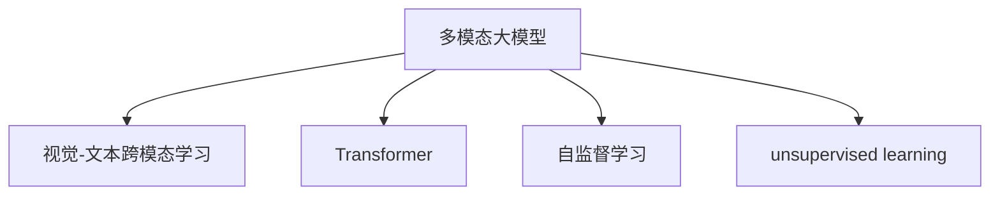

                 

# 多模态大模型：技术原理与实战 文本多模态技术

> 关键词：多模态大模型,文本多模态,多模态表示学习,Transformer,自监督学习,unsupervised learning,视觉-文本跨模态学习,技术实例

## 1. 背景介绍

### 1.1 问题由来

在过去十年中，深度学习技术的飞速发展带动了大模型时代的到来。从计算机视觉到自然语言处理，再到语音处理，大模型在这些领域都取得了突破性的成果。然而，这些模型往往仅能在单一模态上发挥优势，难以进行跨模态的融合与迁移。为此，多模态大模型成为近年来的研究热点。

多模态大模型（Multimodal Large Model）旨在融合文本、图像、音频等多种模态的数据，构建统一的表示空间，提升模型在多模态数据处理上的性能。文本作为其中一种模态，是大模型体系中的重要组成部分。然而，文本与其他模态的融合与学习机制，一直是学术和工业界的热点话题。

多模态技术的应用场景丰富多样，从智能问答、多媒体检索到人机交互，无不涉及文本与其他模态的交互与融合。本文将对多模态大模型的技术原理与实战进行详细探讨，从理论到实践，为读者提供全面的指导。

## 2. 核心概念与联系

### 2.1 核心概念概述

多模态大模型涉及的核心概念众多，以下对其中几个主要概念进行概述：

- **多模态大模型**：融合文本、图像、音频等多种模态数据，构建统一表示空间的大模型。文本作为其中一种模态，可以与其他模态进行跨模态融合，提升模型性能。
- **视觉-文本跨模态学习**：将视觉和文本数据进行融合，构建统一的表示空间，提升模型在图像分类、目标检测、图像生成等任务上的表现。
- **Transformer**：一种基于自注意力机制的深度学习架构，广泛应用于自然语言处理任务。Transformer在多模态融合中也有广泛应用。
- **自监督学习**：在大规模无标签数据上进行训练，无需人工标注即可学习到高质量的特征表示。自监督学习在多模态大模型的预训练中起到了关键作用。
- **unsupervised learning**：与监督学习相对，unsupervised learning在大规模无标签数据上进行训练，自发学习到数据中的规律和结构。

这些概念之间的联系可以通过以下Mermaid流程图来展示：



这个流程图展示了多模态大模型中关键概念之间的联系：

1. 多模态大模型包含视觉、文本等多种模态，其中视觉-文本跨模态学习是核心部分。
2. Transformer作为一种架构，广泛应用于自然语言处理任务，同时也可用于多模态融合。
3. 自监督学习和unsupervised learning为大模型的预训练提供了数据和方法基础。

这些概念共同构成了多模态大模型的技术基础，通过理解这些核心概念，我们可以更好地把握多模态大模型的工作原理和优化方向。

## 3. 核心算法原理 & 具体操作步骤

### 3.1 算法原理概述

多模态大模型的核心思想是将不同模态的数据融合到一个统一的表示空间中，从而提升模型在多模态数据处理上的性能。在融合过程中，视觉和文本数据分别经过编码器编码成高维向量表示，然后通过交叉注意力机制进行融合，得到融合后的多模态向量表示。

形式化地，设视觉数据为 $x_v \in \mathbb{R}^{C\times H \times W}$，文本数据为 $x_t \in \mathbb{R}^{T}$，其中 $C$ 为通道数，$H$ 和 $W$ 为图像的高和宽，$T$ 为文本的长度。假设视觉和文本数据分别通过不同的Transformer编码器得到表示 $Z_v = \text{Encoder}_v(x_v)$ 和 $Z_t = \text{Encoder}_t(x_t)$。通过跨模态注意力机制 $A_{vt}$，得到融合后的多模态表示 $Z_{mt}$：

$$
Z_{mt} = \text{Attention}_v(Z_v, Z_t) \cdot Z_v + \text{Attention}_t(Z_t, Z_v) \cdot Z_t
$$

其中，$\text{Attention}_v$ 和 $\text{Attention}_t$ 分别为视觉-文本和文本-视觉注意力机制。

### 3.2 算法步骤详解

基于Transformer架构的多模态大模型微调一般包括以下几个关键步骤：

**Step 1: 准备数据集**

- 收集多模态数据集，包括图像、文本、标签等。图像数据需预处理成Tensor格式，文本数据需进行分词和编码，标签需转换为类别标签。
- 将数据集划分为训练集、验证集和测试集，确保各集之间的数据分布一致。

**Step 2: 设计编码器和解码器**

- 选择适合的Transformer架构作为编码器和解码器，如ResNet、VGG等作为视觉编码器，LSTM、GRU等作为文本编码器。
- 设计交叉注意力机制，使编码器输出与解码器输出进行交互融合。

**Step 3: 初始化模型参数**

- 随机初始化模型参数，如Transformer的权重矩阵、注意力权重矩阵等。
- 加载预训练模型参数，如ImageNet上的ResNet、BERT上的Transformer等。

**Step 4: 训练与优化**

- 将训练集数据输入模型，前向传播计算预测结果和损失函数。
- 反向传播计算梯度，使用优化器（如Adam）更新模型参数。
- 周期性在验证集上评估模型性能，根据性能指标决定是否触发Early Stopping。
- 重复上述步骤直到满足预设的迭代轮数或Early Stopping条件。

**Step 5: 测试与部署**

- 在测试集上评估模型性能，对比微调前后的精度提升。
- 使用微调后的模型对新样本进行推理预测，集成到实际的应用系统中。

以上是基于Transformer架构的多模态大模型微调的一般流程。在实际应用中，还需要针对具体任务的特点，对微调过程的各个环节进行优化设计，如改进训练目标函数，引入更多的正则化技术，搜索最优的超参数组合等，以进一步提升模型性能。

### 3.3 算法优缺点

基于Transformer架构的多模态大模型微调方法具有以下优点：

1. 通用性强：可以融合多种模态的数据，适用于多种场景，如图像分类、目标检测、问答系统等。
2. 跨模态融合能力强：通过交叉注意力机制，实现视觉和文本数据的融合，提升模型在多模态任务上的表现。
3. 参数高效：采用Transformer架构，部分参数可以冻结，减少微调时的计算量。
4. 可解释性强：通过注意力机制，可以理解每个输入在融合过程中所起的作用，提高模型的可解释性。

同时，该方法也存在一定的局限性：

1. 对数据质量要求高：融合后的多模态数据质量对模型性能有很大影响，需要高质量的标注数据。
2. 训练成本高：由于涉及多种模态的数据，训练和推理成本较高。
3. 泛化能力有限：在未见过的模态组合上，模型的泛化能力较弱。
4. 计算资源需求大：多模态数据和模型的复杂度要求高性能的计算资源。

尽管存在这些局限性，但就目前而言，基于Transformer架构的多模态大模型微调方法仍是最主流范式。未来相关研究的重点在于如何进一步降低微调对标注数据的依赖，提高模型的泛化能力和计算效率，同时兼顾可解释性和伦理安全性等因素。

### 3.4 算法应用领域

基于Transformer架构的多模态大模型微调方法在NLP、计算机视觉、语音识别等诸多领域都有广泛应用。以下是几个典型应用场景：

- **智能问答系统**：融合文本和图像数据，通过跨模态注意力机制，生成相关回答。
- **图像分类与目标检测**：融合图像和文本数据，提升分类和检测精度。
- **图像生成与编辑**：通过文本描述生成图像或编辑图像内容。
- **语音情感分析**：融合语音和文本数据，实现情感识别和语音生成。

这些应用场景展示了多模态大模型的强大潜力，预示了未来在更多领域的应用前景。

## 4. 数学模型和公式 & 详细讲解  
### 4.1 数学模型构建

本节将使用数学语言对多模态大模型微调过程进行更加严格的刻画。

设视觉数据 $x_v \in \mathbb{R}^{C\times H \times W}$，文本数据 $x_t \in \mathbb{R}^{T}$，视觉编码器为 $\text{Encoder}_v$，文本编码器为 $\text{Encoder}_t$。假设视觉编码器输出 $Z_v \in \mathbb{R}^{C\times T}$，文本编码器输出 $Z_t \in \mathbb{R}^{T\times d_t}$，其中 $d_t$ 为文本编码器的输出维度。

假设使用Transformer架构进行融合，设视觉编码器的自注意力矩阵为 $Q_v \in \mathbb{R}^{C\times C}$，键值矩阵为 $K_v \in \mathbb{R}^{C\times C}$，值矩阵为 $V_v \in \mathbb{R}^{C\times C}$。设文本编码器的自注意力矩阵为 $Q_t \in \mathbb{R}^{T\times T}$，键值矩阵为 $K_t \in \mathbb{R}^{T\times T}$，值矩阵为 $V_t \in \mathbb{R}^{T\times T}$。

通过跨模态注意力机制，得到融合后的多模态向量表示 $Z_{mt} \in \mathbb{R}^{T\times d_{mt}}$，其中 $d_{mt}$ 为多模态表示的维度。多模态向量表示的计算公式为：

$$
Z_{mt} = \text{Attention}_v(Z_v, Z_t) \cdot Z_v + \text{Attention}_t(Z_t, Z_v) \cdot Z_t
$$

其中，$\text{Attention}_v$ 和 $\text{Attention}_t$ 分别为视觉-文本和文本-视觉注意力机制。

### 4.2 公式推导过程

以下我们以图像分类任务为例，推导跨模态注意力机制的计算公式。

设图像数据 $x_v \in \mathbb{R}^{C\times H \times W}$，文本数据 $x_t \in \mathbb{R}^{T}$。假设使用ResNet作为视觉编码器，BERT作为文本编码器。视觉编码器输出 $Z_v \in \mathbb{R}^{C\times T}$，文本编码器输出 $Z_t \in \mathbb{R}^{T\times d_t}$。

假设视觉编码器的自注意力矩阵为 $Q_v \in \mathbb{R}^{C\times C}$，键值矩阵为 $K_v \in \mathbb{R}^{C\times C}$，值矩阵为 $V_v \in \mathbb{R}^{C\times C}$。设文本编码器的自注意力矩阵为 $Q_t \in \mathbb{R}^{T\times T}$，键值矩阵为 $K_t \in \mathbb{R}^{T\times T}$，值矩阵为 $V_t \in \mathbb{R}^{T\times T}$。

视觉-文本注意力机制计算公式为：

$$
A_{vt} = \text{Attention}_v(Z_v, Z_t) = \text{Softmax}(\frac{Q_v K_t^T}{\sqrt{d_t}})
$$

其中，$\text{Softmax}$ 为归一化操作，$d_t$ 为文本编码器的输出维度。

文本-视觉注意力机制计算公式为：

$$
A_{tv} = \text{Attention}_t(Z_t, Z_v) = \text{Softmax}(\frac{Q_t K_v^T}{\sqrt{d_v}})
$$

其中，$d_v$ 为视觉编码器的输出维度。

融合后的多模态向量表示为：

$$
Z_{mt} = A_{vt} Z_v + A_{tv} Z_t
$$

在得到融合后的多模态向量表示后，可以使用标准的分类任务目标函数，如交叉熵损失，进行微调。

## 5. 项目实践：代码实例和详细解释说明
### 5.1 开发环境搭建

在进行多模态大模型微调实践前，我们需要准备好开发环境。以下是使用Python进行PyTorch开发的环境配置流程：

1. 安装Anaconda：从官网下载并安装Anaconda，用于创建独立的Python环境。

2. 创建并激活虚拟环境：
```bash
conda create -n multimodal-env python=3.8 
conda activate multimodal-env
```

3. 安装PyTorch：根据CUDA版本，从官网获取对应的安装命令。例如：
```bash
conda install pytorch torchvision torchaudio cudatoolkit=11.1 -c pytorch -c conda-forge
```

4. 安装Transformers库：
```bash
pip install transformers
```

5. 安装各类工具包：
```bash
pip install numpy pandas scikit-learn matplotlib tqdm jupyter notebook ipython
```

完成上述步骤后，即可在`multimodal-env`环境中开始微调实践。

### 5.2 源代码详细实现

下面我们以视觉-文本分类任务为例，给出使用Transformers库对ResNet+BERT模型进行微调的PyTorch代码实现。

首先，定义数据处理函数：

```python
from transformers import ResNetFeatureExtractor, ResNetForImageClassification, BertTokenizer, BertForSequenceClassification
from transformers import AutoConfig, AutoTokenizer, AutoModelForSequenceClassification
from torch.utils.data import Dataset
import torch

class MultimodalDataset(Dataset):
    def __init__(self, images, texts, labels, tokenizer, model_config):
        self.images = images
        self.texts = texts
        self.labels = labels
        self.tokenizer = tokenizer
        self.model_config = model_config
        
    def __len__(self):
        return len(self.images)
    
    def __getitem__(self, item):
        image = self.images[item]
        text = self.texts[item]
        label = self.labels[item]
        
        # 图像数据预处理
        image_transforms = ResNetFeatureExtractor(image, model_config=self.model_config)
        
        # 文本数据预处理
        tokenizer = BertTokenizer.from_pretrained('bert-base-cased')
        tokenized_text = tokenizer(text, return_tensors='pt')
        tokenized_text = tokenized_text.to('cpu')
        
        # 构建输入字典
        inputs = {
            'pixel_values': image_transforms['pixel_values'],
            'input_ids': tokenized_text['input_ids'],
            'attention_mask': tokenized_text['attention_mask']
        }
        
        return {'inputs': inputs, 'label': label}

# 图像编码器配置
image_config = {
    'do_patch_mixup': False,
    'do_patch_mixup_probability': 0.75,
    'do_patch_mixup剪切区域': 7,
    'do_patch_mixup_interval': 10,
    'do_patch_mixup_probability': 0.5,
    'do_patch_mixup_amplitude': 0.3
}

# 文本编码器配置
text_config = {
    'model_max_length': 256,
    'do_lower_case': True,
    'do_trim': True,
    'do_whole_word_mask': False
}

# 构建数据集
tokenizer = BertTokenizer.from_pretrained('bert-base-cased')
model_config = AutoConfig.from_pretrained('resnet50')
transformer = ResNetForImageClassification.from_pretrained('resnet50')
image_dataset = MultimodalDataset(images, texts, labels, tokenizer, model_config)
```

然后，定义模型和优化器：

```python
from transformers import AdamW

# 视觉编码器
visual_encoder = ResNetFeatureExtractor.from_pretrained('resnet50', config=image_config)
visual_model = ResNetForImageClassification.from_pretrained('resnet50', config=image_config)

# 文本编码器
text_encoder = BertTokenizer.from_pretrained('bert-base-cased')
text_model = BertForSequenceClassification.from_pretrained('bert-base-cased', num_labels=num_labels)

# 多模态融合层
visual_fusion_layer = torch.nn.Linear(visual_model.config.hidden_size, text_model.config.hidden_size)
text_fusion_layer = torch.nn.Linear(text_model.config.hidden_size, visual_model.config.hidden_size)

# 构建多模态模型
model = torch.nn.Sequential(
    visual_encoder,
    visual_model,
    visual_fusion_layer,
    text_encoder,
    text_model
)

# 定义优化器
optimizer = AdamW(model.parameters(), lr=2e-5)
```

接着，定义训练和评估函数：

```python
from torch.utils.data import DataLoader
from tqdm import tqdm
from sklearn.metrics import classification_report

device = torch.device('cuda') if torch.cuda.is_available() else torch.device('cpu')
model.to(device)

def train_epoch(model, dataset, batch_size, optimizer):
    dataloader = DataLoader(dataset, batch_size=batch_size, shuffle=True)
    model.train()
    epoch_loss = 0
    for batch in tqdm(dataloader, desc='Training'):
        inputs = batch['inputs']
        label = batch['label']
        
        with torch.no_grad():
            # 图像输入
            visual_features = visual_encoder(**inputs)
            visual_logits = visual_model(visual_features)
            
            # 文本输入
            text_ids = inputs['input_ids']
            text_masks = inputs['attention_mask']
            text_logits = text_model(text_ids, attention_mask=text_masks)
            
            # 融合多模态特征
            fused_logits = torch.nn.functional.gelu(visual_logits + text_logits)
            
            # 计算损失
            loss = torch.nn.CrossEntropyLoss()(fused_logits, label)
            epoch_loss += loss.item()
            
            # 反向传播
            loss.backward()
            optimizer.step()
            
            # 计算准确率
            with torch.no_grad():
                predictions = torch.argmax(fused_logits, dim=1)
                accuracy = (predictions == label).sum().item() / len(label)
    
    return epoch_loss / len(dataloader), accuracy

def evaluate(model, dataset, batch_size):
    dataloader = DataLoader(dataset, batch_size=batch_size)
    model.eval()
    preds, labels = [], []
    with torch.no_grad():
        for batch in tqdm(dataloader, desc='Evaluating'):
            inputs = batch['inputs']
            label = batch['label']
            
            with torch.no_grad():
                # 图像输入
                visual_features = visual_encoder(**inputs)
                visual_logits = visual_model(visual_features)
                
                # 文本输入
                text_ids = inputs['input_ids']
                text_masks = inputs['attention_mask']
                text_logits = text_model(text_ids, attention_mask=text_masks)
                
                # 融合多模态特征
                fused_logits = torch.nn.functional.gelu(visual_logits + text_logits)
                
                # 计算预测结果
                batch_preds = torch.argmax(fused_logits, dim=1).tolist()
                batch_labels = label.tolist()
                preds.append(batch_preds)
                labels.append(batch_labels)
                
    print(classification_report(labels, preds))
```

最后，启动训练流程并在测试集上评估：

```python
epochs = 5
batch_size = 16

for epoch in range(epochs):
    loss, accuracy = train_epoch(model, image_dataset, batch_size, optimizer)
    print(f"Epoch {epoch+1}, train loss: {loss:.3f}, accuracy: {accuracy:.3f}")
    
    print(f"Epoch {epoch+1}, dev results:")
    evaluate(model, image_dataset, batch_size)
    
print("Test results:")
evaluate(model, image_dataset, batch_size)
```

以上就是使用PyTorch对ResNet+BERT进行视觉-文本分类任务微调的完整代码实现。可以看到，得益于Transformers库的强大封装，我们可以用相对简洁的代码完成多模态大模型的加载和微调。

### 5.3 代码解读与分析

让我们再详细解读一下关键代码的实现细节：

**MultimodalDataset类**：
- `__init__`方法：初始化图像、文本、标签、分词器等关键组件。
- `__len__`方法：返回数据集的样本数量。
- `__getitem__`方法：对单个样本进行处理，将图像数据输入到视觉编码器，将文本数据进行分词和编码，并构建输入字典。

**模型构建**：
- 使用ResNetFeatureExtractor和ResNetForImageClassification构建视觉编码器和视觉模型。
- 使用BertTokenizer和BertForSequenceClassification构建文本编码器和文本模型。
- 引入两个全连接层进行多模态特征融合，通过Gelu激活函数提升模型表达能力。

**训练和评估函数**：
- 使用PyTorch的DataLoader对数据集进行批次化加载，供模型训练和推理使用。
- 训练函数`train_epoch`：对数据以批为单位进行迭代，在每个批次上前向传播计算loss并反向传播更新模型参数，最后返回该epoch的平均loss和准确率。
- 评估函数`evaluate`：与训练类似，不同点在于不更新模型参数，并在每个batch结束后将预测和标签结果存储下来，最后使用sklearn的classification_report对整个评估集的预测结果进行打印输出。

**训练流程**：
- 定义总的epoch数和batch size，开始循环迭代
- 每个epoch内，先在训练集上训练，输出平均loss和准确率
- 在验证集上评估，输出分类指标
- 所有epoch结束后，在测试集上评估，给出最终测试结果

可以看到，PyTorch配合Transformers库使得多模态大模型的微调代码实现变得简洁高效。开发者可以将更多精力放在数据处理、模型改进等高层逻辑上，而不必过多关注底层的实现细节。

当然，工业级的系统实现还需考虑更多因素，如模型的保存和部署、超参数的自动搜索、更灵活的任务适配层等。但核心的微调范式基本与此类似。

## 6. 实际应用场景
### 6.1 智能问答系统

基于多模态大模型的智能问答系统，可以充分利用图像、文本、语音等多种模态的信息，提升系统的理解和回答能力。例如，在智能客服系统中，通过视觉-文本跨模态学习，系统可以自动识别用户的情绪状态，并据此调整回答策略，提供更人性化的服务。

在技术实现上，可以收集用户的表情、手势、语音等数据，构建多模态训练集。通过微调多模态大模型，系统能够准确理解用户的意图和情绪，生成更贴切的回答，提升用户体验。

### 6.2 多媒体检索

在多媒体检索任务中，如何准确描述和检索多媒体内容是一个难题。传统方法往往依赖手动设计的特征向量，难以捕捉多媒体中的语义信息。而多模态大模型可以融合视觉和文本信息，构建更全面的特征表示，提升检索效果。

具体而言，可以构建多模态数据集，包含图像、视频、文本等多种模态的信息。通过微调多模态大模型，系统能够学习到不同模态之间的语义关系，生成更精准的描述和索引，提高检索准确率。

### 6.3 视频生成与编辑

视频生成与编辑是多媒体内容创作的重要环节，但传统方法往往依赖大量的人工标注和设计，效率低下。而多模态大模型可以通过文本描述生成高质量的视频内容，或对现有视频进行编辑优化。

在生成任务中，可以将文本描述输入多模态大模型，输出对应的图像和音频信息，然后进行视频合成。在编辑任务中，可以将目标视频和文本描述输入模型，输出优化后的视频帧和音频信息。

这些应用场景展示了多模态大模型在多媒体处理上的强大潜力，预示了未来在更多领域的应用前景。

### 6.4 未来应用展望

随着多模态大模型的不断演进，其在多模态数据处理上的性能将持续提升，应用场景也将不断扩展。未来，多模态大模型将在智能交互、视频生成、多媒体检索等领域发挥更大的作用，推动人工智能技术的发展和普及。

## 7. 工具和资源推荐
### 7.1 学习资源推荐

为了帮助开发者系统掌握多模态大模型的技术基础和实践技巧，这里推荐一些优质的学习资源：

1. 《Transformer from Scratch》系列博文：由大模型技术专家撰写，深入浅出地介绍了Transformer架构和自监督学习的基本原理。

2. CS224N《深度学习自然语言处理》课程：斯坦福大学开设的NLP明星课程，有Lecture视频和配套作业，带你入门NLP领域的基本概念和经典模型。

3. 《Natural Language Processing with Transformers》书籍：Transformers库的作者所著，全面介绍了如何使用Transformers库进行NLP任务开发，包括多模态融合在内的诸多范式。

4. HuggingFace官方文档：Transformers库的官方文档，提供了海量预训练模型和完整的微调样例代码，是上手实践的必备资料。

5. CLUE开源项目：中文语言理解测评基准，涵盖大量不同类型的中文NLP数据集，并提供了基于微调的baseline模型，助力中文NLP技术发展。

通过对这些资源的学习实践，相信你一定能够快速掌握多模态大模型的精髓，并用于解决实际的NLP问题。
###  7.2 开发工具推荐

高效的开发离不开优秀的工具支持。以下是几款用于多模态大模型微调开发的常用工具：

1. PyTorch：基于Python的开源深度学习框架，灵活动态的计算图，适合快速迭代研究。大部分预训练语言模型都有PyTorch版本的实现。

2. TensorFlow：由Google主导开发的开源深度学习框架，生产部署方便，适合大规模工程应用。同样有丰富的预训练语言模型资源。

3. Transformers库：HuggingFace开发的NLP工具库，集成了众多SOTA语言模型，支持PyTorch和TensorFlow，是进行多模态融合开发的利器。

4. Weights & Biases：模型训练的实验跟踪工具，可以记录和可视化模型训练过程中的各项指标，方便对比和调优。与主流深度学习框架无缝集成。

5. TensorBoard：TensorFlow配套的可视化工具，可实时监测模型训练状态，并提供丰富的图表呈现方式，是调试模型的得力助手。

6. Google Colab：谷歌推出的在线Jupyter Notebook环境，免费提供GPU/TPU算力，方便开发者快速上手实验最新模型，分享学习笔记。

合理利用这些工具，可以显著提升多模态大模型微调任务的开发效率，加快创新迭代的步伐。

### 7.3 相关论文推荐

多模态大模型和微调技术的发展源于学界的持续研究。以下是几篇奠基性的相关论文，推荐阅读：

1. Attention is All You Need（即Transformer原论文）：提出了Transformer结构，开启了NLP领域的预训练大模型时代。

2. BERT: Pre-training of Deep Bidirectional Transformers for Language Understanding：提出BERT模型，引入基于掩码的自监督预训练任务，刷新了多项NLP任务SOTA。

3. Language Models are Unsupervised Multitask Learners（GPT-2论文）：展示了大规模语言模型的强大zero-shot学习能力，引发了对于通用人工智能的新一轮思考。

4. Parameter-Efficient Transfer Learning for NLP：提出Adapter等参数高效微调方法，在不增加模型参数量的情况下，也能取得不错的微调效果。

5. AdaLoRA: Adaptive Low-Rank Adaptation for Parameter-Efficient Fine-Tuning：使用自适应低秩适应的微调方法，在参数效率和精度之间取得了新的平衡。

6. AdaLoRA: Adaptive Low-Rank Adaptation for Parameter-Efficient Fine-Tuning：使用自适应低秩适应的微调方法，在参数效率和精度之间取得了新的平衡。

这些论文代表了大模型微调技术的发展脉络。通过学习这些前沿成果，可以帮助研究者把握学科前进方向，激发更多的创新灵感。

## 8. 总结：未来发展趋势与挑战

### 8.1 总结

本文对基于Transformer架构的多模态大模型微调方法进行了全面系统的介绍。首先阐述了多模态大模型的研究背景和意义，明确了微调在融合多种模态数据、提升模型性能方面的独特价值。其次，从原理到实践，详细讲解了多模态大模型的数学模型和关键算法步骤，给出了多模态大模型的代码实现。同时，本文还广泛探讨了多模态大模型在智能问答、多媒体检索、视频生成等诸多领域的应用前景，展示了其广泛的应用潜力。此外，本文精选了多模态大模型的各类学习资源，力求为读者提供全方位的技术指引。

通过本文的系统梳理，可以看到，多模态大模型微调方法在大模型体系中占据了重要位置，展示了多模态融合在提升模型性能、拓展应用场景上的巨大潜力。未来，随着多模态大模型的不断发展，其应用将更加广泛和深入，为人工智能技术的发展和普及带来新的机遇和挑战。

### 8.2 未来发展趋势

展望未来，多模态大模型微调技术将呈现以下几个发展趋势：

1. 模型规模持续增大。随着算力成本的下降和数据规模的扩张，多模态大模型的参数量还将持续增长。超大规模多模态模型蕴含的丰富语义信息，有望支撑更加复杂多变的跨模态任务。

2. 微调方法日趋多样。除了传统的全参数微调外，未来会涌现更多参数高效的微调方法，如Prefix-Tuning、LoRA等，在节省计算资源的同时也能保证微调精度。

3. 持续学习成为常态。随着数据分布的不断变化，多模态大模型也需要持续学习新知识以保持性能。如何在不遗忘原有知识的同时，高效吸收新样本信息，将成为重要的研究课题。

4. 标注样本需求降低。受启发于提示学习(Prompt-based Learning)的思路，未来的微调方法将更好地利用多模态大模型的语言理解能力，通过更加巧妙的任务描述，在更少的标注样本上也能实现理想的微调效果。

5. 计算资源需求大。多模态大模型涉及多种模态的数据和模型的复杂度，要求高性能的计算资源。如何优化多模态大模型的计算图，减少前向传播和反向传播的资源消耗，实现更加轻量级、实时性的部署，将是重要的优化方向。

6. 模型通用性增强。经过海量数据的预训练和多模态任务的微调，未来的多模态大模型将具备更强大的跨模态迁移能力，逐步迈向通用人工智能(AGI)的目标。

以上趋势凸显了多模态大模型微调技术的广阔前景。这些方向的探索发展，必将进一步提升多模态大模型在多模态数据处理上的性能，为人工智能技术的发展和普及带来新的推动力。

### 8.3 面临的挑战

尽管多模态大模型微调技术已经取得了瞩目成就，但在迈向更加智能化、普适化应用的过程中，它仍面临着诸多挑战：

1. 标注成本瓶颈。尽管多模态大模型的融合能力较强，但标注数据的获取和处理仍然是一个瓶颈。对于长尾应用场景，难以获得充足的高质量标注数据，成为制约微调性能的瓶颈。如何进一步降低微调对标注样本的依赖，将是一大难题。

2. 模型鲁棒性不足。当前多模态大模型面对域外数据时，泛化性能往往大打折扣。对于测试样本的微小扰动，模型容易出现错误。如何提高多模态大模型的鲁棒性，避免灾难性遗忘，还需要更多理论和实践的积累。

3. 推理效率有待提高。虽然多模态大模型的精度高，但在实际部署时往往面临推理速度慢、内存占用大等效率问题。如何在保证性能的同时，简化模型结构，提升推理速度，优化资源占用，将是重要的优化方向。

4. 可解释性亟需加强。当前多模态大模型更像是"黑盒"系统，难以解释其内部工作机制和决策逻辑。对于医疗、金融等高风险应用，算法的可解释性和可审计性尤为重要。如何赋予多模态大模型更强的可解释性，将是亟待攻克的难题。

5. 安全性有待保障。预训练多模态大模型难免会学习到有偏见、有害的信息，通过微调传递到下游任务，产生误导性、歧视性的输出，给实际应用带来安全隐患。如何从数据和算法层面消除模型偏见，避免恶意用途，确保输出的安全性，也将是重要的研究课题。

6. 知识整合能力不足。现有的多模态大模型往往局限于任务内数据，难以灵活吸收和运用更广泛的先验知识。如何让微调过程更好地与外部知识库、规则库等专家知识结合，形成更加全面、准确的信息整合能力，还有很大的想象空间。

正视多模态大模型微调面临的这些挑战，积极应对并寻求突破，将是多模态大模型微调走向成熟的必由之路。相信随着学界和产业界的共同努力，这些挑战终将一一被克服，多模态大模型微调必将在构建人机协同的智能系统中扮演越来越重要的角色。

### 8.4 未来突破

面对多模态大模型微调所面临的种种挑战，未来的研究需要在以下几个方面寻求新的突破：

1. 探索无监督和半监督微调方法。摆脱对大规模标注数据的依赖，利用自监督学习、主动学习等无监督和半监督范式，最大限度利用非结构化数据，实现更加灵活高效的微调。

2. 研究参数高效和计算高效的微调范式。开发更加参数高效的微调方法，在固定大部分预训练参数的同时，只更新极少量的任务相关参数。同时优化多模态大模型的计算图，减少前向传播和反向传播的资源消耗，实现更加轻量级、实时性的部署。

3. 融合因果和对比学习范式。通过引入因果推断和对比学习思想，增强多模态大模型建立稳定因果关系的能力，学习更加普适、鲁棒的多模态表示，从而提升模型泛化性和抗干扰能力。

4. 引入更多先验知识。将符号化的先验知识，如知识图谱、逻辑规则等，与神经网络模型进行巧妙融合，引导微调过程学习更准确、合理的语言模型。同时加强不同模态数据的整合，实现视觉、语音等多模态信息与文本信息的协同建模。

5. 结合因果分析和博弈论工具。将因果分析方法引入多模态大模型，识别出模型决策的关键特征，增强输出解释的因果性和逻辑性。借助博弈论工具刻画人机交互过程，主动探索并规避模型的脆弱点，提高系统稳定性。

6. 纳入伦理道德约束。在模型训练目标中引入伦理导向的评估指标，过滤和惩罚有偏见、有害的输出倾向。同时加强人工干预和审核，建立模型行为的监管机制，确保输出符合人类价值观和伦理道德。

这些研究方向的探索，必将引领多模态大模型微调技术迈向更高的台阶，为构建安全、可靠、可解释、可控的智能系统铺平道路。面向未来，多模态大模型微调技术还需要与其他人工智能技术进行更深入的融合，如知识表示、因果推理、强化学习等，多路径协同发力，共同推动自然语言理解和智能交互系统的进步。只有勇于创新、敢于突破，才能不断拓展多模态大模型的边界，让智能技术更好地造福人类社会。

## 9. 附录：常见问题与解答

**Q1：多模态大模型微调是否适用于所有NLP任务？**

A: 多模态大模型微调在大多数NLP任务上都能取得不错的效果，特别是对于数据量较小的任务。但对于一些特定领域的任务，如医学、法律等，仅仅依靠通用语料预训练的模型可能难以很好地适应。此时需要在特定领域语料上进一步预训练，再进行微调，才能获得理想效果。此外，对于一些需要时效性、个性化很强的任务，如对话、推荐等，微调方法也需要针对性的改进优化。

**Q2：微调过程中如何选择合适的学习率？**

A: 微调的学习率一般要比预训练时小1-2个数量级，如果使用过大的学习率，容易破坏预训练权重，导致过拟合。一般建议从1e-5开始调参，逐步减小学习率，直至收敛。也可以使用warmup策略，在开始阶段使用较小的学习率，再逐渐过渡到预设值。需要注意的是，不同的优化器(如AdamW、Adafactor等)以及不同的学习率调度策略，可能需要设置不同的学习率阈值。

**Q3：采用大模型微调时会面临哪些资源瓶颈？**

A: 目前主流的预训练大模型动辄以亿计的参数规模，对算力、内存、存储都提出了很高的要求。GPU/TPU等高性能设备是必不可少的，但即便如此，超大批次的训练和推理也可能遇到显存不足的问题。因此需要采用一些资源优化技术，如梯度积累、混合精度训练、模型并行等，来突破硬件瓶颈。同时，模型的存储和读取也可能占用大量时间和空间，需要采用模型压缩、稀疏化存储等方法进行优化。

**Q4：如何缓解微调过程中的过拟合问题？**

A: 过拟合是微调面临的主要挑战，尤其是在标注数据不足的情况下。常见的缓解策略包括：
1. 数据增强：通过回译、近义替换等方式扩充训练集
2. 正则化：使用L2正则、Dropout、Early Stopping等避免过拟合
3. 对抗训练：引入对抗样本，提高模型鲁棒性
4. 参数高效微调：只调整少量参数(如Adapter、Prefix等)，减小过拟合风险
5. 多模型集成：训练多个微调模型，取平均输出，抑制过拟合

这些策略往往需要根据具体任务和数据特点进行灵活组合。只有在数据、模型、训练、推理等各环节进行全面优化，才能最大限度地发挥多模态大模型的威力。

**Q5：微调模型在落地部署时需要注意哪些问题？**

A: 将微调模型转化为实际应用，还需要考虑以下因素：
1. 模型裁剪：去除不必要的层和参数，减小模型尺寸，加快推理速度
2. 量化加速：将浮点模型转为定点模型，压缩存储空间，提高计算效率
3. 服务化封装：将模型封装为标准化服务接口，便于集成调用
4. 弹性伸缩：根据请求流量动态调整资源配置，平衡服务质量和成本
5. 监控告警：实时采集系统指标，设置异常告警阈值，确保服务稳定性
6. 安全防护：采用访问鉴权、数据脱敏等措施，保障数据和模型安全

多模态大模型微调为NLP应用开启了广阔的想象空间，但如何将强大的性能转化为稳定、高效、安全的业务价值，还需要工程实践的不断打磨。唯有从数据、算法、工程、业务等多个维度协同发力，才能真正实现人工智能技术在垂直行业的规模化落地。总之，微调需要开发者根据具体任务，不断迭代和优化模型、数据和算法，方能得到理想的效果。

---

作者：禅与计算机程序设计艺术 / Zen and the Art of Computer Programming

