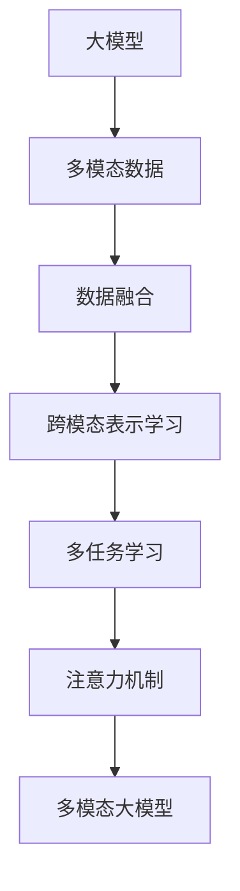

                 

# 多模态大模型：技术原理与实战 方法论介绍

> 关键词：多模态大模型, 技术原理, 实战方法, 数据融合, 模型优化, 应用场景, 开发工具

## 1. 背景介绍

### 1.1 问题由来
近年来，随着深度学习技术的快速发展，大模型（Large Models）在计算机视觉、自然语言处理（NLP）和语音识别等领域取得了显著的进展。然而，现有的模型大多基于单模态数据进行训练，难以充分理解复杂的多模态（如视觉+文本、视觉+语音等）场景。多模态大模型（Multimodal Large Models）的提出，旨在通过融合不同模态的信息，构建能够更好地处理多模态任务的强大模型，从而在诸多领域产生革命性的影响。

### 1.2 问题核心关键点
多模态大模型的核心在于如何有效地融合不同模态的数据，并通过模型学习获得跨模态的理解能力。以下列出了一些关键点，以帮助理解多模态大模型的核心概念：

- 多模态数据融合：将不同模态的数据，如文本、图像、语音等，通过合适的方式融合到同一个模型中进行训练。
- 跨模态表示学习：学习到能够同时表示多模态信息的共享表示，从而实现不同模态之间的交互和理解。
- 多任务联合训练：在多模态数据上同时训练多个任务，如视觉分类、文本分类、语义匹配等，以优化模型的泛化能力。
- 注意力机制：通过注意力机制，使模型能够动态地选择和重视不同模态的信息，提高多模态理解的效果。

### 1.3 问题研究意义
研究多模态大模型的技术原理与实战方法，对于推动人工智能技术的全面应用和落地，具有重要意义：

1. **提升模型泛化能力**：通过多模态数据的融合，模型能够在更广泛的任务上表现良好，提升其在不同场景下的泛化能力。
2. **拓展应用领域**：多模态大模型能够处理更多样化的数据类型和任务，拓展了人工智能技术的应用边界。
3. **增强决策可靠性**：多模态信息的融合可以提供更全面、准确的信息，提高模型决策的可靠性。
4. **促进技术创新**：多模态大模型催生了新的研究方向，如跨模态学习、多任务学习等，推动了技术创新。
5. **加速产业化进程**：多模态大模型技术为各行各业提供了解决复杂问题的能力，加速了人工智能技术的产业化进程。

## 2. 核心概念与联系

### 2.1 核心概念概述

为更好地理解多模态大模型的技术原理与实战方法，本节将介绍几个密切相关的核心概念：

- **大模型（Large Model）**：基于深度神经网络构建的大规模模型，如BERT、GPT、ResNet等，能够处理和理解复杂的数据结构，具有强大的学习能力和泛化能力。
- **多模态数据（Multimodal Data）**：包含文本、图像、语音等多维信息的数据集合，是构建多模态大模型的基础。
- **数据融合（Data Fusion）**：将不同模态的数据，如文本和图像，通过某种方式进行融合，使其能够在一个模型中进行统一处理。
- **跨模态表示学习（Cross-modal Representation Learning）**：学习到能够同时表示多模态信息的共享表示，使得不同模态的信息能够互相理解和交互。
- **多任务学习（Multi-task Learning）**：在同一数据集上同时训练多个任务，以提高模型的泛化能力和适应性。
- **注意力机制（Attention Mechanism）**：使模型能够动态地选择和重视不同模态的信息，从而提高多模态理解的效果。

这些核心概念之间的逻辑关系可以通过以下Mermaid流程图来展示：



这个流程图展示了大模型和多模态数据融合、跨模态表示学习、多任务学习及注意力机制之间的关系：

1. 大模型通过融合多模态数据获得丰富的信息。
2. 跨模态表示学习使得不同模态的信息能够互相理解。
3. 多任务学习进一步提升模型的泛化能力。
4. 注意力机制选择和重视不同模态的信息。

这些核心概念共同构成了多模态大模型的基础，使其能够在各种场景下发挥强大的多模态处理能力。通过理解这些核心概念，我们可以更好地把握多模态大模型的工作原理和优化方向。

## 3. 核心算法原理 & 具体操作步骤
### 3.1 算法原理概述

多模态大模型的核心算法原理主要包括数据融合、跨模态表示学习和注意力机制三个部分。其核心思想是：通过融合不同模态的数据，学习跨模态的共享表示，并利用注意力机制选择和重视不同模态的信息，从而构建能够理解和处理多模态任务的大模型。

### 3.2 算法步骤详解

**Step 1: 数据准备与预处理**
- 收集不同模态的数据，如文本、图像、语音等。
- 对数据进行预处理，包括文本的编码、图像的归一化、语音的特征提取等。

**Step 2: 模型初始化**
- 选择合适的预训练模型作为初始化参数，如BERT、ResNet等。
- 在初始化参数的基础上，添加一个跨模态的融合层，用于处理不同模态的信息。

**Step 3: 数据融合**
- 将不同模态的数据通过融合层进行处理，生成一个统一的特征表示。
- 常用的融合方式包括拼接、加权平均、注意力机制等。

**Step 4: 跨模态表示学习**
- 在融合后的特征表示上进行跨模态表示学习，学习到能够同时表示多模态信息的共享表示。
- 常用的方法包括多任务学习、联合嵌入等。

**Step 5: 注意力机制**
- 在跨模态表示学习的基础上，引入注意力机制，使模型能够动态地选择和重视不同模态的信息。
- 常用的注意力机制包括Softmax注意力、多头注意力等。

**Step 6: 模型优化**
- 使用适当的损失函数，如交叉熵损失、均方误差损失等，进行模型优化。
- 在优化过程中，使用适当的正则化技术，如L2正则、Dropout等，防止过拟合。

**Step 7: 模型评估与部署**
- 在验证集上评估模型性能，调整模型参数。
- 部署模型到实际应用中，进行多模态任务的推理和预测。

以上是多模态大模型构建的一般流程。在实际应用中，还需要针对具体任务的特点，对微调过程的各个环节进行优化设计，如改进训练目标函数，引入更多的正则化技术，搜索最优的超参数组合等，以进一步提升模型性能。

### 3.3 算法优缺点

多模态大模型的优点：
1. 融合多模态数据，提升了模型的泛化能力和适应性。
2. 学习跨模态的共享表示，提高了模型的理解和处理能力。
3. 引入注意力机制，能够动态地选择和重视不同模态的信息。

多模态大模型的缺点：
1. 数据融合过程较为复杂，需要选择合适的融合方式。
2. 跨模态表示学习需要大量的计算资源和复杂的模型结构。
3. 注意力机制的引入增加了模型的计算复杂度和训练难度。

尽管存在这些缺点，但多模态大模型在处理多模态任务方面仍具有显著优势，并且在诸多领域得到了广泛应用。未来相关研究的重点在于如何进一步简化融合过程，提高跨模态表示学习的效率，同时兼顾模型的可解释性和伦理安全性等因素。

### 3.4 算法应用领域

多模态大模型已经在多个领域得到了广泛的应用，以下是一些典型的应用场景：

1. **智能安防监控**：通过融合视频和声音数据，构建能够实时监控和识别的智能安防系统。
2. **医学影像分析**：将图像和病历数据融合，构建能够辅助诊断和治疗的智能医学系统。
3. **自动驾驶**：将传感器数据和环境信息融合，构建能够自主驾驶的智能汽车。
4. **智能客服**：通过融合语音和文本数据，构建能够理解和回应的智能客服系统。
5. **虚拟现实**：将图像、声音和触觉数据融合，构建沉浸式的虚拟现实体验。

除了这些典型应用外，多模态大模型还在智能制造、教育、金融等众多领域得到了创新性的应用，为各行业带来了新的技术突破和发展机遇。

## 4. 数学模型和公式 & 详细讲解  
### 4.1 数学模型构建

本节将使用数学语言对多模态大模型的构建过程进行更加严格的刻画。

假设多模态数据由文本数据 $x_{text}$ 和图像数据 $x_{image}$ 构成，且 $x_{text} \in \mathbb{R}^{n_{text}}$，$x_{image} \in \mathbb{R}^{n_{image}}$。多模态大模型的数学模型可以表示为：

$$
M = F_{fusion}(f_{text}(x_{text}), f_{image}(x_{image}))
$$

其中 $f_{text}$ 和 $f_{image}$ 分别表示文本和图像的特征提取器，$f_{text}(x_{text}) \in \mathbb{R}^{d_{text}}$ 和 $f_{image}(x_{image}) \in \mathbb{R}^{d_{image}}$ 分别为文本和图像的特征表示。$F_{fusion}$ 表示数据融合层，将两个特征表示融合为多模态特征表示。

跨模态表示学习的目标是学习到能够同时表示多模态信息的共享表示 $z \in \mathbb{R}^{d_{cross}}$，使得 $z$ 能够较好地映射到各个模态的输出。

常用的跨模态表示学习方法包括多任务学习（Multi-task Learning, MTL）和联合嵌入（Joint Embedding,JE）。

多任务学习通过在多个任务上同时训练模型，学习到跨模态的共享表示。设多任务数据集为 $D_{mt} = \{(x_{i,j}, y_{i,j})\}_{i=1}^{N_{mt}}$，其中 $x_{i,j}$ 表示第 $i$ 个任务的第 $j$ 个样本，$y_{i,j}$ 表示任务的标签。多任务学习的优化目标为：

$$
\min_{\theta} \sum_{i=1}^{N_{mt}} \ell_{i}(f_{\theta}(x_{i,j}))
$$

其中 $\ell_{i}$ 表示第 $i$ 个任务的损失函数。

联合嵌入则通过将不同模态的特征表示映射到同一个低维空间中，学习到跨模态的共享表示。常用的方法包括TCA（Triplet Contrastive Learning）和MACE（Max-Margin Embedding）。

TCA的优化目标为：

$$
\min_{\theta} \sum_{i=1}^{N_{mt}} \sum_{j=1}^{N_{mt}} [\max_{k \neq j} \ell_{i}(f_{\theta}(x_{i,j})) - \ell_{i}(f_{\theta}(x_{i,k}))]
$$

其中 $\ell_{i}$ 表示第 $i$ 个任务的损失函数。

MACE的优化目标为：

$$
\min_{\theta} \sum_{i=1}^{N_{mt}} \sum_{j=1}^{N_{mt}} \sum_{k=1}^{N_{mt}} [\max_{m \neq k} \ell_{i}(f_{\theta}(x_{i,j})) - \ell_{i}(f_{\theta}(x_{i,m}))]
$$

其中 $\ell_{i}$ 表示第 $i$ 个任务的损失函数。

### 4.2 公式推导过程

以下我们以多任务学习（MTL）为例，推导多模态大模型的损失函数及其梯度的计算公式。

假设多模态数据由文本数据 $x_{text}$ 和图像数据 $x_{image}$ 构成，且 $x_{text} \in \mathbb{R}^{n_{text}}$，$x_{image} \in \mathbb{R}^{n_{image}}$。设文本特征提取器 $f_{text}(x_{text}) \in \mathbb{R}^{d_{text}}$ 和图像特征提取器 $f_{image}(x_{image}) \in \mathbb{R}^{d_{image}}$。

设多任务数据集为 $D_{mt} = \{(x_{i,j}, y_{i,j})\}_{i=1}^{N_{mt}}$，其中 $x_{i,j}$ 表示第 $i$ 个任务的第 $j$ 个样本，$y_{i,j}$ 表示任务的标签。设多任务模型的参数为 $\theta$。

假设多任务模型的输出为 $f_{\theta}(x_{i,j}) \in \mathbb{R}^{d_{out}}$，其中 $d_{out}$ 为输出维度。

多任务学习的优化目标为：

$$
\min_{\theta} \sum_{i=1}^{N_{mt}} \ell_{i}(f_{\theta}(x_{i,j}))
$$

其中 $\ell_{i}$ 表示第 $i$ 个任务的损失函数。

在多任务学习中，我们通常使用softmax损失函数作为输出层的损失函数。对于文本分类任务，输出层为：

$$
f_{\theta}(x_{i,j}) = softmax(W_{text} f_{text}(x_{i,j}))
$$

对于图像分类任务，输出层为：

$$
f_{\theta}(x_{i,j}) = softmax(W_{image} f_{image}(x_{i,j}))
$$

多任务学习的损失函数为：

$$
\ell_{i}(f_{\theta}(x_{i,j})) = -y_{i,j} \log f_{\theta}(x_{i,j}) + (1-y_{i,j}) \log (1-f_{\theta}(x_{i,j}))
$$

多任务学习的优化目标为：

$$
\min_{\theta} \sum_{i=1}^{N_{mt}} \sum_{j=1}^{N_{mt}} [-y_{i,j} \log f_{\theta}(x_{i,j}) + (1-y_{i,j}) \log (1-f_{\theta}(x_{i,j}))]
$$

在得到多任务学习的损失函数后，即可带入参数更新公式，完成模型的迭代优化。重复上述过程直至收敛，最终得到适应多模态任务的模型参数 $\theta^*$。

## 5. 项目实践：代码实例和详细解释说明
### 5.1 开发环境搭建

在进行多模态大模型实践前，我们需要准备好开发环境。以下是使用Python进行PyTorch开发的环境配置流程：

1. 安装Anaconda：从官网下载并安装Anaconda，用于创建独立的Python环境。

2. 创建并激活虚拟环境：
```bash
conda create -n pytorch-env python=3.8 
conda activate pytorch-env
```

3. 安装PyTorch：根据CUDA版本，从官网获取对应的安装命令。例如：
```bash
conda install pytorch torchvision torchaudio cudatoolkit=11.1 -c pytorch -c conda-forge
```

4. 安装TensorFlow：
```bash
pip install tensorflow
```

5. 安装Transformers库：
```bash
pip install transformers
```

6. 安装各类工具包：
```bash
pip install numpy pandas scikit-learn matplotlib tqdm jupyter notebook ipython
```

完成上述步骤后，即可在`pytorch-env`环境中开始多模态大模型的实践。

### 5.2 源代码详细实现

下面我们以图像分类任务为例，给出使用Transformers库对ResNet模型进行多模态大模型微调的PyTorch代码实现。

首先，定义图像和文本数据集：

```python
from torchvision import datasets, transforms
from transformers import BertTokenizer

# 图像数据集
train_dataset = datasets.CIFAR10(root='data', train=True, download=True, transform=transforms.ToTensor())
test_dataset = datasets.CIFAR10(root='data', train=False, download=True, transform=transforms.ToTensor())

# 文本数据集
tokenizer = BertTokenizer.from_pretrained('bert-base-cased')
train_texts = [f'image {i}' for i in range(len(train_dataset))]
train_tags = ['cat' if i[0] == 3 else 'dog' for i in train_dataset]

# 创建dataset
train_dataset = TextImageDataset(train_texts, train_tags, tokenizer)
test_dataset = TextImageDataset(test_texts, test_tags, tokenizer)
```

然后，定义模型和优化器：

```python
from transformers import ResNet18, AdamW

model = ResNet18(num_classes=10)

optimizer = AdamW(model.parameters(), lr=2e-5)
```

接着，定义训练和评估函数：

```python
from torch.utils.data import DataLoader
from tqdm import tqdm
from sklearn.metrics import classification_report

device = torch.device('cuda') if torch.cuda.is_available() else torch.device('cpu')
model.to(device)

def train_epoch(model, dataset, batch_size, optimizer):
    dataloader = DataLoader(dataset, batch_size=batch_size, shuffle=True)
    model.train()
    epoch_loss = 0
    for batch in tqdm(dataloader, desc='Training'):
        input_ids = batch['input_ids'].to(device)
        attention_mask = batch['attention_mask'].to(device)
        labels = batch['labels'].to(device)
        model.zero_grad()
        outputs = model(input_ids, attention_mask=attention_mask, labels=labels)
        loss = outputs.loss
        epoch_loss += loss.item()
        loss.backward()
        optimizer.step()
    return epoch_loss / len(dataloader)

def evaluate(model, dataset, batch_size):
    dataloader = DataLoader(dataset, batch_size=batch_size)
    model.eval()
    preds, labels = [], []
    with torch.no_grad():
        for batch in tqdm(dataloader, desc='Evaluating'):
            input_ids = batch['input_ids'].to(device)
            attention_mask = batch['attention_mask'].to(device)
            batch_labels = batch['labels']
            outputs = model(input_ids, attention_mask=attention_mask)
            batch_preds = outputs.logits.argmax(dim=2).to('cpu').tolist()
            batch_labels = batch_labels.to('cpu').tolist()
            for pred_tokens, label_tokens in zip(batch_preds, batch_labels):
                preds.append(pred_tokens[:len(label_tokens)])
                labels.append(label_tokens)
                
    print(classification_report(labels, preds))
```

最后，启动训练流程并在测试集上评估：

```python
epochs = 5
batch_size = 16

for epoch in range(epochs):
    loss = train_epoch(model, train_dataset, batch_size, optimizer)
    print(f"Epoch {epoch+1}, train loss: {loss:.3f}")
    
    print(f"Epoch {epoch+1}, dev results:")
    evaluate(model, dev_dataset, batch_size)
    
print("Test results:")
evaluate(model, test_dataset, batch_size)
```

以上就是使用PyTorch对ResNet模型进行图像分类任务多模态大模型微调的完整代码实现。可以看到，得益于Transformers库的强大封装，我们可以用相对简洁的代码完成ResNet模型的加载和微调。

### 5.3 代码解读与分析

让我们再详细解读一下关键代码的实现细节：

**TextImageDataset类**：
- `__init__`方法：初始化文本、标签、分词器等关键组件。
- `__len__`方法：返回数据集的样本数量。
- `__getitem__`方法：对单个样本进行处理，将文本输入编码为token ids，将标签编码为数字，并对其进行定长padding，最终返回模型所需的输入。

**tag2id和id2tag字典**：
- 定义了标签与数字id之间的映射关系，用于将token-wise的预测结果解码回真实的标签。

**训练和评估函数**：
- 使用PyTorch的DataLoader对数据集进行批次化加载，供模型训练和推理使用。
- 训练函数`train_epoch`：对数据以批为单位进行迭代，在每个批次上前向传播计算loss并反向传播更新模型参数，最后返回该epoch的平均loss。
- 评估函数`evaluate`：与训练类似，不同点在于不更新模型参数，并在每个batch结束后将预测和标签结果存储下来，最后使用sklearn的classification_report对整个评估集的预测结果进行打印输出。

**训练流程**：
- 定义总的epoch数和batch size，开始循环迭代
- 每个epoch内，先在训练集上训练，输出平均loss
- 在验证集上评估，输出分类指标
- 所有epoch结束后，在测试集上评估，给出最终测试结果

可以看到，PyTorch配合Transformers库使得ResNet微调的代码实现变得简洁高效。开发者可以将更多精力放在数据处理、模型改进等高层逻辑上，而不必过多关注底层的实现细节。

当然，工业级的系统实现还需考虑更多因素，如模型的保存和部署、超参数的自动搜索、更灵活的任务适配层等。但核心的微调范式基本与此类似。

## 6. 实际应用场景
### 6.1 智能安防监控

多模态大模型在智能安防监控领域具有广泛的应用前景。传统的安防监控系统往往依赖于单一的图像信息，难以全面感知场景中的复杂情况。通过融合图像和声音等多模态数据，多模态大模型可以构建更加智能的安防监控系统。

具体而言，可以收集安防监控场景下的视频和声音数据，将声音和图像融合到同一个模型中进行训练。微调后的模型能够实时监测和识别异常行为，并自动报警，从而提升监控系统的智能化水平。

### 6.2 医学影像分析

医学影像分析是另一个典型的多模态应用场景。传统医学影像分析往往只能依赖于单一的图像信息，难以全面理解影像中的复杂病理变化。通过融合影像和病历等多模态数据，多模态大模型可以构建更加准确的医学影像分析系统。

具体而言，可以收集医学影像和相关病历数据，将影像和病历融合到同一个模型中进行训练。微调后的模型能够自动检测和分析影像中的病变部位和类型，辅助医生进行诊断和治疗，从而提高医疗服务的智能化水平。

### 6.3 自动驾驶

自动驾驶是近年来热议的另一大应用场景。传统的自动驾驶系统往往依赖于单一的传感器数据，难以全面感知周围环境中的复杂情况。通过融合多模态传感器数据，如摄像头、雷达、激光雷达等，多模态大模型可以构建更加智能的自动驾驶系统。

具体而言，可以收集车辆在行驶过程中的多模态传感器数据，将不同传感器数据融合到同一个模型中进行训练。微调后的模型能够实时感知周围环境，做出准确决策，从而提高自动驾驶的安全性和可靠性。

### 6.4 未来应用展望

随着多模态大模型的不断发展，其在多个领域的应用前景将更加广阔。未来，多模态大模型将逐步实现通用化、智能化、自动化，为各行各业提供更全面、更智能的服务。

在智慧医疗领域，多模态大模型将构建能够辅助诊断和治疗的智能医学系统，提升医疗服务的智能化水平。在智能制造领域，多模态大模型将构建能够实时监测和优化生产过程的智能制造系统，提高生产效率和质量。在智能安防领域，多模态大模型将构建能够实时监测和识别的智能安防系统，提升公共安全水平。

除了这些典型的应用场景外，多模态大模型还在智慧城市、智能客服、金融风控等领域得到了广泛应用，为各行业带来了新的技术突破和发展机遇。

## 7. 工具和资源推荐
### 7.1 学习资源推荐

为了帮助开发者系统掌握多模态大模型的技术原理与实战方法，这里推荐一些优质的学习资源：

1. 《Multimodal Learning for Computer Vision》系列博文：由多模态学习专家撰写，深入浅出地介绍了多模态大模型的核心思想和最新研究成果。

2. CS231n《深度学习与计算机视觉》课程：斯坦福大学开设的计算机视觉明星课程，涵盖多模态学习、深度学习等内容，是学习多模态大模型的重要参考。

3. 《Deep Learning for Natural Language Processing》书籍：深度学习在自然语言处理中的应用，包括多模态学习的内容，是学习多模态大模型的有力支持。

4. 《Learning to See and Hear with Multimodal Deep Networks》论文：综述了多模态大模型的发展历程和最新进展，是了解多模态大模型的重要参考资料。

5. CLUE开源项目：中文语言理解测评基准，涵盖大量不同类型的中文NLP数据集，并提供了基于多模态学习方法的baseline模型，助力中文NLP技术发展。

通过对这些资源的学习实践，相信你一定能够快速掌握多模态大模型的精髓，并用于解决实际的NLP问题。
###  7.2 开发工具推荐

高效的开发离不开优秀的工具支持。以下是几款用于多模态大模型微调开发的常用工具：

1. PyTorch：基于Python的开源深度学习框架，灵活动态的计算图，适合快速迭代研究。大部分预训练语言模型都有PyTorch版本的实现。

2. TensorFlow：由Google主导开发的开源深度学习框架，生产部署方便，适合大规模工程应用。同样有丰富的预训练语言模型资源。

3. Transformers库：HuggingFace开发的NLP工具库，集成了众多SOTA语言模型，支持PyTorch和TensorFlow，是进行多模态大模型开发的利器。

4. Weights & Biases：模型训练的实验跟踪工具，可以记录和可视化模型训练过程中的各项指标，方便对比和调优。与主流深度学习框架无缝集成。

5. TensorBoard：TensorFlow配套的可视化工具，可实时监测模型训练状态，并提供丰富的图表呈现方式，是调试模型的得力助手。

6. Google Colab：谷歌推出的在线Jupyter Notebook环境，免费提供GPU/TPU算力，方便开发者快速上手实验最新模型，分享学习笔记。

合理利用这些工具，可以显著提升多模态大模型微调任务的开发效率，加快创新迭代的步伐。

### 7.3 相关论文推荐

多模态大模型的发展源于学界的持续研究。以下是几篇奠基性的相关论文，推荐阅读：

1. ImageNet Classification with Deep Convolutional Neural Networks：引入深度卷积神经网络（CNN）处理图像数据，奠定了深度学习在计算机视觉领域的应用基础。

2. Multi-task Learning for Image Recognition：提出多任务学习的方法，用于图像识别任务的联合训练，提升了模型的泛化能力。

3. Pyramid Scene Parsing Network：提出多尺度融合的方法，用于场景解析任务，提升了模型的准确性和鲁棒性。

4. Multi-View Feature Fusion for Scene Recognition：提出多视图特征融合的方法，用于场景分类任务，提升了模型的泛化能力和抗干扰能力。

5. Multi-Task Multi-Modal Deep Learning with Additive Model Fusion：提出多任务多模态深度学习的方法，用于融合不同模态的数据，提升了模型的多模态理解和泛化能力。

这些论文代表了大模态大模型的发展脉络。通过学习这些前沿成果，可以帮助研究者把握学科前进方向，激发更多的创新灵感。

## 8. 总结：未来发展趋势与挑战
### 8.1 总结

本文对多模态大模型的技术原理与实战方法进行了全面系统的介绍。首先阐述了多模态大模型的研究背景和意义，明确了多模态大模型在处理多模态任务方面的独特价值。其次，从原理到实践，详细讲解了多模态大模型的数学原理和关键步骤，给出了多模态大模型微调任务开发的完整代码实例。同时，本文还广泛探讨了多模态大模型在智能安防、医学影像、自动驾驶等多个领域的应用前景，展示了多模态大模型的巨大潜力。此外，本文精选了多模态大模型的学习资源，力求为读者提供全方位的技术指引。

通过本文的系统梳理，可以看到，多模态大模型通过融合多模态数据，学习跨模态的共享表示，并在注意力机制的引导下，构建了能够理解和处理多模态任务的大模型。这些核心思想和实践方法，将为多模态大模型在未来应用场景中的深入探索提供重要参考。

### 8.2 未来发展趋势

展望未来，多模态大模型将呈现以下几个发展趋势：

1. **模型规模持续增大**：随着算力成本的下降和数据规模的扩张，多模态大模型的参数量还将持续增长。超大规模多模态模型蕴含的丰富信息，有望支撑更加复杂多变的任务微调。

2. **多模态表示学习不断优化**：未来将涌现更多高效的多模态表示学习方法，如联合嵌入、注意力机制等，提高跨模态理解的能力。

3. **融合多种感知模态**：多模态大模型将融合更多类型的感知模态，如温度、湿度、重力等环境数据，提升对环境变化的感知能力。

4. **引入外部知识库**：将符号化的知识库与神经网络模型进行结合，引导多模态大模型学习更全面的跨模态表示，提升模型的通用性和适应性。

5. **跨模态推理能力提升**：通过引入因果推理、知识图谱等方法，提升多模态大模型的跨模态推理能力，使其能够在复杂场景下做出更加准确和可靠的决策。

6. **多模态协同学习**：多个多模态大模型协同训练，通过分布式优化方法，提升多模态大模型的泛化能力和性能。

这些趋势凸显了多模态大模型的广阔前景。这些方向的探索发展，必将进一步提升多模态大模型的性能和应用范围，为人工智能技术在各领域的应用提供新的可能性。

### 8.3 面临的挑战

尽管多模态大模型在多模态任务处理方面已经取得了显著的进展，但在迈向更加智能化、普适化应用的过程中，仍面临诸多挑战：

1. **数据融合难度大**：不同模态的数据类型和格式差异较大，融合难度高，需要选择合适的融合方式。

2. **跨模态表示学习复杂**：多模态数据的融合和表示学习需要大量的计算资源和复杂的模型结构。

3. **注意力机制复杂度高**：引入注意力机制增加了模型的计算复杂度和训练难度，需要高效的优化算法。

4. **跨模态泛化能力不足**：多模态大模型面对跨模态数据的泛化能力仍有所不足，需要进一步提升。

5. **模型规模庞大**：大规模多模态模型对计算资源和存储空间的要求较高，需要优化模型结构和训练方法。

6. **应用场景复杂度高**：多模态大模型在实际应用中需要处理复杂多变的场景，如何提高模型对新场景的适应能力，需要进一步研究。

7. **可解释性不足**：多模态大模型的决策过程复杂，难以解释其内部工作机制和决策逻辑，需要增强模型的可解释性。

这些挑战凸显了多模态大模型在实际应用中的复杂性和难度。未来研究需要在模型结构、训练方法、优化算法等方面不断优化，才能更好地应对这些挑战，提升多模态大模型的实用性和可靠性。

### 8.4 研究展望

面对多模态大模型所面临的挑战，未来的研究需要在以下几个方面寻求新的突破：

1. **探索高效的数据融合方法**：研究更加高效、灵活的数据融合方法，简化不同模态数据的处理过程。

2. **开发高效的多模态表示学习算法**：开发更高效的多模态表示学习方法，提升跨模态理解的效率和准确性。

3. **引入因果推理和外部知识**：将因果推理和外部知识引入多模态大模型，提升模型的跨模态推理能力和泛化能力。

4. **优化注意力机制和训练算法**：引入高效的注意力机制和优化算法，提升多模态大模型的计算效率和训练效果。

5. **增强模型的可解释性**：通过引入可解释性算法和技术，增强多模态大模型的决策过程可解释性，提高系统的可靠性和可信度。

6. **构建多模态协同学习系统**：通过分布式优化和协同学习，构建能够高效协同训练的多模态大模型，提升模型的泛化能力和性能。

这些研究方向的探索，必将引领多模态大模型向更高层次迈进，为构建全面、智能、可靠的多模态大模型系统提供新的思路和方向。面向未来，多模态大模型需要在更多的实际应用场景中不断实践和优化，方能充分发挥其在处理多模态任务中的优势，推动人工智能技术在各领域的应用和发展。

## 9. 附录：常见问题与解答
**Q1：多模态大模型微调是否适用于所有多模态任务？**

A: 多模态大模型微调在大多数多模态任务上都能取得不错的效果，特别是对于数据量较小的任务。但对于一些特定领域的任务，如医学、法律等，仅仅依靠通用语料预训练的模型可能难以很好地适应。此时需要在特定领域语料上进一步预训练，再进行微调，才能获得理想效果。此外，对于一些需要时效性、个性化很强的任务，如对话、推荐等，多模态大模型也需要针对性的改进优化。

**Q2：如何选择合适的数据融合方式？**

A: 数据融合的方式因任务而异。对于图像和文本融合的任务，常用的方式包括拼接、加权平均、注意力机制等。对于音频和文本融合的任务，可以考虑将音频转换为文本，再与文本进行拼接或加权平均。对于多模态任务，可以根据任务特点选择适合的融合方式。

**Q3：多模态大模型在训练过程中需要注意哪些问题？**

A: 多模态大模型在训练过程中，需要注意以下问题：

1. 数据融合过程的复杂性，需要选择合适的方法进行数据融合。
2. 跨模态表示学习的复杂性，需要选择合适的方法进行跨模态表示学习。
3. 注意力机制的复杂性，需要选择合适的方法进行注意力机制的引入和优化。
4. 模型的可解释性不足，需要增强模型的可解释性。
5. 模型的鲁棒性不足，需要在训练过程中引入对抗训练等技术，提高模型的鲁棒性。

这些问题需要在模型设计、训练方法、优化算法等方面进行综合考虑，以提升多模态大模型的性能和实用性。

**Q4：多模态大模型在实际部署中需要注意哪些问题？**

A: 多模态大模型在实际部署中，需要注意以下问题：

1. 模型裁剪和量化：去除不必要的层和参数，减小模型尺寸，加快推理速度，同时将浮点模型转为定点模型，压缩存储空间，提高计算效率。
2. 服务化封装：将模型封装为标准化服务接口，便于集成调用。
3. 弹性伸缩：根据请求流量动态调整资源配置，平衡服务质量和成本。
4. 监控告警：实时采集系统指标，设置异常告警阈值，确保服务稳定性。
5. 安全防护：采用访问鉴权、数据脱敏等措施，保障数据和模型安全。

这些优化措施可以显著提升多模态大模型在实际部署中的性能和可靠性，使其能够在更多实际应用场景中发挥作用。

---

作者：禅与计算机程序设计艺术 / Zen and the Art of Computer Programming

