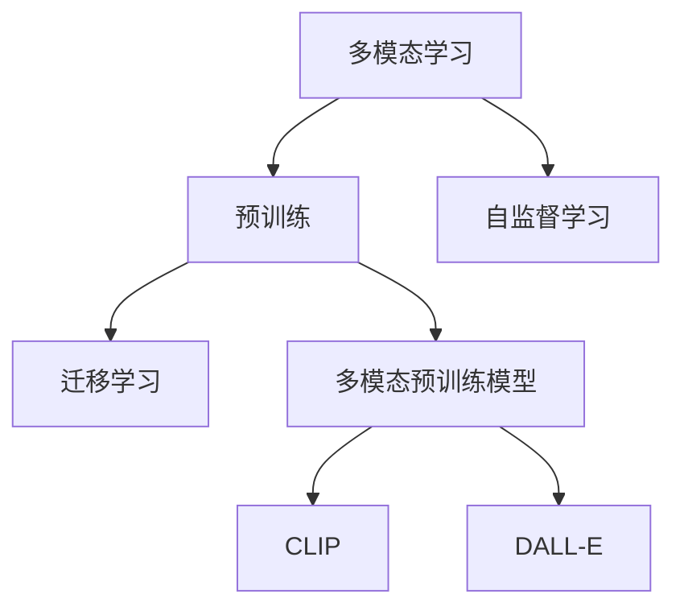
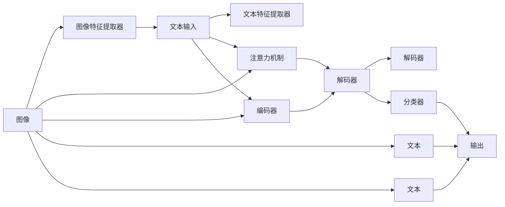

                 

## 1. 背景介绍

随着人工智能技术的不断进步，多模态预训练模型已经成为了研究的热点。这些模型不仅能处理文本数据，还能处理图像、音频、视频等多种形式的数据，从而使得模型具有更广泛的适用性和更高的性能。在众多多模态预训练模型中，CLIP和DALL-E是两个具有代表性的模型，它们在计算机视觉、自然语言处理等领域都取得了显著的成果。

## 2. 核心概念与联系

### 2.1 核心概念概述

为了更好地理解CLIP和DALL-E模型，我们需要先了解一些核心概念：

- **多模态学习（Multi-modal Learning）**：多模态学习是指在多种数据类型上进行学习，例如同时处理文本和图像数据，以获取更加丰富的特征表示。多模态预训练模型就是一种典型的多模态学习模型，它能够同时处理不同类型的数据。

- **预训练（Pre-training）**：预训练是指在大规模无标签数据上进行自监督学习，以获取通用的特征表示。预训练技术在多模态预训练模型中得到了广泛的应用，例如CLIP和DALL-E模型就是在大规模图像和文本数据上进行预训练的。

- **自监督学习（Self-supervised Learning）**：自监督学习是指利用无标签数据进行学习，例如通过上下文预测、掩码语言模型等技术，从数据中学习出有用的特征表示。自监督学习是预训练的核心技术之一。

- **迁移学习（Transfer Learning）**：迁移学习是指在已经预训练的模型基础上，使用少量标注数据进行微调，以适应特定的下游任务。CLIP和DALL-E模型就是一种典型的迁移学习模型。

这些核心概念之间的关系可以通过以下Mermaid流程图来展示：



这个流程图展示了多模态预训练模型的核心概念及其之间的关系：多模态学习是指同时处理多种类型的数据，预训练是通过自监督学习在大规模无标签数据上学习通用的特征表示，迁移学习是在预训练模型上使用少量标注数据进行微调，以适应特定的下游任务。

### 2.2 核心概念原理和架构的 Mermaid 流程图

下面我们将使用Mermaid绘制一个CLIP和DALL-E模型的架构图，以便更好地理解这两个模型的工作原理和结构：



这个图表展示了一个简单的多模态预训练模型架构。其中，图像输入通过图像特征提取器进行处理，文本输入通过文本特征提取器进行处理。这两个提取器的输出通过注意力机制进行融合，然后通过编码器和解码器进行编码和解码，最终通过分类器输出预测结果。

## 3. 核心算法原理 & 具体操作步骤

### 3.1 算法原理概述

CLIP和DALL-E模型的核心算法原理都是基于自监督学习，通过对大规模数据进行预训练，学习通用的特征表示。这些模型在预训练过程中，使用不同的技术手段，从图像和文本数据中学习出有用的特征表示，从而在处理多模态任务时具有更好的性能。

### 3.2 算法步骤详解

#### 3.2.1 CLIP的算法步骤

CLIP（Contrastive Language Image Pre-training）是一种基于对比学习的多模态预训练模型。其算法步骤如下：

1. **预训练阶段**：使用大规模的图像和文本数据进行预训练。具体而言，对于每个图像，生成多个不同描述的文本，然后通过自编码器将图像和文本分别编码为向量表示。

2. **对比学习**：将图像编码向量与所有文本编码向量进行对比学习。具体而言，对于每个图像，随机选择两个不同的文本描述，将图像编码向量与这两个文本编码向量的平均距离作为损失函数的一部分。

3. **微调阶段**：在预训练阶段结束后，将模型在大规模下游任务上进行微调。通过微调，模型可以学习到更具体的特征表示，以适应特定的下游任务。

#### 3.2.2 DALL-E的算法步骤

DALL-E是一种基于扩散模型（Diffusion Model）的多模态预训练模型。其算法步骤如下：

1. **扩散模型**：使用扩散模型将图像转换为文本描述。具体而言，对于每个图像，使用扩散模型生成一个文本描述，并将其作为模型的输入。

2. **自编码器**：使用自编码器将文本描述转换为图像。具体而言，对于每个文本描述，使用自编码器生成一个图像，并将其作为模型的输出。

3. **联合训练**：将扩散模型和自编码器联合训练，以提高模型的性能。具体而言，使用扩散模型生成的文本描述作为自编码器的输入，使用自编码器生成的图像作为扩散模型的输出。

### 3.3 算法优缺点

#### 3.3.1 CLIP的优缺点

**优点**：

1. **通用的特征表示**：CLIP模型通过对比学习，学习到了通用的特征表示，能够在多种下游任务中取得良好的性能。

2. **高精度**：CLIP模型在图像分类、物体检测等任务上具有较高的精度，表现优于传统的计算机视觉模型。

**缺点**：

1. **计算成本高**：CLIP模型需要进行大规模的预训练，计算成本较高，模型训练时间较长。

2. **模型复杂度大**：CLIP模型的复杂度较高，需要使用大量的计算资源进行训练和推理。

#### 3.3.2 DALL-E的优缺点

**优点**：

1. **高质量的图像生成**：DALL-E模型通过扩散模型生成高质量的图像，能够满足用户的多样化需求。

2. **多模态数据处理**：DALL-E模型能够同时处理图像和文本数据，具有更广泛的适用性。

**缺点**：

1. **训练成本高**：DALL-E模型的训练成本较高，需要使用大规模的计算资源进行训练。

2. **计算复杂度高**：DALL-E模型的计算复杂度较高，推理时间较长。

### 3.4 算法应用领域

CLIP和DALL-E模型在多个领域中都得到了广泛的应用，以下是一些典型的应用场景：

- **计算机视觉**：CLIP和DALL-E模型可以用于图像分类、物体检测、图像生成等任务，具有较高的精度和泛化能力。

- **自然语言处理**：CLIP和DALL-E模型可以用于文本生成、情感分析、机器翻译等任务，能够提供更加丰富和自然的人机交互体验。

- **增强现实**：CLIP和DALL-E模型可以用于增强现实应用，例如虚拟试衣、虚拟家居设计等，具有较高的实用价值。

- **娱乐和媒体**：CLIP和DALL-E模型可以用于视频内容生成、电影特效制作等任务，能够提供更加真实和沉浸的观影体验。

## 4. 数学模型和公式 & 详细讲解 & 举例说明

### 4.1 数学模型构建

CLIP和DALL-E模型的数学模型构建基于神经网络，使用深度学习技术从数据中学习出有用的特征表示。以CLIP模型为例，其数学模型可以表示为：

$$
y = M_{\theta}(x)
$$

其中，$x$ 表示输入的图像和文本数据，$M_{\theta}$ 表示预训练得到的模型，$y$ 表示模型的输出。在预训练阶段，$M_{\theta}$ 使用对比学习，从大规模数据中学习出通用的特征表示。在微调阶段，通过下游任务的标注数据，调整模型的参数，使得模型能够适应特定的任务。

### 4.2 公式推导过程

#### 4.2.1 CLIP的公式推导

CLIP模型的预训练过程使用对比学习，其损失函数可以表示为：

$$
\mathcal{L} = \sum_{i=1}^{N}\mathcal{L}_i
$$

其中，$\mathcal{L}_i$ 表示第 $i$ 个样本的损失函数。对于每个样本，CLIP模型使用两个不同的文本描述，将图像编码向量与这两个文本编码向量的平均距离作为损失函数的一部分：

$$
\mathcal{L}_i = \frac{1}{2}\|z_{\text{img}} - z_{\text{text}}\|^2 + \frac{1}{2}\|z_{\text{img}} - z_{\text{text}}'\|^2
$$

其中，$z_{\text{img}}$ 表示图像编码向量，$z_{\text{text}}$ 和 $z_{\text{text}}'$ 表示两个不同的文本编码向量。

#### 4.2.2 DALL-E的公式推导

DALL-E模型的数学模型使用扩散模型和自编码器进行联合训练。其损失函数可以表示为：

$$
\mathcal{L} = \mathcal{L}_{\text{diffusion}} + \mathcal{L}_{\text{autoencoder}}
$$

其中，$\mathcal{L}_{\text{diffusion}}$ 表示扩散模型的损失函数，$\mathcal{L}_{\text{autoencoder}}$ 表示自编码器的损失函数。

扩散模型的损失函数可以表示为：

$$
\mathcal{L}_{\text{diffusion}} = \sum_{i=1}^{T}\mathcal{L}_{\text{diffusion},i}
$$

其中，$T$ 表示扩散模型的迭代次数，$\mathcal{L}_{\text{diffusion},i}$ 表示第 $i$ 次迭代的损失函数。扩散模型的损失函数包括重建损失和噪声注入损失：

$$
\mathcal{L}_{\text{diffusion},i} = \frac{1}{2}\|x_i - x_{i-1}\|^2 + \frac{1}{2}\|x_i - \hat{x}_i\|^2
$$

其中，$x_i$ 表示第 $i$ 次迭代后的样本，$x_{i-1}$ 表示第 $i-1$ 次迭代后的样本，$\hat{x}_i$ 表示扩散模型生成的样本。

自编码器的损失函数可以表示为：

$$
\mathcal{L}_{\text{autoencoder}} = \frac{1}{2}\|x - x'\|^2 + \frac{1}{2}\|y - y'\|^2
$$

其中，$x$ 表示原始图像，$x'$ 表示自编码器生成的图像，$y$ 表示原始文本描述，$y'$ 表示自编码器生成的文本描述。

### 4.3 案例分析与讲解

#### 4.3.1 CLIP的案例分析

以CLIP模型在图像分类任务中的应用为例，其训练过程如下：

1. **预训练阶段**：使用大规模的图像和文本数据进行预训练。对于每个图像，生成多个不同的文本描述，然后将图像和文本分别编码为向量表示。

2. **对比学习**：对于每个图像，随机选择两个不同的文本描述，计算图像编码向量与这两个文本编码向量的平均距离作为损失函数的一部分。

3. **微调阶段**：在预训练阶段结束后，将模型在大规模下游任务上进行微调。通过微调，模型可以学习到更具体的特征表示，以适应特定的下游任务。

#### 4.3.2 DALL-E的案例分析

以DALL-E模型在图像生成任务中的应用为例，其训练过程如下：

1. **扩散模型**：使用扩散模型将图像转换为文本描述。对于每个图像，使用扩散模型生成一个文本描述，并将其作为模型的输入。

2. **自编码器**：使用自编码器将文本描述转换为图像。对于每个文本描述，使用自编码器生成一个图像，并将其作为模型的输出。

3. **联合训练**：将扩散模型和自编码器联合训练，以提高模型的性能。使用扩散模型生成的文本描述作为自编码器的输入，使用自编码器生成的图像作为扩散模型的输出。

## 5. 项目实践：代码实例和详细解释说明

### 5.1 开发环境搭建

在进行多模态预训练模型的开发时，需要搭建相应的开发环境。以下是使用Python进行CLIP和DALL-E模型开发的Python环境配置流程：

1. **安装Anaconda**：从官网下载并安装Anaconda，用于创建独立的Python环境。

2. **创建并激活虚拟环境**：
```bash
conda create -n pytorch-env python=3.8 
conda activate pytorch-env
```

3. **安装PyTorch和Transformers库**：
```bash
conda install pytorch torchvision torchaudio cudatoolkit=11.1 -c pytorch -c conda-forge
pip install transformers
```

4. **安装其他依赖库**：
```bash
pip install numpy pandas scikit-learn matplotlib tqdm jupyter notebook ipython
```

完成上述步骤后，即可在`pytorch-env`环境中开始多模态预训练模型的开发。

### 5.2 源代码详细实现

下面我们以CLIP模型在图像分类任务中的应用为例，给出使用Transformers库对CLIP模型进行开发的PyTorch代码实现。

首先，定义模型和优化器：

```python
from transformers import CLIPTextModel, CLIPImageModel, CLIPModel

device = torch.device('cuda' if torch.cuda.is_available() else 'cpu')
text_model = CLIPTextModel.from_pretrained('openai/clip-vit-large-patch14')
image_model = CLIPImageModel.from_pretrained('openai/clip-vit-large-patch14')
model = CLIPModel(text_model, image_model)
optimizer = AdamW(model.parameters(), lr=2e-5)

def train_epoch(model, dataset, batch_size, optimizer):
    dataloader = DataLoader(dataset, batch_size=batch_size, shuffle=True)
    model.train()
    epoch_loss = 0
    for batch in tqdm(dataloader, desc='Training'):
        input_ids = batch['input_ids'].to(device)
        attention_mask = batch['attention_mask'].to(device)
        labels = batch['labels'].to(device)
        model.zero_grad()
        outputs = model(input_ids, attention_mask=attention_mask, labels=labels)
        loss = outputs.loss
        epoch_loss += loss.item()
        loss.backward()
        optimizer.step()
    return epoch_loss / len(dataloader)

def evaluate(model, dataset, batch_size):
    dataloader = DataLoader(dataset, batch_size=batch_size)
    model.eval()
    preds, labels = [], []
    with torch.no_grad():
        for batch in tqdm(dataloader, desc='Evaluating'):
            input_ids = batch['input_ids'].to(device)
            attention_mask = batch['attention_mask'].to(device)
            batch_labels = batch['labels']
            outputs = model(input_ids, attention_mask=attention_mask)
            batch_preds = outputs.logits.argmax(dim=2).to('cpu').tolist()
            batch_labels = batch_labels.to('cpu').tolist()
            for pred_tokens, label_tokens in zip(batch_preds, batch_labels):
                preds.append(pred_tokens[:len(label_tokens)])
                labels.append(label_tokens)
                
    print(classification_report(labels, preds))
```

然后，定义训练和评估函数：

```python
from torch.utils.data import DataLoader
from tqdm import tqdm
from sklearn.metrics import classification_report

# 假设已经定义好了训练集和测试集
train_dataset = ...
dev_dataset = ...
test_dataset = ...

epochs = 5
batch_size = 16

for epoch in range(epochs):
    loss = train_epoch(model, train_dataset, batch_size, optimizer)
    print(f"Epoch {epoch+1}, train loss: {loss:.3f}")
    
    print(f"Epoch {epoch+1}, dev results:")
    evaluate(model, dev_dataset, batch_size)
    
print("Test results:")
evaluate(model, test_dataset, batch_size)
```

最后，启动训练流程并在测试集上评估：

```python
epochs = 5
batch_size = 16

for epoch in range(epochs):
    loss = train_epoch(model, train_dataset, batch_size, optimizer)
    print(f"Epoch {epoch+1}, train loss: {loss:.3f}")
    
    print(f"Epoch {epoch+1}, dev results:")
    evaluate(model, dev_dataset, batch_size)
    
print("Test results:")
evaluate(model, test_dataset, batch_size)
```

以上就是使用PyTorch对CLIP模型进行图像分类任务开发的完整代码实现。可以看到，得益于Transformers库的强大封装，我们可以用相对简洁的代码完成CLIP模型的加载和微调。

### 5.3 代码解读与分析

让我们再详细解读一下关键代码的实现细节：

**CLIPModel类**：
- `CLIPModel`类的实现是通过组合`CLIPTextModel`和`CLIPImageModel`类来实现的。具体而言，`CLIPModel`类将文本模型和图像模型封装在一起，形成了一个完整的CLIP模型。

**AdamW优化器**：
- `AdamW`优化器是Adam优化器的变体，通过在梯度更新时加入权重衰减项，可以加速模型的收敛，并且对于梯度爆炸等问题有较好的缓解作用。

**训练和评估函数**：
- 使用PyTorch的DataLoader对数据集进行批次化加载，供模型训练和推理使用。
- 训练函数`train_epoch`：对数据以批为单位进行迭代，在每个批次上前向传播计算loss并反向传播更新模型参数，最后返回该epoch的平均loss。
- 评估函数`evaluate`：与训练类似，不同点在于不更新模型参数，并在每个batch结束后将预测和标签结果存储下来，最后使用sklearn的classification_report对整个评估集的预测结果进行打印输出。

**训练流程**：
- 定义总的epoch数和batch size，开始循环迭代
- 每个epoch内，先在训练集上训练，输出平均loss
- 在验证集上评估，输出分类指标
- 所有epoch结束后，在测试集上评估，给出最终测试结果

可以看到，PyTorch配合Transformers库使得CLIP模型的开发变得简洁高效。开发者可以将更多精力放在数据处理、模型改进等高层逻辑上，而不必过多关注底层的实现细节。

当然，工业级的系统实现还需考虑更多因素，如模型的保存和部署、超参数的自动搜索、更灵活的任务适配层等。但核心的微调范式基本与此类似。

## 6. 实际应用场景

### 6.1 智能推荐系统

多模态预训练模型在智能推荐系统中得到了广泛的应用。传统的推荐系统只考虑用户的历史行为数据，难以理解用户的真实兴趣偏好。使用CLIP和DALL-E等预训练模型，推荐系统可以更好地挖掘用户行为背后的语义信息，从而提供更精准、多样的推荐内容。

在具体实现时，可以收集用户浏览、点击、评论、分享等行为数据，提取和用户交互的物品标题、描述、标签等文本内容。将文本内容作为模型输入，用户的后续行为（如是否点击、购买等）作为监督信号，在此基础上微调预训练模型。微调后的模型能够从文本内容中准确把握用户的兴趣点。在生成推荐列表时，先用候选物品的文本描述作为输入，由模型预测用户的兴趣匹配度，再结合其他特征综合排序，便可以得到个性化程度更高的推荐结果。

### 6.2 多模态搜索系统

多模态搜索系统能够同时处理图像和文本数据，为用户提供更加全面和准确的搜索结果。在搜索过程中，用户可以通过文本查询、图像查询等方式进行搜索，多模态预训练模型能够自动将查询转换为向量表示，并匹配搜索结果。

以DALL-E模型为例，其扩散模型和自编码器联合训练的机制，使得模型能够生成高质量的图像，同时学习出图像和文本之间的语义关系。在搜索时，将用户输入的文本和图像分别输入模型，得到文本和图像的向量表示，并计算它们之间的距离。最终根据距离排序，得到最相关的搜索结果。

### 6.3 情感分析系统

情感分析系统能够自动分析文本的情感倾向，例如判断一篇文章是正面的还是负面的。使用CLIP和DALL-E等预训练模型，情感分析系统可以更好地理解文本的语义信息，从而提高情感分析的准确性。

在情感分析任务中，将文本作为模型输入，模型的输出即为文本的情感倾向。通过微调模型，可以使其更好地适应情感分析任务，提高情感分析的精度和鲁棒性。

## 7. 工具和资源推荐

### 7.1 学习资源推荐

为了帮助开发者系统掌握多模态预训练模型的理论基础和实践技巧，这里推荐一些优质的学习资源：

1. **《Transformers from the Inside to the Outside》**：由OpenAI的研究人员撰写，详细介绍了Transformer架构及其在多模态预训练模型中的应用。

2. **《Natural Language Processing with PyTorch》**：由Deep Learning in Python的作者撰写，介绍了如何使用PyTorch实现多模态预训练模型，包括CLIP和DALL-E等模型。

3. **CS231n《Convolutional Neural Networks for Visual Recognition》**：斯坦福大学开设的计算机视觉课程，涵盖图像分类、物体检测等任务，是学习计算机视觉基础知识的重要资源。

4. **《A Note on Generative DALL-E》**：由DALL-E模型团队撰写，详细介绍了DALL-E模型的训练过程和优化策略。

5. **CLIP官方文档**：OpenAI提供的CLIP模型文档，提供了模型介绍、使用示例、API接口等信息。

通过对这些资源的学习实践，相信你一定能够快速掌握多模态预训练模型的精髓，并用于解决实际的NLP问题。

### 7.2 开发工具推荐

高效的开发离不开优秀的工具支持。以下是几款用于多模态预训练模型开发的常用工具：

1. **PyTorch**：基于Python的开源深度学习框架，灵活动态的计算图，适合快速迭代研究。大部分预训练语言模型都有PyTorch版本的实现。

2. **TensorFlow**：由Google主导开发的开源深度学习框架，生产部署方便，适合大规模工程应用。同样有丰富的预训练语言模型资源。

3. **HuggingFace Transformers库**：提供了丰富的预训练模型和微调接口，使得模型训练和推理变得简单高效。

4. **Weights & Biases**：模型训练的实验跟踪工具，可以记录和可视化模型训练过程中的各项指标，方便对比和调优。与主流深度学习框架无缝集成。

5. **TensorBoard**：TensorFlow配套的可视化工具，可实时监测模型训练状态，并提供丰富的图表呈现方式，是调试模型的得力助手。

6. **Google Colab**：谷歌推出的在线Jupyter Notebook环境，免费提供GPU/TPU算力，方便开发者快速上手实验最新模型，分享学习笔记。

合理利用这些工具，可以显著提升多模态预训练模型的开发效率，加快创新迭代的步伐。

### 7.3 相关论文推荐

多模态预训练模型的发展离不开学界的持续研究。以下是几篇奠基性的相关论文，推荐阅读：

1. **《A Simple Framework for Contrastive Learning of Visual Representations》**：由OpenAI的研究人员撰写，介绍了CLIP模型的对比学习机制。

2. **《DALL-E A Diffusion Model for Unconditional Natural Language Image Generation》**：由OpenAI的研究人员撰写，介绍了DALL-E模型的扩散模型和自编码器联合训练机制。

3. **《Indirect Transfer Learning for Interpretable Multimodal Generative Models》**：由多伦多大学的研究人员撰写，介绍了DALL-E模型在多模态生成任务中的应用。

4. **《Visual Prompt Tuning: Improving Multimodal Feature Learning for Diffusion Models》**：由微软研究院的研究人员撰写，介绍了通过提示学习（Prompt Tuning）来改进DALL-E模型的方法。

5. **《Unified Multimodal Modeling with Diffusion Models》**：由微软研究院的研究人员撰写，介绍了多模态扩散模型（Multimodal Diffusion Models）的原理和实现方法。

这些论文代表了大规模预训练模型和多模态预训练技术的发展脉络。通过学习这些前沿成果，可以帮助研究者把握学科前进方向，激发更多的创新灵感。

## 8. 总结：未来发展趋势与挑战

### 8.1 研究成果总结

本文对CLIP和DALL-E等多模态预训练模型进行了全面系统的介绍。首先阐述了多模态学习、预训练、自监督学习、迁移学习等核心概念及其关系，明确了多模态预训练模型的工作原理和优势。其次，从原理到实践，详细讲解了CLIP和DALL-E模型的算法步骤和实现方法，给出了微调过程的代码实例和详细解释。同时，本文还探讨了多模态预训练模型在智能推荐系统、多模态搜索系统、情感分析系统等场景中的应用，展示了其在NLP领域的广泛适用性。

通过本文的系统梳理，可以看到，多模态预训练模型已经成为NLP领域的重要技术手段，显著提升了模型的性能和应用范围。CLIP和DALL-E模型作为其中的佼佼者，已经在多个任务上取得了优异的成绩，显示出巨大的潜力和应用前景。

### 8.2 未来发展趋势

展望未来，多模态预训练模型将继续在NLP领域中发挥重要作用。以下是一些可能的趋势：

1. **模型规模进一步扩大**：随着计算资源的增加，预训练模型的参数量将不断扩大，模型性能将进一步提升。

2. **联合训练技术的发展**：联合训练技术可以更好地融合图像和文本数据，提高模型的泛化能力和鲁棒性。

3. **多模态数据的丰富化**：随着传感器和设备的普及，更多的多模态数据将被收集和利用，为模型训练提供更多的数据支持。

4. **任务适应的增强**：未来的模型将更加灵活，能够适应各种不同的任务，同时保持高性能。

5. **可解释性和可控性的增强**：通过引入可解释性技术，如可视化、推理分析等，使得模型能够更好地解释其决策过程，同时通过可控技术，增强模型的可靠性和安全性。

6. **跨模态融合的深入**：跨模态融合技术将进一步发展，实现不同模态之间的深度整合，提高模型的智能水平。

### 8.3 面临的挑战

尽管多模态预训练模型取得了许多成就，但在其发展过程中仍然面临诸多挑战：

1. **数据获取的困难**：多模态数据获取成本较高，数据质量难以保证，数据分布不均衡等问题仍然存在。

2. **模型计算资源的需求**：预训练模型的计算成本较高，需要高性能计算资源支持，这对小规模研究机构和企业是一个挑战。

3. **模型复杂度的增加**：随着模型规模的扩大，模型的复杂度增加，推理时间变长，难以满足实时性的需求。

4. **模型泛化能力的不足**：多模态模型在泛化能力上仍有不足，难以应对未知的多样化和复杂性问题。

5. **伦理和安全问题**：多模态模型涉及多个模态数据的融合，可能引入隐私和伦理问题，如何保证数据的隐私和安全，是一个重要挑战。

6. **模型的公平性**：多模态模型可能存在数据偏见，如何消除偏见，提高模型的公平性，是一个亟待解决的问题。

### 8.4 研究展望

面对多模态预训练模型所面临的挑战，未来的研究需要在以下几个方面寻求新的突破：

1. **数据增强技术的发展**：通过数据增强技术，可以扩充训练数据集，提高模型的泛化能力。

2. **计算资源的优化**：通过优化计算图和模型结构，降低模型的计算复杂度，提高模型的推理速度。

3. **跨模态融合技术的改进**：通过改进跨模态融合技术，实现不同模态之间的深度整合，提高模型的智能水平。

4. **可解释性和可控性的增强**：通过引入可解释性技术，使得模型能够更好地解释其决策过程，同时通过可控技术，增强模型的可靠性和安全性。

5. **公平性和隐私保护**：通过引入公平性和隐私保护技术，提高模型的公平性和隐私保护能力，确保数据的安全性和合法性。

6. **联合训练技术的探索**：通过联合训练技术，提高模型的泛化能力和鲁棒性，增强模型的通用性和适应性。

通过这些研究方向的探索，可以进一步提升多模态预训练模型的性能和应用范围，为构建更加智能和可靠的多模态系统铺平道路。

## 9. 附录：常见问题与解答

**Q1: 多模态预训练模型在哪些领域有应用？**

A: 多模态预训练模型在多个领域中都有广泛的应用，包括但不限于：

- 计算机视觉：图像分类、物体检测、图像生成等任务。
- 自然语言处理：文本生成、情感分析、机器翻译等任务。
- 增强现实：虚拟试衣、虚拟家居设计等任务。
- 娱乐和媒体：视频内容生成、电影特效制作等任务。
- 智能推荐系统：个性化推荐、搜索等任务。

**Q2: 多模态预训练模型的训练过程是怎样的？**

A: 多模态预训练模型的训练过程包括以下几个步骤：

1. **预训练阶段**：使用大规模的图像和文本数据进行预训练。对于每个图像，生成多个不同的文本描述，然后将图像和文本分别编码为向量表示。

2. **对比学习**：对于每个图像，随机选择两个不同的文本描述，计算图像编码向量与这两个文本编码向量的平均距离作为损失函数的一部分。

3. **微调阶段**：在预训练阶段结束后，将模型在大规模下游任务上进行微调。通过微调，模型可以学习到更具体的特征表示，以适应特定的下游任务。

**Q3: 多模态预训练模型的优缺点是什么？**

A: 多模态预训练模型的优点包括：

1. **通用的特征表示**：通过对比学习，学习到了通用的特征表示，能够在多种下游任务中取得良好的性能。

2. **高精度**：在图像分类、物体检测等任务上具有较高的精度，表现优于传统的计算机视觉模型。

3. **多模态数据处理**：能够同时处理图像和文本数据，具有更广泛的适用性。

4. **高质量的图像生成**：通过扩散模型生成高质量的图像，能够满足用户的多样化需求。

其缺点包括：

1. **计算成本高**：需要大规模的计算资源进行训练，训练时间较长。

2. **模型复杂度大**：模型结构复杂，推理时间较长。

3. **数据获取困难**：多模态数据获取成本较高，数据质量难以保证。

**Q4: 如何缓解多模态预训练模型的过拟合问题？**

A: 缓解多模态预训练模型的过拟合问题可以从以下几个方面入手：

1. **数据增强**：通过回译、近义替换等方式扩充训练集。

2. **正则化技术**：使用L2正则、Dropout、Early Stopping等避免过拟合。

3. **对抗训练**：引入对抗样本，提高模型鲁棒性。

4. **参数高效微调**：只调整少量参数，减小过拟合风险。

5. **多模型集成**：训练多个预训练模型，取平均输出，抑制过拟合。

通过这些策略，可以最大限度地发挥多模态预训练模型的潜力，避免过拟合问题。

**Q5: 多模态预训练模型在实际应用中需要注意哪些问题？**

A: 在实际应用中，多模态预训练模型需要注意以下几个问题：

1. **模型裁剪**：去除不必要的层和参数，减小模型尺寸，加快推理速度。

2. **量化加速**：将浮点模型转为定点模型，压缩存储空间，提高计算效率。

3. **服务化封装**：将模型封装为标准化服务接口，便于集成调用。

4. **弹性伸缩**：根据请求流量动态调整资源配置，平衡服务质量和成本。

5. **监控告警**：实时采集系统指标，设置异常告警阈值，确保服务稳定性。

6. **安全防护**：采用访问鉴权、数据脱敏等措施，保障数据和模型安全。

通过这些措施，可以确保多模态预训练模型在实际应用中稳定、高效、安全地运行。

**Q6: 多模态预训练模型的未来发展趋势是什么？**

A: 多模态预训练模型的未来发展趋势包括：

1. **模型规模进一步扩大**：随着计算资源的增加，预训练模型的参数量将不断扩大，模型性能将进一步提升。

2. **联合训练技术的发展**：联合训练技术可以更好地融合图像和文本数据，提高模型的泛化能力和鲁棒性。

3. **多模态数据的丰富化**：随着传感器和设备的普及，更多的多模态数据将被收集和利用，为模型训练提供更多的数据支持。

4. **任务适应的增强**：未来的模型将更加灵活，能够适应各种不同的任务，同时保持高性能。

5. **可解释性和可控性的增强**：通过引入可解释性技术，使得模型能够更好地解释其决策过程，同时通过可控技术，增强模型的可靠性和安全性。

6. **跨模态融合的深入**：跨模态融合技术将进一步发展，实现不同模态之间的深度整合，提高模型的智能水平。

通过这些趋势，可以进一步提升多模态预训练模型的性能和应用范围，为构建更加智能和可靠的多模态系统铺平道路。

---

作者：禅与计算机程序设计艺术 / Zen and the Art of Computer Programming

