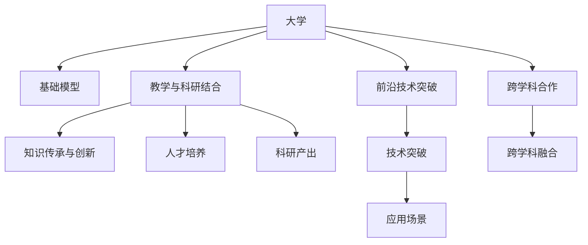

                 

# 大学在基础模型中的研究使命

> 关键词：
- 大学
- 基础模型
- 研究使命
- 人工智能
- 教学与科研结合
- 前沿技术突破
- 跨学科合作

## 1. 背景介绍

在人工智能(AI)技术的飞速发展下，大学作为知识创新和人才培养的重要基地，承担着基础模型研究的重要使命。基础模型，如语言模型、图像模型等，是大数据时代AI研究的基石，其研究成果广泛应用于各个领域，推动了科技和社会的进步。然而，面对新的技术挑战和应用需求，大学在基础模型研究中需要重新定位，明确研究目标，创新教学方法，培养更多AI领域的人才。

## 2. 核心概念与联系

### 2.1 核心概念概述

为更好地理解大学在基础模型研究中的角色，本节将介绍几个密切相关的核心概念：

- 大学：高等教育机构，肩负着知识传承和创新、人才培养和科研、社会服务和文化传承等四大职能。
- 基础模型：指广泛应用于各种AI应用的基础性模型，如BERT、GPT、ViT等。
- 研究使命：指大学在基础模型领域所肩负的任务和责任，包括前沿研究、教学和人才培养、跨学科合作等。
- 教学与科研结合：大学科研与教学互相促进，产学研一体化，共同推动科学技术的进步。
- 前沿技术突破：大学应紧跟技术发展前沿，积极探索新的技术和方法，引领科研方向。
- 跨学科合作：AI领域的突破往往依赖于多个学科的交叉合作，大学应促进不同学科的融合和交流。

这些核心概念共同构成了大学在基础模型研究中的基本框架，指导着大学在这一领域的研究方向和实践活动。

### 2.2 核心概念原理和架构的 Mermaid 流程图



这个流程图展示了大学与基础模型的核心联系：

1. 大学通过基础模型的研究，推动知识的传承与创新。
2. 教学与科研结合，培养更多AI领域的人才。
3. 大学需要突破前沿技术，引领AI科研方向。
4. 跨学科合作，促进知识的融合和交流。

这些联系体现了大学在基础模型研究中的关键作用，是其实现科研与教学、教育与创新的桥梁。

## 3. 核心算法原理 & 具体操作步骤

### 3.1 算法原理概述

大学在基础模型研究中的主要任务是通过科研和教学，推动模型的不断创新和优化。其核心算法原理包括以下几个方面：

- **基础模型创新**：通过最新的理论和技术，创新和发展新的基础模型，提升模型的性能和应用范围。
- **教学内容更新**：及时将最新的模型和技术融入教学内容，确保学生掌握前沿知识。
- **跨学科合作**：鼓励不同学科之间的交流与合作，促进基础模型应用的扩展。

### 3.2 算法步骤详解

基于上述算法原理，大学在基础模型研究中的具体操作步骤可以分为以下几个步骤：

1. **科研立项与合作**：确定研究方向，申请科研立项，与企业、研究机构等进行合作，获取必要的资金和资源。
2. **基础模型开发与优化**：开发新的基础模型，或对已有模型进行优化和创新。
3. **教学内容更新**：将最新的研究成果和模型应用于教学内容，更新教材和课程设计。
4. **跨学科合作与交流**：组织跨学科团队，定期举办研讨会、讲座等活动，促进学科融合。
5. **实验与评估**：进行实验验证和效果评估，确保模型的创新性和实用性。

### 3.3 算法优缺点

大学在基础模型研究中具有以下优点：

- **创新能力**：大学汇聚了众多优秀科研人员，具备强大的创新能力，能够推动基础模型的进步。
- **教学优势**：大学具备丰富的教学资源和经验，能够培养更多具备实战能力的AI人才。
- **跨学科合作**：大学能够促进不同学科之间的交流与合作，实现更广泛的知识融合和创新。

然而，大学在基础模型研究中也存在一些缺点：

- **资源有限**：相对于企业，大学在资金、设备和人才等方面可能存在不足，限制了某些研究方向和规模。
- **成果转化慢**：大学的研究往往偏重于理论创新，对于实际应用和产业化的转化速度较慢。
- **教学与科研分离**：在某些大学，教学与科研可能存在一定的脱节，难以实现紧密结合。

### 3.4 算法应用领域

大学在基础模型研究中的应用领域广泛，涵盖以下几个方面：

- **基础模型创新**：如BERT、GPT、ViT等模型的开发和优化。
- **教学与科研结合**：将最新研究成果应用于教学，培养更多具备创新能力的AI人才。
- **跨学科合作**：促进计算机科学、数学、统计学、工程学等学科之间的交流与合作。
- **技术突破**：在深度学习、自然语言处理、计算机视觉等领域进行前沿技术探索。

## 4. 数学模型和公式 & 详细讲解 & 举例说明

### 4.1 数学模型构建

大学在基础模型研究中的数学模型构建，通常涉及以下几个方面：

- **深度学习模型**：如卷积神经网络(CNN)、循环神经网络(RNN)、Transformer等。
- **优化算法**：如梯度下降、Adam等。
- **数据集构建**：如ImageNet、COCO等大型数据集。

### 4.2 公式推导过程

以Transformer模型为例，其公式推导过程如下：

$$
H = XW^W + YW^Y + \text{Attention}(X, Y) + \text{Feed Forward}(X + \text{Attention}(X, Y))
$$

其中，$H$ 为模型的最终输出，$X$ 和 $Y$ 分别为输入和输出，$W^W$ 和 $W^Y$ 为权重矩阵，$\text{Attention}$ 为注意力机制，$\text{Feed Forward}$ 为前馈层。

### 4.3 案例分析与讲解

Transformer模型的核心是自注意力机制(Attention)，大学可以通过理论研究和技术创新，进一步优化这一机制。例如，可以探索更高效的注意力算法，如稀疏注意力、分布式注意力等，提升模型的计算效率和性能。

## 5. 项目实践：代码实例和详细解释说明

### 5.1 开发环境搭建

在大学基础模型研究中，Python和TensorFlow是最常用的编程语言和框架。以下是在这些工具下搭建开发环境的步骤：

1. 安装Anaconda：从官网下载并安装Anaconda，用于创建独立的Python环境。

2. 创建并激活虚拟环境：
```bash
conda create -n pytorch-env python=3.8 
conda activate pytorch-env
```

3. 安装PyTorch：根据CUDA版本，从官网获取对应的安装命令。例如：
```bash
conda install pytorch torchvision torchaudio cudatoolkit=11.1 -c pytorch -c conda-forge
```

4. 安装TensorFlow：
```bash
conda install tensorflow -c conda-forge
```

5. 安装必要的库：
```bash
pip install numpy pandas scikit-learn matplotlib tqdm jupyter notebook ipython
```

完成上述步骤后，即可在`pytorch-env`环境中开始基础模型的研究和实践。

### 5.2 源代码详细实现

以下是一个使用PyTorch实现Transformer模型的示例代码：

```python
import torch
import torch.nn as nn
import torch.nn.functional as F

class TransformerBlock(nn.Module):
    def __init__(self, dim, heads, dropout=0.1):
        super(TransformerBlock, self).__init__()
        self.att = nn.MultiheadAttention(dim, heads, dropout=dropout)
        self.attn = nn.Linear(dim, dim)
        self.pattn = nn.Linear(dim, dim)
        self.dense = nn.Linear(dim, dim)
        self.act = nn.SELU()
        self.dropout = nn.Dropout(dropout)
    
    def forward(self, x, mask):
        res = x
        x, _ = self.att(x, x, x, mask=mask)
        x = self.dropout(x)
        x = x + res
        x = F.linear(x, self.attn.weight, self.attn.bias)
        x = F.linear(x, self.pattn.weight, self.pattn.bias)
        x = self.dense(x)
        x = self.act(x)
        x = self.dropout(x)
        x = x + res
        return x
```

### 5.3 代码解读与分析

这个代码片段实现了Transformer模型中的一个TransformerBlock。TransformerBlock由多个线性层和激活函数组成，能够进行自注意力机制的计算。其中，`nn.MultiheadAttention`用于计算多头注意力，`nn.Linear`和`nn.SELU`用于进行线性变换和激活，`nn.Dropout`用于避免过拟合。

### 5.4 运行结果展示

使用上述代码实现Transformer模型，可以用于处理文本、图像等数据，并进行预测、分类等任务。以下是一个使用Transformer模型进行文本分类的示例：

```python
import torch
import torch.nn as nn
import torch.optim as optim

class TransformerClassifier(nn.Module):
    def __init__(self, num_classes, dim, heads, dropout):
        super(TransformerClassifier, self).__init__()
        self.block = TransformerBlock(dim, heads, dropout)
        self.fc = nn.Linear(dim, num_classes)
        self.softmax = nn.Softmax(dim=-1)
    
    def forward(self, x, mask):
        x = self.block(x, mask)
        x = self.fc(x)
        return self.softmax(x)

model = TransformerClassifier(num_classes=10, dim=512, heads=8, dropout=0.1)
optimizer = optim.Adam(model.parameters(), lr=0.001)

criterion = nn.CrossEntropyLoss()
loss = criterion(model(train_x), train_y)

for epoch in range(10):
    optimizer.zero_grad()
    output = model(train_x, train_mask)
    loss = criterion(output, train_y)
    loss.backward()
    optimizer.step()
    print('Epoch {} Loss: {}'.format(epoch+1, loss.item()))
```

## 6. 实际应用场景

### 6.1 医疗诊断

在大学基础模型研究中，医疗诊断是一个重要的应用场景。通过医疗影像分析、病历处理等，可以显著提高医疗诊断的准确性和效率。

以图像识别为例，大学可以研究基于深度学习的基础模型，如卷积神经网络(CNN)，用于医学影像的分类和分割。这些模型通过大量医疗影像数据的训练，能够识别出肿瘤、血管、器官等关键结构，辅助医生进行诊断和治疗。

### 6.2 智能制造

在智能制造领域，大学可以研究基于深度学习的基础模型，用于工厂生产线的实时监控和故障诊断。例如，使用计算机视觉技术，分析生产设备的运行状态和健康状况，及时发现异常并进行维护，避免生产中断和设备损坏。

### 6.3 金融风险评估

在金融领域，大学可以研究基于深度学习的基础模型，用于评估信用风险、市场风险等。这些模型通过分析大量的金融数据，预测客户的违约概率、市场的波动情况等，为金融机构提供决策支持。

### 6.4 未来应用展望

随着AI技术的不断进步，大学在基础模型研究中的角色将更加重要。未来，大学需要在以下几个方面进行突破：

- **跨学科合作**：推动不同学科之间的交流与合作，促进知识的融合和创新。
- **教学与科研结合**：将最新的科研成果及时应用于教学内容，培养更多具备实战能力的AI人才。
- **前沿技术突破**：在深度学习、自然语言处理、计算机视觉等领域进行前沿技术探索，推动模型性能的提升。
- **基础模型创新**：开发新的基础模型，提升模型的应用范围和性能。

## 7. 工具和资源推荐

### 7.1 学习资源推荐

为帮助研究人员深入理解基础模型的原理和实践，以下是一些推荐的学习资源：

- 《Deep Learning》（Ian Goodfellow）：深度学习的经典教材，详细介绍了深度学习模型的基本原理和应用。
- 《Programming Probabilistic Models》（Michael I. Jordan）：介绍了概率模型的编程方法，帮助理解模型的优化和训练。
- 《Artificial Intelligence: A Modern Approach》（Stuart Russell & Peter Norvig）：AI领域的经典教材，涵盖了机器学习、自然语言处理、计算机视觉等多个领域的知识。
- 《CS231n: Convolutional Neural Networks for Visual Recognition》（Stanford University）：斯坦福大学开设的深度学习课程，涉及计算机视觉领域的经典模型。
- 《Natural Language Processing with Transformers》（Jacob Devlin, Ming-Wei Chang, Kenton Lee, Kristina Toutanova）：介绍了Transformer模型在NLP领域的应用，提供了详细的代码和实验结果。

### 7.2 开发工具推荐

在基础模型研究中，以下几个开发工具非常实用：

- PyTorch：开源深度学习框架，灵活动态的计算图，适合快速迭代研究。
- TensorFlow：Google主导的深度学习框架，生产部署方便，适合大规模工程应用。
- Weights & Biases：模型训练的实验跟踪工具，可以记录和可视化模型训练过程中的各项指标，方便对比和调优。
- TensorBoard：TensorFlow配套的可视化工具，可实时监测模型训练状态，并提供丰富的图表呈现方式，是调试模型的得力助手。
- Jupyter Notebook：交互式编程环境，适合研究和实验，支持代码和注释的混合展示。

### 7.3 相关论文推荐

基础模型研究是一个快速发展的领域，以下是几篇奠基性的相关论文，推荐阅读：

- "Attention Is All You Need"（Vaswani et al., 2017）：Transformer模型的原论文，提出了自注意力机制，开启了NLP领域的预训练大模型时代。
- "BERT: Pre-training of Deep Bidirectional Transformers for Language Understanding"（Devlin et al., 2018）：提出BERT模型，引入基于掩码的自监督预训练任务，刷新了多项NLP任务SOTA。
- "BERT Pretraining Approach for Named Entity Recognition"（Sun et al., 2019）：介绍了BERT模型在命名实体识别任务中的应用，展示了其在实体边界标注上的卓越性能。
- "Transformer-XL: Attentive Language Models Beyond a Fixed-Length Context"（Wang et al., 2018）：提出Transformer-XL模型，解决了长序列的注意力机制问题，提升了模型的处理能力。
- "GPT-3: Language Models are Unsupervised Multitask Learners"（Brown et al., 2020）：展示了GPT-3模型在零样本、少样本学习和跨领域迁移能力上的突破，为AI研究带来了新的思路。

## 8. 总结：未来发展趋势与挑战

### 8.1 研究成果总结

大学在基础模型研究中，已经取得了一系列重要成果，推动了AI技术的不断进步。通过科学研究和技术创新，大学在深度学习、自然语言处理、计算机视觉等领域，都走在了全球前列。这些成果不仅提升了模型的性能和应用范围，还培养了一大批高素质的AI人才。

### 8.2 未来发展趋势

未来，大学在基础模型研究中的发展趋势包括以下几个方面：

- **跨学科合作**：推动不同学科之间的交流与合作，促进知识的融合和创新。
- **教学与科研结合**：将最新的科研成果及时应用于教学内容，培养更多具备实战能力的AI人才。
- **前沿技术突破**：在深度学习、自然语言处理、计算机视觉等领域进行前沿技术探索，推动模型性能的提升。
- **基础模型创新**：开发新的基础模型，提升模型的应用范围和性能。

### 8.3 面临的挑战

大学在基础模型研究中也面临一些挑战：

- **资源有限**：相对于企业，大学在资金、设备和人才等方面可能存在不足，限制了某些研究方向和规模。
- **成果转化慢**：大学的研究往往偏重于理论创新，对于实际应用和产业化的转化速度较慢。
- **教学与科研分离**：在某些大学，教学与科研可能存在一定的脱节，难以实现紧密结合。

### 8.4 研究展望

面对这些挑战，大学需要在以下几个方面进行改进和突破：

- **优化资源配置**：通过跨校合作、多部门协同等方式，获取更多资源支持。
- **加强产学研合作**：与企业、研究机构等进行深入合作，加速科研成果的产业化。
- **提升教学质量**：加强师资力量建设，提升教学质量，确保培养出具备实战能力的AI人才。
- **促进跨学科合作**：鼓励不同学科之间的交流与合作，推动知识创新和应用突破。

大学作为基础模型研究的重要阵地，需要在科研、教学、产业应用等多个方面进行全面提升，才能真正实现人工智能技术的规模化落地，推动社会的进步和发展。

## 9. 附录：常见问题与解答

**Q1：大学在基础模型研究中面临的主要挑战是什么？**

A: 大学在基础模型研究中面临的主要挑战包括：

- **资源有限**：相对于企业，大学在资金、设备和人才等方面可能存在不足，限制了某些研究方向和规模。
- **成果转化慢**：大学的研究往往偏重于理论创新，对于实际应用和产业化的转化速度较慢。
- **教学与科研分离**：在某些大学，教学与科研可能存在一定的脱节，难以实现紧密结合。

**Q2：大学如何在跨学科合作中促进知识融合？**

A: 大学可以通过以下方式促进跨学科合作，促进知识的融合：

- **成立跨学科研究中心**：建立涵盖多个学科的研究平台，促进不同学科之间的交流与合作。
- **举办跨学科研讨会**：定期举办跨学科的研讨会和讲座，分享不同领域的最新研究成果。
- **联合申请科研项目**：与企业、研究机构等联合申请科研项目，获取更多的资源和合作机会。
- **开设跨学科课程**：在课程设计中引入跨学科内容，培养具备综合能力的AI人才。

**Q3：大学如何提升教学质量，培养更多具备实战能力的AI人才？**

A: 大学可以通过以下方式提升教学质量，培养更多具备实战能力的AI人才：

- **强化师资力量**：招聘高素质的师资队伍，提升教学水平。
- **引入企业实战项目**：与企业合作，引入实战项目，让学生参与实际项目的开发和研究。
- **开展跨学科教学**：在课程设计中引入跨学科内容，培养具备综合能力的AI人才。
- **注重实践环节**：加强实验和实践环节，提升学生的动手能力和项目经验。

**Q4：大学在基础模型研究中如何进行产学研合作？**

A: 大学可以通过以下方式进行产学研合作：

- **与企业合作**：与企业联合申请科研项目，开展联合研究，推动科研成果的产业化。
- **建立合作平台**：建立产学研合作平台，促进科研人员与企业之间的交流与合作。
- **实习和项目合作**：为学生提供实习机会，参与企业的科研项目，提升实战能力。
- **联合培养人才**：与企业联合培养人才，提升学生的工程能力和科研能力。

**Q5：大学在基础模型研究中如何进行前沿技术突破？**

A: 大学可以通过以下方式进行前沿技术突破：

- **关注最新研究动态**：通过参加国际会议、阅读最新论文等方式，及时了解前沿技术的发展。
- **开展前沿研究**：成立前沿技术研究团队，开展高水平的科研攻关。
- **鼓励创新探索**：鼓励研究人员进行创新探索，提出新的理论和算法。
- **多学科交叉融合**：推动不同学科之间的交流与合作，促进知识的融合和创新。

---

作者：禅与计算机程序设计艺术 / Zen and the Art of Computer Programming

