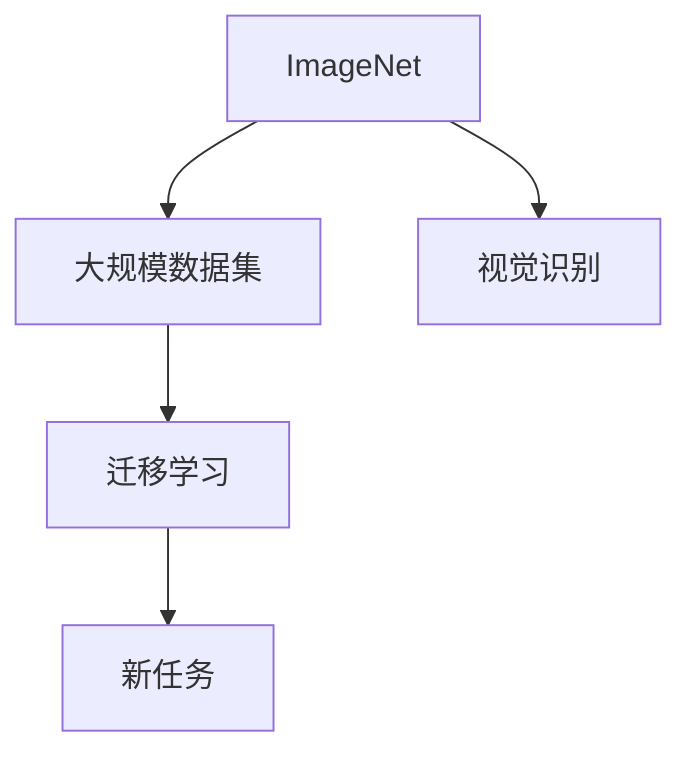

                 

# 大数据的重要性：李飞飞的贡献

在大数据时代，数据无疑是最宝贵的资产之一。从工业界的云计算和物联网，到学术界的机器学习和人工智能，数据无处不在。而在这其中，一个被广泛引用但常被忽视的名字——李飞飞，其贡献对整个大数据生态系统产生了深远影响。

本文将深入探讨李飞飞在人工智能和大数据领域的贡献，并分析其重要性，希望读者能够从中获得关于如何利用和处理大数据的深刻见解。

## 1. 背景介绍

### 1.1 李飞飞简介
李飞飞（Fei-Fei Li），生于1979年，美国斯坦福大学计算机科学系教授，斯坦福视觉实验室主任，CIFAR-10/100的创始成员之一。她以其在大数据、计算机视觉和人工智能领域的卓越贡献而闻名，尤其在大规模视觉数据集上的研究。

### 1.2 大数据在人工智能中的应用
大数据在人工智能中的应用主要体现在以下几个方面：

1. **数据增强**：通过大数据提升模型的泛化能力和性能。
2. **迁移学习**：利用大数据训练的模型，进行知识迁移，提升模型在新任务上的表现。
3. **强化学习**：利用大数据构建环境的模型，进行智能决策。
4. **推荐系统**：根据用户行为数据，提供个性化推荐。

## 2. 核心概念与联系

### 2.1 核心概念概述

李飞飞在大数据领域的核心贡献可以归纳为以下几个关键概念：

1. **ImageNet**：李飞飞主导开发了一个包含1400万张图片、1000个类别的ImageNet数据集，这是目前规模最大、影响力最广的视觉数据集之一。
2. **大规模视觉数据集**：她提出了构建大规模数据集的概念，推动了视觉识别领域的研究进展。
3. **迁移学习**：通过大规模预训练模型，将知识迁移到新任务中，提升模型效果。

### 2.2 核心概念原理和架构的 Mermaid 流程图



## 3. 核心算法原理 & 具体操作步骤

### 3.1 算法原理概述

李飞飞的主要贡献在于推动了大规模数据集和迁移学习在大数据中的应用。其核心思想是利用大数据提升模型的泛化能力，并在此基础上进行迁移学习，将预训练模型应用于新的任务。

### 3.2 算法步骤详解

1. **数据集构建**：构建大规模数据集如ImageNet，用于训练预训练模型。
2. **预训练模型训练**：使用构建的数据集进行大规模预训练，学习通用特征。
3. **迁移学习**：将预训练模型应用到新任务，如图像分类、目标检测等。

### 3.3 算法优缺点

**优点**：

1. 能够大幅提升模型性能，尤其是在数据量有限的情况下。
2. 通用性强，能够应用于多种任务，提升模型泛化能力。

**缺点**：

1. 训练数据集构建成本高。
2. 预训练模型体积大，对计算资源要求高。

### 3.4 算法应用领域

李飞飞的研究成果广泛应用于计算机视觉、自然语言处理、推荐系统等领域。尤其在图像识别和目标检测等方面，ImageNet等大规模数据集起到了至关重要的作用。

## 4. 数学模型和公式 & 详细讲解 & 举例说明

### 4.1 数学模型构建

构建大规模数据集时，首先需要定义数据的结构。以ImageNet为例，其包含1400万张图片，每个图片标注了1000个类别的标签。

### 4.2 公式推导过程

在训练预训练模型时，可以使用常用的分类任务。以二分类任务为例，假设有$N$个训练样本，每个样本有$m$个特征，训练集$\{(x_i, y_i)\}_{i=1}^N$，模型参数为$\theta$，损失函数为$\ell$，则最小化损失函数的目标为：

$$
\min_{\theta} \frac{1}{N} \sum_{i=1}^N \ell(M_{\theta}(x_i), y_i)
$$

其中，$M_{\theta}(x_i)$为模型在输入$x_i$下的输出。

### 4.3 案例分析与讲解

ImageNet数据集用于训练预训练模型，常见的预训练模型包括卷积神经网络（CNN）。以VGGNet为例，其架构包括多个卷积层和全连接层，用于提取图像特征。通过大规模预训练，模型可以学习到通用的图像特征。

## 5. 项目实践：代码实例和详细解释说明

### 5.1 开发环境搭建

搭建开发环境时，需要安装深度学习框架如TensorFlow或PyTorch，并下载预训练模型如VGGNet。

### 5.2 源代码详细实现

以下是使用PyTorch进行VGGNet预训练和迁移学习的代码示例：

```python
import torch
import torch.nn as nn
import torchvision.datasets as datasets
import torchvision.transforms as transforms

# 定义VGGNet模型
class VGGNet(nn.Module):
    def __init__(self):
        super(VGGNet, self).__init__()
        self.conv1 = nn.Conv2d(3, 64, kernel_size=3, padding=1)
        self.conv2 = nn.Conv2d(64, 64, kernel_size=3, padding=1)
        self.pool = nn.MaxPool2d(kernel_size=2, stride=2)
        self.conv3 = nn.Conv2d(64, 128, kernel_size=3, padding=1)
        self.conv4 = nn.Conv2d(128, 128, kernel_size=3, padding=1)
        self.fc1 = nn.Linear(128 * 7 * 7, 4096)
        self.fc2 = nn.Linear(4096, 1000)

    def forward(self, x):
        x = self.conv1(x)
        x = nn.ReLU(inplace=True)
        x = self.pool(x)
        x = self.conv2(x)
        x = nn.ReLU(inplace=True)
        x = self.pool(x)
        x = self.conv3(x)
        x = nn.ReLU(inplace=True)
        x = self.pool(x)
        x = self.conv4(x)
        x = nn.ReLU(inplace=True)
        x = self.pool(x)
        x = x.view(-1, 128 * 7 * 7)
        x = self.fc1(x)
        x = nn.ReLU(inplace=True)
        x = self.fc2(x)
        return x

# 定义数据加载器和预处理
transform = transforms.Compose([transforms.Resize((224, 224)), transforms.ToTensor()])
train_dataset = datasets.ImageFolder('train', transform=transform)
test_dataset = datasets.ImageFolder('test', transform=transform)

# 定义模型、优化器和损失函数
model = VGGNet()
criterion = nn.CrossEntropyLoss()
optimizer = torch.optim.SGD(model.parameters(), lr=0.01, momentum=0.9)
device = torch.device("cuda:0" if torch.cuda.is_available() else "cpu")
model.to(device)

# 训练模型
model.train()
for epoch in range(10):
    for i, (inputs, labels) in enumerate(train_loader):
        inputs, labels = inputs.to(device), labels.to(device)
        optimizer.zero_grad()
        outputs = model(inputs)
        loss = criterion(outputs, labels)
        loss.backward()
        optimizer.step()
        if (i+1) % 100 == 0:
            print('Epoch [{}/{}], Step [{}/{}], Loss: {:.4f}, Accuracy: {:.2f}%'
                  .format(epoch+1, 10, i+1, len(train_loader), loss.item(), accuracy))

# 测试模型
model.eval()
with torch.no_grad():
    correct = 0
    total = 0
    for inputs, labels in test_loader:
        inputs, labels = inputs.to(device), labels.to(device)
        outputs = model(inputs)
        _, predicted = torch.max(outputs.data, 1)
        total += labels.size(0)
        correct += (predicted == labels).sum().item()

    print('Test Accuracy of the model on the 10000 test images: {:.2f}%'
          .format(100 * correct / total))
```

### 5.3 代码解读与分析

上述代码演示了使用PyTorch进行VGGNet预训练的过程。首先定义了VGGNet模型结构，然后定义了数据加载器和预处理，接着定义了优化器和损失函数，最后通过循环进行模型的训练和测试。

## 6. 实际应用场景

### 6.1 智能监控

在智能监控领域，可以通过大规模视觉数据集训练预训练模型，然后将模型应用于视频帧分析，实现目标检测和行为识别。

### 6.2 自动驾驶

自动驾驶中的视觉感知依赖于大规模预训练模型，如VGGNet、ResNet等。通过迁移学习，这些模型可以从大规模视觉数据集中学习到通用特征，用于检测车道线、行人、车辆等目标。

### 6.3 医疗影像

在医疗影像分析中，通过大规模医疗影像数据集预训练模型，可以用于辅助诊断疾病、分析影像变化等。

## 7. 工具和资源推荐

### 7.1 学习资源推荐

1. **Coursera**：提供李飞飞的深度学习课程，包括ImageNet数据集的构建和应用。
2. **Kaggle**：提供大量图像识别竞赛，可深入学习预训练模型的应用。
3. **GitHub**：提供大量开源预训练模型，如VGGNet、ResNet等。

### 7.2 开发工具推荐

1. **PyTorch**：深度学习框架，支持大规模预训练模型。
2. **TensorFlow**：深度学习框架，支持分布式训练。
3. **Jupyter Notebook**：交互式开发环境，方便模型训练和调试。

### 7.3 相关论文推荐

1. **ImageNet Classification with Deep Convolutional Neural Networks**：李飞飞等人发表于ICCV2012的论文，详细介绍了ImageNet数据集的构建和VGGNet的训练过程。
2. **Microsoft COCO Dataset and Challenge**：COCO数据集，包含大规模视觉数据集，适用于目标检测和图像分割任务。
3. **Deep Residual Learning for Image Recognition**：Kaiming He等人发表于CVPR2016的论文，详细介绍了ResNet的构建和训练过程。

## 8. 总结：未来发展趋势与挑战

### 8.1 研究成果总结

李飞飞在大数据领域的研究成果对深度学习和大数据处理产生了深远影响。她的ImageNet数据集推动了计算机视觉领域的发展，预训练模型在大规模数据集上训练的方法得到了广泛应用。

### 8.2 未来发展趋势

1. **多模态数据集**：未来将更多地利用多模态数据集，如图像、语音、文本等，构建更全面的数据集。
2. **迁移学习优化**：未来的迁移学习方法将更注重模型的跨领域迁移能力，提升模型在不同任务上的泛化能力。
3. **自动化数据集构建**：自动化数据集构建技术将得到更广泛应用，如数据增强、数据标注等。

### 8.3 面临的挑战

1. **数据质量和标注成本**：大规模数据集构建成本高，需要大量高质量标注数据。
2. **模型复杂度**：大规模预训练模型复杂度高，对计算资源要求高。
3. **迁移学习局限性**：迁移学习无法完全解决数据分布偏差问题。

### 8.4 研究展望

未来将更多地利用大数据处理和迁移学习方法，推动AI技术的发展。同时，自动化数据集构建技术将成为未来研究的重要方向。

## 9. 附录：常见问题与解答

**Q1: 预训练模型和迁移学习有什么区别？**

A: 预训练模型是在大规模数据集上训练的模型，用于学习通用特征。迁移学习则是将预训练模型应用于新任务，通过微调提升模型在新任务上的性能。

**Q2: 如何构建大规模数据集？**

A: 构建大规模数据集需要收集大量高质量的数据，并进行标注。可以使用数据爬虫工具，如Scrapy，收集互联网上的图片、视频等数据。同时，可以使用众包平台，如Amazon Mechanical Turk，进行数据标注。

**Q3: 预训练模型和迁移学习的局限性是什么？**

A: 预训练模型和迁移学习的局限性在于数据质量和标注成本高，模型复杂度大，无法完全解决数据分布偏差问题。

通过本文的探讨，我们能够更好地理解李飞飞在人工智能和大数据领域的贡献，并在实际应用中更好地利用大规模数据集和迁移学习方法，推动AI技术的发展。

---

作者：禅与计算机程序设计艺术 / Zen and the Art of Computer Programming

